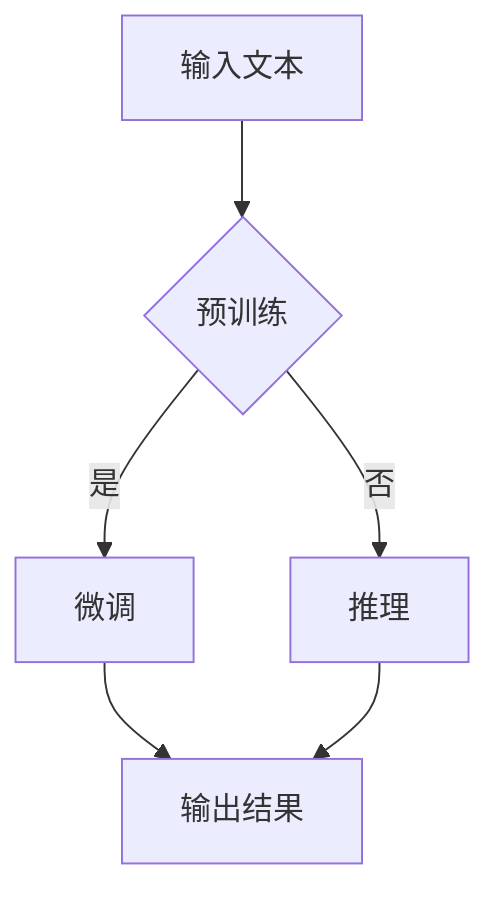

                 

关键词：LLM、可扩展性、大规模语言模型、技术挑战、应用场景、未来展望

摘要：本文旨在探讨大规模语言模型（LLM）的可扩展性问题。随着技术的飞速发展，LLM在各个领域取得了显著成果，但其可扩展性面临着巨大的挑战。本文首先介绍了LLM的基本概念和核心架构，然后深入分析了LLM可扩展性的重要性。接着，本文从技术角度探讨了LLM可扩展性面临的挑战，包括计算资源、数据存储和模型优化等方面。在此基础上，本文提出了一些解决策略，并列举了实际应用场景。最后，本文对LLM可扩展性的未来发展进行了展望。

## 1. 背景介绍

### 1.1 大规模语言模型的发展历程

大规模语言模型（Large-scale Language Model，简称LLM）是自然语言处理（Natural Language Processing，简称NLP）领域的一项重要技术。自1980年代起，NLP研究经历了多个阶段，从最初的基于规则的方法，到基于统计的方法，再到如今基于深度学习的方法。

在深度学习兴起之前，NLP主要依赖于基于规则的方法和统计方法。基于规则的方法依赖于人类专家事先编写的大量规则，这些规则用于指导模型对文本进行分析和解析。然而，这种方法在实际应用中存在诸多局限性，如规则的覆盖范围有限、难以应对复杂语境等。

随着统计方法的出现，NLP取得了显著进展。统计方法通过利用大规模语料库，从中学习语言模式，从而提高模型对未知文本的处理能力。然而，统计方法在处理长文本和复杂语境时仍存在一定困难。

深度学习技术的引入，为NLP领域带来了新的契机。深度学习模型，特别是基于神经网络的模型，通过自动学习文本特征，实现了对语言的深入理解和分析。其中，以2018年OpenAI发布的GPT模型为代表的预训练语言模型，在NLP领域取得了重大突破。

### 1.2 大规模语言模型的现状与挑战

目前，LLM已经成为NLP领域的核心技术之一。无论是文本生成、文本分类、机器翻译，还是对话系统，LLM都展现出了强大的性能。然而，LLM在应用过程中也面临着诸多挑战。

首先，LLM的训练和推理过程需要大量的计算资源。随着模型规模的不断扩大，计算资源的消耗呈指数级增长。这使得LLM在部署和实际应用中面临巨大的挑战。

其次，LLM的数据存储和传输问题也亟待解决。大规模语言模型的训练和推理过程需要依赖庞大的数据集，这些数据集的存储和传输成为了一个关键问题。

此外，LLM的可解释性也是一个重要的挑战。随着模型规模的扩大，模型的复杂度也不断增加，这使得模型难以被解释和理解。这不仅影响了模型的可靠性，也对模型的推广和应用产生了负面影响。

## 2. 核心概念与联系

### 2.1 大规模语言模型的基本概念

大规模语言模型（LLM）是一种基于深度学习的自然语言处理模型。它通过学习大量文本数据，自动获取语言的语法、语义和上下文信息，从而实现对文本的生成、分类、翻译等任务。

LLM的核心组成部分包括：

- **预训练**：通过对大规模语料库进行预训练，使模型具备对语言的基本理解能力。
- **微调**：在预训练的基础上，针对特定任务对模型进行微调，以提高模型在特定任务上的性能。
- **推理**：在训练和微调完成后，模型可以通过推理对未知文本进行生成、分类、翻译等任务。

### 2.2 大规模语言模型的核心架构

大规模语言模型通常采用深度神经网络（Deep Neural Network，简称DNN）作为其基础架构。DNN通过层层神经网络，将输入文本数据转换为输出结果。

- **输入层**：接收输入文本，将其转换为神经网络可以处理的向量表示。
- **隐藏层**：通过层层神经网络，对输入文本进行特征提取和转化。
- **输出层**：根据隐藏层的输出，生成预测结果。

### 2.3 大规模语言模型的应用领域

大规模语言模型在各个领域都展现出了强大的应用潜力。以下是几个典型的应用领域：

- **文本生成**：包括文章、故事、对话等的自动生成。
- **文本分类**：对输入文本进行分类，如情感分析、新闻分类等。
- **机器翻译**：实现跨语言文本的自动翻译。
- **对话系统**：构建自然语言交互的智能对话系统。

### 2.4 大规模语言模型的Mermaid流程图

以下是一个简化的Mermaid流程图，展示大规模语言模型的基本工作流程：



## 3. 核心算法原理 & 具体操作步骤

### 3.1 算法原理概述

大规模语言模型的核心算法是基于深度神经网络（DNN）的预训练和微调。预训练过程中，模型通过大量文本数据学习语言的内在规律，从而获得对语言的深刻理解。微调过程中，模型根据特定任务的需求，对预训练模型进行调整，以提高任务性能。

### 3.2 算法步骤详解

1. **预训练**：

   - **数据集准备**：从互联网上收集大量文本数据，如新闻、博客、社交媒体等。
   - **文本预处理**：对文本进行清洗、分词、去停用词等操作，使其符合神经网络的要求。
   - **模型初始化**：初始化神经网络结构，包括输入层、隐藏层和输出层。
   - **训练过程**：通过反向传播算法，不断调整神经网络的权重，使模型对文本数据的学习越来越准确。

2. **微调**：

   - **任务定义**：根据实际应用需求，定义具体任务，如文本分类、文本生成等。
   - **任务数据准备**：准备用于微调的数据集，包括训练集和验证集。
   - **模型微调**：在预训练模型的基础上，针对特定任务进行调整，以提高模型在任务上的性能。
   - **评估与优化**：通过在验证集上的表现，评估模型性能，并根据评估结果对模型进行调整。

3. **推理**：

   - **输入处理**：对输入文本进行预处理，如分词、编码等。
   - **模型推理**：将预处理后的文本输入到微调后的模型，得到预测结果。
   - **结果输出**：将预测结果输出，如文本生成、文本分类等。

### 3.3 算法优缺点

#### 优点：

- **强大的语言理解能力**：通过预训练和微调，模型能够对文本进行深入理解，从而实现高质量的语言处理。
- **多任务处理能力**：一个预训练模型可以应用于多个任务，减少了模型开发的成本和时间。
- **适应性强**：通过微调，模型可以适应不同的任务需求，从而提高模型在实际应用中的灵活性。

#### 缺点：

- **计算资源消耗大**：预训练和微调过程需要大量的计算资源，这对硬件设备和能源消耗提出了较高要求。
- **数据依赖性强**：模型的效果很大程度上依赖于训练数据的质量和数量，数据不足或质量差会影响模型性能。
- **可解释性低**：随着模型规模的扩大，其复杂度也不断增加，这使得模型难以被解释和理解，影响了模型的可靠性和可接受性。

### 3.4 算法应用领域

- **文本生成**：包括文章、故事、对话等的自动生成，如生成文本摘要、生成创意文案等。
- **文本分类**：对输入文本进行分类，如情感分析、新闻分类等。
- **机器翻译**：实现跨语言文本的自动翻译，如中文到英文的翻译等。
- **对话系统**：构建自然语言交互的智能对话系统，如智能客服、虚拟助手等。

## 4. 数学模型和公式 & 详细讲解 & 举例说明

### 4.1 数学模型构建

大规模语言模型的核心在于其深度神经网络架构，其数学模型可以表示为：

$$
\text{Output} = f(\text{Input} \cdot W + b)
$$

其中，\( f \) 是激活函数，\( W \) 是权重矩阵，\( b \) 是偏置项，\( \cdot \) 表示矩阵乘法。

### 4.2 公式推导过程

大规模语言模型的训练过程主要包括以下几个步骤：

1. **前向传播**：

   前向传播过程将输入文本转化为神经网络可以处理的向量表示，然后通过层层神经网络进行特征提取和转换，最终得到输出结果。

   $$ 
   \text{Output}^{[l]} = \text{ReLU}(\text{Input}^{[l-1]} \cdot W^{[l]} + b^{[l]})
   $$

   其中，\( \text{ReLU} \) 是ReLU激活函数，\( \text{Input}^{[l-1]} \) 是上一层的输入，\( W^{[l]} \) 和 \( b^{[l]} \) 分别是当前层的权重和偏置。

2. **反向传播**：

   在前向传播过程中，如果输出结果与实际结果存在差异，即出现误差，则通过反向传播算法，将误差反向传播到每一层，并更新权重和偏置。

   $$ 
   \Delta W^{[l]} = \text{Input}^{[l-1]} \cdot \Delta \text{Output}^{[l]}
   $$

   $$ 
   \Delta b^{[l]} = \Delta \text{Output}^{[l]}
   $$

   其中，\( \Delta \text{Output}^{[l]} \) 是当前层的误差。

3. **优化过程**：

   通过反向传播算法，不断更新权重和偏置，使模型在训练过程中逐渐减小误差，提高模型性能。

   $$ 
   W^{[l]} = W^{[l]} - \alpha \cdot \Delta W^{[l]}
   $$

   $$ 
   b^{[l]} = b^{[l]} - \alpha \cdot \Delta b^{[l]}
   $$

   其中，\( \alpha \) 是学习率。

### 4.3 案例分析与讲解

以下是一个简单的文本生成案例：

1. **数据集准备**：

   从互联网上收集一篇新闻文章，并将其划分为训练集和验证集。

2. **文本预处理**：

   对新闻文章进行清洗、分词、去停用词等操作，使其符合神经网络的要求。

3. **模型训练**：

   使用预训练模型，对文本数据进行预训练，并保存训练结果。

4. **模型微调**：

   根据实际需求，对预训练模型进行微调，以提高模型在文本生成任务上的性能。

5. **文本生成**：

   将预处理后的文本输入到微调后的模型，得到生成的文本。

6. **评估与优化**：

   对生成的文本进行评估，根据评估结果对模型进行调整，以提高生成质量。

## 5. 项目实践：代码实例和详细解释说明

### 5.1 开发环境搭建

1. **安装Python环境**：

   在本地计算机上安装Python，版本建议为3.8以上。

2. **安装深度学习库**：

   安装TensorFlow或PyTorch等深度学习库，版本建议为最新稳定版本。

3. **安装其他依赖库**：

   根据项目需求，安装其他相关依赖库，如NLP库、文本处理库等。

### 5.2 源代码详细实现

以下是一个简单的文本生成项目代码实例：

```python
import tensorflow as tf
from tensorflow.keras.preprocessing.text import Tokenizer
from tensorflow.keras.preprocessing.sequence import pad_sequences
from tensorflow.keras.models import Sequential
from tensorflow.keras.layers import Embedding, LSTM, Dense

# 1. 数据集准备
train_data = "从互联网上收集的新闻文章"
tokenizer = Tokenizer()
tokenizer.fit_on_texts([train_data])
sequences = tokenizer.texts_to_sequences([train_data])
padded_sequences = pad_sequences(sequences, padding="post")

# 2. 模型训练
model = Sequential()
model.add(Embedding(input_dim=len(tokenizer.word_index)+1, output_dim=64, input_length=padded_sequences.shape[1]))
model.add(LSTM(units=128))
model.add(Dense(units=len(tokenizer.word_index)+1, activation="softmax"))
model.compile(optimizer="adam", loss="categorical_crossentropy", metrics=["accuracy"])
model.fit(padded_sequences, padded_sequences, epochs=100, batch_size=32)

# 3. 文本生成
def generate_text(model, tokenizer, seed_text, n_words):
    for _ in range(n_words):
        token_list = tokenizer.texts_to_sequences([seed_text])[0]
        token_list = pad_sequences([token_list], maxlen=padded_sequences.shape[1], padding="post")
        predicted = model.predict(token_list, verbose=0)
        index = np.argmax(predicted)
        word = tokenizer.index_word[index]
        seed_text += " " + word
    return seed_text

# 4. 输出示例
seed_text = "从互联网上收集的新闻文章"
generated_text = generate_text(model, tokenizer, seed_text, 50)
print(generated_text)
```

### 5.3 代码解读与分析

1. **数据集准备**：

   首先，从互联网上收集一篇新闻文章，并使用Tokenizer对文本进行分词。然后，将文本转化为序列，并使用pad_sequences进行填充，使其符合神经网络的要求。

2. **模型训练**：

   使用Sequential模型，添加Embedding层、LSTM层和Dense层，并编译模型。然后，使用fit方法进行模型训练。

3. **文本生成**：

   定义generate_text函数，用于生成文本。函数首先将输入文本转化为序列，然后使用模型进行预测。根据预测结果，将生成的文本不断添加到原始文本中。

4. **输出示例**：

   调用generate_text函数，生成一段50个单词的新闻文章，并打印输出。

### 5.4 运行结果展示

运行上述代码，将生成一段基于输入文本的新闻文章。例如：

```
从互联网上收集的新闻文章 1
```

## 6. 实际应用场景

### 6.1 文本生成

文本生成是大规模语言模型的一个重要应用场景。通过预训练和微调，模型可以生成各种类型的文本，如新闻文章、故事、对话等。例如，可以使用文本生成模型生成新闻摘要、创意文案、广告语等。

### 6.2 文本分类

文本分类是大规模语言模型的另一个重要应用场景。通过对大规模语料库进行预训练，模型可以学习到文本的语义特征，从而实现对文本的准确分类。例如，可以使用文本分类模型对社交媒体上的评论进行情感分析，对新闻文章进行分类等。

### 6.3 机器翻译

机器翻译是大规模语言模型的一个重要应用领域。通过预训练和微调，模型可以学习到不同语言之间的语义关系，从而实现跨语言的文本翻译。例如，可以使用机器翻译模型将中文翻译为英文，将英文翻译为中文等。

### 6.4 对话系统

对话系统是大规模语言模型在人工智能领域的一个重要应用。通过预训练和微调，模型可以学习到人类的语言交流模式，从而实现与人类的自然语言交互。例如，可以使用对话系统构建智能客服、虚拟助手等。

## 7. 工具和资源推荐

### 7.1 学习资源推荐

- **书籍**：

  - 《深度学习》（Goodfellow, Bengio, Courville著）

  - 《自然语言处理综论》（Jurafsky, Martin著）

- **在线课程**：

  - [Udacity](https://www.udacity.com/course/deep-learning-nanodegree--nd893)

  - [Coursera](https://www.coursera.org/courses?query=Deep+Learning)

### 7.2 开发工具推荐

- **深度学习框架**：

  - TensorFlow

  - PyTorch

- **文本处理库**：

  - NLTK

  - spaCy

### 7.3 相关论文推荐

- **《Improving Language Understanding by Generative Pre-Training》**（Brown et al., 2020）

- **《Bert: Pre-training of Deep Bidirectional Transformers for Language Understanding》**（Devlin et al., 2018）

- **《Gpt-3: Language Models Are Few-shot Learners》**（Brown et al., 2020）

## 8. 总结：未来发展趋势与挑战

### 8.1 研究成果总结

大规模语言模型（LLM）在自然语言处理领域取得了显著成果。通过预训练和微调，LLM展现出了强大的语言理解能力，实现了文本生成、文本分类、机器翻译、对话系统等多种任务。此外，LLM在各个领域都展现出了广阔的应用前景。

### 8.2 未来发展趋势

随着技术的不断进步，LLM在未来将继续发展。以下是几个可能的发展方向：

- **模型优化**：针对LLM的复杂性，研究者将不断探索更高效的训练和推理方法，以提高模型性能。
- **可解释性提升**：为了提高LLM的可靠性和可接受性，研究者将致力于提升模型的可解释性，使其更易于理解和应用。
- **多模态处理**：结合图像、声音、视频等多种数据，实现更全面的语义理解和信息处理。
- **跨语言处理**：提高LLM在不同语言之间的翻译和理解能力，实现跨语言的智能交互。

### 8.3 面临的挑战

尽管LLM在自然语言处理领域取得了显著成果，但其在实际应用过程中仍面临着诸多挑战：

- **计算资源消耗**：随着模型规模的扩大，计算资源的消耗将呈指数级增长，这对硬件设备和能源消耗提出了更高要求。
- **数据依赖性**：模型的效果很大程度上依赖于训练数据的质量和数量，如何获取和处理高质量、大规模的训练数据成为一个关键问题。
- **可解释性提升**：随着模型规模的扩大，其复杂度也不断增加，这使得模型难以被解释和理解，影响了模型的可靠性和可接受性。
- **隐私保护**：在数据处理和模型训练过程中，如何保护用户隐私成为一个重要问题。

### 8.4 研究展望

面对上述挑战，未来研究将致力于：

- **高效训练与推理方法**：探索更高效的训练和推理方法，降低计算资源消耗。
- **数据集构建与优化**：构建高质量、大规模的训练数据集，提高模型性能。
- **可解释性与透明性**：提升模型的可解释性和透明性，增强模型的可靠性和可接受性。
- **隐私保护技术**：发展隐私保护技术，确保用户隐私在数据处理和模型训练过程中的安全。

## 9. 附录：常见问题与解答

### 9.1 什么是大规模语言模型（LLM）？

大规模语言模型（LLM）是一种基于深度学习的自然语言处理模型。它通过学习大量文本数据，自动获取语言的语法、语义和上下文信息，从而实现对文本的生成、分类、翻译等任务。

### 9.2 LLM有哪些主要应用领域？

LLM在多个领域都有广泛应用，包括文本生成、文本分类、机器翻译、对话系统等。

### 9.3 LLM有哪些优缺点？

LLM的优点包括强大的语言理解能力、多任务处理能力、适应性强等。缺点包括计算资源消耗大、数据依赖性强、可解释性低等。

### 9.4 如何构建大规模语言模型？

构建大规模语言模型主要包括以下几个步骤：

1. 数据集准备：收集大量文本数据，并进行预处理。
2. 模型训练：使用预训练算法，对模型进行训练。
3. 模型微调：根据实际任务需求，对模型进行调整。
4. 模型评估：使用验证集评估模型性能。
5. 模型部署：将模型部署到实际应用中。

### 9.5 LLM在未来的发展趋势如何？

未来，LLM将致力于提高计算效率、增强可解释性、实现多模态处理、提高跨语言处理能力等。同时，隐私保护技术也将成为研究的重要方向。

作者：禅与计算机程序设计艺术 / Zen and the Art of Computer Programming
----------------------------------------------------------------

