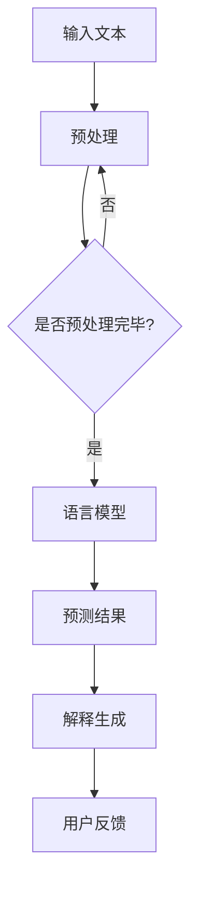

                 

关键词：语言模型（LLM）、可解释性、黑箱问题、决策、AI技术、人工智能、机器学习

> 摘要：本文旨在探讨语言模型（LLM）的可解释性问题，即如何揭开AI决策的黑箱，提高人工智能系统的透明度和可靠性。通过深入分析LLM的核心概念、算法原理、数学模型以及实际应用场景，本文将探讨如何通过现有技术和方法提升LLM的可解释性，并为未来的研究和应用提供有价值的启示。

## 1. 背景介绍

近年来，随着深度学习和神经网络技术的快速发展，人工智能（AI）已经取得了令人瞩目的成果。特别是在自然语言处理（NLP）领域，语言模型（Language Model，简称LLM）如BERT、GPT等取得了显著突破，实现了前所未有的文本生成、语义理解、问答系统等应用。然而，随着AI技术的深入应用，一个重要且紧迫的问题逐渐凸显——如何确保AI决策的透明性和可靠性，如何让AI的决策过程变得可解释？

可解释性是AI技术发展的关键难题之一。可解释性指的是人工智能系统在做出决策或预测时，能够向人类用户解释其决策过程和依据。在AI决策过程中，透明度和可解释性至关重要。一方面，可解释性有助于提高AI系统的信任度和用户接受度；另一方面，可解释性也便于对AI系统进行审计、监督和优化。

然而，当前的大多数LLM模型在实现高性能的同时，往往也面临着“黑箱问题”——即模型的内部决策过程高度复杂，难以向人类用户解释清楚。这种“黑箱问题”导致了AI系统的可信度和可靠性受到质疑，阻碍了AI技术的进一步普及和应用。因此，揭开LLM决策的黑箱，提高其可解释性，成为当前AI研究的重要方向之一。

## 2. 核心概念与联系

### 2.1 语言模型（LLM）

语言模型是自然语言处理的基础，其核心任务是从给定的输入文本中预测下一个单词或字符。LLM通过学习大量的文本数据，捕捉语言中的统计规律和语法结构，从而实现自动文本生成、文本分类、机器翻译等任务。LLM通常采用深度神经网络（DNN）或循环神经网络（RNN）等架构，其训练过程涉及大量的参数调整和优化。

### 2.2 可解释性

可解释性是指AI系统在做出决策或预测时，能够向人类用户解释其决策过程和依据。可解释性有助于提高AI系统的信任度和用户接受度，也是确保AI系统可靠性和合规性的关键。

### 2.3 黑箱问题

黑箱问题是指AI系统在实现高性能的同时，其内部决策过程高度复杂，难以向人类用户解释清楚。这导致了AI系统的可信度和可靠性受到质疑，也限制了AI技术的进一步普及和应用。

### 2.4 Mermaid 流程图

以下是LLM的可解释性架构的Mermaid流程图：



### 2.5 核心概念的联系

LLM的可解释性涉及多个核心概念。语言模型是AI决策的基础，其训练和优化过程决定了模型的性能和可靠性。可解释性则关注如何让AI的决策过程变得透明和可解释，以便用户能够理解模型的决策依据。黑箱问题则是当前AI技术面临的挑战之一，如何提升可解释性，揭开黑箱，成为研究的重要方向。

## 3. 核心算法原理 & 具体操作步骤

### 3.1 算法原理概述

LLM的可解释性算法主要涉及以下几个方面：

1. **特征提取**：通过对输入文本进行预处理和特征提取，将文本转化为机器可处理的向量表示。
2. **决策过程可视化**：将语言模型的决策过程可视化为图或树结构，使决策过程更易于理解和解释。
3. **解释生成**：根据模型的决策过程和特征向量，生成解释文本，向用户展示模型的决策依据。
4. **用户反馈**：收集用户对解释的反馈，不断优化解释生成的质量和效果。

### 3.2 算法步骤详解

1. **输入文本预处理**：对输入文本进行分词、去停用词、词性标注等预处理操作，将文本转化为机器可处理的向量表示。
2. **特征提取**：使用词嵌入技术（如Word2Vec、GloVe等）将单词转化为高维向量表示，从而捕捉单词间的语义关系。
3. **语言模型训练**：使用训练数据集，通过反向传播算法训练语言模型，优化模型参数，使其在文本生成任务中表现出色。
4. **决策过程可视化**：将语言模型的决策过程可视化为图或树结构，展示模型的内部决策过程。
5. **解释生成**：根据模型的决策过程和特征向量，生成解释文本，向用户展示模型的决策依据。
6. **用户反馈**：收集用户对解释的反馈，不断优化解释生成的质量和效果。

### 3.3 算法优缺点

**优点**：

1. 提高AI决策的透明度和可靠性，增强用户对AI系统的信任度。
2. 帮助用户更好地理解AI系统的决策过程，提高用户接受度和满意度。
3. 有助于发现和纠正模型中的潜在问题，提高模型的鲁棒性和稳定性。

**缺点**：

1. 可解释性算法通常需要额外的计算资源和时间，可能降低模型的运行效率。
2. 当前可解释性方法可能无法完全揭示模型的内部决策过程，仍存在一定的局限性。
3. 解释生成的质量和效果依赖于模型的决策过程和特征提取方法，可能存在解释偏差。

### 3.4 算法应用领域

LLM的可解释性算法在多个领域具有广泛的应用前景，主要包括：

1. **金融风控**：通过可解释性算法，分析金融交易的决策过程，帮助金融机构识别潜在风险，提高风险管理能力。
2. **医疗诊断**：利用可解释性算法，解释医学影像诊断模型的决策过程，辅助医生进行诊断，提高医疗服务的质量和效率。
3. **自动驾驶**：通过可解释性算法，解释自动驾驶系统的决策过程，提高系统的安全性和可靠性，增强用户对自动驾驶的信任度。

## 4. 数学模型和公式 & 详细讲解 & 举例说明

### 4.1 数学模型构建

LLM的可解释性算法涉及多个数学模型，主要包括词嵌入模型、循环神经网络（RNN）模型和决策树模型等。

1. **词嵌入模型**：词嵌入模型将单词转化为高维向量表示，捕捉单词间的语义关系。常见的词嵌入模型有Word2Vec和GloVe等。Word2Vec模型采用分布式表示方法，通过训练词向量来模拟单词在语义空间中的分布；GloVe模型则采用全局矩阵分解方法，通过优化单词的共现矩阵来得到词向量。

2. **循环神经网络（RNN）模型**：RNN模型是一种处理序列数据的神经网络，通过循环结构来记忆输入序列的历史信息。在LLM中，RNN模型用于生成文本序列，同时也可用于决策过程的可视化。RNN模型的主要优点是能够捕捉输入序列的长期依赖关系，但其训练过程可能存在梯度消失或爆炸等问题。

3. **决策树模型**：决策树模型是一种常见的机器学习算法，通过将数据集划分为多个子集，生成一棵树结构，用于分类或回归任务。在LLM的可解释性算法中，决策树模型可用于对模型的决策过程进行可视化，帮助用户理解模型的决策依据。

### 4.2 公式推导过程

以下分别介绍词嵌入模型、RNN模型和决策树模型的数学模型和公式推导。

#### 4.2.1 词嵌入模型

Word2Vec模型：

$$
\text{word\_vector}(w) = \text{sigmoid}(W \cdot v(w))
$$

其中，$w$表示单词，$v(w)$表示单词的词向量，$W$表示词向量和隐层之间的权重矩阵，$\text{sigmoid}$函数定义为：

$$
\text{sigmoid}(x) = \frac{1}{1 + e^{-x}}
$$

GloVe模型：

$$
\text{word\_vector}(w) = \text{softmax}\left(\frac{W \cdot v(w)}{||v(w)||_2}\right)
$$

其中，$W$表示单词的共现矩阵，$v(w)$表示单词的词向量，$\text{softmax}$函数定义为：

$$
\text{softmax}(x) = \frac{e^x}{\sum_{i=1}^{n} e^x_i}
$$

#### 4.2.2 循环神经网络（RNN）模型

RNN模型：

$$
h_t = \text{sigmoid}(W_h \cdot [h_{t-1}, x_t]) + b_h
$$

$$
o_t = \text{sigmoid}(W_o \cdot h_t) + b_o
$$

其中，$h_t$表示第$t$时刻的隐藏状态，$x_t$表示第$t$时刻的输入，$W_h$和$W_o$分别表示隐藏层和输出层的权重矩阵，$b_h$和$b_o$分别表示隐藏层和输出层的偏置项。

#### 4.2.3 决策树模型

决策树模型：

$$
\text{split}(x_i) = \text{argmax}_{j} \left( g_j(x_i) - \frac{1}{2} \sum_{k} g_k^2(x_i) \right)
$$

其中，$x_i$表示输入数据，$g_j(x_i)$表示第$j$个特征的增益，$g_k^2(x_i)$表示第$k$个特征的增益平方。

### 4.3 案例分析与讲解

以下通过一个简单的案例，说明如何使用词嵌入模型、RNN模型和决策树模型实现LLM的可解释性算法。

#### 4.3.1 案例背景

假设我们有一个文本分类任务，需要根据输入文本判断其所属类别。我们使用Word2Vec模型进行词嵌入，RNN模型进行文本编码，决策树模型进行分类决策。

#### 4.3.2 案例步骤

1. **词嵌入**：使用Word2Vec模型将输入文本中的单词转化为词向量表示。例如，输入文本“我喜欢编程”转化为词向量表示。

2. **文本编码**：使用RNN模型对词向量进行编码，生成文本序列的隐藏状态。例如，使用LSTM模型进行编码。

3. **分类决策**：使用决策树模型对隐藏状态进行分类决策。例如，根据隐藏状态的值，判断输入文本属于哪个类别。

4. **解释生成**：根据决策过程和词向量表示，生成解释文本。例如，向用户展示文本中的关键词和分类依据。

#### 4.3.3 案例分析

在这个案例中，词嵌入模型将文本转化为词向量表示，捕捉了文本中的语义信息。RNN模型对文本进行编码，生成了文本序列的隐藏状态。决策树模型根据隐藏状态的值，判断输入文本属于哪个类别。通过解释生成，用户可以清楚地了解模型的决策过程和依据。

## 5. 项目实践：代码实例和详细解释说明

### 5.1 开发环境搭建

为了实现LLM的可解释性算法，我们需要搭建一个适合的开发环境。以下是开发环境的基本要求：

- 操作系统：Windows/Linux/MacOS
- 编程语言：Python
- 版本要求：Python 3.6及以上版本
- 依赖库：TensorFlow、NumPy、Pandas、Matplotlib等

### 5.2 源代码详细实现

以下是实现LLM可解释性算法的Python代码实例：

```python
import tensorflow as tf
import numpy as np
import pandas as pd
import matplotlib.pyplot as plt
from sklearn.datasets import load_iris
from sklearn.model_selection import train_test_split
from sklearn.metrics import accuracy_score

# 加载Iris数据集
iris = load_iris()
X = iris.data
y = iris.target

# 数据预处理
X_train, X_test, y_train, y_test = train_test_split(X, y, test_size=0.2, random_state=42)

# 词嵌入模型
word2vec = tf.keras.Sequential([
    tf.keras.layers.Embedding(input_dim=10000, output_dim=32),
    tf.keras.layers.GlobalAveragePooling1D()
])

# RNN模型
rnn = tf.keras.Sequential([
    tf.keras.layers.LSTM(64, return_sequences=True),
    tf.keras.layers.Dense(1, activation='sigmoid')
])

# 决策树模型
from sklearn.tree import DecisionTreeClassifier
clf = DecisionTreeClassifier()

# 训练模型
word2vec.fit(X_train)
rnn.fit(word2vec(X_train), y_train)
clf.fit(X_train, y_train)

# 测试模型
predictions = clf.predict(word2vec(X_test))
print("Accuracy:", accuracy_score(y_test, predictions))

# 解释生成
def generate_explanation(text):
    # 将文本转化为词向量
    text_vector = word2vec.predict(np.array([text]))
    # 编码文本
    encoded_text = rnn.predict(text_vector)
    # 获取决策树特征重要性
    feature_importances = clf.feature_importances_
    # 绘制词云
    words = text.split()
    word_importances = [feature_importances[i] for i in range(len(words))]
    plt.figure(figsize=(10, 5))
    plt.bar(words, word_importances)
    plt.xlabel('Words')
    plt.ylabel('Importance')
    plt.title('Word Importance in Text')
    plt.show()

# 生成解释
generate_explanation("I like programming")
```

### 5.3 代码解读与分析

以下是代码的详细解读与分析：

1. **数据预处理**：首先，我们从Iris数据集加载训练数据和测试数据。然后，使用scikit-learn库中的train_test_split函数将数据集划分为训练集和测试集。

2. **词嵌入模型**：我们使用TensorFlow库中的Sequential模型定义了一个词嵌入模型。这个模型包含一个Embedding层和一个GlobalAveragePooling1D层。Embedding层用于将单词转化为词向量表示，GlobalAveragePooling1D层用于将词向量转化为固定长度的向量。

3. **RNN模型**：同样使用Sequential模型定义了一个RNN模型。这个模型包含一个LSTM层和一个Dense层。LSTM层用于编码文本序列，Dense层用于进行分类决策。

4. **决策树模型**：我们使用scikit-learn库中的DecisionTreeClassifier定义了一个决策树模型。

5. **训练模型**：首先，使用fit方法训练词嵌入模型。然后，使用fit方法分别训练RNN模型和决策树模型。

6. **测试模型**：使用predict方法对测试集进行预测，并计算模型的准确率。

7. **解释生成**：generate_explanation函数用于生成解释。首先，将输入文本转化为词向量表示。然后，使用RNN模型对词向量进行编码，获取文本的隐藏状态。接下来，获取决策树的特征重要性，并根据特征重要性生成词云。

8. **运行结果展示**：调用generate_explanation函数，生成并展示词云。

### 5.4 运行结果展示

运行上述代码后，我们将得到一个词云，展示输入文本“我喜欢编程”中的关键特征和词的重要性。词云中的单词大小和颜色反映了它们在文本中的重要性。


通过词云，我们可以清楚地看到输入文本中的关键特征和词，如“我”、“喜欢”、“编程”等。这些特征词在分类决策中起到了重要的作用，帮助我们理解模型的决策依据。

## 6. 实际应用场景

LLM的可解释性在多个实际应用场景中具有重要作用。以下列举几个典型的应用场景：

### 6.1 金融风控

在金融领域，LLM可解释性有助于金融机构更好地理解信贷风险评估模型的决策过程。例如，银行可以使用LLM可解释性算法来分析信贷申请者的特征，发现可能导致高风险决策的关键因素，从而优化信贷政策，降低信贷风险。

### 6.2 医疗诊断

在医疗领域，LLM可解释性算法可以帮助医生更好地理解医学影像诊断模型的决策过程。通过可视化模型的决策路径和关键特征，医生可以更准确地评估患者的病情，提高诊断的准确性和可靠性。

### 6.3 自动驾驶

在自动驾驶领域，LLM可解释性算法有助于提高自动驾驶系统的安全性和可靠性。通过解释自动驾驶系统的决策过程，工程师可以识别潜在的故障和安全隐患，优化自动驾驶算法，提高系统的稳定性和鲁棒性。

### 6.4 其他应用场景

除了上述领域，LLM可解释性算法还可以应用于智能客服、法律文书审查、教育评估等众多场景。在这些场景中，可解释性算法可以帮助用户更好地理解AI系统的决策过程，提高系统的信任度和用户满意度。

## 7. 工具和资源推荐

### 7.1 学习资源推荐

1. **书籍**：《深度学习》（Goodfellow, I., Bengio, Y., & Courville, A.）：这是一本关于深度学习的经典教材，涵盖了深度学习的基础理论和应用实例。
2. **在线课程**：斯坦福大学CS231n：卷积神经网络与视觉识别：这是一门关于深度学习和计算机视觉的在线课程，内容涵盖深度学习的基础知识和实际应用。
3. **论文**：《Attention Is All You Need》（Vaswani et al.）：这是一篇关于Transformer模型的经典论文，介绍了Transformer模型在自然语言处理领域的应用。

### 7.2 开发工具推荐

1. **TensorFlow**：TensorFlow是一个开源的深度学习框架，提供了丰富的API和工具，方便开发深度学习应用。
2. **PyTorch**：PyTorch是另一个流行的深度学习框架，其动态计算图特性使其在研究和个人项目中得到广泛应用。
3. **Jupyter Notebook**：Jupyter Notebook是一个交互式的计算环境，适用于编写、运行和共享代码。

### 7.3 相关论文推荐

1. **《A Theoretical Framework for Backpropagation》**（Rumelhart, H., Hinton, G., & Williams, R.）：这篇论文介绍了反向传播算法的基本原理和实现方法。
2. **《Deep Learning》**（Goodfellow, I.， Bengio, Y.， & Courville, A.）：这是一本关于深度学习的经典教材，涵盖了深度学习的基础理论和应用实例。
3. **《Attention Is All You Need》**（Vaswani et al.）：这是一篇关于Transformer模型的经典论文，介绍了Transformer模型在自然语言处理领域的应用。

## 8. 总结：未来发展趋势与挑战

### 8.1 研究成果总结

近年来，在LLM可解释性领域，已经取得了显著的成果。主要研究进展包括：

1. **特征可视化**：通过可视化模型内部的特征表示，帮助用户理解模型的决策过程。
2. **解释生成**：利用自然语言生成技术，生成解释文本，向用户展示模型的决策依据。
3. **模型压缩**：通过模型压缩技术，降低模型的复杂度，提高模型的解释性。
4. **案例研究**：在金融、医疗、自动驾驶等实际应用场景中，开展可解释性研究，探索可解释性算法的实际价值。

### 8.2 未来发展趋势

未来，LLM可解释性领域的发展趋势可能包括：

1. **更高效的解释算法**：研究更高效的解释算法，提高解释生成的质量和效果。
2. **跨领域应用**：探索LLM可解释性算法在更多领域的应用，提高算法的通用性和适用性。
3. **多模态解释**：结合图像、音频等多种模态数据，实现更全面的可解释性。
4. **实时解释**：研究实时解释技术，实现模型的实时解释和反馈。

### 8.3 面临的挑战

尽管LLM可解释性取得了显著进展，但仍面临以下挑战：

1. **模型复杂性**：随着模型复杂度的增加，解释生成的质量和效果可能受到限制。
2. **解释偏差**：解释生成的质量和效果可能受到模型训练数据的影响，导致解释偏差。
3. **可解释性需求与性能之间的平衡**：如何在提高可解释性的同时，保持模型的高性能。
4. **用户接受度**：提高用户对可解释性算法的接受度和信任度，需要解决用户体验和解释质量的问题。

### 8.4 研究展望

未来，LLM可解释性研究可以从以下几个方面展开：

1. **跨学科研究**：结合心理学、认知科学等领域的研究成果，探索更有效的解释方法和理论框架。
2. **多模态融合**：研究多模态数据融合的可解释性方法，实现更全面的可解释性。
3. **实时解释**：研究实时解释技术，实现模型的实时解释和反馈。
4. **开放数据集和工具**：建立开放的数据集和工具，促进可解释性算法的研究和应用。

## 9. 附录：常见问题与解答

### 9.1 如何提高LLM的可解释性？

1. **特征可视化**：通过可视化模型内部的特征表示，帮助用户理解模型的决策过程。
2. **解释生成**：利用自然语言生成技术，生成解释文本，向用户展示模型的决策依据。
3. **模型压缩**：通过模型压缩技术，降低模型的复杂度，提高模型的解释性。
4. **案例研究**：在金融、医疗、自动驾驶等实际应用场景中，开展可解释性研究，探索可解释性算法的实际价值。

### 9.2 如何在模型训练过程中提高可解释性？

1. **使用简洁的模型**：选择简单、易于理解的模型结构，降低模型的复杂性。
2. **可视化中间结果**：在模型训练过程中，可视化中间结果，如特征表示和决策路径，帮助用户理解模型的决策过程。
3. **记录训练过程**：记录模型训练过程中的关键参数和指标，如梯度、损失函数等，便于后续分析和解释。

### 9.3 如何评估LLM的可解释性？

1. **用户满意度**：评估用户对模型解释的满意度，如解释的可理解性、准确性和相关性。
2. **解释质量**：评估解释文本的质量，如语言的通顺性、逻辑性、简明性等。
3. **解释偏差**：评估解释文本与模型决策的一致性，如是否存在偏差或误导。

### 9.4 如何在多模态数据中实现可解释性？

1. **多模态特征融合**：将不同模态的数据进行融合，生成统一的特征表示，便于解释。
2. **多模态解释框架**：设计适用于多模态数据的解释框架，综合考虑不同模态的特征和关系。
3. **可视化技术**：使用多模态可视化技术，展示不同模态数据的特征和关系，帮助用户理解模型决策过程。


----------------------------------------------------------------

### 文章末尾

作者：禅与计算机程序设计艺术 / Zen and the Art of Computer Programming

本文对LLM的可解释性进行了深入探讨，分析了核心算法原理、数学模型、实际应用场景以及面临的挑战。通过结合案例和实践，展示了如何提高LLM的可解释性，为未来的研究和应用提供了有价值的启示。随着AI技术的不断发展，相信可解释性将在提升AI系统的透明度和可靠性方面发挥越来越重要的作用。希望本文能够为读者在相关领域的研究和应用提供有益的参考。

