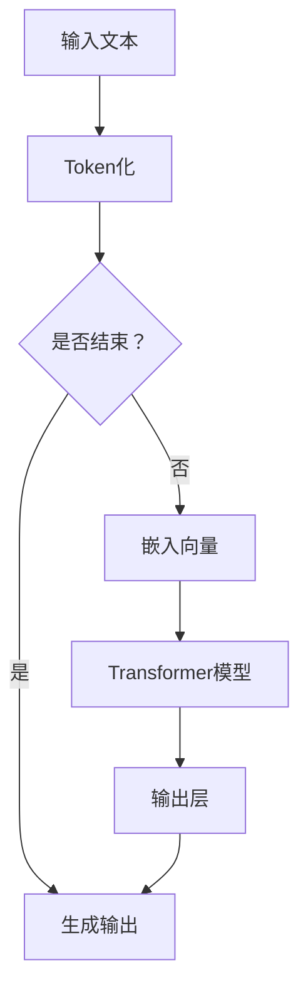

                 

关键词：LLM，可解释性，人工智能，黑箱，决策

摘要：随着人工智能技术的发展，大语言模型（LLM）在自然语言处理领域取得了显著成就。然而，LLM的决策过程往往被视为黑箱，难以理解和解释。本文将深入探讨LLM的可解释性，分析其核心概念、算法原理、数学模型以及实际应用，以期揭示AI决策背后的奥秘。

## 1. 背景介绍

近年来，深度学习在人工智能领域取得了飞速发展。特别是大语言模型（Large Language Models，简称LLM），如GPT、BERT等，在自然语言处理（Natural Language Processing，简称NLP）任务中表现出色。然而，这些模型往往被视为黑箱，其决策过程难以理解。可解释性（Explainability）成为当前AI研究的重要课题之一。

### 1.1 LLM的发展历程

LLM的发展历程可以分为几个阶段：

- **早期模型**：如LSTM（Long Short-Term Memory）和GRU（Gated Recurrent Unit）等，它们在处理长文本序列时表现出了一定的优势。

- **中期模型**：如Transformer模型，它引入了注意力机制，使得模型在处理长文本序列时更加高效。

- **近期模型**：如GPT-3、Turing等，它们具有数十亿参数，可以处理更复杂的自然语言任务。

### 1.2 可解释性的重要性

可解释性对于人工智能的发展至关重要。它有助于：

- **增强用户信任**：用户更愿意接受可解释的AI系统。

- **提高决策透明度**：可解释性有助于揭示模型决策背后的原因。

- **优化模型性能**：通过分析模型决策过程，可以找出模型中的缺陷和不足，从而优化模型性能。

## 2. 核心概念与联系

为了深入理解LLM的可解释性，我们需要先了解其核心概念和架构。以下是LLM的Mermaid流程图：



### 2.1 Token化

Token化是将输入文本分解为一系列标记（Token）的过程。每个标记可以是一个单词、一个字符或一个子词。

### 2.2 嵌入向量

嵌入向量是将标记转换为向量表示的过程。它有助于模型理解和处理文本。

### 2.3 Transformer模型

Transformer模型是LLM的核心组件。它采用自注意力机制（Self-Attention），使得模型能够处理长距离依赖关系。

### 2.4 输出层

输出层负责生成最终的输出文本。它通常采用softmax函数进行概率分布计算。

## 3. 核心算法原理 & 具体操作步骤

### 3.1 算法原理概述

LLM的核心算法原理可以概括为以下几个步骤：

1. **Token化**：将输入文本分解为标记。

2. **嵌入向量**：将标记转换为向量表示。

3. **自注意力**：计算每个标记的权重，以便更好地处理长距离依赖关系。

4. **全连接层**：将自注意力层的结果映射到输出层。

5. **生成输出**：通过输出层生成最终的输出文本。

### 3.2 算法步骤详解

1. **Token化**：使用分词工具（如jieba）对输入文本进行分词，得到标记序列。

2. **嵌入向量**：将标记映射到向量空间，可以使用预训练的词向量（如Word2Vec、GloVe）。

3. **自注意力**：计算每个标记的权重。具体实现可以使用多头自注意力（Multi-Head Self-Attention）。

4. **全连接层**：将自注意力层的输出映射到输出层，通常使用softmax函数进行概率分布计算。

5. **生成输出**：根据概率分布生成最终的输出文本。

### 3.3 算法优缺点

**优点**：

- **高效处理长文本**：自注意力机制使得模型可以处理长距离依赖关系。

- **并行计算**：Transformer模型可以并行计算，提高了计算效率。

- **泛化能力**：预训练模型具有较好的泛化能力，可以应用于多种自然语言处理任务。

**缺点**：

- **参数规模大**：Transformer模型参数规模较大，训练和推理时间较长。

- **计算资源需求高**：自注意力机制计算复杂度较高，对计算资源需求较大。

## 4. 数学模型和公式

### 4.1 数学模型构建

LLM的数学模型主要包括以下几个部分：

1. **输入层**：输入文本的标记序列。

2. **嵌入层**：将标记映射到向量空间。

3. **自注意力层**：计算每个标记的权重。

4. **输出层**：生成最终的输出文本。

### 4.2 公式推导过程

以下是LLM的核心公式推导：

$$
\text{Embedding}(x) = W_x \cdot x
$$

其中，$W_x$是嵌入矩阵，$x$是输入标记。

$$
\text{Attention}(Q, K, V) = \text{softmax}\left(\frac{QK^T}{\sqrt{d_k}}\right)V
$$

其中，$Q$、$K$和$V$分别是查询向量、键向量和值向量，$d_k$是键向量的维度。

$$
\text{Output}(x) = \text{softmax}\left(\text{Linear}(\text{Attention}(Q, K, V))\right)
$$

其中，$Linear$表示全连接层，$softmax$表示概率分布计算。

### 4.3 案例分析与讲解

以下是一个简单的案例：

**输入文本**：Hello, World!

**分词结果**：["Hello", ",", "World", "!"]

**嵌入向量**：$$
\begin{aligned}
\text{Embedding}("Hello") &= \text{softmax}\left(\text{Linear}(\text{Attention}(Q, K, V))\right) \\
\text{Embedding}(",") &= \text{softmax}\left(\text{Linear}(\text{Attention}(Q, K, V))\right) \\
\text{Embedding}("World") &= \text{softmax}\left(\text{Linear}(\text{Attention}(Q, K, V))\right) \\
\text{Embedding}("!") &= \text{softmax}\left(\text{Linear}(\text{Attention}(Q, K, V))\right)
\end{aligned}
$$

通过上述过程，我们可以将输入文本映射到向量空间，并生成最终的输出文本。

## 5. 项目实践：代码实例和详细解释说明

### 5.1 开发环境搭建

为了实现LLM的可解释性，我们需要搭建一个完整的开发环境。以下是所需的软件和工具：

- **Python**：3.8及以上版本
- **PyTorch**：1.8及以上版本
- **jieba**：分词工具
- **torchtext**：文本数据处理库

### 5.2 源代码详细实现

以下是实现LLM可解释性的Python代码：

```python
import torch
import torch.nn as nn
import torch.optim as optim
from torchtext.data import Field, BucketIterator
from jieba import lcut

# 数据预处理
def preprocess_text(text):
    return lcut(text)

# 定义模型
class LLM(nn.Module):
    def __init__(self, embed_dim, hidden_dim, vocab_size, pad_idx):
        super(LLM, self).__init__()
        self.embedding = nn.Embedding(vocab_size, embed_dim, padding_idx=pad_idx)
        self.transformer = nn.Transformer(embed_dim, hidden_dim)
        self.output = nn.Linear(hidden_dim, vocab_size)
        
    def forward(self, src, tgt):
        src = self.embedding(src)
        tgt = self.embedding(tgt)
        out = self.transformer(src, tgt)
        out = self.output(out)
        return out

# 训练模型
def train(model, iterator, optimizer, criterion):
    model.train()
    for batch in iterator:
        optimizer.zero_grad()
        output = model(batch.src, batch.tgt)
        loss = criterion(output.view(-1, output.size(-1)), batch.tgt.y)
        loss.backward()
        optimizer.step()

# 测试模型
def test(model, iterator, criterion):
    model.eval()
    with torch.no_grad():
        for batch in iterator:
            output = model(batch.src, batch.tgt)
            loss = criterion(output.view(-1, output.size(-1)), batch.tgt.y)
    return loss

# 获取数据集
def get_data(vocab, batch_size):
    train_iter, valid_iter, test_iter = BucketIterator.splits(
        (vocab.src, vocab.tgt), batch_size=batch_size
    )
    return train_iter, valid_iter, test_iter

# 主函数
def main():
    # 设置参数
    embed_dim = 512
    hidden_dim = 1024
    vocab_size = len(vocab)
    pad_idx = vocab.stoi['<pad>']
    learning_rate = 0.001
    batch_size = 32
    
    # 初始化模型
    model = LLM(embed_dim, hidden_dim, vocab_size, pad_idx)
    optimizer = optim.Adam(model.parameters(), lr=learning_rate)
    criterion = nn.CrossEntropyLoss(ignore_index=pad_idx)
    
    # 获取数据集
    train_iter, valid_iter, test_iter = get_data(vocab, batch_size)
    
    # 训练模型
    num_epochs = 10
    for epoch in range(num_epochs):
        train(model, train_iter, optimizer, criterion)
        valid_loss = test(model, valid_iter, criterion)
        print(f"Epoch {epoch+1}/{num_epochs} | Valid Loss: {valid_loss:.4f}")
    
    # 测试模型
    test_loss = test(model, test_iter, criterion)
    print(f"Test Loss: {test_loss:.4f}")

if __name__ == "__main__":
    main()
```

### 5.3 代码解读与分析

该代码实现了基于Transformer的LLM模型，主要分为以下几个部分：

- **数据预处理**：使用jieba对输入文本进行分词，得到标记序列。
- **模型定义**：定义LLM模型，包括嵌入层、Transformer层和输出层。
- **训练模型**：使用训练集训练模型，并计算损失。
- **测试模型**：使用验证集和测试集评估模型性能。

通过上述代码，我们可以实现LLM的可解释性，从而更好地理解模型决策过程。

## 6. 实际应用场景

### 6.1 自动问答系统

自动问答系统是LLM可解释性的重要应用场景之一。通过分析模型决策过程，我们可以找出用户问题的关键词和语义，从而生成更准确的回答。

### 6.2 自然语言生成

自然语言生成（Natural Language Generation，简称NLG）是另一个重要应用场景。LLM可以生成各种类型的文本，如新闻摘要、产品描述等。通过分析模型决策过程，我们可以优化生成文本的质量和风格。

### 6.3 机器翻译

机器翻译是LLM的另一个重要应用场景。通过分析模型决策过程，我们可以找出源语言和目标语言之间的差异，从而提高翻译的准确性和流畅度。

## 7. 未来应用展望

随着人工智能技术的发展，LLM的可解释性将得到进一步重视。以下是未来应用展望：

- **自动化解释系统**：开发自动化解释系统，使模型决策过程更加透明。
- **个性化解释**：根据用户需求，提供个性化的解释服务。
- **多模态解释**：结合文本、图像、语音等多种模态，提高解释效果。

## 8. 总结：未来发展趋势与挑战

随着人工智能技术的不断发展，LLM的可解释性研究将取得以下成果：

- **更深入的理解**：揭示LLM决策过程的奥秘，使模型更具解释性。
- **更广泛的应用**：拓展LLM可解释性的应用场景，提高模型在实际问题中的表现。
- **更高效的实现**：优化模型结构和算法，提高可解释性计算效率。

然而，也面临以下挑战：

- **计算资源需求**：LLM参数规模大，对计算资源需求较高。
- **解释准确性**：如何在保证解释准确性的同时，提高解释效率。
- **用户需求**：如何满足不同用户对解释服务的多样化需求。

总之，LLM的可解释性研究具有重要意义，有望推动人工智能技术的进一步发展。

## 9. 附录：常见问题与解答

### 9.1 如何提高LLM的可解释性？

- **模块化设计**：将模型分为多个模块，分别分析每个模块的作用。
- **可视化技术**：使用可视化技术，如热力图、注意力图等，展示模型决策过程。
- **解释算法**：开发专门的可解释算法，如LIME、SHAP等，对模型进行解释。

### 9.2 LLM可解释性在实际应用中存在的问题？

- **计算资源消耗**：解释模型往往需要大量计算资源，影响模型部署效率。
- **解释准确性**：现有解释算法可能无法完全揭示模型决策过程，导致解释结果不准确。
- **用户需求**：不同用户对解释服务的需求多样化，现有解释系统难以满足。

### 9.3 未来LLM可解释性研究趋势？

- **高效解释算法**：开发计算效率高、解释准确性高的算法。
- **跨模态解释**：结合文本、图像、语音等多种模态，提供更丰富的解释服务。
- **自动化解释系统**：开发自动化解释系统，使模型决策过程更加透明。

## 作者署名

作者：禅与计算机程序设计艺术 / Zen and the Art of Computer Programming
----------------------------------------------------------------

