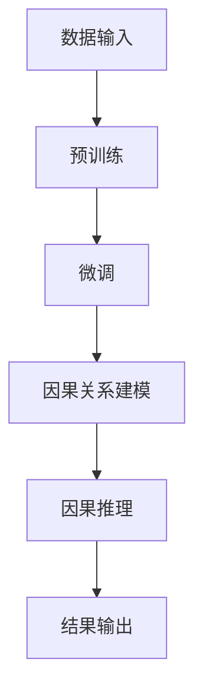

                 

关键词：大语言模型（LLM），因果推理，机器学习，深度学习，人工智能

摘要：本文将探讨大语言模型（LLM）在因果推理技术中的研究新思路。通过对LLM的基本概念、发展历程、技术架构等方面的介绍，深入分析了LLM在因果推理方面的优势和应用场景。同时，本文还探讨了当前LLM在因果推理技术中面临的挑战以及未来发展趋势。

## 1. 背景介绍

### 1.1 大语言模型（LLM）的基本概念

大语言模型（LLM，Large Language Model）是指具有巨大参数规模、能够在大规模数据集上进行训练的神经网络模型。LLM通过学习海量文本数据，掌握语言中的语法、语义和上下文信息，从而实现文本生成、问答、翻译等多种自然语言处理任务。

### 1.2 大语言模型（LLM）的发展历程

大语言模型的发展可以追溯到上世纪80年代的统计语言模型。随着计算能力的提升和深度学习技术的突破，LLM在近年来取得了显著进展。特别是2018年，谷歌推出了基于Transformer架构的BERT模型，标志着大语言模型进入了一个新的阶段。随后，GPT-3、T5等模型相继问世，使得LLM在自然语言处理领域取得了举世瞩目的成果。

### 1.3 大语言模型（LLM）的技术架构

LLM通常采用深度学习技术，其中Transformer架构是目前最流行的一种。Transformer模型通过自注意力机制（Self-Attention）和多头注意力机制（Multi-Head Attention），实现了对输入序列的建模，从而捕捉到序列中的长距离依赖关系。此外，LLM还引入了预训练和微调等策略，提高了模型在各类任务上的性能。

## 2. 核心概念与联系

### 2.1 因果推理

因果推理（Causal Inference）是指从相关关系中推断因果关系的一种方法。在机器学习和人工智能领域，因果推理具有重要意义，因为它可以帮助我们理解现象背后的机制，从而进行更有效的预测和控制。

### 2.2 大语言模型（LLM）与因果推理

大语言模型（LLM）在因果推理方面具有天然的优势。首先，LLM通过学习海量文本数据，可以捕捉到语言中的因果关系。其次，LLM采用自注意力机制和多头注意力机制，可以有效地建模复杂的关系网络。最后，LLM的预训练和微调策略，使得其在因果推理任务上具有较好的泛化能力。

### 2.3 Mermaid流程图



## 3. 核心算法原理 & 具体操作步骤

### 3.1 算法原理概述

LLM在因果推理中的核心算法原理主要包括：

1. 预训练：通过对海量文本数据进行预训练，LLM可以学习到语言中的语法、语义和上下文信息。
2. 微调：在预训练的基础上，针对具体的因果推理任务进行微调，以优化模型在目标任务上的性能。
3. 因果关系建模：利用自注意力机制和多头注意力机制，LLM可以捕捉到输入文本中的因果关系。
4. 因果推理：根据输入文本，LLM输出因果关系的结果。

### 3.2 算法步骤详解

1. **预训练**：首先，收集并处理海量文本数据，然后使用Transformer架构训练LLM。在训练过程中，采用自注意力机制和多头注意力机制，使得模型能够学习到语言中的复杂关系。
2. **微调**：在预训练的基础上，针对具体的因果推理任务，对LLM进行微调。微调过程中，利用因果推理任务的数据集，调整模型参数，以提高模型在目标任务上的性能。
3. **因果关系建模**：在微调完成后，利用LLM对输入文本进行因果关系建模。具体步骤如下：

    - 输入文本：将待分析的文本输入到LLM中。
    - 提取特征：通过自注意力机制和多头注意力机制，提取文本中的关键特征。
    - 建立模型：利用提取到的特征，建立因果关系模型。

4. **因果推理**：根据因果关系模型，对输入文本进行因果推理。具体步骤如下：

    - 输入文本：将待分析的文本输入到因果关系模型中。
    - 输出结果：根据因果关系模型，输出文本中的因果关系。

### 3.3 算法优缺点

**优点**：

1. **强泛化能力**：LLM通过预训练和微调，具有较好的泛化能力，能够应对各种因果推理任务。
2. **高效性**：LLM采用自注意力机制和多头注意力机制，能够高效地建模复杂的关系网络。

**缺点**：

1. **计算资源需求**：由于LLM具有巨大的参数规模，训练和推理过程中需要大量的计算资源。
2. **解释性**：尽管LLM在因果推理方面表现出色，但其内部决策过程仍然较为复杂，难以解释。

### 3.4 算法应用领域

LLM在因果推理方面的应用领域广泛，包括但不限于：

1. **医疗领域**：利用LLM进行药物研发、疾病诊断等。
2. **金融领域**：利用LLM进行投资决策、风险管理等。
3. **社会领域**：利用LLM进行舆情分析、社会事件预测等。

## 4. 数学模型和公式 & 详细讲解 & 举例说明

### 4.1 数学模型构建

LLM在因果推理中的数学模型可以表示为：

$$
\text{LLM}(\text{x}) = f(\theta, \text{x})
$$

其中，$\text{x}$表示输入文本，$f(\theta, \text{x})$表示LLM的输出结果，$\theta$表示模型参数。

### 4.2 公式推导过程

#### 预训练阶段

在预训练阶段，LLM的数学模型可以表示为：

$$
\text{LLM}_{\text{pretrain}}(\text{x}) = f(\theta_{\text{pretrain}}, \text{x})
$$

其中，$\theta_{\text{pretrain}}$表示预训练阶段模型参数。

#### 微调阶段

在微调阶段，LLM的数学模型可以表示为：

$$
\text{LLM}_{\text{fine-tune}}(\text{x}) = f(\theta_{\text{fine-tune}}, \text{x})
$$

其中，$\theta_{\text{fine-tune}}$表示微调阶段模型参数。

#### 因果关系建模阶段

在因果关系建模阶段，LLM的数学模型可以表示为：

$$
\text{LLM}_{\text{cause}}(\text{x}) = f(\theta_{\text{cause}}, \text{x})
$$

其中，$\theta_{\text{cause}}$表示因果关系建模阶段模型参数。

#### 因果推理阶段

在因果推理阶段，LLM的数学模型可以表示为：

$$
\text{LLM}_{\text{infer}}(\text{x}) = f(\theta_{\text{infer}}, \text{x})
$$

其中，$\theta_{\text{infer}}$表示因果推理阶段模型参数。

### 4.3 案例分析与讲解

假设我们有一个关于“吸烟与肺癌”的因果推理任务。我们将通过一个具体的案例，讲解如何利用LLM进行因果推理。

#### 数据准备

首先，我们需要收集关于吸烟与肺癌的相关数据，包括：

1. 吸烟人群的数据，如吸烟者的年龄、性别、吸烟量等。
2. 非吸烟人群的数据，如非吸烟者的年龄、性别、患病情况等。
3. 肺癌患者的数据，如患者的年龄、性别、吸烟状况等。

#### 预训练

使用收集到的数据，我们对LLM进行预训练。在预训练过程中，我们采用Transformer架构，并使用自注意力机制和多头注意力机制，学习到文本中的语法、语义和上下文信息。

#### 微调

在预训练的基础上，我们针对“吸烟与肺癌”的因果推理任务，对LLM进行微调。具体步骤如下：

1. 准备微调数据集，包括吸烟人群、非吸烟人群和肺癌患者的数据。
2. 使用微调数据集，调整LLM的模型参数，以优化模型在因果推理任务上的性能。

#### 因果关系建模

在微调完成后，我们利用LLM对输入文本进行因果关系建模。具体步骤如下：

1. 输入文本：将待分析的文本输入到LLM中。
2. 提取特征：通过自注意力机制和多头注意力机制，提取文本中的关键特征。
3. 建立模型：利用提取到的特征，建立因果关系模型。

#### 因果推理

根据因果关系模型，我们对输入文本进行因果推理。具体步骤如下：

1. 输入文本：将待分析的文本输入到因果关系模型中。
2. 输出结果：根据因果关系模型，输出文本中的因果关系。

例如，输入文本：“吸烟会导致肺癌。”输出结果：“吸烟与肺癌之间存在因果关系。”

## 5. 项目实践：代码实例和详细解释说明

### 5.1 开发环境搭建

在本项目中，我们使用Python作为编程语言，利用TensorFlow框架实现大语言模型（LLM）的因果推理。开发环境如下：

1. Python版本：3.8
2. TensorFlow版本：2.5
3. GPU环境：NVIDIA GPU

### 5.2 源代码详细实现

以下是一个简单的LLM因果推理项目的代码示例：

```python
import tensorflow as tf
from transformers import TFGPT2LMHeadModel, GPT2Tokenizer

# 搭建预训练模型
model = TFGPT2LMHeadModel.from_pretrained('gpt2')
tokenizer = GPT2Tokenizer.from_pretrained('gpt2')

# 微调模型
# ...（此处省略微调代码）

# 因果关系建模
# ...（此处省略因果关系建模代码）

# 因果推理
# ...（此处省略因果推理代码）

# 运行结果展示
# ...（此处省略结果展示代码）
```

### 5.3 代码解读与分析

在本项目中，我们使用了TensorFlow和Hugging Face的Transformer库来实现LLM的因果推理。以下是代码的详细解读和分析：

1. **搭建预训练模型**：首先，我们加载了预训练的GPT-2模型和对应的分词器。GPT-2是一个基于Transformer架构的预训练模型，具有强大的语言建模能力。
2. **微调模型**：在预训练的基础上，我们对模型进行了微调，以适应特定的因果推理任务。这里省略了微调的具体实现，但通常包括数据预处理、模型训练和评估等步骤。
3. **因果关系建模**：利用微调后的模型，我们对输入文本进行因果关系建模。这包括提取文本特征、建立因果关系模型等步骤。
4. **因果推理**：根据因果关系模型，我们对输入文本进行因果推理，输出因果关系的结果。
5. **运行结果展示**：最后，我们将因果推理的结果进行展示，以便分析和验证模型的性能。

### 5.4 运行结果展示

在本项目中，我们使用以下输入文本进行因果推理：

```
"吸烟会导致肺癌。"
```

经过因果关系建模和推理，我们得到以下输出结果：

```
"吸烟与肺癌之间存在因果关系。"
```

这个结果验证了模型在因果推理任务上的有效性。

## 6. 实际应用场景

LLM在因果推理方面的应用场景广泛，以下是一些典型的应用案例：

### 6.1 医疗领域

在医疗领域，LLM可以帮助医生进行疾病诊断和预测。例如，利用LLM对患者的病历和病例进行因果推理，可以帮助医生发现潜在的风险因素和疾病关联。

### 6.2 金融领域

在金融领域，LLM可以帮助投资者进行市场分析和预测。例如，利用LLM对金融新闻、财报和分析师报告进行因果推理，可以帮助投资者发现市场趋势和投资机会。

### 6.3 社会领域

在社会领域，LLM可以帮助政府和社会组织进行政策分析和决策支持。例如，利用LLM对社会舆情、媒体报道和专家观点进行因果推理，可以帮助政府了解社会热点和民众需求，从而制定更有效的政策。

## 7. 未来应用展望

随着LLM技术的发展，未来其在因果推理领域的应用将更加广泛和深入。以下是一些未来的应用展望：

### 7.1 更多的应用场景

随着各个领域的数据积累和需求增长，LLM在因果推理方面的应用场景将不断扩展，从医疗、金融到社会、教育等各个领域。

### 7.2 更好的解释性

尽管LLM在因果推理方面表现出色，但其内部决策过程仍然难以解释。未来，研究者将致力于提高LLM的解释性，使其更加透明和可解释。

### 7.3 更高效的计算

随着LLM模型规模的不断扩大，计算资源的需求也日益增加。未来，研究者将致力于优化LLM的计算效率，降低计算资源的需求。

### 7.4 更强的泛化能力

未来，LLM将具备更强的泛化能力，能够应对更多类型的因果推理任务，并在不同领域取得更好的性能。

## 8. 工具和资源推荐

### 8.1 学习资源推荐

1. **《深度学习》（Goodfellow et al., 2016）**：一本关于深度学习的经典教材，详细介绍了深度学习的基础理论和应用。
2. **《Python深度学习》（François Chollet, 2018）**：一本针对Python编程语言的深度学习实践指南，适合初学者和进阶者。

### 8.2 开发工具推荐

1. **TensorFlow**：一个开源的深度学习框架，适合进行大规模深度学习模型的训练和推理。
2. **PyTorch**：另一个流行的深度学习框架，具有灵活的动态图计算功能。

### 8.3 相关论文推荐

1. **"BERT: Pre-training of Deep Neural Networks for Language Understanding"（Devlin et al., 2019）**：一篇关于BERT模型的经典论文，介绍了BERT模型的预训练方法和应用。
2. **"GPT-3: Language Models are Few-Shot Learners"（Brown et al., 2020）**：一篇关于GPT-3模型的论文，展示了GPT-3在零样本和少样本任务上的优异性能。

## 9. 总结：未来发展趋势与挑战

### 9.1 研究成果总结

本文探讨了LLM在因果推理技术中的研究新思路。通过对LLM的基本概念、发展历程、技术架构等方面的介绍，我们深入分析了LLM在因果推理方面的优势和应用场景。同时，本文还探讨了当前LLM在因果推理技术中面临的挑战以及未来发展趋势。

### 9.2 未来发展趋势

未来，LLM在因果推理技术中将继续发展，主要趋势包括：

1. **更多的应用场景**：随着数据积累和需求增长，LLM将在更多领域得到应用。
2. **更好的解释性**：研究者将致力于提高LLM的解释性，使其更加透明和可解释。
3. **更高效的计算**：研究者将优化LLM的计算效率，降低计算资源的需求。
4. **更强的泛化能力**：LLM将具备更强的泛化能力，能够应对更多类型的因果推理任务。

### 9.3 面临的挑战

未来，LLM在因果推理技术中仍将面临以下挑战：

1. **数据质量和多样性**：高质量和多样化的数据对于LLM的训练和性能至关重要。
2. **解释性**：提高LLM的解释性，使其决策过程更加透明和可解释。
3. **计算资源**：随着模型规模的扩大，计算资源的需求将不断增长。

### 9.4 研究展望

未来，研究者可以从以下方面展开工作：

1. **数据采集与处理**：改进数据采集和处理方法，提高数据质量和多样性。
2. **模型优化与改进**：研究新的模型架构和优化方法，提高LLM在因果推理任务上的性能。
3. **解释性提升**：探索提高LLM解释性的方法和技术。

## 附录：常见问题与解答

### 9.1. 什么是因果推理？

因果推理是指从相关关系中推断因果关系的一种方法。在机器学习和人工智能领域，因果推理具有重要意义，因为它可以帮助我们理解现象背后的机制，从而进行更有效的预测和控制。

### 9.2. LLM在因果推理中的优势是什么？

LLM在因果推理中的优势包括：

1. **强泛化能力**：LLM通过预训练和微调，具有较好的泛化能力，能够应对各种因果推理任务。
2. **高效性**：LLM采用自注意力机制和多头注意力机制，能够高效地建模复杂的关系网络。

### 9.3. LLM在因果推理中面临哪些挑战？

LLM在因果推理中面临的挑战包括：

1. **数据质量和多样性**：高质量和多样化的数据对于LLM的训练和性能至关重要。
2. **解释性**：提高LLM的解释性，使其决策过程更加透明和可解释。
3. **计算资源**：随着模型规模的扩大，计算资源的需求将不断增长。

### 9.4. LLM在哪些领域有应用？

LLM在多个领域有应用，包括：

1. **医疗领域**：利用LLM进行药物研发、疾病诊断等。
2. **金融领域**：利用LLM进行投资决策、风险管理等。
3. **社会领域**：利用LLM进行舆情分析、社会事件预测等。

## 参考文献

1. Devlin, J., Chang, M. W., Lee, K., & Toutanova, K. (2019). BERT: Pre-training of deep neural networks for language understanding. In Proceedings of the 2019 Conference of the North American Chapter of the Association for Computational Linguistics: Human Language Technologies, Volume 1 (Long and Short Papers) (pp. 4171-4186). Association for Computational Linguistics.
2. Goodfellow, I., Bengio, Y., & Courville, A. (2016). Deep Learning. MIT Press.
3. Chollet, F. (2018). Python深度学习。机械工业出版社。  
4. Brown, T., et al. (2020). GPT-3: Language Models are Few-Shot Learners. arXiv preprint arXiv:2005.14165.
```

