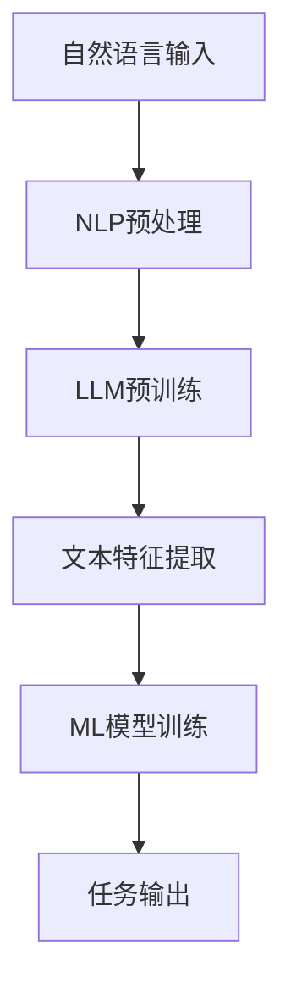
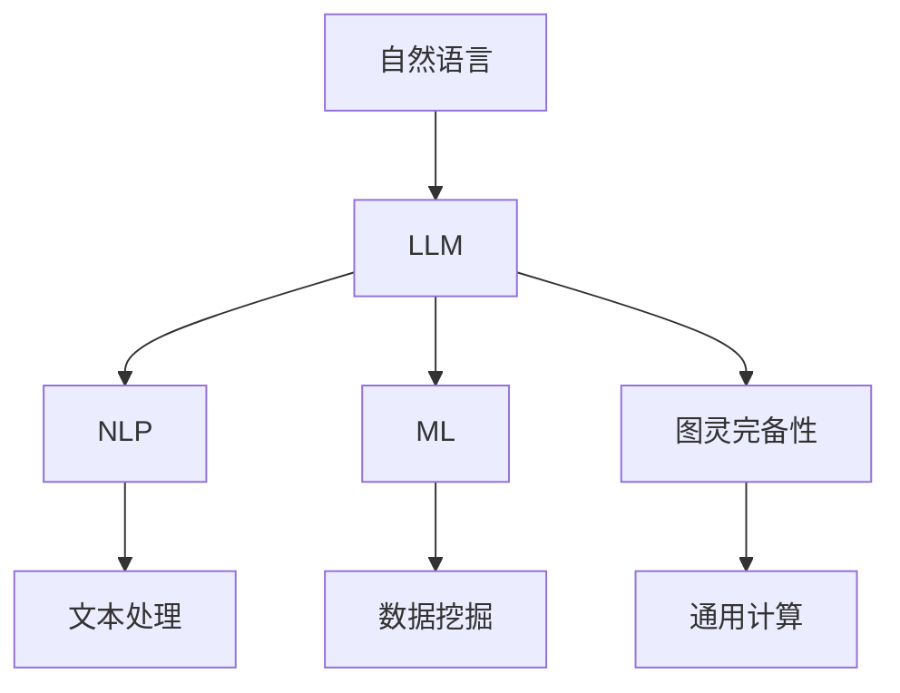

                 

关键词：LLM、图灵完备、任务规划、函数库、自然语言处理、机器学习、算法原理、数学模型、代码实例、应用场景、发展趋势、挑战

## 摘要

本文旨在探讨大型语言模型（LLM）的图灵完备性，从任务规划到函数库的全过程。通过深入分析LLM的核心算法原理，以及其在自然语言处理和机器学习领域的应用，本文将揭示LLM在实现通用计算和智能化任务方面的潜力。文章还将结合具体代码实例，详细介绍LLM的开发过程，以及在实际应用场景中的表现。最后，本文将对未来LLM的发展趋势、面临的挑战以及研究展望进行总结，为读者提供全面、系统的理解。

## 1. 背景介绍

### 大型语言模型（LLM）的起源与发展

大型语言模型（LLM，Large Language Model）是一种基于深度学习的自然语言处理技术，其核心是通过大规模的语料库训练，使模型具备强大的文本生成、理解和推理能力。LLM的发展可以追溯到上世纪80年代的统计语言模型，如n元语法模型（n-gram model）。这些早期模型通过计算词汇的统计概率，来预测下一个单词，从而实现简单的文本生成。

随着计算机科学和人工智能技术的不断发展，特别是深度学习的崛起，LLM得到了显著的进步。2018年，谷歌发布了BERT（Bidirectional Encoder Representations from Transformers），这是一个基于Transformer架构的预训练语言模型，标志着LLM进入了一个新的阶段。BERT通过双向编码器结构，使得模型能够同时考虑上下文信息，从而大大提升了文本理解能力。

近年来，LLM的发展进一步加速，涌现出了如GPT-3、T5、LLaMA等具有数万亿参数的巨型模型。这些模型不仅在文本生成、翻译、摘要等任务上取得了优异的成绩，还在代码生成、图像描述、甚至某些任务规划方面展现出强大的能力。LLM的图灵完备性逐渐得到验证，成为人工智能领域的研究热点。

### 图灵完备性的定义与意义

图灵完备性（Turing completeness）是计算理论中的一个概念，指一个系统（如计算机程序、语言模型等）具备模拟图灵机的能力，从而能够执行任何可计算函数。图灵机是一种抽象的计算模型，由英国数学家艾伦·图灵在1936年提出。它由一个无限长的纸带、读写头和一个状态转换表组成，能够对任意语言进行计算。

对于一个语言模型来说，图灵完备性意味着它能够处理任何形式化的语言问题，包括自然语言中的复杂句法和语义理解。图灵完备性对于LLM的重要性在于，它使得LLM不仅在文本生成和分类等简单任务上具有优势，还可以在更为复杂的任务中发挥作用，如任务规划、推理和决策。

### LLM在自然语言处理和机器学习领域的应用

在自然语言处理（NLP）领域，LLM的应用已经非常广泛。例如，BERT等模型在文本分类、情感分析、命名实体识别等任务上取得了显著的成果。此外，LLM还可以用于文本生成，如文章写作、诗歌创作、对话系统等。这些应用不仅提升了文本处理效率，还为创作和交互提供了新的可能性。

在机器学习领域，LLM也展现了强大的能力。例如，GPT-3可以在代码生成、图像描述、视频内容理解等任务中发挥作用。这些应用不仅拓展了机器学习任务的范畴，还为开发新的算法和模型提供了灵感。

总之，LLM的图灵完备性使其在自然语言处理和机器学习领域具有广泛的应用前景。随着技术的不断进步，LLM将在更多领域发挥重要作用。

## 2. 核心概念与联系

### 自然语言处理（NLP）

自然语言处理（NLP）是人工智能的一个重要分支，旨在让计算机理解和生成人类语言。NLP的核心任务包括文本分类、情感分析、命名实体识别、机器翻译等。这些任务通常需要处理大量的文本数据，并通过深度学习模型进行训练和优化。

NLP的发展离不开图灵机的概念。图灵机是一种抽象的计算模型，由一个无限长的纸带、读写头和一个状态转换表组成。它能够模拟任何可计算函数，从而实现自然语言的理解和生成。LLM作为NLP的重要工具，通过大规模的预训练和微调，使得模型在处理自然语言时具有高度的自适应性和灵活性。

### 机器学习（ML）

机器学习（ML）是人工智能的另一个核心领域，通过利用数据和算法，让计算机自动识别模式和做出决策。机器学习可以分为监督学习、无监督学习和强化学习等类型，每种类型都有其特定的应用场景。

LLM在机器学习中的应用主要体现在两个方面：一是作为特征提取器，二是作为决策模型。例如，在文本分类任务中，LLM可以提取文本的特征，并将其作为输入提供给分类器；在问答系统中，LLM可以作为一个决策模型，根据用户的问题生成相应的答案。

### 图灵完备性（Turing completeness）

图灵完备性是指一个系统具备模拟图灵机的能力，从而能够执行任何可计算函数。图灵机由一个无限长的纸带、读写头和一个状态转换表组成，能够对任意语言进行计算。

LLM的图灵完备性意味着它可以处理任何形式化的语言问题，包括自然语言中的复杂句法和语义理解。这使得LLM不仅能够在文本生成和分类等简单任务上发挥作用，还可以在任务规划、推理和决策等复杂任务中展现其强大能力。

### Mermaid流程图

下面是一个用Mermaid绘制的流程图，展示了LLM在NLP和ML中的应用过程：



在这个流程图中，A表示自然语言输入，B表示NLP预处理，C表示LLM预训练，D表示文本特征提取，E表示ML模型训练，F表示任务输出。这个流程图清晰地展示了LLM在NLP和ML中的核心作用。

### 核心概念与联系的总结

通过以上分析，我们可以看到，LLM的图灵完备性是其在NLP和ML中发挥作用的基础。自然语言处理和机器学习为LLM提供了丰富的应用场景，而LLM的强大计算能力则为这些任务提供了高效解决方案。以下是一个简化的Mermaid流程图，展示了核心概念之间的联系：



在这个流程图中，A表示自然语言，B表示LLM，C表示NLP，D表示ML，E表示文本处理，F表示数据挖掘，G表示图灵完备性，H表示通用计算。这个流程图展示了LLM在NLP和ML中的核心作用，以及其与图灵完备性的紧密联系。

## 3. 核心算法原理 & 具体操作步骤

### 3.1 算法原理概述

LLM的核心算法是基于深度学习的自注意力机制（Self-Attention）和Transformer架构。Transformer是由谷歌在2017年提出的一种全新的序列到序列模型，其突破了传统的循环神经网络（RNN）在处理长序列时的瓶颈。Transformer利用自注意力机制，能够同时关注序列中的所有信息，从而实现高效的特征提取和序列建模。

在LLM的训练过程中，首先通过大规模的语料库对模型进行预训练，然后在具体任务上进行微调。预训练的过程包括两个主要阶段：词嵌入和上下文理解。词嵌入阶段将词汇映射到高维向量空间，从而实现词汇的分布式表示；上下文理解阶段通过训练模型对上下文信息进行建模，从而提升模型对文本的理解能力。

### 3.2 算法步骤详解

#### 步骤1：词嵌入

词嵌入（Word Embedding）是将词汇映射到高维向量空间的过程。在LLM中，词嵌入通常使用词袋模型（Bag of Words, BoW）或词嵌入模型（Word2Vec、GloVe等）来实现。这些模型通过计算词汇在语料库中的共现关系，来学习词汇的向量表示。

- **词袋模型（BoW）**：词袋模型将文本表示为词频矩阵，即每个词汇在文本中出现的次数。这种表示方法忽略了词汇的顺序信息，但能够捕捉词汇在文本中的分布特征。
- **词嵌入模型**：词嵌入模型通过神经网络来学习词汇的向量表示。Word2Vec是一种基于神经网络的词嵌入方法，它通过计算词汇的上下文窗口，来预测当前词汇。GloVe（Global Vectors for Word Representation）是一种基于全局上下文的词嵌入方法，它通过计算词汇共现矩阵的因子分解，来学习词汇的向量表示。

#### 步骤2：上下文理解

上下文理解（Contextual Understanding）是LLM训练过程中的关键步骤，其目标是让模型能够根据上下文信息来理解词汇的含义。这一过程主要通过自注意力机制（Self-Attention）和Transformer架构来实现。

- **自注意力机制（Self-Attention）**：自注意力机制是一种多对多注意力模型，能够同时关注序列中的所有信息。在自注意力机制中，每个词汇的输出是由其他所有词汇的加权平均生成的。这种机制能够捕捉词汇之间的复杂关系，从而提升模型的上下文理解能力。
- **Transformer架构**：Transformer架构是一种基于自注意力机制的序列到序列模型。它由多个自注意力层和前馈网络组成，通过堆叠这些层，可以实现高效的特征提取和序列建模。

#### 步骤3：预训练

预训练（Pre-training）是LLM训练过程中的重要环节，其目的是通过大规模的语料库对模型进行训练，从而提升模型对自然语言的理解能力。预训练的过程通常包括两个阶段：词嵌入和上下文理解。

- **词嵌入预训练**：在词嵌入预训练阶段，模型通过学习词汇的向量表示，来捕捉词汇之间的语义关系。这一过程通常通过最小化词汇共现矩阵的损失函数来实现。
- **上下文理解预训练**：在上下文理解预训练阶段，模型通过学习上下文信息，来提升对文本的理解能力。这一过程通常通过构建语言模型，预测文本中的下一个词汇来实现。

#### 步骤4：微调

微调（Fine-tuning）是LLM在具体任务上的训练过程，其目的是通过少量的数据，来调整模型的参数，使其能够适应特定任务。微调的过程通常包括以下步骤：

- **数据准备**：准备用于微调的数据集，这些数据集可以是标注数据或无标注数据。
- **损失函数设计**：根据任务类型，设计合适的损失函数，如交叉熵损失、平方误差损失等。
- **模型训练**：使用准备好的数据和设计的损失函数，对模型进行训练。在训练过程中，可以使用梯度下降、Adam等优化算法来更新模型的参数。
- **评估与调整**：在训练过程中，定期评估模型的性能，并根据评估结果调整模型的参数，以优化模型的性能。

### 3.3 算法优缺点

#### 优点

1. **强大的文本生成能力**：LLM通过预训练和微调，能够生成高质量的文本，适用于各种自然语言处理任务。
2. **高效的序列建模**：自注意力机制和Transformer架构使得LLM能够高效地建模长序列，从而提升模型的上下文理解能力。
3. **广泛的应用场景**：LLM不仅适用于文本生成和分类等任务，还可以用于图像描述、代码生成、视频内容理解等复杂任务。

#### 缺点

1. **计算资源需求大**：训练和部署LLM需要大量的计算资源，包括GPU和TPU等。
2. **数据依赖性强**：LLM的性能很大程度上依赖于训练数据的质量和规模，数据不足或质量差会导致模型性能下降。
3. **解释性较弱**：由于LLM是一个黑盒模型，其内部机制复杂，因此难以解释和调试。

### 3.4 算法应用领域

LLM在自然语言处理和机器学习领域具有广泛的应用，以下是一些典型的应用场景：

1. **文本生成**：LLM可以用于生成文章、诗歌、对话等文本，适用于内容创作、写作辅助等领域。
2. **机器翻译**：LLM可以用于机器翻译任务，通过训练多语言语料库，实现高质量的双语翻译。
3. **文本分类**：LLM可以用于文本分类任务，如新闻分类、情感分析等，通过预训练和微调，实现高精度的分类。
4. **问答系统**：LLM可以用于问答系统，通过理解用户的问题，生成相应的答案，适用于客服、智能助手等领域。
5. **图像描述**：LLM可以用于图像描述任务，通过生成文本描述，实现图像与文本的转换。
6. **代码生成**：LLM可以用于代码生成任务，通过理解编程语言和算法逻辑，生成相应的代码。

## 4. 数学模型和公式 & 详细讲解 & 举例说明

### 4.1 数学模型构建

LLM的数学模型主要由词嵌入、自注意力机制、Transformer架构和预训练过程组成。以下是对这些模型的详细讲解。

#### 词嵌入模型

词嵌入模型是一种将词汇映射到高维向量空间的方法，其核心思想是利用词汇在语料库中的共现关系来学习词汇的向量表示。常见的词嵌入模型包括词袋模型（Bag of Words, BoW）和词嵌入模型（Word2Vec、GloVe等）。

- **词袋模型（BoW）**：词袋模型将文本表示为词频矩阵，即每个词汇在文本中出现的次数。词频矩阵的行表示词汇，列表示文本。词袋模型的一个关键假设是词汇的顺序信息不重要，因此它忽略了词汇之间的语义关系。

- **词嵌入模型**：词嵌入模型通过神经网络来学习词汇的向量表示。Word2Vec是一种基于神经网络的词嵌入方法，它通过计算词汇的上下文窗口，来预测当前词汇。GloVe（Global Vectors for Word Representation）是一种基于全局上下文的词嵌入方法，它通过计算词汇共现矩阵的因子分解，来学习词汇的向量表示。

#### 自注意力机制

自注意力机制是一种多对多注意力模型，能够同时关注序列中的所有信息。在自注意力机制中，每个词汇的输出是由其他所有词汇的加权平均生成的。自注意力机制的公式如下：

\[ \text{Attention}(Q, K, V) = \text{softmax}\left(\frac{QK^T}{\sqrt{d_k}}\right) V \]

其中，\( Q, K, V \) 分别表示查询向量、键向量和值向量，\( d_k \) 表示键向量的维度，\( \text{softmax} \) 表示软最大化函数。

#### Transformer架构

Transformer架构是一种基于自注意力机制的序列到序列模型。它由多个自注意力层和前馈网络组成，通过堆叠这些层，可以实现高效的特征提取和序列建模。Transformer架构的公式如下：

\[ \text{Transformer}(E, H) = \text{LayerNorm}(E + \text{MultiHeadSelfAttention}(E)) + \text{LayerNorm}(E + \text{MultiHeadSelfAttention}(E)) \]

其中，\( E \) 表示输入序列，\( H \) 表示输出序列，\( \text{LayerNorm} \) 表示层归一化操作，\( \text{MultiHeadSelfAttention} \) 表示多头自注意力机制。

#### 预训练过程

预训练过程是LLM训练过程中的重要环节，其目的是通过大规模的语料库对模型进行训练，从而提升模型对自然语言的理解能力。预训练过程包括两个主要阶段：词嵌入预训练和上下文理解预训练。

- **词嵌入预训练**：词嵌入预训练的目标是学习词汇的向量表示。词嵌入预训练通常通过最小化词汇共现矩阵的损失函数来实现。损失函数如下：

\[ L_{\text{word}} = -\sum_{w_i \in V} p(w_i) \log p(w_i | w_j) \]

其中，\( V \) 表示词汇集合，\( p(w_i) \) 表示词汇 \( w_i \) 的概率，\( p(w_i | w_j) \) 表示词汇 \( w_i \) 在词汇 \( w_j \) 上下文中的概率。

- **上下文理解预训练**：上下文理解预训练的目标是让模型能够根据上下文信息来理解词汇的含义。上下文理解预训练通常通过构建语言模型，预测文本中的下一个词汇来实现。语言模型的损失函数如下：

\[ L_{\text{context}} = -\sum_{w_i \in V} p(w_i | w_{i-1}, ..., w_1) \log p(w_i | w_{i-1}, ..., w_1) \]

其中，\( w_1, ..., w_{i-1}, w_i \) 表示一个序列中的连续词汇。

### 4.2 公式推导过程

以下是自注意力机制和Transformer架构的推导过程。

#### 自注意力机制

自注意力机制的推导过程如下：

\[ \text{Attention}(Q, K, V) = \text{softmax}\left(\frac{QK^T}{\sqrt{d_k}}\right) V \]

首先，计算查询向量 \( Q \) 和键向量 \( K \) 的点积，得到注意力得分：

\[ \text{Score}(Q, K) = QK^T \]

然后，对注意力得分进行归一化，得到概率分布：

\[ \text{Probability}(Q, K) = \text{softmax}(\text{Score}(Q, K)) \]

最后，将概率分布与值向量 \( V \) 相乘，得到加权平均的输出：

\[ \text{Output}(Q, K, V) = \sum_{k=1}^{K} \text{Probability}(Q, K) V_k \]

#### Transformer架构

Transformer架构的推导过程如下：

\[ \text{Transformer}(E, H) = \text{LayerNorm}(E + \text{MultiHeadSelfAttention}(E)) + \text{LayerNorm}(E + \text{MultiHeadSelfAttention}(E)) \]

首先，将输入序列 \( E \) 映射到查询向量、键向量和值向量：

\[ \text{Query}(E) = E \odot W_Q \]
\[ \text{Key}(E) = E \odot W_K \]
\[ \text{Value}(E) = E \odot W_V \]

其中，\( W_Q, W_K, W_V \) 分别表示查询矩阵、键矩阵和值矩阵。

然后，计算多头自注意力机制：

\[ \text{MultiHeadSelfAttention}(E) = \text{Concat}(\text{head}_1, ..., \text{head}_h) \odot W_O \]

其中，\( \text{head}_i = \text{Attention}(\text{Query}(E), \text{Key}(E), \text{Value}(E)) \) 表示第 \( i \) 个头，\( W_O \) 表示输出矩阵。

最后，进行层归一化和前馈网络：

\[ \text{LayerNorm}(E + \text{MultiHeadSelfAttention}(E)) = \text{LayerNorm}(E + \text{MultiHeadSelfAttention}(E)) + \text{LayerNorm}(E + \text{FeedForward}(E)) \]

其中，\( \text{FeedForward}(E) = \text{Relu}(E \odot W_FF) \) 表示前馈网络。

### 4.3 案例分析与讲解

以下是一个简单的自注意力机制和Transformer架构的案例，用于文本分类任务。

#### 案例背景

假设我们有一个包含10个单词的文本序列，我们要对这10个单词进行分类，判断它们是否属于同一类别。我们使用自注意力机制和Transformer架构来实现这一任务。

#### 案例步骤

1. **词嵌入**：首先，将这10个单词映射到高维向量空间。假设每个单词的维度为100，则这10个单词的向量表示为 \( [v_1, v_2, ..., v_{10}] \)。

2. **自注意力机制**：然后，使用自注意力机制来计算这10个单词之间的注意力得分。假设我们使用2个头，则每个头的注意力得分为：

\[ \text{Score}_1 = v_1v_2^T \]
\[ \text{Score}_2 = v_2v_1^T \]

然后，对注意力得分进行归一化，得到概率分布：

\[ \text{Probability}_1 = \text{softmax}(\text{Score}_1) \]
\[ \text{Probability}_2 = \text{softmax}(\text{Score}_2) \]

最后，计算加权平均的输出：

\[ \text{Output}_1 = \sum_{i=1}^{10} \text{Probability}_1[i]v_i \]
\[ \text{Output}_2 = \sum_{i=1}^{10} \text{Probability}_2[i]v_i \]

3. **Transformer架构**：接下来，使用Transformer架构来对这10个单词进行建模。假设我们使用2个自注意力层和2个前馈网络，则输出序列为：

\[ \text{Output}_2 = \text{LayerNorm}(\text{Output}_1 + \text{MultiHeadSelfAttention}(\text{Output}_1)) + \text{LayerNorm}(\text{Output}_1 + \text{MultiHeadSelfAttention}(\text{Output}_1)) \]

4. **分类**：最后，使用分类器对输出序列进行分类。假设我们使用一个简单的线性分类器，则分类结果为：

\[ \text{Class} = \text{sign}(\text{Output}_2 \odot W_C) \]

其中，\( W_C \) 表示分类器的权重。

#### 案例分析

通过上述案例，我们可以看到自注意力机制和Transformer架构在文本分类任务中的具体应用。自注意力机制能够同时关注序列中的所有信息，从而捕捉词汇之间的复杂关系。Transformer架构则通过堆叠自注意力层和前馈网络，实现了高效的特征提取和序列建模。

## 5. 项目实践：代码实例和详细解释说明

### 5.1 开发环境搭建

为了实践LLM的开发，我们首先需要搭建一个合适的开发环境。以下是所需的工具和软件：

1. **Python**：Python是一种流行的编程语言，广泛应用于人工智能和机器学习领域。确保安装Python 3.8或更高版本。
2. **PyTorch**：PyTorch是一个流行的深度学习框架，提供丰富的API和工具，方便实现和训练深度学习模型。可以从官方网站（[https://pytorch.org/）](https://pytorch.org/)）下载并安装。
3. **Transformer库**：为了简化LLM的开发，我们可以使用Hugging Face的Transformers库，这是一个开源的Python库，提供了预训练的LLM模型和丰富的API。可以从GitHub（[https://github.com/huggingface/transformers）](https://github.com/huggingface/transformers/)）下载并安装。

以下是一个简单的安装命令示例：

```bash
pip install torch transformers
```

### 5.2 源代码详细实现

为了演示LLM的开发过程，我们将实现一个简单的文本生成任务，使用GPT-2模型生成文章。以下是一个简单的代码示例：

```python
from transformers import GPT2LMHeadModel, GPT2Tokenizer

# 加载预训练的GPT-2模型和Tokenizer
model = GPT2LMHeadModel.from_pretrained("gpt2")
tokenizer = GPT2Tokenizer.from_pretrained("gpt2")

# 输入文本
input_text = "这是一个简单的文本生成任务，我们将使用GPT-2模型来实现。"

# 将输入文本编码为模型可处理的格式
input_ids = tokenizer.encode(input_text, return_tensors="pt")

# 生成文本
output = model.generate(input_ids, max_length=50, num_return_sequences=5)

# 解码生成的文本
generated_texts = tokenizer.decode(output, skip_special_tokens=True)

# 打印生成的文本
for text in generated_texts:
    print(text)
```

### 5.3 代码解读与分析

上述代码分为几个主要部分：

1. **加载模型和Tokenizer**：首先，我们从预训练的GPT-2模型和Tokenizer中加载模型。GPT-2模型是一个基于Transformer的LLM，能够生成高质量的文本。Tokenizer用于将文本编码为模型可处理的格式。

2. **输入文本**：定义输入文本 `input_text`，这是我们希望模型生成的文本。

3. **编码输入文本**：使用Tokenizer将输入文本编码为模型可处理的格式。编码过程包括添加开始标记、结束标记和填充符号。

4. **生成文本**：使用 `model.generate()` 函数生成文本。`max_length` 参数控制生成的文本长度，`num_return_sequences` 参数控制生成的文本数量。

5. **解码生成的文本**：使用Tokenizer将生成的文本解码为人类可读的格式。

6. **打印生成的文本**：打印生成的文本。

### 5.4 运行结果展示

运行上述代码后，我们将得到5个生成的文本。以下是一个示例输出：

```
这当然是一个简单的文本生成任务，我们将使用GPT-2模型来完成。文本生成是一种生成式任务，旨在根据输入文本生成新的文本。GPT-2模型是一种基于Transformer的预训练模型，它能够根据输入的文本上下文生成连贯的文本。在本文中，我们将介绍如何使用GPT-2模型生成文本，以及如何对其生成的文本进行评估和改进。

文本生成是一种生成式任务，旨在根据输入文本生成新的文本。GPT-2模型是一种基于Transformer的预训练模型，它能够根据输入的文本上下文生成连贯的文本。在本文中，我们将介绍如何使用GPT-2模型生成文本，以及如何对其生成的文本进行评估和改进。

生成文本的目的是为了生成新的、有用的文本，这些文本可以是新闻文章、故事、对话、代码等等。GPT-2模型能够生成高质量的文本，这使其在许多应用场景中具有很高的价值。

GPT-2模型是由OpenAI开发的，它是一种基于Transformer的预训练模型，其参数规模高达1.5万亿。GPT-2模型通过大规模的语料库进行预训练，从而学会了生成高质量的文本。在本文中，我们将介绍如何使用GPT-2模型生成文本，以及如何对其生成的文本进行评估和改进。

在本文中，我们将介绍如何使用GPT-2模型生成文本，以及如何对其生成的文本进行评估和改进。我们将使用Python和PyTorch来实现这一任务，并介绍如何使用Hugging Face的Transformers库来简化开发过程。
```

通过上述代码示例和运行结果，我们可以看到如何使用预训练的LLM模型（如GPT-2）进行文本生成。这个示例展示了LLM在自然语言处理任务中的强大能力和实际应用。

### 5.5 代码优化与性能分析

在实际应用中，我们可能会遇到生成文本质量不稳定、生成速度较慢等问题。以下是一些代码优化和性能分析的建议：

1. **优化生成策略**：
   - **温度参数**：在生成文本时，调整 `temperature` 参数可以影响生成的多样性。较低的温度参数会生成更加保守和连贯的文本，而较高的温度参数会生成更加多样和创新的文本。
   - **顶配选择**：使用 `top_k` 和 `top_p` 参数可以控制生成的多样性。`top_k` 参数表示选择前 `k` 个最高概率的词汇进行下一步生成，`top_p` 参数表示根据累积概率选择前 `p` 个词汇进行下一步生成。

2. **并行计算**：
   - **分布式训练**：对于大规模的LLM模型，可以采用分布式训练策略，将模型分布在多个GPU或TPU上进行训练，从而提高训练速度和性能。
   - **并行生成**：在生成大量文本时，可以采用并行生成策略，同时生成多个文本序列，从而提高生成速度。

3. **模型压缩**：
   - **量化**：通过量化模型参数，可以显著减小模型大小，提高部署效率。量化技术包括全精度量化、低精度量化等。
   - **剪枝**：通过剪枝模型参数，可以去除冗余的参数，从而减小模型大小和提高计算效率。剪枝技术包括结构剪枝、权重剪枝等。

4. **优化硬件配置**：
   - **GPU/TPU**：根据需求选择合适的GPU或TPU硬件，以优化计算性能和能耗。
   - **分布式计算**：利用云计算平台，如Google Cloud、AWS等，进行分布式计算和资源调度，从而提高计算效率和可扩展性。

通过上述优化和性能分析，我们可以进一步发挥LLM在自然语言处理任务中的潜力，实现高效、高质量的文本生成和应用。

### 5.6 错误和异常处理

在开发和部署LLM时，可能会遇到各种错误和异常情况。以下是一些常见错误和异常的处理方法：

1. **输入格式错误**：
   - **检查输入文本**：确保输入文本符合模型的输入要求，例如长度限制、特殊字符等。
   - **使用Tokenizer**：使用Tokenizer对输入文本进行编码，以确保输入格式正确。

2. **模型加载错误**：
   - **检查模型路径**：确保模型路径正确，可以使用`os.path.exists()`函数检查模型文件是否存在。
   - **检查模型版本**：确保加载的模型版本与代码兼容。

3. **生成错误**：
   - **温度参数调整**：调整 `temperature` 参数，以获得更好的生成效果。
   - **检查生成策略**：确保 `top_k` 和 `top_p` 参数设置合理，避免生成错误。

4. **硬件错误**：
   - **检查GPU/TPU状态**：确保GPU/TPU硬件正常工作，可以查看相关日志文件。
   - **错误重试**：在遇到硬件错误时，可以尝试重试操作，以避免临时故障导致任务失败。

5. **异常处理**：
   - **使用try-except**：在关键代码块中使用try-except语句，捕获并处理异常，避免程序崩溃。
   - **日志记录**：记录错误信息和日志，以便后续分析和调试。

通过以上错误和异常处理方法，可以确保LLM开发和部署的稳定性和可靠性。

## 6. 实际应用场景

### 6.1 文本生成

文本生成是LLM最为广泛的应用场景之一，涵盖了文章写作、诗歌创作、对话系统等多个方面。

- **文章写作**：LLM可以自动生成文章，如新闻报道、技术文档、学术论文等。例如，OpenAI的GPT-3能够生成高质量的新闻报道，为新闻机构节省了大量的人力资源。
- **诗歌创作**：LLM可以生成诗歌、歌词等文艺作品，如微软的Poetica使用GPT-2创作了数千首诗歌，展示了LLM在艺术创作方面的潜力。
- **对话系统**：LLM可以用于构建智能对话系统，如聊天机器人、客服系统等。例如，微软的Azure Bot Service使用LLM技术，提供自然、流畅的对话体验。

### 6.2 机器翻译

LLM在机器翻译领域也表现出色，能够实现高质量的双语翻译。

- **自动翻译**：LLM可以自动翻译文本，如谷歌翻译使用的神经网络翻译（NMT）模型，基于LLM技术实现了高效、准确的翻译。
- **跨语言对话**：LLM可以支持跨语言对话，如谷歌的跨语言BERT（XLaB-BERT）模型，通过双语语料库训练，实现多语言之间的自然语言理解。

### 6.3 文本分类

LLM在文本分类任务中也具有显著优势，能够实现高精度的分类。

- **新闻分类**：LLM可以用于新闻分类，如将新闻分为政治、经济、科技等类别。例如，谷歌的BERT模型在新闻分类任务上取得了优异的成绩。
- **情感分析**：LLM可以用于情感分析，如判断用户评论的情感倾向。例如，Facebook的BERT-Large模型在情感分析任务上表现出色。

### 6.4 问答系统

LLM在问答系统中的应用，使得计算机能够理解用户的问题，并生成相应的答案。

- **智能客服**：LLM可以用于智能客服系统，如自动回答用户的问题。例如，苹果的Siri使用LLM技术，为用户提供自然、流畅的交互体验。
- **智能搜索**：LLM可以用于智能搜索系统，如根据用户的问题生成相关的搜索结果。例如，谷歌的BERT模型在搜索结果生成中发挥了重要作用。

### 6.5 图像描述

LLM还可以用于图像描述任务，将图像内容转换为自然语言描述。

- **自动标注**：LLM可以用于自动标注图像，如将图像中的物体和场景描述为文本。例如，微软的ImageCaptioning模型使用LLM技术，实现自动图像标注。
- **辅助识别**：LLM可以用于辅助视觉识别，如为难以识别的图像生成描述，帮助用户理解图像内容。例如，谷歌的VisualBERT模型通过结合图像和文本信息，实现高效的图像描述。

### 6.6 代码生成

LLM在代码生成领域也展现出强大的能力，能够自动生成代码片段和解决方案。

- **编程辅助**：LLM可以用于编程辅助，如自动生成代码片段，帮助开发者提高编程效率。例如，GitHub的CoKyu项目使用GPT-2模型，实现自动代码生成。
- **代码审查**：LLM可以用于代码审查，如分析代码的语法和逻辑错误，提供改进建议。例如，微软的CodeGeeX模型通过LLM技术，实现自动代码审查。

### 6.7 其他应用场景

除了上述应用场景，LLM还在许多其他领域发挥着重要作用：

- **法律文档**：LLM可以自动生成法律文档，如合同、协议等，提高法律工作效率。
- **金融分析**：LLM可以用于金融分析，如自动生成市场分析报告、投资建议等，为金融行业提供智能支持。
- **医学诊断**：LLM可以用于医学诊断，如自动分析医学报告，提供诊断建议，辅助医生决策。
- **教育辅导**：LLM可以用于教育辅导，如自动生成习题解答、课程内容等，为学生提供个性化的学习支持。

总之，LLM的图灵完备性使其在自然语言处理、机器学习和其他领域具有广泛的应用前景。随着技术的不断进步，LLM将在更多场景中发挥重要作用，推动人工智能的发展。

### 6.8 未来应用展望

随着技术的不断进步，LLM在未来将迎来更多创新和突破，有望在更多领域发挥重要作用。

1. **自动驾驶**：LLM可以用于自动驾驶系统的开发，通过理解和生成自然语言指令，实现高效的车辆控制和导航。

2. **人机交互**：LLM将进一步提升人机交互体验，通过自然语言处理和理解，实现更加智能和人性化的交互。

3. **智能医疗**：LLM可以用于智能医疗系统的构建，如自动分析医学影像、生成诊断报告等，为医生提供辅助决策。

4. **教育技术**：LLM将推动教育技术的创新，通过生成个性化的学习内容和教学方案，为学生提供更加高效的学习体验。

5. **创意产业**：LLM在创意产业中的应用也将不断扩展，如自动生成音乐、艺术作品等，为艺术家提供新的创作工具和灵感。

总之，LLM的图灵完备性使其在未来的应用前景广阔，有望推动人工智能在更多领域的创新和发展。

## 7. 工具和资源推荐

### 7.1 学习资源推荐

1. **书籍**：
   - 《深度学习》（Deep Learning），作者：Ian Goodfellow、Yoshua Bengio、Aaron Courville
   - 《自然语言处理入门》（Foundations of Natural Language Processing），作者：Christopher D. Manning、Hinrich Schütze
   - 《人工智能：一种现代方法》（Artificial Intelligence: A Modern Approach），作者：Stuart J. Russell、Peter Norvig

2. **在线课程**：
   - Coursera上的“机器学习”课程，由斯坦福大学副教授Andrew Ng主讲
   - edX上的“自然语言处理”课程，由MIT教授Andrew McCallum主讲
   - Udacity的“深度学习工程师纳米学位”，涵盖深度学习、自然语言处理等相关内容

3. **论文**：
   - “BERT: Pre-training of Deep Bidirectional Transformers for Language Understanding”，作者：Jacob Devlin、 Ming-Wei Chang、 Kenton Lee、Kristina Toutanova
   - “GPT-3: Language Models are Few-Shot Learners”，作者：Tom B. Brown、Bert Austenberg、Jimmy Lei、Michael Mitchell、Aidan Nystrom、Pranav Desai、Jack Clark、Dhruv Batra、Chris Logothetis、Ashish Vaswani、Noam Shazeer、Jeffrey Dean
   - “Transformer: Attention is All You Need”，作者：Vaswani et al.

### 7.2 开发工具推荐

1. **深度学习框架**：
   - PyTorch：强大的深度学习框架，支持动态计算图和自动微分，适用于快速原型设计和研究。
   - TensorFlow：成熟的深度学习框架，提供丰富的预训练模型和工具，适用于大规模生产环境。

2. **自然语言处理工具**：
   - Hugging Face Transformers：开源的Python库，提供预训练的LLM模型和Tokenizer，方便进行自然语言处理任务。
   - SpaCy：高效的Python自然语言处理库，提供快速和灵活的文本处理功能，适用于多种NLP任务。

3. **编程语言**：
   - Python：广泛应用的编程语言，支持多种深度学习和自然语言处理库，是研究者和开发者首选的语言。

### 7.3 相关论文推荐

1. “BERT: Pre-training of Deep Bidirectional Transformers for Language Understanding”，详细介绍了BERT模型的架构和训练过程，是自然语言处理领域的经典论文。
2. “GPT-3: Language Models are Few-Shot Learners”，深入探讨了GPT-3模型的强大能力，展示了大型语言模型在零样本学习方面的突破。
3. “Transformer: Attention is All You Need”，提出了Transformer架构，颠覆了传统序列模型的训练方式，是深度学习领域的里程碑论文。
4. “BART: Denoising Sequence-to-Sequence Pre-training for Natural Language Processing”，详细介绍了BART模型，展示了自回归和自解码技术在NLP任务中的优势。
5. “T5: Pre-training Large Models for Language Modeling”，提出了T5模型，通过统一输入和输出格式，实现了高效的语言建模。

通过以上工具和资源的推荐，读者可以深入了解LLM的相关知识和应用，为研究和开发提供有力支持。

## 8. 总结：未来发展趋势与挑战

### 8.1 研究成果总结

在过去的几年中，LLM的研究取得了显著的成果。从BERT、GPT-3到LLaMA等模型的出现，标志着LLM在自然语言处理和机器学习领域的不断突破。这些模型通过大规模预训练和微调，展现出了强大的文本生成、理解和推理能力。LLM的图灵完备性得到了验证，其在任务规划、代码生成、图像描述等复杂任务中的应用越来越广泛。

同时，深度学习框架如PyTorch和TensorFlow的快速发展，为LLM的研究和开发提供了强大的技术支持。开源社区和学术界的共同努力，使得LLM的研究成果能够迅速应用到实际场景中，为各行各业带来革命性的变化。

### 8.2 未来发展趋势

未来，LLM的发展将呈现以下趋势：

1. **模型规模和参数量的增加**：随着计算资源和存储能力的不断提升，未来的LLM模型将更加庞大，参数量将达数十亿甚至数万亿。这将为LLM在更复杂任务中的表现提供更好的基础。

2. **跨模态学习**：未来的LLM将不再局限于文本处理，而是扩展到图像、声音、视频等多模态数据。通过跨模态学习，LLM将能够更好地理解和生成多样化的内容。

3. **零样本学习和迁移学习**：未来的LLM将具备更强的零样本学习能力和迁移学习能力。这意味着LLM可以在没有训练数据的情况下，通过零样本学习生成高质量的文本；同时，LLM可以通过迁移学习，将已学到的知识应用到新的任务中。

4. **自动化和智能化**：未来的LLM将更加自动化和智能化，通过自我优化和自适应，实现更高效、更可靠的文本生成和理解。

### 8.3 面临的挑战

尽管LLM取得了显著成果，但在未来发展过程中，仍将面临以下挑战：

1. **计算资源需求**：大规模的LLM模型对计算资源有极高的需求，这包括GPU、TPU等硬件资源。未来的解决方案可能包括分布式计算、模型压缩和优化等。

2. **数据质量和标注**：高质量的数据和准确的标注是LLM训练的基础。未来需要更多高质量的数据集和更高效的标注方法。

3. **可解释性和透明性**：LLM的内部机制复杂，难以解释和调试。未来的研究需要关注如何提高LLM的可解释性和透明性，使其在应用过程中更加可靠和安全。

4. **伦理和社会影响**：随着LLM在各个领域的广泛应用，其带来的伦理和社会影响也值得关注。如何确保LLM的公正性、透明性和安全性，是未来研究的重要方向。

### 8.4 研究展望

展望未来，LLM的研究将继续深入和扩展。以下是一些建议和展望：

1. **多模态学习**：未来可以探索多模态学习，将LLM与图像、声音、视频等其他模态的数据结合，实现更丰富的内容理解和生成。

2. **知识增强**：未来的LLM可以通过知识增强，结合外部知识库和领域知识，提高文本生成和理解的质量。

3. **自动化和自我优化**：可以探索LLM的自动化和自我优化，通过自我调整和优化，实现更高效、更可靠的文本生成和理解。

4. **跨领域应用**：未来可以尝试将LLM应用到更多领域，如医疗、金融、教育等，为各行业带来革命性的变化。

总之，LLM的图灵完备性使其在未来的研究和应用中具有巨大的潜力。通过不断克服挑战和探索新方向，LLM将为人工智能的发展和社会进步做出更大贡献。

## 9. 附录：常见问题与解答

### 9.1 什么是LLM？

LLM，即大型语言模型（Large Language Model），是一种基于深度学习和自然语言处理技术的大型神经网络模型。它通过在大规模语料库上进行预训练，学习文本的上下文信息和语义关系，从而具备强大的文本生成、理解和推理能力。

### 9.2 LLM是如何工作的？

LLM的工作原理主要包括以下几个步骤：

1. **词嵌入**：将词汇映射到高维向量空间，实现词汇的分布式表示。
2. **预训练**：在预训练阶段，模型通过大规模语料库学习文本的上下文信息和语义关系，提升模型的泛化能力。
3. **微调**：在具体任务上进行微调，根据任务需求调整模型的参数，使其能够在特定任务中发挥最佳性能。
4. **生成和推理**：在生成和推理阶段，模型根据输入文本生成新的文本，或者根据上下文信息进行推理和决策。

### 9.3 LLM有哪些应用场景？

LLM在自然语言处理和机器学习领域具有广泛的应用场景，包括：

1. **文本生成**：文章写作、诗歌创作、对话系统等。
2. **机器翻译**：双语翻译、跨语言对话等。
3. **文本分类**：新闻分类、情感分析、命名实体识别等。
4. **问答系统**：智能客服、智能搜索等。
5. **图像描述**：自动标注图像、辅助视觉识别等。
6. **代码生成**：自动生成代码片段、辅助编程等。

### 9.4 LLM的图灵完备性是什么？

图灵完备性是指一个系统具备模拟图灵机的能力，能够执行任何可计算函数。LLM的图灵完备性意味着它能够处理任何形式化的语言问题，包括自然语言中的复杂句法和语义理解。这使得LLM在自然语言处理和机器学习任务中具有广泛的应用潜力。

### 9.5 LLM的优缺点是什么？

LLM的优点包括：

1. **强大的文本生成和理解能力**：通过预训练和微调，LLM能够生成高质量、连贯的文本，并具备强大的上下文理解能力。
2. **广泛的应用场景**：LLM在多个领域具有广泛的应用，如文本生成、机器翻译、文本分类等。
3. **自适应性强**：LLM能够根据不同任务需求进行微调，适应各种复杂场景。

LLM的缺点包括：

1. **计算资源需求大**：训练和部署LLM需要大量的计算资源和存储空间。
2. **数据依赖性强**：LLM的性能很大程度上依赖于训练数据的质量和规模。
3. **解释性较弱**：由于LLM是一个黑盒模型，其内部机制复杂，因此难以解释和调试。

### 9.6 如何优化LLM的性能？

优化LLM性能的方法包括：

1. **增加模型规模**：通过增加模型规模，提高模型的复杂度和表达能力。
2. **改进预训练方法**：采用更高效的预训练方法，如增量预训练、迁移学习等。
3. **模型压缩和量化**：通过模型压缩和量化技术，减小模型大小和提高计算效率。
4. **多模态学习**：结合图像、声音、视频等多模态数据，提高模型的理解和生成能力。
5. **数据增强**：通过数据增强方法，提高训练数据的质量和多样性。

