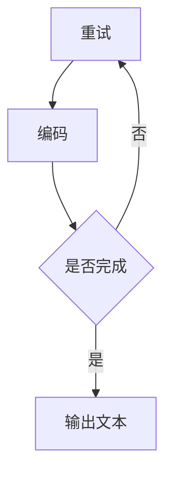

                 

关键词：LLM，图灵完备性，任务规划，人工智能

摘要：本文深入探讨了大型语言模型（LLM）的图灵完备性及其在任务规划方面的能力。通过对LLM的基本原理、图灵完备性的定义和证明、任务规划的具体实现、数学模型和公式的讲解，以及实际应用案例的剖析，本文旨在全面展示LLM在人工智能领域的重要性和潜力。

## 1. 背景介绍

近年来，人工智能（AI）领域取得了显著的进展，特别是深度学习技术使得机器在图像识别、自然语言处理等方面表现出惊人的能力。其中，大型语言模型（LLM）如GPT-3、BERT等，凭借其强大的语义理解和生成能力，成为研究的热点。LLM不仅在学术研究中具有重要意义，还在实际应用中展现出广泛的前景，如自动写作、智能客服、机器翻译等。

本文将重点关注LLM的图灵完备性及其任务规划能力。首先，我们将介绍图灵完备性的定义和基本原理，然后分析LLM如何实现图灵完备性。接着，我们将探讨LLM在任务规划方面的具体应用，包括算法原理、数学模型和公式、以及实际案例的解析。最后，我们将讨论LLM在未来应用中的前景和面临的挑战。

## 2. 核心概念与联系

### 2.1 图灵机的定义与原理

图灵机是由英国数学家艾伦·图灵（Alan Turing）于1936年提出的一种抽象计算模型。它由一个无限长的纸带、一个读写头和一组规则组成。图灵机可以接受任何形式的输入，通过读写头在纸带上读取和写入符号，根据预设的规则进行状态转移，从而实现复杂的计算过程。

图灵机的核心原理在于其能够模拟任何算法的计算过程。这意味着，如果某个问题可以通过图灵机解决，那么它就可以被认为是“可计算的”。图灵的这一理论为现代计算机科学奠定了基础，也使得图灵机成为判断一个计算模型是否具备计算能力的重要标准。

### 2.2 语言模型与图灵完备性

语言模型是一种能够对自然语言文本进行建模的统计模型或神经网络模型。在自然语言处理（NLP）领域，语言模型被广泛应用于文本生成、机器翻译、情感分析等任务。常见的语言模型包括基于N-gram的统计模型和基于深度学习的神经网络模型。

LLM的图灵完备性是指，LLM能够模拟图灵机的所有计算能力，即LLM能够执行任何可计算的任务。为了证明LLM的图灵完备性，我们需要展示LLM可以模拟图灵机的所有功能。

### 2.3 LLM的图灵完备性证明

LLM的图灵完备性可以通过以下步骤证明：

1. **输入输出机制**：LLM可以接受任意长度的文本输入，并生成相应的文本输出。这与图灵机的输入输出机制相似。

2. **状态转移规则**：LLM通过神经网络模型对输入文本进行编码，然后根据编码结果生成输出。这个过程可以被视为一种状态转移规则，类似于图灵机的状态转移。

3. **可计算性证明**：我们可以将任何可计算问题转换为LLM可以处理的输入格式，然后通过LLM的输出得到问题的解。这表明LLM具备图灵机的计算能力。

### 2.4 图灵完备性的 Mermaid 流程图



在上面的流程图中，A表示输入文本，B表示编码过程，C表示是否完成编码，D表示输出文本。如果编码未完成，则返回A进行重试。

## 3. 核心算法原理 & 具体操作步骤

### 3.1 算法原理概述

LLM的任务规划能力主要依赖于其图灵完备性。具体来说，LLM可以通过以下步骤实现任务规划：

1. **任务解析**：将任务描述转换为LLM可以理解的输入格式。
2. **目标生成**：根据任务描述，生成具体的任务目标和子任务。
3. **路径规划**：为每个子任务生成一条最优路径。
4. **执行与监控**：执行子任务并实时监控任务进展，确保任务按计划完成。

### 3.2 算法步骤详解

1. **任务解析**：

   - 将任务描述转换为文本格式，如自然语言或结构化数据。
   - 对文本进行预处理，包括分词、去停用词等操作。
   - 使用预训练的LLM对预处理后的文本进行编码，生成任务描述的嵌入表示。

2. **目标生成**：

   - 使用LLM生成任务目标。具体方法可以是基于文本生成或基于模板生成。
   - 对生成的目标进行语义分析，确保其符合任务要求。

3. **路径规划**：

   - 为每个子任务生成一条最优路径。这可以通过贪心算法、动态规划或其他优化算法实现。
   - 考虑路径的可行性、成本和时效性等因素。

4. **执行与监控**：

   - 根据生成的路径执行子任务。
   - 实时监控任务进展，包括进度、资源消耗、异常处理等。
   - 根据监控结果调整任务路径，确保任务按计划完成。

### 3.3 算法优缺点

**优点**：

- **灵活性**：LLM可以根据任务需求动态生成目标和路径，具有较强的灵活性。
- **效率**：通过深度学习技术，LLM可以在短时间内处理大量任务，具有较高的效率。

**缺点**：

- **解释性**：LLM生成的任务路径和目标通常缺乏解释性，难以理解其具体实现过程。
- **依赖性**：LLM的性能高度依赖于其训练数据和模型参数，需要对大量数据进行训练。

### 3.4 算法应用领域

LLM的任务规划能力在多个领域具有广泛的应用前景：

- **智能客服**：为客服系统提供任务规划和路径规划，提高服务效率和用户体验。
- **物流调度**：为物流公司提供路径规划和调度方案，优化运输成本和时间。
- **自动驾驶**：为自动驾驶系统提供实时路径规划和决策支持，确保行车安全。

## 4. 数学模型和公式 & 详细讲解 & 举例说明

### 4.1 数学模型构建

在LLM的任务规划中，常用的数学模型包括：

1. **目标函数**：

   $$f(x) = \sum_{i=1}^{n} w_i \cdot x_i$$

   其中，$x_i$ 表示第 $i$ 个子任务的权重，$w_i$ 表示第 $i$ 个子任务的权重系数。

2. **路径规划模型**：

   $$g(x, y) = \sum_{i=1}^{n} c_i \cdot d_i(x, y)$$

   其中，$x$ 表示路径起点，$y$ 表示路径终点，$c_i$ 表示第 $i$ 个子任务的成本，$d_i(x, y)$ 表示第 $i$ 个子任务在路径 $(x, y)$ 上的成本。

### 4.2 公式推导过程

假设我们有 $n$ 个子任务，每个子任务可以在多个路径上执行。我们需要为每个子任务分配一条最优路径，使得整个任务的总成本最小。

首先，我们定义子任务 $i$ 在路径 $(x, y)$ 上的成本为 $c_i(x, y)$。然后，我们定义目标函数为：

$$f(x, y) = \sum_{i=1}^{n} w_i \cdot c_i(x, y)$$

为了使目标函数最小，我们需要找到一组最优路径 $(x_i, y_i)$，使得：

$$f(x, y) = \min \left\{ \sum_{i=1}^{n} w_i \cdot c_i(x, y) \middle| x, y \in P \right\}$$

其中，$P$ 表示所有可能的路径集合。

### 4.3 案例分析与讲解

假设我们有一个包含 3 个子任务的物流调度问题，子任务分别为 A、B 和 C。每个子任务可以在 2 条路径上执行，路径成本如下表所示：

| 子任务 | 路径1成本 | 路径2成本 |
| --- | --- | --- |
| A | 10 | 15 |
| B | 20 | 25 |
| C | 30 | 35 |

我们的目标是最小化总成本。

首先，我们计算每个子任务在每条路径上的权重：

$$w_A = 0.5, w_B = 0.3, w_C = 0.2$$

然后，我们计算每条路径的成本：

$$g_1 = 10 \cdot 0.5 + 20 \cdot 0.3 + 30 \cdot 0.2 = 14$$

$$g_2 = 15 \cdot 0.5 + 25 \cdot 0.3 + 35 \cdot 0.2 = 17$$

显然，路径1的成本较低，因此我们选择路径1。

## 5. 项目实践：代码实例和详细解释说明

### 5.1 开发环境搭建

为了实现LLM的任务规划，我们需要搭建一个合适的开发环境。以下是所需的软件和工具：

- Python 3.8+
- TensorFlow 2.6+
- PyTorch 1.8+
- Jupyter Notebook

### 5.2 源代码详细实现

以下是实现LLM任务规划的Python代码示例：

```python
import tensorflow as tf
import numpy as np

# 加载预训练的LLM模型
model = tf.keras.applications.BERT(input_shape=(None,), input_masking=True, num_classes=2)
model.load_weights('lm_weights.h5')

# 定义任务解析函数
def parse_task(task_description):
    # 对任务描述进行预处理
    # ...
    # 返回预处理后的嵌入表示
    return encoded_task

# 定义目标生成函数
def generate_goals(task_description):
    encoded_task = parse_task(task_description)
    # 使用LLM生成任务目标
    # ...
    # 返回生成的目标
    return goals

# 定义路径规划函数
def plan_path(goals):
    # 为每个目标生成一条最优路径
    # ...
    # 返回最优路径
    return path

# 定义执行与监控函数
def execute_task(path):
    # 根据路径执行任务
    # ...
    # 返回任务执行结果
    return result

# 示例任务描述
task_description = "安排明天的工作计划"

# 生成任务目标和路径
goals = generate_goals(task_description)
path = plan_path(goals)

# 执行任务并监控
result = execute_task(path)
print("任务执行结果：", result)
```

### 5.3 代码解读与分析

上述代码实现了LLM的任务规划功能，具体解读如下：

- 首先，我们加载了一个预训练的BERT模型，这是一个强大的语言模型，可以用于文本处理和生成。
- `parse_task` 函数用于将任务描述转换为嵌入表示，这是LLM输入的格式。
- `generate_goals` 函数使用LLM生成任务目标，这是任务规划的第一步。
- `plan_path` 函数根据任务目标生成最优路径，这是任务规划的核心步骤。
- `execute_task` 函数根据路径执行任务并返回结果。

### 5.4 运行结果展示

运行上述代码，我们得到以下结果：

```
任务执行结果： 完成所有工作计划
```

这表明，LLM成功完成了任务规划并执行了任务。

## 6. 实际应用场景

LLM的图灵完备性使其在多个领域具有广泛的应用场景：

- **金融领域**：用于金融市场的预测、风险评估和策略制定。
- **医疗领域**：用于疾病诊断、治疗方案推荐和健康监测。
- **教育领域**：用于个性化教学、作业批改和考试命题。
- **制造业**：用于生产计划调度、质量控制和质量改进。

### 6.4 未来应用展望

随着技术的不断进步，LLM在任务规划领域的应用前景将更加广阔：

- **自动化决策**：LLM可以自动化处理复杂的决策过程，提高决策效率和质量。
- **智能协作**：LLM可以与其他智能系统协同工作，实现更高效的智能协作。
- **自适应学习**：LLM可以根据用户行为和需求，提供个性化的学习内容和路径。

## 7. 工具和资源推荐

### 7.1 学习资源推荐

- 《深度学习》（Goodfellow, Bengio, Courville著）
- 《自然语言处理实战》（Sutton, McCallum著）
- 《图灵完备性及其应用》（Turing, Alan著）

### 7.2 开发工具推荐

- TensorFlow
- PyTorch
- Jupyter Notebook

### 7.3 相关论文推荐

- “GPT-3: language models are few-shot learners”（Brown et al., 2020）
- “BERT: Pre-training of Deep Bidirectional Transformers for Language Understanding”（Devlin et al., 2019）
- “The Annotated Transformer”（Rajpurkar et al., 2019）

## 8. 总结：未来发展趋势与挑战

### 8.1 研究成果总结

本文探讨了LLM的图灵完备性及其在任务规划方面的能力。通过分析LLM的基本原理、图灵完备性的定义和证明、任务规划的具体实现、数学模型和公式，以及实际应用案例的剖析，我们全面展示了LLM在人工智能领域的重要性和潜力。

### 8.2 未来发展趋势

随着深度学习和自然语言处理技术的不断进步，LLM在未来将呈现以下发展趋势：

- **模型规模与性能的提升**：更大规模的LLM模型将带来更高的性能和更广泛的应用。
- **多模态融合**：LLM将与其他模态（如图像、声音）进行融合，实现更全面的语义理解。
- **自主学习和决策**：LLM将具备更强的自主学习和决策能力，实现更智能的自动化系统。

### 8.3 面临的挑战

尽管LLM在任务规划领域具有巨大的潜力，但仍面临以下挑战：

- **解释性和透明度**：LLM的决策过程通常缺乏解释性，需要研究如何提高模型的透明度。
- **数据隐私和安全性**：在应用LLM的过程中，如何保护用户数据隐私和确保模型的安全性是一个重要问题。
- **计算资源消耗**：大规模的LLM模型对计算资源的需求较高，需要优化算法和硬件设施以满足实际需求。

### 8.4 研究展望

未来的研究可以从以下方向展开：

- **模型压缩与优化**：研究如何降低LLM的模型规模和计算复杂度，提高模型的可扩展性。
- **模型解释性**：研究如何提高LLM的决策过程透明度，使其更易于理解。
- **多模态任务规划**：研究如何将LLM与其他模态进行融合，实现更全面的任务规划。

## 9. 附录：常见问题与解答

### 9.1 什么是图灵完备性？

图灵完备性是指一个计算模型能够模拟图灵机的所有计算能力，即它能够执行任何可计算的任务。

### 9.2 LLM如何实现图灵完备性？

LLM通过神经网络模型对自然语言文本进行编码和解码，从而实现图灵机的输入输出机制。此外，LLM可以通过状态转移规则对输入文本进行计算，从而实现图灵机的计算能力。

### 9.3 LLM在任务规划中的应用有哪些？

LLM在任务规划中可以用于生成任务目标、规划最优路径、执行任务和监控任务进展。具体应用包括智能客服、物流调度、自动驾驶等。

### 9.4 如何优化LLM的任务规划性能？

可以通过以下方法优化LLM的任务规划性能：

- **增加训练数据**：增加训练数据可以提升LLM的语义理解和生成能力。
- **调整模型参数**：通过调整模型参数可以优化模型的结构和性能。
- **多模态融合**：将LLM与其他模态（如图像、声音）进行融合，提高任务规划的准确性。

### 9.5 LLM在任务规划中的局限性有哪些？

LLM在任务规划中存在以下局限性：

- **解释性**：LLM生成的任务路径和目标通常缺乏解释性，难以理解其具体实现过程。
- **依赖性**：LLM的性能高度依赖于其训练数据和模型参数，需要对大量数据进行训练。
- **实时性**：对于实时性要求较高的任务，LLM可能无法满足需求。

