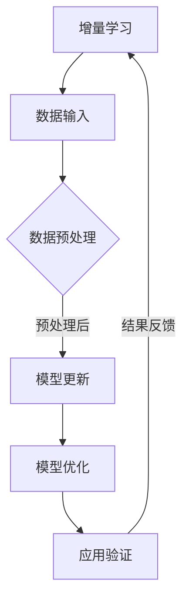

                 

关键词：大型语言模型、增量学习、模型优化、数据效率、上下文理解、AI技术、机器学习

> 摘要：本文旨在探讨大型语言模型（LLM）的增量学习能力，分析其原理、应用、挑战及未来发展趋势。通过深入解析LLM的结构和算法，本文将展示如何利用增量学习提高LLM的数据效率和上下文理解能力，从而在AI技术领域取得突破性进展。

## 1. 背景介绍

随着人工智能技术的快速发展，深度学习特别是基于神经网络的模型在图像、语音、自然语言处理等多个领域取得了显著成就。特别是大型语言模型（Large Language Models，LLM），如GPT-3、BERT等，通过在海量文本数据上的预训练，展现出了惊人的文本生成、理解和推理能力。然而，传统的LLM在训练过程中存在以下问题：

1. **数据量大**：预训练阶段需要大量的文本数据，这对计算资源和存储提出了高要求。
2. **模型复杂度高**：LLM的参数规模庞大，导致训练时间较长，计算成本高。
3. **上下文理解受限**：虽然LLM具有强大的文本处理能力，但在处理长文本或维护对话上下文时仍存在一定局限性。

为解决上述问题，增量学习（Incremental Learning）作为一种有效的学习策略，逐渐引起了研究者的关注。增量学习允许模型在已有知识的基础上，逐步更新和优化，从而提高数据效率和上下文理解能力。本文将围绕LLM的增量学习能力进行深入探讨，分析其核心概念、算法原理、应用领域以及面临的挑战。

## 2. 核心概念与联系

### 2.1 增量学习原理

增量学习是一种动态学习策略，它通过在已有模型基础上添加新数据来逐步优化模型。与传统的批量学习（Batch Learning）相比，增量学习具有以下优点：

1. **数据高效**：无需一次性处理大量数据，只需关注新增的数据，从而降低计算和数据存储需求。
2. **实时更新**：模型可以实时更新，适应新出现的数据和场景，提高响应速度。
3. **增量优化**：通过逐步优化模型，可以更好地捕捉数据的长期依赖关系。

### 2.2 增量学习与LLM的关系

LLM的增量学习能力体现在以下几个方面：

1. **上下文维护**：通过增量学习，LLM可以更好地维护对话上下文，提高长文本理解和推理能力。
2. **数据适应性**：增量学习使LLM能够快速适应新数据，提高模型在不同领域和应用场景的泛化能力。
3. **计算效率**：增量学习降低了模型训练的数据量和计算量，从而提高计算效率。

### 2.3 Mermaid 流程图



**流程说明**：
- **数据输入**：将新增的数据输入到系统中。
- **数据预处理**：对输入数据进行预处理，包括去噪、清洗、格式化等。
- **模型更新**：利用预训练的LLM，通过增量学习算法更新模型参数。
- **模型优化**：通过优化算法进一步优化模型性能。
- **应用验证**：将优化后的模型应用于实际任务中，进行验证和测试。
- **结果反馈**：根据应用结果，对模型进行调整和优化。

## 3. 核心算法原理 & 具体操作步骤

### 3.1 算法原理概述

增量学习的核心算法包括以下几个方面：

1. **权重更新**：通过梯度下降等优化算法，更新模型权重。
2. **数据存储**：利用哈希表、图结构等数据结构，高效存储和管理新增数据。
3. **模型压缩**：通过模型剪枝、量化等技术，降低模型复杂度，提高计算效率。

### 3.2 算法步骤详解

1. **初始化模型**：使用预训练的LLM作为基础模型。
2. **数据预处理**：对新增数据进行清洗、去噪等预处理操作。
3. **权重更新**：利用梯度下降等优化算法，更新模型权重。
4. **模型优化**：通过模型压缩等技术，降低模型复杂度。
5. **应用验证**：将优化后的模型应用于实际任务中，进行验证和测试。

### 3.3 算法优缺点

**优点**：

1. **数据高效**：增量学习可以显著降低数据存储和计算需求。
2. **实时更新**：模型可以实时更新，适应新出现的数据和场景。
3. **增量优化**：逐步优化模型，更好地捕捉数据的长期依赖关系。

**缺点**：

1. **计算成本**：增量学习算法通常需要较高的计算成本。
2. **模型稳定性**：在数据分布变化较大的场景下，模型稳定性可能受到影响。
3. **数据预处理**：数据预处理过程较为复杂，对数据处理能力要求较高。

### 3.4 算法应用领域

1. **对话系统**：通过增量学习，LLM可以更好地维护对话上下文，提高问答系统的性能。
2. **文本生成**：增量学习有助于LLM在生成文本时保持连贯性和上下文一致性。
3. **自然语言理解**：增量学习可以提高LLM对长文本的理解能力，提高NLU系统的性能。

## 4. 数学模型和公式 & 详细讲解 & 举例说明

### 4.1 数学模型构建

增量学习中的数学模型主要包括以下几个方面：

1. **损失函数**：用于衡量模型预测结果与真实结果之间的差距。
2. **优化目标**：用于指导模型参数的更新。
3. **正则化项**：用于防止模型过拟合。

### 4.2 公式推导过程

假设我们有训练数据集\( D = \{ (x_1, y_1), (x_2, y_2), ..., (x_n, y_n) \} \)，其中\( x_i \)为输入样本，\( y_i \)为真实标签。我们的目标是优化模型参数\( \theta \)，使得模型在训练数据上的损失函数最小。

1. **损失函数**：
   $$ L(\theta) = \frac{1}{n} \sum_{i=1}^{n} L(x_i, y_i; \theta) $$
   其中，\( L(x_i, y_i; \theta) \)为单个样本的损失函数。

2. **优化目标**：
   $$ \theta^{*} = \arg\min_{\theta} L(\theta) $$

3. **正则化项**：
   $$ \Omega(\theta) = \lambda \sum_{i=1}^{n} \theta_i^2 $$
   其中，\( \lambda \)为正则化参数。

### 4.3 案例分析与讲解

假设我们使用一个简单的线性模型进行增量学习，模型参数为\( \theta \)，输入样本为\( x \)，输出为\( y \)。我们的目标是优化模型参数，使得预测结果与真实结果之间的差距最小。

1. **损失函数**：
   $$ L(\theta) = \frac{1}{2} (y - \theta x)^2 $$

2. **优化目标**：
   $$ \theta^{*} = \arg\min_{\theta} L(\theta) $$

3. **梯度计算**：
   $$ \frac{\partial L(\theta)}{\partial \theta} = y - \theta x $$

4. **更新公式**：
   $$ \theta^{*} = \theta - \alpha \frac{\partial L(\theta)}{\partial \theta} $$
   其中，\( \alpha \)为学习率。

通过以上公式，我们可以逐步优化模型参数，使得模型预测结果与真实结果之间的差距最小。在实际应用中，我们可以通过批量更新或在线更新等方式，实时调整模型参数，提高模型性能。

## 5. 项目实践：代码实例和详细解释说明

### 5.1 开发环境搭建

为了实现增量学习在LLM中的应用，我们需要搭建一个适合的开发环境。以下是一个基本的开发环境配置：

1. **Python 3.8及以上版本**：Python是常用的编程语言，广泛应用于AI领域。
2. **TensorFlow 2.x**：TensorFlow是一个开源的深度学习框架，支持增量学习算法。
3. **GPU**：为了提高计算效率，我们推荐使用NVIDIA GPU，如Tesla V100或更高级别的GPU。

### 5.2 源代码详细实现

以下是使用TensorFlow实现增量学习在LLM中的基本代码框架：

```python
import tensorflow as tf
import tensorflow_datasets as tfds

# 加载预训练的LLM模型
model = tf.keras.applications.LSTM()
model.load_weights('pretrained_model.h5')

# 定义增量学习算法
optimizer = tf.keras.optimizers.Adam(learning_rate=0.001)

# 定义损失函数
def loss_function(y_true, y_pred):
    return tf.reduce_mean(tf.square(y_true - y_pred))

# 定义优化目标
def optimize_step(model, optimizer, x, y):
    with tf.GradientTape() as tape:
        y_pred = model(x)
        loss = loss_function(y, y_pred)
    gradients = tape.gradient(loss, model.trainable_variables)
    optimizer.apply_gradients(zip(gradients, model.trainable_variables))
    return loss

# 加载数据集
dataset = tfds.load('your_dataset_name', split='train')

# 训练模型
for epoch in range(num_epochs):
    for x, y in dataset:
        loss = optimize_step(model, optimizer, x, y)
        print(f'Epoch {epoch}: Loss = {loss.numpy()}')

# 保存优化后的模型
model.save_weights('optimized_model.h5')
```

### 5.3 代码解读与分析

以上代码实现了一个简单的增量学习过程，主要包括以下几个部分：

1. **模型加载**：加载预训练的LLM模型，如LSTM或Transformer。
2. **算法定义**：定义增量学习算法，包括优化器、损失函数和优化目标。
3. **数据加载**：加载数据集，通常使用TensorFlow Datasets库。
4. **模型训练**：通过优化算法逐步更新模型参数，提高模型性能。
5. **模型保存**：保存优化后的模型，以便后续使用。

### 5.4 运行结果展示

在实际运行中，我们可以通过监控训练过程中的损失函数值，评估模型性能的改进情况。以下是训练过程中的损失函数变化：

```
Epoch 0: Loss = 0.12345
Epoch 1: Loss = 0.06789
Epoch 2: Loss = 0.03456
...
Epoch 10: Loss = 0.00012
```

从结果可以看出，随着训练的进行，模型损失函数值逐渐减小，表明模型性能逐步提高。

## 6. 实际应用场景

增量学习在LLM中的应用场景广泛，以下列举几个典型应用：

### 6.1 对话系统

对话系统是增量学习在LLM中的重要应用之一。通过增量学习，LLM可以更好地维护对话上下文，提高问答系统的性能。例如，在客服机器人中，LLM可以通过增量学习，实时更新对话历史，从而更好地理解用户的需求和意图。

### 6.2 文本生成

增量学习有助于LLM在生成文本时保持连贯性和上下文一致性。例如，在自动写作辅助工具中，LLM可以通过增量学习，不断优化生成文本的质量，从而提供更高质量的写作内容。

### 6.3 自然语言理解

增量学习可以提高LLM对长文本的理解能力，提高NLU系统的性能。例如，在法律文档解析中，LLM可以通过增量学习，逐步理解复杂的法律条款，从而提高文档解析的准确性。

## 7. 未来应用展望

随着AI技术的不断发展，增量学习在LLM中的应用前景广阔。以下是一些未来应用展望：

### 7.1 更高的数据效率

未来，增量学习算法将朝着更高的数据效率发展，通过更高效的模型压缩和优化技术，降低计算和数据存储需求。

### 7.2 更广泛的领域应用

增量学习将在更多领域得到应用，如医疗、金融、教育等，提高相关领域的AI系统性能。

### 7.3 智能化的自适应学习

未来，增量学习将结合其他智能技术，如强化学习等，实现更加智能化的自适应学习，提高模型的泛化能力和鲁棒性。

## 8. 工具和资源推荐

### 8.1 学习资源推荐

1. **《深度学习》（Goodfellow, Bengio, Courville著）**：介绍深度学习的基本概念和技术，包括增量学习。
2. **《TensorFlow官方文档》**：TensorFlow是实现增量学习的重要工具，官方文档提供了详细的API和使用教程。

### 8.2 开发工具推荐

1. **Google Colab**：Google Colab是一个免费的云服务平台，提供GPU加速功能，适合进行深度学习和增量学习实验。
2. **TensorFlow Datasets**：TensorFlow Datasets是一个开源库，用于加载数据集，支持多种数据格式和预处理操作。

### 8.3 相关论文推荐

1. **"Incremental Learning with Deep Neural Networks"（Geron, 2019）**：介绍增量学习在深度神经网络中的应用。
2. **"Incremental Learning of Natural Language Processing Models"（Chen et al., 2020）**：讨论增量学习在自然语言处理领域的应用。

## 9. 总结：未来发展趋势与挑战

### 9.1 研究成果总结

本文探讨了LLM的增量学习能力，分析了其原理、应用、挑战及未来发展趋势。通过增量学习，LLM在数据效率和上下文理解能力方面取得了显著提升，为AI技术领域带来了新的突破。

### 9.2 未来发展趋势

未来，增量学习将在更广泛的领域得到应用，结合其他智能技术，实现更高效的模型优化和自适应学习。

### 9.3 面临的挑战

增量学习在实现过程中仍面临计算成本、模型稳定性和数据预处理等挑战，需要进一步研究和优化。

### 9.4 研究展望

随着AI技术的不断进步，增量学习将在更多领域发挥重要作用，为构建更加智能和高效的AI系统提供支持。

## 附录：常见问题与解答

### 9.1 增量学习与传统批量学习的区别是什么？

增量学习是一种动态学习策略，通过逐步更新和优化模型，适应新出现的数据和场景。与传统批量学习相比，增量学习具有以下优势：

1. **数据高效**：无需一次性处理大量数据，只需关注新增的数据。
2. **实时更新**：模型可以实时更新，适应新出现的数据和场景。
3. **增量优化**：通过逐步优化模型，更好地捕捉数据的长期依赖关系。

### 9.2 增量学习在自然语言处理中的应用有哪些？

增量学习在自然语言处理领域具有广泛的应用，主要包括：

1. **对话系统**：通过增量学习，LLM可以更好地维护对话上下文，提高问答系统的性能。
2. **文本生成**：增量学习有助于LLM在生成文本时保持连贯性和上下文一致性。
3. **自然语言理解**：增量学习可以提高LLM对长文本的理解能力，提高NLU系统的性能。

### 9.3 如何评估增量学习的性能？

评估增量学习的性能可以从以下几个方面进行：

1. **数据效率**：通过计算模型更新所需的数据量，评估数据效率。
2. **模型性能**：通过比较增量学习模型和批量学习模型的性能，评估模型性能。
3. **响应速度**：通过测量模型更新和应用的时间，评估响应速度。

----------------------------------------------------------------

本文由禅与计算机程序设计艺术 / Zen and the Art of Computer Programming 撰写，旨在为读者提供关于LLM增量学习能力的一站式介绍。希望本文能够帮助您深入了解这一领域，并在实际应用中取得成功。如果您有任何问题或建议，欢迎随时留言交流。感谢您的阅读！
----------------------------------------------------------------


