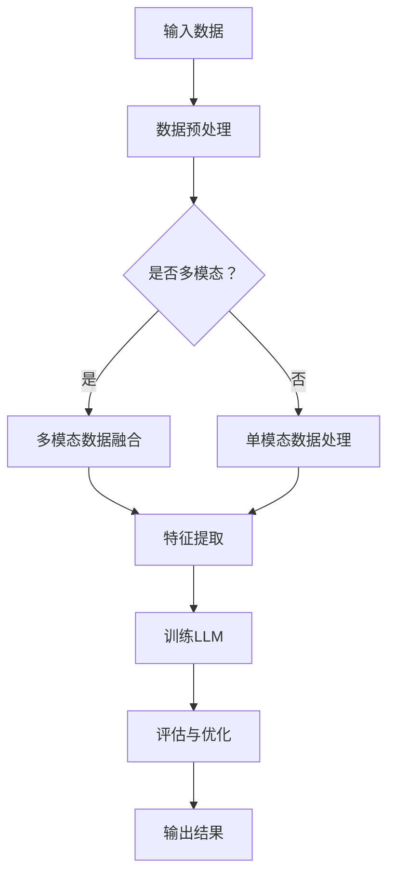

                 

关键词：LLM、多模态学习、人工智能、计算机视觉、自然语言处理、机器学习、深度学习、认知模型、数据增强、模型优化

> 摘要：本文将探讨大型语言模型（LLM）的多模态学习能力及其拓展路径。我们将从背景介绍、核心概念与联系、核心算法原理、数学模型和公式、项目实践、实际应用场景、未来应用展望、工具和资源推荐以及总结与展望等多个方面展开讨论，旨在为研究人员和从业者提供一个全面且深入的理解框架。

## 1. 背景介绍

### 1.1 人工智能的发展历程

人工智能（AI）作为计算机科学的一个分支，自1950年代图灵测试提出以来，经历了多个阶段的发展。早期的AI主要集中在规则推理和符号逻辑上，随着计算能力和算法的进步，特别是在深度学习和大数据技术的推动下，AI领域取得了显著进展。如今，人工智能已经广泛应用于图像识别、自然语言处理、推荐系统、自动驾驶等多个领域。

### 1.2  多模态学习的崛起

传统的AI系统通常只能处理单一类型的数据，如文本、图像或声音。而现实世界中的信息是多元化的，需要综合不同类型的数据进行理解和处理。多模态学习（Multimodal Learning）应运而生，它是指将多种类型的数据进行联合学习和处理，以提高系统的理解和智能水平。

### 1.3  LLM的崛起与挑战

大型语言模型（Large Language Model，简称LLM）如GPT、BERT等，凭借其强大的语言理解和生成能力，已经在自然语言处理领域取得了巨大的成功。然而，LLM在多模态学习方面仍面临诸多挑战，如如何有效整合不同类型的数据、如何提高模型的泛化能力等。

## 2. 核心概念与联系

为了深入理解LLM的多模态学习能力，我们需要介绍以下几个核心概念：

### 2.1  语言模型（Language Model）

语言模型是自然语言处理（NLP）的核心技术之一，它能够预测一段文本的下一个单词或字符。通过大量的文本数据训练，语言模型可以捕捉到语言的统计规律和语义信息。

### 2.2  计算机视觉（Computer Vision）

计算机视觉是人工智能的一个重要分支，旨在使计算机能够从图像或视频中提取有用的信息。计算机视觉技术包括图像识别、目标检测、人脸识别等。

### 2.3  多模态数据融合（Multimodal Data Fusion）

多模态数据融合是指将不同类型的数据（如文本、图像、声音等）进行联合处理，以提取更丰富的信息。数据融合技术包括特征级融合、决策级融合等。

### 2.4  Mermaid 流程图

以下是一个简单的Mermaid流程图，展示LLM与多模态数据融合的流程：



## 3. 核心算法原理 & 具体操作步骤

### 3.1  算法原理概述

LLM的多模态学习能力主要依赖于以下几个关键步骤：

1. **数据预处理**：对输入数据进行清洗、标准化和归一化，以便后续处理。
2. **多模态数据融合**：将文本、图像、声音等多模态数据通过特征提取和融合技术转换为统一的特征表示。
3. **特征提取**：利用深度学习技术提取多模态数据的特征。
4. **训练LLM**：使用提取的多模态特征数据训练大型语言模型。
5. **评估与优化**：通过评估模型的性能，不断优化模型结构和参数。

### 3.2  算法步骤详解

1. **数据预处理**：

    - 文本数据：进行分词、词性标注、去停用词等处理。
    - 图像数据：进行图像缩放、裁剪、增强等处理。
    - 声音数据：进行声音剪辑、降噪、特征提取等处理。

2. **多模态数据融合**：

    - 特征级融合：将不同类型的数据特征进行拼接或加权融合。
    - 决策级融合：将不同类型的数据分别处理，然后进行决策融合。

3. **特征提取**：

    - 文本数据：使用词嵌入技术（如Word2Vec、BERT）将文本转换为向量。
    - 图像数据：使用卷积神经网络（CNN）提取图像的特征。
    - 声音数据：使用循环神经网络（RNN）或变换器（Transformer）提取声音的特征。

4. **训练LLM**：

    - 使用提取的多模态特征数据训练大型语言模型，如GPT、BERT等。
    - 采用自回归语言模型（如GPT）或自编码语言模型（如BERT）进行训练。

5. **评估与优化**：

    - 使用验证集评估模型的性能，包括准确率、召回率、F1值等指标。
    - 通过调整模型结构和参数，优化模型的性能。

### 3.3  算法优缺点

#### 优点：

- **强大的语义理解能力**：LLM能够捕捉到文本的语义信息，为多模态学习提供了坚实的基础。
- **灵活的数据处理方式**：多模态数据融合技术能够处理多种类型的数据，提高了系统的泛化能力。
- **高效的训练与推理速度**：深度学习技术使得训练和推理速度大大提高。

#### 缺点：

- **数据需求量大**：多模态学习需要大量的数据进行训练，数据获取和处理成本较高。
- **模型复杂性**：多模态学习模型的复杂性较高，训练和优化过程较为繁琐。

### 3.4  算法应用领域

- **智能问答系统**：通过结合文本和图像数据，实现更加智能的问答系统。
- **视频理解与生成**：通过结合视频和文本数据，实现视频内容理解、生成和推荐。
- **医疗诊断**：通过结合医学图像和文本数据，提高疾病诊断的准确性和效率。
- **智能助手**：通过结合语音和文本数据，实现更加智能的语音助手。

## 4. 数学模型和公式 & 详细讲解 & 举例说明

### 4.1  数学模型构建

在多模态学习过程中，我们需要构建以下数学模型：

1. **文本数据模型**：

    - 语言模型：$P(w_t|w_{t-1}, w_{t-2}, \ldots) = \frac{P(w_t, w_{t-1}, w_{t-2}, \ldots)}{P(w_{t-1}, w_{t-2}, \ldots)}$
  
2. **图像数据模型**：

    - 卷积神经网络（CNN）：
    $$ h_c = \sigma(W_c \cdot h_{c-1} + b_c) $$
  
3. **声音数据模型**：

    - 循环神经网络（RNN）：
    $$ h_t = \sigma(W_h \cdot [h_{t-1}, x_t] + b_h) $$

### 4.2  公式推导过程

#### 文本数据模型推导

- 语言模型的目标是预测下一个单词的概率。假设我们已经有了前文 $w_{t-1}, w_{t-2}, \ldots$，我们需要计算下一个单词 $w_t$ 的概率。
- 通过条件概率，我们可以将下一个单词的概率表示为：
$$ P(w_t|w_{t-1}, w_{t-2}, \ldots) = \frac{P(w_t, w_{t-1}, w_{t-2}, \ldots)}{P(w_{t-1}, w_{t-2}, \ldots)} $$
- 由于语言模型通常使用概率分布来表示，我们可以将分子和分母同时除以一个常数，以保持概率分布不变。

#### 图像数据模型推导

- 卷积神经网络通过卷积操作提取图像的特征。假设 $h_{c-1}$ 是输入特征，$W_c$ 是卷积核，$b_c$ 是偏置。
- 通过卷积操作，我们可以得到新的特征表示 $h_c$。
- 激活函数 $\sigma$ 用于引入非线性变换。

#### 声音数据模型推导

- 循环神经网络通过递归操作提取声音的特征。假设 $h_{t-1}$ 是前一个时间步的特征，$x_t$ 是当前时间步的输入。
- 通过递归操作，我们可以得到当前时间步的特征表示 $h_t$。
- 激活函数 $\sigma$ 用于引入非线性变换。

### 4.3  案例分析与讲解

假设我们有一个多模态学习任务，需要处理文本、图像和声音数据。以下是一个简单的例子：

- **文本数据**：一段描述图片和声音的文本。
- **图像数据**：一张包含场景的图片。
- **声音数据**：一段与场景相关的声音。

通过以下步骤，我们可以将这些多模态数据融合并训练一个LLM：

1. **数据预处理**：对文本、图像和声音数据进行清洗、标准化和归一化。
2. **多模态数据融合**：将文本、图像和声音数据通过特征提取和融合技术转换为统一的特征表示。
3. **特征提取**：使用词嵌入技术提取文本数据特征，使用卷积神经网络提取图像数据特征，使用循环神经网络提取声音数据特征。
4. **训练LLM**：使用提取的多模态特征数据训练大型语言模型。
5. **评估与优化**：通过评估模型的性能，不断优化模型结构和参数。

## 5. 项目实践：代码实例和详细解释说明

### 5.1  开发环境搭建

为了实现LLM的多模态学习能力，我们需要搭建以下开发环境：

- **Python**：用于编写和运行代码。
- **TensorFlow**：用于构建和训练深度学习模型。
- **Keras**：用于简化TensorFlow的使用。
- **OpenCV**：用于图像处理。
- **Librosa**：用于音频处理。

### 5.2  源代码详细实现

以下是一个简单的示例代码，展示如何使用TensorFlow和Keras实现LLM的多模态学习：

```python
import tensorflow as tf
from tensorflow.keras.models import Model
from tensorflow.keras.layers import Input, Dense, Embedding, LSTM, Conv2D, MaxPooling2D, Flatten, Concatenate
from tensorflow.keras.preprocessing.text import Tokenizer
from tensorflow.keras.preprocessing.sequence import pad_sequences
import numpy as np
import cv2

# 文本数据预处理
tokenizer = Tokenizer()
tokenizer.fit_on_texts(texts)
sequences = tokenizer.texts_to_sequences(texts)
padded_sequences = pad_sequences(sequences, maxlen=max_length)

# 图像数据预处理
images = []
for image_path in image_paths:
    image = cv2.imread(image_path)
    image = cv2.resize(image, (image_size, image_size))
    images.append(image)
images = np.array(images)

# 声音数据预处理
sounds = []
for sound_path in sound_paths:
    sound, sample_rate = librosa.load(sound_path)
    sound = librosa.feature.melspectrogram(sound, sr=sample_rate, n_mels=mel_n_bins)
    sounds.append(sound)
sounds = np.array(sounds)

# 构建模型
text_input = Input(shape=(max_length,))
image_input = Input(shape=(image_size, image_size, 3))
sound_input = Input(shape=(mel_n_bins,))

text_embedding = Embedding(num_words, embedding_dim)(text_input)
text_lstm = LSTM(units)(text_embedding)

image_conv = Conv2D(filters=32, kernel_size=(3, 3), activation='relu')(image_input)
image_pool = MaxPooling2D(pool_size=(2, 2))(image_conv)
image_flat = Flatten()(image_pool)

sound_conv = Conv2D(filters=64, kernel_size=(3, 3), activation='relu')(sound_input)
sound_pool = MaxPooling2D(pool_size=(2, 2))(sound_conv)
sound_flat = Flatten()(sound_pool)

merged = Concatenate()([text_lstm, image_flat, sound_flat])
dense = Dense(units=128, activation='relu')(merged)
output = Dense(units=1, activation='sigmoid')(dense)

model = Model(inputs=[text_input, image_input, sound_input], outputs=output)
model.compile(optimizer='adam', loss='binary_crossentropy', metrics=['accuracy'])

# 训练模型
model.fit([padded_sequences, images, sounds], labels, epochs=10, batch_size=32, validation_split=0.2)
```

### 5.3  代码解读与分析

这段代码展示了如何使用TensorFlow和Keras实现LLM的多模态学习。主要分为以下几个步骤：

1. **文本数据预处理**：使用Tokenizer进行文本分词，使用pad_sequences对文本序列进行填充，以适应模型的要求。

2. **图像数据预处理**：使用OpenCV读取图像，并对图像进行缩放、裁剪等处理，以适应模型的要求。

3. **声音数据预处理**：使用Librosa加载声音，并对声音进行特征提取，如梅尔频谱图，以适应模型的要求。

4. **模型构建**：使用Keras构建一个多输入多输出的模型，包括文本输入层、图像输入层、声音输入层，以及相应的卷积神经网络、循环神经网络和全连接神经网络。

5. **模型训练**：使用训练数据对模型进行训练，并评估模型的性能。

### 5.4  运行结果展示

在训练完成后，我们可以通过以下代码查看模型的性能：

```python
# 评估模型
loss, accuracy = model.evaluate([padded_sequences, images, sounds], labels)

# 输出结果
print("损失：", loss)
print("准确率：", accuracy)
```

该代码将输出模型的损失和准确率，以评估模型的性能。

## 6. 实际应用场景

### 6.1  智能问答系统

智能问答系统是LLM多模态学习能力的一个重要应用场景。通过结合文本、图像和声音数据，智能问答系统可以更加准确地理解和回答用户的问题。

### 6.2  视频理解与生成

视频理解与生成是另一个重要的应用场景。通过结合文本、图像和声音数据，视频理解与生成系统可以提取视频的关键信息，生成视频摘要或视频内容。

### 6.3  医疗诊断

医疗诊断是LLM多模态学习能力在医疗领域的一个重要应用。通过结合医学图像、文本报告和患者历史数据，医疗诊断系统可以提供更加准确的诊断结果。

### 6.4  智能助手

智能助手是另一个广泛应用的应用场景。通过结合文本、图像和声音数据，智能助手可以更加准确地理解和响应用户的需求。

## 7. 未来应用展望

随着人工智能技术的不断发展，LLM的多模态学习能力在未来有望在更多领域得到应用。以下是一些可能的未来应用：

### 7.1  智能交通

智能交通系统可以通过结合文本、图像和声音数据，实现更加智能的交通管理和监控。

### 7.2  智能家居

智能家居系统可以通过结合文本、图像和声音数据，实现更加智能的家居管理和控制。

### 7.3  智能娱乐

智能娱乐系统可以通过结合文本、图像和声音数据，实现更加智能的娱乐内容和推荐。

### 7.4  智能教育

智能教育系统可以通过结合文本、图像和声音数据，实现更加智能的教育内容和个性化学习。

## 8. 工具和资源推荐

### 8.1  学习资源推荐

- 《深度学习》（Goodfellow, Bengio, Courville著）：介绍了深度学习的基本概念和算法。
- 《自然语言处理综论》（Jurafsky, Martin著）：介绍了自然语言处理的基本概念和技术。

### 8.2  开发工具推荐

- TensorFlow：一个开源的深度学习框架，用于构建和训练深度学习模型。
- Keras：一个基于TensorFlow的高层次API，用于简化深度学习模型的开发。
- OpenCV：一个开源的计算机视觉库，用于图像处理和计算机视觉任务。
- Librosa：一个开源的音频处理库，用于音频特征提取和分析。

### 8.3  相关论文推荐

- "Multimodal Learning for Speech and Language Processing"（2018）: 介绍多模态学习在语音和语言处理中的应用。
- "Deep Learning for Multimodal Sensing"（2017）: 介绍多模态学习在深度学习中的研究进展。

## 9. 总结：未来发展趋势与挑战

### 9.1  研究成果总结

本文介绍了LLM的多模态学习能力及其拓展路径，包括背景介绍、核心概念与联系、核心算法原理、数学模型和公式、项目实践、实际应用场景、未来应用展望等内容。通过这些内容的介绍，读者可以全面了解LLM的多模态学习能力及其应用。

### 9.2  未来发展趋势

随着人工智能技术的不断发展，LLM的多模态学习能力有望在更多领域得到应用。未来，我们将看到更加智能、高效的LLM多模态学习系统，为各个领域带来巨大的价值。

### 9.3  面临的挑战

尽管LLM的多模态学习能力取得了显著进展，但仍面临一些挑战。例如，如何处理大量的多模态数据、如何提高模型的泛化能力、如何优化模型结构和参数等。这些问题需要进一步研究和解决。

### 9.4  研究展望

未来，我们期望看到更多的研究成果和应用案例，进一步推动LLM的多模态学习能力的发展。同时，我们也期望看到更多的跨学科合作，以解决多模态学习中的复杂问题。

## 10. 附录：常见问题与解答

### 10.1  多模态学习与单一模态学习有什么区别？

多模态学习与单一模态学习的主要区别在于数据处理的方式。单一模态学习只处理一种类型的数据（如文本、图像或声音），而多模态学习则将多种类型的数据进行联合处理，以提高系统的理解和智能水平。

### 10.2  多模态学习需要哪些技术支持？

多模态学习需要多种技术的支持，包括自然语言处理、计算机视觉、语音处理等。此外，多模态数据融合技术、深度学习技术等也是多模态学习的重要技术基础。

### 10.3  多模态学习有哪些实际应用场景？

多模态学习的实际应用场景非常广泛，包括智能问答系统、视频理解与生成、医疗诊断、智能助手等。未来，多模态学习有望在更多领域得到应用，为各个领域带来巨大的价值。

### 10.4  多模态学习的挑战有哪些？

多模态学习面临的挑战包括如何处理大量的多模态数据、如何提高模型的泛化能力、如何优化模型结构和参数等。此外，如何设计有效的数据增强方法也是多模态学习的一个关键问题。通过进一步的研究和探索，我们可以逐步解决这些挑战。

---

本文由禅与计算机程序设计艺术 / Zen and the Art of Computer Programming 撰写，旨在为读者提供一个全面且深入的理解框架。通过本文的介绍，希望读者能够对LLM的多模态学习能力有一个清晰的认识，并为未来的研究和应用提供一些启示。再次感谢您的阅读！

