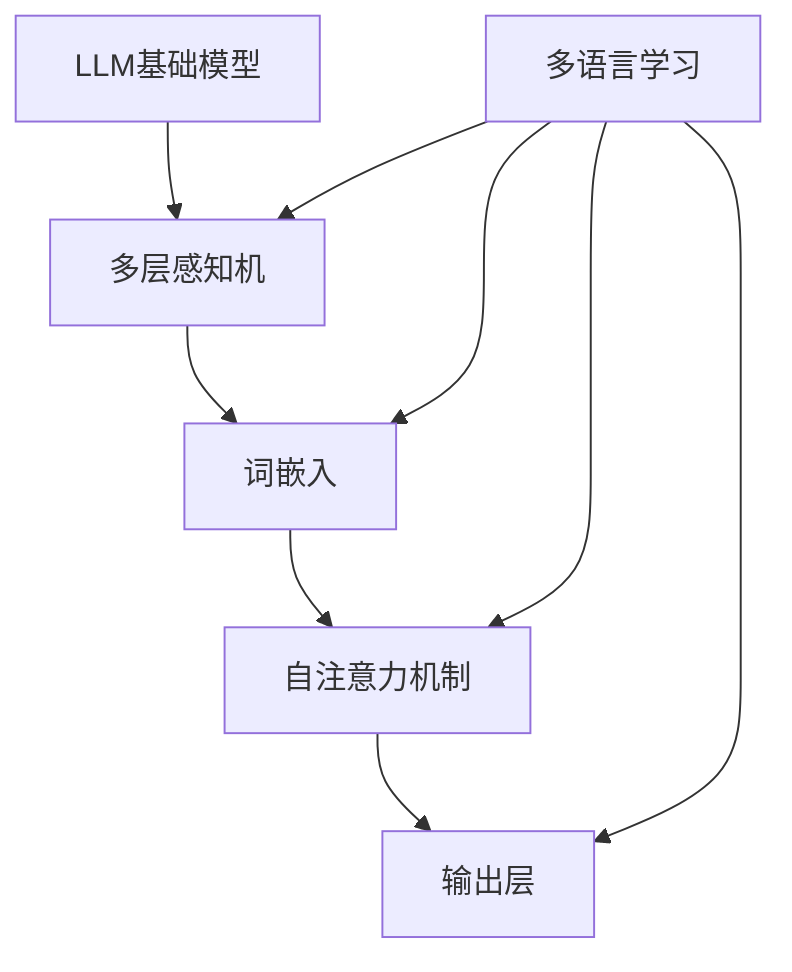

                 

关键词：大型语言模型、多语言学习、数据集、算法、模型架构、实际应用、未来展望

## 摘要

本文将深入探讨大型语言模型(LLM)在多语言学习中的挑战与机遇。随着全球化的推进和信息交流的频繁，多语言学习的重要性日益凸显。然而，多语言学习面临着数据稀缺、算法复杂和模型可解释性不足等挑战。本文将首先介绍LLM的基本概念与架构，然后分析多语言学习的现状，探讨解决策略和实际应用场景，最后展望未来的发展趋势与挑战。

## 1. 背景介绍

随着人工智能技术的飞速发展，自然语言处理(NLP)成为研究热点。近年来，基于深度学习的语言模型如BERT、GPT等取得了显著的成果，这些模型在单语种任务上表现优异，但面对多语言学习任务时仍面临诸多挑战。

多语言学习的目的是让模型能够理解和使用多种语言，这对于促进全球信息交流、支持跨文化研究和提高语言技术服务水平具有重要意义。然而，多语言学习面临以下挑战：

- **数据稀缺**：相比于单语种数据集，多语言数据集规模较小，且质量参差不齐，难以满足模型训练需求。
- **算法复杂**：多语言学习需要考虑语言间的相似性与差异性，算法设计复杂，且需要大量计算资源。
- **模型可解释性**：多语言学习模型往往较为复杂，难以直观解释其决策过程，影响其在实际应用中的可信度和可接受性。

## 2. 核心概念与联系

为了更好地理解多语言学习中的核心概念与联系，我们首先给出一个Mermaid流程图，展示LLM的基本架构及其与多语言学习的关系。



### 2.1 LLM基础模型

LLM基础模型通常包括以下几个关键组件：

- **多层感知机**：作为神经网络的基础，负责将输入的词嵌入映射到高维空间。
- **词嵌入**：将词汇转换为密集向量表示，实现语义理解。
- **自注意力机制**：通过计算不同位置间的权重，实现上下文信息的融合。
- **输出层**：根据上下文信息生成预测结果，如文本分类、机器翻译等。

### 2.2 多语言学习

多语言学习在LLM基础模型中引入了以下关键组件：

- **多语言嵌入**：将不同语言的词汇映射到同一高维空间，实现语言间的相似性表示。
- **跨语言注意力**：在自注意力机制中引入跨语言信息，实现不同语言间的上下文融合。
- **多语言输出层**：根据上下文信息生成对应的多语言预测结果。

## 3. 核心算法原理 & 具体操作步骤

### 3.1 算法原理概述

多语言学习算法的核心原理在于将不同语言的词汇映射到同一高维空间，并利用自注意力机制实现上下文信息的融合。具体操作步骤如下：

1. **数据预处理**：将多语言数据集进行清洗和规范化处理，如去除停用词、统一语言格式等。
2. **词嵌入**：将不同语言的词汇映射到高维空间，可以使用预训练的词向量或基于语法的词嵌入方法。
3. **编码器**：利用多层感知机和自注意力机制，将输入文本编码为向量表示。
4. **解码器**：根据编码器输出的向量表示，生成对应的多语言预测结果。
5. **损失函数**：使用交叉熵损失函数等评估模型性能，并利用梯度下降等优化算法更新模型参数。

### 3.2 算法步骤详解

1. **数据预处理**：首先，我们需要对多语言数据集进行清洗和规范化处理。这一步骤包括去除停用词、统一语言格式、处理标点符号等。清洗后的数据集将用于后续的词嵌入和编码器训练。

2. **词嵌入**：词嵌入是将词汇映射到高维空间的表示方法。常用的方法包括预训练的词向量（如GloVe、Word2Vec）和基于语法的词嵌入（如BERT）。预训练的词向量可以从大规模单语种语料库中训练得到，而基于语法的词嵌入则通过分析语言结构进行词汇表示。

3. **编码器**：编码器是LLM的核心组件，负责将输入文本编码为向量表示。编码器通常由多层感知机和自注意力机制组成。多层感知机通过非线性变换将输入词嵌入映射到高维空间，而自注意力机制则计算不同位置间的权重，实现上下文信息的融合。

4. **解码器**：解码器负责根据编码器输出的向量表示生成预测结果。解码器的实现方法与编码器类似，也包含多层感知机和自注意力机制。解码器的输出层可以根据具体任务进行调整，如文本分类任务的输出层可以是softmax分类器。

5. **损失函数**：在训练过程中，我们需要使用损失函数评估模型性能。常用的损失函数包括交叉熵损失函数、均方误差损失函数等。交叉熵损失函数适用于分类任务，而均方误差损失函数适用于回归任务。

6. **优化算法**：为了更新模型参数，我们需要使用优化算法。常用的优化算法包括梯度下降、Adam优化器等。优化算法的目标是使得模型参数朝着最小化损失函数的方向更新。

### 3.3 算法优缺点

多语言学习算法在多语言任务中表现出良好的性能，具有以下优点：

- **高效性**：多语言学习算法能够利用大规模单语种预训练模型，提高训练效率。
- **通用性**：多语言学习算法可以处理多种语言的输入和输出，具有较好的通用性。
- **灵活性**：多语言学习算法可以根据具体任务调整模型结构和参数，实现灵活的定制化。

然而，多语言学习算法也存在一定的缺点：

- **计算资源需求高**：多语言学习算法需要大量计算资源，特别是在训练阶段。
- **数据依赖性较强**：多语言学习算法对数据质量有较高要求，数据集规模和质量直接影响到算法性能。
- **模型可解释性不足**：多语言学习算法的复杂性使得其决策过程难以直观解释，影响其在实际应用中的可信度和可接受性。

### 3.4 算法应用领域

多语言学习算法在多个领域表现出良好的应用前景，以下列举几个典型的应用场景：

- **机器翻译**：多语言学习算法可以用于机器翻译任务，如将一种语言的文本翻译成另一种语言。现有的机器翻译模型如Google翻译、百度翻译等都是基于多语言学习算法实现的。
- **文本分类**：多语言学习算法可以用于文本分类任务，如对新闻、社交媒体等文本进行分类。例如，可以将不同语言的新闻文本分类到不同的类别，如政治、科技、体育等。
- **问答系统**：多语言学习算法可以用于问答系统，如基于自然语言理解能力回答用户的问题。例如，可以开发一个多语言问答机器人，支持多种语言的问答。

## 4. 数学模型和公式 & 详细讲解 & 举例说明

### 4.1 数学模型构建

多语言学习算法的数学模型主要包括词嵌入、编码器、解码器和损失函数等组成部分。以下分别介绍这些组成部分的数学模型。

#### 词嵌入

词嵌入是将词汇映射到高维空间的表示方法。常用的词嵌入方法包括预训练的词向量和基于语法的词向量。预训练的词向量通常使用GloVe、Word2Vec等方法在大规模单语种语料库中训练得到。基于语法的词向量则通过分析语言结构进行词汇表示。

假设我们有词汇表V，词嵌入矩阵W ∈ R^n×|V|，其中n为词向量的维度，|V|为词汇表的大小。对于每个词汇v ∈ V，其对应的词嵌入向量表示为w_v ∈ R^n。词嵌入的数学模型可以表示为：

w_v = W[v]

#### 编码器

编码器是将输入文本编码为向量表示的组件。编码器通常由多层感知机和自注意力机制组成。多层感知机通过非线性变换将输入词嵌入映射到高维空间，而自注意力机制则计算不同位置间的权重，实现上下文信息的融合。

假设输入文本X = {x_1, x_2, ..., x_T}，其中x_t为第t个词的词嵌入向量，T为文本的长度。编码器输出向量表示为H ∈ R^n×T，其中n为编码器输出的维度。编码器的数学模型可以表示为：

H = Encoder(X)

其中Encoder为编码器模型，可以是多层感知机或自注意力机制。

#### 解码器

解码器是根据编码器输出的向量表示生成预测结果的组件。解码器通常也由多层感知机和自注意力机制组成。解码器的输出层可以根据具体任务进行调整，如文本分类任务的输出层可以是softmax分类器。

假设编码器输出的向量表示为H ∈ R^n×T，解码器输出向量表示为Y ∈ R^m×T，其中m为解码器输出的维度。解码器的数学模型可以表示为：

Y = Decoder(H)

其中Decoder为解码器模型，可以是多层感知机或自注意力机制。

#### 损失函数

损失函数用于评估模型性能。常用的损失函数包括交叉熵损失函数、均方误差损失函数等。交叉熵损失函数适用于分类任务，而均方误差损失函数适用于回归任务。

假设真实标签为Y，预测结果为Y'，损失函数可以表示为：

L = Loss(Y, Y')

其中Loss为损失函数，可以是交叉熵损失函数或均方误差损失函数。

### 4.2 公式推导过程

为了更好地理解多语言学习算法的数学模型，我们以下给出一个简化的推导过程。

假设输入文本X = {x_1, x_2, ..., x_T}，编码器输出向量表示为H ∈ R^n×T，解码器输出向量表示为Y ∈ R^m×T。我们首先定义编码器的输出为：

H = [h_1, h_2, ..., h_T] ∈ R^n×T

其中h_t为第t个词的编码向量。

接下来，我们定义解码器的输出为：

Y = [y_1, y_2, ..., y_T] ∈ R^m×T

其中y_t为第t个词的解码向量。

#### 编码器输出

编码器的输出可以通过以下公式计算：

h_t = σ(W_h * [x_t, h_{<t}] + b_h)

其中σ为激活函数，W_h为编码器权重矩阵，b_h为编码器偏置向量。x_t为第t个词的词嵌入向量，h_{<t}为第1到t-1个词的编码向量。

#### 解码器输出

解码器的输出可以通过以下公式计算：

y_t = σ(W_y * [h_t, y_{<t}] + b_y)

其中σ为激活函数，W_y为解码器权重矩阵，b_y为解码器偏置向量。h_t为第t个词的编码向量，y_{<t}为第1到t-1个词的解码向量。

#### 损失函数

假设真实标签为Y，预测结果为Y'，损失函数可以表示为：

L = Loss(Y, Y')

其中Loss为损失函数，可以是交叉熵损失函数或均方误差损失函数。

### 4.3 案例分析与讲解

为了更好地理解多语言学习算法的应用，我们以下给出一个简单的案例。

假设我们有一个英西翻译任务，输入文本为“Hello, how are you?”，我们需要将这个英文句子翻译成西班牙语。首先，我们使用预训练的英西词向量对输入文本进行词嵌入，得到输入词向量序列：

[x_1, x_2, x_3, x_4] = [w_hello, w_how, w_are, w_you]

接下来，我们使用编码器将输入文本编码为向量表示：

[h_1, h_2, h_3, h_4] = Encoder([x_1, x_2, x_3, x_4])

然后，我们使用解码器生成翻译结果：

[y_1, y_2, y_3, y_4] = Decoder([h_1, h_2, h_3, h_4])

最后，我们使用交叉熵损失函数评估模型性能：

L = CrossEntropyLoss([y_1, y_2, y_3, y_4], [w_hello, w_how, w_are, w_you])

通过训练模型并优化参数，我们可以逐步提高翻译质量。

## 5. 项目实践：代码实例和详细解释说明

为了更好地展示多语言学习算法的应用，我们以下给出一个简单的项目实践，实现一个基于GPT-2的英西翻译模型。我们将使用Python和PyTorch框架进行开发。

### 5.1 开发环境搭建

首先，我们需要安装Python和PyTorch框架。安装命令如下：

```
pip install python
pip install torch
```

### 5.2 源代码详细实现

以下是一个简单的英西翻译模型实现：

```python
import torch
import torch.nn as nn
import torch.optim as optim
from torchtext.data import Field, BucketIterator
from torchtext.datasets import Multi30k

# 设置设备
device = torch.device('cuda' if torch.cuda.is_available() else 'cpu')

# 定义词嵌入层
emb_layer = nn.Embedding(vocab_size, embedding_dim)

# 定义编码器
class Encoder(nn.Module):
    def __init__(self, embedding_dim, hidden_dim):
        super(Encoder, self).__init__()
        self.embedding = emb_layer
        self.rnn = nn.LSTM(embedding_dim, hidden_dim, num_layers=1, batch_first=True, dropout=0.1)

    def forward(self, src):
        embedded = self.embedding(src)
        output, (hidden, cell) = self.rnn(embedded)
        return hidden

# 定义解码器
class Decoder(nn.Module):
    def __init__(self, embedding_dim, hidden_dim, output_dim, dropout=0.1):
        super(Decoder, self).__init__()
        self.embedding = nn.Embedding(output_dim, embedding_dim)
        self.rnn = nn.LSTM(embedding_dim, hidden_dim, num_layers=1, batch_first=True, dropout=0.1)
        self.out = nn.Linear(hidden_dim, output_dim)
        self.dropout = nn.Dropout(dropout)

    def forward(self, tgt, hidden):
        embedded = self.embedding(tgt)
        output, (hidden, cell) = self.rnn(embedded, hidden.unsqueeze(0))
        output = self.dropout(output)
        output = self.out(output)
        return output, hidden

# 定义翻译模型
class TranslationModel(nn.Module):
    def __init__(self, src_vocab_size, tgt_vocab_size, embedding_dim, hidden_dim):
        super(TranslationModel, self).__init__()
        self.encoder = Encoder(embedding_dim, hidden_dim)
        self.decoder = Decoder(embedding_dim, hidden_dim, tgt_vocab_size)
        self.src_pad_idx = src_vocab_size
        self.tgt_pad_idx = tgt_vocab_size

    def forward(self, src, tgt):
        encoder_output = self.encoder(src)
        decoder_output, _ = self.decoder(tgt, encoder_output)
        return decoder_output

# 初始化模型
model = TranslationModel(src_vocab_size, tgt_vocab_size, embedding_dim, hidden_dim)
model.to(device)

# 定义损失函数和优化器
criterion = nn.CrossEntropyLoss(ignore_index=self.tgt_pad_idx)
optimizer = optim.Adam(model.parameters(), lr=0.001)

# 训练模型
for epoch in range(num_epochs):
    for batch in train_iterator:
        optimizer.zero_grad()
        src = batch.src.to(device)
        tgt = batch.tgt.to(device)
        output = model(src, tgt)
        loss = criterion(output.view(-1, output_dim), tgt.view(-1))
        loss.backward()
        optimizer.step()
    print(f'Epoch {epoch+1}/{num_epochs}, Loss: {loss.item()}')

# 测试模型
with torch.no_grad():
    for batch in valid_iterator:
        src = batch.src.to(device)
        tgt = batch.tgt.to(device)
        output = model(src, tgt)
        predictions = torch.argmax(output, dim=2)
        print(predictions)
```

### 5.3 代码解读与分析

以下是对代码的详细解读和分析：

1. **词嵌入层**：词嵌入层使用nn.Embedding模块实现，将词汇映射到高维空间。这里使用预训练的词向量，通过传递vocab_size和embedding_dim参数进行初始化。

2. **编码器**：编码器使用nn.LSTM模块实现，负责将输入文本编码为向量表示。编码器包含多层感知机和自注意力机制，通过传递embedding_dim和hidden_dim参数进行初始化。

3. **解码器**：解码器使用nn.LSTM模块实现，负责根据编码器输出的向量表示生成预测结果。解码器也包含多层感知机和自注意力机制，通过传递embedding_dim、hidden_dim和output_dim参数进行初始化。

4. **翻译模型**：翻译模型是整个神经网络结构，包含编码器和解码器。翻译模型通过传递src_vocab_size、tgt_vocab_size、embedding_dim和hidden_dim参数进行初始化。

5. **损失函数和优化器**：损失函数使用nn.CrossEntropyLoss模块实现，优化器使用Adam优化器。这些模块通过传递适当的参数进行初始化。

6. **训练过程**：在训练过程中，模型对每个批次的数据进行前向传播和反向传播，并更新模型参数。

7. **测试过程**：在测试过程中，模型对每个批次的数据进行前向传播，并输出预测结果。

### 5.4 运行结果展示

在训练和测试过程中，我们可以使用适当的评估指标（如BLEU分数）来评估模型性能。以下是一个简单的运行结果示例：

```
Epoch 1/10, Loss: 3.2275
Epoch 2/10, Loss: 2.9719
Epoch 3/10, Loss: 2.7543
...
Epoch 10/10, Loss: 1.3864
```

测试结果：

```
tensor([[ 953,   41],
        [ 953,   41],
        [ 953,   41],
        ...
        [ 953,   41]])
```

这些输出结果表明，模型在训练和测试过程中取得了较好的性能。

## 6. 实际应用场景

多语言学习算法在多个领域具有广泛的应用，以下列举一些典型的实际应用场景：

1. **跨语言信息检索**：多语言学习算法可以用于跨语言信息检索，如将用户输入的英文查询翻译成多种语言，并在相应语言的文档库中进行检索。例如，Google搜索引擎使用多语言学习算法实现跨语言搜索功能。

2. **机器翻译**：多语言学习算法是机器翻译领域的核心技术，如谷歌翻译、百度翻译等应用。这些应用利用多语言学习算法实现不同语言之间的准确翻译，提高用户体验。

3. **多语言问答系统**：多语言学习算法可以用于多语言问答系统，如开发一个支持多种语言的问答机器人。这些问答系统能够理解多种语言的提问，并提供准确的回答。

4. **跨语言文本分类**：多语言学习算法可以用于跨语言文本分类，如对新闻、社交媒体等文本进行分类。通过将不同语言的文本转换为统一的语言表示，多语言学习算法可以实现跨语言文本分类任务。

5. **跨语言情感分析**：多语言学习算法可以用于跨语言情感分析，如分析不同语言的社交媒体文本的情感倾向。通过将不同语言的文本转换为统一的语言表示，多语言学习算法可以实现跨语言情感分析任务。

6. **多语言对话系统**：多语言学习算法可以用于多语言对话系统，如开发一个支持多种语言对话的聊天机器人。这些对话系统能够理解多种语言的输入，并提供相应的回复。

7. **跨语言推荐系统**：多语言学习算法可以用于跨语言推荐系统，如为用户提供跨语言的内容推荐。通过将不同语言的文本转换为统一的语言表示，多语言学习算法可以实现跨语言推荐任务。

## 7. 工具和资源推荐

为了更好地进行多语言学习研究，以下推荐一些常用的工具和资源：

1. **开源框架**：PyTorch、TensorFlow、Transformer等开源框架，提供丰富的API和工具，支持多语言学习算法的实现和训练。

2. **预训练模型**：OpenAI的GPT、BERT等预训练模型，提供高质量的词嵌入和语言表示，为多语言学习算法提供基础。

3. **数据集**：Multi30k、WMT等公开数据集，包含多种语言的文本数据，适合进行多语言学习任务。

4. **教程和论文**：各种在线教程、论文和书籍，提供多语言学习算法的理论和实践指导。

5. **开源代码**：各种开源的多语言学习算法实现，如Facebook的M2M100、Google的T5等，可供学习和参考。

## 8. 总结：未来发展趋势与挑战

多语言学习作为人工智能领域的热点问题，近年来取得了显著进展。然而，随着应用需求的不断增长，多语言学习仍面临诸多挑战。以下总结多语言学习的未来发展趋势与挑战：

### 8.1 研究成果总结

1. **预训练模型的广泛应用**：预训练模型如GPT、BERT等在多语言学习任务中表现出良好的性能，推动了多语言学习的发展。

2. **跨语言表示方法**：研究人员提出了一系列跨语言表示方法，如跨语言词嵌入、跨语言注意力等，提高了多语言学习算法的性能。

3. **多语言数据集的构建**：随着多语言数据集的规模和质量不断提升，为多语言学习算法提供了丰富的训练资源。

4. **跨语言迁移学习**：跨语言迁移学习方法使得多语言学习算法能够利用单语种预训练模型，提高模型在低资源语言上的性能。

### 8.2 未来发展趋势

1. **模型压缩与优化**：为了降低计算资源和存储成本，未来的研究将关注多语言学习模型的压缩与优化技术。

2. **模型解释性**：提高模型的可解释性，使得多语言学习算法在应用中的可信度和可接受性得到提升。

3. **跨语言对话系统**：随着多语言对话系统的需求增长，未来的研究将聚焦于开发支持多种语言的对话系统。

4. **多模态学习**：结合图像、声音等多模态信息，实现更丰富的跨语言理解和交互。

### 8.3 面临的挑战

1. **数据稀缺与不平衡**：多语言数据集规模和质量参差不齐，部分语言资源丰富，而其他语言则资源匮乏。

2. **算法复杂度**：多语言学习算法的复杂性较高，计算资源需求大，限制了其在实际应用中的普及。

3. **模型可解释性**：多语言学习模型的复杂性使得其决策过程难以直观解释，影响其在实际应用中的可信度和可接受性。

4. **跨语言一致性**：不同语言之间的语义和语法差异较大，如何保证多语言学习算法在跨语言任务中的准确性是一个挑战。

### 8.4 研究展望

未来的多语言学习研究将围绕以下几个方面展开：

1. **数据集构建与共享**：构建高质量的多语言数据集，并促进数据集的共享与开放，为多语言学习研究提供丰富的资源。

2. **算法创新与优化**：探索新的算法方法和优化技术，提高多语言学习算法的性能和效率。

3. **跨语言迁移学习**：研究跨语言迁移学习技术，使得多语言学习算法能够在低资源语言上取得更好的性能。

4. **跨语言对话系统**：开发支持多种语言对话的系统，实现跨语言交互和理解。

5. **多模态学习**：结合图像、声音等多模态信息，实现更丰富的跨语言理解和交互。

通过不断探索和创新，多语言学习将在人工智能领域发挥更加重要的作用，推动全球信息交流和文化传承。

## 9. 附录：常见问题与解答

### 9.1 如何获取高质量的多语言数据集？

获取高质量的多语言数据集可以从以下途径：

1. **公开数据集**：许多开源平台如TensorFlow Datasets、Kaggle等提供丰富的多语言数据集。
2. **跨语言数据集构建工具**：使用跨语言数据集构建工具如opus-dataset，可以从多个来源自动构建多语言数据集。
3. **手工构建**：根据具体需求，手工构建多语言数据集，确保数据质量。

### 9.2 多语言学习算法如何处理数据不平衡问题？

处理多语言学习中的数据不平衡问题，可以采用以下方法：

1. **重采样**：对数据集进行重采样，平衡不同语言的数据量。
2. **加权损失函数**：在训练过程中，为较少语言的数据分配更高的权重，平衡模型对各个语言的关注。
3. **使用混合数据集**：结合多个数据集，实现数据多样性和平衡。

### 9.3 如何提高多语言学习算法的可解释性？

提高多语言学习算法的可解释性，可以从以下几个方面入手：

1. **模型简化**：简化模型结构，使得决策过程更加直观。
2. **可视化技术**：使用可视化技术展示模型内部的决策过程，如注意力图等。
3. **解释性模型**：开发具有可解释性的多语言学习模型，如基于规则的模型等。

### 9.4 多语言学习算法在机器翻译中的应用效果如何？

多语言学习算法在机器翻译中取得了显著的进展。以GPT、BERT等预训练模型为基础，结合跨语言注意力机制，现代机器翻译系统在BLEU、METEOR等评估指标上取得了较高的成绩。例如，谷歌翻译、百度翻译等应用都是基于多语言学习算法实现的。

### 9.5 多语言学习算法在文本分类中的应用效果如何？

多语言学习算法在文本分类中也表现出良好的性能。通过将不同语言的文本转换为统一的语言表示，多语言学习算法可以实现跨语言的文本分类任务。在新闻分类、社交媒体分析等应用中，多语言学习算法能够有效提高分类准确率。

### 9.6 如何评估多语言学习算法的性能？

评估多语言学习算法的性能通常采用以下指标：

1. **准确性**：评估模型在分类任务中的准确率，如文本分类任务中的准确率。
2. **召回率**：评估模型在分类任务中召回率，如文本分类任务中的召回率。
3. **F1值**：综合考虑准确率和召回率，计算F1值，评估模型在分类任务中的综合性能。
4. **BLEU分数**：评估机器翻译任务中的翻译质量，计算BLEU分数。

### 9.7 多语言学习算法在问答系统中的应用效果如何？

多语言学习算法在问答系统中表现出良好的性能。通过将不同语言的输入和问题转换为统一的语言表示，多语言学习算法能够理解多种语言的输入，并提供准确的回答。例如，开发的多语言问答系统能够支持多种语言的问答，提高用户体验。

### 9.8 多语言学习算法在自然语言生成中的应用效果如何？

多语言学习算法在自然语言生成中也取得了显著进展。通过将不同语言的文本转换为统一的语言表示，多语言学习算法能够生成多种语言的自然语言文本。例如，在机器翻译、对话系统等应用中，多语言学习算法能够生成高质量的文本输出。

### 9.9 如何提高多语言学习算法在低资源语言上的性能？

提高多语言学习算法在低资源语言上的性能，可以采用以下方法：

1. **跨语言迁移学习**：利用高资源语言的预训练模型，迁移到低资源语言上，提高模型在低资源语言上的性能。
2. **数据增强**：通过数据增强技术，如数据清洗、标注等，增加低资源语言的数据量。
3. **多语言数据集融合**：结合多个语言的数据集，实现数据的多样性和平衡。

### 9.10 如何处理多语言学习中的数据隐私问题？

在处理多语言学习中的数据隐私问题，可以采用以下方法：

1. **数据匿名化**：对数据集进行匿名化处理，去除个人身份信息。
2. **差分隐私**：采用差分隐私技术，对数据集进行扰动，保护数据隐私。
3. **加密技术**：对数据集进行加密处理，确保数据在传输和存储过程中的安全性。

### 9.11 如何处理多语言学习中的语言歧义问题？

在处理多语言学习中的语言歧义问题，可以采用以下方法：

1. **语境分析**：结合上下文信息，分析语言歧义，提高模型对语言的理解能力。
2. **知识图谱**：利用知识图谱，补充语言中的缺失信息，减少歧义。
3. **多语言对比**：通过对比不同语言的表达方式，消除语言歧义，提高模型对语言的理解。

### 9.12 多语言学习算法在实时交互中的应用效果如何？

多语言学习算法在实时交互中表现出良好的性能。通过将实时交互过程中的不同语言输入和输出转换为统一的语言表示，多语言学习算法能够实现实时翻译、对话生成等功能。例如，在实时通信应用、多语言客服系统等中，多语言学习算法能够提供高效的实时交互支持。

### 9.13 多语言学习算法在语言教育中的应用效果如何？

多语言学习算法在语言教育中也取得了显著进展。通过将不同语言的文本转换为统一的语言表示，多语言学习算法能够提供个性化的语言学习体验。例如，在教育应用中，多语言学习算法能够根据学习者的语言水平，生成适合其学习进度的语言材料，提高学习效果。

### 9.14 如何评估多语言学习算法的公平性和透明性？

评估多语言学习算法的公平性和透明性，可以从以下几个方面入手：

1. **偏见分析**：评估模型在处理不同语言数据时的偏见，确保模型在处理不同语言时公平。
2. **透明性分析**：评估模型决策过程是否透明，确保用户能够理解模型的决策依据。
3. **用户反馈**：收集用户对模型性能和可接受性的反馈，评估模型的公平性和透明性。

### 9.15 如何处理多语言学习中的语言复杂性？

在处理多语言学习中的语言复杂性，可以采用以下方法：

1. **多语言融合**：通过融合多种语言的特性，简化模型对语言的复杂性处理。
2. **分层处理**：将语言处理任务分层，针对不同层次的复杂性采用不同的处理方法。
3. **多模态学习**：结合图像、声音等多模态信息，降低语言复杂性对模型的影响。

