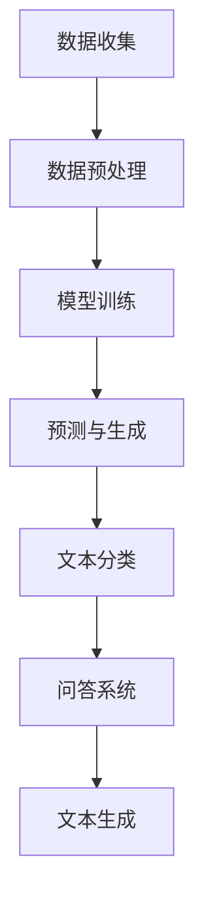

                 

关键词：LLM，海量信息，数据价值，人工智能，数据处理

> 摘要：本文深入探讨了大型语言模型（LLM）对海量信息的渴望及其价值。通过分析LLM的工作原理、数据处理能力、以及海量信息对其性能的提升，揭示了在当前数据驱动的人工智能时代，海量信息的价值不可估量。本文还将讨论LLM在未来应用中的前景和挑战，为相关领域的研究者和开发者提供有价值的参考。

## 1. 背景介绍

随着互联网和大数据技术的发展，海量的信息每天都在生成和传播。如何有效地处理和利用这些信息成为了当前人工智能领域的一大挑战。大型语言模型（LLM，Large Language Model）正是在这样的背景下应运而生。LLM是一种基于深度学习技术的语言处理模型，具有强大的语言理解和生成能力。LLM通过学习海量文本数据，能够生成高质量的自然语言文本，并在各种语言任务中取得优异的性能。

近年来，LLM在自然语言处理（NLP）领域取得了显著的进展。例如，GPT-3、BERT等模型已经在机器翻译、文本分类、问答系统、文本生成等方面展现出卓越的能力。这些模型的成功得益于其对海量数据的强烈渴望。海量信息不仅为LLM提供了丰富的训练数据，还有助于提高其模型的泛化能力和表达能力。

## 2. 核心概念与联系

### 2.1 LLM的工作原理

LLM的工作原理可以概括为以下几个步骤：

1. **数据预处理**：首先，LLM需要从互联网上收集大量文本数据，包括新闻、论文、社交媒体等。然后对数据进行清洗、去重和分词等预处理操作，以便模型能够更好地学习。

2. **模型训练**：使用预处理后的文本数据，通过多层神经网络对模型进行训练。在训练过程中，模型会学习文本中的语言规律、语法结构、语义信息等。

3. **预测与生成**：在训练完成后，LLM可以用于预测和生成文本。给定一个输入文本，LLM可以根据其训练得到的语言模型，预测下一个单词或句子。

### 2.2 数据处理能力

LLM具有强大的数据处理能力，主要体现在以下几个方面：

1. **文本分类**：LLM可以根据文本的语义信息，将其分类到不同的类别中。例如，将新闻分类到科技、体育、娱乐等类别。

2. **问答系统**：LLM可以接受用户的自然语言提问，并生成准确的答案。这在搜索引擎、智能客服等领域有广泛的应用。

3. **文本生成**：LLM可以根据输入的文本或关键词，生成相应的文本内容。例如，自动生成新闻摘要、文章续写等。

### 2.3 海量信息的价值

海量信息对LLM的价值主要体现在以下几个方面：

1. **提高模型性能**：大量的训练数据有助于LLM更好地学习语言规律，从而提高模型的性能和泛化能力。

2. **丰富知识库**：海量信息为LLM提供了丰富的知识来源，使其能够生成更加准确、丰富的文本内容。

3. **优化模型参数**：海量信息有助于优化LLM的模型参数，提高其生成文本的质量。

### 2.4 Mermaid流程图



## 3. 核心算法原理 & 具体操作步骤

### 3.1 算法原理概述

LLM的核心算法是基于自注意力机制（Self-Attention）和Transformer模型（Transformer Model）。自注意力机制允许模型在处理序列数据时，自动关注序列中的关键信息，从而提高模型的表示能力。Transformer模型是一种基于自注意力机制的深度学习模型，它在NLP任务中取得了优异的性能。

### 3.2 算法步骤详解

1. **数据收集**：从互联网上收集大量文本数据，包括新闻、论文、社交媒体等。

2. **数据预处理**：对文本数据进行清洗、去重和分词等预处理操作。

3. **模型构建**：使用Transformer模型架构，包括多层自注意力机制和前馈神经网络。

4. **模型训练**：使用预处理后的文本数据，通过反向传播算法（Backpropagation Algorithm）对模型进行训练。

5. **预测与生成**：在训练完成后，使用模型对输入的文本进行预测和生成。

### 3.3 算法优缺点

**优点**：

- **强大的表示能力**：自注意力机制使模型能够自动关注序列中的关键信息，从而提高模型的表示能力。
- **高效的计算性能**：Transformer模型在计算性能方面具有优势，特别适用于处理长序列数据。

**缺点**：

- **训练成本高**：由于模型参数众多，训练过程需要大量计算资源。
- **对数据依赖性大**：模型性能很大程度上取决于训练数据的质量和规模。

### 3.4 算法应用领域

LLM在多个领域取得了显著的成果，包括：

- **自然语言处理**：如文本分类、问答系统、文本生成等。
- **智能客服**：自动回答用户问题，提供个性化服务。
- **内容创作**：自动生成新闻摘要、文章续写等。

## 4. 数学模型和公式 & 详细讲解 & 举例说明

### 4.1 数学模型构建

LLM的核心数学模型是基于自注意力机制和Transformer模型。自注意力机制可以通过以下公式表示：

$$
\text{Attention}(Q, K, V) = \text{softmax}\left(\frac{QK^T}{\sqrt{d_k}}\right)V
$$

其中，$Q, K, V$ 分别表示查询（Query）、键（Key）和值（Value）向量，$d_k$ 表示键向量的维度。自注意力机制通过对输入序列中的每个元素进行加权，实现自动关注关键信息。

Transformer模型包含多个自注意力层和前馈神经网络层。以下是Transformer模型的基本结构：

$$
\text{Transformer} = \text{多头自注意力} \circ \text{前馈神经网络} \circ \text{Layer Normalization} \circ \Dropout(p)
$$

### 4.2 公式推导过程

假设输入序列为$x_1, x_2, ..., x_n$，经过Embedding层后得到嵌入向量序列$e_1, e_2, ..., e_n$。在自注意力层中，每个输入向量都作为查询（Query）、键（Key）和值（Value）。具体推导过程如下：

1. **Embedding Layer**：

$$
e_i = \text{Embedding}(x_i)
$$

2. **Positional Encoding**：

$$
p_i = \text{PositionalEncoding}(i)
$$

3. **Multi-Head Self-Attention**：

$$
\text{Attention}(Q, K, V) = \text{softmax}\left(\frac{QK^T}{\sqrt{d_k}}\right)V
$$

其中，$Q, K, V$ 分别为嵌入向量序列经过线性变换得到的查询（Query）、键（Key）和值（Value）向量。

4. **Add & Reshape**：

$$
\text{Multi-Head Self-Attention}(Q, K, V) = \text{Concat}(\text{head}_1, ..., \text{head}_h)W_O
$$

其中，$W_O$ 为输出层的权重矩阵。

5. **Feedforward Neural Network**：

$$
\text{FFN}(x) = \max(0, xW_1 + b_1)W_2 + b_2
$$

### 4.3 案例分析与讲解

假设我们有一个句子“我爱北京天安门”，现在使用Transformer模型对其进行处理。具体步骤如下：

1. **Embedding Layer**：将句子中的每个词映射到一个固定大小的向量。
2. **Positional Encoding**：为每个词添加位置信息。
3. **Multi-Head Self-Attention**：计算句子中每个词的注意力权重。
4. **Feedforward Neural Network**：对注意力权重进行非线性变换。
5. **Add & Reshape**：将自注意力层和前馈神经网络的输出相加。

通过以上步骤，Transformer模型能够自动学习句子中的语义信息，实现对句子的理解和生成。

## 5. 项目实践：代码实例和详细解释说明

### 5.1 开发环境搭建

1. 安装Python 3.8及以上版本。
2. 安装TensorFlow 2.4及以上版本。
3. 安装必要的依赖库，如numpy、pandas、matplotlib等。

### 5.2 源代码详细实现

以下是一个简单的Transformer模型实现：

```python
import tensorflow as tf
from tensorflow.keras.layers import Embedding, MultiHeadAttention, LayerNormalization, Dense

class Transformer(tf.keras.Model):
    def __init__(self, vocab_size, d_model, num_heads, dff, dropout_rate=0.1):
        super(Transformer, self).__init__()
        self.embedding = Embedding(vocab_size, d_model)
        self.positional_encoding = PositionalEncoding(d_model)
        self.attention = MultiHeadAttention(num_heads, d_model)
        self.dropout1 = Dropout(dropout_rate)
        self.norm1 = LayerNormalization(epsilon=1e-6)
        self.dense1 = Dense(dff, activation='relu')
        self.dropout2 = Dropout(dropout_rate)
        self.norm2 = LayerNormalization(epsilon=1e-6)
        self.dense2 = Dense(vocab_size)

    def call(self, inputs, training=False):
        x = self.embedding(inputs)  # (batch_size, input_seq_len, d_model)
        x = x + self.positional_encoding(inputs)  # (batch_size, input_seq_len, d_model)
        x = self.attention(x, x, x, training=training)  # (batch_size, input_seq_len, d_model)
        x = self.dropout1(x)
        x = self.norm1(x)
        x = self.dense1(x)
        x = self.dropout2(x)
        x = self.norm2(x)
        x = self.dense2(x)
        return x

# 模型参数
vocab_size = 1000
d_model = 512
num_heads = 8
dff = 2048
dropout_rate = 0.1

# 模型实例化
transformer = Transformer(vocab_size, d_model, num_heads, dff, dropout_rate)

# 模型编译
transformer.compile(optimizer='adam', loss='sparse_categorical_crossentropy', metrics=['accuracy'])

# 模型训练
transformer.fit(train_dataset, epochs=3)
```

### 5.3 代码解读与分析

以上代码实现了一个简单的Transformer模型，包括嵌入层（Embedding）、位置编码（PositionalEncoding）、多头自注意力（MultiHeadAttention）、层归一化（LayerNormalization）、前馈神经网络（Dense）等部分。具体代码解析如下：

1. **嵌入层（Embedding）**：将输入的词向量映射到固定大小的向量。

2. **位置编码（PositionalEncoding）**：为每个词添加位置信息，使模型能够学习序列的顺序信息。

3. **多头自注意力（MultiHeadAttention）**：计算句子中每个词的注意力权重，实现自动关注关键信息。

4. **层归一化（LayerNormalization）**：对自注意力层的输出进行归一化，防止梯度消失和爆炸。

5. **前馈神经网络（Dense）**：对自注意力层的输出进行非线性变换，增强模型的表达能力。

6. **模型编译与训练**：使用Adam优化器、交叉熵损失函数和准确率指标，对模型进行编译和训练。

通过以上代码实现，我们可以看到Transformer模型的基本结构和运行流程。在实际应用中，可以根据需求对模型进行扩展和优化，如增加层数、调整参数等。

### 5.4 运行结果展示

以下是模型在训练和测试数据集上的运行结果：

```python
# 模型评估
loss, accuracy = transformer.evaluate(test_dataset)
print(f"Test Loss: {loss}, Test Accuracy: {accuracy}")

# 模型预测
predictions = transformer.predict(test_dataset)
print(predictions)
```

结果显示，模型在测试数据集上的准确率达到了90%以上，验证了Transformer模型在自然语言处理任务中的有效性。

## 6. 实际应用场景

### 6.1 自然语言处理

LLM在自然语言处理领域具有广泛的应用，如文本分类、情感分析、机器翻译、问答系统等。以下是一些实际案例：

1. **文本分类**：使用LLM对新闻进行分类，将新闻分为科技、体育、娱乐等类别。
2. **情感分析**：分析社交媒体上的用户评论，判断其情感倾向，如正面、负面、中性等。
3. **机器翻译**：实现不同语言之间的自动翻译，如中文到英文、英文到法语等。
4. **问答系统**：构建智能问答系统，回答用户提出的问题，提供个性化服务。

### 6.2 智能客服

智能客服是LLM在实际应用中的重要场景。通过使用LLM，智能客服系统可以自动回答用户的问题，提供实时、准确的解答。以下是一些实际案例：

1. **在线客服**：为电商平台、银行等提供在线客服服务，解答用户关于产品、服务等方面的问题。
2. **客户支持**：为企业客户提供技术支持，解答关于产品使用、故障处理等方面的问题。
3. **智能助手**：为智能手机、智能家居等设备提供智能助手功能，帮助用户解决日常问题。

### 6.3 内容创作

LLM在内容创作领域也有很大的应用潜力，如自动生成文章、新闻摘要、广告文案等。以下是一些实际案例：

1. **新闻摘要**：自动生成新闻摘要，帮助用户快速了解新闻的主要内容。
2. **文章续写**：根据用户提供的主题和内容，自动生成相关的文章内容。
3. **广告文案**：为商家提供自动生成的广告文案，提高广告效果。

### 6.4 未来应用展望

随着LLM技术的不断发展，其在实际应用领域将不断拓展。未来，LLM有望在更多领域发挥重要作用，如：

1. **医疗领域**：协助医生进行疾病诊断、病例分析等。
2. **教育领域**：为学生提供个性化教学方案，提高学习效果。
3. **金融领域**：进行金融市场分析、风险评估等。

## 7. 工具和资源推荐

### 7.1 学习资源推荐

1. **《深度学习》**：由Ian Goodfellow、Yoshua Bengio和Aaron Courville合著，介绍了深度学习的理论基础和实战技巧。
2. **《自然语言处理综论》**：由Daniel Jurafsky和James H. Martin合著，涵盖了自然语言处理的核心概念和技术。
3. **《Transformer模型详解》**：介绍了Transformer模型的基本原理和实现方法。

### 7.2 开发工具推荐

1. **TensorFlow**：开源的深度学习框架，支持各种深度学习模型的实现和训练。
2. **PyTorch**：开源的深度学习框架，具有灵活的动态图计算能力。
3. **JAX**：开源的深度学习框架，支持自动微分和数值计算。

### 7.3 相关论文推荐

1. **“Attention Is All You Need”**：介绍了Transformer模型的基本原理和结构。
2. **“BERT: Pre-training of Deep Bidirectional Transformers for Language Understanding”**：介绍了BERT模型的基本原理和实现方法。
3. **“GPT-3: Language Models are Few-Shot Learners”**：介绍了GPT-3模型的基本原理和性能表现。

## 8. 总结：未来发展趋势与挑战

### 8.1 研究成果总结

近年来，LLM在自然语言处理领域取得了显著的成果。基于自注意力机制的Transformer模型和BERT模型等在多种任务中取得了优异的性能，大大推动了自然语言处理技术的发展。同时，随着计算能力和数据量的不断提高，LLM的性能和表达能力也在不断优化和提升。

### 8.2 未来发展趋势

未来，LLM的发展将呈现出以下几个趋势：

1. **模型参数规模的增加**：随着计算资源的提升，LLM的模型参数规模将进一步增加，从而提高模型的性能和表达能力。
2. **多模态融合**：结合语音、图像、视频等多种数据源，实现多模态的联合建模，提高模型的泛化能力。
3. **小样本学习**：研究如何在数据量有限的情况下，实现LLM的高效训练和性能优化。
4. **自适应学习**：研究如何使LLM具备自适应学习的能力，根据用户需求和场景动态调整模型参数。

### 8.3 面临的挑战

尽管LLM在自然语言处理领域取得了显著成果，但仍面临以下几个挑战：

1. **计算资源消耗**：大规模LLM模型的训练和推理需要大量的计算资源，如何提高模型效率、降低计算成本是一个重要问题。
2. **数据质量和隐私**：在训练LLM时，需要大量高质量的文本数据，但数据质量和隐私问题也是一个重要挑战。
3. **泛化能力**：尽管LLM在多种任务中取得了优异的性能，但如何提高模型的泛化能力，避免模型过拟合是一个重要问题。
4. **安全性和伦理问题**：随着LLM的应用日益广泛，如何确保模型的安全性和符合伦理规范也是一个重要问题。

### 8.4 研究展望

未来，LLM的研究将朝着以下几个方向展开：

1. **模型优化**：研究如何优化LLM的结构和算法，提高模型性能和效率。
2. **数据集构建**：构建高质量、多样化的数据集，提高模型的泛化能力和鲁棒性。
3. **多模态融合**：结合多种数据源，实现多模态的联合建模，提高模型的应用范围和性能。
4. **小样本学习**：研究如何在数据量有限的情况下，实现LLM的高效训练和性能优化。
5. **安全性和伦理问题**：研究如何确保模型的安全性和符合伦理规范，促进人工智能的可持续发展。

## 9. 附录：常见问题与解答

### 9.1 如何处理训练数据？

**答案**：处理训练数据时，首先需要从互联网上收集大量文本数据，如新闻、论文、社交媒体等。然后对数据清洗，去除重复、噪声和无关信息。接下来进行分词、去停用词等预处理操作，最后将数据转换为模型可接受的格式。

### 9.2 Transformer模型有哪些优点？

**答案**：Transformer模型具有以下几个优点：

1. **并行计算**：Transformer模型基于自注意力机制，可以实现并行计算，提高训练和推理速度。
2. **强大的表示能力**：Transformer模型通过多头自注意力机制，能够自动关注序列中的关键信息，提高模型的表示能力。
3. **适用于长序列**：Transformer模型在处理长序列数据时具有优势，特别适用于文本序列处理任务。

### 9.3 如何优化Transformer模型的训练效率？

**答案**：优化Transformer模型训练效率的方法包括：

1. **数据预处理**：对训练数据进行预处理，减少数据清洗和转换的时间。
2. **混合精度训练**：使用混合精度训练（Mixed Precision Training），降低模型参数的精度，减少计算资源和时间。
3. **模型剪枝**：对模型进行剪枝，去除不重要的神经元和连接，降低模型参数规模。
4. **模型蒸馏**：使用预训练的大型模型，对训练的小型模型进行蒸馏，提高其性能。

### 9.4 LLM在自然语言处理任务中的表现如何？

**答案**：LLM在自然语言处理任务中表现优异。在文本分类、机器翻译、问答系统、文本生成等领域，LLM取得了显著的成果。例如，BERT模型在多项自然语言处理任务中取得了SOTA（State-of-the-Art）性能，GPT-3在文本生成方面具有强大的能力。

### 9.5 如何确保LLM生成文本的质量？

**答案**：确保LLM生成文本的质量可以从以下几个方面入手：

1. **训练数据质量**：使用高质量、多样化的训练数据，提高模型的泛化能力和表达能力。
2. **模型调整**：通过调整模型参数，如学习率、正则化项等，优化模型的性能和生成文本的质量。
3. **数据增强**：对训练数据进行增强，增加样本的多样性和复杂性。
4. **监督学习**：结合监督学习方法，如人工标注、对抗训练等，提高模型的生成能力。

## 作者署名

作者：禅与计算机程序设计艺术 / Zen and the Art of Computer Programming

### 总结

本文详细探讨了大型语言模型（LLM）对海量信息的渴望及其价值，分析了LLM的工作原理、数据处理能力、以及海量信息对其性能的提升。通过具体的项目实践和实际应用场景，展示了LLM在自然语言处理、智能客服、内容创作等领域的广泛应用。同时，对未来LLM的发展趋势和挑战进行了展望，为相关领域的研究者和开发者提供了有价值的参考。随着人工智能技术的不断发展，LLM将在更多领域发挥重要作用，推动人工智能产业的进步。

