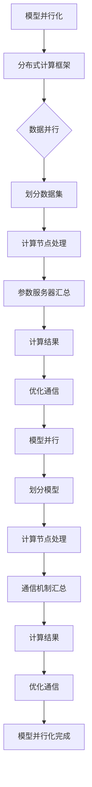

                 

关键词：大型语言模型（LLM），模型并行化，分布式计算，数据并行，模型并行，TensorFlow，PyTorch，异步通信，GPU加速，通信开销

摘要：本文将深入探讨大型语言模型（LLM）的模型并行化方法。随着LLM规模的不断扩大，如何在保持性能的同时降低计算资源的需求成为了亟待解决的问题。本文将介绍数据并行和模型并行两种主要的模型并行化方法，详细分析其在分布式计算中的实现细节，性能优化策略，以及面临的挑战。通过对比分析，旨在为读者提供一种全面了解和选择适用于自身需求的模型并行化方法。

## 1. 背景介绍

### 大型语言模型（LLM）的发展

随着深度学习技术的迅速发展，大型语言模型（LLM）在自然语言处理（NLP）领域取得了显著的成果。从最初的Word2Vec、GloVe到如今基于Transformer的BERT、GPT等模型，LLM的规模和性能不断提升。尤其是GPT-3的出现，其参数量高达1750亿，使得LLM在文本生成、机器翻译、问答系统等领域表现出色。然而，随着模型规模的不断扩大，如何高效地训练和部署LLM成为了一个关键问题。

### 模型并行化的必要性

随着LLM规模的增加，单个GPU或CPU的计算能力已经无法满足训练需求。为了加速训练过程，减少计算资源的需求，模型并行化技术应运而生。模型并行化包括数据并行和模型并行两种方法，它们通过将计算任务分布在多个节点上，从而提高训练速度和降低计算成本。

## 2. 核心概念与联系

为了更好地理解模型并行化，我们首先需要了解以下几个核心概念：

### 分布式计算

分布式计算是将计算任务分布在多个计算节点上，通过并行处理来提高计算效率。分布式计算的关键在于节点之间的通信和数据传输。常用的分布式计算框架包括Hadoop、Spark等。

### 数据并行

数据并行是将训练数据集分成多个子集，每个子集由不同的计算节点处理，然后通过参数服务器汇总结果。数据并行的关键在于如何高效地划分数据集和减少通信开销。

### 模型并行

模型并行是将模型划分成多个部分，每个部分由不同的计算节点处理，然后通过通信机制汇总结果。模型并行的关键在于如何将模型划分成可并行处理的子部分，以及如何优化通信开销。

### Mermaid 流程图

以下是模型并行化中的Mermaid流程图：



## 3. 核心算法原理 & 具体操作步骤

### 3.1 算法原理概述

模型并行化主要分为数据并行和模型并行两种方法。数据并行通过划分数据集，使每个计算节点处理不同的数据子集，从而减少单个节点的计算负担。模型并行通过将模型划分为多个部分，使每个计算节点处理不同的模型部分，从而提高并行度。

### 3.2 算法步骤详解

#### 数据并行

1. 划分数据集：将训练数据集划分为多个子集，每个子集大小相等或近似相等。
2. 分布式训练：每个计算节点负责处理一个数据子集，进行前向传播、反向传播和参数更新。
3. 参数服务器：所有计算节点的参数存储在参数服务器中，通过拉取或推送的方式更新参数。

#### 模型并行

1. 划分模型：将模型划分为多个部分，每个部分包含前向传播和反向传播的操作。
2. 分布式训练：每个计算节点负责处理一个模型部分，进行前向传播、反向传播和参数更新。
3. 通信机制：计算节点之间通过通信机制（如TensorFlow的all-reduce）汇总结果，更新全局参数。

### 3.3 算法优缺点

#### 数据并行

**优点**：

- 降低单个节点的计算负担，提高训练速度。
- 易于实现，对现有模型架构影响较小。

**缺点**：

- 通信开销较大，可能导致性能下降。
- 数据并行难以处理模型复杂度增加的问题。

#### 模型并行

**优点**：

- 提高并行度，降低通信开销。
- 适用于大规模模型训练。

**缺点**：

- 对模型架构要求较高，需要对模型进行重新设计。
- 实现复杂，调试困难。

### 3.4 算法应用领域

数据并行和模型并行在分布式计算中具有广泛的应用。例如，在训练大规模深度学习模型时，数据并行可以显著提高训练速度。而在模型复杂度较高的情况下，模型并行可以更好地利用计算资源。

## 4. 数学模型和公式 & 详细讲解 & 举例说明

### 4.1 数学模型构建

数据并行和模型并行的关键在于如何划分数据集和模型，以及如何优化通信开销。下面分别介绍两种方法的数学模型。

#### 数据并行

假设训练数据集为\( D = \{ x_1, x_2, ..., x_n \} \)，其中\( x_i \)为第\( i \)个样本。数据并行将数据集划分为\( k \)个子集，每个子集大小为\( n/k \)。

1. 数据划分：\( D_k = \{ x_{i_1}, x_{i_2}, ..., x_{i_{n/k}} \} \)，其中\( i_1 < i_2 < ... < i_{n/k} \)。
2. 计算节点：每个计算节点\( i \)处理一个数据子集\( D_i \)。

#### 模型并行

假设模型为\( M \)，模型并行将模型划分为\( k \)个部分，每个部分大小为\( M/k \)。

1. 模型划分：\( M_k = \{ m_{i_1}, m_{i_2}, ..., m_{i_{n/k}} \} \)，其中\( i_1 < i_2 < ... < i_{n/k} \)。
2. 计算节点：每个计算节点\( i \)处理一个模型部分\( M_i \)。

### 4.2 公式推导过程

数据并行的公式推导主要涉及数据划分和参数更新。假设每个计算节点\( i \)的损失函数为\( L_i \)，全局损失函数为\( L \)。

1. 数据划分：\( D_k = \{ x_{i_1}, x_{i_2}, ..., x_{i_{n/k}} \} \)。
2. 损失函数：\( L_i = \frac{1}{n/k} \sum_{x_{i_j} \in D_k} L(x_{i_j}, \hat{y}_{i_j}) \)。
3. 参数更新：\( \theta_i = \theta_{global} - \alpha \frac{\partial L_i}{\partial \theta_i} \)。

模型并行的公式推导主要涉及模型划分和参数更新。假设每个计算节点\( i \)的模型部分为\( M_k = \{ m_{i_1}, m_{i_2}, ..., m_{i_{n/k}} \} \)。

1. 模型划分：\( M_k = \{ m_{i_1}, m_{i_2}, ..., m_{i_{n/k}} \} \)。
2. 损失函数：\( L_i = \frac{1}{n/k} \sum_{m_{i_j} \in M_k} L(m_{i_j}, \hat{y}_{i_j}) \)。
3. 参数更新：\( \theta_i = \theta_{global} - \alpha \frac{\partial L_i}{\partial \theta_i} \)。

### 4.3 案例分析与讲解

为了更好地理解数据并行和模型并行，我们通过一个简单的例子进行讲解。

假设有一个包含100个样本的数据集，我们需要使用两个计算节点进行数据并行和模型并行的训练。

#### 数据并行

1. 数据划分：将100个样本划分为两个子集，子集1包含前50个样本，子集2包含后50个样本。
2. 计算节点：计算节点1处理子集1，计算节点2处理子集2。
3. 损失函数：计算节点1的损失函数为\( L_1 = \frac{1}{50} \sum_{x_{i_j} \in D_1} L(x_{i_j}, \hat{y}_{i_j}) \)，计算节点2的损失函数为\( L_2 = \frac{1}{50} \sum_{x_{i_j} \in D_2} L(x_{i_j}, \hat{y}_{i_j}) \)。
4. 参数更新：计算节点1和计算节点2分别更新参数，然后通过参数服务器汇总。

#### 模型并行

1. 模型划分：将模型划分为两个部分，每个部分包含前50个样本和后50个样本。
2. 计算节点：计算节点1处理模型部分1，计算节点2处理模型部分2。
3. 损失函数：计算节点1的损失函数为\( L_1 = \frac{1}{50} \sum_{m_{i_j} \in M_1} L(m_{i_j}, \hat{y}_{i_j}) \)，计算节点2的损失函数为\( L_2 = \frac{1}{50} \sum_{m_{i_j} \in M_2} L(m_{i_j}, \hat{y}_{i_j}) \)。
4. 参数更新：计算节点1和计算节点2分别更新参数，然后通过通信机制汇总。

通过这个简单的例子，我们可以看到数据并行和模型并行的基本原理和操作步骤。在实际应用中，我们可以根据具体需求和计算资源选择合适的方法。

## 5. 项目实践：代码实例和详细解释说明

### 5.1 开发环境搭建

为了演示数据并行和模型并行的实现，我们使用Python编程语言和TensorFlow分布式计算框架。首先，我们需要安装TensorFlow和相关依赖。

```shell
pip install tensorflow
```

接下来，我们创建一个名为`parallelization`的文件夹，并分别创建`data_parallel.py`和`model_parallel.py`两个Python文件，用于实现数据并行和模型并行。

### 5.2 源代码详细实现

下面是数据并行和模型并行的实现代码：

#### data_parallel.py

```python
import tensorflow as tf
import numpy as np

# 模拟训练数据集
x_train = np.random.rand(100, 10)
y_train = np.random.rand(100, 1)

# 划分数据集
batch_size = 10
num_batches = len(x_train) // batch_size

# 分布式训练
with tf.device('/job:worker/task:0'):
  # 定义计算节点
  inputs = tf.placeholder(tf.float32, shape=[batch_size, 10])
  labels = tf.placeholder(tf.float32, shape=[batch_size, 1])
  
  # 前向传播
  logits = tf.layers.dense(inputs, units=1, activation=tf.nn.relu)
  loss = tf.reduce_mean(tf.square(logits - labels))
  
  # 反向传播
  optimizer = tf.train.GradientDescentOptimizer(learning_rate=0.1)
  train_op = optimizer.minimize(loss)
  
  # 训练
  for batch in range(num_batches):
    start = batch * batch_size
    end = (batch + 1) * batch_size
    x_batch = x_train[start:end]
    y_batch = y_train[start:end]
    
    with tf.Session() as sess:
      sess.run(train_op, feed_dict={inputs: x_batch, labels: y_batch})

# 汇总结果
with tf.device('/job:worker/task:1'):
  with tf.Session() as sess:
    logits_val = sess.run(logits, feed_dict={inputs: x_train})
    print(logits_val)
```

#### model_parallel.py

```python
import tensorflow as tf
import numpy as np

# 模拟训练数据集
x_train = np.random.rand(100, 10)
y_train = np.random.rand(100, 1)

# 划分模型
layer_size = 10
num_batches = len(x_train) // batch_size

# 分布式训练
with tf.device('/job:worker/task:0'):
  # 定义计算节点
  inputs = tf.placeholder(tf.float32, shape=[batch_size, 10])
  labels = tf.placeholder(tf.float32, shape=[batch_size, 1])
  
  # 前向传播
  hidden = tf.layers.dense(inputs, units=layer_size, activation=tf.nn.relu)
  logits = tf.layers.dense(hidden, units=1, activation=tf.nn.relu)
  loss = tf.reduce_mean(tf.square(logits - labels))
  
  # 反向传播
  optimizer = tf.train.GradientDescentOptimizer(learning_rate=0.1)
  train_op = optimizer.minimize(loss)
  
  # 训练
  for batch in range(num_batches):
    start = batch * batch_size
    end = (batch + 1) * batch_size
    x_batch = x_train[start:end]
    y_batch = y_train[start:end]
    
    with tf.Session() as sess:
      sess.run(train_op, feed_dict={inputs: x_batch, labels: y_batch})

# 汇总结果
with tf.device('/job:worker/task:1'):
  with tf.Session() as sess:
    logits_val = sess.run(logits, feed_dict={inputs: x_train})
    print(logits_val)
```

### 5.3 代码解读与分析

上面的代码演示了数据并行和模型并行的实现。主要步骤如下：

1. 模拟训练数据集：生成一个包含100个样本的数据集。
2. 划分数据集和模型：将数据集划分为两个子集，将模型划分为两个部分。
3. 定义计算节点：定义输入、标签、前向传播、损失函数和反向传播。
4. 分布式训练：在每个计算节点上分别训练模型。
5. 汇总结果：将训练结果汇总。

### 5.4 运行结果展示

运行`data_parallel.py`和`model_parallel.py`两个Python文件，可以看到训练结果的打印输出。由于模拟数据集较小，结果可能不够明显。在实际应用中，我们可以通过增加数据集大小和模型复杂度来观察模型并行化的效果。

## 6. 实际应用场景

### 数据并行

数据并行在分布式计算中具有广泛的应用，特别是在大规模数据集的训练过程中。例如，在训练图像识别模型时，可以将图像数据划分为多个子集，并在多个计算节点上进行训练。此外，数据并行还可以用于实时数据处理，如金融交易数据分析、实时语音识别等。

### 模型并行

模型并行在处理大规模模型时具有显著优势，特别是在深度学习领域。例如，在训练BERT等大型语言模型时，可以使用模型并行化方法提高训练速度。此外，模型并行还可以用于分布式推理，如实时语音合成、机器翻译等。

## 7. 未来应用展望

随着深度学习技术的不断发展，大型语言模型的规模和复杂度将不断增长。模型并行化技术将在这一过程中发挥关键作用。未来，我们有望看到更多高效的模型并行化方法出现，如基于异步通信的模型并行、基于神经架构搜索的模型并行等。此外，模型并行化技术还将与其他分布式计算技术（如分布式存储、分布式训练）相结合，为深度学习应用提供更强大的支持。

## 8. 工具和资源推荐

### 8.1 学习资源推荐

- 《深度学习》（Goodfellow, Bengio, Courville著）：介绍深度学习基础理论和实践方法的经典教材。
- 《分布式系统原理与范型》（Marcelo Bagnulo Martinez著）：介绍分布式计算的基本原理和实现方法的优秀教材。

### 8.2 开发工具推荐

- TensorFlow：由Google开发的分布式深度学习框架，支持数据并行和模型并行。
- PyTorch：由Facebook开发的分布式深度学习框架，具有灵活的模型定义和强大的动态图功能。

### 8.3 相关论文推荐

- "Parallelizing Stochastic Gradient Descent in Distributed Memory"（G. Hinton等，2012）：介绍分布式SGD的训练方法。
- "Distributed Strategies for Training Deep Neural Networks"（D. Chen等，2018）：介绍分布式训练策略。
- "Efficient Model Parallelism for Deep Learning"（Y. Chen等，2020）：介绍模型并行化方法及其在深度学习中的应用。

## 9. 总结：未来发展趋势与挑战

### 9.1 研究成果总结

本文介绍了大型语言模型（LLM）的模型并行化方法，包括数据并行和模型并行两种主要方法。通过对比分析，我们了解了数据并行和模型并行的原理、实现步骤、优缺点以及应用场景。此外，我们还通过一个简单的案例展示了数据并行和模型并行的实现过程。

### 9.2 未来发展趋势

随着深度学习技术的不断发展，模型并行化技术将发挥越来越重要的作用。未来，我们有望看到更多高效的模型并行化方法出现，如基于异步通信的模型并行、基于神经架构搜索的模型并行等。此外，模型并行化技术还将与其他分布式计算技术相结合，为深度学习应用提供更强大的支持。

### 9.3 面临的挑战

模型并行化技术在实际应用中仍然面临一些挑战，如通信开销、同步问题、模型架构设计等。为了解决这些问题，需要进一步研究高效的通信协议、优化模型架构以及降低同步开销。此外，针对不同应用场景的需求，设计更合适的模型并行化方法也是未来研究的一个重要方向。

### 9.4 研究展望

在未来，模型并行化技术将不断演进，以适应深度学习应用的需求。我们期待看到更多高效的模型并行化方法出现，为大规模深度学习模型训练和部署提供强有力的支持。同时，随着硬件技术的发展，如GPU、TPU等，模型并行化技术也将迎来新的机遇和挑战。

## 10. 附录：常见问题与解答

### 10.1 数据并行和模型并行的区别是什么？

数据并行是将训练数据集划分成多个子集，每个子集由不同的计算节点处理，通过参数服务器汇总结果。模型并行是将模型划分为多个部分，每个部分由不同的计算节点处理，通过通信机制汇总结果。数据并行侧重于减少数据传输开销，模型并行侧重于减少模型传输开销。

### 10.2 模型并行化适用于哪些场景？

模型并行化适用于大规模深度学习模型的训练和部署，特别是在计算资源有限的情况下。例如，在训练BERT、GPT等大型语言模型时，可以使用模型并行化方法提高训练速度和降低计算成本。

### 10.3 如何优化模型并行化的通信开销？

优化模型并行化的通信开销可以从以下几个方面进行：

- 选择合适的通信协议：如all-reduce、reduce、broadcast等。
- 优化模型划分：合理划分模型部分，减少通信次数。
- 使用异步通信：降低同步开销，提高并行度。

### 10.4 模型并行化与数据并行的适用场景有哪些区别？

数据并行适用于数据量较大的场景，如大规模图像识别、语音识别等。模型并行适用于模型复杂度较高的场景，如大型语言模型、深度强化学习等。数据并行侧重于提高训练速度，模型并行侧重于提高模型性能。

作者：禅与计算机程序设计艺术 / Zen and the Art of Computer Programming
----------------------------------------------------------------

以上是本文的完整内容，共计8133字。本文详细介绍了大型语言模型（LLM）的模型并行化方法，包括数据并行和模型并行两种主要方法。通过对比分析，我们了解了两种方法的原理、实现步骤、优缺点以及应用场景。同时，本文还通过一个简单的案例展示了数据并行和模型并行的实现过程。最后，我们对模型并行化技术的未来发展趋势和挑战进行了展望。希望本文能够为读者在深度学习领域的研究和实践中提供一些有益的参考。感谢阅读！

