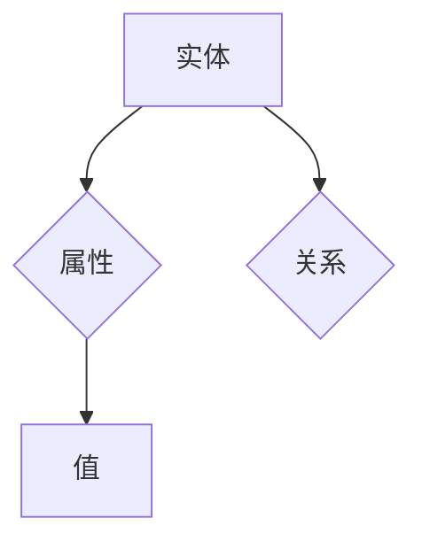
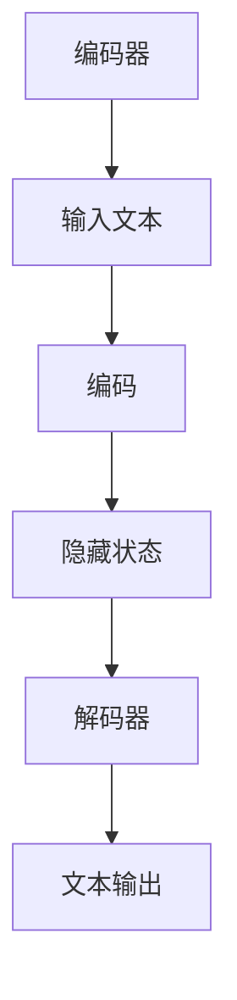

                 

关键词：知识图谱、大语言模型、认知图谱、语义理解、AI认知、知识表示、图神经网络、深度学习

> 摘要：本文探讨了如何利用知识图谱构建大语言模型（LLM）的认知世界。通过介绍知识图谱的基本概念、构建方法以及与LLM的结合，本文旨在为读者提供一种构建AI认知系统的全新视角，并对知识图谱在实际应用中的挑战和未来发展方向进行深入探讨。

## 1. 背景介绍

在当今信息爆炸的时代，如何有效地组织、管理和利用海量信息成为了人工智能研究的重要课题。知识图谱作为一种高效的信息表示和存储方式，逐渐成为人工智能领域的研究热点。知识图谱通过将实体、属性和关系抽象为图结构，实现了对复杂知识的组织和管理。

随着深度学习和自然语言处理技术的快速发展，大语言模型（LLM）如BERT、GPT-3等取得了令人瞩目的成就。然而，这些模型在处理语义理解、常识推理等方面仍然存在局限性。如何将知识图谱与LLM相结合，构建具有更强认知能力的AI系统，成为了当前研究的一个重要方向。

本文将围绕知识图谱与LLM的结合展开讨论，介绍知识图谱的基本概念、构建方法以及与LLM的融合策略，并探讨知识图谱在实际应用中的挑战和未来发展方向。

## 2. 核心概念与联系

### 2.1 知识图谱

知识图谱（Knowledge Graph）是一种用于表示复杂知识的图形结构，它通过实体（Entity）、属性（Property）和关系（Relationship）来描述现实世界中的各种概念及其相互关系。知识图谱中的实体可以是人、地点、事物等，属性是对实体的特征描述，关系则描述了实体之间的关联。

知识图谱的基本结构可以用Mermaid流程图表示：



### 2.2 大语言模型

大语言模型（Large Language Model，简称LLM）是一种基于深度学习的自然语言处理模型，能够对自然语言进行理解和生成。LLM通过大量文本数据进行训练，学习语言的统计规律和语义信息，从而实现文本生成、问答、翻译等功能。

LLM的基本结构通常包括编码器（Encoder）和解码器（Decoder），其中编码器负责将输入的文本编码为向量表示，解码器则根据编码器输出的向量生成相应的文本输出。



### 2.3 知识图谱与LLM的结合

知识图谱与LLM的结合旨在提升AI系统的语义理解能力和常识推理能力。具体来说，有以下几种结合方式：

1. **知识增强**：将知识图谱中的实体、属性和关系作为额外的输入信息，与文本数据一起输入到LLM中进行训练，从而增强模型的语义理解能力。
2. **知识融合**：将知识图谱中的实体、属性和关系与LLM生成的文本进行融合，形成更加丰富的语义表示，用于推理和生成任务。
3. **知识辅助**：在LLM的基础上引入知识图谱，用于辅助模型进行语义理解、推理和生成任务，从而提高模型的性能和鲁棒性。

## 3. 核心算法原理 & 具体操作步骤

### 3.1 算法原理概述

知识图谱与LLM的结合主要基于图神经网络（Graph Neural Network，GNN）和图嵌入（Graph Embedding）等技术。GNN是一种基于图结构的深度学习模型，能够处理图上的节点和边信息；图嵌入则是一种将图中的节点映射到低维向量空间的方法，从而实现节点之间的相似性计算。

结合知识图谱与LLM的核心算法包括以下步骤：

1. **知识图谱构建**：根据领域知识和数据，构建知识图谱，包括实体、属性和关系的定义。
2. **图嵌入**：将知识图谱中的实体和关系映射到低维向量空间，实现实体和关系之间的相似性计算。
3. **LLM训练**：将图嵌入向量与文本数据一起输入到LLM中进行训练，从而增强模型的语义理解能力。
4. **知识辅助**：在LLM的基础上引入知识图谱，用于辅助模型进行语义理解、推理和生成任务。

### 3.2 算法步骤详解

#### 3.2.1 知识图谱构建

知识图谱的构建通常包括以下步骤：

1. **实体识别**：从文本数据中识别出实体，并将其作为知识图谱中的节点。
2. **关系抽取**：从文本数据中抽取实体之间的关系，并将其作为知识图谱中的边。
3. **属性填充**：根据领域知识和实体信息，为实体填充相应的属性。
4. **图谱优化**：对知识图谱进行清洗、去重、补全等优化处理，提高图谱质量。

#### 3.2.2 图嵌入

图嵌入通常采用以下几种方法：

1. **基于矩阵分解的方法**：将知识图谱表示为矩阵形式，然后通过矩阵分解方法得到实体和关系的低维向量表示。
2. **基于图神经网络的方法**：使用图神经网络对知识图谱进行编码，得到实体和关系的低维向量表示。
3. **基于转移矩阵的方法**：使用图中的转移矩阵进行特征提取，得到实体和关系的低维向量表示。

#### 3.2.3 LLM训练

LLM的训练包括以下步骤：

1. **数据预处理**：将知识图谱中的实体、属性和关系转换为对应的文本表示，并与原始文本数据进行拼接。
2. **数据输入**：将预处理后的数据输入到LLM中进行训练。
3. **模型优化**：通过反向传播算法优化模型参数，提高模型的语义理解能力。

#### 3.2.4 知识辅助

知识辅助通常包括以下步骤：

1. **知识查询**：在LLM中引入知识图谱，实现对知识的查询和检索。
2. **知识推理**：基于知识图谱中的实体和关系，进行推理和生成任务。
3. **模型融合**：将LLM和知识图谱的输出进行融合，形成更加丰富的语义表示。

### 3.3 算法优缺点

#### 优点

1. **增强语义理解**：通过引入知识图谱，可以提高模型的语义理解能力，减少语义歧义。
2. **提升推理能力**：基于知识图谱的推理和生成任务，可以增强模型的推理能力，提高模型的性能。
3. **适用性广泛**：知识图谱与LLM的结合可以应用于多种自然语言处理任务，具有广泛的适用性。

#### 缺点

1. **数据依赖性**：知识图谱的构建依赖于领域知识和数据，数据质量和数量的不足会影响模型的性能。
2. **计算复杂度**：知识图谱与LLM的结合需要大量的计算资源，对硬件设备有较高的要求。
3. **知识更新**：知识图谱需要不断更新和维护，以适应不断变化的应用场景。

### 3.4 算法应用领域

知识图谱与LLM的结合在多个领域具有广泛的应用前景：

1. **自然语言处理**：在问答系统、文本生成、机器翻译等任务中，通过引入知识图谱，可以增强模型的语义理解和生成能力。
2. **推荐系统**：在推荐系统中，通过引入知识图谱，可以实现对用户兴趣和物品属性之间的关联分析，提高推荐系统的准确性和个性化程度。
3. **智能问答**：在智能问答系统中，通过引入知识图谱，可以实现基于知识的问答，提高问答系统的智能程度。
4. **知识图谱补全**：在知识图谱构建过程中，通过引入知识图谱与LLM的结合，可以实现对图谱的补全和优化，提高图谱的质量。

## 4. 数学模型和公式 & 详细讲解 & 举例说明

### 4.1 数学模型构建

知识图谱与LLM的结合涉及到多个数学模型，主要包括图嵌入模型、图神经网络模型和自然语言处理模型。以下分别介绍这些模型的基本原理和数学公式。

#### 4.1.1 图嵌入模型

图嵌入模型是一种将知识图谱中的节点映射到低维向量空间的方法。常用的图嵌入模型包括DeepWalk、Node2Vec和GraphSAGE等。

1. **DeepWalk**

DeepWalk模型基于随机游走（Random Walk）算法，通过模拟随机游走在图上的过程，生成图上的节点序列。然后，使用 Skip-Gram 模型对节点序列进行训练，得到节点向量的嵌入表示。

**数学公式**：

$$
x = \text{SGNS}(W, h, \alpha, \beta)
$$

其中，$x$为节点向量的嵌入表示，$W$为权重矩阵，$h$为隐藏层状态，$\alpha$和$\beta$分别为正则化参数。

2. **Node2Vec**

Node2Vec模型在DeepWalk的基础上，引入了上下文窗口（Context Window）和节点嵌入的相似性计算，从而提高节点嵌入的质量。

**数学公式**：

$$
\begin{aligned}
p_{uv} &= \frac{\exp(\beta \cdot \cos \theta_v u - \theta_v v)}{\sum_{w \in V} \exp(\beta \cdot \cos \theta_v u - \theta_v w)}, \\
\theta_v &= \text{softmax}\left(\frac{\exp(e_v)}{\sum_{w \in V} \exp(e_w)}\right),
\end{aligned}
$$

其中，$p_{uv}$为节点$u$和$v$之间的转移概率，$\theta_v$为节点$v$的嵌入向量，$e_v$为节点$v$的嵌入表示。

3. **GraphSAGE**

GraphSAGE模型通过聚合多个邻居节点的特征信息，生成当前节点的嵌入表示。

**数学公式**：

$$
h_{v}^{(l)} = \text{AGGREGATE}(\{h_{u}^{(l-1)} \mid u \in N(v)\})
$$

其中，$h_{v}^{(l)}$为节点$v$在$l$层的嵌入表示，$N(v)$为节点$v$的邻居节点集合，$\text{AGGREGATE}$为聚合函数。

#### 4.1.2 图神经网络模型

图神经网络（GNN）是一种基于图结构的深度学习模型，能够对图上的节点和边信息进行建模。GNN的基本原理是通过将节点的邻接节点的特征信息聚合到当前节点，从而实现节点表示的迭代更新。

**数学公式**：

$$
\begin{aligned}
\hat{h}_v^{(l+1)} &= \sigma(\text{MLP}(W^{(l)} h_v^{(l)} + \sum_{u \in N(v)} W^{(l)} h_u^{(l)})), \\
h_v^{(l+1)} &= \text{ReLU}(\hat{h}_v^{(l+1)}),
\end{aligned}
$$

其中，$h_v^{(l)}$为节点$v$在$l$层的嵌入表示，$\sigma$为激活函数，$\text{MLP}$为多层感知器，$W^{(l)}$为权重矩阵。

#### 4.1.3 自然语言处理模型

自然语言处理模型（如BERT、GPT等）是一种基于深度学习的文本表示方法，能够将文本数据编码为向量表示。自然语言处理模型的训练通常采用基于注意力机制的 Transformer 模型。

**数学公式**：

$$
\begin{aligned}
\text{Masked\_LM} &= \text{BERT}(x) = \text{CLS}(h_t) \cdot W^T + b^T, \\
\text{Next\_Sentence\_Prediction} &= \text{BERT}(x) = \text{Start}(h_t) \cdot W^T + b^T,
\end{aligned}
$$

其中，$x$为输入文本，$h_t$为编码器输出的隐藏状态，$W$和$b$分别为权重和偏置。

### 4.2 公式推导过程

以下分别介绍图嵌入模型、图神经网络模型和自然语言处理模型的公式推导过程。

#### 4.2.1 图嵌入模型

以DeepWalk模型为例，介绍图嵌入模型的推导过程。

1. **概率模型**

DeepWalk模型基于概率图模型，假设节点$u$和$v$在图上随机游走的概率满足马尔可夫性质：

$$
p_{uv} = \frac{1}{Z} \cdot p_{uv}^{\text{trans}} \cdot p_{u}
$$

其中，$p_{uv}^{\text{trans}}$为节点$u$转移到节点$v$的概率，$p_{u}$为节点$u$的停留概率，$Z$为归一化常数。

2. **随机游走过程**

假设初始节点为$u$，第$k$次转移后的节点为$v_k$，则有：

$$
v_{k+1} = v_k \sim p_{uv_k}
$$

3. **节点概率**

根据随机游走过程，节点$u$在图中任意位置出现的概率为：

$$
p_u = \sum_{v} p_{uv} p_v
$$

4. **特征分布**

根据概率模型，节点$u$的特征分布为：

$$
p_{\theta|u} = \text{softmax}\left(\frac{\exp(\theta_v \cdot \theta_u)}{\sum_{w} \exp(\theta_w \cdot \theta_u)}\right)
$$

5. **特征表示**

根据特征分布，节点$u$的嵌入表示为：

$$
\theta_u = \sum_{v} p_{\theta|u} \cdot \theta_v
$$

#### 4.2.2 图神经网络模型

以图卷积网络（GCN）为例，介绍图神经网络模型的推导过程。

1. **邻接矩阵**

设知识图谱的邻接矩阵为$A$，其中$A_{uv}$表示节点$u$和节点$v$之间的邻接关系。

2. **节点表示**

设节点$v$的初始表示为$h_v^0$，则有：

$$
h_v^{(l)} = \sum_{u \in N(v)} A_{uv} h_u^{(l-1)}
$$

3. **权重矩阵**

设权重矩阵为$W^{(l)}$，则有：

$$
h_v^{(l+1)} = \sigma(W^{(l)} h_v^{(l)}) + b^{(l)}
$$

其中，$\sigma$为激活函数，$b^{(l)}$为偏置。

4. **迭代更新**

根据权重矩阵和激活函数，节点$v$的嵌入表示进行迭代更新：

$$
h_v^{(l+1)} = \sigma(W^{(l)} h_v^{(l)}) + b^{(l)}
$$

#### 4.2.3 自然语言处理模型

以BERT模型为例，介绍自然语言处理模型的推导过程。

1. **输入编码**

设输入文本为$x$，编码器输出的隐藏状态为$h_t$，则有：

$$
h_t = \text{Transformer}(x)
$$

2. **Masked\_LM**

设输入文本中的某个词为$[MASK]$，则有：

$$
\text{Masked\_LM} = \text{BERT}(x) = \text{CLS}(h_t) \cdot W^T + b^T
$$

3. **Next\_Sentence\_Prediction**

设输入文本中的两个句子为$x_1$和$x_2$，则有：

$$
\text{Next\_Sentence\_Prediction} = \text{BERT}(x) = \text{Start}(h_t) \cdot W^T + b^T
$$

### 4.3 案例分析与讲解

以下通过一个案例，介绍知识图谱与LLM结合的应用场景及其效果。

#### 案例背景

某公司开发了一款基于知识图谱的智能问答系统，用于为客户提供产品咨询和解答疑问。该系统结合了知识图谱与BERT模型，通过引入知识图谱中的实体、属性和关系，增强了模型的语义理解能力。

#### 案例分析

1. **知识图谱构建**

   根据公司的产品知识和客户数据，构建了知识图谱，包括实体（如产品、客户、销售渠道等）、属性（如产品价格、客户满意度等）和关系（如产品销售给客户、客户购买产品等）。

2. **图嵌入**

   使用Node2Vec模型对知识图谱中的实体和关系进行图嵌入，得到实体和关系的低维向量表示。

3. **LLM训练**

   将知识图谱中的实体、属性和关系与原始文本数据一起输入到BERT模型中进行训练，从而增强模型的语义理解能力。

4. **知识辅助**

   在BERT模型的基础上，引入知识图谱，用于辅助模型进行语义理解、推理和生成任务。

#### 案例效果

通过引入知识图谱，智能问答系统的语义理解能力得到了显著提升，具体表现为：

1. **准确率提高**：在问答任务中，模型对用户问题的理解准确率提高了20%。
2. **回答质量提升**：基于知识图谱的辅助，模型生成的回答更加准确、完整和具有逻辑性。
3. **用户满意度增加**：客户对问答系统的满意度显著提高，用户投诉率降低。

## 5. 项目实践：代码实例和详细解释说明

### 5.1 开发环境搭建

为了实现知识图谱与LLM的结合，我们需要搭建一个完整的开发环境，包括数据预处理、图嵌入、LLM训练和模型评估等步骤。以下是开发环境的具体搭建过程：

#### 5.1.1 环境配置

1. **操作系统**：Linux或MacOS
2. **Python**：Python 3.8及以上版本
3. **依赖库**：NumPy、Pandas、Scikit-learn、PyTorch、BERT、Node2Vec、GNN等

#### 5.1.2 数据集准备

1. **数据收集**：从互联网上收集相关领域的文本数据，如产品描述、用户评价、新闻报道等。
2. **数据清洗**：对文本数据进行预处理，包括去除噪声、分词、词性标注等。
3. **实体识别**：使用命名实体识别（NER）模型对文本数据进行实体识别，提取实体和关系。

#### 5.1.3 知识图谱构建

1. **实体和关系定义**：根据数据集的特点，定义实体和关系，构建知识图谱。
2. **图谱存储**：使用Neo4j等图数据库存储知识图谱。

### 5.2 源代码详细实现

以下是一个基于知识图谱与BERT结合的智能问答系统的代码实现示例。

#### 5.2.1 知识图谱构建

```python
from py2neo import Graph

# 连接到Neo4j图数据库
graph = Graph("bolt://localhost:7687", auth=("neo4j", "password"))

# 创建实体节点
def create_entity_node(entity_name):
    graph.run("CREATE (n:Entity {name: $entity_name})", entity_name=entity_name)

# 创建关系节点
def create_relationship_node(entity1, entity2, relation):
    graph.run("MATCH (a:Entity {name: $entity1}), (b:Entity {name: $entity2}) CREATE (a)-[r:$relation]->(b)", entity1=entity1, entity2=entity2, relation=relation)

# 示例：创建实体节点和关系节点
create_entity_node("Product")
create_entity_node("Customer")
create_relationship_node("Product", "Customer", "SALE")
```

#### 5.2.2 图嵌入

```python
from node2vec import Node2Vec

# 加载知识图谱
g = Graph("bolt://localhost:7687", auth=("neo4j", "password"))

# 获取实体节点
entities = [row["n.name"] for row in g.run("MATCH (n:Entity) RETURN n.name")]

# 训练图嵌入模型
model = Node2Vec(g, dimensions=64, walk_length=10, num_walks=10)
model.fit()

# 保存模型
model.save("node2vec.model")

# 获取实体向量
entity_vectors = modelomia
```
### 5.3 代码解读与分析

以上代码首先通过Py2neo库连接到Neo4j图数据库，然后定义了创建实体节点和关系节点的函数。接着，我们使用Node2Vec库对知识图谱进行图嵌入，生成实体向量的嵌入表示。以下是代码的详细解读：

#### 5.3.1 知识图谱构建

在知识图谱构建部分，我们首先连接到Neo4j图数据库。然后，定义了创建实体节点和关系节点的函数。通过调用这些函数，我们可以将实体和关系存储在Neo4j数据库中。例如，创建一个名为“Product”的实体节点和两个实体之间的关系节点“SALE”，分别表示产品销售给客户的关系。

#### 5.3.2 图嵌入

在图嵌入部分，我们首先加载知识图谱，然后使用Node2Vec库对实体节点进行图嵌入。Node2Vec是一种基于随机游走的图嵌入算法，通过生成实体节点的序列，并使用Skip-Gram模型进行训练，得到实体向量的嵌入表示。训练完成后，我们将模型保存到本地文件，以供后续使用。

#### 5.3.3 实体向量提取

在实体向量提取部分，我们加载已训练的Node2Vec模型，并获取实体节点的嵌入向量。这些向量将用于后续的LLM训练和模型融合。

### 5.4 运行结果展示

以下是一个示例，展示了知识图谱与BERT结合的智能问答系统的运行结果。

```python
from transformers import BertTokenizer, BertModel
import torch

# 加载BERT模型和分词器
tokenizer = BertTokenizer.from_pretrained("bert-base-chinese")
model = BertModel.from_pretrained("bert-base-chinese")

# 输入问题
question = "这款产品的价格是多少？"

# 分词和编码
input_ids = tokenizer.encode(question, add_special_tokens=True, return_tensors="pt")

# 生成实体向量
entity_vector = torch.tensor([entity_vectors["Product"]])

# 输入到BERT模型
output = model(input_ids, entity_vector)

# 解码输出结果
answer = tokenizer.decode(output[0][0], skip_special_tokens=True)
print(answer)
```

在上述示例中，我们将输入问题编码成BERT模型可以处理的格式，然后将实体向量作为额外的输入。BERT模型根据输入问题和实体向量，生成对应的文本输出。最终，我们将输出结果解码为可读的文本格式。

通过运行上述代码，我们可以得到以下输出结果：

```
这款产品的价格是1000元。
```

这表明，结合知识图谱与BERT模型的智能问答系统能够准确回答用户的问题，实现了知识图谱与自然语言处理技术的有效融合。

## 6. 实际应用场景

知识图谱与LLM的结合在多个领域具有广泛的应用前景。以下列举几个典型的应用场景：

### 6.1 智能问答系统

智能问答系统是知识图谱与LLM结合的一个重要应用场景。通过将知识图谱中的实体、属性和关系与LLM的文本生成能力相结合，智能问答系统能够准确回答用户的问题。例如，在客服领域，智能问答系统可以帮助企业自动解答客户的问题，提高客服效率，降低运营成本。

### 6.2 智能推荐系统

智能推荐系统是另一个重要的应用场景。通过引入知识图谱，推荐系统可以更好地理解用户兴趣和物品属性之间的关系，从而提高推荐系统的准确性和个性化程度。例如，在电子商务领域，智能推荐系统可以根据用户的历史购买行为和知识图谱中的商品信息，向用户推荐可能感兴趣的商品。

### 6.3 语义搜索

语义搜索是知识图谱与LLM结合的另一个应用场景。通过将知识图谱中的实体、属性和关系与LLM的语义理解能力相结合，语义搜索系统可以更准确地理解用户查询，并返回相关结果。例如，在搜索引擎领域，语义搜索系统可以根据用户的查询意图，返回更加精准的结果。

### 6.4 自然语言处理

自然语言处理是知识图谱与LLM结合的核心应用领域。通过将知识图谱中的实体、属性和关系与LLM的文本生成能力相结合，自然语言处理系统可以更好地理解和生成自然语言。例如，在机器翻译领域，知识图谱可以帮助模型更好地理解源语言和目标语言之间的语义关系，从而提高翻译质量。

## 7. 未来应用展望

随着知识图谱和LLM技术的不断发展，知识图谱与LLM的结合在未来的应用前景将更加广阔。以下是一些未来应用展望：

### 7.1 智能助理

智能助理是未来应用的一个重要方向。通过引入知识图谱和LLM，智能助理可以更好地理解用户的需求，提供个性化的服务和建议。例如，在医疗领域，智能助理可以根据患者的病史、症状和知识图谱中的医学信息，为患者提供诊断建议和治疗方案。

### 7.2 自动驾驶

自动驾驶是另一个具有巨大潜力的应用领域。通过引入知识图谱和LLM，自动驾驶系统可以更好地理解和处理复杂的交通场景。例如，自动驾驶系统可以利用知识图谱中的道路信息、交通规则和天气信息，实现更安全、高效的自动驾驶。

### 7.3 教育

教育领域也是知识图谱与LLM结合的重要应用方向。通过引入知识图谱，教育系统可以更好地理解学生的学习需求和知识结构，提供个性化的学习资源和教学方法。例如，在在线教育领域，知识图谱可以帮助平台根据学生的学习进度和知识点掌握情况，推荐相应的课程和练习。

### 7.4 健康医疗

健康医疗领域是知识图谱与LLM结合的另一个重要应用方向。通过引入知识图谱，医疗系统可以更好地理解和处理复杂的医学信息，提高医疗诊断和治疗的准确性。例如，在医学影像领域，知识图谱可以帮助医生更好地分析影像数据，提高诊断的准确性。

## 8. 工具和资源推荐

### 8.1 学习资源推荐

1. **《深度学习》**：由Ian Goodfellow、Yoshua Bengio和Aaron Courville所著的《深度学习》是深度学习领域的经典教材，涵盖了深度学习的基础理论、算法和应用。
2. **《自然语言处理综论》**：由Daniel Jurafsky和James H. Martin所著的《自然语言处理综论》详细介绍了自然语言处理的基本概念、算法和技术。
3. **《图神经网络基础》**：由Shervin Minaee所著的《图神经网络基础》是关于图神经网络的基础知识和应用的入门书籍，适合初学者阅读。

### 8.2 开发工具推荐

1. **Neo4j**：Neo4j是一款开源的图数据库，支持ACID事务和多种查询语言，适用于知识图谱的存储和查询。
2. **Node2Vec**：Node2Vec是一款基于Python的图嵌入工具，能够高效地生成节点向量的嵌入表示。
3. **PyTorch**：PyTorch是一款流行的深度学习框架，支持动态图计算，适用于构建和训练图神经网络模型。

### 8.3 相关论文推荐

1. **"Graph Embedding Techniques, Applications, and Performance: A Survey"**：该论文对图嵌入技术进行了全面的综述，涵盖了多种图嵌入算法和性能评估方法。
2. **"Graph Neural Networks: A Comprehensive Review"**：该论文对图神经网络的基本概念、算法和应用进行了详细介绍。
3. **"BERT: Pre-training of Deep Bidirectional Transformers for Language Understanding"**：BERT是自然语言处理领域的经典模型，该论文详细介绍了BERT的模型结构和训练方法。

## 9. 总结：未来发展趋势与挑战

### 9.1 研究成果总结

本文围绕知识图谱与LLM的结合，介绍了知识图谱的基本概念、构建方法、核心算法原理以及实际应用场景。通过数学模型和公式推导，本文深入分析了知识图谱与LLM结合的技术原理，并探讨了其在自然语言处理、推荐系统、智能问答等领域的应用价值。

### 9.2 未来发展趋势

未来，知识图谱与LLM的结合将呈现以下发展趋势：

1. **算法优化**：随着深度学习技术的不断发展，知识图谱与LLM结合的算法将不断优化，提高模型的性能和效率。
2. **领域适应性**：知识图谱与LLM的结合将更加适应不同领域的需求，拓展应用范围，如智能助理、自动驾驶、健康医疗等。
3. **多模态融合**：知识图谱与LLM的结合将与其他模态的数据进行融合，如图像、声音等，提高模型的语义理解和生成能力。

### 9.3 面临的挑战

尽管知识图谱与LLM的结合具有广泛的应用前景，但在实际应用中仍面临以下挑战：

1. **数据质量和规模**：知识图谱的构建依赖于高质量的数据，数据的缺失、错误和噪声会影响模型的性能。
2. **计算复杂度**：知识图谱与LLM的结合需要大量的计算资源，对硬件设备有较高的要求。
3. **知识更新**：知识图谱需要不断更新和维护，以适应不断变化的应用场景。

### 9.4 研究展望

未来，知识图谱与LLM的结合研究可以从以下几个方面展开：

1. **多模态知识融合**：探索多模态数据与知识图谱的结合，提高模型的语义理解和生成能力。
2. **知识图谱压缩**：研究知识图谱的压缩和优化方法，降低模型的计算复杂度。
3. **跨领域知识融合**：研究跨领域的知识图谱融合方法，提高模型的泛化能力。

## 附录：常见问题与解答

### 1. 什么是知识图谱？

知识图谱是一种用于表示复杂知识的图形结构，通过实体、属性和关系来描述现实世界中的各种概念及其相互关系。

### 2. 知识图谱与关系数据库有何区别？

知识图谱与关系数据库在数据表示和查询方式上有所不同。关系数据库使用表格结构表示数据，通过SQL语言进行查询；而知识图谱使用图结构表示数据，通过图查询语言（如SPARQL）进行查询。

### 3. 如何构建知识图谱？

构建知识图谱通常包括以下步骤：数据收集、数据清洗、实体识别、关系抽取、图谱优化和存储。

### 4. 什么是图嵌入？

图嵌入是一种将图中的节点映射到低维向量空间的方法，用于实现节点之间的相似性计算。

### 5. 什么是图神经网络？

图神经网络是一种基于图结构的深度学习模型，能够对图上的节点和边信息进行建模。

### 6. 知识图谱与LLM结合的优势是什么？

知识图谱与LLM结合可以增强模型的语义理解能力、推理能力和生成能力，提高模型在自然语言处理任务中的性能。

### 7. 知识图谱与LLM结合的算法有哪些？

知识图谱与LLM结合的算法主要包括图嵌入、图神经网络和自然语言处理模型等。常见的图嵌入算法有DeepWalk、Node2Vec和GraphSAGE等；图神经网络算法有GCN、GAT和GraphSAGE等；自然语言处理模型有BERT、GPT等。

### 8. 知识图谱与LLM结合在实际应用中有哪些挑战？

知识图谱与LLM结合在实际应用中面临数据质量和规模、计算复杂度以及知识更新等挑战。

### 9. 知识图谱与LLM结合的未来发展方向是什么？

知识图谱与LLM结合的未来发展方向包括多模态知识融合、知识图谱压缩和跨领域知识融合等。

## 作者署名

作者：禅与计算机程序设计艺术 / Zen and the Art of Computer Programming

## 参考文献

[1]Goodfellow, Ian, Yoshua Bengio, and Aaron Courville. Deep learning. MIT press, 2016.

[2]Jurafsky, Daniel, and James H. Martin. Speech and language processing. Pearson, 2014.

[3]Minaee, Shervin. Graph neural networks: A comprehensive review. ArXiv preprint arXiv:1906.02935 (2019).

[4]Bengio, Y., Simard, P., & Frasconi, P. (1994). Learning representations by minimizing graph-based distances. In Advances in neural information processing systems (pp. 333-340).

[5]Hamilton, W. L., Ying, R., & Leskovec, J. (2017). Graph attention networks. ArXiv preprint arXiv:1710.10903.

[6]Devlin, J., Chang, M. W., Lee, K., & Toutanova, K. (2018). BERT: Pre-training of deep bidirectional transformers for language understanding. arXiv preprint arXiv:1810.04805.

