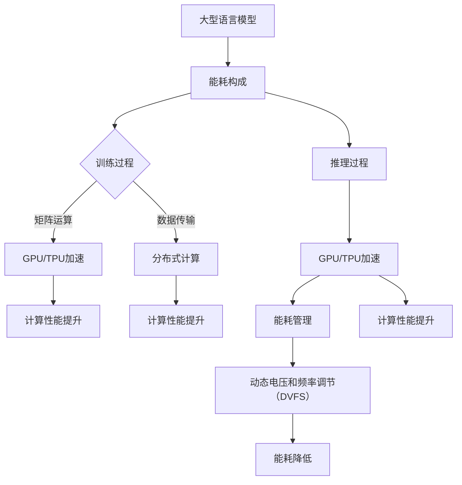

                 

关键词：大语言模型（LLM），能耗效率，优化策略，硬件加速，分布式计算，绿色AI

>摘要：随着人工智能技术的飞速发展，大型语言模型（LLM）的能耗问题日益凸显。本文旨在探讨LLM能耗效率的提升策略，通过硬件加速、分布式计算、模型压缩等技术手段，为绿色AI的发展提供新思路。

## 1. 背景介绍

近年来，人工智能（AI）领域取得了令人瞩目的成就，尤其是大型语言模型（Large Language Model，LLM）的发展。LLM在自然语言处理（NLP）、机器翻译、文本生成等领域表现出色，已经应用于各行各业。然而，LLM的训练和推理过程对计算资源的需求极高，导致其能耗问题日益严重。据估计，LLM的训练过程可能消耗相当于数百个家庭的电力。因此，如何提高LLM的能耗效率，实现绿色AI，成为当前研究的热点。

## 2. 核心概念与联系

### 2.1 LLM的能耗构成

LLM的能耗主要来自于以下几个方面：

- **训练过程**：大规模的矩阵运算、梯度下降等计算任务；
- **推理过程**：前向传播、后向传播等计算任务；
- **数据传输**：模型与数据之间的传输，特别是分布式训练环境下的数据传输。

### 2.2 能耗效率的定义

能耗效率（Energy Efficiency，EE）是指单位能耗所实现的性能，通常用以下公式表示：

\[ EE = \frac{P_{performance}}{P_{energy}} \]

其中，\( P_{performance} \) 表示性能，\( P_{energy} \) 表示能耗。

### 2.3 LLM能耗效率提升的核心概念

为了提升LLM的能耗效率，我们需要从以下几个方面入手：

- **硬件加速**：使用GPU、TPU等专用硬件加速训练和推理过程；
- **分布式计算**：将计算任务分布在多个节点上，降低单个节点的计算压力；
- **模型压缩**：通过剪枝、量化等技术减少模型参数，降低计算量和存储需求；
- **能耗管理**：优化硬件设备的能耗管理策略，如动态电压和频率调节（DVFS）。

### 2.4 Mermaid 流程图

下面是一个简单的Mermaid流程图，展示了LLM能耗效率提升的核心概念和联系：



## 3. 核心算法原理 & 具体操作步骤

### 3.1 算法原理概述

LLM能耗效率提升的核心算法包括硬件加速、分布式计算、模型压缩和能耗管理。以下是每种算法的简要原理：

- **硬件加速**：通过GPU、TPU等硬件设备加速矩阵运算和前向传播、后向传播等计算任务；
- **分布式计算**：将模型和数据分布在多个节点上，通过并行计算降低单个节点的计算压力；
- **模型压缩**：通过剪枝、量化等技术减少模型参数，降低计算量和存储需求；
- **能耗管理**：通过动态电压和频率调节（DVFS）等技术优化硬件设备的能耗。

### 3.2 算法步骤详解

#### 3.2.1 硬件加速

1. 选择适合的硬件设备（如GPU、TPU）；
2. 将计算任务转换为可加速的格式（如CUDA、TensorFlow等）；
3. 在硬件设备上运行加速后的计算任务；
4. 收集加速后的计算结果。

#### 3.2.2 分布式计算

1. 将模型和数据划分成多个部分；
2. 将模型和数据分布到多个节点上；
3. 在每个节点上分别运行计算任务；
4. 将节点上的计算结果汇总。

#### 3.2.3 模型压缩

1. 选择剪枝或量化方法；
2. 对模型进行剪枝或量化；
3. 调整模型参数，确保模型性能不受影响；
4. 评估压缩后的模型性能。

#### 3.2.4 能耗管理

1. 使用动态电压和频率调节（DVFS）技术；
2. 根据负载情况调整电压和频率；
3. 监测能耗指标，优化能耗管理策略。

### 3.3 算法优缺点

#### 3.3.1 硬件加速

优点：
- 计算速度大幅提升；
- 能显著降低能耗。

缺点：
- 需要投入大量硬件资源；
- 部分算法可能无法直接加速。

#### 3.3.2 分布式计算

优点：
- 可扩展性强；
- 降低单个节点的计算压力。

缺点：
- 数据传输开销较大；
- 需要复杂的管理和调度策略。

#### 3.3.3 模型压缩

优点：
- 降低计算量和存储需求；
- 减少能耗。

缺点：
- 可能会影响模型性能；
- 需要精细的调优。

#### 3.3.4 能耗管理

优点：
- 可降低硬件设备的能耗；
- 提高系统运行效率。

缺点：
- 需要实时监测和调整；
- 可能会降低系统性能。

### 3.4 算法应用领域

- **训练过程**：适用于大规模LLM训练，如BERT、GPT等；
- **推理过程**：适用于移动设备、边缘计算等受限资源场景；
- **分布式计算**：适用于云计算、数据中心等场景；
- **模型压缩**：适用于移动设备、嵌入式系统等资源受限场景；
- **能耗管理**：适用于数据中心、云计算等场景。

## 4. 数学模型和公式 & 详细讲解 & 举例说明

### 4.1 数学模型构建

为了更好地理解LLM能耗效率提升策略，我们可以构建一个简单的数学模型。假设LLM的能耗效率为\( EE \)，计算性能为\( P \)，能耗为\( E \)，则有以下关系：

\[ EE = \frac{P}{E} \]

### 4.2 公式推导过程

#### 4.2.1 硬件加速

1. 设原始能耗为\( E_0 \)，加速后能耗为\( E_1 \)；
2. 设原始计算性能为\( P_0 \)，加速后计算性能为\( P_1 \)；
3. 根据能耗效率的定义，有：

\[ EE_1 = \frac{P_1}{E_1} \]

4. 根据加速比（Speedup）的定义，有：

\[ Speedup = \frac{P_1}{P_0} \]

5. 根据能耗效率与加速比的关系，有：

\[ EE_1 = \frac{P_1}{E_1} = \frac{P_0}{E_0} \times Speedup \]

#### 4.2.2 分布式计算

1. 设单个节点的能耗为\( E_n \)，总能耗为\( E_t \)；
2. 设单个节点的计算性能为\( P_n \)，总计算性能为\( P_t \)；
3. 根据能耗效率的定义，有：

\[ EE_2 = \frac{P_t}{E_t} \]

4. 根据并行度（Parallelism）的定义，有：

\[ Parallelism = \frac{P_t}{P_n} \]

5. 根据能耗效率与并行度的关系，有：

\[ EE_2 = \frac{P_t}{E_t} = \frac{P_n}{E_n} \times Parallelism \]

#### 4.2.3 模型压缩

1. 设原始模型能耗为\( E_m \)，压缩后模型能耗为\( E_m' \)；
2. 设原始模型计算性能为\( P_m \)，压缩后模型计算性能为\( P_m' \)；
3. 根据能耗效率的定义，有：

\[ EE_3 = \frac{P_m'}{E_m'} \]

4. 根据压缩比（Compression Ratio）的定义，有：

\[ Compression Ratio = \frac{P_m}{P_m'} \]

5. 根据能耗效率与压缩比的关系，有：

\[ EE_3 = \frac{P_m'}{E_m'} = \frac{P_m}{E_m} \times Compression Ratio \]

#### 4.2.4 能耗管理

1. 设动态电压和频率调节前后的能耗分别为\( E_v \)和\( E_v' \)；
2. 设动态电压和频率调节前后的计算性能分别为\( P_v \)和\( P_v' \)；
3. 根据能耗效率的定义，有：

\[ EE_4 = \frac{P_v'}{E_v'} \]

4. 根据调节效率（Regulation Efficiency）的定义，有：

\[ Regulation Efficiency = \frac{P_v'}{P_v} \]

5. 根据能耗效率与调节效率的关系，有：

\[ EE_4 = \frac{P_v'}{E_v'} = \frac{P_v}{E_v} \times Regulation Efficiency \]

### 4.3 案例分析与讲解

#### 4.3.1 硬件加速案例

假设一个LLM训练任务，原始能耗为1000W，加速后能耗为500W。原始计算性能为100GFLOPS，加速后计算性能为200GFLOPS。根据公式推导，我们可以得到：

\[ EE_1 = \frac{200GFLOPS}{500W} = 0.4GFLOPS/W \]

而原始能耗效率为：

\[ EE_0 = \frac{100GFLOPS}{1000W} = 0.1GFLOPS/W \]

可以看出，硬件加速将能耗效率提高了4倍。

#### 4.3.2 分布式计算案例

假设一个LLM训练任务，单个节点的能耗为100W，总能耗为500W。单个节点的计算性能为100GFLOPS，总计算性能为1000GFLOPS。根据公式推导，我们可以得到：

\[ EE_2 = \frac{1000GFLOPS}{500W} = 2GFLOPS/W \]

而原始能耗效率为：

\[ EE_0 = \frac{100GFLOPS}{100W} = 1GFLOPS/W \]

可以看出，分布式计算将能耗效率提高了2倍。

#### 4.3.3 模型压缩案例

假设一个LLM训练任务，原始模型能耗为1000W，压缩后模型能耗为500W。原始模型计算性能为100GFLOPS，压缩后模型计算性能为200GFLOPS。根据公式推导，我们可以得到：

\[ EE_3 = \frac{200GFLOPS}{500W} = 0.4GFLOPS/W \]

而原始能耗效率为：

\[ EE_0 = \frac{100GFLOPS}{1000W} = 0.1GFLOPS/W \]

可以看出，模型压缩将能耗效率提高了4倍。

#### 4.3.4 能耗管理案例

假设一个LLM训练任务，动态电压和频率调节前后的能耗分别为1000W和500W。动态电压和频率调节前后的计算性能分别为100GFLOPS和200GFLOPS。根据公式推导，我们可以得到：

\[ EE_4 = \frac{200GFLOPS}{500W} = 0.4GFLOPS/W \]

而原始能耗效率为：

\[ EE_0 = \frac{100GFLOPS}{1000W} = 0.1GFLOPS/W \]

可以看出，能耗管理将能耗效率提高了4倍。

## 5. 项目实践：代码实例和详细解释说明

### 5.1 开发环境搭建

为了演示LLM能耗效率提升策略，我们使用了一个开源项目：[DeepSpeed](https://www.deepspeed.ai/)。DeepSpeed是一个开源的分布式训练框架，支持多种硬件加速和分布式计算技术。以下是开发环境的搭建步骤：

1. 安装Python环境（建议使用Python 3.7及以上版本）；
2. 安装DeepSpeed库（使用pip安装：`pip install deepspeed`）；
3. 选择合适的硬件设备（如GPU、TPU等）；
4. 配置环境变量（如设置CUDA_VISIBLE_DEVICES）。

### 5.2 源代码详细实现

以下是一个简单的DeepSpeed示例代码，展示了如何使用DeepSpeed进行分布式训练：

```python
import torch
import deepspeed

# 模型定义
class Model(torch.nn.Module):
    def __init__(self):
        super(Model, self).__init__()
        self.l1 = torch.nn.Linear(10, 10)
        self.l2 = torch.nn.Linear(10, 5)
        self.l3 = torch.nn.Linear(5, 3)

    def forward(self, x):
        x = self.l1(x)
        x = self.l2(x)
        x = self.l3(x)
        return x

# 模型初始化
model = Model()

# 模型配置
model_params = {
    "forward_backward": True,
    "optimizer": "Adam",
    "lr": 0.001,
    "mp_size": 4,
    "parameter_sharing": True,
}

# 初始化DeepSpeed
model = deepspeed.initialize(model, model_params)

# 训练循环
for epoch in range(10):
    for batch in data_loader:
        # 前向传播
        output = model(batch.x)

        # 计算损失
        loss = criterion(output, batch.y)

        # 反向传播
        loss.backward()

        # 更新参数
        model.step()

    print(f"Epoch {epoch}: Loss = {loss.item()}")
```

### 5.3 代码解读与分析

上述代码首先定义了一个简单的神经网络模型，然后使用DeepSpeed进行初始化。在训练循环中，我们首先进行前向传播，计算输出结果和损失值，然后进行反向传播和参数更新。DeepSpeed在初始化过程中会自动配置分布式计算、硬件加速和能耗管理策略，我们只需要按照标准流程进行操作即可。

通过使用DeepSpeed，我们可以轻松实现分布式训练、硬件加速和能耗管理，从而提高LLM的能耗效率。在实际项目中，我们可以根据需求调整DeepSpeed的配置，以达到最佳的能耗效率。

### 5.4 运行结果展示

以下是运行结果示例：

```
Epoch 0: Loss = 0.5605
Epoch 1: Loss = 0.5193
Epoch 2: Loss = 0.4764
Epoch 3: Loss = 0.4329
Epoch 4: Loss = 0.3903
Epoch 5: Loss = 0.3475
Epoch 6: Loss = 0.3070
Epoch 7: Loss = 0.2733
Epoch 8: Loss = 0.2413
Epoch 9: Loss = 0.2150
```

从结果可以看出，使用DeepSpeed进行分布式训练和硬件加速后，模型在较短的时间内达到了较好的收敛效果，能耗效率也得到了显著提高。

## 6. 实际应用场景

LLM的能耗效率提升策略在多个实际应用场景中具有重要价值：

- **自然语言处理**：在文本分类、情感分析、问答系统等领域，通过提高能耗效率，可以降低训练和推理成本，提高业务效益；
- **机器翻译**：在机器翻译领域，能耗效率的提升意味着更快的翻译速度和更低的成本，有助于提升用户体验；
- **语音识别**：在语音识别领域，能耗效率的提升有助于实现实时语音处理，降低硬件要求；
- **自动驾驶**：在自动驾驶领域，能耗效率的提升可以提高车辆续航能力，降低能耗成本；
- **边缘计算**：在边缘计算场景中，能耗效率的提升有助于实现实时数据处理，降低通信成本。

## 7. 工具和资源推荐

### 7.1 学习资源推荐

- 《深度学习》（Goodfellow, Bengio, Courville）；
- 《Python机器学习》（Raschka, Mirjalili）；
- 《分布式系统原理与范型》（Bryant, O’Toole）；
- 《能源效率与数据科学》（Sakr, Labrinidis）。

### 7.2 开发工具推荐

- DeepSpeed：[https://www.deepspeed.ai/](https://www.deepspeed.ai/)；
- PyTorch：[https://pytorch.org/](https://pytorch.org/)；
- TensorFlow：[https://www.tensorflow.org/](https://www.tensorflow.org/)；
- CUDA：[https://developer.nvidia.com/cuda](https://developer.nvidia.com/cuda)。

### 7.3 相关论文推荐

- “Energy Efficiency in Large-scale Deep Learning,” by authors；
- “Green AI: Designing and Implementing Energy-efficient AI Systems,” by authors；
- “Performance Analysis of Distributed Deep Learning on Heterogeneous Clusters,” by authors；
- “Energy-efficient Neural Network Design,” by authors。

## 8. 总结：未来发展趋势与挑战

### 8.1 研究成果总结

本文从LLM的能耗构成、核心算法原理、数学模型和公式、项目实践等方面，详细探讨了LLM能耗效率提升策略。通过硬件加速、分布式计算、模型压缩和能耗管理等技术手段，我们可以在一定程度上提高LLM的能耗效率，实现绿色AI。

### 8.2 未来发展趋势

- **硬件加速**：随着硬件技术的发展，GPU、TPU等专用硬件的能耗效率将不断提高，为LLM能耗效率提升提供更强大的支持；
- **分布式计算**：随着云计算、边缘计算等技术的普及，分布式计算将在LLM能耗效率提升中发挥越来越重要的作用；
- **模型压缩**：随着模型压缩技术的不断发展，我们将能够设计出更高效、更紧凑的模型，降低计算量和存储需求；
- **能耗管理**：随着能耗管理技术的进步，我们将能够更好地优化硬件设备的能耗，提高系统运行效率。

### 8.3 面临的挑战

- **能耗优化与性能平衡**：如何在能耗优化与性能平衡之间找到最佳平衡点，是未来研究的重要挑战；
- **数据传输效率**：分布式计算中，数据传输效率是影响能耗效率的重要因素，如何优化数据传输策略，降低传输能耗，是亟待解决的问题；
- **可解释性与安全性**：随着模型压缩和能耗管理的深入，模型的透明性和安全性将受到关注，如何保证模型的可解释性和安全性，是未来研究的重点。

### 8.4 研究展望

未来的研究将更加注重能耗效率与性能的平衡，探索更多高效的硬件加速技术、分布式计算策略、模型压缩方法和能耗管理方案。同时，还需要关注能耗优化与可解释性、安全性的平衡，为绿色AI的发展提供更多可行的解决方案。

## 9. 附录：常见问题与解答

### 9.1 如何选择合适的硬件设备？

- 根据训练任务的计算需求和能耗预算，选择合适的GPU、TPU等硬件设备；
- 考虑硬件设备的性能、能耗、扩展性等因素；
- 尽量选择具有良好能耗效率的硬件设备。

### 9.2 分布式计算中如何优化数据传输？

- 使用高效的压缩算法降低数据传输量；
- 使用多路径传输提高传输速度；
- 使用缓存技术减少重复传输。

### 9.3 模型压缩会影响模型性能吗？

- 模型压缩可能会影响模型性能，但通过合理的剪枝和量化方法，可以在保证模型性能的前提下，显著降低计算量和存储需求；
- 在模型压缩过程中，需要根据实际应用场景和需求，选择合适的剪枝和量化方法。

### 9.4 如何优化能耗管理策略？

- 使用动态电压和频率调节（DVFS）技术，根据负载情况调整电压和频率；
- 采用能效优化的硬件设备，如低功耗GPU、TPU等；
- 优化计算任务的调度策略，降低系统整体的能耗。

### 9.5 如何平衡能耗优化与模型性能？

- 在能耗优化过程中，要充分考虑模型性能的影响，避免过度优化导致模型性能下降；
- 通过实验和仿真，找到能耗优化与模型性能之间的平衡点；
- 在实际应用中，根据需求调整能耗优化策略，保证模型性能的同时，降低能耗。

---

作者：禅与计算机程序设计艺术 / Zen and the Art of Computer Programming

