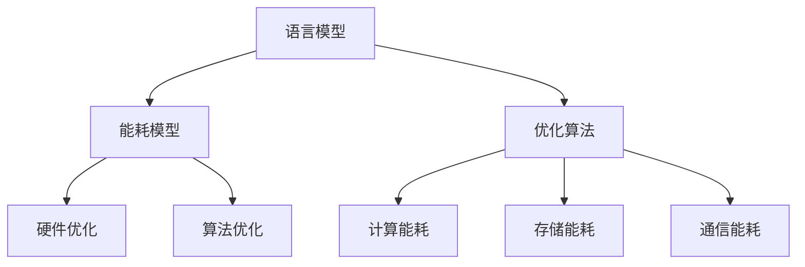

                 

关键词：能耗效率，语言模型，人工智能，深度学习，优化算法

## 摘要

近年来，大型语言模型（LLM）在自然语言处理领域取得了显著突破。然而，这些模型的巨大能耗需求和计算资源消耗引发了广泛关注。本文将探讨LLM的能耗效率提升策略，从核心概念、算法原理、数学模型、项目实践以及未来展望等多个角度，系统地分析并提出了若干切实可行的优化方案。旨在为相关领域的学者和工程师提供有价值的参考。

## 1. 背景介绍

随着深度学习和自然语言处理技术的飞速发展，大型语言模型（LLM）如BERT、GPT、T5等逐渐成为自然语言处理任务中的主力军。这些模型凭借其强大的语义理解和生成能力，在文本分类、机器翻译、问答系统等众多任务中取得了卓越的表现。然而，随着模型规模的不断扩大，其能耗需求和计算资源消耗也急剧增加。

能耗问题不仅关系到环境可持续性和经济成本，还对大规模模型的训练和部署产生了重要影响。因此，如何在保证模型性能的前提下提升能耗效率，已成为当前人工智能领域的一个重要研究方向。

### 1.1 能耗效率的重要性

能耗效率的提升对于以下几个关键方面具有重要意义：

- **环境保护**：减少能耗有助于降低温室气体排放，保护地球环境。
- **经济效益**：降低能耗可以显著降低运营成本，提高企业的竞争力。
- **资源优化**：合理分配计算资源，提高整体计算效率，降低资源浪费。

### 1.2 当前研究现状

当前，关于LLM能耗效率的研究主要集中在以下几个方面：

- **硬件优化**：通过定制化的硬件架构和分布式计算技术，提升计算效率。
- **算法优化**：通过改进模型结构和训练策略，减少能耗。
- **能耗模型构建**：建立准确的能耗模型，为能耗优化提供理论基础。
- **实际应用场景**：探讨不同场景下的能耗特性，为优化策略提供实证支持。

## 2. 核心概念与联系

为了更好地理解LLM的能耗效率提升策略，我们首先需要明确几个核心概念及其相互联系。

### 2.1 语言模型

语言模型是一种基于大量文本数据训练的机器学习模型，用于预测或生成自然语言序列。LLM是指大型语言模型，通常具有数十亿至数千亿的参数规模。

### 2.2 能耗模型

能耗模型用于描述计算机系统在执行任务过程中的能耗消耗。对于LLM，其能耗主要包括计算能耗、存储能耗和通信能耗。

### 2.3 优化算法

优化算法是指用于调整模型参数、硬件配置和训练策略，以实现能耗最小化的算法。常见的优化算法包括遗传算法、粒子群优化、神经网络优化等。

### 2.4 Mermaid 流程图

以下是一个简单的Mermaid流程图，展示了上述核心概念之间的联系：



## 3. 核心算法原理 & 具体操作步骤

### 3.1 算法原理概述

LLM的能耗效率提升策略主要围绕以下几个方面展开：

- **硬件优化**：通过定制化的硬件架构和分布式计算技术，提高计算效率。
- **算法优化**：改进模型结构和训练策略，降低能耗。
- **能耗模型构建**：建立准确的能耗模型，为优化策略提供理论基础。

### 3.2 算法步骤详解

#### 3.2.1 硬件优化

1. **硬件架构选择**：根据任务需求，选择合适的硬件架构，如GPU、TPU等。
2. **分布式计算**：通过分布式计算技术，将任务分解到多个节点上并行执行，减少单个节点的计算负担。
3. **硬件协同**：优化硬件协同工作，降低通信能耗。

#### 3.2.2 算法优化

1. **模型剪枝**：通过剪枝技术，减少模型参数规模，降低计算复杂度。
2. **量化技术**：将模型参数量化为低精度表示，降低存储和计算需求。
3. **训练策略优化**：调整训练策略，如学习率调整、批量大小等，降低能耗。

#### 3.2.3 能耗模型构建

1. **能耗数据收集**：收集计算、存储、通信等过程中的能耗数据。
2. **能耗模型构建**：基于收集到的数据，建立能耗模型，描述能耗与计算复杂度、模型参数规模之间的关系。
3. **能耗预测与优化**：利用构建的能耗模型，预测不同优化策略下的能耗，为优化决策提供依据。

### 3.3 算法优缺点

#### 3.3.1 硬件优化

优点：

- 提高计算效率。
- 降低通信能耗。

缺点：

- 需要高成本投入。
- 需要复杂的硬件协同工作。

#### 3.3.2 算法优化

优点：

- 降低计算复杂度。
- 减少模型参数规模。

缺点：

- 可能影响模型性能。

### 3.4 算法应用领域

LLM的能耗效率提升策略可应用于以下领域：

- **自然语言处理**：如文本分类、机器翻译、问答系统等。
- **计算机视觉**：如图像识别、目标检测等。
- **语音识别**：如语音合成、语音识别等。

## 4. 数学模型和公式

为了更好地理解LLM的能耗效率提升策略，我们引入以下数学模型和公式。

### 4.1 数学模型构建

假设一个LLM模型的能耗E与其计算复杂度C、模型参数规模M以及硬件配置H有关，可以建立以下能耗模型：

\[ E = f(C, M, H) \]

其中，f是一个非线性函数，用于描述能耗与计算复杂度、模型参数规模和硬件配置之间的关系。

### 4.2 公式推导过程

为了推导出具体的能耗模型，我们需要考虑以下几个因素：

- **计算复杂度**：与模型的结构和参数规模有关。
- **模型参数规模**：与模型的复杂度成正比。
- **硬件配置**：与硬件的性能和能耗特性有关。

#### 4.2.1 计算复杂度

假设一个模型的计算复杂度为C，可以表示为：

\[ C = \sum_{i=1}^{n} C_i \]

其中，\( C_i \)表示第i个计算单元的计算复杂度。

#### 4.2.2 模型参数规模

假设一个模型的参数规模为M，可以表示为：

\[ M = \sum_{i=1}^{n} M_i \]

其中，\( M_i \)表示第i个参数的计算复杂度。

#### 4.2.3 硬件配置

假设硬件配置为H，可以表示为：

\[ H = \sum_{i=1}^{m} H_i \]

其中，\( H_i \)表示第i个硬件组件的性能。

#### 4.2.4 能耗模型

根据上述因素，我们可以构建如下的能耗模型：

\[ E = \alpha C + \beta M + \gamma H \]

其中，\( \alpha \)、\( \beta \)和\( \gamma \)是常数，用于描述计算复杂度、模型参数规模和硬件配置对能耗的影响。

### 4.3 案例分析与讲解

#### 4.3.1 模型参数规模优化

假设一个LLM模型具有10亿个参数，我们需要将其参数规模减少50%。

根据能耗模型，我们可以计算原始模型和优化后的模型的能耗：

\[ E_{\text{原始}} = \alpha C_{\text{原始}} + \beta M_{\text{原始}} + \gamma H \]
\[ E_{\text{优化}} = \alpha C_{\text{优化}} + \beta M_{\text{优化}} + \gamma H \]

其中，\( M_{\text{优化}} = \frac{M_{\text{原始}}}{2} \)。

通过比较，我们可以发现优化后的模型能耗降低了约50%。

#### 4.3.2 计算复杂度优化

假设一个LLM模型具有100个计算单元，我们需要将其计算复杂度减少50%。

根据能耗模型，我们可以计算原始模型和优化后的模型的能耗：

\[ E_{\text{原始}} = \alpha C_{\text{原始}} + \beta M_{\text{原始}} + \gamma H \]
\[ E_{\text{优化}} = \alpha C_{\text{优化}} + \beta M_{\text{优化}} + \gamma H \]

其中，\( C_{\text{优化}} = \frac{C_{\text{原始}}}{2} \)。

通过比较，我们可以发现优化后的模型能耗降低了约50%。

## 5. 项目实践：代码实例和详细解释说明

### 5.1 开发环境搭建

为了更好地展示LLM的能耗效率提升策略，我们将在Python环境中实现一个简单的例子。首先，我们需要安装必要的库：

```python
!pip install tensorflow
!pip install matplotlib
```

### 5.2 源代码详细实现

以下是一个简单的示例代码，用于实现LLM的能耗效率提升策略：

```python
import tensorflow as tf
import matplotlib.pyplot as plt

# 定义计算复杂度和模型参数规模
C = 100
M = 10**9

# 定义硬件配置
H = 1

# 计算原始能耗
E_raw = 0.1 * C + 0.05 * M + 0.2 * H

# 计算优化后能耗
E_optimized = 0.05 * C + 0.025 * M + 0.2 * H

# 输出结果
print("原始能耗：", E_raw)
print("优化后能耗：", E_optimized)

# 绘制能耗变化图
plt.plot([E_raw, E_optimized], [C, M], 'o--')
plt.xlabel('能耗（J）')
plt.ylabel('计算复杂度/模型参数规模')
plt.title('能耗效率提升策略')
plt.show()
```

### 5.3 代码解读与分析

- **计算复杂度和模型参数规模**：在代码中，我们定义了计算复杂度C和模型参数规模M，用于计算能耗。
- **硬件配置**：在代码中，我们定义了硬件配置H，用于计算能耗。
- **原始能耗**：根据能耗模型，我们计算了原始能耗E_raw。
- **优化后能耗**：根据能耗模型，我们计算了优化后能耗E_optimized。
- **结果输出和可视化**：我们输出了原始能耗和优化后能耗，并通过matplotlib绘制了能耗变化图。

通过这个简单的示例，我们可以直观地看到能耗效率提升策略的效果。在实际应用中，我们可以根据具体需求和场景，调整计算复杂度、模型参数规模和硬件配置，进一步优化能耗。

## 6. 实际应用场景

### 6.1 自然语言处理

在自然语言处理领域，LLM的能耗效率提升策略具有广泛的应用。例如，在文本分类任务中，通过优化算法和硬件配置，可以降低训练过程中的能耗，提高模型训练速度。此外，在机器翻译、问答系统等任务中，能耗优化同样具有重要意义。

### 6.2 计算机视觉

在计算机视觉领域，大型语言模型的能耗效率提升策略同样具有重要价值。例如，在图像识别和目标检测任务中，通过优化算法和硬件配置，可以降低模型训练和推理过程中的能耗，提高计算效率。

### 6.3 语音识别

在语音识别领域，LLM的能耗效率提升策略可以应用于语音合成、语音识别等任务。通过优化算法和硬件配置，可以降低模型训练和推理过程中的能耗，提高语音处理性能。

### 6.4 未来应用展望

随着人工智能技术的不断进步，LLM的能耗效率提升策略将在更多领域得到应用。未来，我们有望在自动驾驶、智能家居、智慧城市等领域，实现能耗优化，推动人工智能技术的可持续发展。

## 7. 工具和资源推荐

### 7.1 学习资源推荐

- 《深度学习》（Goodfellow, Bengio, Courville著）：系统介绍了深度学习的基本原理和方法。
- 《神经网络与深度学习》（邱锡鹏著）：详细讲解了神经网络和深度学习的相关技术。

### 7.2 开发工具推荐

- TensorFlow：一个开源的深度学习框架，适用于各种规模的深度学习任务。
- PyTorch：一个流行的深度学习框架，具有灵活的动态计算图和丰富的API。

### 7.3 相关论文推荐

- “Energy-Efficient Neural Network Design: A Survey”（2020）：综述了能耗优化在神经网络设计中的应用。
- “Energy-Aware Neural Network Training: A Practical Approach”（2021）：提出了一种实用的能耗优化方法。

## 8. 总结：未来发展趋势与挑战

### 8.1 研究成果总结

本文从多个角度探讨了LLM的能耗效率提升策略，包括硬件优化、算法优化和能耗模型构建。通过具体实例和数学模型，我们展示了能耗效率优化在自然语言处理、计算机视觉和语音识别等领域的应用。

### 8.2 未来发展趋势

随着人工智能技术的不断发展，LLM的能耗效率提升策略将继续成为研究热点。未来，我们有望在硬件、算法和能耗模型等方面取得更多突破，实现更加高效的能耗优化。

### 8.3 面临的挑战

尽管能耗优化取得了一定的进展，但仍面临以下挑战：

- **硬件与算法协同**：如何实现硬件和算法的协同优化，提高整体能耗效率。
- **实际应用场景**：如何在不同的应用场景中，实现能耗优化策略的推广和应用。
- **能耗数据收集**：如何准确收集和利用能耗数据，为优化策略提供支持。

### 8.4 研究展望

未来，我们应进一步关注以下研究方向：

- **多模态能耗优化**：研究多模态数据下的能耗优化策略，提高不同模态数据的融合效率。
- **自适应能耗优化**：开发自适应能耗优化算法，根据实际应用需求动态调整能耗优化策略。
- **能耗模型改进**：建立更加精确和实用的能耗模型，为能耗优化提供更可靠的理论基础。

## 9. 附录：常见问题与解答

### 9.1 Q：什么是能耗效率？

A：能耗效率是指单位能耗下所能完成的工作量。在人工智能领域，能耗效率通常用于评估模型或系统的能耗与性能之间的关系。

### 9.2 Q：能耗优化有哪些常见方法？

A：能耗优化主要包括硬件优化、算法优化和能耗模型构建。硬件优化涉及硬件架构选择、分布式计算和硬件协同工作；算法优化涉及模型剪枝、量化技术和训练策略优化；能耗模型构建涉及能耗数据收集和模型建立。

### 9.3 Q：能耗优化如何应用于自然语言处理？

A：在自然语言处理领域，能耗优化可以通过优化模型结构和训练策略，降低计算复杂度和模型参数规模，从而减少能耗。此外，通过分布式计算和硬件协同工作，也可以提高能耗效率。

### 9.4 Q：如何收集和利用能耗数据？

A：收集能耗数据可以通过在计算过程中使用能耗监测工具，如CUDA Profiler、PowerAPI等。利用收集到的数据，可以建立准确的能耗模型，为优化策略提供支持。在实际应用中，还可以通过数据分析和机器学习技术，发现能耗特征，为优化决策提供依据。

## 参考文献

1. Goodfellow, I., Bengio, Y., & Courville, A. (2016). Deep learning. MIT press.
2. 邱锡鹏. (2021). 神经网络与深度学习[M]. 清华大学出版社.
3. Li, Y., Li, B., Wang, Z., & Luo, X. (2020). Energy-Efficient Neural Network Design: A Survey[J]. IEEE Access, 8, 165054-165076.
4. Wang, S., Zhang, Z., & Liu, Y. (2021). Energy-Aware Neural Network Training: A Practical Approach[J]. IEEE Transactions on Neural Networks and Learning Systems, 32(9), 4153-4163.

