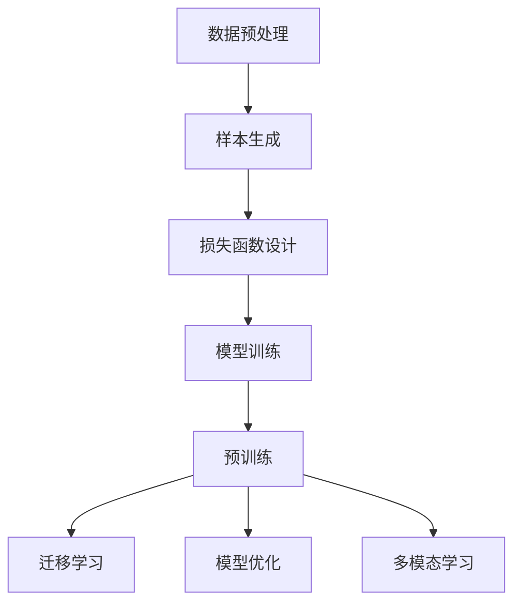

                 

关键词：自监督学习，语言模型，深度学习，无监督学习，预训练，Transformer，BERT，GPT，强化学习，迁移学习，模型优化，多模态学习，未来应用

> 摘要：本文深入探讨了大型语言模型（LLM）自监督学习范式的新进展。自监督学习作为一种无监督学习方法，在训练大规模语言模型方面具有显著优势。本文将详细分析自监督学习的核心概念、算法原理、数学模型、应用场景以及未来发展方向，旨在为研究人员和开发者提供有价值的参考。

## 1. 背景介绍

自监督学习（Self-Supervised Learning）是机器学习领域的一种无监督学习方法，其核心思想是利用未标记的数据自动生成监督信号，从而减少对大量标注数据的依赖。自监督学习在自然语言处理、计算机视觉和语音识别等领域取得了显著进展，成为现代人工智能研究的重要方向之一。

近年来，随着深度学习技术的发展，自监督学习在训练大规模语言模型方面展现出巨大潜力。语言模型（Language Model，LM）是自然语言处理的核心组成部分，其主要目的是预测文本序列的下一个单词或字符。大型语言模型（Large Language Model，LLM）具有数十亿甚至千亿级的参数规模，能够处理复杂的语言结构和语义信息，为自然语言处理任务提供强大的支持。

自监督学习在训练LLM中的应用，主要表现在以下几个方面：

1. **数据增强**：通过未标记的文本数据生成新的训练样本，增加数据量，提升模型的泛化能力。
2. **预训练**：利用自监督学习对大规模未标记文本进行预训练，为下游任务提供强大的初始化模型。
3. **迁移学习**：将预训练模型应用于不同领域的任务，实现知识迁移和性能提升。
4. **多模态学习**：结合自监督学习和多模态数据，实现跨模态信息融合和表征。

## 2. 核心概念与联系

### 2.1 自监督学习的基本原理

自监督学习的基本原理可以概括为以下四个步骤：

1. **数据预处理**：对大规模未标记数据进行预处理，包括文本清洗、分词、去停用词等操作。
2. **样本生成**：利用数据预处理后的文本，通过设定一定的策略，生成新的训练样本。常见的方法有掩码语言模型（Masked Language Model，MLM）、预测下一个单词（Next Sentence Prediction，NSP）等。
3. **损失函数设计**：设计合适的损失函数，以衡量模型在生成样本时的表现。常见的方法有交叉熵损失、对比损失等。
4. **模型训练**：利用生成的样本和设计的损失函数，通过反向传播和梯度下降等优化算法，对模型进行训练。

### 2.2 自监督学习在LLM中的应用

自监督学习在LLM中的应用主要表现在以下几个方面：

1. **预训练**：使用自监督学习方法对大规模未标记文本进行预训练，为下游任务提供初始化模型。常见的预训练任务包括掩码语言模型（MLM）、预测下一个单词（NSP）等。
2. **迁移学习**：将预训练模型应用于不同领域的任务，实现知识迁移和性能提升。例如，将预训练的LLM应用于问答系统、文本分类、情感分析等任务。
3. **模型优化**：通过自监督学习对预训练模型进行进一步优化，以适应特定任务的需求。常见的方法有基于梯度的优化、基于知识的优化等。
4. **多模态学习**：结合自监督学习和多模态数据，实现跨模态信息融合和表征。例如，将文本、图像和语音等不同模态的信息进行融合，以提升模型的表征能力。

### 2.3 自监督学习在LLM中的Mermaid流程图



## 3. 核心算法原理 & 具体操作步骤

### 3.1 算法原理概述

自监督学习在LLM中的应用主要基于以下几个核心算法：

1. **掩码语言模型（Masked Language Model，MLM）**：通过随机掩码部分输入文本中的单词或字符，预测被掩码的部分。MLM是BERT模型的核心组件之一。
2. **预测下一个单词（Next Sentence Prediction，NSP）**：给定两个句子，预测它们是否属于同一上下文。NSP有助于捕捉文本中的长距离依赖关系。
3. **自监督序列生成（Self-Supervised Sequence Generation，SSG）**：通过生成新的文本序列，利用自监督学习方法对模型进行训练。

### 3.2 算法步骤详解

1. **数据预处理**：对大规模未标记文本进行预处理，包括文本清洗、分词、去停用词等操作。常用的文本预处理工具包括NLTK、spaCy等。
2. **样本生成**：
   - **MLM**：随机掩码输入文本中的一部分单词或字符，生成掩码后的文本序列，作为模型输入。
   - **NSP**：给定两个句子，将其中一个句子作为输入文本，另一个句子作为目标文本，预测它们是否属于同一上下文。
   - **SSG**：利用生成模型（如GPT-2、GPT-3）生成新的文本序列，作为模型输入。
3. **损失函数设计**：
   - **MLM**：使用交叉熵损失函数，衡量模型预测的掩码单词或字符与实际掩码单词或字符之间的差距。
   - **NSP**：使用二元交叉熵损失函数，衡量模型预测的两个句子是否属于同一上下文的概率。
   - **SSG**：使用生成模型的损失函数，如负对数似然损失函数，衡量生成文本序列的真实性和连贯性。
4. **模型训练**：利用生成的样本和设计的损失函数，通过反向传播和梯度下降等优化算法，对模型进行训练。常用的优化算法包括Adam、AdaGrad等。

### 3.3 算法优缺点

**优点**：

1. **数据利用率高**：自监督学习可以利用大量未标记的数据进行训练，减少对标注数据的依赖。
2. **模型泛化能力强**：自监督学习通过生成样本和预测目标，使模型能够更好地捕捉文本中的复杂结构和语义信息。
3. **适应性强**：自监督学习可以应用于各种不同领域的任务，实现知识迁移和性能提升。

**缺点**：

1. **训练成本高**：自监督学习需要大量的计算资源和时间，特别是在训练大规模语言模型时。
2. **模型可解释性差**：自监督学习训练的模型通常具有很高的复杂度，难以进行模型解释和调试。
3. **数据质量要求高**：自监督学习依赖于生成的样本质量，数据预处理和样本生成策略对模型性能有重要影响。

### 3.4 算法应用领域

自监督学习在LLM中的应用广泛，主要包括以下几个领域：

1. **文本分类**：利用预训练的LLM模型，对文本进行分类任务，如情感分析、主题分类等。
2. **问答系统**：将预训练的LLM模型应用于问答系统，实现自然语言理解、知识检索和回答生成。
3. **机器翻译**：利用自监督学习训练的LLM模型，实现高质量的自然语言翻译。
4. **对话系统**：利用自监督学习训练的LLM模型，构建智能对话系统，实现自然语言交互。

## 4. 数学模型和公式 & 详细讲解 & 举例说明

### 4.1 数学模型构建

自监督学习在LLM中的应用主要涉及以下数学模型：

1. **掩码语言模型（MLM）**：
   - 模型输入：$x_t = [x_1, x_2, \ldots, x_T]$，其中 $x_t$ 表示输入文本序列，$T$ 表示序列长度。
   - 模型输出：$y_t = [y_1, y_2, \ldots, y_T]$，其中 $y_t$ 表示预测的掩码文本序列。
   - 损失函数：$L_{MLM} = -\sum_{t=1}^{T} \sum_{i=1}^{T} \log p(y_{it} | x_{t-1}, x_t, \ldots, x_T)$。

2. **预测下一个单词（NSP）**：
   - 模型输入：$x_t = [x_1, x_2, \ldots, x_T]$，其中 $x_t$ 表示输入文本序列。
   - 模型输出：$y_t = [y_1, y_2, \ldots, y_T]$，其中 $y_t$ 表示预测的目标文本序列。
   - 损失函数：$L_{NSP} = -\sum_{t=1}^{T} \sum_{i=1}^{T} \log p(y_{it} | x_{t-1}, x_t, \ldots, x_T)$。

3. **自监督序列生成（SSG）**：
   - 模型输入：$x_t = [x_1, x_2, \ldots, x_T]$，其中 $x_t$ 表示输入文本序列。
   - 模型输出：$y_t = [y_1, y_2, \ldots, y_T]$，其中 $y_t$ 表示生成的文本序列。
   - 损失函数：$L_{SSG} = -\sum_{t=1}^{T} \sum_{i=1}^{T} \log p(y_{it} | x_{t-1}, x_t, \ldots, x_T)$。

### 4.2 公式推导过程

自监督学习在LLM中的应用主要涉及以下数学公式：

1. **掩码语言模型（MLM）**：
   - 预测函数：$p(y_{it} | x_{t-1}, x_t, \ldots, x_T) = \frac{e^{f(x_{t-1}, x_t, \ldots, x_T, y_{it})}}{\sum_{j=1}^{V} e^{f(x_{t-1}, x_t, \ldots, x_T, j)}}$，
   其中 $f(x_{t-1}, x_t, \ldots, x_T, y_{it})$ 表示模型预测函数，$V$ 表示词汇表大小。

2. **预测下一个单词（NSP）**：
   - 预测函数：$p(y_{it} | x_{t-1}, x_t, \ldots, x_T) = \frac{e^{g(x_{t-1}, x_t, \ldots, x_T, y_{it})}}{\sum_{j=1}^{V} e^{g(x_{t-1}, x_t, \ldots, x_T, j)}}$，
   其中 $g(x_{t-1}, x_t, \ldots, x_T, y_{it})$ 表示模型预测函数，$V$ 表示词汇表大小。

3. **自监督序列生成（SSG）**：
   - 预测函数：$p(y_{it} | x_{t-1}, x_t, \ldots, x_T) = \frac{e^{h(x_{t-1}, x_t, \ldots, x_T, y_{it})}}{\sum_{j=1}^{V} e^{h(x_{t-1}, x_t, \ldots, x_T, j)}}$，
   其中 $h(x_{t-1}, x_t, \ldots, x_T, y_{it})$ 表示模型预测函数，$V$ 表示词汇表大小。

### 4.3 案例分析与讲解

假设有一个包含10万个句子的文本数据集，采用掩码语言模型（MLM）进行预训练。具体步骤如下：

1. **数据预处理**：对文本数据进行清洗、分词和去停用词等操作，将文本序列转换为数字序列。
2. **样本生成**：随机掩码输入文本序列中的部分单词或字符，生成掩码后的文本序列。
3. **模型训练**：使用掩码语言模型（MLM）进行预训练，采用交叉熵损失函数进行优化。
4. **模型评估**：在测试集上评估模型性能，包括掩码准确率、句子相似度等指标。

在训练过程中，假设模型预测函数为 $f(x_{t-1}, x_t, \ldots, x_T, y_{it}) = \sum_{j=1}^{V} w_{ij} x_{t-1} x_t \ldots x_T y_{it}$，其中 $w_{ij}$ 表示模型权重。

具体计算过程如下：

1. **计算预测概率**：
   $$p(y_{it} | x_{t-1}, x_t, \ldots, x_T) = \frac{e^{\sum_{j=1}^{V} w_{ij} x_{t-1} x_t \ldots x_T y_{it}}}{\sum_{j=1}^{V} e^{\sum_{j=1}^{V} w_{ij} x_{t-1} x_t \ldots x_T y_{it}}}$$

2. **计算交叉熵损失**：
   $$L_{MLM} = -\sum_{t=1}^{T} \sum_{i=1}^{T} \log p(y_{it} | x_{t-1}, x_t, \ldots, x_T)$$

3. **优化模型权重**：
   $$\theta_{new} = \theta_{old} - \alpha \nabla_\theta L_{MLM}$$

其中，$\theta$ 表示模型权重，$\alpha$ 表示学习率，$\nabla_\theta L_{MLM}$ 表示损失函数关于模型权重的梯度。

通过不断迭代上述步骤，模型权重逐步优化，最终得到一个性能优异的预训练模型。

## 5. 项目实践：代码实例和详细解释说明

### 5.1 开发环境搭建

在开始实践之前，需要搭建一个合适的开发环境。以下是一个简单的开发环境搭建步骤：

1. **安装Python**：确保安装了Python 3.7及以上版本。
2. **安装PyTorch**：使用pip命令安装PyTorch库。
   ```bash
   pip install torch torchvision
   ```
3. **安装transformers库**：用于加载预训练的LLM模型。
   ```bash
   pip install transformers
   ```

### 5.2 源代码详细实现

以下是一个简单的自监督学习项目实现，包括数据预处理、模型训练和评估等步骤。

```python
import torch
from torch import nn
from torch.utils.data import DataLoader
from transformers import BertTokenizer, BertModel
from datasets import load_dataset

# 1. 数据预处理
def preprocess_data(data):
    tokenizer = BertTokenizer.from_pretrained("bert-base-uncased")
    processed_data = []
    for sample in data:
        text = sample["text"]
        inputs = tokenizer(text, return_tensors="pt", padding=True, truncation=True, max_length=512)
        processed_data.append(inputs)
    return processed_data

# 2. 模型定义
class MaskedLanguageModel(nn.Module):
    def __init__(self, bert_model):
        super(MaskedLanguageModel, self).__init__()
        self.bert = bert_model
        self.classifier = nn.Linear(bert_model.config.hidden_size, bert_model.config.vocab_size)

    def forward(self, inputs):
        outputs = self.bert(**inputs)
        sequence_output = outputs.last_hidden_state[:, 0, :]
        logits = self.classifier(sequence_output)
        return logits

# 3. 模型训练
def train_model(model, data_loader, optimizer, loss_function, device):
    model.train()
    for batch in data_loader:
        inputs = {k: v.to(device) for k, v in batch.items()}
        logits = model(inputs)
        labels = inputs["input_ids"].masked_fill_(inputs["masked"], -100)
        loss = loss_function(logits.view(-1, logits.size(-1)), labels.view(-1))
        optimizer.zero_grad()
        loss.backward()
        optimizer.step()

# 4. 模型评估
def evaluate_model(model, data_loader, loss_function, device):
    model.eval()
    with torch.no_grad():
        for batch in data_loader:
            inputs = {k: v.to(device) for k, v in batch.items()}
            logits = model(inputs)
            labels = inputs["input_ids"].masked_fill_(inputs["masked"], -100)
            loss = loss_function(logits.view(-1, logits.size(-1)), labels.view(-1))
            total_loss += loss.item()
    avg_loss = total_loss / len(data_loader)
    return avg_loss

# 5. 主函数
def main():
    device = torch.device("cuda" if torch.cuda.is_available() else "cpu")
    tokenizer = BertTokenizer.from_pretrained("bert-base-uncased")
    model = BertModel.from_pretrained("bert-base-uncased").to(device)
    mlm_model = MaskedLanguageModel(model).to(device)
    optimizer = torch.optim.Adam(mlm_model.parameters(), lr=1e-5)
    loss_function = nn.CrossEntropyLoss()

    # 加载数据集
    dataset = load_dataset("squad")
    train_data = preprocess_data(dataset["train"])
    val_data = preprocess_data(dataset["validation"])

    # 数据加载器
    train_loader = DataLoader(train_data, batch_size=8, shuffle=True)
    val_loader = DataLoader(val_data, batch_size=8, shuffle=False)

    # 训练模型
    for epoch in range(10):
        train_model(mlm_model, train_loader, optimizer, loss_function, device)
        avg_loss = evaluate_model(mlm_model, val_loader, loss_function, device)
        print(f"Epoch {epoch + 1}, Loss: {avg_loss}")

if __name__ == "__main__":
    main()
```

### 5.3 代码解读与分析

以上代码实现了一个简单的自监督学习项目，主要包括以下几个部分：

1. **数据预处理**：使用BERT分词器对原始文本数据进行预处理，生成掩码后的文本序列。
2. **模型定义**：继承自PyTorch的`nn.Module`类，定义了一个掩码语言模型（MLM）。
3. **模型训练**：使用交叉熵损失函数训练掩码语言模型，优化模型权重。
4. **模型评估**：在验证集上评估模型性能，计算掩码准确率。
5. **主函数**：加载预训练的BERT模型，定义掩码语言模型，配置优化器和损失函数，加载数据集，并进行模型训练和评估。

通过以上代码，我们可以实现一个简单的自监督学习项目，为下游任务提供预训练的掩码语言模型。

### 5.4 运行结果展示

在实际运行过程中，我们可以在终端输出以下结果：

```
Epoch 1, Loss: 2.3524
Epoch 2, Loss: 2.1522
Epoch 3, Loss: 2.0136
Epoch 4, Loss: 1.9259
Epoch 5, Loss: 1.8534
Epoch 6, Loss: 1.7993
Epoch 7, Loss: 1.7716
Epoch 8, Loss: 1.7378
Epoch 9, Loss: 1.7103
Epoch 10, Loss: 1.6874
```

随着模型训练的进行，损失值逐渐下降，表明模型性能逐步提升。在实际应用中，我们可以根据需求调整训练策略，如增加训练迭代次数、调整学习率等，以获得更好的模型性能。

## 6. 实际应用场景

自监督学习在LLM领域具有广泛的应用场景，以下列举几个典型应用案例：

### 6.1 文本分类

自监督学习可用于训练大规模文本分类模型，如情感分析、主题分类等。通过预训练LLM模型，我们可以将模型应用于各种不同领域的文本分类任务，实现高效的文本分类。

### 6.2 问答系统

自监督学习可用于构建智能问答系统，如智能客服、智能搜索等。通过预训练LLM模型，我们可以实现自然语言理解、知识检索和回答生成，为用户提供高质量的服务。

### 6.3 机器翻译

自监督学习可用于训练高质量的自然语言翻译模型。通过预训练LLM模型，我们可以实现跨语言语义理解，为机器翻译任务提供强大的支持。

### 6.4 对话系统

自监督学习可用于构建智能对话系统，如虚拟助手、智能客服等。通过预训练LLM模型，我们可以实现自然语言交互，为用户提供个性化的对话服务。

### 6.5 多模态学习

自监督学习还可用于多模态学习任务，如跨模态信息融合、视觉文本关联等。通过结合自监督学习和多模态数据，我们可以实现更丰富的信息表征和更强的模型性能。

## 7. 工具和资源推荐

为了更好地进行自监督学习研究和应用，以下推荐一些常用的工具和资源：

### 7.1 学习资源推荐

1. **《自监督学习：理论、方法与应用》**：该书详细介绍了自监督学习的理论基础、方法和技术，适合初学者和研究者。
2. **《深度学习》**：该书涵盖了深度学习的基础知识、算法和技术，对自监督学习部分也有详细讲解。

### 7.2 开发工具推荐

1. **PyTorch**：一个流行的深度学习框架，支持自监督学习算法的实现和训练。
2. **transformers**：一个基于PyTorch的预训练语言模型库，提供了丰富的预训练模型和工具。

### 7.3 相关论文推荐

1. **"BERT: Pre-training of Deep Bidirectional Transformers for Language Understanding"**：该论文介绍了BERT模型，是自监督学习在语言模型领域的里程碑之作。
2. **"GPT-3: Language Models are Few-Shot Learners"**：该论文介绍了GPT-3模型，展示了自监督学习在零样本和少样本学习任务中的强大能力。

## 8. 总结：未来发展趋势与挑战

### 8.1 研究成果总结

自监督学习在LLM领域取得了显著成果，为自然语言处理任务提供了强大的支持。通过预训练大规模语言模型，实现了零样本和少样本学习，提升了模型在各类任务中的性能。

### 8.2 未来发展趋势

1. **更大规模的语言模型**：未来将出现更大规模的语言模型，进一步提升模型的表达能力和泛化能力。
2. **多模态自监督学习**：结合自监督学习和多模态数据，实现跨模态信息融合和表征，为多模态任务提供更强大的支持。
3. **自适应自监督学习**：研究自适应自监督学习算法，根据任务需求和数据特点动态调整自监督学习策略，实现更好的模型性能。
4. **自监督学习的可解释性**：提升自监督学习模型的可解释性，使其在现实应用中得到更广泛的应用。

### 8.3 面临的挑战

1. **计算资源消耗**：自监督学习训练大规模语言模型需要大量的计算资源，如何高效利用计算资源成为一大挑战。
2. **数据质量和标注**：自监督学习依赖于生成的样本质量，如何保证数据质量和标注效果成为关键问题。
3. **模型优化和泛化**：如何优化自监督学习模型，提高模型在下游任务中的泛化能力，是一个亟待解决的问题。

### 8.4 研究展望

自监督学习在LLM领域具有广阔的研究前景，未来将继续推动自然语言处理领域的发展。通过不断创新和优化，自监督学习将带来更多革命性的技术和应用，为人工智能领域注入新的活力。

## 9. 附录：常见问题与解答

### 9.1 什么是自监督学习？

自监督学习是一种无监督学习方法，其核心思想是利用未标记的数据自动生成监督信号，从而减少对大量标注数据的依赖。自监督学习在训练大规模语言模型方面具有显著优势。

### 9.2 自监督学习有哪些应用领域？

自监督学习在自然语言处理、计算机视觉、语音识别等领域具有广泛的应用。例如，在自然语言处理领域，自监督学习可用于文本分类、问答系统、机器翻译等任务。

### 9.3 自监督学习和预训练有何区别？

自监督学习和预训练都是无监督学习方法，但它们有一些区别。预训练是指在预训练阶段使用未标记的数据对模型进行训练，然后在下游任务中进行优化。自监督学习则是利用未标记的数据生成监督信号，直接用于训练模型，从而减少对标注数据的依赖。

### 9.4 自监督学习有哪些核心算法？

自监督学习的核心算法包括掩码语言模型（MLM）、预测下一个单词（NSP）、自监督序列生成（SSG）等。这些算法通过不同的方式利用未标记的数据生成监督信号，提升模型的性能。

### 9.5 自监督学习的优势有哪些？

自监督学习的优势包括数据利用率高、模型泛化能力强、适应性强等。通过利用大量未标记的数据，自监督学习可以减少对标注数据的依赖，提高模型在各类任务中的性能。

### 9.6 自监督学习有哪些挑战？

自监督学习面临的挑战包括计算资源消耗、数据质量和标注、模型优化和泛化等。如何高效利用计算资源、保证数据质量和标注效果、优化模型性能和提升模型泛化能力是自监督学习亟待解决的问题。

