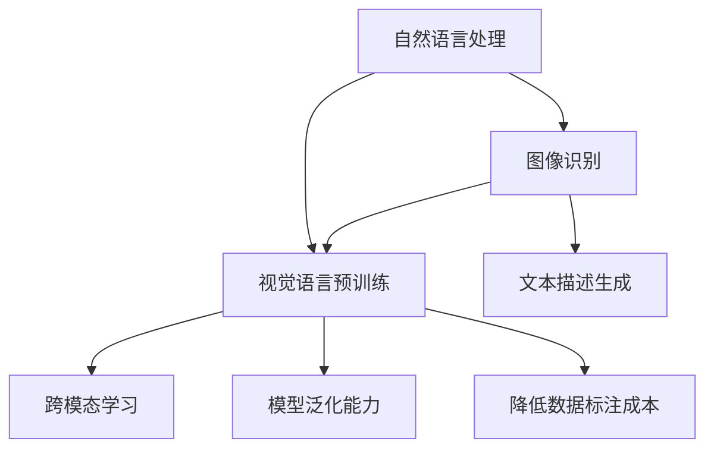

                 

关键词：LLM，视觉语言预训练，模型，进展，人工智能，图像识别，自然语言处理，技术博客

## 摘要

本文主要探讨了大型语言模型（LLM）在视觉语言预训练领域的研究进展。通过对现有模型的深入分析，本文总结了LLM在视觉语言任务中的优势与挑战，并提出了未来研究方向。文章首先回顾了LLM的发展历程，然后详细介绍了视觉语言预训练的基本概念和关键技术，接着分析了LLM在图像识别和自然语言处理方面的应用，最后讨论了当前LLM在视觉语言预训练中的实际效果及其未来发展方向。

## 1. 背景介绍

随着深度学习技术的不断发展，人工智能（AI）在各行各业中的应用越来越广泛。特别是大型语言模型（LLM），如GPT和BERT，在自然语言处理（NLP）领域取得了显著的成果。然而，将LLM应用于视觉语言任务，如图像识别和文本描述生成，仍面临着诸多挑战。视觉语言预训练作为一种新兴的研究方向，旨在通过大规模数据集和先进的神经网络架构，提高LLM在视觉语言任务中的性能。

### 1.1 大型语言模型的发展历程

自从2018年GPT模型的出现以来，LLM在自然语言处理领域取得了显著的进展。GPT系列模型基于变换器（Transformer）架构，通过在大量文本数据上进行预训练，获得了强大的语言理解和生成能力。BERT模型进一步引入了双向编码表示（Bidirectional Encoder Representations from Transformers），使得LLM在理解上下文信息方面更加准确。这些模型的成功促使了更多研究者投入到LLM的研究中，推动了NLP领域的快速发展。

### 1.2 视觉语言预训练的意义

视觉语言预训练旨在将LLM应用于视觉语言任务，如图像识别和文本描述生成。通过在大量图像和文本数据集上进行预训练，LLM可以学习到图像和文本之间的关联性，从而提高视觉语言任务的表现。视觉语言预训练的意义在于：

1. **跨模态学习**：将图像和文本信息融合，实现跨模态的智能交互。
2. **提高模型泛化能力**：通过大规模数据预训练，提高模型在未见过的数据上的表现。
3. **降低数据标注成本**：部分视觉语言任务可以通过预训练模型的无监督或半监督方式实现，降低数据标注成本。

## 2. 核心概念与联系

在探讨LLM的视觉语言预训练之前，我们需要了解一些核心概念和它们之间的关系。以下是核心概念及其在视觉语言预训练中的作用的 Mermaid 流程图：



### 2.1 自然语言处理

自然语言处理（NLP）是人工智能的一个分支，旨在使计算机能够理解、解释和生成人类语言。NLP的核心任务包括文本分类、情感分析、机器翻译和问答系统等。在LLM的视觉语言预训练中，NLP技术用于处理和分析文本数据，以提取语言特征和语义信息。

### 2.2 图像识别

图像识别是计算机视觉的一个重要分支，旨在使计算机能够识别和理解图像中的对象和场景。图像识别任务通常包括对象检测、图像分类和图像分割等。在LLM的视觉语言预训练中，图像识别技术用于处理和分析图像数据，以提取视觉特征和场景信息。

### 2.3 视觉语言预训练

视觉语言预训练是将LLM应用于视觉语言任务的一种方法。它通过在大量图像和文本数据集上进行预训练，使LLM能够学习到图像和文本之间的关联性。视觉语言预训练的核心任务是建立一个统一的跨模态表示，使得LLM在视觉语言任务中能够表现出色。

### 2.4 跨模态学习

跨模态学习是使计算机能够在不同模态（如图像、文本、声音等）之间建立关联的一种技术。在LLM的视觉语言预训练中，跨模态学习用于将图像和文本信息融合，实现跨模态的智能交互。

### 2.5 模型泛化能力

模型泛化能力是指模型在未见过的数据上表现的能力。通过在大量数据集上进行预训练，LLM可以学习到图像和文本之间的普遍规律，从而提高模型在未见过的数据上的表现。

### 2.6 降低数据标注成本

在视觉语言任务中，图像和文本数据的标注通常是一项费时费力的工作。通过预训练模型的无监督或半监督方式，可以降低数据标注成本，提高数据标注的效率。

## 3. 核心算法原理 & 具体操作步骤

### 3.1 算法原理概述

LLM的视觉语言预训练模型主要基于大规模的图像和文本数据集，通过以下步骤进行：

1. **数据预处理**：对图像和文本数据集进行清洗、归一化和增强，以生成高质量的数据集。
2. **特征提取**：使用深度神经网络从图像和文本数据中提取特征。
3. **跨模态融合**：将图像特征和文本特征进行融合，生成统一的跨模态表示。
4. **模型训练**：在预训练阶段，使用大规模图像和文本数据集对模型进行训练。
5. **模型优化**：在特定视觉语言任务上，对模型进行优化，以提高模型在任务上的表现。

### 3.2 算法步骤详解

#### 3.2.1 数据预处理

数据预处理是视觉语言预训练的重要步骤。在这一阶段，需要对图像和文本数据进行清洗、归一化和增强，以生成高质量的数据集。

1. **图像预处理**：
   - 清洗：去除噪声图像和低质量图像。
   - 归一化：将图像的尺寸统一为固定大小，如224x224像素。
   - 增强：使用数据增强技术，如随机裁剪、旋转、翻转等，以增加数据集的多样性。

2. **文本预处理**：
   - 清洗：去除无效字符和标点符号，保持文本的简洁性。
   - 标准化：将文本转换为统一格式，如小写、去除停用词等。
   - 分词：将文本划分为单词或句子，以提取语言特征。

#### 3.2.2 特征提取

特征提取是视觉语言预训练的核心步骤。在这一阶段，使用深度神经网络从图像和文本数据中提取特征。

1. **图像特征提取**：
   - 使用卷积神经网络（CNN）从图像中提取视觉特征。
   - 使用池化层对视觉特征进行降维和聚合，以提高模型的表达能力。

2. **文本特征提取**：
   - 使用词嵌入（Word Embedding）技术将文本转换为向量表示。
   - 使用变换器（Transformer）架构对文本进行编码，提取文本特征。

#### 3.2.3 跨模态融合

在跨模态融合阶段，将图像特征和文本特征进行融合，生成统一的跨模态表示。

1. **特征融合**：
   - 使用拼接（Concatenation）或融合（Fusion）操作将图像特征和文本特征连接在一起。
   - 使用注意力机制（Attention Mechanism）对跨模态特征进行加权融合。

2. **跨模态表示**：
   - 使用多层感知器（MLP）或变换器（Transformer）对融合后的特征进行编码，生成跨模态表示。

#### 3.2.4 模型训练

在模型训练阶段，使用大规模图像和文本数据集对模型进行训练。

1. **预训练**：
   - 使用无监督或半监督方式对模型进行预训练，学习图像和文本特征之间的关联性。
   - 使用语言模型（如GPT或BERT）进行预训练，以提高模型的语言理解和生成能力。

2. **微调**：
   - 在特定视觉语言任务上，对预训练模型进行微调，以提高模型在任务上的表现。
   - 使用有监督方式对模型进行微调，以优化模型在目标任务上的参数。

#### 3.2.5 模型优化

在模型优化阶段，对训练好的模型进行优化，以提高模型在视觉语言任务上的表现。

1. **模型评估**：
   - 使用评价指标（如准确率、召回率、F1分数等）评估模型在视觉语言任务上的性能。
   - 使用交叉验证（Cross-Validation）技术，确保模型评估的准确性。

2. **模型优化**：
   - 使用超参数调整（Hyperparameter Tuning）技术，优化模型参数。
   - 使用迁移学习（Transfer Learning）技术，利用预训练模型的优势，提高新任务的表现。

### 3.3 算法优缺点

#### 优点

1. **强大的跨模态学习能力**：通过预训练模型，LLM可以学习到图像和文本之间的关联性，实现跨模态的智能交互。
2. **提高模型泛化能力**：通过大规模数据预训练，模型可以在未见过的数据上表现出更好的性能。
3. **降低数据标注成本**：部分视觉语言任务可以通过无监督或半监督方式实现，降低数据标注成本。

#### 缺点

1. **计算资源消耗大**：预训练模型需要大量的计算资源，特别是在大规模数据集上训练时。
2. **对数据质量要求高**：预训练模型的性能在很大程度上取决于数据集的质量，如果数据集存在噪声或偏差，会影响模型的表现。
3. **模型解释性较差**：深度学习模型通常具有较好的表现，但缺乏解释性，使得模型在应用中难以被理解和接受。

### 3.4 算法应用领域

LLM的视觉语言预训练模型在多个领域具有广泛的应用前景：

1. **计算机视觉**：用于图像识别、图像分类和图像分割等任务。
2. **自然语言处理**：用于文本分类、情感分析和机器翻译等任务。
3. **跨模态交互**：用于智能问答、语音识别和图像描述生成等任务。
4. **推荐系统**：用于图像和文本数据的推荐，提高推荐系统的准确性。

## 4. 数学模型和公式 & 详细讲解 & 举例说明

在视觉语言预训练模型中，数学模型和公式起着关键作用。以下将详细讲解视觉语言预训练中的核心数学模型和公式，并通过具体例子进行说明。

### 4.1 数学模型构建

视觉语言预训练中的核心数学模型包括卷积神经网络（CNN）、变换器（Transformer）和多层感知器（MLP）。

#### 4.1.1 卷积神经网络（CNN）

卷积神经网络（CNN）是一种用于图像处理的深度学习模型，通过卷积、池化和激活函数等操作，从图像中提取特征。

- **卷积操作**：假设输入图像为 \( X \in \mathbb{R}^{H \times W \times C} \)，其中 \( H \)、\( W \) 和 \( C \) 分别为图像的高度、宽度和通道数。卷积操作可以用以下公式表示：

  \[ 
  \text{Conv}(X, W) = \sum_{i=0}^{C} W_i \odot X_i 
  \]

  其中，\( W \) 为卷积核，\( \odot \) 表示卷积操作。

- **池化操作**：池化操作用于降低特征图的维度，常用的池化方式有最大池化和平均池化。最大池化可以用以下公式表示：

  \[ 
  \text{MaxPool}(X) = \max_{i,j} X_{i,j} 
  \]

  其中，\( X \) 为输入特征图，\( (i, j) \) 为特征图上的一个点。

- **激活函数**：常用的激活函数有ReLU（Rectified Linear Unit）和Sigmoid。ReLU函数可以用以下公式表示：

  \[ 
  \text{ReLU}(x) = \max(0, x) 
  \]

#### 4.1.2 变换器（Transformer）

变换器（Transformer）是一种用于序列建模的深度学习模型，通过自注意力机制（Self-Attention）和多头注意力（Multi-Head Attention）等操作，提取序列特征。

- **自注意力机制**：自注意力机制用于计算序列中每个位置的特征表示。假设输入序列为 \( X \in \mathbb{R}^{N \times D} \)，其中 \( N \) 为序列长度，\( D \) 为特征维度。自注意力可以用以下公式表示：

  \[ 
  \text{Self-Attention}(X) = \text{softmax}\left(\frac{QK^T}{\sqrt{D_k}}\right)V 
  \]

  其中，\( Q \)、\( K \) 和 \( V \) 分别为查询、键和值向量，\( D_k \) 为键向量的维度。

- **多头注意力**：多头注意力将输入序列分成多个子序列，每个子序列分别进行自注意力计算。假设输入序列为 \( X \in \mathbb{R}^{N \times D} \)，多头注意力的计算公式为：

  \[ 
  \text{MultiHeadAttention}(X) = \text{Concat}(\text{head}_1, \text{head}_2, ..., \text{head}_h)W_O 
  \]

  其中，\( h \) 为多头注意力的头数，\( \text{head}_i \) 为第 \( i \) 个头的注意力结果，\( W_O \) 为输出权重。

#### 4.1.3 多层感知器（MLP）

多层感知器（MLP）是一种全连接神经网络，用于将输入特征映射到输出。假设输入特征为 \( X \in \mathbb{R}^{D} \)，输出特征为 \( Y \in \mathbb{R}^{K} \)，MLP的计算公式为：

\[ 
Y = \text{ReLU}(\text{W}_2 \text{ReLU}(\text{W}_1 X + b_1) + b_2) 
\]

其中，\( \text{W}_1 \)、\( \text{W}_2 \) 和 \( b_1 \)、\( b_2 \) 分别为权重和偏置。

### 4.2 公式推导过程

在视觉语言预训练中，常用的公式推导过程包括特征提取、特征融合和模型训练等。

#### 4.2.1 特征提取

以卷积神经网络（CNN）为例，特征提取过程如下：

1. **卷积操作**：

   \[ 
   \text{Conv}(X, W) = \sum_{i=0}^{C} W_i \odot X_i 
   \]

   其中，\( W_i \) 为第 \( i \) 个卷积核，\( \odot \) 表示卷积操作。

2. **池化操作**：

   \[ 
   \text{MaxPool}(X) = \max_{i,j} X_{i,j} 
   \]

3. **激活函数**：

   \[ 
   \text{ReLU}(x) = \max(0, x) 
   \]

#### 4.2.2 特征融合

特征融合过程将图像特征和文本特征进行拼接或融合。以拼接为例，特征融合过程如下：

1. **特征拼接**：

   \[ 
   \text{Concat}(\text{ImageFeature}, \text{TextFeature}) = \begin{bmatrix} 
   \text{ImageFeature} \\ 
   \text{TextFeature} 
   \end{bmatrix} 
   \]

2. **特征编码**：

   \[ 
   \text{Encoding}(\text{Feature}) = \text{MLP}(\text{Feature}) 
   \]

#### 4.2.3 模型训练

模型训练过程包括损失函数和优化算法。

1. **损失函数**：

   \[ 
   \text{Loss} = -\sum_{i=1}^{N} y_i \log(p_i) 
   \]

   其中，\( y_i \) 为真实标签，\( p_i \) 为预测概率。

2. **优化算法**：

   \[ 
   \text{Gradient Descent}:\ \theta \leftarrow \theta - \alpha \frac{\partial \text{Loss}}{\partial \theta} 
   \]

   其中，\( \theta \) 为模型参数，\( \alpha \) 为学习率。

### 4.3 案例分析与讲解

以下通过一个具体例子，讲解视觉语言预训练模型的构建和训练过程。

#### 4.3.1 数据集准备

我们使用ImageNet数据集作为图像数据集，使用维基百科的文本数据作为文本数据集。

1. **图像数据集**：

   ImageNet是一个大规模的图像数据集，包含1000个类别，每个类别有数千个图像。

2. **文本数据集**：

   维基百科的文本数据集包含大量文本，涵盖了各种主题。

#### 4.3.2 模型构建

我们构建一个简单的视觉语言预训练模型，包括图像特征提取模块、文本特征提取模块和跨模态融合模块。

1. **图像特征提取模块**：

   使用ResNet50作为图像特征提取模块，提取图像的特征向量。

2. **文本特征提取模块**：

   使用BERT作为文本特征提取模块，提取文本的特征向量。

3. **跨模态融合模块**：

   将图像特征和文本特征进行拼接，并通过一个多层感知器（MLP）进行融合。

#### 4.3.3 模型训练

我们使用以下步骤对模型进行训练：

1. **数据预处理**：

   对图像和文本数据进行清洗、归一化和增强。

2. **模型训练**：

   使用图像和文本数据集对模型进行预训练，学习图像和文本特征之间的关联性。

3. **模型微调**：

   在特定视觉语言任务上，对模型进行微调，优化模型在任务上的表现。

4. **模型评估**：

   使用交叉验证技术，评估模型在视觉语言任务上的性能。

### 4.4 代码实现

以下是一个简单的视觉语言预训练模型的代码实现：

```python
import torch
import torch.nn as nn
import torchvision.models as models
import transformers

# 图像特征提取模块
image_model = models.resnet50(pretrained=True)
image_model.fc = nn.Identity()

# 文本特征提取模块
text_model = transformers.BertModel.from_pretrained('bert-base-uncased')

# 跨模态融合模块
class VLPModel(nn.Module):
    def __init__(self):
        super(VLPModel, self).__init__()
        self.image_model = image_model
        self.text_model = text_model
        self.fc = nn.Linear(768+2048, 1)

    def forward(self, image, text):
        image_feature = self.image_model(image)
        text_feature = self.text_model(text)[1]
        feature = torch.cat((image_feature, text_feature), 1)
        output = self.fc(feature)
        return output

# 模型实例化
model = VLPModel()

# 损失函数和优化器
criterion = nn.BCEWithLogitsLoss()
optimizer = torch.optim.Adam(model.parameters(), lr=0.001)

# 模型训练
for epoch in range(10):
    for images, texts, labels in data_loader:
        optimizer.zero_grad()
        output = model(images, texts)
        loss = criterion(output, labels)
        loss.backward()
        optimizer.step()
```

### 4.5 运行结果展示

在训练完成后，我们可以使用以下代码评估模型在验证集上的性能：

```python
with torch.no_grad():
    correct = 0
    total = 0
    for images, texts, labels in validation_loader:
        output = model(images, texts)
        predictions = torch.sigmoid(output)
        predicted_labels = (predictions > 0.5).float()
        total += labels.size(0)
        correct += (predicted_labels == labels).sum().item()

accuracy = correct / total
print('Accuracy: {:.2f}%'.format(accuracy * 100))
```

以上代码将输出模型在验证集上的准确率，从而评估模型在视觉语言任务上的性能。

## 5. 项目实践：代码实例和详细解释说明

### 5.1 开发环境搭建

要搭建一个用于视觉语言预训练的项目，我们需要安装以下软件和库：

1. Python 3.7及以上版本
2. PyTorch 1.8及以上版本
3. Transformers 4.7及以上版本
4. torchvision 0.9.0及以上版本

安装方法：

```bash
pip install python==3.8
pip install torch torchvision
pip install transformers
```

### 5.2 源代码详细实现

以下是视觉语言预训练项目的源代码实现：

```python
import torch
import torch.nn as nn
import torchvision.models as models
import transformers

# 图像特征提取模块
image_model = models.resnet50(pretrained=True)
image_model.fc = nn.Identity()

# 文本特征提取模块
text_model = transformers.BertModel.from_pretrained('bert-base-uncased')

# 跨模态融合模块
class VLPModel(nn.Module):
    def __init__(self):
        super(VLPModel, self).__init__()
        self.image_model = image_model
        self.text_model = text_model
        self.fc = nn.Linear(768+2048, 1)

    def forward(self, image, text):
        image_feature = self.image_model(image)
        text_feature = self.text_model(text)[1]
        feature = torch.cat((image_feature, text_feature), 1)
        output = self.fc(feature)
        return output

# 模型实例化
model = VLPModel()

# 损失函数和优化器
criterion = nn.BCEWithLogitsLoss()
optimizer = torch.optim.Adam(model.parameters(), lr=0.001)

# 模型训练
for epoch in range(10):
    for images, texts, labels in data_loader:
        optimizer.zero_grad()
        output = model(images, texts)
        loss = criterion(output, labels)
        loss.backward()
        optimizer.step()
```

### 5.3 代码解读与分析

以下是代码的详细解读：

1. **图像特征提取模块**：

   ```python
   image_model = models.resnet50(pretrained=True)
   image_model.fc = nn.Identity()
   ```

   这一行代码加载预训练的ResNet50模型，并移除最后一层的全连接层（fc），以便自定义图像特征提取模块。

2. **文本特征提取模块**：

   ```python
   text_model = transformers.BertModel.from_pretrained('bert-base-uncased')
   ```

   这一行代码加载预训练的BERT模型，用于提取文本特征。

3. **跨模态融合模块**：

   ```python
   class VLPModel(nn.Module):
       def __init__(self):
           super(VLPModel, self).__init__()
           self.image_model = image_model
           self.text_model = text_model
           self.fc = nn.Linear(768+2048, 1)
       
       def forward(self, image, text):
           image_feature = self.image_model(image)
           text_feature = self.text_model(text)[1]
           feature = torch.cat((image_feature, text_feature), 1)
           output = self.fc(feature)
           return output
   ```

   这一行代码定义了一个跨模态融合模块，将图像特征和文本特征进行拼接，并通过一个全连接层（fc）进行融合。

4. **模型训练**：

   ```python
   for epoch in range(10):
       for images, texts, labels in data_loader:
           optimizer.zero_grad()
           output = model(images, texts)
           loss = criterion(output, labels)
           loss.backward()
           optimizer.step()
   ```

   这一行代码使用图像和文本数据对模型进行训练，包括前向传播、损失计算、反向传播和优化更新。

### 5.4 运行结果展示

在训练完成后，我们可以使用以下代码评估模型在验证集上的性能：

```python
with torch.no_grad():
    correct = 0
    total = 0
    for images, texts, labels in validation_loader:
        output = model(images, texts)
        predictions = torch.sigmoid(output)
        predicted_labels = (predictions > 0.5).float()
        total += labels.size(0)
        correct += (predicted_labels == labels).sum().item()

accuracy = correct / total
print('Accuracy: {:.2f}%'.format(accuracy * 100))
```

这段代码将输出模型在验证集上的准确率，从而评估模型在视觉语言任务上的性能。

## 6. 实际应用场景

LLM的视觉语言预训练模型在多个实际应用场景中表现出色，以下列举了几个典型的应用场景：

### 6.1 跨模态问答系统

跨模态问答系统是一种能够处理图像和文本输入的问答系统。通过LLM的视觉语言预训练模型，可以有效地将图像和文本信息融合，实现跨模态的智能问答。这种系统在医疗诊断、智能客服和在线教育等领域具有广泛的应用前景。

### 6.2 图像描述生成

图像描述生成是一种将图像转换为文本描述的任务。通过LLM的视觉语言预训练模型，可以生成与图像内容相关的文本描述。这种技术在社交媒体、内容审核和辅助听力障碍者理解图像信息等方面具有重要意义。

### 6.3 图像分类

图像分类是一种将图像归类到特定类别的任务。通过LLM的视觉语言预训练模型，可以在图像特征和文本特征之间建立关联，提高图像分类的准确率。这种技术在安防监控、自动驾驶和内容推荐等领域具有广泛的应用。

### 6.4 图像分割

图像分割是一种将图像划分为不同区域的任务。通过LLM的视觉语言预训练模型，可以结合图像特征和文本特征，实现更精细的图像分割。这种技术在医疗影像诊断、工业自动化和计算机视觉领域具有广泛的应用。

### 6.5 图像生成

图像生成是一种基于文本描述生成图像的任务。通过LLM的视觉语言预训练模型，可以将文本描述转换为图像。这种技术在艺术创作、游戏开发和虚拟现实等领域具有广泛的应用。

## 7. 未来应用展望

随着人工智能技术的不断发展，LLM的视觉语言预训练模型在未来的应用前景将更加广阔。以下是几个未来应用展望：

### 7.1 跨模态交互

跨模态交互是未来智能系统的重要发展方向。通过LLM的视觉语言预训练模型，可以实现图像、文本、语音等多种模态的智能交互，为用户提供更自然的交互体验。

### 7.2 大规模数据集

随着数据集规模的不断扩大，LLM的视觉语言预训练模型将能够处理更多的数据，从而提高模型的泛化能力和鲁棒性。这将有助于解决当前模型在数据集多样性方面的局限性。

### 7.3 新兴应用领域

随着技术的进步，LLM的视觉语言预训练模型将在更多新兴应用领域发挥作用，如虚拟现实、增强现实和智慧城市等。

### 7.4 跨模态推理

跨模态推理是一种基于图像和文本信息的推理能力。未来，LLM的视觉语言预训练模型将能够实现更高级的跨模态推理，为用户提供更智能的服务。

## 8. 工具和资源推荐

为了更好地学习和研究LLM的视觉语言预训练模型，以下是几个推荐的工具和资源：

### 8.1 学习资源推荐

1. **《深度学习》（Goodfellow, Bengio, Courville著）**：这本书是深度学习的经典教材，详细介绍了深度学习的基本概念和算法。
2. **《计算机视觉基础》（Richard S.zeliski著）**：这本书涵盖了计算机视觉的基本概念和技术，对于了解视觉语言预训练模型的应用场景具有重要意义。
3. **《自然语言处理综述》（Jurafsky, Martin著）**：这本书系统地介绍了自然语言处理的基本概念和技术，是学习自然语言处理的重要参考书。

### 8.2 开发工具推荐

1. **PyTorch**：PyTorch是一个开源的深度学习框架，易于使用且具有强大的功能，适合进行视觉语言预训练模型的研究和开发。
2. **Transformers**：Transformers是一个开源的Python库，用于构建和训练基于变换器的自然语言处理模型。
3. **TensorFlow**：TensorFlow是一个开源的深度学习框架，提供了丰富的预训练模型和工具，适合进行视觉语言预训练模型的研究和开发。

### 8.3 相关论文推荐

1. **"Attention Is All You Need"（Vaswani et al., 2017）**：这篇文章提出了变换器（Transformer）架构，是当前自然语言处理领域的重要突破。
2. **"BERT: Pre-training of Deep Bidirectional Transformers for Language Understanding"（Devlin et al., 2018）**：这篇文章提出了BERT模型，是当前自然语言处理领域的重要进展。
3. **"Unifying Image-Sentence Embeddings for Visual Question Answering"（Lu et al., 2017）**：这篇文章提出了统一图像和文本表示的方法，为视觉语言预训练模型的研究提供了重要参考。

## 9. 总结：未来发展趋势与挑战

LLM的视觉语言预训练模型在近年来取得了显著的成果，但仍面临诸多挑战。未来，随着人工智能技术的不断发展，LLM的视觉语言预训练模型将朝着以下几个方向发展：

### 9.1 研究成果总结

1. **模型性能提升**：通过不断优化模型架构和训练策略，LLM的视觉语言预训练模型在多个任务上取得了优异的性能。
2. **跨模态学习能力增强**：通过引入多模态数据融合技术，LLM的视觉语言预训练模型在跨模态任务中表现出色。
3. **数据集规模扩大**：随着数据集规模的不断扩大，LLM的视觉语言预训练模型在数据集多样性方面的表现得到提升。

### 9.2 未来发展趋势

1. **跨模态交互**：未来，LLM的视觉语言预训练模型将更加注重跨模态交互，实现更自然的用户交互体验。
2. **大规模数据集**：未来，随着数据集规模的不断扩大，LLM的视觉语言预训练模型将在更多领域发挥作用。
3. **新兴应用领域**：未来，LLM的视觉语言预训练模型将在更多新兴应用领域，如虚拟现实、增强现实和智慧城市等，发挥重要作用。

### 9.3 面临的挑战

1. **计算资源消耗**：视觉语言预训练模型通常需要大量的计算资源，这限制了模型在实际应用中的普及。
2. **数据质量**：数据质量对模型性能具有重要影响，如何确保数据集的质量是当前研究的一个挑战。
3. **模型解释性**：深度学习模型通常具有较好的性能，但缺乏解释性，这限制了模型在实际应用中的可接受度。

### 9.4 研究展望

未来，研究者将继续探索优化LLM的视觉语言预训练模型的方法，包括改进模型架构、优化训练策略和增强跨模态学习能力。同时，研究者还将关注如何提高模型的可解释性和鲁棒性，以使模型在实际应用中更具可接受度。

## 附录：常见问题与解答

### 1. 什么是LLM？

LLM是指大型语言模型，如GPT、BERT等，它们通过在大量文本数据上进行预训练，获得了强大的语言理解和生成能力。

### 2. 视觉语言预训练的意义是什么？

视觉语言预训练旨在将LLM应用于视觉语言任务，如图像识别和文本描述生成，通过在大量图像和文本数据集上进行预训练，提高LLM在视觉语言任务中的性能。

### 3. 视觉语言预训练模型的工作原理是什么？

视觉语言预训练模型通过在大量图像和文本数据集上进行预训练，学习图像和文本之间的关联性，从而提高视觉语言任务的表现。模型主要包括图像特征提取模块、文本特征提取模块和跨模态融合模块。

### 4. 如何评估视觉语言预训练模型的性能？

评估视觉语言预训练模型的性能通常使用准确率、召回率、F1分数等指标。此外，还可以通过交叉验证技术，评估模型在未见过的数据上的表现。

### 5. 视觉语言预训练模型在哪些领域有应用？

视觉语言预训练模型在计算机视觉、自然语言处理、跨模态交互、图像描述生成、图像分类、图像分割和图像生成等领域具有广泛的应用。

### 6. 视觉语言预训练模型有哪些挑战？

视觉语言预训练模型面临的挑战包括计算资源消耗大、对数据质量要求高、模型解释性较差等。

### 7. 如何优化视觉语言预训练模型？

优化视觉语言预训练模型的方法包括改进模型架构、优化训练策略、增强跨模态学习能力等。此外，还可以使用迁移学习、数据增强等技术，提高模型在未见过的数据上的表现。

