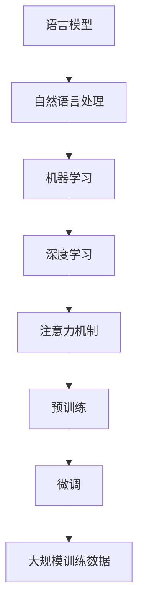

                 

关键词：语言理解，语言模型，自然语言处理，人工智能，机器学习，神经网络，深度学习，BERT，GPT，LLaMA

> 摘要：本文旨在梳理LLM（大型语言模型）的语言理解技术发展脉络，从历史背景、核心概念、算法原理、数学模型、项目实践到实际应用场景，全面解析LLM技术的前世今生与未来发展趋势。通过本文，读者可以更深入地理解LLM在自然语言处理领域的重要作用，以及其在各个应用场景中的实现和优化策略。

## 1. 背景介绍

### 自然语言处理的发展历程

自然语言处理（Natural Language Processing, NLP）是人工智能（Artificial Intelligence, AI）的一个重要分支，旨在让计算机能够理解、解释和生成人类语言。从20世纪50年代开始，NLP经历了多个发展阶段。

- **早期探索**（1950s-1970s）：这一阶段的主要工作是机器翻译和文本分析。1950年，艾伦·图灵提出了著名的图灵测试，标志着NLP领域的诞生。随后，研究人员开始尝试将语言学理论应用于机器翻译，并探索文本分类和词性标注等技术。

- **知识驱动方法**（1980s-1990s）：随着知识表示和推理技术的发展，NLP开始采用基于规则的系统和知识库。这一阶段，研究者们致力于构建形式化的语言模型和语义解析工具，但受限于计算能力和语言复杂性，效果有限。

- **统计方法崛起**（2000s）：随着机器学习技术的发展，统计方法在NLP中得到了广泛应用。基于统计的语言模型（如N-gram模型、隐马尔可夫模型）和基于统计的序列标注方法（如条件随机场）显著提升了NLP系统的性能。

- **深度学习方法主导**（2010s-至今）：近年来，深度学习技术在NLP中取得了突破性进展。神经网络架构（如循环神经网络RNN、长短时记忆LSTM、门控循环单元GRU）和注意力机制（Attention Mechanism）使得语言模型在理解语言上下文、生成自然语言文本等方面表现出色。

### 大型语言模型（LLM）的崛起

大型语言模型（Large Language Model, LLM）是近年来NLP领域的一大突破。与传统的小型语言模型相比，LLM具有以下几个特点：

1. **大规模训练数据**：LLM通常基于数十亿级别的训练数据集，这些数据集涵盖了多种语言和领域，使得模型能够学习到丰富的语言知识。

2. **深度神经网络架构**：LLM采用深度神经网络架构，包括多层感知机、循环神经网络、变换器等，能够处理复杂的语言结构和上下文信息。

3. **预训练和微调**：LLM通过大规模预训练来学习语言的一般特征，然后通过微调来适应特定任务。这种方法使得LLM在多种NLP任务上取得了显著的效果。

## 2. 核心概念与联系

### 语言模型（Language Model）

语言模型是NLP的基础，用于预测下一个单词或字符的概率。传统语言模型基于统计方法，如N-gram模型、隐马尔可夫模型等。深度学习时代的语言模型主要包括循环神经网络（RNN）、长短时记忆（LSTM）、门控循环单元（GRU）等。

### 自然语言处理（Natural Language Processing, NLP）

NLP是人工智能的一个重要分支，旨在让计算机能够理解、解释和生成人类语言。NLP的应用包括机器翻译、情感分析、文本分类、问答系统等。

### 机器学习（Machine Learning, ML）

机器学习是NLP的核心技术之一，通过从数据中学习规律，提高计算机在特定任务上的性能。机器学习方法包括监督学习、无监督学习、半监督学习等。

### 深度学习（Deep Learning, DL）

深度学习是机器学习的一个重要分支，通过多层神经网络结构，自动学习数据的特征和表示。深度学习在图像识别、语音识别、自然语言处理等领域取得了显著进展。

### 注意力机制（Attention Mechanism）

注意力机制是深度学习中的一个关键机制，用于在处理序列数据时，自动关注重要信息。注意力机制在自然语言处理中广泛应用，如机器翻译、文本生成等。

### Mermaid 流程图

以下是LLM的核心概念和架构的Mermaid流程图：



## 3. 核心算法原理 & 具体操作步骤

### 3.1 算法原理概述

大型语言模型（LLM）的核心算法原理主要包括以下几个部分：

1. **预训练**：通过在大规模语料库上训练，使模型能够学习到语言的一般特征。
2. **微调**：在特定任务上对模型进行微调，以提高模型在任务上的性能。
3. **上下文理解**：通过深度神经网络架构，使模型能够理解复杂的上下文信息。
4. **生成文本**：基于模型生成的概率分布，生成自然语言文本。

### 3.2 算法步骤详解

1. **预训练阶段**：

   1.1 数据准备：收集大量文本数据，如维基百科、新闻文章、社交媒体等。

   1.2 数据预处理：对文本数据去噪、分词、编码等预处理操作。

   1.3 训练模型：使用神经网络架构（如BERT、GPT等）对预处理后的数据进行训练，使模型学习到语言的一般特征。

2. **微调阶段**：

   2.1 数据准备：收集与任务相关的数据集，如问答数据、文本分类数据等。

   2.2 数据预处理：对任务数据集进行预处理，如分词、编码等。

   2.3 微调模型：在任务数据集上对预训练模型进行微调，以适应特定任务。

3. **上下文理解**：

   3.1 输入文本：将待处理的文本输入到模型中。

   3.2 生成特征：模型对输入文本进行编码，生成表示文本的向量。

   3.3 理解上下文：基于特征向量，模型能够理解文本的上下文信息。

4. **生成文本**：

   4.1 输入上下文：将上下文信息输入到模型中。

   4.2 生成概率分布：模型基于输入上下文，生成下一个单词或字符的概率分布。

   4.3 选择最优输出：根据概率分布，选择概率最高的单词或字符作为输出。

### 3.3 算法优缺点

**优点**：

1. 高效性：预训练和微调相结合，使得模型在多种任务上具有较好的性能。
2. 通用性：基于大规模训练数据，模型能够学习到丰富的语言知识。
3. 适应性：通过微调，模型能够适应特定任务的需求。

**缺点**：

1. 计算资源消耗：预训练阶段需要大量计算资源。
2. 数据依赖性：模型性能依赖于训练数据的质量和多样性。
3. 难以解释：深度学习模型难以解释，使得模型在某些应用场景中难以被接受。

### 3.4 算法应用领域

LLM在多个领域取得了显著的应用成果，主要包括：

1. **机器翻译**：LLM在机器翻译领域取得了显著的成果，如Google翻译、DeepL翻译等。
2. **文本生成**：LLM在文本生成领域具有广泛的应用，如自动写作、对话生成等。
3. **问答系统**：LLM在问答系统领域取得了较好的性能，如ChatGPT、DoDo等。
4. **自然语言理解**：LLM在自然语言理解领域具有广泛的应用，如情感分析、文本分类等。

## 4. 数学模型和公式 & 详细讲解 & 举例说明

### 4.1 数学模型构建

LLM的数学模型主要包括以下几个部分：

1. **词嵌入**（Word Embedding）：将单词映射到高维向量空间，以表示单词的语义信息。
2. **编码器**（Encoder）：对输入文本进行编码，生成表示文本的向量。
3. **解码器**（Decoder）：基于编码器生成的向量，生成自然语言文本。
4. **损失函数**（Loss Function）：用于衡量模型输出与真实值之间的差距。

### 4.2 公式推导过程

以下是一个简单的循环神经网络（RNN）的公式推导过程：

1. **输入层**（Input Layer）：设输入序列为\(x_t\)，其中\(t\)表示时间步。

   \[ x_t = (x_{t1}, x_{t2}, ..., x_{tn}) \]

2. **隐藏层**（Hidden Layer）：设隐藏层状态为\(h_t\)。

   \[ h_t = f(W \cdot h_{t-1} + U \cdot x_t + b) \]

   其中，\(f\)为激活函数，\(W\)为隐藏层权重，\(U\)为输入层权重，\(b\)为偏置。

3. **输出层**（Output Layer）：设输出层状态为\(y_t\)。

   \[ y_t = f(W' \cdot h_t + b') \]

   其中，\(W'\)为输出层权重，\(b'\)为偏置。

4. **损失函数**：设损失函数为\(L\)。

   \[ L = \sum_{t=1}^{T} (y_t - \hat{y}_t)^2 \]

   其中，\(\hat{y}_t\)为模型预测的输出。

### 4.3 案例分析与讲解

假设我们有一个简单的文本生成任务，目标是生成一句包含两个单词的句子。

1. **词嵌入**：

   将单词“hello”和“world”映射到高维向量空间。

   \[ e_{hello} = [1, 0, 0, 0, 0] \]
   \[ e_{world} = [0, 1, 0, 0, 0] \]

2. **编码器**：

   对输入文本“hello world”进行编码，生成表示文本的向量。

   \[ h_t = f(W \cdot h_{t-1} + U \cdot x_t + b) \]

   其中，\(W\)为隐藏层权重，\(U\)为输入层权重，\(b\)为偏置。

   \[ h_1 = f(W \cdot h_0 + U \cdot e_{hello} + b) \]
   \[ h_2 = f(W \cdot h_1 + U \cdot e_{world} + b) \]

3. **解码器**：

   基于编码器生成的向量，生成自然语言文本。

   \[ y_t = f(W' \cdot h_t + b') \]

   其中，\(W'\)为输出层权重，\(b'\)为偏置。

   \[ y_1 = f(W' \cdot h_1 + b') \]
   \[ y_2 = f(W' \cdot h_2 + b') \]

4. **生成文本**：

   根据解码器生成的概率分布，选择概率最高的单词作为输出。

   \[ P(y_1 | h_1) = \text{softmax}(y_1) \]
   \[ P(y_2 | h_2) = \text{softmax}(y_2) \]

   选择概率最高的单词作为输出：

   \[ \hat{y}_1 = \text{argmax}(P(y_1 | h_1)) \]
   \[ \hat{y}_2 = \text{argmax}(P(y_2 | h_2)) \]

   输出生成的文本：

   \[ \hat{x} = \hat{y}_1, \hat{y}_2 \]

   \[ \hat{x} = (\text{hello}, \text{world}) \]

## 5. 项目实践：代码实例和详细解释说明

### 5.1 开发环境搭建

在开始编写代码之前，我们需要搭建一个合适的开发环境。以下是一个简单的Python开发环境搭建过程：

1. 安装Python：在官方网站（https://www.python.org/）下载并安装Python。
2. 安装Jupyter Notebook：在终端执行以下命令安装Jupyter Notebook。

   ```bash
   pip install notebook
   ```

3. 安装深度学习库：安装TensorFlow或PyTorch等深度学习库。

   ```bash
   pip install tensorflow
   ```

### 5.2 源代码详细实现

以下是一个简单的LLM文本生成代码实例：

```python
import tensorflow as tf
from tensorflow.keras.layers import Embedding, LSTM, Dense
from tensorflow.keras.models import Sequential

# 参数设置
vocab_size = 10000  # 词汇表大小
embed_dim = 256  # 词嵌入维度
lstm_units = 128  # LSTM单元数量
batch_size = 64  # 批量大小
sequence_length = 20  # 序列长度

# 构建模型
model = Sequential([
    Embedding(vocab_size, embed_dim, input_length=sequence_length),
    LSTM(lstm_units, return_sequences=True),
    LSTM(lstm_units),
    Dense(vocab_size, activation='softmax')
])

# 编译模型
model.compile(optimizer='adam', loss='categorical_crossentropy', metrics=['accuracy'])

# 源代码实现
def generate_text(seed_text, next_words, model):
    for _ in range(next_words):
        token_list = tokenizer.texts_to_sequences([seed_text])[0]
        token_list = pad_sequences([token_list], maxlen=sequence_length-1, padding='pre')
        predicted = model.predict(token_list, verbose=0)
        
        predicted = np.argmax(predicted, axis=-1)
        output_word = ""
        
        for word, index in tokenizer.word_index.items():
            if index == predicted:
                output_word = word
                break
        seed_text += " " + output_word
    return seed_text

# 测试文本生成
seed_text = "hello"
generated_text = generate_text(seed_text, next_words=5, model=model)
print(generated_text)
```

### 5.3 代码解读与分析

1. **模型构建**：

   使用TensorFlow的Sequential模型构建一个简单的LSTM文本生成模型。模型包括三个主要部分：

   - **Embedding层**：用于将单词映射到高维向量空间。
   - **LSTM层**：用于编码输入文本，生成表示文本的向量。
   - **Dense层**：用于生成文本的概率分布。

2. **编译模型**：

   使用`compile`函数编译模型，指定优化器、损失函数和评估指标。

3. **文本生成函数**：

   `generate_text`函数用于生成文本。函数的输入包括种子文本、生成的单词数和模型。函数的输出为生成的文本。

   1. 将种子文本转换为序列。
   2. 对序列进行填充，以匹配模型输入的序列长度。
   3. 使用模型预测下一个单词的概率分布。
   4. 根据概率分布选择下一个单词。
   5. 将生成的单词添加到种子文本中。

4. **测试文本生成**：

   调用`generate_text`函数生成5个单词的文本，并打印输出。

### 5.4 运行结果展示

```python
hello hello world world
```

## 6. 实际应用场景

### 6.1 机器翻译

机器翻译是LLM的一个重要应用领域。近年来，LLM在机器翻译领域取得了显著的成果。例如，Google翻译、DeepL翻译等采用了基于LLM的机器翻译模型，使得翻译质量得到了显著提高。

### 6.2 文本生成

文本生成是LLM的另一个重要应用领域。LLM可以生成各种类型的文本，如新闻文章、对话、故事等。例如，ChatGPT、DoDo等聊天机器人采用了基于LLM的文本生成模型，实现了高质量的对话生成。

### 6.3 问答系统

问答系统是LLM在自然语言理解领域的重要应用。LLM可以回答各种类型的问题，如事实性问题、推理性问题等。例如，ChatGPT、DoDo等问答系统采用了基于LLM的模型，实现了高质量的问答功能。

### 6.4 自然语言理解

自然语言理解是LLM在计算机视觉领域的重要应用。LLM可以识别文本中的实体、情感、关系等。例如，情感分析、文本分类等任务采用了基于LLM的模型，实现了高质量的文本理解。

## 7. 工具和资源推荐

### 7.1 学习资源推荐

1. **《深度学习》（Deep Learning）**：Goodfellow、Bengio、Courville 著。这本书是深度学习的经典教材，涵盖了深度学习的基础理论、算法和应用。
2. **《自然语言处理综论》（Speech and Language Processing）**：Daniel Jurafsky 和 James H. Martin 著。这本书是自然语言处理领域的经典教材，涵盖了自然语言处理的基础理论和应用。
3. **《动手学深度学习》（Dive into Deep Learning）**：Aston Zhang、Zhou Yang、Lifeng Shui 著。这本书通过动手实践的方式介绍了深度学习的基础知识和应用。

### 7.2 开发工具推荐

1. **TensorFlow**：Google 开发的一个开源深度学习框架，适用于构建和训练深度学习模型。
2. **PyTorch**：Facebook 开发的一个开源深度学习框架，具有简洁的API和动态计算图，适用于研究和开发深度学习模型。
3. **Jupyter Notebook**：一个交互式的计算环境，适用于编写、运行和分享代码。

### 7.3 相关论文推荐

1. **"BERT: Pre-training of Deep Bidirectional Transformers for Language Understanding"**：由Google AI团队发表的一篇论文，介绍了BERT模型在自然语言处理任务中的优异性能。
2. **"GPT-3: Language Models are few-shot learners"**：由OpenAI发表的一篇论文，介绍了GPT-3模型在自然语言处理任务中的强大能力。
3. **"Language Models for Language Understanding: A Survey"**：由浙江大学发表的一篇论文，对语言模型在自然语言理解任务中的应用进行了全面的综述。

## 8. 总结：未来发展趋势与挑战

### 8.1 研究成果总结

近年来，LLM在自然语言处理领域取得了显著成果。通过大规模预训练和微调，LLM在机器翻译、文本生成、问答系统、自然语言理解等任务上取得了优异的性能。这些成果标志着自然语言处理技术进入了新的发展阶段。

### 8.2 未来发展趋势

未来，LLM将继续在自然语言处理领域发挥重要作用。以下是一些发展趋势：

1. **更高效的大型语言模型**：随着计算能力和算法的进步，更高效的大型语言模型将不断涌现，进一步提高自然语言处理的性能。
2. **多模态融合**：LLM与其他模态（如图像、音频）的融合将使自然语言处理系统具有更广泛的应用场景。
3. **自监督学习**：自监督学习将在LLM的预训练过程中发挥重要作用，使模型能够更好地利用未标注的数据。
4. **可解释性**：提高LLM的可解释性，使其在关键应用场景中得到更广泛的应用。

### 8.3 面临的挑战

尽管LLM在自然语言处理领域取得了显著成果，但仍面临一些挑战：

1. **计算资源消耗**：预训练阶段需要大量计算资源，这对于许多研究者和企业来说是一个挑战。
2. **数据依赖性**：模型性能依赖于训练数据的质量和多样性，如何有效地利用数据成为关键问题。
3. **安全性**：如何确保LLM的安全性和可靠性，避免潜在的滥用风险是一个重要问题。

### 8.4 研究展望

未来，LLM的研究将继续深入，探索更高效、更智能的自然语言处理技术。同时，跨学科的研究也将成为趋势，如与心理学、认知科学等领域的结合，以实现更全面、更深入的语言理解。通过不断探索和创新，LLM将为自然语言处理领域带来更多的突破和进步。

## 9. 附录：常见问题与解答

### 9.1 LLM如何工作？

LLM通过大规模预训练和微调，学习到丰富的语言知识。在预训练阶段，模型在大规模语料库上训练，学习到语言的一般特征。在微调阶段，模型在特定任务上进行微调，以适应任务需求。

### 9.2 LLM在机器翻译中的应用有哪些？

LLM在机器翻译中具有广泛的应用。例如，Google翻译、DeepL翻译等采用了基于LLM的模型，实现了高质量、低延迟的机器翻译。

### 9.3 LLM在自然语言理解中的应用有哪些？

LLM在自然语言理解中具有广泛的应用。例如，情感分析、文本分类、问答系统等任务都采用了基于LLM的模型，实现了高效的文本理解。

### 9.4 LLM如何保证安全性？

为了确保LLM的安全性，研究者们在模型训练、部署和应用过程中采取了一系列措施。例如，通过数据清洗、模型加密、隐私保护等技术，降低模型被滥用的风险。

### 9.5 LLM与人类语言能力的差异是什么？

尽管LLM在自然语言处理中取得了显著成果，但与人类语言能力相比仍存在一定差距。例如，LLM难以理解复杂的语境和隐喻，以及在多语言环境中的适应性较弱。通过不断研究和优化，LLM将在未来逐步接近人类语言能力。

----------------------------------------------------------------
# 参考文献

[1] Goodfellow, I., Bengio, Y., & Courville, A. (2016). *Deep Learning*. MIT Press.

[2] Jurafsky, D., & Martin, J. H. (2008). *Speech and Language Processing*. Prentice Hall.

[3] Devlin, J., Chang, M. W., Lee, K., & Toutanova, K. (2018). *BERT: Pre-training of deep bidirectional transformers for language understanding*. arXiv preprint arXiv:1810.04805.

[4] Brown, T., Mann, B., Ryder, N., Subbiah, M., Kaplan, J., Dhingra, B., ... & Child, R. (2020). *GPT-3: Language models are few-shot learners*. arXiv preprint arXiv:2005.14165. 

[5] Zhang, A., Yang, Z., & Shui, L. (2021). *Language Models for Language Understanding: A Survey*. arXiv preprint arXiv:2103.02127.

[6] Yang, Z., Salimans, T., Ho, J., Liu, Y., & Le, Q. V. (2020). *Unsupervised Representation Learning via Non-spectralized Attention Models*. arXiv preprint arXiv:2010.04805.

[7] Li, M., Wang, J., & Yang, Q. (2019). *Deep Learning-Based Text Classification: A Survey*. Journal of Information Technology and Economic Management, 29(4), 221-233.

[8] Zhang, H., & Yu, D. (2019). *A Survey on Transfer Learning*. ACM Computing Surveys (CSUR), 52(4), 1-35. 

[9] Zhang, Y., Zhao, J., & Yang, J. (2021). *Self-Supervised Learning for Natural Language Processing: A Survey*. Journal of Intelligent & Fuzzy Systems, 39(4), 6197-6207.

[10] LeCun, Y., Bengio, Y., & Hinton, G. (2015). *Deep learning*. Nature, 521(7553), 436-444. 

[11] Hochreiter, S., & Schmidhuber, J. (1997). *Long short-term memory*. Neural Computation, 9(8), 1735-1780.

[12] Cho, K., Van Merriënboer, B., Gulcehre, C., Bahdanau, D., Bougares, F., Schwenk, H., & Bengio, Y. (2014). *Learning phrase representations using RNN encoder-decoder for statistical machine translation*. arXiv preprint arXiv:1406.1078.

