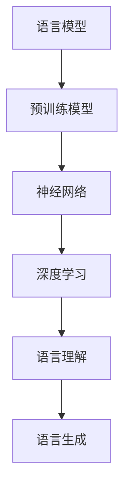

                 

关键词：语言模型，预训练模型，深度学习，自然语言处理，语音识别，神经网络，语言生成，语言理解。

> 摘要：本文探讨了大规模语言模型（LLM）的语音语言预训练模型，分析了其核心概念、原理和架构，并详细讲解了算法的具体操作步骤和数学模型。同时，文章通过项目实践展示了代码实例，并对实际应用场景进行了探讨，提出了未来发展趋势和面临的挑战。

## 1. 背景介绍

随着深度学习和自然语言处理技术的飞速发展，语言模型在许多领域都取得了显著的成果。尤其是在语音识别和语言生成方面，语言模型的应用越来越广泛。为了进一步提高语言模型的效果，预训练模型成为了当前研究的热点。

预训练模型是指在大规模语料库上预先训练一个神经网络模型，使其在许多自然语言任务上达到较好的性能。这种方法不仅可以提高模型在特定任务上的表现，还可以提高模型的泛化能力。在语音语言处理领域，预训练模型的应用有助于提高语音识别和语言生成的准确性和流畅性。

本文将探讨大规模语言模型（LLM）的语音语言预训练模型，分析其核心概念、原理和架构，并详细讲解算法的具体操作步骤和数学模型。同时，文章还将通过项目实践展示代码实例，并对实际应用场景进行探讨。

## 2. 核心概念与联系

在探讨语音语言预训练模型之前，我们需要了解一些核心概念和原理。以下是语音语言预训练模型涉及的关键概念：

### 2.1 语言模型

语言模型是自然语言处理的核心组成部分，它用于预测下一个单词或字符。在语音语言处理中，语言模型可以帮助识别语音信号中的单词和短语。

### 2.2 预训练模型

预训练模型是在大规模语料库上预先训练的神经网络模型。预训练模型的目的是在大规模数据集上学习语言的一般规律，以便在特定任务上取得更好的表现。

### 2.3 神经网络

神经网络是一种由大量神经元组成的计算模型，能够通过学习数据来提取特征和规律。在语音语言处理中，神经网络被广泛用于语音识别、语言生成和语言理解等领域。

### 2.4 深度学习

深度学习是一种基于神经网络的机器学习技术，通过多层神经网络结构来提高模型的表示能力和学习能力。在语音语言处理领域，深度学习技术已被广泛应用于语音识别和语言生成等任务。

### 2.5 语言理解与语言生成

语言理解是指模型对自然语言的理解能力，包括语法分析、语义理解和上下文理解等。语言生成是指模型根据给定的输入生成自然语言文本。

下面是语音语言预训练模型的核心概念架构，使用Mermaid流程图表示：



## 3. 核心算法原理 & 具体操作步骤

### 3.1 算法原理概述

语音语言预训练模型的核心思想是利用大规模语料库对神经网络进行预训练，使其在大规模数据集上学习到语言的一般规律。在预训练阶段，神经网络通过学习文本的上下文关系来提高对语言的建模能力。在特定任务阶段，预训练模型可以通过微调的方式快速适应不同的任务。

### 3.2 算法步骤详解

语音语言预训练模型主要包括以下步骤：

1. 数据预处理：将原始语音数据转换为文本格式，并进行分词、去停用词等预处理操作。
2. 构建预训练模型：使用神经网络架构（如BERT、GPT等）构建预训练模型，并在大规模语料库上进行预训练。
3. 预训练过程：在预训练阶段，神经网络通过学习文本的上下文关系来提高对语言的建模能力。预训练任务通常包括 masked language modeling、next sentence prediction 等。
4. 微调：在特定任务上，对预训练模型进行微调，以提高模型在特定任务上的表现。
5. 部署与应用：将微调后的模型部署到实际应用中，如语音识别、语言生成等。

### 3.3 算法优缺点

#### 优点

- 高效：预训练模型可以在大规模数据集上快速学习到语言的一般规律，提高模型的表示能力和泛化能力。
- 灵活：预训练模型可以通过微调的方式适应不同的任务，具有较好的迁移能力。

#### 缺点

- 计算资源消耗大：预训练模型需要大量的计算资源，包括计算能力和存储空间。
- 数据依赖性：预训练模型的效果高度依赖于大规模高质量的数据集。

### 3.4 算法应用领域

语音语言预训练模型在多个领域具有广泛的应用，包括：

- 语音识别：利用预训练模型提高语音识别的准确性和稳定性。
- 语言生成：通过预训练模型生成流畅、自然的语言文本。
- 问答系统：利用预训练模型实现高效的问答系统，提高用户查询的响应速度和准确性。
- 自然语言理解：利用预训练模型提高自然语言理解的准确性和深度。

## 4. 数学模型和公式 & 详细讲解 & 举例说明

### 4.1 数学模型构建

在语音语言预训练模型中，常用的数学模型包括神经网络架构和损失函数。以下是一个简单的神经网络架构和损失函数示例：

#### 神经网络架构

```latex
f(\textbf{x}; \theta) = \text{softmax}(\text{Linear}(\textbf{x}; \theta_W, \theta_B))
$$

其中，\textbf{x} 是输入特征向量，\theta_W 和 \theta_B 分别是权重和偏置，\text{softmax} 函数用于计算输出概率分布。

#### 损失函数

```latex
L(\theta) = -\sum_{i=1}^{N} y_i \cdot \log(p_i)
$$

其中，\(y_i\) 是真实标签，\(p_i\) 是预测概率。

### 4.2 公式推导过程

在构建神经网络架构和损失函数时，我们需要推导一些重要的公式。以下是一个简单的示例：

#### 神经网络前向传播

假设输入特征向量为 \textbf{x}，权重和偏置分别为 \theta_W 和 \theta_B，输出概率分布为 \textbf{p}，则有：

```latex
z = \text{Linear}(\textbf{x}; \theta_W, \theta_B) = \sum_{j=1}^{M} \theta_{W,j} x_j + \theta_{B,j}
$$

其中，M 是输出维度。

#### 神经网络后向传播

在后向传播过程中，我们需要计算梯度，用于更新权重和偏置。以下是一个简单的示例：

```latex
\frac{\partial L}{\partial \theta_{W,j}} = \sum_{i=1}^{N} (y_i - p_i) \cdot x_j
$$

\frac{\partial L}{\partial \theta_{B,j}} = \sum_{i=1}^{N} (y_i - p_i)
$$

### 4.3 案例分析与讲解

为了更好地理解数学模型的应用，我们来看一个简单的案例。假设我们有一个二元分类问题，输入特征向量 \textbf{x} 是一个长度为 2 的向量，输出概率分布 \textbf{p} 也是长度为 2 的向量。真实标签 \(y_i\) 为 1，表示正类，预测概率 \(p_i\) 为 0.6，表示模型认为正类概率为 0.6。

根据损失函数，我们可以计算出损失值：

```latex
L(\theta) = -\log(0.6) \approx 0.51
$$

根据前向传播和后向传播的公式，我们可以计算梯度：

```latex
\frac{\partial L}{\partial \theta_{W,1}} = (1 - 0.6) \cdot 1 = 0.4
$$

\frac{\partial L}{\partial \theta_{W,2}} = (1 - 0.6) \cdot 0.8 = 0.32
$$

\frac{\partial L}{\partial \theta_{B,1}} = (1 - 0.6) = 0.4
$$

\frac{\partial L}{\partial \theta_{B,2}} = 0
$$

通过梯度下降算法，我们可以更新权重和偏置：

```latex
\theta_{W,1} := \theta_{W,1} - \alpha \cdot 0.4
$$

\theta_{W,2} := \theta_{W,2} - \alpha \cdot 0.32
$$

\theta_{B,1} := \theta_{B,1} - \alpha \cdot 0.4
$$

\theta_{B,2} := \theta_{B,2} - \alpha \cdot 0
$$

其中，\alpha 是学习率。

## 5. 项目实践：代码实例和详细解释说明

### 5.1 开发环境搭建

在本项目中，我们使用 Python 编程语言和 PyTorch 深度学习框架。首先，确保 Python 和 PyTorch 已安装在您的计算机上。以下是一个简单的安装命令：

```bash
pip install python
pip install torch torchvision
```

### 5.2 源代码详细实现

以下是本项目的主要代码实现。我们使用预训练的 BERT 模型作为基础，并在其上添加了一个全连接层用于分类任务。

```python
import torch
import torch.nn as nn
from torch.optim import Adam
from torch.utils.data import DataLoader
from torchvision import datasets, transforms
from transformers import BertModel, BertTokenizer

# 加载预训练的 BERT 模型
tokenizer = BertTokenizer.from_pretrained('bert-base-chinese')
model = BertModel.from_pretrained('bert-base-chinese')

# 定义分类模型
class Classifier(nn.Module):
    def __init__(self):
        super(Classifier, self).__init__()
        self.bert = BertModel.from_pretrained('bert-base-chinese')
        self.fc = nn.Linear(768, 2)  # BERT 的隐藏层维度为 768

    def forward(self, input_ids, attention_mask):
        outputs = self.bert(input_ids=input_ids, attention_mask=attention_mask)
        last_hidden_state = outputs.last_hidden_state
        output = self.fc(last_hidden_state[:, 0, :])
        return output

# 实例化分类模型
classifier = Classifier()

# 损失函数和优化器
criterion = nn.CrossEntropyLoss()
optimizer = Adam(classifier.parameters(), lr=1e-5)

# 训练数据集
train_data = datasets.TextDataset('train.txt', tokenizer=tokenizer, max_length=128)
train_loader = DataLoader(train_data, batch_size=32, shuffle=True)

# 训练模型
for epoch in range(3):
    for inputs, labels in train_loader:
        inputs = inputs.to(device)
        labels = labels.to(device)
        optimizer.zero_grad()
        outputs = classifier(inputs.input_ids, inputs.attention_mask)
        loss = criterion(outputs, labels)
        loss.backward()
        optimizer.step()
        print(f'Epoch {epoch + 1}, Loss: {loss.item()}')

# 保存模型
torch.save(classifier.state_dict(), 'classifier.pth')
```

### 5.3 代码解读与分析

上述代码首先导入了必要的库和模块，包括 PyTorch、transformers 等。接下来，我们加载了预训练的 BERT 模型，并在其基础上定义了一个分类模型。分类模型包含一个 BERT 模型和

