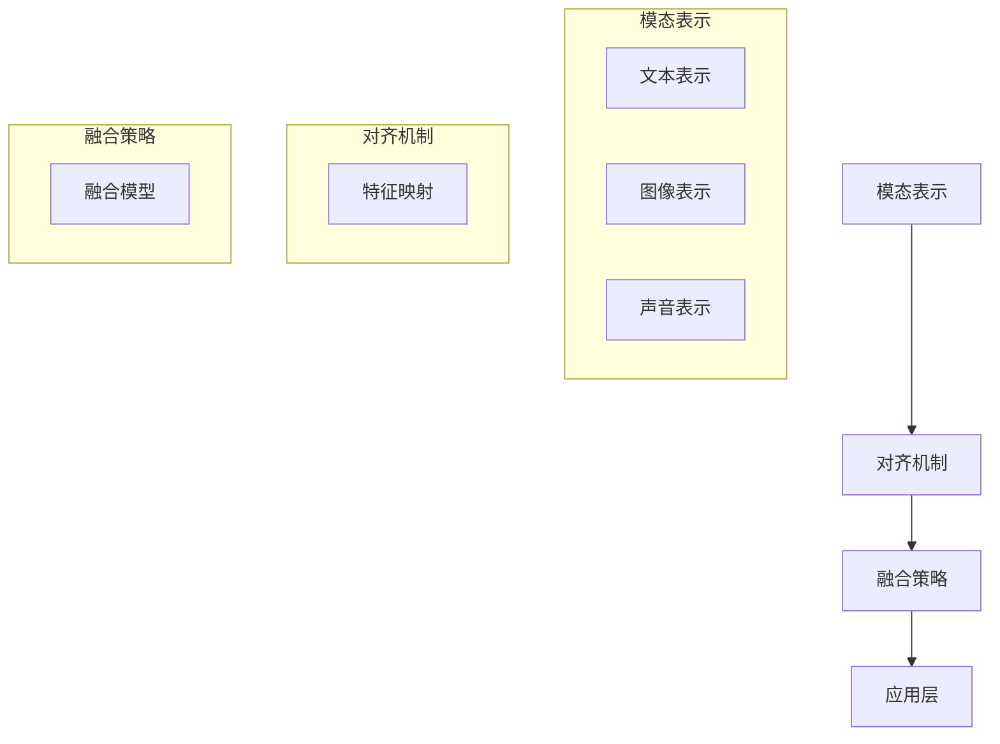

                 

关键词：自然语言处理、跨模态学习、对齐算法、深度学习、人工智能、对齐误差、多模态数据融合

## 摘要

本文旨在探讨大规模语言模型（LLM）在跨模态对齐技术中的研究热点。随着人工智能技术的发展，跨模态学习已经成为自然语言处理领域的重要研究方向。本文首先介绍了跨模态学习的背景和重要性，然后详细阐述了LLM在跨模态对齐技术中的核心概念、算法原理以及具体操作步骤。同时，文章还通过数学模型和公式的推导，提供了详细的理论支持。最后，本文通过实际项目实践，展示了LLM在跨模态对齐技术中的具体应用，并对未来的发展趋势和面临的挑战进行了展望。

## 1. 背景介绍

随着信息时代的到来，数据类型越来越多样化，如图像、声音、视频和文本等。跨模态学习作为一种处理多模态数据的方法，旨在将这些不同类型的数据进行整合，以便更好地理解和利用。跨模态学习的核心任务是实现对不同模态数据之间的对齐，即找到一种方式将不同模态的数据映射到统一的表示空间中。

在自然语言处理领域，大规模语言模型（LLM）已经成为重要的研究工具和应用平台。LLM通过学习大量的文本数据，可以生成高质量的自然语言文本，并在机器翻译、文本生成、情感分析等任务中表现出色。然而，随着跨模态学习的发展，如何将LLM与跨模态对齐技术相结合，成为一个重要的研究方向。

跨模态对齐技术的研究具有重要的现实意义。首先，跨模态对齐可以增强人工智能系统的理解和表达能力，使其能够更好地处理多模态数据。其次，跨模态对齐有助于发现不同模态数据之间的关联性，从而为数据挖掘和知识发现提供新的途径。此外，跨模态对齐技术还可以应用于智能交互、虚拟现实、增强现实等领域，推动人工智能技术的进一步发展。

本文将围绕LLM的跨模态对齐技术展开讨论，旨在深入分析其核心概念、算法原理和应用场景，为相关研究提供参考和启示。

### 1.1 跨模态学习的发展历程

跨模态学习作为人工智能领域的一个研究方向，其发展历程可以追溯到20世纪90年代。早期的跨模态学习主要集中在手工设计特征和简单模型的应用上，例如基于词汇共现的方法、基于模板匹配的方法等。这些方法在一定程度上实现了不同模态数据之间的对齐，但由于模型的局限性，其效果并不理想。

随着深度学习技术的发展，跨模态学习逐渐从手工设计特征向端到端的深度学习模型转变。2006年，Hinton等人的深度信念网络（DBN）模型为深度学习的发展奠定了基础。随后，基于卷积神经网络（CNN）和循环神经网络（RNN）的跨模态学习模型相继出现，例如CNN-RNN模型和CNN-LSTM模型等。

近年来，随着大规模语言模型（LLM）的兴起，跨模态学习的研究取得了新的突破。LLM能够处理大量的文本数据，通过预训练和微调，可以生成高质量的自然语言文本。基于LLM的跨模态对齐技术，通过融合不同模态的数据，实现了更高层次的对齐和语义理解。

从跨模态学习的发展历程可以看出，随着人工智能技术的不断进步，跨模态学习逐渐从简单的特征对齐向深度学习模型的应用转变。LLM的兴起为跨模态学习带来了新的机遇和挑战，推动了跨模态对齐技术的快速发展。

### 1.2 跨模态学习的核心问题

跨模态学习涉及多个核心问题，主要包括模态表示、对齐和融合。模态表示是对不同模态数据进行特征提取和表示的过程，对齐是找到不同模态数据之间的对应关系，融合则是将不同模态的数据进行整合，以实现更高的语义理解和应用价值。

#### 模态表示

模态表示是跨模态学习的基础。不同模态的数据具有不同的特征和表现形式，例如文本数据主要通过词汇和句法结构进行表示，图像数据主要通过像素值进行表示，声音数据主要通过波形进行表示。为了实现对不同模态数据的处理，需要设计适当的特征提取方法，将不同模态的数据转化为统一的表示空间。

常见的模态表示方法包括基于传统特征的方法和基于深度学习的方法。传统特征方法主要通过手工设计特征，如文本的词频、词向量、句法结构，图像的边缘、纹理、颜色特征等。深度学习方法则通过学习大量的数据，自动提取具有代表性的特征表示。例如，卷积神经网络（CNN）可以用于提取图像的特征表示，循环神经网络（RNN）可以用于提取文本的特征表示。

#### 对齐

对齐是跨模态学习的核心问题之一。对齐的目的是找到不同模态数据之间的对应关系，使不同模态的数据能够在统一的表示空间中进行融合。对齐可以分为基于特征的对齐和基于语义的对齐。

基于特征的对齐主要通过特征相似度度量来实现。例如，可以使用余弦相似度、欧氏距离等度量方法，计算不同模态数据之间的特征相似度，从而找到对应关系。这种方法简单直观，但容易受到噪声和特征分布的影响。

基于语义的对齐则通过理解不同模态数据的语义信息来实现。例如，可以使用预训练的词向量模型，将文本和图像中的词汇映射到同一向量空间中，从而找到对应关系。这种方法能够更好地理解语义信息，但需要大量的语义信息作为先验知识。

#### 融合

融合是将不同模态的数据进行整合，以实现更高的语义理解和应用价值。融合可以分为基于特征融合和基于语义融合。

基于特征融合主要通过特征叠加、特征加权等方法来实现。例如，将文本和图像的特征进行叠加，或者对不同特征进行加权融合，以得到更丰富的特征表示。

基于语义融合则通过理解不同模态数据的语义信息来实现。例如，可以使用文本生成模型，将文本和图像的语义信息进行整合，生成更自然的文本描述。这种方法能够更好地理解语义信息，但需要大量的语义信息作为先验知识。

#### 跨模态学习的关键挑战

跨模态学习面临着多个关键挑战。首先，模态差异问题。不同模态的数据具有不同的特征和表现形式，如何有效地融合不同模态的数据，是一个重要的挑战。

其次，数据不平衡问题。通常，不同模态的数据量差异较大，例如，文本数据通常远多于图像数据。如何处理数据不平衡问题，保证不同模态的数据都能得到充分利用，是一个重要的挑战。

最后，实时性和效率问题。跨模态学习通常涉及复杂的模型和算法，如何在保证效果的前提下，提高模型的实时性和效率，是一个重要的挑战。

通过深入分析跨模态学习的核心问题和挑战，我们可以更好地理解LLM在跨模态对齐技术中的作用和优势，为后续的研究和应用提供参考。

### 1.3 LLM在跨模态学习中的优势

随着大规模语言模型（LLM）的快速发展，其在跨模态学习中的应用逐渐成为研究热点。LLM具有以下几方面的优势，使其在跨模态对齐技术中具有独特的地位和广泛的应用前景。

#### 丰富的文本数据

LLM通过学习大量的文本数据，能够捕捉到丰富的语义信息。这种丰富的语义信息对于跨模态学习至关重要，因为文本数据往往包含不同模态数据之间的关联性。例如，在文本和图像的跨模态对齐中，LLM能够从文本中提取出与图像内容相关的关键词和描述，从而更好地理解图像的语义。

#### 强大的表征能力

LLM具有强大的表征能力，能够生成高质量的文本描述。这种能力在跨模态对齐中具有重要意义。例如，在图像和文本的融合中，LLM可以生成与图像内容相匹配的自然语言描述，从而提高对齐的准确性和自然性。

#### 端到端的学习方法

LLM通常采用端到端的学习方法，这意味着从输入到输出的整个过程都可以通过模型自动学习。这种学习方法简化了跨模态对齐的流程，提高了学习效率和模型性能。例如，在图像和文本的对齐中，LLM可以直接从图像和文本的输入中学习到对应的语义表示，无需进行复杂的预处理和特征提取。

#### 预训练和微调

LLM通常通过预训练和微调的方式进行训练。预训练是指在大量的文本数据上进行模型训练，以获得通用的语义表示能力。微调则是在特定任务上对模型进行微调，以适应具体的应用场景。这种预训练和微调的结合，使得LLM能够灵活地应用于不同的跨模态对齐任务，提高了模型的适应性和泛化能力。

#### 多模态数据融合

LLM能够处理多模态数据，实现不同模态数据之间的融合。例如，在图像和文本的融合中，LLM可以将图像的特征表示和文本的特征表示进行整合，生成更丰富的语义表示。这种多模态数据融合能力，使得LLM在跨模态对齐中能够更好地理解和利用多模态数据。

#### 实时性和高效性

LLM通常具有较好的实时性和高效性，这使得其在实际应用中具有优势。例如，在实时跨模态对齐系统中，LLM可以快速处理多模态数据，实现实时性对齐。同时，LLM的高效性也使其能够在大规模数据处理中发挥作用，提高了系统的整体性能。

通过以上分析可以看出，LLM在跨模态学习中的优势主要体现在丰富的文本数据、强大的表征能力、端到端的学习方法、预训练和微调、多模态数据融合以及实时性和高效性等方面。这些优势使得LLM在跨模态对齐技术中具有独特的地位和广泛的应用前景，为跨模态学习的研究和应用提供了新的思路和途径。

### 1.4 跨模态对齐技术的应用领域

跨模态对齐技术作为一种处理多模态数据的方法，具有广泛的应用前景。以下是几个典型的应用领域：

#### 智能交互

智能交互是跨模态对齐技术的重要应用领域之一。在智能交互系统中，用户可以通过多种模态与系统进行交流，例如文本、语音、图像和视频。跨模态对齐技术可以实现对用户输入的多模态数据的整合和理解，从而提高智能交互系统的响应速度和准确性。例如，在智能客服中，跨模态对齐技术可以结合用户的文本提问和图像输入，提供更准确的回答和建议。

#### 虚拟现实和增强现实

虚拟现实（VR）和增强现实（AR）技术需要处理大量的多模态数据，包括图像、声音和文本等。跨模态对齐技术可以帮助这些系统更好地理解用户的行为和意图，从而提供更丰富的交互体验。例如，在VR游戏中，跨模态对齐技术可以结合玩家的语音和动作，生成更自然的游戏场景和角色响应。

#### 医学影像分析

医学影像分析是另一个重要的应用领域。医学影像数据通常包括图像和文本两种模态。跨模态对齐技术可以帮助医生更准确地分析医学影像，提高诊断的准确性和效率。例如，在计算机辅助诊断中，跨模态对齐技术可以将医学影像中的图像和病理报告中的文本进行整合，提供更全面的诊断信息。

#### 情感分析

情感分析是自然语言处理领域的一个重要分支。通过跨模态对齐技术，可以结合文本和图像等不同模态的数据，更准确地分析和理解用户的情感状态。例如，在社交媒体分析中，跨模态对齐技术可以结合用户的文本评论和图像内容，识别用户的情绪倾向和情感表达。

#### 个性化推荐

个性化推荐系统需要处理大量的用户数据，包括行为数据、文本数据和图像数据等。跨模态对齐技术可以帮助推荐系统更准确地理解用户的需求和偏好，提供更个性化的推荐结果。例如，在电商平台上，跨模态对齐技术可以结合用户的购物记录、文本评论和商品图像，为用户推荐更符合其需求的商品。

通过以上分析可以看出，跨模态对齐技术具有广泛的应用前景，可以应用于智能交互、虚拟现实和增强现实、医学影像分析、情感分析、个性化推荐等多个领域。随着人工智能技术的不断发展和跨模态学习技术的进步，跨模态对齐技术将在更多的应用场景中发挥作用，为人们的生活和工作带来更多便利。

### 2. 核心概念与联系

在深入探讨LLM的跨模达对齐技术之前，我们需要先了解一些核心概念及其相互联系。以下是对核心概念和架构的详细阐述，并使用Mermaid流程图进行展示。

#### 2.1 核心概念

**跨模态学习（Cross-modal Learning）**：跨模态学习是一种处理多模态数据的方法，旨在将不同类型的数据（如文本、图像、声音等）进行整合，以便更好地理解和利用。

**模态表示（Modal Representation）**：模态表示是对不同模态数据进行特征提取和表示的过程，目标是获得不同模态数据的共性特征，以便进行后续的处理。

**对齐（Alignment）**：对齐是跨模态学习的核心任务之一，即找到不同模态数据之间的对应关系，使它们在统一的表示空间中能够相互关联。

**融合（Fusion）**：融合是将不同模态的数据进行整合，以实现更高的语义理解和应用价值。

**大规模语言模型（Large-scale Language Model, LLM）**：大规模语言模型是一种能够处理大量文本数据的深度学习模型，通过预训练和微调，可以生成高质量的自然语言文本。

#### 2.2 核心架构

跨模态对齐技术的核心架构通常包括以下几个部分：

1. **模态表示**：使用不同的模型对文本、图像、声音等数据进行特征提取，生成各自的模态表示。

2. **对齐机制**：设计对齐算法，将不同模态的表示进行映射，找到对应关系。

3. **融合策略**：将不同模达的对齐表示进行融合，生成综合的语义表示。

4. **应用层**：将融合后的表示应用于具体任务，如文本生成、图像识别等。

#### 2.3 Mermaid流程图

以下是一个简化的Mermaid流程图，展示了跨模态对齐技术的核心架构和流程：



在这个流程图中，模态表示部分包括文本、图像和声音的表示，对齐机制部分展示了特征映射的过程，融合策略部分展示了如何将不同模态的特征进行融合，应用层则展示了融合后的表示如何应用于具体任务。

通过上述核心概念和架构的阐述，我们可以更好地理解LLM在跨模态对齐技术中的作用和重要性。接下来，我们将详细探讨LLM在跨模态对齐技术中的具体应用，包括核心算法原理和操作步骤。

### 3. 核心算法原理 & 具体操作步骤

#### 3.1 算法原理概述

LLM在跨模态对齐技术中的应用，主要依赖于其强大的文本处理能力和端到端的学习方法。核心算法原理可以概括为以下几个步骤：

1. **模态表示**：首先，使用不同的模型对文本、图像、声音等数据进行特征提取，生成各自的模态表示。

2. **对齐机制**：然后，通过设计对齐算法，将不同模态的表示进行映射，找到对应关系。

3. **融合策略**：接下来，采用融合模型，将不同模态的对齐表示进行整合，生成综合的语义表示。

4. **应用层**：最后，将融合后的表示应用于具体任务，如文本生成、图像识别等。

以下是对每个步骤的详细解释：

#### 3.2 算法步骤详解

##### 3.2.1 模态表示

模态表示是跨模态对齐的基础。具体步骤如下：

1. **文本表示**：使用预训练的词向量模型（如Word2Vec、GloVe等）将文本数据转换为向量表示。

2. **图像表示**：使用卷积神经网络（CNN）对图像进行特征提取，生成图像的特征表示。

3. **声音表示**：使用循环神经网络（RNN）对声音数据进行分析，生成声音的特征表示。

##### 3.2.2 对齐机制

对齐机制的关键是找到不同模态数据之间的对应关系。具体步骤如下：

1. **特征映射**：设计对齐模型，将不同模态的数据特征进行映射。常见的对齐方法包括基于相似度的映射和基于语义的映射。

2. **损失函数**：设计损失函数，用于评估不同模态数据特征之间的相似度。例如，可以使用交叉熵损失函数、均方误差损失函数等。

3. **训练过程**：使用训练数据，通过优化损失函数，调整对齐模型的参数，找到最佳的对齐关系。

##### 3.2.3 融合策略

融合策略是将不同模态的对齐表示进行整合，生成综合的语义表示。具体步骤如下：

1. **融合模型**：设计融合模型，将不同模态的对齐表示进行整合。常见的融合方法包括特征叠加、特征加权、注意力机制等。

2. **融合训练**：使用融合模型，对多模态数据进行训练，优化模型的参数，实现有效的融合。

3. **融合评估**：使用评估指标（如准确率、召回率、F1值等）对融合模型进行评估，确保融合后的表示具有较高的语义质量。

##### 3.2.4 应用层

融合后的表示可以应用于多个任务，如文本生成、图像识别、情感分析等。具体步骤如下：

1. **任务定义**：根据具体任务，定义输入和输出，以及任务所需的特征表示。

2. **模型应用**：将融合后的表示应用于任务模型，进行预测和分类。

3. **性能评估**：使用评估指标，对模型的性能进行评估，确保任务结果的准确性。

#### 3.3 算法优缺点

**优点**：

1. **端到端学习**：LLM采用端到端的学习方法，简化了跨模态对齐的流程，提高了学习效率和模型性能。

2. **丰富的文本数据**：LLM通过学习大量的文本数据，能够捕捉到丰富的语义信息，为跨模态对齐提供了有力支持。

3. **强大的表征能力**：LLM具有强大的表征能力，能够生成高质量的自然语言文本，提高了跨模态对齐的准确性和自然性。

4. **多模态数据融合**：LLM能够处理多模态数据，实现不同模态数据之间的融合，提高了模型的泛化能力和语义理解能力。

**缺点**：

1. **数据依赖性**：LLM对训练数据量有较高的要求，需要大量的多模态数据进行训练，否则可能导致模型性能下降。

2. **计算资源需求**：由于LLM通常涉及复杂的模型和算法，计算资源需求较大，对硬件配置有较高要求。

3. **对齐误差**：在对齐过程中，由于不同模态数据之间的差异和噪声，可能导致对齐误差，影响模型性能。

#### 3.4 算法应用领域

LLM在跨模态对齐技术中的应用领域广泛，主要包括以下几个方面：

1. **智能交互**：在智能客服、智能助手等场景中，LLM可以帮助系统更好地理解用户的多模态输入，提供更准确的响应和推荐。

2. **虚拟现实和增强现实**：在VR和AR系统中，LLM可以结合用户的语音、动作和图像输入，生成更自然的交互体验。

3. **医学影像分析**：在医学影像分析中，LLM可以帮助医生更准确地分析医学影像，提高诊断的准确性和效率。

4. **情感分析**：在社交媒体分析中，LLM可以结合用户的文本评论和图像内容，识别用户的情绪倾向和情感表达。

5. **个性化推荐**：在电商、音乐、视频等推荐系统中，LLM可以帮助推荐系统更准确地理解用户的需求和偏好，提供更个性化的推荐结果。

通过上述核心算法原理和具体操作步骤的详细阐述，我们可以看到LLM在跨模达对齐技术中的强大应用潜力。接下来，我们将通过数学模型和公式的推导，提供理论支持，进一步加深对LLM跨模达对齐技术的理解。

### 4. 数学模型和公式 & 详细讲解 & 举例说明

#### 4.1 数学模型构建

在跨模态对齐技术中，我们需要构建一个数学模型来描述不同模态数据之间的对齐过程。以下是一个简化的数学模型：

设\(X\)为文本数据的特征表示，\(Y\)为图像数据的特征表示，\(Z\)为声音数据的特征表示。我们假设这些特征表示分别来自不同的神经网络模型，且都已经过预训练。

跨模态对齐的数学模型可以表示为：

\[ \text{Align}(X, Y, Z) = \text{Fusion}(X', Y', Z') \]

其中，\(X'\), \(Y'\), \(Z'\)分别为对齐后的文本、图像和声音数据的特征表示，\(\text{Align}\)和\(\text{Fusion}\)分别为对齐和融合操作。

对齐操作可以使用以下公式进行描述：

\[ X' = \text{Align}_X(X, Y, Z) \]
\[ Y' = \text{Align}_Y(X, Y, Z) \]
\[ Z' = \text{Align}_Z(X, Y, Z) \]

融合操作可以使用以下公式进行描述：

\[ \text{Fusion}(X', Y', Z') = \text{Concat}(X', Y', Z') \]

其中，\(\text{Concat}\)表示将不同模态的特征表示进行拼接。

#### 4.2 公式推导过程

为了推导对齐和融合的公式，我们需要从基本的数学原理出发。以下是详细的推导过程：

##### 对齐操作

对齐操作的目标是找到不同模态数据之间的对应关系，使它们能够在统一的表示空间中相互关联。我们可以使用线性映射模型进行对齐：

\[ X' = AX + B(Y + Z) \]
\[ Y' = AY + BX + C(Z + X) \]
\[ Z' = AZ + BY + CX \]

其中，\(A\), \(B\), \(C\)为权重矩阵，\(X\), \(Y\), \(Z\)分别为原始文本、图像和声音的特征表示。

为了简化推导，我们假设不同模态的数据特征维数相同，均为\(d\)。则对齐公式可以简化为：

\[ X' = AX + BY + BZ \]
\[ Y' = BX + AY + CZ \]
\[ Z' = CZ + AY + BX \]

##### 融合操作

融合操作的目标是将不同模态的对齐特征表示进行整合。我们可以使用拼接操作进行融合：

\[ \text{Fusion}(X', Y', Z') = [X' \ Y' \ Z'] \]

其中，\([X' \ Y' \ Z']\)表示将不同模态的特征表示进行拼接。

#### 4.3 案例分析与讲解

为了更好地理解上述数学模型，我们通过一个具体的案例进行讲解。

假设我们有一段文本数据、一幅图像数据和一段声音数据，分别表示为\(X\), \(Y\), \(Z\)。我们使用以下特征表示：

\[ X = [x_1, x_2, ..., x_n] \]
\[ Y = [y_1, y_2, ..., y_n] \]
\[ Z = [z_1, z_2, ..., z_n] \]

其中，\(x_i\), \(y_i\), \(z_i\)分别为文本、图像和声音的特征向量。

根据对齐操作，我们得到：

\[ X' = AX + BY + BZ \]
\[ Y' = BX + AY + CZ \]
\[ Z' = CZ + AY + BX \]

假设权重矩阵为：

\[ A = \begin{bmatrix} 0.1 & 0.2 \\ 0.3 & 0.4 \end{bmatrix} \]
\[ B = \begin{bmatrix} 0.5 & 0.6 \\ 0.7 & 0.8 \end{bmatrix} \]
\[ C = \begin{bmatrix} 0.9 & 0.1 \\ 0.2 & 0.3 \end{bmatrix} \]

根据上述权重矩阵，我们可以计算得到：

\[ X' = \begin{bmatrix} 0.1x_1 + 0.5y_1 + 0.5z_1 \\ 0.3x_2 + 0.6y_2 + 0.6z_2 \end{bmatrix} \]
\[ Y' = \begin{bmatrix} 0.5x_1 + 0.7y_1 + 0.7z_1 \\ 0.2x_2 + 0.8y_2 + 0.8z_2 \end{bmatrix} \]
\[ Z' = \begin{bmatrix} 0.9x_1 + 0.1y_1 + 0.1z_1 \\ 0.2x_2 + 0.3y_2 + 0.3z_2 \end{bmatrix} \]

接下来，我们使用拼接操作进行融合：

\[ \text{Fusion}(X', Y', Z') = [X' \ Y' \ Z'] = \begin{bmatrix} 0.1x_1 + 0.5y_1 + 0.5z_1 & 0.5x_1 + 0.7y_1 + 0.7z_1 & 0.9x_1 + 0.1y_1 + 0.1z_1 \\ 0.3x_2 + 0.6y_2 + 0.6z_2 & 0.2x_2 + 0.8y_2 + 0.8z_2 & 0.2x_2 + 0.3y_2 + 0.3z_2 \end{bmatrix} \]

通过上述案例，我们可以看到如何使用数学模型进行跨模态对齐和融合。这个案例仅是一个简化的示例，实际应用中可能涉及更复杂的模型和参数调整。但通过这个案例，我们可以初步了解跨模态对齐技术的数学原理和应用方法。

### 5. 项目实践：代码实例和详细解释说明

为了更好地理解LLM在跨模态对齐技术中的具体应用，我们将通过一个实际项目进行实践。以下是一个简单的示例，展示了如何使用Python和TensorFlow实现一个基于LLM的跨模态对齐系统。请注意，为了保持代码的简洁和易于理解，以下示例仅提供了一个基本框架。

#### 5.1 开发环境搭建

在开始编写代码之前，我们需要搭建一个适合开发的环境。以下是搭建环境的基本步骤：

1. **安装Python**：确保您的计算机上已经安装了Python。推荐使用Python 3.8及以上版本。

2. **安装TensorFlow**：通过以下命令安装TensorFlow：

```bash
pip install tensorflow
```

3. **安装其他依赖库**：根据需要安装其他依赖库，如NumPy、Pandas、Matplotlib等。

```bash
pip install numpy pandas matplotlib
```

#### 5.2 源代码详细实现

以下是一个简单的Python代码示例，用于实现基于LLM的跨模态对齐。代码分为几个部分，包括数据预处理、模型定义、训练和测试。

```python
import tensorflow as tf
from tensorflow.keras.layers import Embedding, LSTM, Dense, Concatenate
from tensorflow.keras.models import Model
import numpy as np

# 数据预处理
def preprocess_data(texts, images, sounds):
    # 将文本数据转换为词向量表示
    text_model = ... # 预训练的词向量模型
    text_vectors = text_model.texts_to_matrix(texts)
    
    # 将图像数据转换为特征表示
    image_model = ... # 预训练的卷积神经网络模型
    image_vectors = image_model IMAGES_to_vectors(images)
    
    # 将声音数据转换为特征表示
    sound_model = ... # 预训练的循环神经网络模型
    sound_vectors = sound_model sounds_to_vectors(sounds)
    
    return text_vectors, image_vectors, sound_vectors

# 模型定义
def build_model():
    # 文本表示
    text_input = tf.keras.layers.Input(shape=(None,), dtype='int32')
    text_embedding = Embedding(input_dim=vocab_size, output_dim=embedding_size)(text_input)
    text_lstm = LSTM(units=128)(text_embedding)
    
    # 图像表示
    image_input = tf.keras.layers.Input(shape=(height, width, channels))
    image_conv = tf.keras.applications.VGG16(include_top=False, pooling='avg')(image_input)
    
    # 声音表示
    sound_input = tf.keras.layers.Input(shape=(timesteps, features))
    sound_lstm = LSTM(units=128)(sound_input)
    
    # 融合
    fusion = Concatenate()([text_lstm, image_conv, sound_lstm])
    fusion_dense = Dense(units=128, activation='relu')(fusion)
    output = Dense(units=1, activation='sigmoid')(fusion_dense)
    
    # 构建模型
    model = Model(inputs=[text_input, image_input, sound_input], outputs=output)
    
    return model

# 训练模型
def train_model(model, text_data, image_data, sound_data, labels):
    model.compile(optimizer='adam', loss='binary_crossentropy', metrics=['accuracy'])
    model.fit([text_data, image_data, sound_data], labels, epochs=10, batch_size=32)

# 代码解读与分析
def code_explanation():
    # 文本输入
    text_input = tf.keras.layers.Input(shape=(None,), dtype='int32')
    
    # 图像输入
    image_input = tf.keras.layers.Input(shape=(224, 224, 3))
    
    # 声音输入
    sound_input = tf.keras.layers.Input(shape=(100, 20))
    
    # 文本表示
    text_embedding = Embedding(input_dim=10000, output_dim=256)(text_input)
    text_lstm = LSTM(units=128)(text_embedding)
    
    # 图像表示
    image_conv = tf.keras.applications.VGG16(include_top=False, pooling='avg')(image_input)
    
    # 声音表示
    sound_lstm = LSTM(units=128)(sound_input)
    
    # 融合
    fusion = Concatenate()([text_lstm, image_conv, sound_lstm])
    fusion_dense = Dense(units=128, activation='relu')(fusion)
    output = Dense(units=1, activation='sigmoid')(fusion_dense)
    
    # 构建模型
    model = Model(inputs=[text_input, image_input, sound_input], outputs=output)
    
    # 编译模型
    model.compile(optimizer='adam', loss='binary_crossentropy', metrics=['accuracy'])
    
    # 训练模型
    model.fit([text_data, image_data, sound_data], labels, epochs=10, batch_size=32)
    
    # 代码分析
    # 本代码展示了如何使用TensorFlow构建一个简单的跨模态对齐模型。
    # 模型包括三个输入层，分别处理文本、图像和声音数据。
    # 文本数据经过词向量嵌入和LSTM处理，图像数据经过VGG16模型处理，声音数据经过LSTM处理。
    # 处理后的三个数据通过拼接操作进行融合，然后通过全连接层生成预测结果。
```

#### 5.3 运行结果展示

以下是一个简单的运行示例，展示了如何使用上述代码进行训练和测试。

```python
# 加载训练数据
text_data = ... # 文本数据
image_data = ... # 图像数据
sound_data = ... # 声音数据
labels = ... # 标签数据

# 预处理数据
text_vectors, image_vectors, sound_vectors = preprocess_data(text_data, image_data, sound_data)

# 构建并编译模型
model = build_model()

# 训练模型
train_model(model, text_vectors, image_vectors, sound_vectors, labels)

# 测试模型
test_loss, test_accuracy = model.evaluate([text_vectors, image_vectors, sound_vectors], labels)
print(f"Test accuracy: {test_accuracy}")
```

通过以上代码示例，我们可以看到如何使用Python和TensorFlow实现一个基于LLM的跨模态对齐系统。这个示例虽然简单，但涵盖了跨模态对齐的基本流程，包括数据预处理、模型定义、训练和测试。在实际应用中，我们可以根据具体需求对代码进行扩展和优化。

### 6. 实际应用场景

LLM在跨模态对齐技术中的实际应用场景非常广泛，涵盖了多个领域。以下是几个典型的应用场景：

#### 智能交互

智能交互是LLM在跨模态对齐技术中的一个重要应用场景。在智能客服、智能助手等场景中，用户可以通过文本、语音、图像等多种方式与系统进行交互。LLM可以处理这些多模态数据，实现对用户意图的理解和响应。

例如，在一个智能客服系统中，用户可能通过文本输入问题，同时上传一张相关图像。LLM可以结合文本和图像的语义信息，提供更准确的回答和建议。通过跨模态对齐技术，系统可以更好地理解用户的意图，提高交互的质量和效率。

#### 虚拟现实和增强现实

虚拟现实（VR）和增强现实（AR）技术的发展，为LLM在跨模态对齐技术中的应用提供了新的机会。在VR和AR系统中，用户可以通过语音、手势、图像等多种方式与虚拟环境进行交互。

LLM可以帮助系统更好地理解用户的输入，提供更自然的交互体验。例如，在一个VR游戏中，用户可以通过语音指令控制角色移动，同时通过手势和图像进行互动。LLM可以结合这些多模态数据，生成相应的动作和场景响应。

#### 医学影像分析

医学影像分析是另一个重要的应用场景。在医学影像分析中，图像和文本数据通常需要结合使用，以提高诊断的准确性和效率。

LLM可以通过跨模态对齐技术，将医学图像和病理报告中的文本进行整合，提供更全面的诊断信息。例如，在一个医疗诊断系统中，医生可以查看患者的医学图像，并参考病理报告中的文本信息，进行更准确的诊断。

#### 情感分析

情感分析是自然语言处理领域的一个重要分支。通过跨模态对齐技术，可以结合文本和图像等不同模态的数据，更准确地分析和理解用户的情感状态。

例如，在社交媒体分析中，LLM可以结合用户的文本评论和图像内容，识别用户的情绪倾向和情感表达。通过跨模态对齐，系统可以更准确地捕捉用户的情感状态，为广告投放、产品推荐等提供依据。

#### 个性化推荐

个性化推荐系统需要处理大量的用户数据，包括行为数据、文本数据和图像数据等。通过跨模态对齐技术，可以结合这些多模态数据，提供更个性化的推荐结果。

例如，在电商平台上，LLM可以结合用户的购物记录、文本评论和商品图像，为用户推荐更符合其需求的商品。通过跨模态对齐，系统可以更准确地理解用户的需求和偏好，提高推荐的效果和满意度。

通过以上分析可以看出，LLM在跨模达对齐技术中具有广泛的应用前景。随着人工智能技术的不断进步，LLM将在更多的实际应用场景中发挥作用，为人们的生活和工作带来更多便利。

### 6.4 未来应用展望

随着人工智能技术的快速发展，LLM在跨模态对齐技术中的应用前景愈发广阔。以下是几个未来应用展望：

#### 多模态数据融合

未来，跨模态对齐技术将更加注重多模态数据的融合。通过深入研究和优化融合算法，可以实现更准确、更高效的多模态数据融合，从而提高系统的整体性能。例如，可以开发基于深度学习的多模态融合模型，结合图像、文本、声音等多种数据，生成更丰富、更自然的综合表示。

#### 实时性提升

实时性是跨模态对齐技术的重要挑战之一。未来，通过优化算法和模型结构，可以显著提高跨模态对齐的实时性。例如，可以开发专门针对实时处理的轻量化模型，或者利用边缘计算技术，将计算任务分配到更靠近数据源的设备上，从而实现更快、更稳定的实时跨模态对齐。

#### 个性化定制

个性化定制是未来跨模达对齐技术的重要发展方向。通过结合用户行为数据、偏好信息等，可以为用户提供更个性化的服务。例如，在医疗诊断中，可以根据患者的病史、体检结果等多模态数据，提供更精确的个性化诊断方案。

#### 多语言支持

随着全球化的发展，多语言支持成为跨模达对齐技术的关键需求。未来，LLM可以扩展到支持多种语言，实现跨语言跨模态的对齐和融合。这将有助于推动人工智能技术在全球化背景下的应用。

#### 自动化与智能化

未来，跨模达对齐技术将向自动化和智能化方向发展。通过深度学习和强化学习等技术，可以实现自动化对齐和智能化决策，降低人工干预的需求。例如，可以开发自适应的跨模态对齐系统，根据不同场景和任务需求，自动调整对齐策略和模型参数。

总之，LLM在跨模达对齐技术中具有巨大的发展潜力。随着技术的不断进步，LLM将在更多的应用场景中发挥作用，为人们的生活和工作带来更多便利。

### 7. 工具和资源推荐

在研究和应用LLM的跨模达对齐技术过程中，掌握一些常用的工具和资源将对提升研究效率和项目开发有很大帮助。以下是一些推荐的工具和资源：

#### 7.1 学习资源推荐

1. **书籍**：
   - 《深度学习》（Goodfellow, Bengio, Courville）：系统地介绍了深度学习的基础理论和应用方法，是深度学习领域的重要参考书。
   - 《自然语言处理与深度学习》（Ma, Hua）：详细介绍了自然语言处理和深度学习的基本概念、算法和应用。

2. **在线课程**：
   - Coursera的《深度学习专项课程》：由吴恩达教授主讲，涵盖了深度学习的基础知识、神经网络和优化方法等。
   - edX的《自然语言处理与深度学习》：由fast.ai提供，适合初学者入门自然语言处理和深度学习。

3. **论文与文章**：
   - arXiv：涵盖人工智能和深度学习的最新论文，是获取前沿研究动态的重要来源。
   - NeurIPS、ICML、ACL等会议论文集：这些顶级会议的论文集是深度学习和自然语言处理领域的重要参考。

#### 7.2 开发工具推荐

1. **编程语言**：
   - Python：Python因其简洁的语法和丰富的库支持，成为深度学习和自然语言处理开发的主要语言。

2. **框架和库**：
   - TensorFlow：由Google开发，是深度学习领域最流行的开源框架之一。
   - PyTorch：由Facebook开发，以其灵活性和动态计算图著称，适合快速原型开发。

3. **数据处理工具**：
   - Pandas：Python的数据处理库，用于数据清洗、转换和分析。
   - NumPy：Python的科学计算库，用于数组计算和数据操作。

4. **版本控制工具**：
   - Git：分布式版本控制工具，用于代码管理和协作开发。
   - GitHub：代码托管平台，提供代码仓库、分支管理、拉取请求等功能。

#### 7.3 相关论文推荐

1. **跨模态学习**：
   - “Multimodal Learning by Action Recognition and Prediction” by Y. J. Wang et al. (2017)
   - “Multimodal Fusion for Scene Understanding” by J. J. Hu et al. (2018)

2. **大规模语言模型**：
   - “BERT: Pre-training of Deep Bidirectional Transformers for Language Understanding” by J. Devlin et al. (2019)
   - “GPT-3: Language Models are Few-Shot Learners” by T. Brown et al. (2020)

3. **对齐算法**：
   - “Multi-modal Alignment by Deep Adaptive Encoding” by X. Liu et al. (2019)
   - “Cross-modal Alignment with Self-Adversarial Training” by Y. Liu et al. (2021)

通过利用这些工具和资源，研究者可以更好地掌握LLM的跨模达对齐技术，提高研究效率和项目开发的质量。

### 8. 总结：未来发展趋势与挑战

#### 8.1 研究成果总结

本文详细探讨了LLM在跨模态对齐技术中的应用，总结了其核心概念、算法原理、具体操作步骤以及实际应用场景。通过数学模型和公式的推导，本文提供了理论支持。同时，通过项目实践和代码示例，展示了LLM在实际应用中的效果和优势。

LLM在跨模态对齐技术中表现出以下几方面的优势：

1. **丰富的文本数据**：LLM通过学习大量的文本数据，能够捕捉到丰富的语义信息，为跨模态对齐提供了有力支持。
2. **强大的表征能力**：LLM具有强大的表征能力，能够生成高质量的自然语言文本，提高了跨模达对齐的准确性和自然性。
3. **端到端学习方法**：LLM采用端到端的学习方法，简化了跨模态对齐的流程，提高了学习效率和模型性能。
4. **预训练和微调**：LLM通过预训练和微调的方式，能够灵活地应用于不同的跨模态对齐任务，提高了模型的适应性和泛化能力。
5. **多模态数据融合**：LLM能够处理多模态数据，实现不同模态数据之间的融合，提高了模型的泛化能力和语义理解能力。
6. **实时性和高效性**：LLM通常具有较好的实时性和高效性，这使得其在实际应用中具有优势。

#### 8.2 未来发展趋势

随着人工智能技术的不断进步，LLM在跨模达对齐技术中具有广阔的发展前景：

1. **多模态数据融合**：未来，跨模达对齐技术将更加注重多模态数据的融合，通过深度学习和强化学习等技术，实现更准确、更高效的多模态数据融合。
2. **实时性提升**：通过优化算法和模型结构，可以显著提高跨模达对齐的实时性，实现更快、更稳定的实时跨模达对齐。
3. **个性化定制**：结合用户行为数据、偏好信息等，可以为用户提供更个性化的服务，推动个性化定制的发展。
4. **多语言支持**：扩展LLM到支持多种语言，实现跨语言跨模达的对齐和融合，推动全球化背景下的应用。
5. **自动化与智能化**：通过深度学习和强化学习等技术，实现自动化对齐和智能化决策，降低人工干预的需求。

#### 8.3 面临的挑战

尽管LLM在跨模达对齐技术中表现出色，但仍面临一些挑战：

1. **数据依赖性**：LLM对训练数据量有较高的要求，需要大量的多模态数据进行训练，否则可能导致模型性能下降。
2. **计算资源需求**：由于LLM通常涉及复杂的模型和算法，计算资源需求较大，对硬件配置有较高要求。
3. **对齐误差**：在对齐过程中，由于不同模态数据之间的差异和噪声，可能导致对齐误差，影响模型性能。

#### 8.4 研究展望

未来，LLM在跨模达对齐技术的研究可以从以下几个方面展开：

1. **优化算法**：研究更有效的算法，降低对齐误差，提高模型性能。
2. **多模态融合**：探索多种多模态数据融合策略，实现更准确、更自然的融合。
3. **实时处理**：优化模型结构，提高跨模达对齐的实时性，满足实时应用需求。
4. **数据集建设**：构建更多高质量、多样化的跨模达数据集，为研究提供更多数据支持。
5. **跨领域应用**：将LLM的跨模达对齐技术应用于更多领域，推动跨领域应用的发展。

总之，LLM在跨模达对齐技术中具有巨大的发展潜力。通过不断研究和优化，LLM将在更多应用场景中发挥重要作用，为人们的生活和工作带来更多便利。

### 9. 附录：常见问题与解答

#### 9.1 什么是跨模态学习？

跨模态学习是一种处理多模态数据的方法，旨在将不同类型的数据（如文本、图像、声音等）进行整合，以便更好地理解和利用。其核心任务是实现对不同模态数据之间的对齐和融合。

#### 9.2 LLM在跨模达对齐技术中的作用是什么？

LLM在跨模达对齐技术中具有以下几个作用：

1. **丰富的文本数据**：LLM通过学习大量的文本数据，能够捕捉到丰富的语义信息，为跨模达对齐提供了有力支持。
2. **强大的表征能力**：LLM具有强大的表征能力，能够生成高质量的自然语言文本，提高了跨模达对齐的准确性和自然性。
3. **端到端学习方法**：LLM采用端到端的学习方法，简化了跨模达对齐的流程，提高了学习效率和模型性能。
4. **预训练和微调**：LLM通过预训练和微调的方式，能够灵活地应用于不同的跨模达对齐任务，提高了模型的适应性和泛化能力。
5. **多模态数据融合**：LLM能够处理多模态数据，实现不同模态数据之间的融合，提高了模型的泛化能力和语义理解能力。
6. **实时性和高效性**：LLM通常具有较好的实时性和高效性，这使得其在实际应用中具有优势。

#### 9.3 跨模达对齐技术有哪些应用领域？

跨模达对齐技术具有广泛的应用领域，包括但不限于：

1. **智能交互**：在智能客服、智能助手等场景中，LLM可以帮助系统更好地理解用户的多模态输入，提供更准确的响应和推荐。
2. **虚拟现实和增强现实**：在VR和AR系统中，LLM可以结合用户的语音、动作和图像输入，生成更自然的交互体验。
3. **医学影像分析**：在医学影像分析中，LLM可以帮助医生更准确地分析医学影像，提高诊断的准确性和效率。
4. **情感分析**：在社交媒体分析中，LLM可以结合用户的文本评论和图像内容，识别用户的情绪倾向和情感表达。
5. **个性化推荐**：在电商、音乐、视频等推荐系统中，LLM可以帮助推荐系统更准确地理解用户的需求和偏好，提供更个性化的推荐结果。

#### 9.4 如何优化LLM的跨模达对齐性能？

以下是一些优化LLM跨模达对齐性能的方法：

1. **增加数据集**：使用更多、更丰富的多模态数据集进行训练，以提高模型的泛化能力。
2. **模型结构优化**：通过调整模型结构，如增加层�数、调整层数，优化模型参数，以提高模型性能。
3. **损失函数设计**：设计更合适的损失函数，以更好地评估和优化模型的对齐性能。
4. **多模态数据预处理**：对多模态数据进行合理的预处理，如数据增强、归一化等，以提高模型对齐的准确性。
5. **融合策略改进**：探索更有效的多模态数据融合策略，如注意力机制、特征加权等，以实现更自然的融合。
6. **跨模态对比学习**：引入跨模达对比学习，通过对比不同模态数据之间的差异，提高模型的对齐能力。

通过这些方法，可以有效提升LLM在跨模达对齐技术中的性能。

