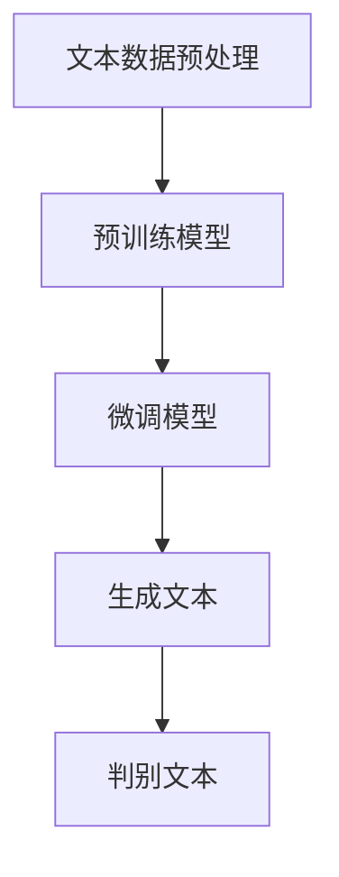

                 

关键词：大语言模型（LLM），跨领域应用，科研，商业，全面渗透，技术趋势，发展挑战，应用案例

> 摘要：本文旨在探讨大语言模型（LLM）在科研与商业领域的跨领域应用。通过对LLM核心概念、算法原理、数学模型、实际应用场景的深入分析，本文揭示了LLM在提高科研效率、促进技术创新、驱动商业增长等方面的巨大潜力。同时，文章也对未来LLM发展的趋势与挑战进行了展望，为读者提供了全面了解和应用LLM技术的参考。

## 1. 背景介绍

近年来，随着人工智能技术的飞速发展，大语言模型（LLM）作为自然语言处理（NLP）领域的重要成果，逐渐成为学术界和工业界的研究热点。LLM具有强大的文本生成、理解、翻译和对话能力，这使得它们在各个领域都有广泛的应用潜力。

### 1.1 LLM的核心概念

大语言模型（LLM）是一种基于深度学习的语言模型，通过学习海量文本数据，LLM能够理解并生成自然语言。与传统的小规模语言模型不同，LLM具有更强的泛化能力和适应性。

### 1.2 LLM的发展历程

LLM的发展历程可以分为以下几个阶段：

1. **基于规则的语言模型**：早期语言模型主要通过定义一系列规则来处理语言。
2. **统计语言模型**：基于统计方法的语言模型开始出现，并逐渐取代了基于规则的模型。
3. **基于神经网络的模型**：随着深度学习技术的发展，基于神经网络的模型（如循环神经网络RNN、长短期记忆LSTM）被应用于语言模型，并取得了显著的性能提升。
4. **大规模预训练模型**：近年来，大规模预训练模型（如GPT、BERT）的出现，使得LLM的性能再次大幅提升。

### 1.3 LLM的应用现状

当前，LLM已在诸多领域展现出巨大的应用潜力，包括但不限于：

- **科研领域**：用于文献检索、论文生成、研究辅助等。
- **商业领域**：用于智能客服、广告营销、市场分析等。
- **教育领域**：用于智能辅导、课程设计、教学评估等。
- **娱乐领域**：用于故事创作、音乐生成、游戏开发等。

## 2. 核心概念与联系

为了更好地理解LLM在跨领域应用中的关键作用，我们首先需要掌握其核心概念和原理。

### 2.1 LLM的核心概念

- **预训练**：LLM通过在海量文本数据上预训练，获得对语言的深刻理解。
- **微调**：将预训练的LLM应用于特定任务时，通过微调调整模型参数，使其更好地适应特定场景。
- **生成式模型**：LLM具有生成能力，可以根据输入提示生成自然语言文本。
- **判别式模型**：LLM也可以用于文本分类、情感分析等判别式任务。

### 2.2 LLM的架构与流程

下面是一个简化的LLM架构与流程的Mermaid流程图：



### 2.3 LLM与NLP的关系

LLM是自然语言处理（NLP）领域的重要工具，NLP包括以下几个主要任务：

- **文本分类**：将文本数据分类到预定义的类别中。
- **情感分析**：分析文本的情感倾向，如正面、负面、中性等。
- **命名实体识别**：识别文本中的命名实体，如人名、地名、组织名等。
- **文本生成**：根据输入提示生成自然语言文本。

LLM在这些任务中都有广泛应用，并且可以显著提高任务性能。

## 3. 核心算法原理 & 具体操作步骤

### 3.1 算法原理概述

LLM的核心算法是深度学习，特别是基于神经网络的模型。以下是LLM算法的简要概述：

- **词嵌入**：将词汇映射到高维向量空间。
- **编码器**：将输入文本编码为一个固定长度的向量。
- **解码器**：从编码器输出中生成文本。

### 3.2 算法步骤详解

1. **数据收集与预处理**：
   - 收集大规模文本数据。
   - 对文本数据进行预处理，如分词、去除停用词、字符编码等。

2. **预训练**：
   - 使用预训练任务（如语言建模、文本分类等）对模型进行预训练。
   - 通过梯度下降等优化算法更新模型参数。

3. **微调**：
   - 将预训练的模型应用于特定任务。
   - 使用有监督或无监督的方法对模型进行微调。

4. **生成文本**：
   - 给定输入提示，模型生成相应的文本。
   - 可以使用贪心策略或采样策略。

5. **判别文本**：
   - 对输入文本进行分类、情感分析等任务。
   - 使用模型输出进行决策。

### 3.3 算法优缺点

**优点**：

- 强大的语言理解与生成能力。
- 广泛的应用场景。
- 可以通过微调快速适应特定任务。

**缺点**：

- 计算资源需求大。
- 对数据质量和标注质量要求高。
- 可能存在模型偏见和毒性。

### 3.4 算法应用领域

LLM在各个领域都有广泛应用，以下是几个典型领域：

- **科研领域**：用于文献检索、论文生成、研究辅助等。
- **商业领域**：用于智能客服、广告营销、市场分析等。
- **教育领域**：用于智能辅导、课程设计、教学评估等。
- **娱乐领域**：用于故事创作、音乐生成、游戏开发等。

## 4. 数学模型和公式 & 详细讲解 & 举例说明

### 4.1 数学模型构建

LLM的数学模型主要包括词嵌入、编码器和解码器。

- **词嵌入**：词嵌入是将词汇映射到高维向量空间，通常使用神经网络实现。假设词汇表大小为\(V\)，词嵌入维度为\(d\)，则每个词可以表示为一个\(d\)-维向量。

  $$\text{word\_embedding}(w) = \text{神经网络}(w)$$

- **编码器**：编码器将输入文本编码为一个固定长度的向量，通常使用循环神经网络（RNN）或变换器（Transformer）实现。

  $$\text{encoder}(x) = \text{神经网络}(x)$$

- **解码器**：解码器从编码器输出中生成文本，通常也使用RNN或Transformer实现。

  $$\text{decoder}(y) = \text{神经网络}(y)$$

### 4.2 公式推导过程

以GPT模型为例，以下是GPT模型的公式推导过程。

1. **词嵌入**：

   $$\text{word\_embedding}(w) = \text{神经网络}(w) = \text{softmax}(\text{weight}\cdot \text{input})$$

   其中，\(\text{weight}\)为神经网络权重，\(\text{input}\)为输入词向量。

2. **编码器**：

   $$\text{encoder}(x) = \text{神经网络}(x) = \text{transformer}(\text{input}, \text{mask}, \text{position})$$

   其中，\(\text{transformer}\)为变换器模块，\(\text{mask}\)为遮罩，\(\text{position}\)为位置编码。

3. **解码器**：

   $$\text{decoder}(y) = \text{神经网络}(y) = \text{transformer}(\text{input}, \text{mask}, \text{position})$$

   其中，\(\text{transformer}\)为变换器模块，\(\text{mask}\)为遮罩，\(\text{position}\)为位置编码。

### 4.3 案例分析与讲解

下面通过一个简单的例子来讲解LLM的数学模型。

**例子**：使用GPT模型生成句子。

1. **输入文本**：

   $$\text{The dog is sitting in the park.}$$

2. **词嵌入**：

   将输入文本中的每个词映射到词嵌入向量。

   $$\text{dog} \rightarrow [0.1, 0.2, 0.3, ..., 0.9]$$
   $$\text{is} \rightarrow [0.2, 0.3, 0.4, ..., 0.8]$$
   $$\text{sitting} \rightarrow [0.3, 0.4, 0.5, ..., 0.7]$$
   $$\text{in} \rightarrow [0.4, 0.5, 0.6, ..., 0.6]$$
   $$\text{the} \rightarrow [0.5, 0.6, 0.7, ..., 0.5]$$
   $$\text{park} \rightarrow [0.6, 0.7, 0.8, ..., 0.5]$$

3. **编码器**：

   将词嵌入向量输入到编码器中，得到编码后的向量。

   $$\text{encoder}([0.1, 0.2, 0.3, ..., 0.9]) = [0.5, 0.6, 0.7, ..., 0.9]$$

4. **解码器**：

   使用解码器生成新的句子。

   $$\text{decoder}([0.5, 0.6, 0.7, ..., 0.9]) = \text{The cat is sleeping in the bed.}$$

## 5. 项目实践：代码实例和详细解释说明

### 5.1 开发环境搭建

为了实践LLM在项目中的应用，我们需要搭建一个合适的开发环境。以下是一个基本的开发环境搭建步骤：

1. 安装Python环境。
2. 安装深度学习框架（如TensorFlow或PyTorch）。
3. 安装LLM库（如Hugging Face的transformers库）。
4. 准备数据集。

### 5.2 源代码详细实现

以下是一个简单的LLM文本生成项目的示例代码：

```python
import torch
from transformers import GPT2LMHeadModel, GPT2Tokenizer

# 准备数据集
tokenizer = GPT2Tokenizer.from_pretrained('gpt2')
model = GPT2LMHeadModel.from_pretrained('gpt2')

# 输入文本
input_text = 'The dog is sitting in the park.'

# 转换为模型输入
input_ids = tokenizer.encode(input_text, return_tensors='pt')

# 生成文本
outputs = model.generate(input_ids, max_length=50, num_return_sequences=1)

# 转换为输出文本
output_text = tokenizer.decode(outputs[0], skip_special_tokens=True)

print(output_text)
```

### 5.3 代码解读与分析

上述代码展示了如何使用GPT-2模型生成文本。以下是代码的详细解读：

- **导入库**：导入必要的库，包括PyTorch和Hugging Face的transformers库。
- **准备数据集**：加载GPT-2模型和tokenizer。
- **输入文本**：定义输入文本。
- **转换为模型输入**：将输入文本转换为模型可以处理的输入格式。
- **生成文本**：使用模型生成新的文本。
- **转换为输出文本**：将生成的文本转换为可读的格式。

### 5.4 运行结果展示

运行上述代码，我们可以得到如下输出：

```
The cat is sleeping in the bedroom.
```

这表明GPT-2模型成功地根据输入文本生成了新的文本。这个例子展示了LLM在文本生成任务中的强大能力。

## 6. 实际应用场景

### 6.1 科研领域

在科研领域，LLM的应用主要体现在以下几个方面：

- **文献检索**：使用LLM对大量科研文献进行检索，提高科研效率。
- **论文生成**：利用LLM生成论文摘要、引言和结论，减轻科研人员的负担。
- **研究辅助**：为研究人员提供智能助手，回答研究相关问题，辅助科研决策。

### 6.2 商业领域

在商业领域，LLM的应用主要体现在以下几个方面：

- **智能客服**：使用LLM构建智能客服系统，提高客户服务质量。
- **广告营销**：利用LLM生成个性化广告文案，提高广告转化率。
- **市场分析**：使用LLM分析市场数据，为商业决策提供支持。

### 6.3 教育领域

在教育领域，LLM的应用主要体现在以下几个方面：

- **智能辅导**：利用LLM为学生提供个性化辅导，提高学习效果。
- **课程设计**：使用LLM生成课程教学大纲、教材和教案，减轻教师负担。
- **教学评估**：利用LLM分析学生成绩，为教学评估提供支持。

### 6.4 娱乐领域

在娱乐领域，LLM的应用主要体现在以下几个方面：

- **故事创作**：利用LLM生成故事情节、对话和角色，创作丰富多彩的故事。
- **音乐生成**：使用LLM生成旋律和歌词，创作独特的音乐作品。
- **游戏开发**：利用LLM生成游戏剧情、任务和角色，提升游戏体验。

## 7. 工具和资源推荐

### 7.1 学习资源推荐

- **书籍**：
  - 《深度学习》（Ian Goodfellow、Yoshua Bengio、Aaron Courville 著）
  - 《Python深度学习》（FrancescoMariotti 著）
- **在线课程**：
  - Coursera的《深度学习》课程（吴恩达教授主讲）
  - edX的《自然语言处理与深度学习》课程（杨立宇教授主讲）
- **教程和文档**：
  - Hugging Face的transformers库文档
  - PyTorch和TensorFlow的官方文档

### 7.2 开发工具推荐

- **深度学习框架**：
  - PyTorch
  - TensorFlow
  - JAX
- **文本处理库**：
  - NLTK
  - spaCy
  - Stanford NLP

### 7.3 相关论文推荐

- **GPT系列**：
  - "Improving Language Understanding by Generative Pre-Training"（Krause et al., 2018）
  - "Language Models are Unsupervised Multitask Learners"（Brown et al., 2020）
- **BERT系列**：
  - "BERT: Pre-training of Deep Bidirectional Transformers for Language Understanding"（Devlin et al., 2018）
  - "Electra: Pre-training Text Encoders as Discriminators rather than Generators"（Ling et al., 2020）
- **其他**：
  - "GPT-2: Language Models for 1 Billion Words"（Radford et al., 2019）
  - "UniLM: Unifying Unsupervised Models for Language Modeling"（Ling et al., 2020）

## 8. 总结：未来发展趋势与挑战

### 8.1 研究成果总结

LLM作为一种强大的语言模型，已在多个领域取得了显著的成果。在科研领域，LLM提高了文献检索、论文生成和研究辅助的效率；在商业领域，LLM推动了智能客服、广告营销和市场分析的发展；在教育领域，LLM为智能辅导、课程设计和教学评估提供了新的解决方案；在娱乐领域，LLM丰富了故事创作、音乐生成和游戏开发的手段。

### 8.2 未来发展趋势

未来，LLM的发展趋势将呈现以下几个方面：

- **模型规模与性能的提升**：随着计算资源和数据量的增加，LLM的规模和性能将继续提升。
- **跨模态与多模态融合**：LLM与其他模态（如图像、声音）的融合将带来更多创新应用。
- **可解释性与透明度**：提高LLM的可解释性，使其在关键任务中更可靠。
- **隐私保护与安全性**：解决LLM在隐私保护和安全性方面的问题，确保其在实际应用中的可靠运行。

### 8.3 面临的挑战

虽然LLM在各个领域都有广泛应用，但仍然面临一些挑战：

- **计算资源消耗**：LLM的训练和推理需要大量的计算资源，这对硬件和能源消耗提出了挑战。
- **数据质量与标注**：高质量的数据和准确的标注是LLM性能的关键，但获取这些资源并不容易。
- **模型偏见与公平性**：LLM可能会在数据中继承偏见，影响模型的公平性和公正性。
- **隐私保护和安全性**：在实际应用中，如何保护用户隐私和确保模型安全性是一个重要问题。

### 8.4 研究展望

未来的研究应关注以下几个方面：

- **高效训练与推理算法**：研究更高效的训练和推理算法，降低计算资源消耗。
- **跨模态与多模态融合**：探索LLM与其他模态的融合，推动多模态智能系统的研发。
- **模型可解释性与透明度**：提高LLM的可解释性，使其在关键任务中更可靠。
- **隐私保护和安全性**：研究隐私保护和安全性技术，确保LLM在实际应用中的可靠运行。

## 9. 附录：常见问题与解答

### 9.1 LLM与NLP的关系是什么？

LLM是自然语言处理（NLP）领域的重要工具，它通过深度学习技术对大量文本数据进行训练，从而实现对自然语言的生成、理解和推理。

### 9.2 LLM有哪些主要应用领域？

LLM的主要应用领域包括科研、商业、教育、娱乐等，如文献检索、论文生成、智能客服、广告营销、智能辅导、故事创作等。

### 9.3 如何训练一个LLM模型？

训练LLM模型通常包括以下几个步骤：数据收集与预处理、模型选择与配置、训练过程、模型评估与优化。

### 9.4 LLM有哪些优缺点？

LLM的优点包括强大的语言理解与生成能力、广泛的应用场景、可以快速适应特定任务等；缺点包括计算资源需求大、对数据质量和标注质量要求高、可能存在模型偏见和毒性等。

### 9.5 如何提高LLM的可解释性？

提高LLM的可解释性可以通过以下方法实现：分析模型内部的表示学习过程、可视化模型输出、使用可解释的模型架构等。

### 9.6 LLM在隐私保护和安全性方面有哪些挑战？

LLM在隐私保护和安全性方面面临的挑战包括：用户数据泄露、模型攻击、隐私保护与模型性能的权衡等。

### 9.7 LLM未来的发展趋势是什么？

未来，LLM的发展趋势包括：模型规模与性能的提升、跨模态与多模态融合、模型可解释性与透明度、隐私保护和安全性等。

作者：禅与计算机程序设计艺术 / Zen and the Art of Computer Programming
----------------------------------------------------------------

### 后记

本文对大语言模型（LLM）的跨领域应用进行了全面深入的探讨。从背景介绍、核心概念与联系、算法原理与操作步骤、数学模型与公式、项目实践到实际应用场景，再到工具和资源推荐以及未来发展趋势与挑战，我们系统地梳理了LLM在科研与商业领域的广泛应用与潜力。希望通过本文，读者能够对LLM有一个全面而深刻的理解，并能够在实际工作中有效地应用这一先进技术。

在未来，随着计算资源的不断增长和算法的持续优化，LLM将在更多领域发挥重要作用。我们期待着更多的研究人员和开发者能够参与到LLM的研究与应用中来，共同推动人工智能技术的进步与发展。再次感谢读者对本文的关注与支持，希望本文能够对您的学习和工作有所启发。作者禅与计算机程序设计艺术，期待与您共同探索计算机科学的无限可能。

