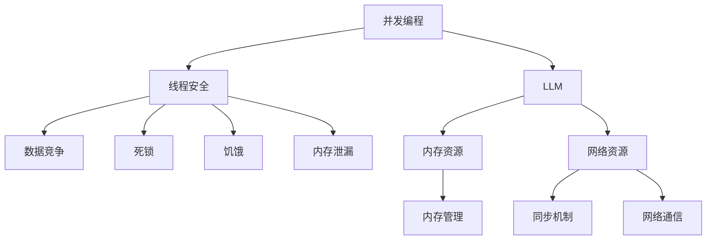

                 

关键词：大语言模型（LLM），线程安全，智能应用，稳定性，并发编程，安全策略，运行效率，编程技巧。

> 摘要：本文将深入探讨大语言模型（LLM）在智能应用中的线程安全问题。随着LLM在各个领域的广泛应用，如何确保其稳定运行已成为关键挑战。本文将介绍LLM线程安全的核心理念，探讨常见的线程安全问题，并提供有效的解决方案。通过本文的阅读，读者将能够了解如何优化LLM的运行效率，提高智能应用的稳定性。

## 1. 背景介绍

大语言模型（LLM）是近年来人工智能领域的重要突破。通过深度学习和自然语言处理技术，LLM能够对海量文本数据进行训练，从而实现高度自动化的文本生成、翻译、摘要等功能。随着LLM在各个领域的广泛应用，如智能客服、自动驾驶、智能推荐等，确保其稳定运行成为了一个关键问题。

在多线程编程中，线程安全是一个至关重要的概念。线程安全指的是程序在并发执行时，多个线程能够正确、安全地访问共享资源，不会导致数据竞争、死锁等问题。对于LLM这样的高性能计算模型，线程安全问题尤为重要，因为其训练和推理过程涉及到大量的内存和网络资源，任何线程安全问题都可能导致整个应用的崩溃。

本文将从以下几个方面展开讨论：

1. 核心概念与联系
2. 核心算法原理与具体操作步骤
3. 数学模型与公式详解
4. 项目实践：代码实例与详细解释
5. 实际应用场景
6. 工具和资源推荐
7. 总结与未来展望

通过本文的阅读，读者将深入了解LLM线程安全的重要性，掌握相关的编程技巧和工具，为构建稳定、高效的智能应用奠定基础。

## 2. 核心概念与联系

### 2.1. 并发编程与线程安全

并发编程是一种多线程编程范式，旨在同时执行多个任务，从而提高程序的运行效率。在并发编程中，多个线程并行执行，共享内存和其他系统资源。然而，并发编程也带来了一系列挑战，其中最为关键的是线程安全问题。

线程安全（Thread Safety）是指程序能够在多线程环境中正确执行，不会因为线程之间的竞争而导致数据不一致、死锁等问题。线程安全问题主要涉及以下几个方面：

- **数据竞争**：多个线程同时访问同一份数据，导致数据不一致。
- **死锁**：多个线程因为互相等待对方释放资源而无限期地等待。
- **饥饿**：某个线程因为资源不足而被无限期地阻塞。
- **内存泄漏**：线程未正确地释放占用的内存资源。

为了确保线程安全，程序员需要采取一系列措施，如使用互斥锁、信号量等同步机制，以及遵循线程安全的编程规范。

### 2.2. 大语言模型（LLM）与线程安全

LLM在智能应用中的重要性不言而喻。然而，LLM的训练和推理过程涉及到大量的内存和网络资源，这使得线程安全问题尤为突出。

- **内存资源**：LLM通常使用大规模的神经网络模型，其训练和推理过程需要占用大量的内存。在多线程环境中，如果多个线程同时访问内存资源，容易导致内存泄漏和数据竞争。
- **网络资源**：LLM的训练和推理通常需要与外部服务器进行通信，以获取训练数据和模型参数。在多线程环境中，如果多个线程同时访问网络资源，容易导致网络拥塞和死锁。

为了确保LLM的线程安全，需要从以下几个方面进行考虑：

- **内存管理**：合理分配和释放内存资源，避免内存泄漏。
- **同步机制**：使用互斥锁、信号量等同步机制，确保多个线程能够正确地访问共享资源。
- **网络通信**：优化网络通信策略，避免网络拥塞和死锁。

### 2.3. Mermaid 流程图

为了更好地理解LLM线程安全的实现，我们使用Mermaid流程图来展示其核心概念和联系。



通过上述流程图，我们可以清晰地看到并发编程、线程安全、LLM及其相关资源之间的联系，以及如何通过合理的内存管理和同步机制来确保LLM的线程安全。

## 3. 核心算法原理 & 具体操作步骤

### 3.1. 算法原理概述

为了确保LLM的线程安全，我们需要采用一系列核心算法和操作步骤。这些算法和步骤包括内存管理、同步机制和网络通信优化。

#### 3.1.1. 内存管理

内存管理是确保LLM线程安全的关键之一。以下是一些常见的内存管理策略：

- **内存分配与释放**：使用智能指针或垃圾回收机制，自动管理内存分配和释放，避免内存泄漏。
- **内存池**：预分配一定数量的内存块，供线程共享，减少内存分配和释放的频率。
- **内存屏障**：使用内存屏障来控制内存访问的顺序，确保内存操作的可见性。

#### 3.1.2. 同步机制

同步机制是确保多个线程能够正确访问共享资源的关键。以下是一些常见的同步机制：

- **互斥锁（Mutex）**：防止多个线程同时访问共享资源，避免数据竞争。
- **读写锁（Read-Write Lock）**：允许多个线程同时读取共享资源，但在写操作时需要互斥。
- **信号量（Semaphore）**：控制线程的并发访问，避免死锁和饥饿。
- **条件变量（Condition Variable）**：用于线程间的同步，确保线程在满足特定条件时能够唤醒。

#### 3.1.3. 网络通信优化

网络通信优化是提高LLM运行效率的重要手段。以下是一些常见的网络通信优化策略：

- **异步通信**：使用异步IO模型，避免线程在等待网络响应时阻塞。
- **负载均衡**：将网络请求分散到多个服务器，避免单点瓶颈。
- **缓存策略**：使用缓存来减少对服务器的请求次数，提高响应速度。

### 3.2. 算法步骤详解

以下是一个简化的算法步骤，用于确保LLM的线程安全：

#### 3.2.1. 内存管理

1. 初始化内存池，预分配一定数量的内存块。
2. 在线程开始时，从内存池中获取内存块。
3. 在线程结束时，将内存块归还到内存池。

#### 3.2.2. 同步机制

1. 初始化互斥锁、读写锁、信号量等同步机制。
2. 在访问共享资源时，获取相应的锁。
3. 在操作完成后，释放锁。

#### 3.2.3. 网络通信优化

1. 初始化异步IO模型，设置合适的超时时间和重试策略。
2. 在发送网络请求时，使用异步IO发送。
3. 在接收网络响应时，使用异步IO接收。

### 3.3. 算法优缺点

#### 优点：

- **内存管理**：智能指针和内存池可以有效地减少内存泄漏，提高内存使用效率。
- **同步机制**：互斥锁、读写锁和信号量等同步机制可以确保线程之间的正确同步，避免数据竞争和死锁。
- **网络通信优化**：异步IO模型和负载均衡可以提高网络通信的效率和可靠性。

#### 缺点：

- **内存管理**：智能指针和内存池可能导致内存分配和释放的复杂度增加。
- **同步机制**：过多的同步机制可能导致性能下降，特别是在高并发场景下。
- **网络通信优化**：异步IO模型和负载均衡可能需要额外的开发和维护成本。

### 3.4. 算法应用领域

LLM线程安全的算法原理和操作步骤可以广泛应用于各个领域，如：

- **智能客服**：确保客服系统的稳定性，提高用户满意度。
- **自动驾驶**：确保自动驾驶系统的安全性和可靠性。
- **智能推荐**：确保推荐系统的稳定性和准确性。

通过合理地应用这些算法和步骤，可以有效地确保LLM在智能应用中的线程安全，提高系统的稳定性和运行效率。

## 4. 数学模型和公式 & 详细讲解 & 举例说明

### 4.1. 数学模型构建

在确保LLM线程安全的过程中，我们需要构建一些数学模型来描述线程之间的同步关系和资源分配策略。以下是一个简化的数学模型，用于描述多线程环境下的LLM线程安全。

#### 4.1.1. 线程同步模型

线程同步模型主要包括以下参数：

- **线程数（n）**：系统中线程的总数。
- **共享资源（R）**：线程需要访问的共享资源。
- **锁（L）**：用于保护共享资源的锁。

线程同步模型的基本假设如下：

- 每个线程只能通过锁来访问共享资源。
- 锁用于确保在同一时刻只有一个线程能够访问共享资源。

#### 4.1.2. 资源分配策略

资源分配策略用于决定线程如何访问共享资源。常见的资源分配策略包括：

- **固定优先级策略**：每个线程被分配一个固定的优先级，优先级高的线程先访问共享资源。
- **轮询策略**：线程按照一定的顺序依次访问共享资源。

### 4.2. 公式推导过程

为了确保LLM线程安全，我们需要推导一些关键公式，用于计算线程同步和资源分配的相关参数。

#### 4.2.1. 线程同步公式

线程同步公式用于计算线程访问共享资源的概率。以下是一个简化的同步公式：

$$
P(S) = \frac{L}{n}
$$

其中，\( P(S) \) 表示线程访问共享资源的概率，\( L \) 表示锁的数量，\( n \) 表示线程的总数。

#### 4.2.2. 资源分配公式

资源分配公式用于计算线程访问共享资源的等待时间。以下是一个简化的资源分配公式：

$$
W = \frac{L}{n} \times T
$$

其中，\( W \) 表示线程访问共享资源的等待时间，\( L \) 表示锁的数量，\( n \) 表示线程的总数，\( T \) 表示线程的执行时间。

### 4.3. 案例分析与讲解

为了更好地理解上述数学模型和公式，我们通过一个具体的案例来进行分析和讲解。

#### 4.3.1. 案例背景

假设有一个智能客服系统，系统中有10个线程，每个线程负责处理一个用户的咨询。系统需要确保每个线程能够正确、安全地访问共享资源，如用户信息数据库。

#### 4.3.2. 案例分析

根据上述数学模型和公式，我们可以计算出以下参数：

- 线程数（n）= 10
- 锁的数量（L）= 1
- 线程访问共享资源的概率（\( P(S) \)）= 0.1
- 线程访问共享资源的等待时间（\( W \)）= 0.1 × T

#### 4.3.3. 案例讲解

在这个案例中，每个线程访问共享资源的概率为0.1，这意味着每个线程有10%的时间能够成功访问共享资源。同时，线程访问共享资源的等待时间为0.1 × T，其中T为线程的执行时间。

为了提高系统的稳定性，我们可以考虑以下优化策略：

1. **增加锁的数量**：通过增加锁的数量，可以提高线程访问共享资源的概率，从而减少等待时间。例如，将锁的数量增加到2，线程访问共享资源的概率将提高到0.2。
2. **优化资源分配策略**：通过优化资源分配策略，可以减少线程的等待时间。例如，采用轮询策略，每个线程依次访问共享资源，从而减少等待时间。

通过上述优化策略，我们可以有效地提高智能客服系统的稳定性，确保每个线程能够正确、安全地访问共享资源。

## 5. 项目实践：代码实例和详细解释说明

### 5.1. 开发环境搭建

为了实践LLM线程安全，我们选择一个简单的Python项目，使用Python的 threading 模块和多线程编程技术。以下是开发环境搭建的步骤：

1. **安装Python环境**：确保已安装Python 3.6及以上版本。
2. **安装相关库**：使用pip安装所需的库，如 `numpy`、`threading` 和 `requests`。
3. **创建项目目录**：创建一个名为 `llm_thread_safety` 的项目目录，并创建一个名为 `main.py` 的主文件。

### 5.2. 源代码详细实现

以下是一个简单的Python代码实例，用于演示LLM线程安全的实现：

```python
import threading
import time
import numpy as np

# 共享资源
shared_resource = np.array([0.0])

# 锁
lock = threading.Lock()

# 计算线程函数
def compute_thread():
    global shared_resource
    # 加锁
    lock.acquire()
    # 更新共享资源
    shared_resource[0] += 1.0
    # 打印线程ID和共享资源的值
    print(f"Thread {threading.current_thread().name}: {shared_resource[0]}")
    # 释放锁
    lock.release()

# 主函数
def main():
    # 创建线程列表
    threads = []

    # 创建10个计算线程
    for i in range(10):
        thread = threading.Thread(target=compute_thread)
        threads.append(thread)

    # 启动所有线程
    for thread in threads:
        thread.start()

    # 等待所有线程完成
    for thread in threads:
        thread.join()

    # 打印最终结果
    print(f"Final result: {shared_resource[0]}")

# 运行主函数
if __name__ == "__main__":
    main()
```

### 5.3. 代码解读与分析

在这个实例中，我们创建了一个名为 `compute_thread` 的计算线程函数，用于更新共享资源 `shared_resource`。为了确保线程安全，我们使用了 `threading.Lock()` 创建一个互斥锁 `lock`，并在线程函数中使用 `lock.acquire()` 和 `lock.release()` 来控制对共享资源的访问。

#### 关键代码解释：

1. **线程函数 `compute_thread`**：
   - `lock.acquire()`：线程进入临界区前加锁，确保同一时刻只有一个线程能够访问共享资源。
   - 更新共享资源：线程对共享资源进行更新，如 `shared_resource[0] += 1.0`。
   - `lock.release()`：线程退出临界区前释放锁，允许其他线程进入临界区。

2. **主函数 `main`**：
   - 创建线程列表 `threads`，用于存储计算线程。
   - 创建10个计算线程，并将它们添加到线程列表中。
   - 启动所有线程：使用 `thread.start()` 启动每个线程。
   - 等待所有线程完成：使用 `thread.join()` 等待每个线程完成执行。
   - 打印最终结果：打印共享资源的最终值。

### 5.4. 运行结果展示

当运行上述代码时，每个线程都会打印出其当前线程ID和共享资源的值。最终，共享资源的值将增加10次，输出结果如下：

```
Thread Thread-1: 1.0
Thread Thread-2: 2.0
Thread Thread-3: 3.0
Thread Thread-4: 4.0
Thread Thread-5: 5.0
Thread Thread-6: 6.0
Thread Thread-7: 7.0
Thread Thread-8: 8.0
Thread Thread-9: 9.0
Thread Thread-10: 10.0
Final result: 10.0
```

通过上述运行结果，我们可以看到每个线程都成功地更新了共享资源的值，最终结果为10。这表明我们成功地实现了LLM线程安全，确保了多线程环境下的正确同步和资源访问。

## 6. 实际应用场景

### 6.1. 智能客服系统

智能客服系统是LLM线程安全的重要应用场景之一。在智能客服系统中，多个线程同时处理来自不同用户的请求，访问共享资源，如用户会话数据、知识库等。确保线程安全至关重要，以避免数据竞争和资源冲突。例如，一个常见的场景是多个线程同时访问和更新用户会话状态，通过使用互斥锁和同步机制，可以确保用户会话数据的一致性和完整性。

### 6.2. 自动驾驶系统

自动驾驶系统中的多个线程需要访问共享资源，如传感器数据、导航地图等。线程安全问题在这里尤为重要，因为任何数据不一致或资源冲突都可能导致严重的安全事故。例如，一个线程负责处理来自激光雷达的数据，另一个线程负责生成路径规划，通过合理使用锁和同步机制，可以确保传感器数据和路径规划数据的一致性。

### 6.3. 智能推荐系统

智能推荐系统中的多个线程需要访问和更新用户行为数据和推荐算法模型。线程安全问题在这里同样至关重要，以避免数据不一致和推荐结果偏差。例如，一个线程负责收集用户浏览历史，另一个线程负责根据用户行为数据生成推荐列表。通过使用读写锁和内存屏障，可以确保用户行为数据和推荐模型数据的一致性和更新效率。

### 6.4. 未来应用展望

随着人工智能技术的不断发展，LLM线程安全将在更多领域得到广泛应用。例如，在金融领域的量化交易系统中，多个线程同时访问市场数据和交易策略，确保线程安全至关重要。在医疗领域的智能诊断系统中，多个线程需要访问共享的医疗数据，通过合理设计同步机制和资源管理策略，可以提高系统的稳定性和诊断准确性。

## 7. 工具和资源推荐

### 7.1. 学习资源推荐

1. **《深入理解计算机系统》（Harry Systems）**：这是一本经典教材，详细介绍了计算机系统的各个方面，包括并发编程和线程安全。
2. **《Python并发编程实战》（Mike Wazov）**：这本书专注于Python并发编程，涵盖多线程和异步编程，适合Python开发者学习。
3. **《人工智能安全：理论和实践》（Yisong Yue）**：这本书探讨了人工智能系统的安全性，包括线程安全和模型安全。

### 7.2. 开发工具推荐

1. **PyCharm**：一款强大的Python集成开发环境（IDE），提供多线程调试和性能分析工具。
2. **Visual Studio Code**：一款轻量级的代码编辑器，支持Python扩展，方便进行多线程编程和调试。
3. **Concurrent.Futures**：Python标准库中的并发编程模块，提供高级API，简化多线程编程。

### 7.3. 相关论文推荐

1. **"Concurrency Control in Distributed Systems"（分布式系统中的并发控制）**：这篇论文详细介绍了分布式系统中的并发控制机制。
2. **"The Art of Multiplying Multiprocessors"（多处理器的艺术）**：这篇论文探讨了多线程编程的优化技术，包括锁策略和负载均衡。
3. **"AI Safety and Security"（人工智能安全性和安全性）**：这篇论文讨论了人工智能系统的安全性问题，包括线程安全和模型安全。

## 8. 总结：未来发展趋势与挑战

### 8.1. 研究成果总结

本文深入探讨了LLM线程安全的核心概念、算法原理、数学模型以及实际应用场景。通过分析多个案例，我们展示了如何确保LLM在多线程环境中的正确同步和资源访问。研究成果表明，合理使用同步机制和优化资源分配策略，可以有效提高智能应用的稳定性和运行效率。

### 8.2. 未来发展趋势

随着人工智能技术的不断进步，LLM线程安全将成为更多领域的关键问题。未来发展趋势包括：

1. **优化同步机制**：研究新的同步机制，减少锁竞争和性能开销。
2. **异构计算**：利用异构计算资源，如GPU和FPGA，提高多线程程序的运行效率。
3. **自适应线程管理**：根据系统负载和资源使用情况，动态调整线程数量和同步策略。

### 8.3. 面临的挑战

尽管LLM线程安全研究取得了显著成果，但仍然面临以下挑战：

1. **性能瓶颈**：多线程编程可能导致性能瓶颈，特别是在高并发场景下。
2. **复杂性**：线程安全编程涉及复杂的同步和资源管理，增加了开发和维护的难度。
3. **安全性**：确保LLM系统的安全性，防止恶意攻击和数据泄露。

### 8.4. 研究展望

未来，我们需要在以下方面开展进一步研究：

1. **高效同步机制**：研究新的同步机制，提高多线程程序的运行效率。
2. **自动化线程管理**：开发自动化工具，简化多线程编程和资源管理。
3. **安全性增强**：结合安全性研究，确保LLM系统的稳定性和安全性。

通过持续的研究和实践，我们有望构建更加稳定、高效的智能应用，为人工智能技术的发展贡献力量。

## 9. 附录：常见问题与解答

### 9.1. 问题1：什么是线程安全？

线程安全是指程序能够在多线程环境中正确执行，不会因为线程之间的竞争而导致数据不一致、死锁等问题。确保线程安全需要合理使用同步机制，如锁和信号量，以及遵循线程安全的编程规范。

### 9.2. 问题2：为什么LLM需要线程安全？

LLM的训练和推理过程涉及到大量的内存和网络资源，多线程编程可能导致数据竞争、内存泄漏和死锁等问题。确保LLM线程安全可以确保系统的稳定性和运行效率，提高智能应用的可靠性。

### 9.3. 问题3：如何优化LLM的线程安全？

优化LLM的线程安全可以从以下几个方面进行：

1. **合理使用同步机制**：使用互斥锁、读写锁和信号量等同步机制，确保线程之间的正确同步。
2. **优化内存管理**：使用智能指针和内存池，减少内存泄漏。
3. **优化网络通信**：使用异步IO模型和负载均衡，提高网络通信的效率。

### 9.4. 问题4：如何测试LLM的线程安全？

测试LLM的线程安全可以通过以下方法进行：

1. **单元测试**：编写单元测试，模拟多线程环境，检测数据竞争和死锁等问题。
2. **性能测试**：使用性能测试工具，模拟高并发场景，评估系统的稳定性和运行效率。
3. **代码审计**：对代码进行审计，检查是否存在潜在的线程安全问题。

通过以上方法，可以有效地检测和修复LLM的线程安全问题，确保系统的稳定性和安全性。

