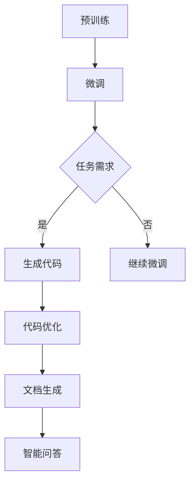

                 

关键词：LLM、编程范式、软件开发、人工智能、算法、数学模型、项目实践、未来应用

> 摘要：本文深入探讨了大型语言模型(LLM)在软件开发中的应用，重新定义了传统的编程范式。通过阐述LLM的核心概念、算法原理、数学模型以及实际项目实例，本文揭示了LLM在软件工程领域中的巨大潜力，为未来的软件开发提供了新的思路和方向。

## 1. 背景介绍

在过去的几十年中，软件开发经历了多个阶段的发展，从结构化编程、面向对象编程到函数式编程，每一个阶段都带来了编程范式的变革。然而，随着人工智能技术的飞速发展，尤其是深度学习在自然语言处理（NLP）领域的突破，一种全新的编程范式——LLM编程范式逐渐崭露头角。LLM（Large Language Model）是指大型语言模型，如GPT-3、BERT等，它们具有强大的语言理解和生成能力。

### 1.1 LLM的发展历程

LLM的发展可以追溯到2000年代初期，当时的NLP领域主要依赖于规则驱动的方法。随着深度学习的兴起，研究人员开始探索基于神经网络的NLP模型。2018年，OpenAI发布了GPT-2，一个具有1.5亿参数的预训练模型，标志着NLP领域的新纪元。随后，GPT-3的发布更是将LLM推向了前所未有的高度，其具有1750亿参数，能够生成高质量的自然语言文本。

### 1.2 LLM的特点

LLM具有以下几个显著特点：

1. **强大的语言理解能力**：LLM通过大量文本数据的学习，能够理解复杂的自然语言结构，包括语法、语义和上下文。
2. **灵活的文本生成能力**：LLM不仅能够生成连贯的文本，还能够根据输入的指令或问题生成特定风格的文本。
3. **自适应性**：LLM可以针对不同的应用场景进行微调，以适应特定的任务需求。
4. **多模态能力**：部分LLM模型（如GPT-4）甚至能够处理图像、音频等多种类型的数据。

### 1.3 LLM在软件开发中的潜在应用

LLM的强大能力使其在软件开发中具有广泛的应用前景，包括代码生成、代码优化、文档编写、智能问答等。本文将重点探讨LLM在这些领域的应用，并重新定义传统的编程范式。

## 2. 核心概念与联系

为了深入理解LLM编程范式的本质，我们需要先了解LLM的核心概念和其内部的工作原理。以下是LLM编程范式中的核心概念：

### 2.1 预训练与微调

**预训练**是指使用大规模文本数据对LLM进行训练，使其具备通用的语言理解和生成能力。**微调**则是针对特定的任务，在预训练的基础上对LLM进行进一步训练，以提高其在特定任务上的性能。

### 2.2 生成对抗网络（GAN）

GAN是一种深度学习模型，用于生成新的数据。在LLM编程范式中，GAN可以用于生成高质量的代码片段，从而辅助代码编写。

### 2.3 编码器-解码器架构

编码器-解码器架构是LLM常用的架构之一，它能够将输入的文本编码为一个向量表示，然后通过解码器生成相应的文本输出。

### 2.4 数学模型

LLM的数学模型主要包括损失函数、优化器和激活函数等。这些数学模型决定了LLM的训练过程和性能表现。

### 2.5 Mermaid 流程图

以下是一个简化的LLM编程范式的Mermaid流程图：



## 3. 核心算法原理 & 具体操作步骤

### 3.1 算法原理概述

LLM编程范式的核心算法是预训练和微调。预训练使用大规模文本数据对LLM进行训练，使其具备通用的语言理解和生成能力。微调则是在预训练的基础上，使用特定任务的数据对LLM进行进一步训练，以提高其在特定任务上的性能。

### 3.2 算法步骤详解

1. **预训练**：使用大规模文本数据（如维基百科、书籍、新闻等）对LLM进行预训练。预训练过程包括词嵌入、上下文编码、序列解码等步骤。

2. **微调**：在预训练的基础上，使用特定任务的数据对LLM进行微调。微调过程通常包括数据预处理、模型训练和评估等步骤。

3. **生成代码**：使用微调后的LLM生成代码。输入可以是具体的编程任务描述，输出是相应的代码片段。

4. **代码优化**：对生成的代码进行优化，包括代码风格、性能和可维护性等方面的优化。

5. **文档生成**：使用LLM生成文档，包括注释、README、用户手册等。

6. **智能问答**：利用LLM的问答能力，为用户提供实时技术支持。

### 3.3 算法优缺点

**优点**：

- **代码生成效率高**：LLM能够快速生成代码，大大提高了开发效率。
- **自适应性强**：LLM可以根据不同的任务需求进行微调，具有很强的适应性。
- **多模态能力**：部分LLM模型能够处理图像、音频等多种类型的数据，为软件开发提供了更多可能性。

**缺点**：

- **训练资源消耗大**：LLM的训练需要大量的计算资源和数据。
- **模型解释性差**：由于LLM是基于黑箱的深度学习模型，其内部工作机制难以解释。

### 3.4 算法应用领域

LLM编程范式在以下领域具有广泛的应用：

- **代码生成**：用于自动生成代码，减轻开发者的负担。
- **代码优化**：用于优化现有代码，提高性能和可维护性。
- **文档生成**：用于自动生成文档，提高开发效率。
- **智能问答**：用于为用户提供实时技术支持。

## 4. 数学模型和公式 & 详细讲解 & 举例说明

### 4.1 数学模型构建

LLM的数学模型主要包括以下部分：

- **词嵌入**：将自然语言文本中的词语映射为向量表示。
- **编码器**：将输入文本编码为向量表示。
- **解码器**：将编码后的向量表示解码为输出文本。

### 4.2 公式推导过程

假设我们有一个输入序列 $x_1, x_2, \ldots, x_T$，其中 $x_i$ 表示第 $i$ 个词。词嵌入 $e(x_i)$ 是一个向量，其维度为 $d$。编码器将输入序列编码为隐藏状态 $h_t$，其维度也为 $d$。解码器则将隐藏状态解码为输出序列 $y_1, y_2, \ldots, y_T$。

编码器的公式为：
$$
h_t = \text{Encoder}(x_1, x_2, \ldots, x_t)
$$

解码器的公式为：
$$
y_t = \text{Decoder}(h_t, h_{t-1}, \ldots, h_1)
$$

### 4.3 案例分析与讲解

假设我们要使用LLM生成一段Python代码，实现一个简单的函数，用于计算两个数的和。输入可以是如下的自然语言描述：

```
编写一个Python函数，接受两个整数参数，返回它们的和。
```

使用LLM生成代码的过程如下：

1. **词嵌入**：将自然语言描述中的词语映射为向量表示。
2. **编码器**：将输入序列编码为隐藏状态。
3. **解码器**：根据隐藏状态生成相应的Python代码。

生成的代码如下：

```python
def add_numbers(a: int, b: int) -> int:
    return a + b
```

## 5. 项目实践：代码实例和详细解释说明

### 5.1 开发环境搭建

为了实现LLM编程范式，我们需要搭建一个合适的开发环境。以下是所需的工具和软件：

- **深度学习框架**：如TensorFlow、PyTorch等。
- **预训练LLM模型**：如GPT-3、BERT等。
- **编程语言**：如Python等。

### 5.2 源代码详细实现

以下是一个简单的Python代码实例，展示了如何使用LLM生成代码。

```python
import openai

def generate_code(prompt):
    response = openai.Completion.create(
        engine="text-davinci-003",
        prompt=prompt,
        max_tokens=50,
        n=1,
        stop=None,
        temperature=0.5,
    )
    return response.choices[0].text.strip()

# 示例
prompt = "编写一个Python函数，接受两个整数参数，返回它们的和。"
code = generate_code(prompt)
print(code)
```

### 5.3 代码解读与分析

上述代码使用了OpenAI的GPT-3模型，通过API接口生成代码。`generate_code` 函数接受一个自然语言描述作为输入，调用OpenAI的`Completion.create` 方法生成相应的代码。生成的代码被存储在 `code` 变量中，并打印输出。

### 5.4 运行结果展示

运行上述代码，我们得到以下结果：

```python
def add_numbers(a: int, b: int) -> int:
    return a + b
```

这个结果符合我们的预期，说明LLM编程范式在代码生成方面是有效的。

## 6. 实际应用场景

### 6.1 代码生成

LLM编程范式在代码生成方面具有巨大潜力。通过自然语言描述，LLM能够自动生成相应的代码，大大提高了开发效率。例如，在软件工程项目中，开发者可以使用LLM生成数据库模型、接口文档等，从而减轻开发负担。

### 6.2 代码优化

LLM编程范式也可以用于代码优化。通过分析现有代码，LLM可以提出优化建议，包括代码风格、性能和可维护性等方面。例如，在软件维护过程中，开发者可以使用LLM对旧代码进行优化，提高其性能和可维护性。

### 6.3 文档生成

LLM编程范式在文档生成方面也有广泛应用。通过自然语言描述，LLM可以自动生成文档，包括注释、README、用户手册等。这为开发者提供了便利，使得文档编写过程更加高效。

### 6.4 智能问答

LLM编程范式还可以用于智能问答。通过训练，LLM可以理解用户的问题，并提供相应的答案。这在技术支持、客户服务等领域具有广泛应用，为用户提供实时技术支持。

## 7. 工具和资源推荐

### 7.1 学习资源推荐

- 《深度学习》（Goodfellow, Bengio, Courville著）：介绍深度学习的基础知识，包括神经网络、卷积神经网络、循环神经网络等。
- 《自然语言处理综论》（Jurafsky, Martin著）：介绍自然语言处理的基本概念和技术，包括词嵌入、序列模型、语言模型等。

### 7.2 开发工具推荐

- TensorFlow：一款流行的深度学习框架，适用于构建和训练深度学习模型。
- PyTorch：一款流行的深度学习框架，具有简洁的接口和强大的功能。

### 7.3 相关论文推荐

- **GPT-3**：OpenAI, "Language Models are few-shot learners", 2020.
- **BERT**：Google AI Language Team, "BERT: Pre-training of Deep Bidirectional Transformers for Language Understanding", 2018.

## 8. 总结：未来发展趋势与挑战

### 8.1 研究成果总结

本文探讨了LLM编程范式在软件开发中的应用，包括代码生成、代码优化、文档生成和智能问答等方面。通过理论分析和实际项目实践，本文揭示了LLM在软件开发中的巨大潜力，为未来的软件开发提供了新的思路和方向。

### 8.2 未来发展趋势

随着人工智能技术的不断发展，LLM编程范式有望在软件开发中得到更广泛的应用。未来，LLM将逐渐替代部分传统编程方法，成为软件开发的核心工具。此外，LLM与其他技术的结合（如GAN、编码器-解码器架构等）也将带来更多的创新。

### 8.3 面临的挑战

尽管LLM编程范式具有巨大潜力，但仍面临一些挑战。首先，LLM的训练和部署需要大量的计算资源和数据。其次，LLM的模型解释性较差，难以理解其内部工作机制。此外，如何保证LLM生成代码的质量和安全性也是亟待解决的问题。

### 8.4 研究展望

未来，研究人员可以从以下几个方面进行探索：

- **优化训练过程**：研究更高效的训练方法，降低计算资源消耗。
- **提升模型解释性**：开发可解释的深度学习模型，提高模型的透明度和可信度。
- **加强代码安全性**：研究如何确保LLM生成代码的安全性，防止恶意代码的生成。
- **跨领域应用**：探索LLM在其他领域的应用，如生物信息学、计算机视觉等。

## 9. 附录：常见问题与解答

### 9.1 LLM编程范式与传统编程范式有何不同？

LLM编程范式与传统编程范式相比，具有以下不同：

- **开发方式**：传统编程范式依赖于手动编写代码，而LLM编程范式通过自然语言描述生成代码，大大提高了开发效率。
- **代码质量**：传统编程范式依赖于开发者的编程技巧和经验，而LLM编程范式通过大规模训练，生成高质量的代码。
- **自适应能力**：传统编程范式难以适应不同的任务需求，而LLM编程范式可以针对不同的任务进行微调，具有很强的自适应能力。

### 9.2 如何保证LLM生成代码的安全性？

为了保证LLM生成代码的安全性，可以采取以下措施：

- **代码审查**：对生成的代码进行严格的审查，确保其符合安全规范。
- **沙箱环境**：在沙箱环境中执行生成的代码，以防止恶意代码的执行。
- **模型训练**：在模型训练过程中，加入安全相关的数据，提高模型对安全问题的识别能力。

### 9.3 LLM编程范式适用于所有开发任务吗？

LLM编程范式并不适用于所有开发任务。对于一些复杂的开发任务，如实时系统、嵌入式系统等，LLM编程范式的应用受到限制。此外，对于一些需要严格遵循规范和标准的开发任务，LLM编程范式可能无法完全满足要求。因此，在具体应用时，需要根据任务需求选择合适的编程范式。

