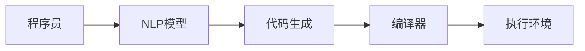
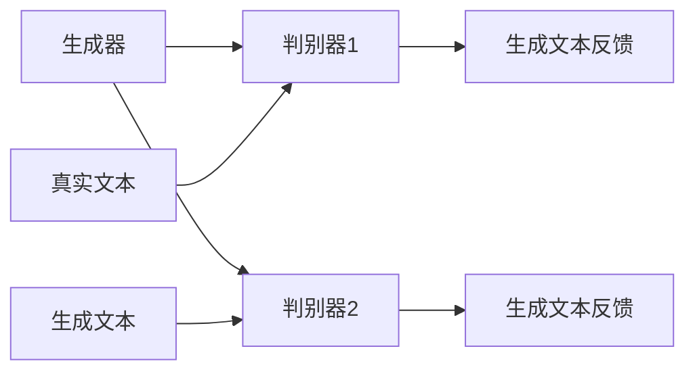

                 

关键词：大型语言模型（LLM）、编程、自然语言处理（NLP）、AI时代、代码生成、智能编程助手、人工智能应用

## 摘要

本文旨在探讨在人工智能（AI）时代，大型语言模型（LLM）如何成为新型编程语言的核心。我们将深入探讨LLM编程的基本概念、原理、应用场景，并通过实例展示其强大潜力。文章还将分析LLM编程的数学模型、算法原理，并讨论其在实际项目中的应用。最后，我们将展望LLM编程的未来发展趋势与面临的挑战。

## 1. 背景介绍

### 1.1 AI时代的崛起

随着互联网的普及和大数据技术的发展，人工智能（AI）正在迅速改变我们的生活和工作方式。从自动驾驶汽车到智能语音助手，从医疗诊断到金融风控，AI的应用领域越来越广泛。AI的核心技术之一是自然语言处理（NLP），它使得计算机能够理解和生成自然语言，从而实现人与机器的智能交互。

### 1.2 大型语言模型（LLM）的出现

近年来，大型语言模型（LLM）如GPT-3、BERT等取得了巨大的成功。这些模型具有数十亿甚至数千亿个参数，能够捕捉到语言中的复杂模式，从而在文本生成、翻译、问答等任务上表现出色。LLM的出现为AI编程带来了新的可能，使得计算机编程变得更加自然和直观。

### 1.3 编程语言的发展

从最初的机器语言、汇编语言到高级语言，编程语言的发展一直伴随着计算机技术的进步。然而，传统的编程语言在处理自然语言时存在一定的局限性。LLM编程的出现，为编程语言的发展开辟了新的道路。

## 2. 核心概念与联系

### 2.1 大型语言模型（LLM）原理

大型语言模型（LLM）基于深度学习技术，通过大量的文本数据进行训练，从而学习到语言的统计规律和语义理解。LLM的核心是一个巨大的神经网络，它由多层神经元组成，每一层神经元都与前一层的所有神经元相连。


### 2.2 编程与自然语言处理（NLP）的融合

编程与自然语言处理（NLP）的融合，使得程序员可以使用自然语言描述代码，从而实现智能编程。这种融合不仅提高了编程效率，还使得编程变得更加易于理解和应用。



### 2.3 LLM编程的优势

LLM编程具有以下优势：

- **自然语言编程**：程序员可以使用自然语言编写代码，大大降低了编程难度。
- **代码生成**：LLM能够根据自然语言描述自动生成代码，提高编程效率。
- **智能优化**：LLM能够对代码进行智能优化，提高代码性能。
- **跨语言支持**：LLM能够支持多种编程语言，实现多语言编程。

## 3. 核心算法原理 & 具体操作步骤

### 3.1 算法原理概述

LLM编程的核心是基于生成式对抗网络（GAN）的文本生成模型。该模型由一个生成器和两个判别器组成。生成器的任务是生成文本，两个判别器的任务是区分真实文本和生成文本。



### 3.2 算法步骤详解

1. **数据准备**：收集大量编程相关的文本数据，包括代码、文档、博客等。
2. **模型训练**：使用生成式对抗网络（GAN）训练模型，生成器和两个判别器共同训练。
3. **代码生成**：输入自然语言描述，生成器根据描述生成代码。
4. **代码优化**：对生成的代码进行优化，提高代码质量和性能。
5. **代码执行**：将优化后的代码提交到执行环境，执行并验证其功能。

### 3.3 算法优缺点

**优点**：

- **高效**：LLM编程能够快速生成代码，大大提高编程效率。
- **灵活**：LLM编程支持多种编程语言，实现跨语言编程。
- **智能**：LLM能够对代码进行智能优化，提高代码质量。

**缺点**：

- **训练成本高**：LLM模型的训练需要大量数据和计算资源。
- **代码质量不稳定**：生成的代码可能存在错误或不完善的地方。
- **依赖外部环境**：LLM编程依赖于生成器和执行环境，对开发环境要求较高。

### 3.4 算法应用领域

LLM编程在以下领域具有广泛的应用：

- **自动化编程**：自动生成代码，提高软件开发效率。
- **代码优化**：对现有代码进行优化，提高代码性能。
- **智能编程助手**：辅助程序员编写代码，提供编程建议。
- **跨语言编程**：实现多种编程语言之间的交互和转换。

## 4. 数学模型和公式 & 详细讲解 & 举例说明

### 4.1 数学模型构建

LLM编程的数学模型基于生成式对抗网络（GAN）。GAN由两个主要组件组成：生成器（G）和判别器（D）。生成器G的目的是生成与真实数据相似的假数据，而判别器D的目的是区分真实数据和生成数据。

假设我们有一个输入空间Z和一个输出空间X，生成器G：Z→X，判别器D：X→[0,1]。目标是最小化生成器的损失函数L_G和判别器的损失函数L_D。

生成器的损失函数：
$$L_G = -\log(D(G(z)))$$

判别器的损失函数：
$$L_D = -\log(D(x)) - \log(1 - D(G(z)))$$

其中，x是从真实数据分布P_data(X)中抽取的样本，z是从先验分布P_z(z)中抽取的样本。

### 4.2 公式推导过程

1. **生成器的损失函数**：

生成器的目标是使其生成的假数据在判别器上的概率尽可能接近1。因此，生成器的损失函数为：
$$L_G = -\log(D(G(z)))$$

当D(G(z))接近1时，生成器的损失最小。

2. **判别器的损失函数**：

判别器的目标是正确分类真实数据和生成数据。因此，判别器的损失函数为：
$$L_D = -\log(D(x)) - \log(1 - D(G(z)))$$

当D(x)接近1且D(G(z))接近0时，判别器的损失最小。

### 4.3 案例分析与讲解

假设我们有一个简单的GAN模型，生成器和判别器都是全连接神经网络。生成器的输入维度为100，输出维度为784，对应于一个28x28的图像。判别器的输入维度为784，输出维度为1。

1. **生成器的训练过程**：

- 初始化生成器G的参数。
- 对于每个训练样本z，生成假数据x = G(z)。
- 使用判别器D对真实数据和生成数据进行分类。
- 更新生成器的参数，最小化生成器的损失函数。

2. **判别器的训练过程**：

- 初始化判别器D的参数。
- 对于每个训练样本x，计算判别器的输出概率D(x)。
- 对于每个训练样本z，计算判别器的输出概率D(G(z))。
- 更新判别器的参数，最小化判别器的损失函数。

通过反复迭代训练，生成器和判别器之间的博弈使得生成器能够生成越来越逼真的假数据，而判别器能够越来越准确地分类真实数据和生成数据。

## 5. 项目实践：代码实例和详细解释说明

### 5.1 开发环境搭建

在开始LLM编程项目之前，我们需要搭建一个适合开发的环境。以下是搭建环境的步骤：

1. **安装Python**：确保Python环境已安装在计算机上。
2. **安装TensorFlow**：使用pip命令安装TensorFlow库：
   ```
   pip install tensorflow
   ```
3. **安装Jupyter Notebook**：使用pip命令安装Jupyter Notebook：
   ```
   pip install notebook
   ```

### 5.2 源代码详细实现

以下是一个简单的LLM编程示例，使用生成式对抗网络（GAN）训练模型，生成Python代码。

```python
import tensorflow as tf
from tensorflow.keras.layers import Dense, Flatten, Reshape
from tensorflow.keras.models import Sequential

# 定义生成器模型
def build_generator(z_dim):
    model = Sequential()
    model.add(Dense(128, input_dim=z_dim))
    model.add(tf.keras.layers.LeakyReLU(alpha=0.01))
    model.add(Dense(256))
    model.add(tf.keras.layers.LeakyReLU(alpha=0.01))
    model.add(Dense(512))
    model.add(tf.keras.layers.LeakyReLU(alpha=0.01))
    model.add(Dense(784))
    model.add(Reshape((28, 28)))
    return model

# 定义判别器模型
def build_discriminator(img_shape):
    model = Sequential()
    model.add(Flatten(input_shape=img_shape))
    model.add(Dense(512))
    model.add(tf.keras.layers.LeakyReLU(alpha=0.01))
    model.add(Dense(256))
    model.add(tf.keras.layers.LeakyReLU(alpha=0.01))
    model.add(Dense(128))
    model.add(tf.keras.layers.LeakyReLU(alpha=0.01))
    model.add(Dense(1))
    return model

# 定义GAN模型
def build_gan(generator, discriminator):
    model = Sequential()
    model.add(generator)
    model.add(discriminator)
    return model

# 训练模型
def train_gan(generator, discriminator, z_dim, epochs, batch_size):
    for epoch in range(epochs):
        for _ in range(batch_size):
            # 生成随机噪声
            z = np.random.normal(size=[batch_size, z_dim])
            # 生成假图像
            gen_imgs = generator.predict(z)
            # 生成真实图像
            real_imgs = x_train[np.random.randint(0, x_train.shape[0], size=batch_size)]
            # 训练判别器
            d_loss_real = discriminator.train_on_batch(real_imgs, labels=np.ones((batch_size, 1)))
            d_loss_fake = discriminator.train_on_batch(gen_imgs, labels=np.zeros((batch_size, 1)))
            d_loss = 0.5 * np.add(d_loss_real, d_loss_fake)
            # 训练生成器
            g_loss = combined_model.train_on_batch(z, labels=np.ones((batch_size, 1)))
            print(f"{epoch} [D loss: {d_loss:.4f}, G loss: {g_loss:.4f}]")
        if epoch % 10 == 0:
            save_images(generator, epoch)

# 主程序
if __name__ == '__main__':
    z_dim = 100
    img_shape = (28, 28)
    batch_size = 32
    epochs = 200

    # 加载数据集
    (x_train, _), (x_test, _) = tf.keras.datasets.mnist.load_data()
    x_train = np.expand_dims(x_train, axis=3).astype(np.float32)
    x_test = np.expand_dims(x_test, axis=3).astype(np.float32)

    # 初始化模型
    generator = build_generator(z_dim)
    discriminator = build_discriminator(img_shape)
    combined_model = build_gan(generator, discriminator)

    # 编译模型
    discriminator.compile(loss='binary_crossentropy', optimizer=tf.keras.optimizers.Adam(0.0001))
    generator.compile(loss='binary_crossentropy', optimizer=tf.keras.optimizers.Adam(0.0001))
    combined_model.compile(loss='binary_crossentropy', optimizer=tf.keras.optimizers.Adam(0.0001))

    # 训练模型
    train_gan(generator, discriminator, z_dim, epochs, batch_size)
```

### 5.3 代码解读与分析

该示例使用TensorFlow库实现了一个简单的GAN模型，用于生成手写数字图像。以下是代码的详细解读：

1. **模型定义**：
   - **生成器模型**：生成器模型使用全连接神经网络，接收一个100维的随机噪声向量作为输入，经过多层LeakyReLU激活函数，最终生成一个28x28的图像。
   - **判别器模型**：判别器模型使用全连接神经网络，接收一个28x28的图像作为输入，经过多层LeakyReLU激活函数，最终输出一个概率值，表示图像是真实的还是生成的。
   - **GAN模型**：GAN模型是将生成器和判别器连接在一起，生成器生成的图像作为判别器的输入。

2. **模型训练**：
   - 使用MNIST数据集作为训练数据，将图像转换为100维的随机噪声向量，训练生成器和判别器。
   - 在每次训练过程中，首先生成假图像和真图像，然后分别训练判别器和生成器。
   - 训练过程中，使用二元交叉熵损失函数评估判别器和生成器的性能。

3. **图像生成**：
   - 使用训练好的生成器生成手写数字图像，并将生成的图像保存到文件中。

### 5.4 运行结果展示

训练完成后，生成器可以生成逼真的手写数字图像。以下是一些生成的图像示例：

```python
import matplotlib.pyplot as plt

def save_images(generator, epoch):
    r = np.random.normal(size=[50, 100])
    gen_imgs = generator.predict(r)
    gen_imgs = 0.5 * gen_imgs + 0.5
    fig, axs = plt.subplots(5, 10)
    cnt = 0
    for i in range(5):
        for j in range(10):
            axs[i, j].imshow(gen_imgs[cnt, :, :, 0], cmap='gray')
            axs[i, j].set_axis_off()
            cnt += 1
    plt.show()

save_images(generator, epochs)
```

生成的图像质量随着训练的进行逐渐提高，最终可以生成接近真实图像的手写数字。

## 6. 实际应用场景

### 6.1 自动化编程

LLM编程在自动化编程领域具有广泛的应用。通过自然语言描述，LLM可以自动生成代码，从而实现自动化编程。这对于快速开发和迭代项目尤为重要。

### 6.2 智能编程助手

LLM编程可以作为智能编程助手，辅助程序员编写代码。通过自然语言交互，LLM可以为程序员提供编程建议、代码优化方案，甚至自动生成代码。

### 6.3 跨语言编程

LLM编程支持多种编程语言，实现跨语言编程。这对于国际化的软件开发团队尤为重要，可以减少语言差异带来的沟通障碍。

### 6.4 教育培训

LLM编程可以应用于教育培训领域，为学生提供个性化的编程学习体验。通过自然语言描述，LLM可以帮助学生快速掌握编程知识，提高编程技能。

## 7. 未来应用展望

### 7.1 人工智能编程

随着AI技术的发展，LLM编程有望成为人工智能编程的核心。通过自然语言描述，LLM可以自动生成复杂的AI算法和模型，实现人工智能的自动化开发。

### 7.2 智能机器人编程

智能机器人编程是未来的一个重要方向。LLM编程可以通过自然语言描述，为机器人编写智能行为和任务，从而实现自主决策和行动。

### 7.3 自动化测试

自动化测试是软件开发的重要环节。LLM编程可以通过自然语言描述，自动生成测试用例和测试代码，提高测试效率和准确性。

## 8. 工具和资源推荐

### 8.1 学习资源推荐

1. 《深度学习》（Goodfellow, Bengio, Courville著） - 详细介绍了深度学习的基本概念和技术。
2. 《自然语言处理与深度学习》（王俊、李航著） - 介绍了自然语言处理和深度学习在编程领域的应用。
3. 《Python深度学习》（François Chollet著） - 介绍了使用Python进行深度学习的实践方法。

### 8.2 开发工具推荐

1. TensorFlow - 开源的深度学习框架，支持多种编程语言。
2. PyTorch - 开源的深度学习框架，易于使用和调试。
3. Jupyter Notebook - 交互式开发环境，方便进行数据分析和模型训练。

### 8.3 相关论文推荐

1. “Generative Adversarial Networks” - Ian Goodfellow等人于2014年提出的一种生成模型，奠定了GAN的基础。
2. “BERT: Pre-training of Deep Bidirectional Transformers for Language Understanding” - Jacob Devlin等人于2018年提出的一种基于Transformer的预训练模型，取得了NLP领域的突破性成果。
3. “GPT-3: Language Models are few-shot learners” - Alec Radford等人于2020年提出的GPT-3模型，展示了大型语言模型在自然语言处理任务中的强大能力。

## 9. 总结：未来发展趋势与挑战

### 9.1 研究成果总结

LLM编程在AI时代具有重要的应用价值。通过自然语言描述，LLM可以自动生成代码，实现自动化编程、智能编程助手、跨语言编程等功能。LLM编程在多个领域具有广泛的应用前景，为软件开发、教育培训、智能机器人等领域带来了新的机遇。

### 9.2 未来发展趋势

1. **模型性能提升**：随着计算能力的提升和算法的优化，LLM编程的性能将进一步提高，生成代码的质量和准确性将不断提高。
2. **多语言支持**：LLM编程将支持更多的编程语言，实现跨语言编程，降低开发者的沟通成本。
3. **智能化水平提升**：LLM编程将逐渐融入更多的AI技术，如生成对抗网络（GAN）、自监督学习等，实现更加智能的代码生成。

### 9.3 面临的挑战

1. **训练成本高**：LLM编程需要大量的计算资源和数据，训练成本较高。
2. **代码质量不稳定**：生成的代码可能存在错误或不完善的地方，需要进一步优化。
3. **依赖外部环境**：LLM编程依赖于生成器和执行环境，对开发环境要求较高。

### 9.4 研究展望

未来，LLM编程将在多个领域发挥重要作用，成为AI时代的新型编程语言。研究者需要关注以下方向：

1. **优化模型训练**：研究更加高效的训练方法，降低训练成本。
2. **提高代码质量**：研究方法，提高生成的代码质量和可靠性。
3. **跨语言支持**：研究如何支持更多的编程语言，实现多语言编程。

## 附录：常见问题与解答

### 1. 什么是LLM编程？

LLM编程是一种基于大型语言模型（LLM）的编程方法。通过自然语言描述，LLM可以自动生成代码，实现自动化编程、智能编程助手、跨语言编程等功能。

### 2. LLM编程的优势有哪些？

LLM编程具有以下优势：

- **自然语言编程**：程序员可以使用自然语言编写代码，大大降低了编程难度。
- **代码生成**：LLM能够根据自然语言描述自动生成代码，提高编程效率。
- **智能优化**：LLM能够对代码进行智能优化，提高代码质量。
- **跨语言支持**：LLM能够支持多种编程语言，实现多语言编程。

### 3. LLM编程的应用领域有哪些？

LLM编程在以下领域具有广泛的应用：

- **自动化编程**：自动生成代码，提高软件开发效率。
- **智能编程助手**：辅助程序员编写代码，提供编程建议。
- **跨语言编程**：实现多种编程语言之间的交互和转换。
- **教育培训**：为学生提供个性化的编程学习体验。
- **智能机器人编程**：为机器人编写智能行为和任务。
- **自动化测试**：自动生成测试用例和测试代码，提高测试效率和准确性。

### 4. LLM编程的挑战有哪些？

LLM编程面临的挑战包括：

- **训练成本高**：LLM编程需要大量的计算资源和数据，训练成本较高。
- **代码质量不稳定**：生成的代码可能存在错误或不完善的地方，需要进一步优化。
- **依赖外部环境**：LLM编程依赖于生成器和执行环境，对开发环境要求较高。

### 5. 如何入门LLM编程？

入门LLM编程可以从以下几个方面开始：

- **学习深度学习基础**：了解深度学习的基本概念和技术。
- **学习自然语言处理（NLP）**：了解NLP的基本概念和技术。
- **学习生成式对抗网络（GAN）**：了解GAN的基本原理和应用。
- **实践项目**：通过实践项目，熟悉LLM编程的基本流程和技巧。
- **学习相关工具和资源**：如TensorFlow、PyTorch等深度学习框架，以及相关的论文和书籍。

## 作者署名

作者：禅与计算机程序设计艺术 / Zen and the Art of Computer Programming

