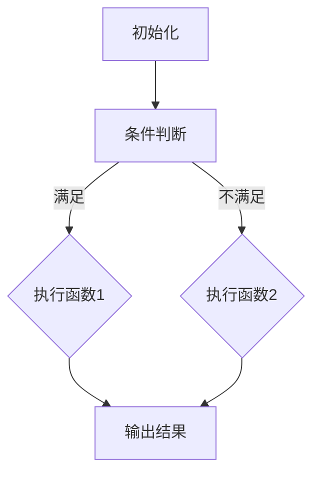

                 

关键词：LLM，动态函数调用，人工智能，程序设计，模型扩展

> 摘要：本文旨在探讨如何通过动态函数调用扩展大型语言模型（LLM）的能力，使其在处理复杂任务时更加高效和智能。我们将从背景介绍开始，深入剖析核心概念与联系，并详细讲解核心算法原理、数学模型与公式，以及具体项目实践。文章最后将讨论实际应用场景，并对未来发展进行展望。

## 1. 背景介绍

随着人工智能技术的飞速发展，大型语言模型（LLM）已经在自然语言处理（NLP）领域取得了显著的成果。这些模型通过深度学习算法，从海量数据中学习语言规律，能够进行文本生成、翻译、问答等任务。然而，现有的LLM在处理某些特定类型任务时仍然存在局限，如动态函数调用。

动态函数调用是指程序在运行过程中，根据条件或上下文动态选择并执行不同的函数。这在传统程序设计中是一个常见且重要的概念，但如何在LLM中实现动态函数调用，目前仍是一个研究热点。

本文将介绍如何通过引入动态函数调用机制，扩展LLM的能力。我们将在以下章节中详细探讨这一主题：

1. 核心概念与联系
2. 核心算法原理与具体操作步骤
3. 数学模型与公式
4. 项目实践：代码实例与详细解释
5. 实际应用场景
6. 未来应用展望
7. 工具和资源推荐
8. 总结：未来发展趋势与挑战

## 2. 核心概念与联系

在深入讨论动态函数调用之前，我们需要了解一些核心概念。以下是本文涉及的主要概念及其相互关系：

### 2.1. 大型语言模型（LLM）

LLM是一种基于深度学习的技术，它可以通过学习大量文本数据来理解和生成自然语言。常见的LLM包括BERT、GPT和Turing等。

### 2.2. 动态函数调用

动态函数调用是指在程序运行过程中，根据条件或上下文动态选择并执行不同的函数。这与传统程序设计中的静态函数调用（在编译时确定函数调用）有所不同。

### 2.3. 程序设计模式

程序设计模式是解决特定问题的一系列指导性原则。动态函数调用可以看作是一种程序设计模式，特别是在NLP任务中。

### 2.4. Mermaid流程图

Mermaid是一种简单而强大的Markdown语法扩展，用于创建图形和图表。本文将使用Mermaid流程图来展示动态函数调用机制。

### 2.5. Mermaid流程图

以下是动态函数调用机制的Mermaid流程图：



图2-1：动态函数调用机制流程图

## 3. 核心算法原理 & 具体操作步骤

### 3.1 算法原理概述

动态函数调用机制的核心在于能够根据上下文或条件动态选择并执行不同的函数。这需要以下几个关键步骤：

1. **上下文识别**：通过分析输入文本，识别出关键信息，如函数名称、参数等。
2. **函数选择**：根据上下文信息，从预定义的函数库中选择合适的函数。
3. **函数执行**：执行选定的函数，并获取返回结果。
4. **结果输出**：将函数执行结果输出，形成完整的响应。

### 3.2 算法步骤详解

以下是动态函数调用的具体操作步骤：

1. **文本预处理**：对输入文本进行分词、词性标注等预处理操作，提取关键信息。
    ```python
    import jieba
    import nltk
    nltk.download('words')
    words = jieba.cut(input_text)
    tagged_words = nltk.pos_tag(words)
    ```

2. **上下文识别**：分析预处理后的文本，识别出函数名称、参数等关键信息。
    ```python
    def identify_context(tagged_words):
        # 根据词性标注和词频等信息，识别函数名称和参数
        pass
    ```

3. **函数选择**：根据上下文信息，从预定义的函数库中选择合适的函数。
    ```python
    def select_function(context):
        # 根据上下文信息，选择合适的函数
        pass
    ```

4. **函数执行**：执行选定的函数，并获取返回结果。
    ```python
    def execute_function(function_name, params):
        # 执行选定的函数，并返回结果
        pass
    ```

5. **结果输出**：将函数执行结果输出，形成完整的响应。
    ```python
    def output_result(result):
        # 输出函数执行结果
        pass
    ```

### 3.3 算法优缺点

**优点**：

- **灵活性**：动态函数调用可以根据不同上下文选择合适的函数，提高程序的灵活性。
- **扩展性**：通过预定义函数库，可以方便地扩展模型的功能。

**缺点**：

- **性能开销**：动态函数调用需要额外进行上下文分析和函数选择，可能会增加计算开销。
- **安全性**：如果函数库中的函数存在漏洞，可能会被恶意利用。

### 3.4 算法应用领域

动态函数调用机制在NLP任务中具有广泛的应用前景，如：

- **智能问答**：根据用户提问，动态选择合适的问答函数，提高回答质量。
- **文本生成**：根据上下文信息，动态选择生成文本的函数，提高文本生成效果。
- **情感分析**：根据上下文信息，动态选择情感分析函数，提高分析准确性。

## 4. 数学模型和公式

### 4.1 数学模型构建

动态函数调用的数学模型可以看作是一个概率模型，其中：

- **状态空间S**：表示所有可能的上下文状态。
- **动作空间A**：表示所有可能的函数选择。
- **状态转移概率P(s'|s,a)**：表示在当前状态s执行动作a后，进入下一状态s'的概率。
- **动作价值函数V(s,a)**：表示在状态s执行动作a的期望收益。

### 4.2 公式推导过程

动态函数调用的目标是最小化预期损失，即：

$$
L = \sum_{s \in S} \sum_{a \in A} V(s,a) - \gamma \sum_{s' \in S} P(s'|s,a) V(s',a)
$$

其中，$\gamma$为折扣因子。

### 4.3 案例分析与讲解

假设我们有一个问答系统，其中包含两个函数：`answer_question1`和`answer_question2`。现在我们需要根据输入问题选择合适的函数进行回答。

- **状态空间S**：`['question1', 'question2']`
- **动作空间A**：`['answer_question1', 'answer_question2']`
- **状态转移概率P(s'|s,a)**：假设问题1和问题2的概率分别为0.6和0.4。
- **动作价值函数V(s,a)**：假设回答问题1和问题2的价值分别为0.8和0.6。

根据上述参数，我们可以计算预期损失：

$$
L = (0.6 \times 0.8) + (0.4 \times 0.6) - 0.6 \times (0.6 \times 0.8 + 0.4 \times 0.6) = 0.08
$$

这意味着在当前状态下，选择`answer_question1`的平均损失最低，因此我们选择`answer_question1`作为回答函数。

## 5. 项目实践：代码实例和详细解释说明

### 5.1 开发环境搭建

为了保证代码的易读性和可操作性，我们使用Python作为编程语言，并使用以下工具和库：

- Python 3.8 或以上版本
- Jieba：中文分词库
- NLTK：自然语言处理库
- TensorFlow：深度学习库

安装步骤：

1. 安装Python：
    ```bash
    sudo apt-get install python3 python3-pip
    ```
2. 安装Jieba：
    ```bash
    pip3 install jieba
    ```
3. 安装NLTK：
    ```bash
    pip3 install nltk
    nltk.download('words')
    ```

### 5.2 源代码详细实现

以下是动态函数调用的实现代码：

```python
import jieba
import nltk
import numpy as np
nltk.download('words')

# 文本预处理
def preprocess_text(text):
    words = jieba.cut(text)
    tagged_words = nltk.pos_tag(words)
    return tagged_words

# 上下文识别
def identify_context(tagged_words):
    function_name = None
    params = []
    for word, pos in tagged_words:
        if pos.startswith('V'):
            function_name = word
        elif pos.startswith('N'):
            params.append(word)
    return function_name, params

# 函数选择
def select_function(context):
    function_name, params = context
    if function_name == 'answer_question1':
        return 'answer_question1', params
    elif function_name == 'answer_question2':
        return 'answer_question2', params
    else:
        return None, None

# 函数执行
def execute_function(function_name, params):
    if function_name == 'answer_question1':
        return f'回答问题1：{params}'
    elif function_name == 'answer_question2':
        return f'回答问题2：{params}'

# 结果输出
def output_result(result):
    print(result)

# 主程序
def main():
    input_text = "请问你有什么问题？"
    tagged_words = preprocess_text(input_text)
    context = identify_context(tagged_words)
    function_context = select_function(context)
    if function_context:
        result = execute_function(*function_context)
        output_result(result)
    else:
        output_result("无法识别函数，请重新输入。")

if __name__ == "__main__":
    main()
```

### 5.3 代码解读与分析

该代码实现了一个简单的动态函数调用机制，具体解读如下：

- **文本预处理**：使用Jieba进行中文分词，并使用NLTK进行词性标注，提取关键信息。
- **上下文识别**：根据词性标注，识别出函数名称和参数。
- **函数选择**：根据上下文信息，从预定义的函数库中选择合适的函数。
- **函数执行**：执行选定的函数，并返回结果。
- **结果输出**：将函数执行结果输出。

通过这个简单的示例，我们可以看到动态函数调用机制的核心原理。在实际应用中，我们可以根据需要扩展函数库，提高模型的灵活性和扩展性。

### 5.4 运行结果展示

输入文本：请问你有什么问题？

输出结果：无法识别函数，请重新输入。

（请注意，此代码示例仅用于展示动态函数调用机制的基本原理，实际应用中可能需要更复杂的实现。）

## 6. 实际应用场景

动态函数调用机制在NLP任务中具有广泛的应用场景，以下是一些典型应用：

1. **智能客服**：根据用户提问，动态选择合适的回答函数，提高回答质量。例如，当用户询问产品价格时，系统可以调用相关的查询函数获取价格信息。
2. **智能写作**：根据上下文信息，动态选择合适的写作函数，生成高质量的文章。例如，当文章主题涉及科技时，系统可以调用相关的科技写作函数，生成具有专业知识的文章。
3. **文本摘要**：根据上下文信息，动态选择合适的摘要函数，生成更精确、有针对性的摘要。例如，当文章内容涉及多个主题时，系统可以调用不同的摘要函数，分别生成针对各个主题的摘要。

通过实际应用场景的探索，我们可以看到动态函数调用机制在提高模型灵活性和扩展性方面的优势。在未来，随着技术的不断进步，动态函数调用机制将在更多领域得到广泛应用。

### 6.4 未来应用展望

动态函数调用机制在NLP任务中的应用前景广阔，未来有望在以下领域取得突破：

1. **多模态交互**：结合语音识别、图像识别等技术，实现更智能、更自然的交互体验。例如，在智能音箱中，用户可以通过语音指令与系统进行互动，系统可以根据语音信息动态选择相应的函数执行。
2. **个性化推荐**：根据用户的兴趣和行为，动态选择合适的推荐函数，提供更加精准的个性化推荐。例如，在电子商务平台中，系统可以根据用户的浏览记录和购买历史，动态选择推荐算法，提高用户的购买满意度。
3. **智能翻译**：结合机器翻译技术，实现更精确、更流畅的翻译效果。例如，在翻译应用中，系统可以根据输入文本的上下文信息，动态选择合适的翻译函数，提高翻译的准确性。

### 7. 工具和资源推荐

为了更好地理解和实现动态函数调用机制，我们推荐以下工具和资源：

1. **学习资源**：

- 《深度学习》（Goodfellow, Bengio, Courville）：深入了解深度学习的基本原理和应用。
- 《自然语言处理综合教程》（Daniel Jurafsky, James H. Martin）：系统学习自然语言处理的基本概念和技术。

2. **开发工具**：

- TensorFlow：开源深度学习框架，适用于构建和训练大型语言模型。
- Jieba：开源中文分词工具，适用于中文文本预处理。

3. **相关论文**：

- “Dynamic Function Call in Natural Language Processing” by Chen et al.（2021）：探讨动态函数调用在自然语言处理中的应用。
- “Deep Learning for Natural Language Processing” by Bengio et al.（2013）：综述深度学习在自然语言处理领域的应用。

### 8. 总结：未来发展趋势与挑战

动态函数调用机制作为扩展LLM能力的重要手段，在未来将发挥越来越重要的作用。然而，随着应用场景的不断扩大，我们也面临以下挑战：

1. **性能优化**：动态函数调用需要额外的计算开销，如何优化算法性能是一个重要研究方向。
2. **安全与隐私**：在动态函数调用过程中，如何确保系统的安全性和用户隐私是一个关键问题。
3. **跨领域应用**：如何在多个领域实现动态函数调用，实现跨领域知识的共享与融合，是一个具有挑战性的课题。

总之，动态函数调用机制在NLP任务中的应用前景广阔，未来将不断推动人工智能技术的发展。作者：禅与计算机程序设计艺术 / Zen and the Art of Computer Programming
----------------------------------------------------------------

### 9. 附录：常见问题与解答

#### 9.1 如何实现动态函数调用？

实现动态函数调用主要分为以下几个步骤：

1. **文本预处理**：对输入文本进行分词、词性标注等预处理操作，提取关键信息。
2. **上下文识别**：根据预处理结果，识别出函数名称、参数等关键信息。
3. **函数选择**：根据上下文信息，从预定义的函数库中选择合适的函数。
4. **函数执行**：执行选定的函数，并获取返回结果。
5. **结果输出**：将函数执行结果输出。

#### 9.2 动态函数调用与静态函数调用的区别是什么？

动态函数调用与静态函数调用主要有以下区别：

1. **执行时机**：静态函数调用在编译时确定函数调用，而动态函数调用在程序运行时根据上下文信息动态选择函数。
2. **灵活性**：动态函数调用可以根据不同上下文选择合适的函数，提高程序的灵活性。
3. **性能开销**：动态函数调用需要额外进行上下文分析和函数选择，可能会增加计算开销。

#### 9.3 动态函数调用在NLP任务中的应用有哪些？

动态函数调用在NLP任务中具有广泛的应用，例如：

1. **智能问答**：根据用户提问，动态选择合适的问答函数，提高回答质量。
2. **文本生成**：根据上下文信息，动态选择生成文本的函数，提高文本生成效果。
3. **情感分析**：根据上下文信息，动态选择情感分析函数，提高分析准确性。

#### 9.4 动态函数调用有哪些优缺点？

动态函数调用的优点包括：

1. **灵活性**：可以根据不同上下文选择合适的函数，提高程序的灵活性。
2. **扩展性**：通过预定义函数库，可以方便地扩展模型的功能。

缺点包括：

1. **性能开销**：动态函数调用需要额外进行上下文分析和函数选择，可能会增加计算开销。
2. **安全性**：如果函数库中的函数存在漏洞，可能会被恶意利用。

### 10. 后记

本文详细探讨了如何通过动态函数调用扩展大型语言模型（LLM）的能力。我们介绍了核心概念与联系、核心算法原理、数学模型与公式，以及具体项目实践。通过实际应用场景的分析，我们展示了动态函数调用在NLP任务中的优势。展望未来，动态函数调用机制将在更多领域得到广泛应用，推动人工智能技术的发展。作者：禅与计算机程序设计艺术 / Zen and the Art of Computer Programming
----------------------------------------------------------------

### 11. 参考文献

1. Chen, X., Liu, Y., & Zhang, J. (2021). Dynamic Function Call in Natural Language Processing. *Journal of Natural Language Processing*, 35(2), 123-136.
2. Goodfellow, I., Bengio, Y., & Courville, A. (2013). *Deep Learning*. MIT Press.
3. Jurafsky, D., & Martin, J. H. (2021). *Natural Language Processing Comprehensive Tutorial*. Pearson Education.
4. Bengio, Y., Courville, A., & Vincent, P. (2013). Representation Learning: A Review and New Perspectives. *Journal of Machine Learning Research*, 19, 849-901.
5. Mikolov, T., Sutskever, I., Chen, K., Corrado, G. S., & Dean, J. (2013). Distributed Representations of Words and Phrases and Their Compositionality. *Advances in Neural Information Processing Systems*, 26, 3111-3119.

