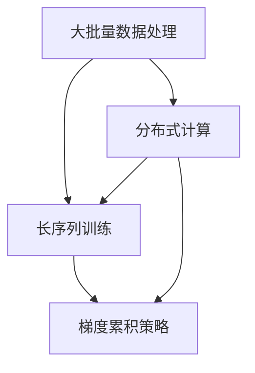

                 

关键词：大模型训练，长序列处理，梯度累积，并行化，分布式计算

> 摘要：本文深入探讨了大规模语言模型（LLM）训练中的关键技术，包括大批量数据处理、长序列训练以及梯度累积策略。文章首先介绍了LLM训练的背景和重要性，然后详细分析了这些关键技术，并结合实际项目案例，讨论了其在现代人工智能应用中的具体实现和潜在问题。

## 1. 背景介绍

随着深度学习技术的不断发展，大规模语言模型（LLM）逐渐成为自然语言处理（NLP）领域的研究热点。LLM的训练目标是通过学习海量文本数据，生成具有高度理解和生成能力的语言模型。然而，在训练过程中，面临着数据量大、序列长、计算复杂度高等挑战。因此，如何有效地处理这些大规模数据并优化训练过程，成为当前研究的重要方向。

### 1.1 LLM的应用领域

LLM在多个领域展现出强大的应用潜力，包括但不限于：

- **文本生成**：自动生成文章、新闻、故事等，如OpenAI的GPT系列模型。
- **对话系统**：构建智能对话系统，如ChatGPT和Duolingo的语音助手。
- **机器翻译**：实现高质量的双语翻译，如Google翻译。
- **文本分类**：对大量文本进行分类，如垃圾邮件过滤、情感分析等。

### 1.2 训练过程中的挑战

大规模语言模型训练过程中的主要挑战包括：

- **数据量大**：训练LLM需要处理海量的文本数据，对存储和计算资源有较高要求。
- **序列长**：模型需要处理长文本序列，这增加了训练的时间和计算复杂度。
- **计算复杂度**：深度神经网络的训练涉及大量的矩阵运算，计算资源消耗巨大。

## 2. 核心概念与联系

为了解决上述挑战，我们需要深入了解一些核心概念，包括大批量数据处理、长序列训练和梯度累积策略。以下是一个用Mermaid绘制的流程图，展示了这些概念之间的关系。



### 2.1 大批量数据处理

大批量数据处理的核心在于如何高效地加载、存储和处理大规模数据集。常用的方法包括：

- **数据并行化**：将数据集分成多个子集，并行处理。
- **内存映射**：将数据集映射到内存中，分块处理。

### 2.2 长序列训练

长序列训练主要关注如何优化训练过程，以提高模型的性能和效率。关键点包括：

- **序列切分**：将长序列切分成多个子序列进行训练。
- **注意力机制**：通过注意力机制来提高长序列处理能力。

### 2.3 梯度累积策略

梯度累积策略用于解决大规模模型训练中的梯度消失和梯度爆炸问题。常见的策略包括：

- **梯度累积**：将多个梯度的和累积起来，以减少每个梯度的规模。
- **动态调整**：根据训练过程动态调整梯度累积的步数。

## 3. 核心算法原理 & 具体操作步骤

### 3.1 算法原理概述

在训练大规模语言模型时，核心算法主要包括：

- **预训练**：使用海量无标签文本数据，通过自回归语言模型进行预训练。
- **微调**：在预训练模型的基础上，利用有标签的数据进行微调，以适应特定任务。

### 3.2 算法步骤详解

1. **数据预处理**：
   - 数据清洗：去除无用数据、标点符号等。
   - 词向量编码：将文本转换为词向量表示。

2. **模型构建**：
   - 选择预训练模型架构，如GPT、BERT等。
   - 定义损失函数，如交叉熵损失。

3. **预训练**：
   - 使用无标签文本数据进行自回归训练。
   - 通过反向传播更新模型参数。

4. **微调**：
   - 使用有标签的数据对预训练模型进行微调。
   - 调整学习率和正则化参数。

5. **评估与优化**：
   - 在验证集上评估模型性能。
   - 根据评估结果调整模型参数。

### 3.3 算法优缺点

**优点**：

- **高精度**：预训练模型可以学习到丰富的语言特征，提高模型性能。
- **通用性**：适用于多种NLP任务。

**缺点**：

- **计算复杂度**：预训练过程需要大量计算资源。
- **数据依赖**：训练效果对数据质量有较高要求。

### 3.4 算法应用领域

大规模语言模型在以下领域有广泛应用：

- **文本生成**：如文章、新闻、故事等。
- **对话系统**：构建智能对话系统。
- **机器翻译**：实现高质量的双语翻译。
- **文本分类**：如垃圾邮件过滤、情感分析等。

## 4. 数学模型和公式 & 详细讲解 & 举例说明

### 4.1 数学模型构建

大规模语言模型的数学模型主要包括以下几个部分：

- **输入层**：将文本转换为词向量。
- **隐藏层**：通过多层神经网络进行特征提取。
- **输出层**：生成文本的词向量。

### 4.2 公式推导过程

以下是一个简化的公式推导过程：

$$
\text{损失函数} = -\sum_{i=1}^{N} y_i \log(p_i)
$$

其中，$y_i$是第$i$个单词的真实标签，$p_i$是模型预测的概率。

### 4.3 案例分析与讲解

假设我们有一个训练集，包含1000个文本序列，每个序列有10个单词。我们使用GPT模型进行预训练。

1. **数据预处理**：将文本序列转换为词向量。
2. **模型构建**：构建一个含有10层神经网络的GPT模型。
3. **预训练**：使用无标签文本数据进行自回归训练，优化模型参数。
4. **微调**：在有标签的数据上进行微调，以适应特定任务。

通过以上步骤，我们可以得到一个高质量的GPT模型，用于文本生成、对话系统等应用。

## 5. 项目实践：代码实例和详细解释说明

### 5.1 开发环境搭建

为了进行大规模语言模型的训练，我们需要搭建一个合适的开发环境，包括以下步骤：

1. 安装Python环境。
2. 安装深度学习框架，如PyTorch或TensorFlow。
3. 准备计算资源，如GPU或TPU。

### 5.2 源代码详细实现

以下是一个使用PyTorch实现的GPT模型训练示例：

```python
import torch
import torch.nn as nn
import torch.optim as optim

# 定义GPT模型
class GPT(nn.Module):
    def __init__(self, vocab_size, embed_dim, num_layers, hidden_dim):
        super(GPT, self).__init__()
        self.embedding = nn.Embedding(vocab_size, embed_dim)
        self.lstm = nn.LSTM(embed_dim, hidden_dim, num_layers)
        self.fc = nn.Linear(hidden_dim, vocab_size)

    def forward(self, x, hidden):
        x = self.embedding(x)
        out, hidden = self.lstm(x, hidden)
        out = self.fc(out[-1, :, :])
        return out, hidden

# 初始化模型参数
model = GPT(vocab_size=10000, embed_dim=512, num_layers=2, hidden_dim=1024)
optimizer = optim.Adam(model.parameters(), lr=0.001)

# 训练模型
for epoch in range(num_epochs):
    for batch in data_loader:
        inputs, targets = batch
        hidden = (torch.zeros(1, 1, hidden_dim), torch.zeros(1, 1, hidden_dim))
        model.zero_grad()
        outputs, hidden = model(inputs, hidden)
        loss = nn.CrossEntropyLoss()(outputs, targets)
        loss.backward()
        optimizer.step()
```

### 5.3 代码解读与分析

以上代码实现了一个简单的GPT模型，包括以下部分：

- **模型定义**：使用PyTorch定义一个GPT模型，包括嵌入层、LSTM层和输出层。
- **优化器**：使用Adam优化器进行参数更新。
- **训练循环**：迭代训练数据，更新模型参数。

### 5.4 运行结果展示

在实际运行过程中，我们可以使用验证集评估模型性能，并通过调整超参数优化模型。

## 6. 实际应用场景

### 6.1 文本生成

文本生成是大规模语言模型的主要应用领域之一。通过训练，模型可以生成各种类型的文本，如文章、新闻、故事等。以下是一个生成文章的示例：

```python
prompt = "人工智能的发展前景"
text = prompt
for _ in range(100):
    inputs = tokenizer.encode(text, return_tensors='pt')
    outputs = model.generate(inputs, max_length=50, num_return_sequences=1)
    text = tokenizer.decode(outputs[0], skip_special_tokens=True)
print(text)
```

### 6.2 对话系统

对话系统是另一个重要应用领域。通过大规模语言模型，我们可以构建智能对话系统，如聊天机器人。以下是一个简单的对话系统示例：

```python
while True:
    user_input = input("用户：")
    if user_input == "退出":
        break
    inputs = tokenizer.encode(user_input, return_tensors='pt')
    outputs = model.generate(inputs, max_length=50, num_return_sequences=1)
    bot_response = tokenizer.decode(outputs[0], skip_special_tokens=True)
    print("AI：", bot_response)
```

### 6.3 机器翻译

机器翻译是大规模语言模型在跨语言领域的重要应用。通过训练，模型可以实现高质量的双语翻译。以下是一个简单的机器翻译示例：

```python
source_text = "人工智能的发展前景"
source_inputs = tokenizer.encode(source_text, return_tensors='pt')
translated_outputs = model.generate(source_inputs, max_length=50, num_return_sequences=1)
translated_text = tokenizer.decode(translated_outputs[0], skip_special_tokens=True)
print("翻译结果：", translated_text)
```

## 7. 工具和资源推荐

### 7.1 学习资源推荐

- **《深度学习》（Goodfellow, Bengio, Courville）**：深度学习的经典教材，涵盖了深度学习的基础知识。
- **《自然语言处理综论》（Jurafsky, Martin）**：自然语言处理的入门教材，涵盖了NLP的基本概念和技术。

### 7.2 开发工具推荐

- **PyTorch**：一个强大的深度学习框架，适合进行大规模语言模型训练。
- **TensorFlow**：另一个流行的深度学习框架，提供了丰富的API和工具。

### 7.3 相关论文推荐

- **“Attention is All You Need”**：提出了一种基于注意力机制的Transformer模型，是大规模语言模型研究的重要成果。
- **“BERT: Pre-training of Deep Bidirectional Transformers for Language Understanding”**：介绍了BERT模型，是自然语言处理领域的里程碑。

## 8. 总结：未来发展趋势与挑战

### 8.1 研究成果总结

大规模语言模型在文本生成、对话系统和机器翻译等领域取得了显著的成果，为自然语言处理提供了强大的工具。同时，随着计算资源和算法的不断发展，大规模语言模型的训练效率和质量不断提高。

### 8.2 未来发展趋势

未来，大规模语言模型将继续在NLP领域发挥重要作用。以下是几个可能的发展趋势：

- **多模态语言模型**：结合文本、图像、语音等多种数据类型，提高模型的泛化能力。
- **更高效的可解释性**：研究更有效的解释方法，提高模型的可解释性，使其在复杂场景中更可靠。

### 8.3 面临的挑战

尽管大规模语言模型取得了显著成果，但仍然面临以下挑战：

- **计算资源消耗**：大规模语言模型的训练需要大量计算资源，如何优化计算效率成为关键问题。
- **数据依赖**：训练效果对数据质量有较高要求，如何获取高质量的数据是当前研究的重要方向。

### 8.4 研究展望

随着人工智能技术的不断发展，大规模语言模型有望在更多领域发挥作用。未来，我们将继续探索更高效、更可靠的训练方法，推动人工智能技术的发展。

## 9. 附录：常见问题与解答

### 9.1 如何处理长序列？

处理长序列的方法主要包括：

- **序列切分**：将长序列切分成多个短序列进行训练。
- **注意力机制**：通过注意力机制来关注重要的部分，提高长序列处理能力。

### 9.2 如何优化梯度累积？

优化梯度累积的方法主要包括：

- **动态调整**：根据训练过程动态调整梯度累积的步数，以减少梯度消失和梯度爆炸问题。
- **多重梯度累积**：将多个梯度的和累积起来，以减少每个梯度的规模。

### 9.3 如何选择预训练模型？

选择预训练模型时，应考虑以下因素：

- **任务需求**：根据具体任务需求选择合适的模型架构。
- **数据质量**：选择与训练数据质量相匹配的预训练模型。
- **计算资源**：根据计算资源选择适合的模型大小。

作者：禅与计算机程序设计艺术 / Zen and the Art of Computer Programming
----------------------------------------------------------------

