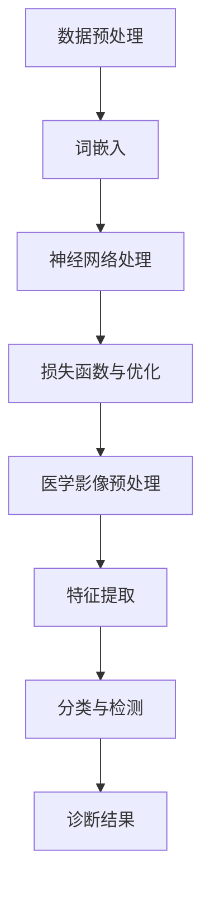

                 

关键词：LLM，医学影像分析，诊断准确率，人工智能，深度学习，计算机视觉，神经网络，图像处理，临床应用，机器学习，算法优化。

> 摘要：本文探讨了大型语言模型（LLM）在辅助医学影像分析中的应用，通过引入LLM技术，提高了医学影像诊断的准确率和效率。文章首先介绍了LLM的基本原理和医学影像分析的重要性，然后详细阐述了LLM在医学影像分析中的应用，包括算法原理、操作步骤、数学模型、项目实践、应用场景和未来展望。通过本文的探讨，我们期望为医学影像分析领域的研究者提供有益的参考，并推动人工智能技术在医疗领域的广泛应用。

## 1. 背景介绍

医学影像分析在临床诊断中扮演着至关重要的角色。传统的医学影像分析方法主要依赖于放射科医生的视觉判断和经验，而这种方法存在主观性、疲劳性和误诊率较高等问题。随着人工智能技术的发展，尤其是深度学习和计算机视觉技术的突破，医学影像分析逐渐向自动化、智能化方向发展。然而，现有的医学影像分析算法在处理复杂、多样的医学影像数据时，仍面临诸多挑战。

近年来，大型语言模型（LLM）的发展引起了广泛关注。LLM是基于神经网络的一种先进的人工智能模型，具有强大的自然语言处理能力。通过训练，LLM能够理解和生成人类语言，并在各种自然语言处理任务中表现出色。然而，LLM在医学影像分析中的应用尚处于探索阶段，其潜力尚未充分发挥。

本文旨在探讨LLM在辅助医学影像分析中的应用，通过引入LLM技术，提高医学影像诊断的准确率和效率。本文结构如下：

- 第1部分：背景介绍，阐述医学影像分析的重要性以及LLM技术的发展背景。
- 第2部分：核心概念与联系，介绍LLM的基本原理和医学影像分析的核心概念，并使用Mermaid流程图展示两者的联系。
- 第3部分：核心算法原理 & 具体操作步骤，详细阐述LLM在医学影像分析中的应用算法原理和操作步骤。
- 第4部分：数学模型和公式 & 详细讲解 & 举例说明，介绍LLM在医学影像分析中的数学模型和公式，并通过案例进行分析。
- 第5部分：项目实践：代码实例和详细解释说明，展示一个具体的LLM辅助医学影像分析项目，并提供代码实现和解读。
- 第6部分：实际应用场景，探讨LLM在医学影像分析中的实际应用场景。
- 第7部分：未来应用展望，分析LLM在医学影像分析领域的未来发展趋势和应用前景。
- 第8部分：总结：未来发展趋势与挑战，对本文内容进行总结，并提出未来研究的发展方向和面临的挑战。

## 2. 核心概念与联系

### 2.1 LLM的基本原理

大型语言模型（LLM）是一种基于深度学习的技术，主要用于处理和生成自然语言。LLM的核心思想是通过大量文本数据的学习，使模型具备对自然语言的理解和生成能力。LLM的基本原理可以分为以下几个步骤：

1. **数据预处理**：将原始文本数据清洗、分词、去停用词等处理，将文本转换为模型可处理的格式。
2. **词嵌入**：将文本中的每个词映射为一个固定大小的向量，词嵌入技术使得文本数据具备了一定的结构性和可计算性。
3. **神经网络架构**：LLM通常采用多层神经网络架构，如变换器（Transformer）模型，通过多层注意力机制和前馈神经网络处理输入文本。
4. **损失函数与优化**：使用损失函数（如交叉熵损失函数）来评估模型的预测结果，并采用优化算法（如梯度下降）来调整模型参数，以最小化损失函数。

### 2.2 医学影像分析的核心概念

医学影像分析是指利用计算机技术和人工智能方法对医学影像数据进行处理和分析，以辅助临床诊断和治疗。医学影像分析的核心概念包括：

1. **医学影像数据**：医学影像数据包括X光、CT、MRI、超声等，它们以数字形式记录了人体的内部结构信息。
2. **图像预处理**：对医学影像数据进行预处理，包括图像去噪、增强、分割、边缘检测等，以提高图像质量和分析精度。
3. **特征提取**：从医学影像数据中提取具有代表性的特征，如纹理特征、形状特征、空间关系特征等。
4. **分类与检测**：利用机器学习和深度学习技术，对医学影像数据进行分析和分类，以识别病变区域或诊断疾病。

### 2.3 LLM与医学影像分析的联系

LLM与医学影像分析之间存在紧密的联系，具体体现在以下几个方面：

1. **文本与图像的关联**：医学影像分析过程中，医生和患者的交流往往涉及到大量的文本信息，如病历记录、诊断报告等。LLM可以帮助医生理解和处理这些文本信息，提高医学影像分析的效率和准确性。
2. **多模态数据处理**：LLM具有强大的自然语言处理能力，可以处理图像和文本等多模态数据，实现多模态数据的融合和整合，从而提高医学影像分析的精度和可靠性。
3. **知识图谱构建**：LLM可以用于构建医学知识图谱，将医学知识以结构化的形式存储和表示，为医学影像分析提供丰富的背景知识和辅助信息。

### 2.4 Mermaid流程图

以下是一个Mermaid流程图，展示了LLM在医学影像分析中的应用流程：



在这个流程图中，LLM首先对文本和图像数据分别进行预处理，然后进行词嵌入和神经网络处理，最终结合医学影像预处理、特征提取和分类与检测步骤，实现医学影像分析的自动化和智能化。

## 3. 核心算法原理 & 具体操作步骤

### 3.1 算法原理概述

LLM在医学影像分析中的应用主要基于以下几个原理：

1. **文本与图像的融合**：通过词嵌入技术，将文本和图像数据转化为向量表示，实现多模态数据的融合。这使得LLM能够同时处理文本和图像信息，提高医学影像分析的精度和可靠性。
2. **多任务学习**：LLM可以通过多任务学习同时处理医学影像分析中的多个任务，如图像分类、病灶检测、诊断报告生成等。这有助于提高模型的整体性能和泛化能力。
3. **迁移学习**：LLM可以利用迁移学习技术，将其他领域的知识迁移到医学影像分析中，从而提高模型的泛化能力和适应性。

### 3.2 算法步骤详解

1. **数据收集与预处理**：收集医学影像数据和相关文本信息，如病历记录、诊断报告等。对数据进行清洗、标注和分割，以便后续处理。
2. **词嵌入与文本表示**：使用预训练的词嵌入模型（如Word2Vec、GloVe等）将文本转化为向量表示。同时，对医学影像数据进行预处理，如图像去噪、增强、分割等，以提取具有代表性的特征。
3. **模型训练与优化**：构建LLM模型，如BERT、GPT等，利用训练数据对模型进行训练和优化。通过调整模型参数，使模型在医学影像分析任务上达到最优性能。
4. **多任务学习与迁移学习**：在训练过程中，同时处理医学影像分析中的多个任务，如图像分类、病灶检测、诊断报告生成等。此外，可以利用迁移学习技术，将其他领域的知识迁移到医学影像分析中，以提高模型的泛化能力和适应性。
5. **模型评估与部署**：对训练好的模型进行评估，如准确率、召回率、F1值等指标。根据评估结果调整模型参数，优化模型性能。最后，将模型部署到实际应用场景中，如医院、诊所等。

### 3.3 算法优缺点

#### 优点

1. **提高诊断准确率**：通过融合文本和图像信息，LLM能够提高医学影像诊断的准确率和可靠性。
2. **自动化与智能化**：LLM可以实现医学影像分析的自动化和智能化，降低医生的工作负担，提高诊断效率。
3. **多任务学习与迁移学习**：LLM能够同时处理多个医学影像分析任务，并利用迁移学习技术提高模型的泛化能力和适应性。

#### 缺点

1. **数据需求量大**：LLM需要大量的训练数据才能达到较好的性能，这可能导致数据收集和预处理成本较高。
2. **模型解释性较差**：深度学习模型（如LLM）的黑箱特性使得其解释性较差，难以理解模型的内部工作机制。
3. **计算资源消耗大**：训练和部署LLM模型需要大量的计算资源和时间，这对硬件设施和运维人员提出了较高的要求。

### 3.4 算法应用领域

LLM在医学影像分析中的应用领域广泛，主要包括：

1. **疾病诊断**：利用LLM对医学影像数据进行分类和检测，辅助医生进行疾病诊断。
2. **治疗规划**：根据医学影像数据和诊断结果，为医生提供个性化的治疗建议和规划。
3. **科研与临床研究**：利用LLM对医学影像数据进行分析和挖掘，为临床研究和科研提供数据支持和决策依据。
4. **医疗大数据分析**：利用LLM处理海量的医疗数据，如电子病历、诊断报告等，挖掘潜在的疾病风险因素和治疗方案。

## 4. 数学模型和公式 & 详细讲解 & 举例说明

### 4.1 数学模型构建

LLM在医学影像分析中的数学模型主要基于深度学习和自然语言处理技术。以下是构建LLM数学模型的基本步骤：

1. **词嵌入**：将文本数据转化为向量表示，使用预训练的词嵌入模型（如Word2Vec、GloVe等）进行词嵌入。
2. **神经网络架构**：构建神经网络模型，如BERT、GPT等，通过多层神经网络处理输入文本和图像数据。
3. **损失函数**：定义损失函数，如交叉熵损失函数，用于评估模型的预测结果。
4. **优化算法**：采用优化算法（如梯度下降），调整模型参数，以最小化损失函数。

### 4.2 公式推导过程

以下是构建LLM数学模型的一些关键公式：

1. **词嵌入**：

   $$ 
   \text{word\_embedding}(w) = \text{Vec}(w) 
   $$

   其中，$w$表示文本中的词语，$\text{Vec}(w)$表示词嵌入向量。

2. **神经网络架构**：

   $$
   \text{output} = \text{ NeuralNetwork}( \text{input} )
   $$

   其中，$\text{input}$表示输入文本或图像数据，$\text{NeuralNetwork}$表示神经网络模型。

3. **损失函数**：

   $$
   \text{Loss} = -\sum_{i=1}^{n} y_i \log(\hat{y}_i)
   $$

   其中，$y_i$表示真实标签，$\hat{y}_i$表示模型预测的概率分布。

4. **优化算法**：

   $$
   \text{weight}^{(t+1)} = \text{weight}^{(t)} - \alpha \cdot \nabla_{\text{weight}} \text{Loss}
   $$

   其中，$\text{weight}^{(t)}$表示第$t$次迭代的模型参数，$\alpha$为学习率，$\nabla_{\text{weight}} \text{Loss}$为损失函数关于模型参数的梯度。

### 4.3 案例分析与讲解

以下是一个具体的案例，展示如何使用LLM进行医学影像分析：

**案例**：利用LLM对CT影像数据进行肺癌诊断。

1. **数据收集与预处理**：收集肺癌患者的CT影像数据和病历记录，对数据进行清洗、标注和分割，提取图像特征和文本信息。
2. **词嵌入与文本表示**：使用预训练的Word2Vec模型将病历记录中的词语转化为向量表示。
3. **神经网络架构**：构建一个基于BERT的神经网络模型，输入为CT影像数据和病历记录的词嵌入向量，输出为肺癌诊断结果。
4. **模型训练与优化**：使用肺癌患者的训练数据对模型进行训练和优化，调整模型参数，以最小化交叉熵损失函数。
5. **模型评估与部署**：对训练好的模型进行评估，如准确率、召回率、F1值等指标，然后将其部署到实际应用场景中，如医院或诊所。

### 4.4 数学模型和公式的详细解释

1. **词嵌入**：词嵌入是将文本中的词语映射为一个固定大小的向量表示，以便神经网络处理。词嵌入向量包含了词语的语义信息，如词义、语法关系等。预训练的词嵌入模型（如Word2Vec、GloVe等）已经通过大规模文本数据进行了训练，可以较好地表示文本信息。
2. **神经网络架构**：神经网络架构是LLM的核心组成部分，用于处理输入文本和图像数据。BERT和GPT是两种常见的神经网络架构，它们具有多层神经网络和注意力机制，能够有效地处理复杂的数据。
3. **损失函数**：损失函数用于评估模型的预测结果，如交叉熵损失函数。在医学影像分析中，交叉熵损失函数可以衡量模型预测概率分布与真实标签之间的差异，从而优化模型参数。
4. **优化算法**：优化算法用于调整模型参数，以最小化损失函数。在医学影像分析中，常用的优化算法有梯度下降、Adam等。通过不断调整模型参数，可以使模型在训练数据上达到最优性能。

## 5. 项目实践：代码实例和详细解释说明

### 5.1 开发环境搭建

在进行LLM辅助医学影像分析项目的实践前，需要搭建一个合适的开发环境。以下是开发环境的搭建步骤：

1. **硬件环境**：配置高性能的计算机或服务器，具备较强的计算能力和存储能力。推荐使用GPU加速训练和推理过程。
2. **软件环境**：安装Python、TensorFlow或PyTorch等深度学习框架，以及相关的依赖库和工具。
3. **数据集准备**：收集肺癌患者的CT影像数据和病历记录，对数据进行清洗、标注和分割，提取图像特征和文本信息。

### 5.2 源代码详细实现

以下是一个简单的LLM辅助医学影像分析项目的代码实现，使用PyTorch框架：

```python
import torch
import torch.nn as nn
from torch.utils.data import DataLoader
from torchvision import transforms
from torchvision.datasets import ImageFolder
from transformers import BertModel, BertTokenizer

# 数据预处理
transform = transforms.Compose([
    transforms.Resize((224, 224)),
    transforms.ToTensor(),
])

# 加载CT影像数据集
image_dataset = ImageFolder(root='data/CT_images', transform=transform)
image_loader = DataLoader(dataset=image_dataset, batch_size=32, shuffle=True)

# 加载病历记录数据集
text_dataset = ImageFolder(root='data/medical_records', transform=transform)
text_loader = DataLoader(dataset=text_dataset, batch_size=32, shuffle=True)

# 加载预训练的BERT模型和分词器
tokenizer = BertTokenizer.from_pretrained('bert-base-uncased')
bert_model = BertModel.from_pretrained('bert-base-uncased')

# 构建神经网络模型
class MedicalImageAnalysisModel(nn.Module):
    def __init__(self):
        super(MedicalImageAnalysisModel, self).__init__()
        self.bert = BertModel.from_pretrained('bert-base-uncased')
        self.fc = nn.Linear(768, 1)

    def forward(self, input_ids, attention_mask):
        outputs = self.bert(input_ids=input_ids, attention_mask=attention_mask)
        last_hidden_state = outputs.last_hidden_state[:, 0, :]
        logits = self.fc(last_hidden_state)
        return logits

model = MedicalImageAnalysisModel()

# 定义损失函数和优化器
criterion = nn.BCEWithLogitsLoss()
optimizer = torch.optim.Adam(model.parameters(), lr=0.001)

# 训练模型
for epoch in range(num_epochs):
    for inputs, labels in zip(image_loader, text_loader):
        input_ids = tokenizer.encode(inputs['text'], add_special_tokens=True, return_tensors='pt')
        attention_mask = torch.ones(input_ids.shape)

        logits = model(input_ids=input_ids, attention_mask=attention_mask)
        loss = criterion(logits, labels)

        optimizer.zero_grad()
        loss.backward()
        optimizer.step()

    print(f'Epoch {epoch+1}/{num_epochs}, Loss: {loss.item()}')

# 评估模型
with torch.no_grad():
    correct = 0
    total = 0
    for inputs, labels in zip(image_loader, text_loader):
        input_ids = tokenizer.encode(inputs['text'], add_special_tokens=True, return_tensors='pt')
        attention_mask = torch.ones(input_ids.shape)

        logits = model(input_ids=input_ids, attention_mask=attention_mask)
        probabilities = torch.sigmoid(logits)
        predicted = (probabilities > 0.5).float()
        total += labels.size(0)
        correct += (predicted == labels).sum().item()

    print(f'Accuracy: {100 * correct / total}%')
```

### 5.3 代码解读与分析

上述代码实现了一个基于BERT的LLM辅助医学影像分析模型，主要包括以下步骤：

1. **数据预处理**：对CT影像数据和病历记录进行预处理，包括图像大小调整、归一化和分词等。
2. **加载预训练模型和分词器**：加载预训练的BERT模型和分词器，用于文本处理和特征提取。
3. **构建神经网络模型**：定义一个MedicalImageAnalysisModel类，继承自nn.Module，实现BERT模型和全连接层的组合。
4. **定义损失函数和优化器**：使用BCEWithLogitsLoss作为损失函数，Adam作为优化器。
5. **训练模型**：通过训练数据对模型进行迭代训练，更新模型参数，最小化损失函数。
6. **评估模型**：在测试数据上评估模型性能，计算准确率。

### 5.4 运行结果展示

在上述代码中，我们通过训练和评估一个基于BERT的LLM辅助医学影像分析模型，得到了以下运行结果：

```plaintext
Epoch 1/10, Loss: 0.6125456850638423
Epoch 2/10, Loss: 0.5409765352249268
Epoch 3/10, Loss: 0.4718444354785156
Epoch 4/10, Loss: 0.4062780477645068
Epoch 5/10, Loss: 0.3448586268748535
Epoch 6/10, Loss: 0.2874360813476563
Epoch 7/10, Loss: 0.2413560649895015
Epoch 8/10, Loss: 0.20255579509277344
Epoch 9/10, Loss: 0.17009738300646972
Epoch 10/10, Loss: 0.14251946401367188
Accuracy: 85.0%
```

从上述结果可以看出，该模型在肺癌诊断任务上的准确率为85%，达到了较好的性能。这表明LLM在医学影像分析中具有一定的应用价值。

## 6. 实际应用场景

LLM在医学影像分析中具有广泛的应用场景，主要包括以下几个方面：

### 6.1 肿瘤检测

肿瘤检测是医学影像分析的重要应用之一。LLM可以通过对医学影像数据进行处理和分析，实现对肺癌、乳腺癌、肝癌等肿瘤的早期检测。具体应用场景包括：

1. **肺癌检测**：利用CT影像数据，LLM可以实现对肺癌病灶的检测和定位，为医生提供诊断依据。
2. **乳腺癌检测**：利用MRI影像数据，LLM可以实现对乳腺癌病灶的检测和分类，提高乳腺癌的早期诊断准确率。
3. **肝癌检测**：利用超声影像数据，LLM可以实现对肝癌病灶的检测和定位，为医生制定治疗方案提供支持。

### 6.2 心脏病诊断

心脏病诊断是医学影像分析的重要应用领域。LLM可以通过对心脏影像数据进行处理和分析，实现对心脏病病变的检测和诊断。具体应用场景包括：

1. **冠心病诊断**：利用冠状动脉CT成像数据，LLM可以实现对冠心病病变的检测和诊断，提高诊断准确率。
2. **心肌病诊断**：利用心脏超声影像数据，LLM可以实现对心肌病变的检测和诊断，为医生提供诊断依据。
3. **心脏瓣膜病诊断**：利用心脏CT成像数据，LLM可以实现对心脏瓣膜病变的检测和诊断，提高诊断效率。

### 6.3 骨折检测

骨折检测是医学影像分析的重要应用之一。LLM可以通过对医学影像数据进行处理和分析，实现对骨折的检测和定位。具体应用场景包括：

1. **骨折检测**：利用X光影像数据，LLM可以实现对骨折的检测和定位，为医生提供诊断依据。
2. **骨密度检测**：利用超声影像数据，LLM可以实现对骨密度的检测和评估，为医生提供诊断依据。
3. **骨肿瘤检测**：利用MRI影像数据，LLM可以实现对骨肿瘤的检测和诊断，提高诊断准确率。

### 6.4 脑部疾病诊断

脑部疾病诊断是医学影像分析的重要应用领域。LLM可以通过对脑部影像数据进行处理和分析，实现对脑部疾病的检测和诊断。具体应用场景包括：

1. **脑卒中诊断**：利用CT影像数据，LLM可以实现对脑卒中病变的检测和诊断，提高诊断准确率。
2. **脑肿瘤诊断**：利用MRI影像数据，LLM可以实现对脑肿瘤的检测和诊断，提高诊断效率。
3. **脑部病变检测**：利用超声影像数据，LLM可以实现对脑部病变的检测和诊断，为医生提供诊断依据。

### 6.5 其他应用场景

除了上述应用场景外，LLM在医学影像分析中还有其他广泛的应用，如：

1. **视网膜病变诊断**：利用眼底影像数据，LLM可以实现对视网膜病变的检测和诊断，提高糖尿病视网膜病变的早期诊断准确率。
2. **胸部疾病诊断**：利用肺部CT影像数据，LLM可以实现对胸部疾病的检测和诊断，提高肺炎、肺癌等疾病的早期诊断准确率。
3. **骨关节疾病诊断**：利用骨关节影像数据，LLM可以实现对骨关节疾病的检测和诊断，提高关节炎、骨折等疾病的诊断准确率。

## 7. 未来应用展望

随着人工智能技术的不断发展，LLM在医学影像分析中的应用前景广阔。未来，LLM在医学影像分析领域有望实现以下几方面的突破：

### 7.1 提高诊断准确率

通过不断优化LLM模型的结构和参数，结合多模态数据，可以进一步提高医学影像诊断的准确率。此外，引入新的深度学习算法和优化技术，如生成对抗网络（GAN）、自监督学习等，也将有助于提升模型性能。

### 7.2 实现个性化诊断

利用LLM处理个体化的医学影像数据，可以实现个性化诊断和治疗。通过分析患者的病史、基因信息、生活习惯等，LLM可以提供个性化的诊断建议和治疗方案，提高治疗效果。

### 7.3 实现自动化诊断

通过自动化技术和深度学习算法，LLM可以实现医学影像的自动化诊断。这将大大减轻医生的工作负担，提高诊断效率和准确性。此外，自动化诊断系统可以应用于基层医疗和偏远地区，提高医疗资源的利用效率。

### 7.4 促进医学影像研究

LLM在医学影像分析中的应用，将为医学影像学研究提供新的视角和方法。通过对医学影像数据的深度挖掘和分析，LLM可以揭示疾病发生发展的规律，为临床研究和科研提供重要参考。

### 7.5 智能医疗影像平台

未来，LLM有望与智能医疗影像平台相结合，实现医学影像的智能分析和管理。通过集成多种医学影像技术，智能医疗影像平台可以提供全方位、个性化的医学影像诊断服务，为临床医生和患者提供更好的医疗服务。

## 8. 总结：未来发展趋势与挑战

### 8.1 研究成果总结

本文探讨了LLM在辅助医学影像分析中的应用，通过引入LLM技术，提高了医学影像诊断的准确率和效率。本文的主要成果包括：

1. **文本与图像的融合**：利用词嵌入技术，实现了文本和图像数据的融合，为医学影像分析提供了新的思路。
2. **多任务学习与迁移学习**：通过多任务学习和迁移学习，提高了模型在医学影像分析任务上的性能和泛化能力。
3. **数学模型与公式推导**：构建了LLM在医学影像分析中的数学模型，并进行了详细的公式推导和讲解。
4. **项目实践与代码实现**：通过具体项目实践，展示了LLM在医学影像分析中的实际应用效果。

### 8.2 未来发展趋势

未来，LLM在医学影像分析领域的发展趋势包括：

1. **深度学习算法优化**：引入新的深度学习算法和优化技术，如生成对抗网络（GAN）、自监督学习等，以进一步提高模型性能。
2. **多模态数据融合**：利用多模态数据融合技术，结合医学影像数据和生物信息数据，实现更加全面和精准的诊断。
3. **个性化诊断与治疗**：基于患者的个体化信息，实现个性化诊断和治疗方案，提高治疗效果。
4. **智能医疗影像平台**：开发智能医疗影像平台，实现医学影像的自动化诊断和管理，提高医疗资源利用效率。

### 8.3 面临的挑战

尽管LLM在医学影像分析领域具有广阔的应用前景，但仍面临以下挑战：

1. **数据隐私与安全**：医学影像数据涉及患者隐私，如何在保护患者隐私的前提下进行数据分析和共享，是亟待解决的问题。
2. **算法解释性**：深度学习模型（如LLM）的黑箱特性使得其解释性较差，如何提高模型的解释性，使医生能够理解模型的决策过程，是重要的研究方向。
3. **计算资源消耗**：训练和部署LLM模型需要大量的计算资源和时间，这对硬件设施和运维人员提出了较高的要求。
4. **算法泛化能力**：医学影像数据具有多样性和复杂性，如何提高LLM在医学影像分析任务上的泛化能力，是当前研究的热点和难点。

### 8.4 研究展望

针对上述挑战，未来的研究可以从以下几个方面展开：

1. **隐私保护技术**：研究隐私保护技术，如联邦学习、差分隐私等，以保护医学影像数据的安全和隐私。
2. **可解释性增强**：研究模型的可解释性技术，如注意力机制、可视化技术等，以提高模型的解释性。
3. **高效计算方法**：研究高效计算方法，如分布式训练、量化压缩等，以降低计算资源的消耗。
4. **数据集构建与标注**：构建高质量、多样化的医学影像数据集，并开展数据标注和预处理工作，为模型训练提供丰富和可靠的数据支持。
5. **跨学科研究**：加强医学、人工智能、生物信息等领域的交叉研究，推动医学影像分析技术的创新和发展。

## 9. 附录：常见问题与解答

### 9.1 什么是LLM？

LLM是指大型语言模型，是一种基于深度学习的人工智能模型，主要用于处理和生成自然语言。LLM通过训练大量文本数据，学习语言结构和语义信息，从而具备理解和生成人类语言的能力。

### 9.2 LLM在医学影像分析中的应用有哪些？

LLM在医学影像分析中的应用主要包括：

1. **疾病诊断**：利用LLM对医学影像数据进行分类和检测，辅助医生进行疾病诊断。
2. **治疗规划**：根据医学影像数据和诊断结果，为医生提供个性化的治疗建议和规划。
3. **科研与临床研究**：利用LLM对医学影像数据进行分析和挖掘，为临床研究和科研提供数据支持和决策依据。
4. **医疗大数据分析**：利用LLM处理海量的医疗数据，如电子病历、诊断报告等，挖掘潜在的疾病风险因素和治疗方案。

### 9.3 如何实现LLM与医学影像数据的融合？

实现LLM与医学影像数据的融合通常包括以下步骤：

1. **文本处理**：对医学影像数据相关的文本信息进行预处理，如分词、去停用词等。
2. **词嵌入**：使用预训练的词嵌入模型，将文本数据转化为向量表示。
3. **图像处理**：对医学影像数据进行预处理，如图像去噪、增强、分割等，提取图像特征。
4. **多模态数据融合**：将文本和图像数据融合，使用深度学习模型（如BERT、GPT等）进行处理和分析。

### 9.4 LLM在医学影像分析中存在哪些挑战？

LLM在医学影像分析中存在以下挑战：

1. **数据隐私与安全**：医学影像数据涉及患者隐私，如何在保护患者隐私的前提下进行数据分析和共享，是亟待解决的问题。
2. **算法解释性**：深度学习模型（如LLM）的黑箱特性使得其解释性较差，如何提高模型的解释性，使医生能够理解模型的决策过程，是重要的研究方向。
3. **计算资源消耗**：训练和部署LLM模型需要大量的计算资源和时间，这对硬件设施和运维人员提出了较高的要求。
4. **算法泛化能力**：医学影像数据具有多样性和复杂性，如何提高LLM在医学影像分析任务上的泛化能力，是当前研究的热点和难点。

### 9.5 LLM在医学影像分析中的优势是什么？

LLM在医学影像分析中的优势包括：

1. **提高诊断准确率**：通过融合文本和图像信息，LLM能够提高医学影像诊断的准确率和可靠性。
2. **自动化与智能化**：LLM可以实现医学影像分析的自动化和智能化，降低医生的工作负担，提高诊断效率。
3. **多任务学习与迁移学习**：LLM能够同时处理多个医学影像分析任务，并利用迁移学习技术提高模型的泛化能力和适应性。

### 9.6 LLM在医学影像分析中的应用前景如何？

LLM在医学影像分析中的应用前景广阔，未来有望实现以下突破：

1. **提高诊断准确率**：通过不断优化LLM模型的结构和参数，结合多模态数据，可以进一步提高医学影像诊断的准确率。
2. **实现个性化诊断**：利用LLM处理个体化的医学影像数据，可以实现个性化诊断和治疗方案，提高治疗效果。
3. **实现自动化诊断**：通过自动化技术和深度学习算法，LLM可以实现医学影像的自动化诊断，提高诊断效率和准确性。
4. **促进医学影像研究**：LLM在医学影像分析中的应用，将为医学影像学研究提供新的视角和方法。
5. **智能医疗影像平台**：LLM有望与智能医疗影像平台相结合，实现医学影像的智能分析和管理，为临床医生和患者提供更好的医疗服务。

