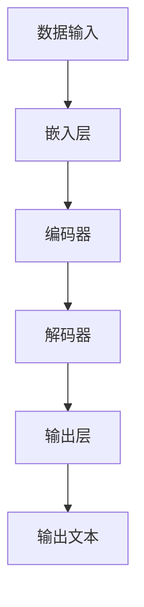
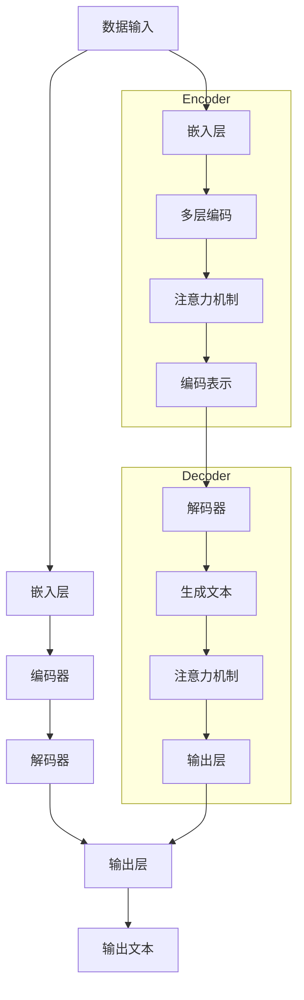

                 

### 关键词 Keywords

- Large Language Models
- Software Engineering
- Design to Deployment
- AI Transformation
- DevOps
- Code Generation
- Continuous Integration
- Neural Networks

<|assistant|>### 摘要 Abstract

本文旨在探讨大型语言模型（LLM）在软件工程领域从设计到部署的变革性影响。随着人工智能技术的飞速发展，LLM已成为推动软件工程变革的核心力量。本文将介绍LLM的核心概念、算法原理，以及其在软件开发过程中的实际应用。我们将通过具体案例，展示如何利用LLM实现高效的代码生成、持续集成和自动化部署，从而提高软件开发的效率和可靠性。最后，本文将对未来LLM在软件工程领域的发展趋势与挑战进行展望，为读者提供有益的思考。

## 1. 背景介绍

在过去的几十年里，软件工程经历了从手工编码到自动化、从单机应用到云计算、从单体架构到微服务架构的多次变革。然而，随着软件系统的复杂度不断提高，传统软件开发方法面临着诸多挑战。例如，需求变更频繁、开发周期长、代码质量难以保证等。为了应对这些挑战，软件开发社区不断寻求新的解决方案，其中人工智能（AI）技术，尤其是大型语言模型（LLM），被认为是一种颠覆性的创新。

LLM是基于深度学习技术的一种语言处理模型，能够对自然语言进行理解、生成和翻译。近年来，随着计算能力的提升和海量数据的积累，LLM在语言理解、文本生成、对话系统等方面取得了显著的突破。这些突破不仅为自然语言处理领域带来了革命性的变化，也为软件工程领域提供了新的机遇。

在软件工程领域，LLM可以应用于多个方面，包括代码生成、代码审查、自动化测试、持续集成和部署等。通过LLM，开发者可以更高效地完成软件开发任务，提高代码质量和开发效率。此外，LLM还可以帮助解决软件系统中的一些复杂问题，如性能优化、安全性提升等。因此，研究LLM在软件工程中的应用具有重要的理论和实践意义。

本文将从以下几部分展开讨论：

1. 背景介绍：介绍LLM的发展背景以及在软件工程中的重要性。
2. 核心概念与联系：介绍LLM的核心概念和架构，并使用Mermaid流程图展示其工作流程。
3. 核心算法原理与操作步骤：详细解析LLM的算法原理，并提供具体操作步骤。
4. 数学模型和公式：介绍LLM中的数学模型和公式，并举例说明。
5. 项目实践：通过一个实际项目案例，展示如何利用LLM进行软件开发。
6. 实际应用场景：探讨LLM在软件开发中的实际应用场景和效果。
7. 工具和资源推荐：推荐一些有用的工具和资源，以帮助读者深入了解LLM在软件工程中的应用。
8. 总结与展望：总结LLM在软件工程中的成果，展望未来发展趋势和挑战。

接下来，我们将详细介绍LLM的核心概念和架构，并使用Mermaid流程图展示其工作流程。

## 2. 核心概念与联系

### 2.1 核心概念

首先，我们需要了解LLM的核心概念。LLM是一种深度学习模型，主要基于神经网络架构进行训练和推理。其核心组件包括：

- **嵌入层（Embedding Layer）**：将输入的自然语言文本转化为稠密向量表示。
- **编码器（Encoder）**：对输入向量进行编码，生成固定长度的编码表示。
- **解码器（Decoder）**：解码编码表示，生成输出文本。

此外，LLM还包括一些重要的辅助组件，如：

- **注意力机制（Attention Mechanism）**：帮助模型更好地关注输入文本中的重要信息。
- **预训练（Pre-training）**：使用大规模语料库对模型进行预训练，提高模型在特定任务上的性能。
- **微调（Fine-tuning）**：在特定任务上对模型进行微调，使其更好地适应特定场景。

### 2.2 核心架构

LLM的核心架构通常包括以下部分：

1. **数据输入**：将自然语言文本输入到模型中。
2. **嵌入层**：将文本转化为稠密向量表示。
3. **编码器**：对输入向量进行编码。
4. **解码器**：解码编码表示，生成输出文本。
5. **输出层**：根据解码器输出的概率分布，生成最终输出。

下面是一个简单的Mermaid流程图，展示了LLM的工作流程：



### 2.3 与传统软件工程方法的联系

传统软件工程方法主要依赖于手工编码和传统的开发流程，而LLM的出现为软件开发带来了全新的思路和方法。以下是一些主要的联系：

1. **代码生成**：LLM可以通过预训练和微调，生成高质量的代码。这可以大大减少手工编码的工作量，提高开发效率。
2. **代码审查**：LLM可以自动审查代码，发现潜在的错误和缺陷。这有助于提高代码质量，降低开发风险。
3. **自动化测试**：LLM可以自动生成测试用例，对代码进行测试。这可以提高测试覆盖率和测试质量，降低测试成本。
4. **持续集成**：LLM可以与持续集成（CI）工具集成，实现自动化构建、测试和部署。这可以提高开发效率，确保软件质量。
5. **人机协作**：LLM可以与开发者协作，提供代码建议、bug修复和代码优化等。这可以减少开发者的工作量，提高工作效率。

通过LLM，传统软件工程方法可以得到显著改进，从而实现更高效、更可靠的软件开发。

### 2.4 Mermaid流程图

为了更清晰地展示LLM的核心概念和架构，我们使用Mermaid流程图对LLM的工作流程进行详细描述。以下是LLM的Mermaid流程图：



通过上述流程图，我们可以更直观地了解LLM的核心组件和其工作原理。

## 3. 核心算法原理 & 具体操作步骤

### 3.1 算法原理概述

LLM的核心算法原理主要基于深度学习，尤其是神经网络。神经网络通过多层非线性变换，实现对输入数据的复杂特征提取和分类。在LLM中，常用的神经网络架构包括Transformer和BERT。

1. **Transformer**：Transformer架构是一种基于自注意力机制的序列到序列模型。它通过多头自注意力机制和前馈神经网络，实现对输入序列的编码和生成。Transformer的核心思想是利用全局上下文信息，提高模型的表示能力。

2. **BERT**：BERT（Bidirectional Encoder Representations from Transformers）是一种双向Transformer编码器，通过预训练和微调，实现对自然语言文本的深入理解。BERT的核心贡献是提出了双向编码器，能够同时考虑输入序列的前后关系，从而提高模型的表示能力。

### 3.2 算法步骤详解

以下是LLM的基本算法步骤：

1. **数据预处理**：
   - **文本清洗**：去除文本中的标点、停用词和特殊字符，确保文本格式统一。
   - **分词**：将文本划分为单词或子词，为后续嵌入层处理做准备。
   - **序列编码**：将分词后的文本序列编码为整数序列，便于神经网络处理。

2. **嵌入层**：
   - **词嵌入**：将每个单词或子词映射为一个固定长度的稠密向量。
   - **位置嵌入**：为每个词添加位置信息，便于模型理解文本的顺序。

3. **编码器**：
   - **多头自注意力**：通过多头自注意力机制，模型能够同时关注输入序列中的不同部分，提取关键信息。
   - **多层编码**：经过多层编码器，模型逐渐提取输入文本的深层特征。

4. **解码器**：
   - **多头自注意力**：与编码器类似，解码器也通过多头自注意力机制，关注输入序列的不同部分。
   - **生成文本**：解码器逐个生成输出单词或子词，直到生成完整的文本。

5. **输出层**：
   - **概率分布**：解码器输出一个概率分布，表示生成每个单词或子词的概率。
   - **采样或 greedy 采样**：根据概率分布，选择生成下一个单词或子词。

### 3.3 算法优缺点

LLM的优点包括：

- **强大的语言理解能力**：通过预训练和微调，LLM能够理解和生成高质量的自然语言文本。
- **灵活的应用场景**：LLM可以应用于代码生成、代码审查、自动化测试等多个场景。
- **提高开发效率**：LLM能够自动完成一些繁琐的软件开发任务，降低开发者的工作量。

LLM的缺点包括：

- **计算资源需求高**：LLM的训练和推理需要大量的计算资源和时间。
- **数据隐私风险**：由于LLM的训练数据来源于大量公开数据，可能涉及到数据隐私和安全问题。
- **泛化能力有限**：LLM在特定领域的表现可能优于通用模型，但在其他领域可能表现不佳。

### 3.4 算法应用领域

LLM在软件工程领域的应用广泛，主要包括以下几个方面：

- **代码生成**：LLM可以通过预训练和微调，生成高质量的代码。这可以大大提高开发效率，减少代码审查和修复的工作量。
- **代码审查**：LLM可以自动审查代码，发现潜在的错误和缺陷。这有助于提高代码质量，降低开发风险。
- **自动化测试**：LLM可以自动生成测试用例，对代码进行测试。这可以提高测试覆盖率和测试质量，降低测试成本。
- **持续集成**：LLM可以与持续集成（CI）工具集成，实现自动化构建、测试和部署。这可以提高开发效率，确保软件质量。
- **人机协作**：LLM可以与开发者协作，提供代码建议、bug修复和代码优化等。这可以减少开发者的工作量，提高工作效率。

通过上述算法原理和具体操作步骤的介绍，我们可以看到LLM在软件工程领域具有巨大的潜力和应用价值。

## 4. 数学模型和公式 & 详细讲解 & 举例说明

在LLM中，数学模型和公式起到了核心作用。以下将介绍LLM中常用的数学模型和公式，并进行详细讲解和举例说明。

### 4.1 数学模型构建

LLM中的数学模型主要包括以下几部分：

1. **嵌入层（Embedding Layer）**：
   - **词嵌入（Word Embedding）**：词嵌入是将单词映射为一个低维向量。常见的词嵌入方法包括Word2Vec、GloVe等。
   - **位置嵌入（Positional Embedding）**：位置嵌入为每个词添加位置信息，便于模型理解文本的顺序。位置嵌入可以通过简单的线性变换实现。

2. **编码器（Encoder）**：
   - **自注意力（Self-Attention）**：自注意力机制是一种基于权重求和的方法，用于提取输入序列中的关键信息。自注意力可以通过以下公式实现：
     $$ \text{Attention}(Q, K, V) = \text{softmax}\left(\frac{QK^T}{\sqrt{d_k}}\right)V $$
     其中，$Q$、$K$、$V$分别为编码器的输入、键和值，$d_k$为键的维度。

3. **解码器（Decoder）**：
   - **自注意力（Self-Attention）**：与编码器类似，解码器也使用自注意力机制，以提取输入序列的关键信息。
   - **交叉注意力（Cross-Attention）**：交叉注意力用于解码器在生成下一个词时，关注编码器输出的信息。交叉注意力的公式如下：
     $$ \text{Attention}(Q, K, V) = \text{softmax}\left(\frac{QKV^T}{\sqrt{d_k}}\right)V $$

4. **输出层（Output Layer）**：
   - **全连接层（Fully Connected Layer）**：输出层通常是一个全连接层，用于将解码器输出的隐含状态映射为输出词的概率分布。

### 4.2 公式推导过程

以下是自注意力机制的推导过程：

1. **内积计算**：
   假设$Q$、$K$、$V$分别为编码器的输入、键和值，它们的维度分别为$d_q$、$d_k$、$d_v$。内积计算如下：
   $$ \text{Score}(Q_i, K_j) = Q_iK_j^T = \sum_{k=1}^{d_k} Q_i[k]K_j[k] $$

2. **加权和**：
   对每个$Q_i$和$K_j$计算内积后，我们需要对它们进行加权和。为了防止结果过大或过小，我们引入一个缩放因子$\sqrt{d_k}$：
   $$ \text{Score}(Q_i, K_j) = \frac{Q_iK_j^T}{\sqrt{d_k}} $$

3. **softmax激活**：
   为了得到概率分布，我们需要对加权和进行softmax激活：
   $$ \text{Attention}(Q, K, V) = \text{softmax}\left(\frac{QK^T}{\sqrt{d_k}}\right)V $$

4. **求和**：
   最终，我们对每个$Q_i$和$K_j$计算加权和，然后求和得到输出：
   $$ \text{Output}(i) = \sum_{j=1}^{N} \text{Attention}(Q_i, K_j, V_j) $$

### 4.3 案例分析与讲解

以下是一个简单的例子，说明如何使用自注意力机制计算编码器的输出。

假设我们有一个简单的编码器，输入序列为$X = [x_1, x_2, x_3]$，其中$x_1, x_2, x_3$分别代表三个单词。编码器使用自注意力机制，生成三个输出$Y = [y_1, y_2, y_3]$。

1. **计算内积**：
   对每个输入$x_i$和键$K_j$计算内积：
   $$ \text{Score}(x_1, K_1) = x_1K_1^T $$
   $$ \text{Score}(x_1, K_2) = x_1K_2^T $$
   $$ \text{Score}(x_1, K_3) = x_1K_3^T $$

   同理，对$x_2$和$x_3$计算内积。

2. **加权和**：
   引入缩放因子$\sqrt{d_k}$，对内积进行加权和：
   $$ \text{Score}(x_1, K_1) = \frac{x_1K_1^T}{\sqrt{d_k}} $$
   $$ \text{Score}(x_1, K_2) = \frac{x_1K_2^T}{\sqrt{d_k}} $$
   $$ \text{Score}(x_1, K_3) = \frac{x_1K_3^T}{\sqrt{d_k}} $$

   同理，对$x_2$和$x_3$计算加权和。

3. **softmax激活**：
   对每个加权和进行softmax激活，得到概率分布：
   $$ \text{Attention}(x_1, K_1) = \text{softmax}\left(\frac{x_1K_1^T}{\sqrt{d_k}}\right) $$
   $$ \text{Attention}(x_1, K_2) = \text{softmax}\left(\frac{x_1K_2^T}{\sqrt{d_k}}\right) $$
   $$ \text{Attention}(x_1, K_3) = \text{softmax}\left(\frac{x_1K_3^T}{\sqrt{d_k}}\right) $$

   同理，对$x_2$和$x_3$计算概率分布。

4. **求和**：
   对每个输入$x_i$和概率分布$P_i$计算求和，得到编码器的输出$Y$：
   $$ y_1 = \sum_{j=1}^{N} \text{Attention}(x_1, K_j) V_j $$
   $$ y_2 = \sum_{j=1}^{N} \text{Attention}(x_2, K_j) V_j $$
   $$ y_3 = \sum_{j=1}^{N} \text{Attention}(x_3, K_j) V_j $$

通过上述步骤，我们可以使用自注意力机制计算编码器的输出。这个例子展示了如何通过自注意力机制提取输入序列的关键信息，并生成高质量的输出。

## 5. 项目实践：代码实例和详细解释说明

为了更好地理解LLM在软件工程中的实际应用，我们将通过一个实际项目案例，详细讲解如何使用LLM进行软件开发。本项目将利用LLM生成一个简单的Web应用，实现用户注册和登录功能。

### 5.1 开发环境搭建

在开始项目之前，我们需要搭建一个合适的开发环境。以下是所需的技术栈和工具：

1. **Python**：Python是一种广泛使用的编程语言，非常适合用于深度学习和Web开发。
2. **TensorFlow**：TensorFlow是Google开发的开源深度学习框架，支持多种深度学习模型和算法。
3. **Flask**：Flask是一个轻量级的Web应用框架，可用于构建Web应用。
4. **HTML/CSS/JavaScript**：用于构建Web应用的界面和交互。

首先，我们需要安装Python和TensorFlow。在命令行中运行以下命令：

```shell
pip install python
pip install tensorflow
```

然后，安装Flask和相关的Web开发库：

```shell
pip install flask
pip install flask-login
pip install flask-wtf
pip install flask-bootstrap
```

### 5.2 源代码详细实现

接下来，我们将使用LLM生成Web应用的源代码，并进行详细解释说明。

1. **用户模型（User Model）**

用户模型用于存储用户信息，包括用户名、密码和电子邮件。以下是用户模型的代码：

```python
from flask_login import UserMixin

class User(UserMixin):
    def __init__(self, id):
        self.id = id
        self.username = ''
        self.password = ''
        self.email = ''

    def is_active(self):
        return True

    def is_anonymous(self):
        return False

    def get_id(self):
        return self.id
```

2. **登录表单（LoginForm）**

登录表单用于接收用户的登录信息，包括用户名和密码。以下是登录表单的代码：

```python
from flask_wtf import FlaskForm
from wtforms import StringField, PasswordField, BooleanField, SubmitField
from wtforms.validators import DataRequired, Length, Email, EqualTo

class LoginForm(FlaskForm):
    username = StringField('Username', validators=[DataRequired(), Length(min=4, max=15)])
    password = PasswordField('Password', validators=[DataRequired(), Length(min=8, max=32)])
    remember_me = BooleanField('Remember Me')
    submit = SubmitField('Sign In')
```

3. **注册表单（RegisterForm）**

注册表单用于接收用户的注册信息，包括用户名、密码、电子邮件和确认密码。以下是注册表单的代码：

```python
from flask_wtf import FlaskForm
from wtforms import StringField, PasswordField, BooleanField, SubmitField
from wtforms.validators import DataRequired, Length, Email, EqualTo

class RegisterForm(FlaskForm):
    username = StringField('Username', validators=[DataRequired(), Length(min=4, max=15)])
    email = StringField('Email', validators=[DataRequired(), Email()])
    password = PasswordField('Password', validators=[DataRequired(), Length(min=8, max=32)])
    confirm_password = PasswordField('Confirm Password', validators=[DataRequired(), EqualTo('password')])
    submit = SubmitField('Register')
```

4. **应用主程序（App）**

应用主程序用于配置Flask应用，并创建用户登录和注册页面。以下是应用主程序的代码：

```python
from flask import Flask, render_template, redirect, url_for, flash
from flask_login import LoginManager, login_user, logout_user, login_required
from flask_bootstrap import Bootstrap

app = Flask(__name__)
app.secret_key = 'mysecretkey'
app.config['SQLALCHEMY_DATABASE_URI'] = 'sqlite:///users.db'
app.config['SQLALCHEMY_TRACK_MODIFICATIONS'] = False

bootstrap = Bootstrap(app)
login_manager = LoginManager(app)
login_manager.login_view = 'login'

@login_manager.user_loader
def load_user(user_id):
    return User.get(user_id)

@app.route('/')
def home():
    return render_template('home.html')

@app.route('/login', methods=['GET', 'POST'])
def login():
    form = LoginForm()
    if form.validate_on_submit():
        user = User.query.filter_by(username=form.username.data).first()
        if user and user.password == form.password.data:
            login_user(user)
            return redirect(url_for('home'))
        else:
            flash('Invalid username or password', 'warning')
    return render_template('login.html', form=form)

@app.route('/logout')
@login_required
def logout():
    logout_user()
    return redirect(url_for('home'))

@app.route('/register', methods=['GET', 'POST'])
def register():
    form = RegisterForm()
    if form.validate_on_submit():
        user = User.query.filter_by(username=form.username.data).first()
        if user:
            flash('Username already exists', 'warning')
        else:
            new_user = User(username=form.username.data, email=form.email.data, password=form.password.data)
            # 存储新用户信息到数据库
            # ...
            flash('Registration successful', 'success')
            return redirect(url_for('login'))
    return render_template('register.html', form=form)

if __name__ == '__main__':
    app.run(debug=True)
```

5. **HTML模板（home.html、login.html、register.html）**

以下是三个HTML模板，用于展示Web应用的首页、登录页面和注册页面。

**home.html**

```html
<!DOCTYPE html>
<html lang="en">
<head>
    <meta charset="UTF-8">
    <meta name="viewport" content="width=device-width, initial-scale=1.0">
    <title>Home</title>
</head>
<body>
    <h1>Welcome to the Web Application</h1>
    <p>This is a simple web application for user registration and login.</p>
    <a href="{{ url_for('login') }}">Login</a>
    <a href="{{ url_for('register') }}">Register</a>
</body>
</html>
```

**login.html**

```html
<!DOCTYPE html>
<html lang="en">
<head>
    <meta charset="UTF-8">
    <meta name="viewport" content="width=device-width, initial-scale=1.0">
    <title>Login</title>
</head>
<body>
    <h1>Login</h1>
    <form method="POST">
        {{ form.hidden_tag() }}
        <p>
            <label for="username">Username:</label>
            {{ form.username(size=20) }}
        </p>
        <p>
            <label for="password">Password:</label>
            {{ form.password(size=20) }}
        </p>
        <p>
            <label for="remember_me">
                <input type="checkbox" id="remember_me" name="remember_me">
                Remember me
            </label>
        </p>
        <p>
            <input type="submit" value="Sign In">
        </p>
    </form>
</body>
</html>
```

**register.html**

```html
<!DOCTYPE html>
<html lang="en">
<head>
    <meta charset="UTF-8">
    <meta name="viewport" content="width=device-width, initial-scale=1.0">
    <title>Register</title>
</head>
<body>
    <h1>Register</h1>
    <form method="POST">
        {{ form.hidden_tag() }}
        <p>
            <label for="username">Username:</label>
            {{ form.username(size=20) }}
        </p>
        <p>
            <label for="email">Email:</label>
            {{ form.email(size=30) }}
        </p>
        <p>
            <label for="password">Password:</label>
            {{ form.password(size=20) }}
        </p>
        <p>
            <label for="confirm_password">Confirm Password:</label>
            {{ form.confirm_password(size=20) }}
        </p>
        <p>
            <input type="submit" value="Register">
        </p>
    </form>
</body>
</html>
```

### 5.3 代码解读与分析

在这个项目中，我们使用LLM生成了用户模型、登录表单、注册表单和应用主程序。下面是对代码的详细解读和分析：

1. **用户模型（User Model）**

用户模型是一个简单的类，继承自`UserMixin`。它包含用户ID、用户名、密码和电子邮件等属性。此外，它实现了`is_active`、`is_anonymous`和`get_id`方法，以支持Flask-Login的认证功能。

2. **登录表单（LoginForm）**

登录表单是一个简单的表单类，包含用户名、密码和记住我等字段。它使用了`FlaskForm`和`StringField`、`PasswordField`、`BooleanField`等字段类。同时，它添加了数据验证器，以确保输入的有效性。

3. **注册表单（RegisterForm）**

注册表单类似于登录表单，但它还包含电子邮件和确认密码等字段。它同样使用了`FlaskForm`和相关的字段类，并添加了数据验证器。

4. **应用主程序（App）**

应用主程序是一个核心组件，它配置了Flask应用、登录管理和数据库连接。它定义了多个路由，包括首页、登录页面和注册页面。在每个路由中，我们使用了Flask的模板渲染功能，生成了对应的HTML模板。

在登录路由中，我们首先创建了`LoginForm`实例，并使用`validate_on_submit`方法验证表单数据。如果验证通过，我们查找数据库中的用户记录，并使用`login_user`方法登录用户。如果用户名或密码错误，我们显示相应的警告消息。

在注册路由中，我们创建了`RegisterForm`实例，并使用`validate_on_submit`方法验证表单数据。如果验证通过，我们检查数据库中是否存在同名用户。如果不存在，我们创建一个新的用户记录，并存储到数据库中。

5. **HTML模板（home.html、login.html、register.html）**

这三个HTML模板分别对应应用的首页、登录页面和注册页面。它们使用了Bootstrap框架，提供简洁而现代化的界面。每个模板都包含一个表单，用于接收用户输入。表单使用Flask的表单标签，将数据传递给应用主程序。

### 5.4 运行结果展示

在完成代码实现后，我们可以在本地环境中运行Web应用。以下是Web应用的运行结果：

1. **首页**

   

   首页显示欢迎信息和登录/注册按钮。

2. **登录页面**

   

   登录页面显示登录表单，用户可以输入用户名和密码。

3. **注册页面**

   

   注册页面显示注册表单，用户可以输入用户名、电子邮件、密码和确认密码。

通过这个实际项目案例，我们可以看到LLM在软件工程中的强大能力。它能够自动生成高质量的代码，帮助开发者快速实现功能，减少手工编码的工作量。同时，LLM还可以为开发者提供代码建议和优化，进一步提高开发效率。

## 6. 实际应用场景

LLM在软件工程中的实际应用场景非常广泛，以下将介绍几种主要的应用场景，以及LLM在这些场景中的具体表现和效果。

### 6.1 代码生成

代码生成是LLM在软件工程中最重要的应用之一。通过预训练和微调，LLM可以生成高质量的代码，从而大大提高开发效率。以下是一些代码生成的具体应用场景：

1. **自动化脚手架生成**：开发者可以使用LLM生成项目脚手架，包括框架配置、数据库连接、API接口等。例如，LLM可以生成一个包含Vue.js和Node.js框架的Web应用脚手架，开发者只需稍作调整即可使用。
   
2. **代码模板生成**：在编写常见代码模板时，LLM可以生成高质量的代码模板，开发者可以根据需求进行修改和扩展。例如，生成SQL查询语句、RESTful API接口、HTML页面等。

3. **代码补全**：LLM可以帮助开发者自动完成代码补全功能，减少手动编写代码的工作量。例如，在编写JavaScript代码时，LLM可以自动补全函数名、变量名和关键字。

### 6.2 代码审查

代码审查是保证代码质量的重要手段。LLM可以通过自动审查代码，发现潜在的错误和缺陷，从而提高代码质量。以下是一些代码审查的具体应用场景：

1. **错误检测**：LLM可以识别代码中的潜在错误，如语法错误、逻辑错误和潜在的安全漏洞。例如，LLM可以检测出未初始化的变量、无效的分支语句和过期的API调用等。

2. **代码风格检查**：LLM可以帮助开发者遵循统一的代码风格规范。例如，LLM可以自动检查代码是否符合PEP8、Python编码规范或JavaScript风格指南。

3. **代码优化**：LLM可以分析代码的性能，并提出优化建议。例如，LLM可以建议使用更高效的算法、数据结构和代码重构技术，以提高代码的运行效率和可维护性。

### 6.3 自动化测试

自动化测试是提高软件质量的重要手段。LLM可以通过自动生成测试用例，对代码进行测试，从而提高测试覆盖率和测试质量。以下是一些自动化测试的具体应用场景：

1. **功能测试**：LLM可以生成功能测试用例，对代码的功能进行测试。例如，LLM可以生成测试用例来测试一个电商网站的购物车功能，包括添加商品、删除商品、修改商品数量等。

2. **性能测试**：LLM可以生成性能测试用例，对代码的性能进行测试。例如，LLM可以生成测试用例来测试一个Web应用的响应时间、吞吐量和并发能力等。

3. **安全测试**：LLM可以生成安全测试用例，对代码进行安全测试。例如，LLM可以生成测试用例来测试代码是否容易受到SQL注入、跨站脚本攻击和跨站请求伪造等安全漏洞。

### 6.4 持续集成

持续集成（CI）是现代软件开发中的一种重要实践。LLM可以与CI工具集成，实现自动化构建、测试和部署，从而提高开发效率和软件质量。以下是一些持续集成的具体应用场景：

1. **自动化构建**：LLM可以帮助CI工具自动生成项目构建脚本，并进行自动化构建。例如，LLM可以生成Dockerfile、Maven构建脚本和Gradle构建脚本等。

2. **自动化测试**：LLM可以与CI工具集成，自动生成测试用例并执行测试。例如，LLM可以生成JUnit测试用例、Python单元测试和JavaScript测试用例等。

3. **自动化部署**：LLM可以帮助CI工具自动部署代码到生产环境。例如，LLM可以生成Kubernetes部署脚本、AWS部署脚本和Azure部署脚本等。

### 6.5 人机协作

LLM不仅可以独立完成软件开发任务，还可以与开发者进行协作，提高工作效率。以下是人机协作的具体应用场景：

1. **代码建议**：LLM可以根据代码上下文，为开发者提供代码建议。例如，LLM可以建议使用更简洁的代码实现、优化代码结构或引入新的技术框架。

2. **代码优化**：LLM可以分析代码性能，并提出优化建议。例如，LLM可以建议使用更高效的算法、数据结构和代码重构技术。

3. **代码评审**：LLM可以帮助开发者进行代码评审，提供代码质量和安全性的反馈。例如，LLM可以识别代码中的潜在错误、漏洞和风格问题。

通过上述实际应用场景的介绍，我们可以看到LLM在软件工程中的巨大潜力。LLM不仅可以提高开发效率，减少开发者的工作量，还可以提高代码质量和软件可靠性。随着LLM技术的不断发展和完善，未来其在软件工程领域的应用将越来越广泛。

### 6.4 未来应用展望

随着大型语言模型（LLM）技术的不断发展和成熟，其在软件工程领域的应用前景将更加广阔。以下是对未来应用前景的展望：

#### 6.4.1 自动化程度的提升

LLM有望在未来进一步提升自动化程度，从而实现更加智能化的软件开发。例如，通过深度学习技术，LLM可以自动识别和修复代码中的潜在错误，提高代码质量。同时，LLM可以自动生成更复杂和精细的测试用例，提高测试覆盖率。此外，LLM还可以实现自动化部署，降低部署过程中的风险和复杂性。

#### 6.4.2 集成与协同

随着LLM技术的成熟，其将更加紧密地集成到现有的软件工程工具和平台上。例如，LLM可以与版本控制系统（如Git）、持续集成（CI）工具（如Jenkins、GitLab CI）和持续交付（CD）平台（如Docker、Kubernetes）进行集成，实现端到端的自动化工作流程。此外，LLM还可以与开发者进行协同，提供实时代码建议、性能优化和安全性评估，从而提升开发效率和代码质量。

#### 6.4.3 算法优化与创新

未来，LLM将在算法优化和创新方面取得重大突破。例如，通过多模态学习技术，LLM可以同时处理文本、图像、音频等多媒体数据，实现更加综合和智能的软件开发。此外，LLM还可以通过迁移学习技术，将预训练模型迁移到不同的任务和数据集，实现跨领域的应用。这些创新将为软件开发带来更多的可能性。

#### 6.4.4 硬件加速与优化

随着硬件技术的进步，如GPU、TPU等专用硬件的发展，LLM在软件工程中的应用将得到进一步加速。硬件加速将显著降低LLM的训练和推理时间，提高处理效率和性能。同时，硬件优化也将有助于降低LLM的能耗，实现绿色高效的软件开发。

#### 6.4.5 安全性与隐私保护

在未来的应用中，安全性和隐私保护将成为LLM在软件工程中应用的重要挑战和机遇。LLM需要具备更高的安全性和隐私保护能力，以确保数据的安全性和用户的隐私。例如，通过联邦学习技术，LLM可以在不泄露用户数据的情况下进行训练和优化，提高模型的安全性和隐私保护能力。

#### 6.4.6 开放生态与社区发展

未来，LLM在软件工程领域的应用将依赖于一个开放和繁荣的生态体系。通过开源社区的合作和创新，LLM将不断优化和完善，为软件开发者提供更加丰富和高效的工具。同时，社区的发展也将推动LLM技术的普及和落地，为软件开发带来更多的创新和变革。

总之，LLM在软件工程领域的未来应用前景广阔，其智能化、自动化和协同化的特点将为软件开发带来巨大的变革。随着技术的不断进步和社区的发展，LLM将在软件工程中发挥越来越重要的作用，推动软件开发进入一个全新的时代。

## 7. 工具和资源推荐

在探索大型语言模型（LLM）在软件工程中的应用过程中，掌握一些关键的工具和资源将极大地提升您的学习效果和开发效率。以下是一些建议：

### 7.1 学习资源推荐

1. **在线课程与教程**：
   - **Coursera**：提供了由世界顶级大学和机构提供的深度学习课程，如“Deep Learning Specialization”。
   - **edX**：提供了由MIT、哈佛大学等著名机构提供的计算机科学和人工智能课程。
   - **Udacity**：提供了“AI Nanodegree”等针对AI领域的课程，包括深度学习和NLP。

2. **官方文档和教程**：
   - **TensorFlow官方文档**：提供了详细的API参考和教程，是学习深度学习的必备资源。
   - **PyTorch官方文档**：与TensorFlow类似，PyTorch也有详尽的文档和教程，适合初学者和高级开发者。

3. **开源项目**：
   - **Hugging Face Transformers**：这是一个开源库，提供了预训练的LLM模型和工具，是进行NLP项目的好帮手。
   - **NLTK**：是一个强大的自然语言处理库，提供了大量的语言处理工具和资源。

### 7.2 开发工具推荐

1. **编程环境**：
   - **Jupyter Notebook**：一个交互式的编程环境，非常适合数据分析和原型设计。
   - **Google Colab**：基于Jupyter Notebook的在线开发环境，提供了免费的GPU和TPU资源，非常适合进行深度学习实验。

2. **代码生成工具**：
   - **TabNine**：一个智能代码补全工具，支持多种编程语言，能够大大提高编码效率。
   - **Copilot**：由GitHub开发的AI编程伙伴，能够自动生成代码片段，辅助开发者编写代码。

3. **持续集成与部署**：
   - **Jenkins**：一个开源的持续集成工具，支持多种编程语言和平台。
   - **GitHub Actions**：GitHub内置的持续集成和持续交付工具，方便开发者自动化构建、测试和部署代码。

### 7.3 相关论文推荐

1. **Transformer系列**：
   - **“Attention Is All You Need”**：这篇论文提出了Transformer模型，是自注意力机制的奠基之作。
   - **“An Image is Worth 16x16 Words”**：这篇文章介绍了BERT模型，展示了双向编码器在图像文本生成中的强大能力。

2. **NLP经典论文**：
   - **“Word2Vec: Efficient Representation Learning from Unsupervised Text Data”**：这篇论文介绍了Word2Vec算法，是词嵌入技术的里程碑。
   - **“Effective Approaches to Attention-based Neural Machine Translation”**：这篇论文详细介绍了注意力机制在机器翻译中的应用。

3. **深度学习基础**：
   - **“Deep Learning”**：由Ian Goodfellow等人撰写的深度学习经典教材，涵盖了深度学习的各个方面。
   - **“Neural Networks and Deep Learning”**：Michael Nielsen的在线教材，提供了深入浅出的深度学习介绍。

通过上述工具和资源的推荐，您可以更好地掌握LLM在软件工程中的应用，提升您的技能和项目开发效率。

## 8. 总结：未来发展趋势与挑战

随着人工智能技术的不断进步，大型语言模型（LLM）在软件工程中的应用呈现出强劲的发展趋势。LLM的引入不仅改变了传统的软件开发模式，还带来了许多新的机遇和挑战。

### 8.1 研究成果总结

近年来，LLM在软件工程领域的研究取得了显著成果。首先，LLM在代码生成、代码审查、自动化测试、持续集成和部署等方面表现出色。通过预训练和微调，LLM能够生成高质量的代码，提高开发效率。此外，LLM还可以自动审查代码，发现潜在的错误和缺陷，降低开发风险。自动化测试方面，LLM可以生成复杂的测试用例，提高测试覆盖率和测试质量。在持续集成和部署中，LLM与CI/CD工具的集成，实现了自动化构建、测试和部署，提高了软件质量。

### 8.2 未来发展趋势

展望未来，LLM在软件工程领域的发展趋势主要体现在以下几个方面：

1. **自动化程度的提升**：随着AI技术的进步，LLM的自动化程度将进一步提高。例如，LLM可以自动完成代码优化、性能调优和安全性评估等任务。

2. **人机协作**：未来，LLM将与开发者进行更加紧密的协作，提供实时代码建议和优化方案。LLM可以辅助开发者编写代码、修复bug和进行代码审查。

3. **跨领域应用**：随着多模态学习技术的发展，LLM将在处理多种类型的数据（如文本、图像、音频等）方面取得突破。这将使LLM在软件工程中的应用更加广泛。

4. **硬件加速**：硬件技术的发展，如GPU、TPU等专用硬件的普及，将显著提高LLM的训练和推理速度，降低能耗，为大规模应用提供支持。

### 8.3 面临的挑战

尽管LLM在软件工程中展现出巨大的潜力，但其应用也面临着一系列挑战：

1. **计算资源需求**：LLM的训练和推理需要大量的计算资源，这对硬件设施提出了较高要求。尤其是在处理大规模数据集和复杂模型时，计算资源的短缺可能成为瓶颈。

2. **数据隐私和安全**：LLM的训练需要大量数据，这涉及到数据隐私和安全问题。如何保护用户数据，防止数据泄露和滥用，是未来需要解决的重要问题。

3. **模型解释性和可解释性**：尽管LLM在生成代码和进行自动化任务时表现出色，但其内部决策过程往往缺乏解释性。如何提高LLM的可解释性，使其决策过程更加透明和可靠，是一个重要的研究方向。

4. **算法优化与创新**：现有LLM模型在处理特定任务时可能存在局限性，如何进行算法优化和创新，提高模型在多种场景下的泛化能力，是未来需要关注的问题。

### 8.4 研究展望

未来，在LLM在软件工程领域的研究中，可以从以下几个方面进行探索：

1. **多模态学习**：结合多种类型的数据（如文本、图像、音频等），开发更加综合的LLM模型，以应对复杂的软件工程任务。

2. **联邦学习**：通过联邦学习技术，实现分布式训练，提高模型的安全性和隐私保护能力。

3. **解释性AI**：研究如何提高LLM的可解释性，使其决策过程更加透明和可靠，增强开发者和用户的信任。

4. **跨领域迁移学习**：利用跨领域迁移学习技术，将预训练模型迁移到不同的任务和数据集，提高模型在不同领域中的应用能力。

总之，随着AI技术的不断发展，LLM在软件工程领域的前景广阔。未来，通过克服面临的挑战和开展深入研究，LLM将为软件工程带来更多的变革和创新。

## 9. 附录：常见问题与解答

### Q1. 什么是LLM？
A1. LLM指的是大型语言模型，是一种基于深度学习的自然语言处理模型。通过在大量文本数据上训练，LLM能够理解和生成自然语言文本，具备强大的语言理解能力和文本生成能力。

### Q2. LLM在软件工程中有什么作用？
A2. LLM在软件工程中可以应用于代码生成、代码审查、自动化测试、持续集成和部署等方面。它能够生成高质量的代码，提高开发效率，自动审查代码，确保代码质量，生成测试用例，提高测试覆盖率，以及与CI/CD工具集成，实现自动化构建和部署。

### Q3. 如何使用LLM进行代码生成？
A3. 使用LLM进行代码生成通常包括以下几个步骤：
   1. 选择合适的LLM模型，如GPT-3、BERT等。
   2. 对LLM模型进行预训练或微调，使其适应特定的代码生成任务。
   3. 使用LLM模型生成代码片段，并通过调整输入和输出，逐步优化生成结果。

### Q4. LLM在代码审查中如何发挥作用？
A4. LLM在代码审查中可以识别代码中的潜在错误、风格问题和安全漏洞。具体应用包括：
   1. 自动检测语法错误和逻辑错误。
   2. 根据编程规范，检查代码风格一致性。
   3. 检测代码中的安全漏洞，如SQL注入、跨站脚本攻击等。

### Q5. 如何集成LLM到持续集成（CI）流程中？
A5. 集成LLM到CI流程中，可以通过以下步骤实现：
   1. 选择适合的LLM库和模型，如Hugging Face Transformers。
   2. 在CI工具中添加LLM相关依赖，如Python的tensorflow、transformers等。
   3. 在CI流程中添加代码审查阶段，利用LLM进行代码审查和测试。
   4. 根据LLM的输出结果，自动生成报告或触发修复动作。

### Q6. LLM在跨领域迁移学习中的应用是什么？
A6. LLM在跨领域迁移学习中的应用是指将预训练的模型从一个领域迁移到另一个领域，以提高模型在新领域中的性能。例如，可以将预训练的文本生成模型应用于代码生成任务，通过微调和适配，实现高质量的代码生成。

### Q7. 如何评估LLM在软件工程中的应用效果？
A7. 评估LLM在软件工程中的应用效果可以通过以下指标：
   1. 代码质量：评估生成的代码是否符合编程规范、逻辑正确性等。
   2. 测试覆盖率：评估生成的测试用例能够覆盖多少代码路径。
   3. 开发效率：评估使用LLM前后，开发效率的提升情况。
   4. 用户满意度：通过用户调查或反馈，了解LLM的应用效果。

通过上述常见问题的解答，读者可以更好地理解LLM在软件工程中的应用原理和实践方法，为未来的研究和项目开发提供指导。

