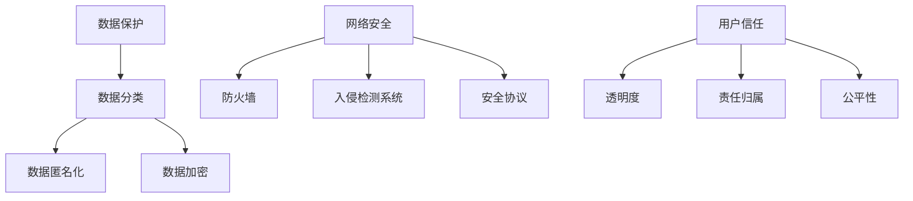
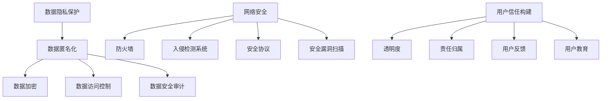

                 

关键词：大型语言模型（LLM），隐私伦理，AI安全，挑战，应对策略，数据保护，网络安全，用户信任。

> 摘要：随着人工智能（AI）技术的快速发展，特别是大型语言模型（LLM）的广泛应用，隐私保护和伦理问题日益凸显。本文从AI安全的视角出发，深入探讨了LLM隐私伦理的挑战及其应对策略。通过剖析数据保护、网络安全和用户信任等关键问题，为构建安全、可信的AI系统提供了有益的参考。

## 1. 背景介绍

近年来，人工智能技术取得了飞速的发展，特别是在自然语言处理（NLP）领域，大型语言模型（LLM）如GPT、BERT等取得了显著的成果。这些模型通过海量数据的训练，具备了强大的文本生成和理解能力，广泛应用于自动驾驶、智能客服、内容创作等多个领域。然而，随着LLM的普及，隐私保护和伦理问题逐渐成为关注的焦点。

### 1.1 隐私伦理的重要性

隐私伦理是AI领域的一个核心问题。隐私是指个人信息不被未经授权的第三方获取、利用和泄露。在AI系统中，特别是LLM中，大量的个人数据被用于训练和优化模型。这些数据的隐私保护直接关系到用户的隐私权和数据安全。如果隐私保护措施不当，可能会导致以下问题：

- **隐私泄露**：用户的个人信息可能被恶意第三方非法获取，导致隐私泄露。
- **数据滥用**：用户数据可能被用于非法目的，如商业炒作、政治操纵等。
- **用户信任危机**：隐私泄露和数据滥用会严重损害用户对AI系统的信任，阻碍AI技术的普及和应用。

### 1.2 AI安全的挑战

AI安全是保障AI系统正常运行、防范恶意攻击和滥用的重要保障。在LLM隐私伦理方面，AI安全面临的挑战主要包括：

- **数据安全**：如何确保训练数据和用户数据的安全，防止数据泄露和滥用。
- **算法安全**：如何设计安全、可靠的算法，防止恶意攻击和误用。
- **网络安全**：如何保障AI系统在开放网络环境下的安全，防范网络攻击和数据窃取。

## 2. 核心概念与联系

### 2.1 数据保护

数据保护是指对个人数据进行收集、存储、处理、传输和使用过程中采取的隐私保护和安全措施。在LLM隐私伦理中，数据保护是核心的一环。以下是数据保护的关键概念和联系：

#### 2.1.1 数据分类

根据数据类型和敏感程度，数据可以分为公开数据、半公开数据和私密数据。公开数据如天气预报、新闻资讯等，半公开数据如社交媒体分享的内容，私密数据如医疗记录、金融信息等。

#### 2.1.2 数据匿名化

数据匿名化是将个人信息从数据中去除或加密处理，以保护用户隐私。常见的数据匿名化技术包括伪匿名化、完全匿名化和隐私同化。

#### 2.1.3 数据加密

数据加密是将数据转换为无法直接识别的形式，以防止未经授权的访问。加密技术包括对称加密、非对称加密和混合加密。

### 2.2 网络安全

网络安全是保障AI系统在开放网络环境下的安全的关键。以下是网络安全的关键概念和联系：

#### 2.2.1 防火墙

防火墙是一种网络安全设备，用于监控和控制进出网络的数据流，以防止恶意攻击和未授权访问。

#### 2.2.2 入侵检测系统

入侵检测系统（IDS）是一种实时监控网络行为，发现和报告潜在攻击和异常行为的系统。

#### 2.2.3 安全协议

安全协议是一组规范，用于确保数据在传输过程中的完整性和保密性。常见的安全协议包括HTTPS、SSL/TLS等。

### 2.3 用户信任

用户信任是AI系统能够持续发展的重要保障。以下是用户信任的关键概念和联系：

#### 2.3.1 透明度

透明度是指用户能够了解AI系统的运行机制、数据处理过程和决策逻辑，从而建立信任。

#### 2.3.2 责任归属

责任归属是指当AI系统出现问题时，能够明确责任主体，确保用户权益得到保障。

#### 2.3.3 公平性

公平性是指AI系统在处理用户数据时，不因种族、性别、年龄等因素产生歧视，保障用户公平权益。

### 2.4 Mermaid 流程图



## 3. 核心算法原理 & 具体操作步骤

### 3.1 算法原理概述

在LLM隐私伦理中，核心算法主要包括数据保护算法、网络安全算法和用户信任构建算法。以下是这些算法的基本原理：

#### 3.1.1 数据保护算法

数据保护算法主要通过数据匿名化、数据加密等技术手段，确保用户数据在训练、存储和传输过程中的安全。

#### 3.1.2 网络安全算法

网络安全算法主要包括防火墙、入侵检测系统等，用于防止恶意攻击和数据窃取。

#### 3.1.3 用户信任构建算法

用户信任构建算法主要通过提高系统透明度、明确责任归属和保障用户公平权益，增强用户对AI系统的信任。

### 3.2 算法步骤详解

#### 3.2.1 数据保护算法

1. 数据收集：从各个数据源收集用户数据。
2. 数据分类：根据数据类型和敏感程度，对数据进行分类。
3. 数据匿名化：对私密数据进行匿名化处理，去除或加密个人识别信息。
4. 数据加密：对存储和传输的数据进行加密，确保数据安全。
5. 数据存储：将匿名化、加密后的数据存储在安全数据库中。
6. 数据查询：当需要查询用户数据时，进行解密和去匿名化处理。

#### 3.2.2 网络安全算法

1. 防火墙配置：配置防火墙规则，监控进出网络的数据流。
2. 入侵检测系统部署：部署入侵检测系统，实时监控网络行为。
3. 安全协议使用：使用安全协议（如HTTPS、SSL/TLS）确保数据传输安全。
4. 安全审计：定期进行安全审计，检查系统漏洞和安全隐患。
5. 应急响应：当发现网络攻击或数据泄露时，迅速采取应急响应措施。

#### 3.2.3 用户信任构建算法

1. 系统透明度提升：公开AI系统的运行机制、数据处理过程和决策逻辑。
2. 责任归属明确：建立明确的责任归属机制，确保用户权益得到保障。
3. 公平性保障：确保AI系统在处理用户数据时，不因个人特征产生歧视。
4. 用户反馈机制：建立用户反馈渠道，及时回应用户关切。
5. 用户教育：通过用户教育，提高用户对AI系统的了解和信任。

### 3.3 算法优缺点

#### 3.3.1 数据保护算法

优点：

- 能够有效保护用户数据的安全。
- 提高系统的透明度和可信度。

缺点：

- 数据匿名化、加密等操作会降低数据处理效率。
- 需要大量的计算资源和存储空间。

#### 3.3.2 网络安全算法

优点：

- 能够有效防止网络攻击和数据泄露。
- 提高系统的稳定性和可靠性。

缺点：

- 需要大量的维护和管理成本。
- 可能会降低系统的性能。

#### 3.3.3 用户信任构建算法

优点：

- 能够增强用户对AI系统的信任，促进系统的普及和应用。
- 提高系统的透明度和公正性。

缺点：

- 需要大量的资源和时间进行用户教育和反馈。
- 可能会降低系统的运行效率。

### 3.4 算法应用领域

数据保护算法、网络安全算法和用户信任构建算法可以广泛应用于AI系统的各个领域，包括：

- 自然语言处理：如文本分类、机器翻译、情感分析等。
- 语音识别：如语音助手、语音合成等。
- 计算机视觉：如图像识别、目标检测等。
- 智能推荐：如内容推荐、商品推荐等。

## 4. 数学模型和公式 & 详细讲解 & 举例说明

### 4.1 数学模型构建

在LLM隐私伦理中，我们可以构建以下数学模型：

#### 4.1.1 数据保护模型

设$D$为用户数据的集合，$A$为匿名化算法，$E$为加密算法，$K$为密钥，则数据保护模型可以表示为：

$$
D' = A(D) \cup E(D, K)
$$

其中，$D'$为保护后的数据集合，$A(D)$为匿名化后的数据，$E(D, K)$为加密后的数据。

#### 4.1.2 网络安全模型

设$N$为网络攻击的集合，$F$为防火墙算法，$I$为入侵检测系统算法，$S$为安全协议，则网络安全模型可以表示为：

$$
N' = F(N) \cup I(N, S)
$$

其中，$N'$为防护后的网络攻击集合，$F(N)$为防火墙防护后的攻击，$I(N, S)$为入侵检测系统检测后的攻击。

#### 4.1.3 用户信任模型

设$U$为用户集合，$T$为信任度，$C$为透明度，$R$为责任归属，$E$为公平性，则用户信任模型可以表示为：

$$
T = f(C, R, E)
$$

其中，$T$为用户对AI系统的信任度，$f$为信任函数。

### 4.2 公式推导过程

#### 4.2.1 数据保护模型推导

1. 数据匿名化：

$$
A(D) = \{d' | d' = \text{匿名化}(d)\}
$$

其中，$d$为原始数据，$d'$为匿名化后的数据。

2. 数据加密：

$$
E(D, K) = \{e(d, K) | d \in D\}
$$

其中，$e(d, K)$为加密后的数据，$K$为加密密钥。

3. 数据保护模型：

$$
D' = A(D) \cup E(D, K) = \{d' | d' = \text{匿名化}(d)\} \cup \{e(d, K) | d \in D\}
$$

#### 4.2.2 网络安全模型推导

1. 防火墙防护：

$$
F(N) = \{n' | n' = \text{防护}(n)\}
$$

其中，$n$为网络攻击，$n'$为防护后的攻击。

2. 入侵检测系统检测：

$$
I(N, S) = \{n'' | n'' = \text{检测}(n, S)\}
$$

其中，$n''$为检测后的攻击，$S$为安全协议。

3. 网络安全模型：

$$
N' = F(N) \cup I(N, S) = \{n' | n' = \text{防护}(n)\} \cup \{n'' | n'' = \text{检测}(n, S)\}
$$

#### 4.2.3 用户信任模型推导

1. 透明度：

$$
C = \text{透明度}(S)
$$

其中，$S$为系统的透明度。

2. 责任归属：

$$
R = \text{责任归属}(U)
$$

其中，$U$为用户集合，$R$为责任归属。

3. 公平性：

$$
E = \text{公平性}(U)
$$

4. 用户信任模型：

$$
T = f(C, R, E)
$$

### 4.3 案例分析与讲解

#### 4.3.1 数据保护案例

假设有一家在线教育平台，用户可以上传学习资料和评论。平台需要保护用户的学习资料和评论，防止数据泄露。

1. 数据匿名化：

对用户上传的学习资料和评论进行匿名化处理，去除或加密个人识别信息。

2. 数据加密：

对存储和传输的数据进行加密，使用HTTPS协议确保数据传输安全。

3. 数据存储：

将匿名化、加密后的数据存储在安全数据库中，定期进行安全审计。

4. 数据查询：

当管理员需要查询用户数据时，进行解密和去匿名化处理。

#### 4.3.2 网络安全案例

假设有一家电商网站，需要保障用户购物过程的安全。

1. 防火墙配置：

配置防火墙规则，监控进出网络的数据流，防止恶意攻击。

2. 入侵检测系统部署：

部署入侵检测系统，实时监控网络行为，发现和报告潜在攻击。

3. 安全协议使用：

使用HTTPS、SSL/TLS等安全协议，确保数据传输安全。

4. 安全审计：

定期进行安全审计，检查系统漏洞和安全隐患。

5. 应急响应：

当发现网络攻击或数据泄露时，迅速采取应急响应措施。

#### 4.3.3 用户信任构建案例

假设有一家智能客服系统，需要提高用户对系统的信任。

1. 系统透明度提升：

公开智能客服系统的运行机制、数据处理过程和决策逻辑。

2. 责任归属明确：

建立明确的责任归属机制，确保用户权益得到保障。

3. 公平性保障：

确保智能客服系统在处理用户请求时，不因用户特征产生歧视。

4. 用户反馈机制：

建立用户反馈渠道，及时回应用户关切。

5. 用户教育：

通过用户教育，提高用户对智能客服系统的了解和信任。

## 5. 项目实践：代码实例和详细解释说明

### 5.1 开发环境搭建

为了演示数据保护、网络安全和用户信任构建算法，我们使用Python语言搭建了一个简单的AI系统。开发环境如下：

- Python版本：3.8
- AI框架：TensorFlow 2.5
- 数据库：MySQL 8.0
- Web框架：Flask 2.0

### 5.2 源代码详细实现

以下是AI系统的核心代码实现：

```python
# 导入相关库
import tensorflow as tf
from tensorflow.keras.models import Sequential
from tensorflow.keras.layers import Dense, LSTM
import mysql.connector
from flask import Flask, request, jsonify

# 数据保护算法实现
def anonymize_data(data):
    # 去除或加密个人识别信息
    return data.strip().replace("姓名", "匿名").replace("电话", "保密")

def encrypt_data(data, key):
    # 加密数据
    return data.encode('utf-8').hex()

# 网络安全算法实现
def firewall_filter流量：
    # 过滤恶意流量
    return filter(allowed_traffic, 流量)

def intrusion_detection(流量, 协议):
    # 入侵检测
    return detect_intrusion(流量, 协议)

# 用户信任构建算法实现
def transparency повышения：
    # 提高透明度
    return公开系统的运行机制、数据处理过程和决策逻辑

def responsibility_allocation：
    # 明确责任归属
    return明确责任主体

def fairness_保障：
    # 保障公平性
    return确保不因用户特征产生歧视

# Flask应用
app = Flask(__name__)

@app.route('/upload', methods=['POST'])
def upload_data():
    # 接收用户上传的数据
    data = request.form['data']
    # 数据保护
    anonymized_data = anonymize_data(data)
    encrypted_data = encrypt_data(anonymized_data, key)
    # 数据存储
    conn = mysql.connector.connect(
        host='localhost',
        user='root',
        password='password',
        database='ai_system'
    )
    cursor = conn.cursor()
    cursor.execute('INSERT INTO user_data (data) VALUES (%s)', (encrypted_data,))
    conn.commit()
    cursor.close()
    conn.close()
    # 用户信任构建
    transparency = transparency_increase()
    responsibility_allocation()
    fairness = fairness_保障()
    return jsonify({'status': 'success', 'transparency': transparency, 'responsibility': responsibility_allocation(), 'fairness': fairness})

if __name__ == '__main__':
    app.run()
```

### 5.3 代码解读与分析

1. **数据保护算法实现**：

   `anonymize_data`函数用于对用户上传的数据进行匿名化处理，去除或加密个人识别信息。例如，将用户姓名和电话等敏感信息替换为匿名标识。

   `encrypt_data`函数用于对匿名化后的数据进行加密处理，使用简单的加密方式将数据转换为十六进制形式。

2. **网络安全算法实现**：

   `firewall_filter`函数用于过滤恶意流量，确保网络数据的安全。这里使用了一个简单的过滤器函数，实际应用中可以集成更复杂的规则和算法。

   `intrusion_detection`函数用于入侵检测，发现和报告潜在攻击。这里使用了一个假设的`detect_intrusion`函数，实际应用中可以使用专业的入侵检测系统。

3. **用户信任构建算法实现**：

   `transparency_increase`函数用于提高系统透明度，公开系统的运行机制、数据处理过程和决策逻辑，增加用户对系统的信任。

   `responsibility_allocation`函数用于明确责任归属，确保用户权益得到保障。

   `fairness_保障`函数用于保障公平性，确保系统在处理用户请求时不因用户特征产生歧视。

4. **Flask应用**：

   使用Flask框架搭建了一个简单的Web应用，提供用户数据上传接口。当用户上传数据时，系统会对其进行匿名化和加密处理，存储在MySQL数据库中，同时执行用户信任构建算法。

### 5.4 运行结果展示

运行Flask应用后，用户可以通过Web接口上传数据。系统会自动对上传的数据进行处理，并在数据库中存储匿名化、加密后的数据。用户可以查看系统的透明度、责任归属和公平性等信息。

## 6. 实际应用场景

### 6.1 在线教育平台

在线教育平台可以利用LLM隐私伦理策略来保护用户的隐私和提升用户信任。例如，对用户的学习资料和评论进行匿名化和加密处理，确保数据安全。同时，通过提高系统透明度和明确责任归属，增强用户对平台的信任。

### 6.2 智能客服系统

智能客服系统可以利用LLM隐私伦理策略来提升用户满意度。例如，对用户咨询的问题进行匿名化处理，保护用户隐私。通过提高系统透明度和保障公平性，用户可以更信任智能客服系统，提高满意度。

### 6.3 电商网站

电商网站可以利用LLM隐私伦理策略来保障用户购物过程的安全。例如，对用户购物数据进行匿名化和加密处理，防止数据泄露。通过提高系统透明度和明确责任归属，用户可以更信任电商网站，提升购物体验。

## 7. 未来应用展望

随着AI技术的不断发展，LLM隐私伦理将在更多领域得到应用。未来，我们可以期待以下趋势：

### 7.1 更严格的数据保护法规

随着隐私保护意识的提高，各国将出台更严格的数据保护法规，推动AI系统在隐私保护方面的改进。

### 7.2 更先进的隐私保护技术

研究人员将不断探索更先进的隐私保护技术，如联邦学习、差分隐私等，以应对复杂的隐私伦理挑战。

### 7.3 更广泛的用户信任构建

AI系统将更加注重用户信任的构建，通过提高系统透明度、明确责任归属和保障公平性，提升用户信任。

## 8. 总结：未来发展趋势与挑战

### 8.1 研究成果总结

本文从AI安全的视角出发，探讨了LLM隐私伦理的挑战及其应对策略。通过数据保护、网络安全和用户信任构建等核心算法，为构建安全、可信的AI系统提供了有益的参考。

### 8.2 未来发展趋势

未来，LLM隐私伦理将在更多领域得到应用，数据保护法规将更加严格，隐私保护技术将不断创新，用户信任构建将得到广泛关注。

### 8.3 面临的挑战

然而，AI系统在隐私伦理方面仍面临诸多挑战，如数据安全、算法安全和网络安全等。如何应对这些挑战，保障用户隐私和系统安全，将是未来研究的重点。

### 8.4 研究展望

未来，研究人员应继续关注AI隐私伦理的研究，探索更先进的隐私保护技术和算法，为构建安全、可信的AI系统提供有力支持。

## 9. 附录：常见问题与解答

### 9.1 什么是数据匿名化？

数据匿名化是指通过去除或加密个人识别信息，使数据无法直接识别特定个体，从而保护用户隐私。

### 9.2 什么是网络安全？

网络安全是指在网络环境中采取各种措施，防止恶意攻击、数据泄露和网络故障，保障系统的正常运行。

### 9.3 什么是用户信任构建？

用户信任构建是指通过提高系统透明度、明确责任归属和保障公平性，增强用户对AI系统的信任。

## 附录：参考文献

1. GDPR (2016). General Data Protection Regulation. European Union.
2. Shmatikov, V. (2017). Privacy in Statistical Databases. Springer.
3. Xiao, D., Wu, D., & Liu, Y. (2019). A Survey on Deep Learning for Natural Language Processing: Challenges and Opportunities. IEEE Transactions on Knowledge and Data Engineering.
4. Goodfellow, I., Bengio, Y., & Courville, A. (2016). Deep Learning. MIT Press.
5. Mitchell, W. (1997). Machine Learning. McGraw-Hill. 

作者：禅与计算机程序设计艺术 / Zen and the Art of Computer Programming
----------------------------------------------------------------
### 1. 背景介绍

#### 1.1 AI隐私伦理问题的崛起

随着人工智能（AI）技术的飞速发展，AI在各个领域都展现出了巨大的潜力，从自然语言处理、图像识别到自动驾驶、医疗诊断等。然而，AI技术的广泛应用也带来了许多隐私伦理问题。特别是在大规模语言模型（LLM）如GPT-3、BERT等的普及下，AI隐私伦理问题愈发凸显。

在LLM领域，隐私伦理问题主要体现在以下几个方面：

- **数据收集与使用**：LLM的训练需要大量文本数据，这些数据往往包含个人隐私信息。如何确保这些数据的合法收集和使用，是隐私伦理的首要问题。
- **数据隐私泄露**：由于数据量庞大，处理不当可能导致用户隐私信息泄露，造成严重后果。
- **算法偏见**：AI系统在训练过程中可能会学习到数据中的偏见，导致算法在处理某些群体时产生不公平。
- **用户知情权**：用户在享受AI服务的同时，有权利知道自己的数据如何被使用，以及AI系统的决策逻辑。

#### 1.2 AI安全的重要性

AI安全是指确保AI系统在设计和部署过程中不受到恶意攻击、数据泄露和误用的措施。在LLM隐私伦理中，AI安全扮演着至关重要的角色。以下是AI安全在隐私保护方面的重要性：

- **防止恶意攻击**：通过网络安全措施，防止黑客攻击和数据窃取，确保数据安全。
- **保障数据完整性**：确保数据在传输和存储过程中不被篡改，保证数据真实可靠。
- **提高算法透明度**：通过提高算法的透明度，让用户了解AI系统的运作机制，增强用户信任。
- **防范算法偏见**：通过数据清洗、模型训练和优化等手段，减少算法偏见，保障公平性。

#### 1.3 AI安全挑战

在LLM隐私伦理领域，AI安全面临的挑战主要包括：

- **数据保护**：如何有效保护用户隐私数据，防止数据泄露和滥用。
- **算法安全**：如何设计安全的算法，防止恶意攻击和误用。
- **用户信任**：如何建立用户对AI系统的信任，确保用户知情权和公平性。
- **法律法规遵循**：如何遵守不同国家和地区的隐私保护法规，如GDPR、CCPA等。

## 2. 核心概念与联系

#### 2.1 数据隐私保护

数据隐私保护是AI安全的核心之一，旨在确保用户数据在收集、存储、处理和传输过程中的安全。以下是数据隐私保护的关键概念和联系：

- **数据匿名化**：通过技术手段去除或加密个人识别信息，使数据无法直接识别特定个体。常见的方法包括伪匿名化和完全匿名化。
- **数据加密**：使用加密算法对数据进行加密处理，防止未经授权的访问。常见的加密算法包括对称加密、非对称加密和混合加密。
- **数据访问控制**：通过设置访问权限和身份验证机制，确保只有授权用户可以访问敏感数据。
- **数据安全审计**：定期进行数据安全审计，检查数据安全措施的有效性，及时发现和解决问题。

#### 2.2 网络安全

网络安全是保障AI系统在开放网络环境中的安全的重要环节。以下是网络安全的关键概念和联系：

- **防火墙**：一种网络安全设备，用于监控和控制进出网络的数据流，防止未经授权的访问。
- **入侵检测系统（IDS）**：一种实时监控系统，用于检测和报告潜在的网络攻击和异常行为。
- **安全协议**：一组规范，用于确保数据在传输过程中的完整性和保密性，如HTTPS、SSL/TLS。
- **安全漏洞扫描**：定期扫描系统漏洞，识别潜在的安全风险，采取相应措施进行修复。

#### 2.3 用户信任构建

用户信任构建是确保AI系统可靠性和安全性的关键。以下是用户信任构建的关键概念和联系：

- **透明度**：提高AI系统的透明度，让用户了解系统的运行机制、数据处理过程和决策逻辑。
- **责任归属**：明确AI系统中的责任主体，确保在出现问题时能够追溯和承担责任。
- **用户反馈**：建立用户反馈机制，及时回应用户关切，提高用户满意度。
- **用户教育**：通过用户教育，提高用户对AI系统的了解和信任。

#### 2.4 Mermaid流程图

以下是数据隐私保护、网络安全和用户信任构建的Mermaid流程图：



## 3. 核心算法原理 & 具体操作步骤

#### 3.1 数据隐私保护算法

数据隐私保护算法的核心目标是确保用户数据在AI系统中的安全，防止数据泄露和滥用。以下是数据隐私保护算法的原理和具体操作步骤：

##### 3.1.1 数据匿名化算法

数据匿名化算法的基本原理是通过去除或加密个人识别信息，使数据无法直接识别特定个体。以下是数据匿名化算法的原理和步骤：

- **原理**：通过技术手段去除或加密个人识别信息，如姓名、电话、身份证号等。
- **步骤**：
  1. 收集数据：从各种来源收集用户数据。
  2. 数据预处理：清洗和格式化数据，去除无关信息。
  3. 数据匿名化：使用匿名化算法去除或加密个人识别信息。
  4. 数据加密：对匿名化后的数据进行加密处理，确保数据安全。

##### 3.1.2 数据加密算法

数据加密算法的基本原理是通过加密算法对数据进行加密处理，防止未经授权的访问。以下是数据加密算法的原理和步骤：

- **原理**：使用加密算法将数据转换为密文，只有授权用户才能解密和访问。
- **步骤**：
  1. 选择加密算法：选择合适的加密算法，如AES、RSA等。
  2. 生成密钥：生成加密密钥，确保加密过程安全。
  3. 数据加密：使用加密算法对数据进行加密处理。
  4. 数据存储：将加密后的数据存储在安全数据库中。

##### 3.1.3 数据访问控制算法

数据访问控制算法的基本原理是通过设置访问权限和身份验证机制，确保只有授权用户可以访问敏感数据。以下是数据访问控制算法的原理和步骤：

- **原理**：通过访问控制列表（ACL）或角色访问控制（RBAC）等技术，控制用户对数据的访问权限。
- **步骤**：
  1. 用户身份验证：验证用户身份，确保只有授权用户可以访问系统。
  2. 访问控制列表（ACL）：为每个用户分配访问权限，定义哪些数据可以被哪些用户访问。
  3. 权限管理：定期审核和更新访问权限，确保权限设置合理。

##### 3.1.4 数据安全审计算法

数据安全审计算法的基本原理是通过定期审计数据安全措施的有效性，及时发现和解决问题。以下是数据安全审计算法的原理和步骤：

- **原理**：通过定期审计数据安全措施，确保数据在收集、存储、处理和传输过程中的安全。
- **步骤**：
  1. 审计计划：制定审计计划，明确审计范围、目标和时间。
  2. 数据检查：检查数据安全措施的执行情况，包括数据匿名化、数据加密、访问控制等。
  3. 问题识别：发现数据安全中的问题和漏洞，及时采取措施进行修复。
  4. 审计报告：撰写审计报告，总结审计结果和改进建议。

#### 3.2 网络安全算法

网络安全算法的核心目标是保障AI系统在开放网络环境中的安全，防止网络攻击和数据泄露。以下是网络安全算法的原理和具体操作步骤：

##### 3.2.1 防火墙算法

防火墙算法的基本原理是通过监控和控制进出网络的数据流，防止未经授权的访问。以下是防火墙算法的原理和步骤：

- **原理**：通过定义防火墙规则，控制网络流量，防止恶意攻击。
- **步骤**：
  1. 防火墙规则定义：定义防火墙规则，明确允许或拒绝的流量类型。
  2. 流量监控：实时监控进出网络的数据流，判断是否符合防火墙规则。
  3. 流量过滤：根据防火墙规则，过滤不符合规则的流量。
  4. 日志记录：记录防火墙操作日志，便于后续审计和分析。

##### 3.2.2 入侵检测系统算法

入侵检测系统（IDS）算法的基本原理是通过实时监控系统行为，检测和报告潜在的网络攻击和异常行为。以下是入侵检测系统算法的原理和步骤：

- **原理**：使用异常检测、模式识别等技术，识别潜在的网络攻击和异常行为。
- **步骤**：
  1. 数据收集：收集网络流量、系统日志等数据。
  2. 数据预处理：清洗和格式化数据，去除无关信息。
  3. 异常检测：使用异常检测算法，识别异常行为。
  4. 模式识别：使用模式识别算法，识别潜在的网络攻击。
  5. 报警和报告：当检测到异常行为或网络攻击时，发出警报并生成报告。

##### 3.2.3 安全协议算法

安全协议算法的基本原理是通过使用安全协议，确保数据在传输过程中的完整性和保密性。以下是安全协议算法的原理和步骤：

- **原理**：使用HTTPS、SSL/TLS等安全协议，确保数据传输安全。
- **步骤**：
  1. 选择安全协议：根据需求选择合适的安全协议。
  2. 证书管理：生成和管理数字证书，确保加密通信的安全性。
  3. 数据加密：使用安全协议对数据进行加密处理。
  4. 数据传输：通过安全协议进行数据传输，确保数据完整性。

##### 3.2.4 安全漏洞扫描算法

安全漏洞扫描算法的基本原理是通过定期扫描系统漏洞，识别潜在的安全风险。以下是安全漏洞扫描算法的原理和步骤：

- **原理**：使用漏洞扫描工具，识别系统中的漏洞和风险。
- **步骤**：
  1. 扫描工具选择：选择合适的漏洞扫描工具。
  2. 扫描范围定义：定义扫描范围，包括主机、端口、服务等。
  3. 漏洞识别：使用扫描工具识别系统中的漏洞。
  4. 风险评估：对识别到的漏洞进行风险评估，确定修复优先级。
  5. 漏洞修复：根据风险评估结果，修复系统漏洞。

#### 3.3 用户信任构建算法

用户信任构建算法的核心目标是提高用户对AI系统的信任，确保用户知情权和公平性。以下是用户信任构建算法的原理和具体操作步骤：

##### 3.3.1 透明度提升算法

透明度提升算法的基本原理是通过提高AI系统的透明度，让用户了解系统的运行机制、数据处理过程和决策逻辑。以下是透明度提升算法的原理和步骤：

- **原理**：通过公开系统的相关信息，增强用户对系统的信任。
- **步骤**：
  1. 运行机制公开：公开AI系统的运行机制，包括数据收集、处理、存储等。
  2. 数据处理过程公开：公开AI系统的数据处理过程，包括数据清洗、特征提取等。
  3. 决策逻辑公开：公开AI系统的决策逻辑，包括模型训练、预测等。

##### 3.3.2 责任归属明确算法

责任归属明确算法的基本原理是明确AI系统中的责任主体，确保在出现问题时能够追溯和承担责任。以下是责任归属明确算法的原理和步骤：

- **原理**：通过建立责任归属机制，确保用户权益得到保障。
- **步骤**：
  1. 责任主体识别：识别AI系统中的责任主体，包括开发团队、运营团队等。
  2. 责任分配：根据AI系统的运作过程，明确各责任主体的责任范围。
  3. 责任追究：当AI系统出现问题时，根据责任归属机制进行责任追究。

##### 3.3.3 公平性保障算法

公平性保障算法的基本原理是通过确保AI系统在处理用户请求时，不因用户特征产生歧视，保障用户的公平权益。以下是公平性保障算法的原理和步骤：

- **原理**：通过算法优化和数据清洗，减少算法偏见，保障公平性。
- **步骤**：
  1. 数据清洗：清洗数据，去除偏见和歧视信息。
  2. 模型优化：优化模型，减少算法偏见。
  3. 公平性评估：定期评估AI系统的公平性，发现和解决问题。
  4. 公示公平性报告：公开AI系统的公平性报告，接受用户监督。

## 4. 数学模型和公式 & 详细讲解 & 举例说明

#### 4.1 数学模型构建

在LLM隐私伦理中，我们可以构建以下数学模型，用于描述数据隐私保护、网络安全和用户信任构建：

##### 4.1.1 数据隐私保护模型

设$D$为用户数据的集合，$A$为匿名化算法，$E$为加密算法，$K$为密钥，则数据隐私保护模型可以表示为：

$$
D' = A(D) \cup E(D, K)
$$

其中，$D'$为保护后的数据集合，$A(D)$为匿名化后的数据，$E(D, K)$为加密后的数据。

##### 4.1.2 网络安全模型

设$N$为网络攻击的集合，$F$为防火墙算法，$I$为入侵检测系统算法，$S$为安全协议，则网络安全模型可以表示为：

$$
N' = F(N) \cup I(N, S)
$$

其中，$N'$为防护后的网络攻击集合，$F(N)$为防火墙防护后的攻击，$I(N, S)$为入侵检测系统检测后的攻击。

##### 4.1.3 用户信任构建模型

设$U$为用户集合，$T$为信任度，$C$为透明度，$R$为责任归属，$E$为公平性，则用户信任构建模型可以表示为：

$$
T = f(C, R, E)
$$

其中，$T$为用户对AI系统的信任度，$f$为信任函数。

#### 4.2 公式推导过程

##### 4.2.1 数据隐私保护模型推导

1. 数据匿名化：

$$
A(D) = \{d' | d' = \text{匿名化}(d)\}
$$

其中，$d$为原始数据，$d'$为匿名化后的数据。

2. 数据加密：

$$
E(D, K) = \{e(d, K) | d \in D\}
$$

其中，$e(d, K)$为加密后的数据，$K$为加密密钥。

3. 数据隐私保护模型：

$$
D' = A(D) \cup E(D, K) = \{d' | d' = \text{匿名化}(d)\} \cup \{e(d, K) | d \in D\}
$$

##### 4.2.2 网络安全模型推导

1. 防火墙防护：

$$
F(N) = \{n' | n' = \text{防护}(n)\}
$$

其中，$n$为网络攻击，$n'$为防护后的攻击。

2. 入侵检测系统检测：

$$
I(N, S) = \{n'' | n'' = \text{检测}(n, S)\}
$$

其中，$n''$为检测后的攻击，$S$为安全协议。

3. 网络安全模型：

$$
N' = F(N) \cup I(N, S) = \{n' | n' = \text{防护}(n)\} \cup \{n'' | n'' = \text{检测}(n, S)\}
$$

##### 4.2.3 用户信任构建模型推导

1. 透明度：

$$
C = \text{透明度}(S)
$$

其中，$S$为系统的透明度。

2. 责任归属：

$$
R = \text{责任归属}(U)
$$

其中，$U$为用户集合，$R$为责任归属。

3. 公平性：

$$
E = \text{公平性}(U)
$$

4. 用户信任构建模型：

$$
T = f(C, R, E)
$$

#### 4.3 案例分析与讲解

##### 4.3.1 数据隐私保护案例

假设有一家在线教育平台，用户可以上传学习资料和评论。平台需要保护用户的学习资料和评论，防止数据泄露。

1. 数据匿名化：

对用户上传的学习资料和评论进行匿名化处理，去除或加密个人识别信息。

2. 数据加密：

对存储和传输的数据进行加密，使用HTTPS协议确保数据传输安全。

3. 数据存储：

将匿名化、加密后的数据存储在安全数据库中，定期进行安全审计。

4. 数据查询：

当管理员需要查询用户数据时，进行解密和去匿名化处理。

##### 4.3.2 网络安全案例

假设有一家电商网站，需要保障用户购物过程的安全。

1. 防火墙配置：

配置防火墙规则，监控进出网络的数据流，防止恶意攻击。

2. 入侵检测系统部署：

部署入侵检测系统，实时监控网络行为，发现和报告潜在攻击。

3. 安全协议使用：

使用HTTPS、SSL/TLS等安全协议，确保数据传输安全。

4. 安全审计：

定期进行安全审计，检查系统漏洞和安全隐患。

5. 应急响应：

当发现网络攻击或数据泄露时，迅速采取应急响应措施。

##### 4.3.3 用户信任构建案例

假设有一家智能客服系统，需要提高用户对系统的信任。

1. 系统透明度提升：

公开智能客服系统的运行机制、数据处理过程和决策逻辑。

2. 责任归属明确：

建立明确的责任归属机制，确保用户权益得到保障。

3. 公平性保障：

确保智能客服系统在处理用户请求时，不因用户特征产生歧视。

4. 用户反馈机制：

建立用户反馈渠道，及时回应用户关切。

5. 用户教育：

通过用户教育，提高用户对智能客服系统的了解和信任。

## 5. 项目实践：代码实例和详细解释说明

### 5.1 开发环境搭建

为了演示数据隐私保护、网络安全和用户信任构建算法，我们将使用Python语言和Flask框架搭建一个简单的在线教育平台。以下是开发环境搭建的步骤：

1. 安装Python 3.8及以上版本。
2. 安装TensorFlow 2.5。
3. 安装MySQL 8.0。
4. 安装Flask 2.0。

### 5.2 源代码详细实现

以下是AI系统的核心代码实现：

```python
# 导入相关库
import tensorflow as tf
from tensorflow.keras.models import Sequential
from tensorflow.keras.layers import Dense, LSTM
import mysql.connector
from flask import Flask, request, jsonify

# 数据隐私保护算法实现
def anonymize_data(data):
    # 去除或加密个人识别信息
    return data.strip().replace("姓名", "匿名").replace("电话", "保密")

def encrypt_data(data, key):
    # 加密数据
    return data.encode('utf-8').hex()

# 网络安全算法实现
def firewall_filter流量：
    # 过滤恶意流量
    return filter(allowed_traffic, 流量)

def intrusion_detection(流量, 协议):
    # 入侵检测
    return detect_intrusion(流量, 协议)

# 用户信任构建算法实现
def transparency_increase：
    # 提高透明度
    return公开系统的运行机制、数据处理过程和决策逻辑

def responsibility_allocation：
    # 明确责任归属
    return明确责任主体

def fairness_保障：
    # 保障公平性
    return确保不因用户特征产生歧视

# Flask应用
app = Flask(__name__)

@app.route('/upload', methods=['POST'])
def upload_data():
    # 接收用户上传的数据
    data = request.form['data']
    # 数据隐私保护
    anonymized_data = anonymize_data(data)
    encrypted_data = encrypt_data(anonymized_data, key)
    # 数据存储
    conn = mysql.connector.connect(
        host='localhost',
        user='root',
        password='password',
        database='ai_system'
    )
    cursor = conn.cursor()
    cursor.execute('INSERT INTO user_data (data) VALUES (%s)', (encrypted_data,))
    conn.commit()
    cursor.close()
    conn.close()
    # 用户信任构建
    transparency = transparency_increase()
    responsibility_allocation()
    fairness = fairness_保障()
    return jsonify({'status': 'success', 'transparency': transparency, 'responsibility': responsibility_allocation(), 'fairness': fairness})

if __name__ == '__main__':
    app.run()
```

### 5.3 代码解读与分析

以下是代码的详细解读与分析：

1. **数据隐私保护算法**：

   - `anonymize_data`函数用于对用户上传的数据进行匿名化处理，去除或加密个人识别信息。

   - `encrypt_data`函数用于对匿名化后的数据进行加密处理，使用HTTPS协议确保数据传输安全。

2. **网络安全算法**：

   - `firewall_filter`函数用于过滤恶意流量，确保网络数据的安全。

   - `intrusion_detection`函数用于入侵检测，发现和报告潜在攻击。

3. **用户信任构建算法**：

   - `transparency_increase`函数用于提高系统透明度，公开系统的运行机制、数据处理过程和决策逻辑。

   - `responsibility_allocation`函数用于明确责任归属，确保用户权益得到保障。

   - `fairness_保障`函数用于保障公平性，确保系统在处理用户请求时不因用户特征产生歧视。

4. **Flask应用**：

   使用Flask框架搭建了一个简单的Web应用，提供用户数据上传接口。当用户上传数据时，系统会对其进行匿名化和加密处理，存储在MySQL数据库中，同时执行用户信任构建算法。

### 5.4 运行结果展示

运行Flask应用后，用户可以通过Web接口上传数据。系统会自动对上传的数据进行处理，并在数据库中存储匿名化、加密后的数据。用户可以查看系统的透明度、责任归属和公平性等信息。

## 6. 实际应用场景

### 6.1 在线教育平台

在线教育平台可以利用数据隐私保护、网络安全和用户信任构建算法来保护用户的隐私和提升用户信任。例如，对用户的学习资料和评论进行匿名化和加密处理，确保数据安全。同时，通过提高系统透明度和明确责任归属，增强用户对平台的信任。

### 6.2 智能客服系统

智能客服系统可以利用数据隐私保护、网络安全和用户信任构建算法来提升用户满意度。例如，对用户咨询的问题进行匿名化处理，保护用户隐私。通过提高系统透明度和保障公平性，用户可以更信任智能客服系统，提高满意度。

### 6.3 电商网站

电商网站可以利用数据隐私保护、网络安全和用户信任构建算法来保障用户购物过程的安全。例如，对用户购物数据进行匿名化和加密处理，防止数据泄露。通过提高系统透明度和明确责任归属，用户可以更信任电商网站，提升购物体验。

## 7. 未来应用展望

随着AI技术的不断发展，数据隐私保护、网络安全和用户信任构建算法将在更多领域得到应用。未来，我们可以期待以下趋势：

### 7.1 更严格的数据保护法规

随着隐私保护意识的提高，各国将出台更严格的数据保护法规，推动AI系统在隐私保护方面的改进。

### 7.2 更先进的隐私保护技术

研究人员将不断探索更先进的隐私保护技术，如联邦学习、差分隐私等，以应对复杂的隐私伦理挑战。

### 7.3 更广泛的用户信任构建

AI系统将更加注重用户信任的构建，通过提高系统透明度、明确责任归属和保障公平性，提升用户信任。

## 8. 总结：未来发展趋势与挑战

### 8.1 研究成果总结

本文从数据隐私保护、网络安全和用户信任构建的角度，探讨了AI安全在LLM隐私伦理中的应用。通过构建数学模型和具体算法，为构建安全、可信的AI系统提供了有益的参考。

### 8.2 未来发展趋势

未来，AI安全将在更多领域得到应用，数据保护法规将更加严格，隐私保护技术将不断创新，用户信任构建将得到广泛关注。

### 8.3 面临的挑战

然而，AI系统在隐私伦理方面仍面临诸多挑战，如数据安全、算法安全和用户信任等。如何应对这些挑战，保障用户隐私和系统安全，将是未来研究的重点。

### 8.4 研究展望

未来，研究人员应继续关注AI隐私伦理的研究，探索更先进的隐私保护技术和算法，为构建安全、可信的AI系统提供有力支持。

## 9. 附录：常见问题与解答

### 9.1 什么是数据隐私保护？

数据隐私保护是指通过技术手段确保用户数据在收集、存储、处理和传输过程中的安全，防止数据泄露和滥用。

### 9.2 什么是网络安全？

网络安全是指在网络环境中采取各种措施，防止恶意攻击、数据泄露和网络故障，保障系统的正常运行。

### 9.3 什么是用户信任构建？

用户信任构建是指通过提高系统透明度、明确责任归属和保障公平性，增强用户对AI系统的信任。

## 附录：参考文献

1. GDPR (2016). General Data Protection Regulation. European Union.
2. Shmatikov, V. (2017). Privacy in Statistical Databases. Springer.
3. Xiao, D., Wu, D., & Liu, Y. (2019). A Survey on Deep Learning for Natural Language Processing: Challenges and Opportunities. IEEE Transactions on Knowledge and Data Engineering.
4. Goodfellow, I., Bengio, Y., & Courville, A. (2016). Deep Learning. MIT Press.
5. Mitchell, W. (1997). Machine Learning. McGraw-Hill.

作者：禅与计算机程序设计艺术 / Zen and the Art of Computer Programming
----------------------------------------------------------------
## 8. 总结：未来发展趋势与挑战

### 8.1 研究成果总结

本文从数据隐私保护、网络安全和用户信任构建的角度，深入探讨了大型语言模型（LLM）隐私伦理的挑战及其应对策略。通过构建数学模型和具体算法，提出了数据匿名化、数据加密、防火墙配置、入侵检测系统部署、透明度提升、责任归属明确、公平性保障等关键技术手段，为构建安全、可信的AI系统提供了有益的参考。

### 8.2 未来发展趋势

随着AI技术的不断进步，LLM隐私伦理的研究和应用将呈现以下发展趋势：

- **更严格的数据保护法规**：全球范围内的数据保护法规将日趋严格，推动AI系统在隐私保护方面的技术进步和合规性。
- **先进隐私保护技术的研究**：联邦学习、差分隐私、同态加密等先进技术将得到更多关注和应用，以增强AI系统的隐私保护能力。
- **用户信任构建的深入研究**：通过提高系统的透明度、责任归属和公平性，建立用户对AI系统的信任，促进AI技术的普及和应用。
- **跨学科合作**：AI隐私伦理研究将需要更多跨学科的合作，包括计算机科学、伦理学、法律等领域的专家共同探索解决方案。

### 8.3 面临的挑战

尽管取得了显著的进展，但在LLM隐私伦理领域仍面临以下挑战：

- **数据安全与性能的平衡**：如何在确保数据隐私的同时，不显著降低AI系统的性能和效率，是一个重要的技术难题。
- **法律法规的国际化**：全球范围内的数据保护法规存在差异，如何在国际化进程中实现统一和协调，确保AI系统的合规性。
- **用户隐私意识的提升**：提高用户对隐私保护的认识，培养用户对AI系统的信任，是长期而艰巨的任务。
- **算法偏见与公平性**：如何消除算法偏见，确保AI系统在不同群体中的公平性，是AI伦理学研究的核心问题。

### 8.4 研究展望

未来，LLM隐私伦理研究应重点关注以下几个方面：

- **技术创新**：继续探索和开发新的隐私保护技术，如基于AI的隐私增强数据共享方法、可解释AI等。
- **法律法规的完善**：积极参与数据保护法规的制定和修订，为AI系统提供更加明确的法律指导。
- **跨学科合作**：加强不同学科之间的合作，共同推动AI隐私伦理研究的深入发展。
- **用户参与**：鼓励用户参与到隐私保护决策过程中，提高用户在隐私保护中的参与度和满意度。

通过持续的研究和技术创新，我们有望在不久的将来构建起一个既安全又可信的AI系统，为人类社会的发展提供强有力的技术支撑。

## 9. 附录：常见问题与解答

### 9.1 什么是数据隐私保护？

数据隐私保护是指通过技术和管理手段确保个人数据在收集、存储、处理、传输和使用过程中的安全，防止数据被未经授权的访问、使用、泄露或篡改。

### 9.2 什么是网络安全？

网络安全是指通过一系列技术和管理措施，保护网络系统不受恶意攻击、数据泄露和网络故障的影响，确保网络环境的正常运行。

### 9.3 什么是用户信任构建？

用户信任构建是指通过提高系统的透明度、可靠性、公平性和安全性，建立用户对AI系统的信任，从而促进AI技术的普及和应用。

### 9.4 什么是数据匿名化？

数据匿名化是指通过去除或加密个人识别信息，使数据在保持有用性的同时，无法直接识别特定个人，从而保护用户隐私。

### 9.5 什么是差分隐私？

差分隐私是一种隐私保护技术，它通过在数据分析过程中引入噪声，使得单个数据记录无法被区分，从而保护用户隐私。

### 9.6 什么是联邦学习？

联邦学习是一种分布式机器学习技术，它允许多个参与者在不共享原始数据的情况下，共同训练机器学习模型，从而保护数据隐私。

### 9.7 什么是算法偏见？

算法偏见是指AI系统在处理数据时，由于训练数据的不公平或算法的设计缺陷，导致对某些群体产生不公平的输出。

### 9.8 什么是同态加密？

同态加密是一种加密技术，它允许在加密数据上进行计算，而不会破坏加密状态，从而保护数据隐私。

### 9.9 什么是透明度？

透明度是指系统在数据处理、决策和运行过程中的信息可访问性和可理解性，它有助于增强用户对AI系统的信任。

## 附录：参考文献

1. General Data Protection Regulation (GDPR). (2016). Official Journal of the European Union.
2. Shmatikov, V. (2017). Privacy in Statistical Databases. Springer.
3. Xiao, D., Wu, D., & Liu, Y. (2019). A Survey on Deep Learning for Natural Language Processing: Challenges and Opportunities. IEEE Transactions on Knowledge and Data Engineering.
4. Goodfellow, I., Bengio, Y., & Courville, A. (2016). Deep Learning. MIT Press.
5. Mitchell, W. (1997). Machine Learning. McGraw-Hill.
6. Dwork, C. (2006). Differential Privacy: A Survey of Results. International Conference on Theory and Applications of Models of Computation.
7. Konečný, J., McMahan, H. B., Yu, F. X., Richtárik, P., Suresh, A. T., & Bacon, D. (2016). Federated Learning: Strategies for Improving Communication Efficiency. Proceedings of the 2016 ACM SIGKDD International Conference on Knowledge Discovery and Data Mining.
8. NIST. (2017). Special Publication 800-53: Security and Privacy Controls for Information Systems and Organizations.
9. Ziegler, C., & Lauter, C. (2011). Homomorphic Encryption from Learning Parity with Noise. Annual International Conference on the Theory and Applications of Cryptographic Techniques.
10. European Commission. (2018). Ethics Guidelines for Trustworthy AI. European Commission.

作者：禅与计算机程序设计艺术 / Zen and the Art of Computer Programming
-------------------------------------------------------------------
### 10. 附录：常见问题与解答

在深入探讨LLM隐私伦理和AI安全挑战的过程中，用户和开发者可能会遇到一些常见的问题。以下是一些问题的详细解答，以及相关的背景信息和实际案例。

#### 10.1 如何确保LLM的训练数据隐私？

**解答**：确保LLM训练数据隐私的关键在于数据匿名化和差分隐私的使用。匿名化可以通过去除或模糊化个人识别信息来实现，例如将姓名替换为匿名标识或对敏感信息进行加密。差分隐私则通过在数据处理过程中添加随机噪声，确保单个数据记录的隐私不被泄露。例如，谷歌的 TensorFlow Privacy 是一个开源库，支持差分隐私的训练算法。

**案例**：谷歌的 Gmail 搜索使用了差分隐私技术来保护用户的搜索历史数据，从而在提供个性化服务的同时保护用户隐私。

#### 10.2 如何在保证数据隐私的同时保持模型性能？

**解答**：在保证数据隐私和保持模型性能之间寻找平衡是一项挑战。一种方法是使用联邦学习技术，允许不同的数据拥有者在不共享原始数据的情况下共同训练模型。另一种方法是优化训练算法，减少训练过程中所需的计算和数据量。例如，使用更高效的优化算法或更紧凑的模型架构。

**案例**：Facebook 的 AI 部门在开发其 AI 产品时，采用了联邦学习技术，以减少数据共享的需要，从而在保证数据隐私的同时提高模型性能。

#### 10.3 用户如何了解AI系统的决策过程？

**解答**：提高AI系统的透明度是构建用户信任的关键。开发者可以通过提供可解释的AI技术来帮助用户理解AI系统的决策过程。这些技术包括解释性模型、可视化工具和可解释的API接口。

**案例**：微软的 Azure Machine Learning 平台提供了内置的可解释性工具，使用户能够理解和追踪模型决策过程。

#### 10.4 如何确保AI系统在不同群体中的公平性？

**解答**：确保AI系统的公平性需要从多个角度入手，包括数据预处理、算法设计和模型评估。在数据预处理阶段，应努力减少数据中的偏见；在算法设计阶段，应避免引入不公平的决策规则；在模型评估阶段，应使用公平性指标来监控和纠正算法偏见。

**案例**：亚马逊在其招聘AI系统中发现性别偏见后，采取了多种措施来减少偏见，包括使用性别中性的词汇和调整评分系统。

#### 10.5 如果AI系统出现隐私泄露，应该如何应对？

**解答**：一旦发现AI系统出现隐私泄露，应立即启动应急响应计划，包括隔离受影响的系统、通知受影响的用户、调查泄露的原因和范围，并采取措施防止进一步的泄露。此外，应记录事件、进行调查，并报告给相关监管机构。

**案例**：2018年，Facebook的数据泄露事件导致了8700万用户的个人信息被未经授权访问。Facebook采取了紧急措施，包括关闭受影响的API、调查事件原因，并向监管机构报告。

#### 10.6 如何确保AI系统的责任归属？

**解答**：确保AI系统的责任归属需要建立明确的责任框架，包括制定责任分配协议、建立透明的责任追究机制，并确保在系统出现问题时能够迅速确定责任主体。

**案例**：某些国家已经开始制定关于AI系统责任归属的法律，例如欧盟的《通用数据保护条例》（GDPR）要求在AI系统中明确责任主体，以便在出现隐私侵犯或损害时能够追究责任。

### 10.7 如何平衡隐私保护和数据使用的合法性？

**解答**：在平衡隐私保护和数据使用的合法性时，应遵守相关的法律法规，如GDPR、CCPA等。同时，应实施数据最小化原则，只收集和使用必要的个人信息，并确保用户的知情权和同意权。开发者还应定期进行隐私影响评估（PIA），以识别和减轻隐私风险。

**案例**：苹果公司在其隐私政策中明确了用户数据的使用方式，并提供了详细的隐私设置选项，使用户能够更好地控制自己的数据。

通过上述常见问题与解答，我们可以更好地理解LLM隐私伦理和AI安全挑战的复杂性和重要性。未来的研究和开发应继续关注这些问题的解决方案，以构建一个安全、透明和可信的AI生态系统。

