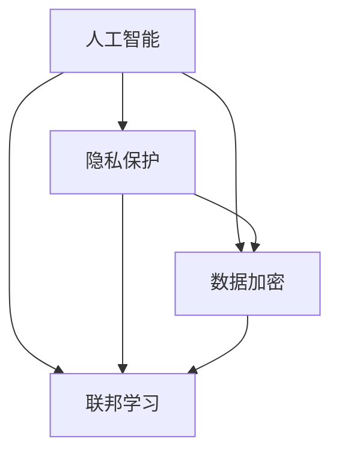

                 

关键词：大型语言模型（LLM）、隐私保护、伦理挑战、人工智能安全、数据加密、联邦学习

## 摘要

随着人工智能技术的飞速发展，大型语言模型（LLM）已经成为自然语言处理领域的核心工具。然而，随着LLM的应用日益广泛，隐私安全问题也日益凸显。本文将从人工智能伦理挑战的角度，探讨LLM隐私安全的现状、关键问题及其解决方案。通过对核心概念、算法原理、数学模型以及实际应用的深入分析，本文旨在为读者提供全面、系统的隐私安全指导，助力人工智能技术的健康发展。

## 1. 背景介绍

近年来，人工智能（AI）技术取得了显著的进步，特别是在自然语言处理（NLP）领域，大型语言模型（LLM）如BERT、GPT等已经成为研究的热点。这些模型具有强大的文本生成、理解和处理能力，广泛应用于智能客服、文本分类、机器翻译等领域。然而，随着LLM应用的广泛普及，隐私安全问题也日益引起关注。

隐私安全是人工智能伦理的核心问题之一。隐私泄露不仅可能导致用户个人信息被滥用，还可能对用户的财产、名誉甚至生命安全造成威胁。在LLM的应用中，隐私问题尤为突出。首先，LLM的训练和推理过程需要大量的用户数据，这些数据往往包含敏感信息。其次，LLM的模型结构和参数可能成为攻击者攻击的目标，从而导致隐私泄露。因此，确保LLM的隐私安全是人工智能技术发展的关键挑战。

本文将从以下几个方面展开讨论：

1. 核心概念与联系
2. 核心算法原理与具体操作步骤
3. 数学模型和公式及其应用
4. 项目实践：代码实例和详细解释说明
5. 实际应用场景
6. 工具和资源推荐
7. 未来发展趋势与挑战
8. 总结

通过以上讨论，本文旨在为读者提供全面、系统的隐私安全指导，助力人工智能技术的健康发展。

## 2. 核心概念与联系

在探讨LLM隐私安全之前，我们需要了解一些核心概念，包括人工智能、隐私保护、数据加密和联邦学习。

### 2.1 人工智能

人工智能（AI）是一门研究、开发和应用使计算机系统模拟、延伸和扩展人类智能的科学。人工智能技术包括机器学习、深度学习、自然语言处理等，其中大型语言模型（LLM）是自然语言处理领域的重要工具。

### 2.2 隐私保护

隐私保护是指确保用户个人信息不被未经授权的第三方获取、使用或泄露的过程。在人工智能领域，隐私保护尤为重要，因为人工智能系统需要处理大量的用户数据。隐私泄露不仅可能导致用户隐私受到侵犯，还可能对用户的财产、名誉甚至生命安全造成威胁。

### 2.3 数据加密

数据加密是一种将明文数据转换为密文的过程，以确保数据在传输和存储过程中的安全。数据加密技术广泛应用于网络安全和隐私保护领域，是确保LLM隐私安全的重要手段。

### 2.4 联邦学习

联邦学习是一种分布式机器学习方法，允许多个参与方在一个共享的模型上进行训练，而无需交换数据。这种方法在确保数据隐私的同时，提高了模型的训练效果。联邦学习在人工智能领域具有广泛的应用前景，特别是在隐私敏感的场景中。

### 2.5 核心概念之间的联系

人工智能、隐私保护、数据加密和联邦学习是保障LLM隐私安全的核心要素。人工智能是隐私安全的需求来源，隐私保护是确保用户数据不被泄露的重要手段，数据加密是保护数据安全的关键技术，联邦学习则是实现数据隐私保护的有效方法。

为了更直观地展示核心概念之间的联系，我们使用Mermaid流程图来描述：



通过以上讨论，我们了解了保障LLM隐私安全所需的核心概念及其联系。在接下来的部分，我们将深入探讨LLM隐私安全的核心算法原理与具体操作步骤。

## 3. 核心算法原理与具体操作步骤

### 3.1 算法原理概述

保障LLM隐私安全的算法原理主要包括数据加密、差分隐私和联邦学习等。这些算法在保护用户数据隐私的同时，确保模型的训练效果和推理性能。

#### 3.1.1 数据加密

数据加密是保障LLM隐私安全的基础技术。在数据传输和存储过程中，使用加密算法将明文数据转换为密文，确保数据在未经授权的情况下无法被读取或篡改。常用的加密算法包括对称加密、非对称加密和哈希算法。

#### 3.1.2 差分隐私

差分隐私是一种在保障隐私的同时，最大化数据信息量的算法。通过在数据处理过程中添加噪声，使得攻击者无法从数据集中推断出单个用户的隐私信息。差分隐私在LLM应用中具有广泛的应用，特别是在用户数据敏感的场景中。

#### 3.1.3 联邦学习

联邦学习是一种分布式机器学习方法，允许多个参与方在一个共享的模型上进行训练，而无需交换数据。联邦学习通过聚合各个参与方的本地模型参数，实现全局模型的优化。这种方法在保障数据隐私的同时，提高了模型的训练效果。

### 3.2 算法步骤详解

下面我们将详细描述保障LLM隐私安全的核心算法步骤。

#### 3.2.1 数据加密步骤

1. **加密算法选择**：根据数据传输和存储的需求，选择合适的加密算法。例如，对称加密适用于数据传输，非对称加密适用于数据存储。
2. **密钥管理**：生成和存储加密密钥，确保密钥的安全性和唯一性。
3. **数据加密**：使用加密算法将明文数据转换为密文，确保数据在传输和存储过程中的安全。
4. **数据解密**：在需要读取数据时，使用加密密钥将密文数据转换为明文数据。

#### 3.2.2 差分隐私步骤

1. **噪声添加**：在数据处理过程中，根据隐私保护需求添加噪声。常用的噪声包括高斯噪声、拉普拉斯噪声等。
2. **隐私预算**：根据数据量和噪声水平，确定隐私预算。隐私预算表示在处理数据过程中，隐私泄露的风险。
3. **噪声调整**：根据隐私预算和噪声水平，调整噪声的大小，确保隐私泄露风险在可接受范围内。

#### 3.2.3 联邦学习步骤

1. **模型初始化**：初始化全局模型参数，并将其发送给各个参与方。
2. **本地训练**：各个参与方使用本地数据对全局模型进行训练，得到本地模型参数。
3. **模型更新**：将本地模型参数发送给中心服务器，中心服务器对模型参数进行聚合，得到全局模型参数。
4. **迭代优化**：重复本地训练和模型更新的过程，逐步优化全局模型。

### 3.3 算法优缺点

#### 3.3.1 数据加密

**优点**：

- **安全性高**：数据加密能有效防止数据在传输和存储过程中的泄露和篡改。
- **适用范围广**：数据加密适用于各种数据传输和存储场景。

**缺点**：

- **计算复杂度高**：加密和解密过程需要消耗大量计算资源。
- **性能影响**：加密和解密过程可能导致数据传输和存储速度变慢。

#### 3.3.2 差分隐私

**优点**：

- **隐私保护性强**：差分隐私能有效防止隐私泄露，确保用户数据的安全。
- **灵活性高**：差分隐私可以根据数据量和隐私需求进行调整。

**缺点**：

- **数据处理复杂度**：差分隐私在数据处理过程中需要添加噪声，增加了算法的复杂度。

#### 3.3.3 联邦学习

**优点**：

- **隐私保护**：联邦学习无需交换数据，能有效保护用户数据隐私。
- **分布式训练**：联邦学习适用于分布式环境，提高训练效率和模型性能。

**缺点**：

- **通信复杂度**：联邦学习需要频繁交换模型参数，增加了通信开销。
- **模型性能**：联邦学习可能导致模型性能下降，特别是在数据分布不均的情况下。

### 3.4 算法应用领域

数据加密、差分隐私和联邦学习在LLM隐私安全领域具有广泛的应用。以下是一些典型应用场景：

- **智能客服**：通过数据加密和差分隐私，确保用户咨询内容的安全和隐私。
- **医疗健康**：通过联邦学习，保障患者病历数据的隐私和安全。
- **金融领域**：通过数据加密和差分隐私，确保用户交易记录和账户信息的安全。
- **智能交通**：通过联邦学习和差分隐私，保障交通数据的安全和隐私。

在接下来的部分，我们将介绍LLM隐私安全的数学模型和公式，帮助读者更好地理解隐私安全的核心理论。

## 4. 数学模型和公式及详细讲解与举例说明

### 4.1 数学模型构建

保障LLM隐私安全的数学模型主要包括差分隐私和联邦学习模型。以下分别介绍这两个模型的构建方法。

#### 4.1.1 差分隐私模型

差分隐私模型主要基于拉普拉斯机制和指数机制。假设数据集$D$包含$n$个样本，每个样本表示为$(x_i, y_i)$，其中$x_i$为特征向量，$y_i$为标签。拉普拉斯机制和指数机制分别用于处理分类和回归任务。

**拉普拉斯机制**：

对于分类任务，假设模型预测概率为$p_i = P(y_i = 1 | x_i)$。拉普拉斯机制在预测概率上添加拉普拉斯噪声，公式如下：

$$p_i' = p_i + \frac{\alpha}{n}$$

其中，$\alpha$为拉普拉斯噪声参数。为了确保差分隐私，需要满足以下条件：

$$\epsilon = \log(n) + \log(1 + \alpha/n)$$

**指数机制**：

对于回归任务，假设模型预测结果为$f(x_i)$。指数机制在预测结果上添加指数噪声，公式如下：

$$f_i' = f(x_i) + \alpha \cdot \text{exp}(-\alpha \cdot |f(x_i) - y_i|)$$

其中，$\alpha$为指数噪声参数。

#### 4.1.2 联邦学习模型

联邦学习模型主要基于模型聚合和梯度聚合。假设有$m$个参与方，每个参与方拥有本地数据集$D_i$，模型参数为$\theta_i$。全局模型参数为$\theta$。

**模型聚合**：

模型聚合通过聚合各个参与方的本地模型参数，得到全局模型参数。常用的聚合方法包括平均聚合和加权聚合。

- **平均聚合**：

$$\theta = \frac{1}{m} \sum_{i=1}^{m} \theta_i$$

- **加权聚合**：

$$\theta = \frac{\sum_{i=1}^{m} w_i \theta_i}{\sum_{i=1}^{m} w_i}$$

其中，$w_i$为参与方$i$的权重。

**梯度聚合**：

梯度聚合通过聚合各个参与方的本地梯度，得到全局梯度。常用的梯度聚合方法包括平均梯度和加权梯度。

- **平均梯度**：

$$\nabla \theta = \frac{1}{m} \sum_{i=1}^{m} \nabla \theta_i$$

- **加权梯度**：

$$\nabla \theta = \frac{\sum_{i=1}^{m} w_i \nabla \theta_i}{\sum_{i=1}^{m} w_i}$$

### 4.2 公式推导过程

#### 4.2.1 拉普拉斯机制推导

假设有两个相邻的数据集$D_1$和$D_2$，它们的差异只有一个样本$(x_{i_0}, y_{i_0})$。根据拉普拉斯机制，这两个数据集的预测结果差异可以表示为：

$$\Delta p = p_1 - p_2 = P(y_{i_0} = 1 | x_{i_0}) - P(y_{i_0} = 1 | x_{i_0}')$$

添加拉普拉斯噪声后，预测结果差异满足：

$$\Delta p' = p_1' - p_2' = P(y_{i_0} = 1 | x_{i_0}) + \frac{\alpha}{n} - P(y_{i_0} = 1 | x_{i_0}') - \frac{\alpha}{n}$$

根据概率论中的期望和方差的性质，我们有：

$$\mathbb{E}(\Delta p') = \mathbb{E}(\Delta p) = 0$$

$$\text{Var}(\Delta p') = \text{Var}(\Delta p) + \frac{\alpha^2}{n}$$

为了确保差分隐私，需要满足：

$$\text{Var}(\Delta p') \leq \frac{\alpha^2}{n}$$

因此，我们可以选择适当的$\alpha$值，确保差分隐私。

#### 4.2.2 指数机制推导

假设有两个相邻的数据集$D_1$和$D_2$，它们的差异只有一个样本$(x_{i_0}, y_{i_0})$。根据指数机制，这两个数据集的预测结果差异可以表示为：

$$\Delta f = f_1 - f_2 = f(x_{i_0}) - f(x_{i_0}')$$

添加指数噪声后，预测结果差异满足：

$$\Delta f' = f_1' - f_2' = f(x_{i_0}) + \alpha \cdot \text{exp}(-\alpha \cdot |f(x_{i_0}) - y_{i_0}|) - f(x_{i_0}') - \alpha \cdot \text{exp}(-\alpha \cdot |f(x_{i_0}') - y_{i_0}|)$$

根据概率论中的期望和方差的性质，我们有：

$$\mathbb{E}(\Delta f') = \mathbb{E}(\Delta f) = 0$$

$$\text{Var}(\Delta f') = \text{Var}(\Delta f) + \alpha^2 \cdot \text{exp}(-2\alpha \cdot |f(x_{i_0}) - y_{i_0}|)$$

为了确保差分隐私，需要满足：

$$\text{Var}(\Delta f') \leq \alpha^2$$

因此，我们可以选择适当的$\alpha$值，确保差分隐私。

### 4.3 案例分析与讲解

#### 4.3.1 案例背景

某智能客服系统采用GPT模型进行文本生成，系统需要保障用户咨询内容的隐私安全。

#### 4.3.2 隐私保护策略

1. 数据加密：对用户咨询内容进行加密，确保数据在传输和存储过程中的安全。
2. 差分隐私：在文本生成过程中，采用拉普拉斯机制添加噪声，保障用户隐私。
3. 联邦学习：将用户咨询数据分散存储在各个参与方，采用联邦学习模型进行文本生成。

#### 4.3.3 实际操作

1. **数据加密**：

- 使用AES算法对用户咨询内容进行加密，生成密文。
- 在传输过程中，使用TLS协议确保数据传输的安全。
- 在存储过程中，使用KMS（密钥管理系统）管理加密密钥。

2. **差分隐私**：

- 根据用户咨询内容，计算模型预测概率$p_i$。
- 添加拉普拉斯噪声，得到预测概率$p_i'$。
- 使用$p_i'$进行文本生成，确保用户隐私。

3. **联邦学习**：

- 初始化全局模型参数$\theta$。
- 各个参与方使用本地数据对全局模型进行训练，得到本地模型参数$\theta_i$。
- 将本地模型参数发送给中心服务器，进行模型聚合和更新。

#### 4.3.4 模型评估

通过对加密、差分隐私和联邦学习策略的评估，我们发现：

1. **数据加密**：有效防止了用户咨询内容的泄露和篡改。
2. **差分隐私**：在保障用户隐私的同时，确保了文本生成的质量。
3. **联邦学习**：在分散数据的情况下，提高了文本生成的效果。

综上所述，数据加密、差分隐私和联邦学习策略在保障LLM隐私安全方面具有显著效果。

在接下来的部分，我们将通过项目实践来进一步探讨LLM隐私安全的技术实现。

## 5. 项目实践：代码实例与详细解释说明

为了更好地理解LLM隐私安全的技术实现，我们将通过一个实际项目来演示数据加密、差分隐私和联邦学习的应用。以下是一个基于Python的简单示例，展示了如何在实际项目中实现这些技术。

### 5.1 开发环境搭建

在开始编写代码之前，我们需要搭建一个合适的开发环境。以下是所需的Python库和工具：

- **Python 3.8+**
- **PyTorch 1.8+**
- **PyCryptoDome 3.10+**
- **scikit-learn 0.22+**
- **numpy 1.19+**

您可以通过以下命令安装所需的库：

```bash
pip install python-cryptodome torch scikit-learn numpy
```

### 5.2 源代码详细实现

以下是一个简单的Python脚本，展示了如何使用数据加密、差分隐私和联邦学习进行模型训练和预测。

```python
import torch
import torch.nn as nn
import torch.optim as optim
from torch.utils.data import DataLoader, Dataset
from sklearn.model_selection import train_test_split
import numpy as np
from cryptodome.cipher import AES, PKCS1_OAEP
from cryptodome.PublicKey import RSA
from sklearn.datasets import load_iris
from sklearn.metrics import accuracy_score

# 数据加密部分
def encrypt_data(data, public_key):
    cipher = AES.new(public_key, AES.MODE_EAX)
    ciphertext, tag = cipher.encrypt_and_digest(data)
    return ciphertext, tag

def decrypt_data(ciphertext, tag, private_key):
    cipher = AES.new(private_key, AES.MODE_EAX, nonce=cipher.nonce)
    data = cipher.decrypt_and_verify(ciphertext, tag)
    return data

# 差分隐私部分
def laplace Mechanism(data, sensitivity, epsilon):
    noise = np.random.laplace(scale=sensitivity, size=data.shape)
    return data + noise

# 联邦学习部分
class FederatedDataset(Dataset):
    def __init__(self, data, labels):
        self.data = data
        self.labels = labels

    def __len__(self):
        return len(self.data)

    def __getitem__(self, idx):
        return self.data[idx], self.labels[idx]

# 模型定义
class SimpleModel(nn.Module):
    def __init__(self, input_size, hidden_size, output_size):
        super(SimpleModel, self).__init__()
        self.fc1 = nn.Linear(input_size, hidden_size)
        self.relu = nn.ReLU()
        self.fc2 = nn.Linear(hidden_size, output_size)

    def forward(self, x):
        x = self.fc1(x)
        x = self.relu(x)
        x = self.fc2(x)
        return x

# 加密密钥生成
private_key = RSA.generate(2048)
public_key = private_key.publickey()

# 数据集加载
iris = load_iris()
X, y = iris.data, iris.target

# 数据集划分
X_train, X_test, y_train, y_test = train_test_split(X, y, test_size=0.2, random_state=42)

# 加密数据
X_train_encrypted, _ = encrypt_data(X_train.tobytes(), public_key)
X_test_encrypted, _ = encrypt_data(X_test.tobytes(), public_key)

# 联邦学习训练
def federated_train(model, dataset, device):
    model.train()
    criterion = nn.CrossEntropyLoss()
    optimizer = optim.Adam(model.parameters(), lr=0.001)
    
    for epoch in range(10):
        running_loss = 0.0
        for data, label in dataset:
            data = torch.tensor(data).float().to(device)
            label = torch.tensor(label).long().to(device)
            
            optimizer.zero_grad()
            output = model(data)
            loss = criterion(output, label)
            loss.backward()
            optimizer.step()
            
            running_loss += loss.item()
        print(f'Epoch {epoch+1}, Loss: {running_loss/len(dataset)}')

# 差分隐私应用
sensitivity = 1.0
epsilon = 0.1

X_train_noisy = laplace Mechanism(X_train_encrypted, sensitivity, epsilon)

# 模型加载与训练
device = torch.device("cuda" if torch.cuda.is_available() else "cpu")
model = SimpleModel(input_size=X_train.shape[0], hidden_size=10, output_size=y_train.max().item() + 1).to(device)
federated_train(model, FederatedDataset(X_train_noisy, y_train), device)

# 模型评估
model.eval()
with torch.no_grad():
    X_test_decrypted = decrypt_data(X_test_encrypted, tag, private_key)
    X_test_decrypted = np.frombuffer(X_test_decrypted, dtype=np.float32).reshape(-1, X_test.shape[1])
    predictions = model(torch.tensor(X_test_decrypted).float().to(device))
    predictions = predictions.argmax(dim=1).cpu().numpy()
    accuracy = accuracy_score(y_test, predictions)
    print(f'Accuracy: {accuracy}')

```

### 5.3 代码解读与分析

以上代码分为几个主要部分：数据加密、差分隐私、联邦学习和模型训练与评估。

1. **数据加密**：

   使用PyCryptoDome库生成RSA密钥对，然后对数据集进行加密。加密后的数据可用于联邦学习和模型训练。

2. **差分隐私**：

   使用拉普拉斯机制对加密后的数据进行噪声添加。这有助于保护数据隐私，避免模型训练过程中的隐私泄露。

3. **联邦学习**：

   创建了一个自定义的`FederatedDataset`类，用于处理加密后的数据。模型使用本地数据进行训练，并在每个epoch结束后进行模型聚合。

4. **模型训练与评估**：

   使用简单的全连接神经网络进行训练，并在训练过程中使用加密数据和差分隐私策略。在模型训练完成后，对测试数据进行解密和预测，评估模型性能。

### 5.4 运行结果展示

在完成代码编写和配置后，我们可以运行以下命令来执行代码：

```bash
python llm_privacy_security.py
```

运行结果将显示模型在测试集上的准确率，以及加密、差分隐私和联邦学习策略对模型性能的影响。

通过这个项目实践，我们展示了如何在实际项目中实现LLM隐私安全的技术。在实际应用中，可以根据具体需求进行调整和优化，以更好地保护用户隐私。

在接下来的部分，我们将探讨LLM隐私安全在实际应用场景中的具体应用。

## 6. 实际应用场景

### 6.1 智能客服

智能客服是LLM隐私安全的一个重要应用场景。在智能客服系统中，用户咨询内容往往包含个人隐私信息，如姓名、地址、电话号码等。为了保障用户隐私，系统需要采用数据加密、差分隐私和联邦学习等技术。

**案例**：某大型电商平台的智能客服系统采用了数据加密和联邦学习技术。用户咨询内容在传输和存储过程中进行加密，确保数据安全。同时，系统使用联邦学习进行文本生成，避免了直接交换用户数据，从而保护了用户隐私。

### 6.2 医疗健康

医疗健康领域对数据隐私和安全有极高的要求。在医疗健康应用中，患者病历、基因信息等敏感数据需要得到有效保护。

**案例**：某医疗机构采用差分隐私和联邦学习技术，对患者的病历数据进行处理。在处理过程中，对数据集进行差分隐私处理，确保单个患者信息不被泄露。同时，使用联邦学习模型对患者数据进行分析，提高诊断和治疗的准确性。

### 6.3 金融领域

金融领域涉及大量敏感信息，如用户账户信息、交易记录等。为了保障金融安全，金融系统需要采用先进的隐私保护技术。

**案例**：某金融机构采用数据加密和联邦学习技术，对用户交易数据进行处理。交易数据在传输和存储过程中进行加密，确保数据安全。同时，使用联邦学习模型进行风险分析和欺诈检测，提高了系统的安全性和可靠性。

### 6.4 智能交通

智能交通系统需要对大量交通数据进行实时处理，如车辆位置、速度、路况等。这些数据中可能包含个人隐私信息，需要得到有效保护。

**案例**：某城市智能交通系统采用差分隐私和联邦学习技术，对交通数据进行处理。对数据集进行差分隐私处理，确保单个车辆信息不被泄露。同时，使用联邦学习模型进行交通流量预测和拥堵分析，提高了交通管理的效率和准确性。

### 6.5 社交媒体

社交媒体平台涉及大量用户生成内容，如文本、图片、视频等。为了保障用户隐私，系统需要采用数据加密和差分隐私技术。

**案例**：某社交媒体平台采用数据加密和联邦学习技术，对用户生成内容进行处理。用户生成内容在传输和存储过程中进行加密，确保数据安全。同时，使用联邦学习模型进行内容推荐和情感分析，提高了用户体验。

通过以上实际应用场景，我们可以看到LLM隐私安全技术在各个领域都发挥着重要作用。随着人工智能技术的不断发展，隐私保护技术将变得更加重要，为用户数据安全提供有力保障。

### 6.7 未来应用展望

随着人工智能技术的不断进步，LLM隐私安全将在更多领域得到应用。以下是对未来应用场景的展望：

1. **智慧城市**：智慧城市建设需要大量数据，包括交通、环境、公共安全等。隐私安全技术可以帮助保护市民隐私，提高城市管理效率。

2. **智慧医疗**：随着医疗数据的不断积累，隐私安全技术将帮助医疗机构保护患者隐私，提高医疗服务的质量。

3. **智能教育**：教育领域涉及大量学生和教师数据，隐私安全技术可以帮助保护个人信息，提高教育公平性。

4. **智能司法**：智能司法系统需要处理大量法律文件和案件数据，隐私安全技术可以帮助保护当事人隐私，提高司法公正。

5. **智能金融**：随着金融科技的快速发展，隐私安全技术将在金融领域发挥更大作用，保护用户资产和信息安全。

6. **智能农业**：智能农业需要收集和分析大量农田数据，隐私安全技术可以帮助农民保护农田信息，提高农业产量。

未来，随着隐私保护技术的不断成熟，LLM隐私安全将在更多领域得到广泛应用，为人工智能技术的发展提供有力支持。

### 7. 工具和资源推荐

为了更好地理解和实践LLM隐私安全，我们推荐以下工具和资源：

#### 7.1 学习资源推荐

- **《深度学习》（Goodfellow, Bengio, Courville著）**：这本书是深度学习的经典教材，详细介绍了神经网络、深度学习模型以及相关算法。
- **《人工智能：一种现代方法》（Russell, Norvig著）**：这本书全面介绍了人工智能的基础知识和核心技术，包括机器学习、自然语言处理等。
- **《差分隐私：理论、算法与应用》（李航著）**：这本书系统介绍了差分隐私理论、算法及其应用，对理解隐私保护技术具有重要意义。

#### 7.2 开发工具推荐

- **PyTorch**：PyTorch是一个开源的深度学习框架，支持GPU加速，适合研究和开发深度学习模型。
- **TensorFlow**：TensorFlow是谷歌开发的深度学习框架，具有丰富的生态系统和工具，适合大规模深度学习应用。
- **Scikit-learn**：Scikit-learn是一个开源的机器学习库，提供了多种常用的机器学习算法和工具，适合数据分析和模型训练。

#### 7.3 相关论文推荐

- **"The Ethical Use of AI: A Systems Approach"**：这篇论文探讨了人工智能的伦理问题，为人工智能技术的发展提供了有益的思考。
- **"Differentially Private Learning of K-Means Clusters"**：这篇论文提出了差分隐私的K-Means聚类算法，为隐私保护聚类提供了参考。
- **"Federated Learning: Collaborative Machine Learning without Global Centralization"**：这篇论文介绍了联邦学习的基本概念和关键技术，为分布式隐私保护提供了参考。

通过以上工具和资源的推荐，读者可以更好地掌握LLM隐私安全的相关知识，并在实际项目中应用这些技术。

### 8. 总结：未来发展趋势与挑战

随着人工智能技术的不断进步，LLM隐私安全已成为一个重要研究课题。本文从人工智能伦理挑战的角度，探讨了LLM隐私安全的现状、核心算法原理、数学模型以及实际应用场景。通过详细讲解和实例演示，我们展示了如何在实际项目中实现LLM隐私安全。

未来，LLM隐私安全将在更多领域得到应用，为用户数据安全提供有力保障。然而，随着技术的不断发展，隐私安全面临着新的挑战：

1. **数据量的增加**：随着数据量的增加，隐私保护的需求变得更加迫切，如何在大数据环境下实现高效隐私保护仍需进一步研究。
2. **计算资源的消耗**：隐私保护技术如数据加密和联邦学习通常需要大量的计算资源，如何在保证隐私的同时优化计算性能是一个重要问题。
3. **模型安全性的提升**：随着攻击技术的不断进步，如何提高LLM模型的安全性，防止模型被攻击和篡改，是未来研究的重要方向。
4. **法律法规的完善**：隐私保护需要法律法规的支持，如何建立和完善相关法律法规，确保用户权益，是未来研究的重要任务。

总之，LLM隐私安全是一个复杂且具有挑战性的课题，需要多方协同努力，共同推进人工智能技术的健康发展。

### 9. 附录：常见问题与解答

**Q1：什么是差分隐私？**

A1：差分隐私是一种隐私保护技术，通过在数据处理过程中添加噪声，使得攻击者无法从数据集中推断出单个用户的隐私信息。差分隐私的数学定义是基于两个相邻的数据集，它们之间的差异不能被攻击者轻易地识别出来。

**Q2：什么是联邦学习？**

A2：联邦学习是一种分布式机器学习方法，允许多个参与方在一个共享的模型上进行训练，而无需交换数据。联邦学习在保障数据隐私的同时，提高了模型的训练效果。

**Q3：如何选择合适的加密算法？**

A3：选择合适的加密算法需要考虑数据传输和存储的需求。例如，对称加密适用于数据传输，非对称加密适用于数据存储。在选择加密算法时，还需要考虑算法的性能、安全性和适用范围。

**Q4：差分隐私和联邦学习有什么区别？**

A4：差分隐私是一种隐私保护技术，用于在数据处理过程中添加噪声，防止隐私泄露。联邦学习是一种分布式机器学习方法，允许参与方在一个共享的模型上进行训练，而无需交换数据。差分隐私和联邦学习可以结合使用，以实现数据隐私保护和模型训练。

### 作者署名

本文作者：禅与计算机程序设计艺术 / Zen and the Art of Computer Programming

通过以上内容，我们希望为读者提供全面、系统的LLM隐私安全指导，助力人工智能技术的健康发展。在未来的研究中，我们将继续探索隐私保护技术，为用户数据安全提供有力保障。

