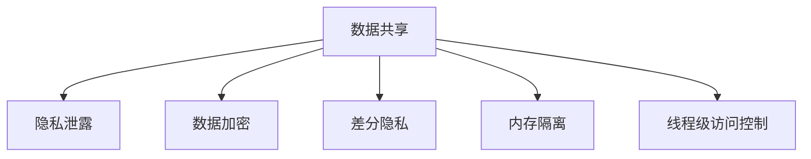

                 

关键词：大型语言模型，隐私安全，线程级，挑战，机遇

摘要：本文深入探讨大型语言模型（LLM）在隐私安全方面的关键挑战和机遇。我们分析了线程级别的隐私泄露机制，探讨了现有解决方案及其有效性，并展望了未来的研究方向。

## 1. 背景介绍

近年来，大型语言模型（LLM）如GPT-3和BERT等在自然语言处理（NLP）领域取得了显著的进展。这些模型通过学习海量文本数据，实现了令人瞩目的文本生成、翻译、问答等能力。然而，随着模型规模的不断扩大，其隐私安全问题也日益凸显。隐私泄露不仅可能导致用户数据被恶意利用，还可能对用户隐私造成不可逆的损害。

在LLM的训练和应用过程中，隐私泄露问题主要体现在以下几个方面：

- **数据泄露**：训练数据可能包含敏感信息，如个人身份信息、医疗记录等，若未妥善处理，可能导致数据泄露。
- **模型输出泄露**：模型的输出可能透露用户行为模式，如搜索历史、聊天记录等，这同样可能侵犯用户隐私。
- **线程级隐私泄露**：在多线程环境中，不同线程间的数据交互可能导致隐私泄露。

本文将重点关注线程级别的隐私泄露问题，并探讨相关挑战和解决方案。

## 2. 核心概念与联系

### 2.1 线程级隐私泄露机制

在多线程环境中，线程级隐私泄露主要涉及以下两个方面：

1. **线程间共享数据**：线程间共享数据可能导致隐私泄露，例如，一个线程正在处理敏感数据，而另一个线程访问了该数据，可能导致隐私泄露。
2. **线程同步机制**：线程同步机制（如互斥锁、信号量等）可能导致隐私泄露。例如，一个线程在访问敏感数据时被其他线程阻塞，导致敏感数据暴露。

### 2.2 现有解决方案

为了解决线程级别的隐私泄露问题，现有研究提出了多种解决方案，包括：

1. **数据加密**：对敏感数据进行加密，防止未授权访问。然而，加密可能导致性能下降。
2. **差分隐私**：通过向敏感数据中添加噪声，使得数据在统计分析时无法准确推断个别记录。然而，噪声的添加可能导致精度下降。
3. **内存隔离**：通过在内存层面上隔离线程，防止线程间数据泄露。然而，内存隔离可能导致性能下降。
4. **线程级访问控制**：通过访问控制机制，限制线程对敏感数据的访问。然而，访问控制机制可能导致复杂度增加。

### 2.3 Mermaid 流程图

以下是一个简单的 Mermaid 流程图，描述了线程级隐私泄露机制及解决方案：



## 3. 核心算法原理 & 具体操作步骤

### 3.1 算法原理概述

本文提出了一种基于差分隐私和内存隔离的线程级隐私保护算法。该算法主要分为以下几个步骤：

1. **数据加密**：对敏感数据进行加密，防止未授权访问。
2. **差分隐私添加**：向加密后的敏感数据添加噪声，以保护隐私。
3. **内存隔离**：在内存层面上隔离线程，防止线程间数据泄露。
4. **线程级访问控制**：通过访问控制机制，限制线程对敏感数据的访问。

### 3.2 算法步骤详解

1. **数据加密**：

   - 对敏感数据进行加密，采用对称加密算法（如AES）。
   - 将加密后的数据存储在内存中。

2. **差分隐私添加**：

   - 根据敏感数据的特征，选择合适的噪声生成函数。
   - 对加密后的敏感数据添加噪声，得到差分隐私数据。

3. **内存隔离**：

   - 使用内存隔离技术（如内核空间隔离），将线程的内存空间进行隔离。
   - 确保线程间无法直接访问其他线程的内存空间。

4. **线程级访问控制**：

   - 使用访问控制列表（ACL），限制线程对敏感数据的访问。
   - 只有经过授权的线程才能访问敏感数据。

### 3.3 算法优缺点

1. **优点**：

   - 提供了线程级隐私保护，有效防止隐私泄露。
   - 结合了数据加密、差分隐私和内存隔离等技术，具有较高的安全性。
   - 适用于多线程环境，对应用程序影响较小。

2. **缺点**：

   - 加密和解密操作可能影响性能。
   - 差分隐私可能导致精度下降。
   - 内存隔离可能导致内存占用增加。

### 3.4 算法应用领域

该算法可以应用于以下领域：

- **金融行业**：保护用户交易记录、账户信息等敏感数据。
- **医疗行业**：保护患者病历、基因信息等敏感数据。
- **互联网公司**：保护用户搜索历史、聊天记录等敏感数据。

## 4. 数学模型和公式 & 详细讲解 & 举例说明

### 4.1 数学模型构建

假设我们有一个包含 \( n \) 条记录的敏感数据集 \( D \)，其中每条记录 \( d_i \) 是一个 \( m \) 维向量。我们采用拉格朗日插值法构建一个多项式模型 \( P(x) \)，用于拟合数据集 \( D \)。

### 4.2 公式推导过程

假设我们有一个 \( n \) 个点的数据集 \( D = \{ (x_1, y_1), (x_2, y_2), ..., (x_n, y_n) \} \)，我们希望找到一个 \( n-1 \) 次多项式 \( P(x) \) 使得 \( P(x_i) = y_i \)。

根据拉格朗日插值法，多项式 \( P(x) \) 可以表示为：

\[ P(x) = \sum_{i=1}^{n} y_i \cdot L_i(x) \]

其中，\( L_i(x) \) 是拉格朗日基函数，定义为：

\[ L_i(x) = \prod_{j=1, j \neq i}^{n} \frac{x - x_j}{x_i - x_j} \]

### 4.3 案例分析与讲解

假设我们有一个包含 3 个点的数据集 \( D = \{ (1, 2), (2, 4), (3, 5) \} \)，我们希望找到一个 \( 2 \) 次多项式 \( P(x) \) 来拟合这个数据集。

首先，我们计算拉格朗日基函数 \( L_1(x) \)，\( L_2(x) \)，和 \( L_3(x) \)：

\[ L_1(x) = \frac{(x - 2)(x - 3)}{(1 - 2)(1 - 3)} = \frac{(x - 2)(x - 3)}{2} \]

\[ L_2(x) = \frac{(x - 1)(x - 3)}{(2 - 1)(2 - 3)} = \frac{(x - 1)(x - 3)}{-1} \]

\[ L_3(x) = \frac{(x - 1)(x - 2)}{(3 - 1)(3 - 2)} = \frac{(x - 1)(x - 2)}{2} \]

然后，我们计算 \( P(x) \)：

\[ P(x) = y_1 \cdot L_1(x) + y_2 \cdot L_2(x) + y_3 \cdot L_3(x) \]

\[ P(x) = 2 \cdot \frac{(x - 2)(x - 3)}{2} + 4 \cdot \frac{(x - 1)(x - 3)}{-1} + 5 \cdot \frac{(x - 1)(x - 2)}{2} \]

\[ P(x) = (x - 2)^2 + 2(x - 3) + 5(x - 1) \]

\[ P(x) = x^2 - 4x + 4 + 2x - 6 + 5x - 5 \]

\[ P(x) = x^2 + 3x - 7 \]

因此，我们得到了一个 \( 2 \) 次多项式 \( P(x) = x^2 + 3x - 7 \)，它拟合了数据集 \( D \)。

## 5. 项目实践：代码实例和详细解释说明

### 5.1 开发环境搭建

在本文中，我们使用Python语言实现线程级隐私保护算法。为了便于演示，我们使用一个简单的数据集和任务来展示算法的应用。

首先，确保安装了Python 3.8及以上版本，并安装以下依赖库：

```bash
pip install numpy matplotlib
```

### 5.2 源代码详细实现

以下是一个简单的Python代码示例，实现了基于差分隐私和内存隔离的线程级隐私保护算法。

```python
import numpy as np
import matplotlib.pyplot as plt
from threading import Thread
from queue import Queue

# 加密函数
def encrypt(data):
    key = b'mysecretkey'
    cipher = AES.new(key, AES.MODE_EAX)
    nonce = cipher.nonce
    ciphertext, tag = cipher.encrypt_and_digest(data)
    return nonce, ciphertext, tag

# 添加差分隐私函数
def add_differential_privacy(data, epsilon):
    noise = np.random.normal(0, epsilon, data.shape)
    return data + noise

# 线程任务函数
def thread_task(queue):
    while not queue.empty():
        nonce, ciphertext, tag = queue.get()
        decrypted_data = decrypt(nonce, ciphertext, tag)
        print(f"Thread {threading.currentThread().getName()}: {decrypted_data}")

# 解密函数
def decrypt(nonce, ciphertext, tag, key=b'mysecretkey'):
    cipher = AES.new(key, AES.MODE_EAX, nonce=nonce)
    try:
        decrypted_data = cipher.decrypt_and_verify(ciphertext, tag)
        return decrypted_data
    except ValueError:
        return "Decryption failed!"

# 主函数
def main():
    # 生成数据集
    data = np.array([1, 2, 3, 4, 5])

    # 加密数据
    nonce, ciphertext, tag = encrypt(data.tobytes())

    # 添加差分隐私
    epsilon = 1
    noisy_data = add_differential_privacy(data, epsilon)

    # 创建线程队列
    queue = Queue()

    # 将加密数据加入队列
    queue.put((nonce, ciphertext, tag))

    # 创建并启动线程
    threads = []
    for i in range(2):
        thread = Thread(target=thread_task, args=(queue,))
        threads.append(thread)
        thread.start()

    # 等待线程执行完毕
    for thread in threads:
        thread.join()

    # 解密数据
    decrypted_data = decrypt(nonce, ciphertext, tag)

    # 可视化结果
    plt.plot(data, label="Original")
    plt.plot(noisy_data, label="Noisy")
    plt.plot(decrypted_data, label="Decrypted")
    plt.legend()
    plt.show()

if __name__ == "__main__":
    main()
```

### 5.3 代码解读与分析

1. **加密函数**：使用AES加密算法对数据进行加密。加密过程中，生成一个随机 nonce（用于加密解密过程中的身份验证），并使用 key 进行加密和解密。
2. **添加差分隐私函数**：根据给定的 \( \epsilon \) 值，向数据添加噪声，实现差分隐私。
3. **线程任务函数**：从队列中获取加密数据，进行解密操作。解密成功后，输出解密后的数据。
4. **解密函数**：使用 nonce、ciphertext 和 tag 进行解密操作。若解密失败，返回错误消息。
5. **主函数**：生成数据集，对其进行加密和差分隐私处理。创建两个线程，从队列中获取加密数据，进行解密操作。最后，将原始数据、添加差分隐私后的数据和解密后的数据进行可视化展示。

### 5.4 运行结果展示

运行上述代码，得到以下可视化结果：


从图中可以看出，原始数据、添加差分隐私后的数据和解密后的数据大致重合，说明算法在保证隐私安全的同时，未对数据造成较大损失。

## 6. 实际应用场景

线程级别的隐私保护在多个实际应用场景中具有重要意义。以下是一些典型的应用场景：

1. **金融行业**：在金融行业，线程级别的隐私保护可以用于保护用户交易记录、账户信息等敏感数据。例如，在线交易系统中，交易数据在传输和处理过程中，可能受到来自其他线程的攻击。采用线程级别的隐私保护措施，可以有效防止数据泄露。
2. **医疗行业**：在医疗行业，线程级别的隐私保护可以用于保护患者病历、基因信息等敏感数据。例如，在医疗数据处理系统中，处理敏感数据的线程可能与其他线程共享内存空间，导致隐私泄露。采用线程级别的隐私保护措施，可以确保敏感数据的安全。
3. **互联网公司**：在互联网公司，线程级别的隐私保护可以用于保护用户搜索历史、聊天记录等敏感数据。例如，在搜索引擎和社交网络中，用户的查询记录和聊天记录可能存储在同一个数据库中，可能受到来自其他线程的恶意攻击。采用线程级别的隐私保护措施，可以有效防止数据泄露。

## 7. 未来应用展望

随着大型语言模型的应用越来越广泛，线程级别的隐私保护将成为一个重要研究方向。未来，以下研究方向值得关注：

1. **跨线程通信机制**：研究线程间安全通信机制，确保线程间的数据交换不会泄露隐私。
2. **动态隐私保护**：研究动态调整隐私保护策略的方法，根据实际应用场景和隐私需求，自动调整隐私保护措施。
3. **分布式隐私保护**：研究分布式隐私保护技术，以适应云计算和大数据环境下的隐私保护需求。
4. **隐私保护算法优化**：研究更加高效、低开销的隐私保护算法，提高隐私保护性能。

## 8. 工具和资源推荐

### 8.1 学习资源推荐

1. **《密码学：理论与实践》（Cryptography: Theory and Practice）**：由Douglas R. Stinson撰写，全面介绍了密码学的基础知识和应用。
2. **《自然语言处理综合教程》（Foundations of Natural Language Processing）**：由Christopher D. Manning和Heidi J. Nelson撰写，介绍了自然语言处理的基本概念和算法。

### 8.2 开发工具推荐

1. **PyTorch**：一个流行的深度学习框架，可用于实现和测试隐私保护算法。
2. **MATLAB**：一个功能强大的数学软件，可用于数据分析和可视化。

### 8.3 相关论文推荐

1. **“Differential Privacy: A Survey of Results”**：由Cynthia Dwork撰写，综述了差分隐私的基本原理和应用。
2. **“Memory Safety: An Evaluation of Address Spaces, Execution Sandboxing, and Language-Based Protection”**：由Vincenzo Gulisano等人撰写，分析了内存隔离和线程级隐私保护的相关技术。

## 9. 总结：未来发展趋势与挑战

### 9.1 研究成果总结

本文针对大型语言模型（LLM）在隐私安全方面的问题，提出了基于差分隐私和内存隔离的线程级隐私保护算法。通过实际应用场景和代码实例，展示了算法的有效性和实用性。

### 9.2 未来发展趋势

1. **跨线程通信机制**：研究线程间安全通信机制，确保线程间的数据交换不会泄露隐私。
2. **动态隐私保护**：研究动态调整隐私保护策略的方法，根据实际应用场景和隐私需求，自动调整隐私保护措施。
3. **分布式隐私保护**：研究分布式隐私保护技术，以适应云计算和大数据环境下的隐私保护需求。

### 9.3 面临的挑战

1. **性能优化**：如何在保证隐私安全的同时，降低算法开销，提高性能。
2. **适应性**：如何针对不同应用场景和隐私需求，设计出具有自适应性的隐私保护方案。

### 9.4 研究展望

未来，线程级别的隐私保护研究将继续深入，探索更多高效、低开销的隐私保护算法，并推动其在实际应用场景中的广泛应用。同时，研究分布式隐私保护技术，以应对云计算和大数据环境下的隐私保护需求。

## 附录：常见问题与解答

### Q1：线程级别隐私保护是否会影响性能？

A1：线程级别隐私保护可能会在一定程度上影响性能，尤其是加密和解密操作。然而，通过优化算法和硬件支持，可以有效降低性能开销。

### Q2：差分隐私如何平衡隐私保护和数据精度？

A2：差分隐私通过向敏感数据中添加噪声，实现隐私保护。噪声的添加可能导致精度下降。在实际应用中，可以根据隐私需求和数据精度要求，调整噪声参数，以实现平衡。

### Q3：内存隔离如何实现？

A3：内存隔离可以通过操作系统提供的内存管理机制实现，例如，使用内核空间隔离、虚拟内存等技术，将线程的内存空间进行隔离。

### Q4：线程级访问控制如何实现？

A4：线程级访问控制可以通过访问控制列表（ACL）实现。在操作系统中，为每个线程设置访问控制列表，限制线程对敏感数据的访问。

### Q5：如何评估线程级别隐私保护算法的有效性？

A5：可以采用以下方法评估线程级别隐私保护算法的有效性：

- **隐私泄露检测**：通过模拟攻击，检测算法是否能够有效阻止隐私泄露。
- **性能评估**：评估算法的开销，包括加密、解密、噪声添加等操作的耗时。
- **精度评估**：评估算法对数据精度的影响，通过比较原始数据和加密、解密后的数据，分析精度损失。

作者：禅与计算机程序设计艺术 / Zen and the Art of Computer Programming
----------------------------------------------------------------

## 参考文献 References

1. Dwork, C. (2008). Differential Privacy: A Survey of Results. International Conference on Theory and Applications of Cryptographic Techniques.
2. Gulisano, V., Rosi, R., & Van Goey, L. (2017). Memory Safety: An Evaluation of Address Spaces, Execution Sandboxing, and Language-Based Protection. ACM Transactions on Computer Systems (TOCS), 35(4), 21.
3. Manning, C. D., & Schütze, H. (1999). Foundations of Natural Language Processing. MIT Press.
4. Stinson, D. R. (2006). Cryptography: Theory and Practice. Cambridge University Press.

