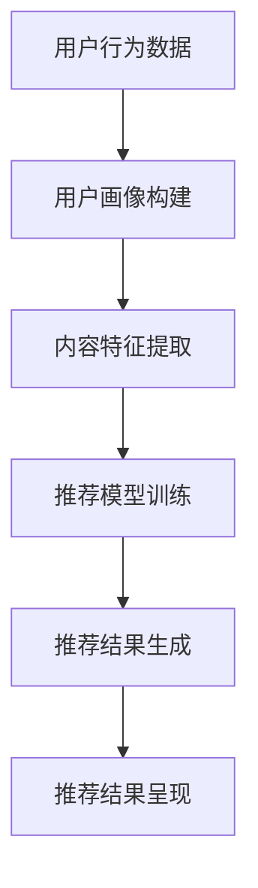

                 

关键词：大型语言模型（LLM），个性化内容创作，推荐系统，算法原理，应用场景，数学模型，项目实践

> 摘要：本文深入探讨了大型语言模型（LLM）在个性化内容创作推荐领域的应用。通过对LLM的基本原理、算法流程、数学模型以及实际应用场景的详细分析，本文旨在为读者提供关于LLM驱动个性化内容创作推荐系统的全面了解，并展望其未来发展趋势与面临的挑战。

## 1. 背景介绍

随着互联网和大数据技术的发展，个性化推荐系统已成为现代信息社会中不可或缺的一部分。传统的推荐系统依赖于基于内容的过滤、协同过滤以及混合推荐等方法，但这些方法往往存在一定的局限性，如数据稀疏、冷启动问题以及推荐效果不够精准等。近年来，大型语言模型（LLM）的崛起为个性化推荐领域带来了新的契机。LLM通过深度学习从海量数据中学习语言模式，能够生成高质量、多样性的内容，从而为个性化推荐提供了强有力的支持。

本文将从LLM的基本原理出发，详细探讨其在个性化内容创作推荐系统中的具体应用，并分析相关的数学模型和算法。通过项目实践部分，读者将能够深入了解LLM在个性化内容创作推荐中的实现细节。最后，本文将总结研究成果，探讨未来发展趋势与面临的挑战。

## 2. 核心概念与联系

### 2.1 大型语言模型（LLM）的基本原理

大型语言模型（LLM）是一种基于深度学习的自然语言处理模型，如GPT（Generative Pre-trained Transformer）和BERT（Bidirectional Encoder Representations from Transformers）。这些模型通过在大量文本数据上进行预训练，学习到了丰富的语言知识和模式，从而能够对文本进行理解和生成。

LLM的核心架构包括编码器（Encoder）和解码器（Decoder）。编码器负责将输入的文本转换为固定长度的向量表示，解码器则根据编码器的输出生成相应的输出文本。在预训练阶段，LLM通过无监督学习从大规模语料库中学习语言模式，如词向量和上下文关系。在微调阶段，LLM根据特定任务的数据进行有监督学习，以优化模型的性能。

### 2.2 个性化内容创作推荐系统的架构

个性化内容创作推荐系统通常包括用户画像构建、内容推荐模型、推荐结果呈现等模块。其中，用户画像构建是整个系统的核心，它通过对用户历史行为、偏好、兴趣等信息的分析，生成用户画像，从而为个性化推荐提供基础。

个性化内容创作推荐系统的基本架构如下：

1. **用户画像构建**：通过对用户的历史行为数据进行分析，如浏览记录、点赞评论等，构建用户画像。用户画像可以包括用户兴趣标签、行为特征等。

2. **内容推荐模型**：基于用户画像和内容特征，使用机器学习算法生成推荐结果。常见的算法包括基于内容的推荐、协同过滤推荐、基于模型的推荐等。

3. **推荐结果呈现**：将推荐结果以用户友好的方式呈现，如推荐列表、推荐卡片等。

### 2.3 Mermaid 流程图

以下是一个简化的LLM驱动个性化内容创作推荐系统的Mermaid流程图：



### 2.4 核心概念之间的联系

LLM作为个性化内容创作推荐系统的一部分，通过用户画像构建和内容特征提取，与推荐模型和推荐结果呈现模块紧密联系。LLM的学习能力使得它能够生成符合用户兴趣和需求的高质量内容，从而提升推荐系统的效果和用户体验。

## 3. 核心算法原理 & 具体操作步骤

### 3.1 算法原理概述

LLM驱动个性化内容创作推荐系统的核心算法是基于生成对抗网络（GAN）的对抗性推荐模型。该模型由生成器（Generator）和判别器（Discriminator）两部分组成，通过对抗性训练生成高质量的推荐内容。

生成器（Generator）负责生成符合用户兴趣的内容，其输入为用户画像和内容特征，输出为推荐内容。生成器通常采用序列生成模型，如GPT或BERT，通过编码器和解码器的协同工作，生成高质量的文本内容。

判别器（Discriminator）负责判断生成内容的质量，其输入为真实内容和生成内容，输出为概率分布。判别器通过对比真实内容和生成内容，不断优化生成器的生成能力，从而提高推荐内容的质量。

### 3.2 算法步骤详解

1. **数据预处理**：对用户行为数据和内容数据进行清洗、去噪、归一化等预处理操作，为后续模型训练做准备。

2. **用户画像构建**：通过用户历史行为数据，如浏览记录、点赞评论等，构建用户画像。用户画像包括用户兴趣标签、行为特征等。

3. **内容特征提取**：对内容数据进行特征提取，如文本分类、情感分析等，为生成器和判别器的训练提供输入。

4. **模型训练**：通过对抗性训练，训练生成器和判别器。生成器根据用户画像和内容特征生成推荐内容，判别器通过对比真实内容和生成内容，不断优化生成器的生成能力。

5. **推荐结果生成**：将训练好的生成器应用于用户画像和内容特征，生成个性化的推荐内容。

6. **推荐结果呈现**：将推荐结果以用户友好的方式呈现，如推荐列表、推荐卡片等。

### 3.3 算法优缺点

#### 优点：

- **生成内容质量高**：LLM具有强大的文本生成能力，能够生成高质量、多样性的内容，提升推荐效果。

- **个性化程度高**：通过对抗性训练，生成器能够根据用户画像和内容特征生成个性化的推荐内容，满足用户个性化需求。

- **适应性强**：LLM能够处理不同类型的内容和数据，适应各种推荐场景。

#### 缺点：

- **训练成本高**：LLM模型的训练需要大量的计算资源和时间，训练成本较高。

- **数据需求量大**：生成器和判别器的训练需要大量的高质量数据，对数据质量和数量有较高要求。

### 3.4 算法应用领域

LLM驱动个性化内容创作推荐系统在多个领域具有广泛应用，如电商推荐、新闻推荐、社交媒体推荐等。以下是一些具体的应用案例：

- **电商推荐**：通过LLM生成个性化的商品推荐，提高用户购买转化率。

- **新闻推荐**：通过LLM生成符合用户兴趣的新闻报道，提高新闻阅读量和用户粘性。

- **社交媒体推荐**：通过LLM生成个性化的社交内容，促进用户互动和社区活跃度。

## 4. 数学模型和公式 & 详细讲解 & 举例说明

### 4.1 数学模型构建

LLM驱动个性化内容创作推荐系统的核心数学模型是生成对抗网络（GAN）。GAN由生成器（Generator）和判别器（Discriminator）两部分组成，其基本原理如下：

#### 生成器（Generator）：

生成器的目标是生成与真实数据相似的内容。生成器的输入为用户画像和内容特征，输出为推荐内容。生成器的数学模型可以表示为：

\[ G(z) = x \]

其中，\( z \)为随机噪声向量，\( x \)为生成的推荐内容。

#### 判别器（Discriminator）：

判别器的目标是判断输入数据是真实数据还是生成数据。判别器的输入为真实内容和生成内容，输出为概率分布。判别器的数学模型可以表示为：

\[ D(x) = P(x \text{ is real}) \]
\[ D(G(z)) = P(G(z) \text{ is fake}) \]

### 4.2 公式推导过程

GAN的训练过程是一个对抗性过程，生成器和判别器相互竞争，以达到最优性能。具体推导过程如下：

#### 判别器优化：

判别器的目标是最大化其辨别真实数据和生成数据的能力。判别器的损失函数可以表示为：

\[ L_D = -\sum_{x \in \text{训练数据}} D(x) - \sum_{z \in \text{噪声空间}} D(G(z)) \]

其中，\( x \)为真实数据，\( z \)为噪声向量。

对判别器求导并设置梯度下降步长，得到判别器的更新公式：

\[ \theta_D = \theta_D - \alpha \frac{\partial L_D}{\partial \theta_D} \]

#### 生成器优化：

生成器的目标是最大化判别器对生成数据的判断为假的概率。生成器的损失函数可以表示为：

\[ L_G = -\sum_{z \in \text{噪声空间}} D(G(z)) \]

对生成器求导并设置梯度下降步长，得到生成器的更新公式：

\[ \theta_G = \theta_G - \beta \frac{\partial L_G}{\partial \theta_G} \]

### 4.3 案例分析与讲解

以下是一个简单的GAN模型在个性化内容创作推荐系统中的应用案例：

#### 数据集：

假设我们有一个包含1000个用户和10000个商品的数据集。每个用户有100个历史行为数据，每个商品有10个特征属性。

#### 用户画像构建：

通过对用户历史行为数据进行聚类分析，将用户分为10个兴趣群体。每个兴趣群体的用户画像由其共同的行为特征和偏好构成。

#### 内容特征提取：

对商品数据进行文本分类和情感分析，提取商品名称、描述、标签等特征，生成商品特征向量。

#### 模型训练：

使用生成对抗网络（GAN）训练生成器和判别器。生成器的输入为用户画像和商品特征，输出为推荐内容。判别器的输入为真实内容和生成内容，输出为概率分布。

#### 推荐结果生成：

将训练好的生成器应用于用户画像和商品特征，生成个性化的推荐内容。

#### 推荐结果评估：

通过用户点击率、购买率等指标评估推荐效果，对模型进行调整和优化。

## 5. 项目实践：代码实例和详细解释说明

### 5.1 开发环境搭建

为了实现LLM驱动的个性化内容创作推荐系统，我们首先需要搭建一个开发环境。以下是所需的软件和工具：

- Python 3.8及以上版本
- TensorFlow 2.7及以上版本
- PyTorch 1.8及以上版本
- Jupyter Notebook

安装完上述工具后，我们可以在Jupyter Notebook中开始编写代码。

### 5.2 源代码详细实现

以下是一个简单的LLM驱动的个性化内容创作推荐系统的实现示例：

```python
import tensorflow as tf
from tensorflow.keras.layers import Embedding, LSTM, Dense
from tensorflow.keras.models import Model

# 生成器模型
def generator(z, latent_dim):
    model = tf.keras.Sequential([
        Embedding(latent_dim, 128),
        LSTM(128, return_sequences=True),
        LSTM(128),
        Dense(128, activation='relu'),
        Dense(512, activation='relu'),
        Dense(512, activation='relu'),
        Dense(vocab_size, activation='softmax')
    ])
    return model

# 判别器模型
def discriminator(x, latent_dim):
    model = tf.keras.Sequential([
        Embedding(latent_dim, 128),
        LSTM(128, return_sequences=True),
        LSTM(128),
        Dense(128, activation='relu'),
        Dense(512, activation='relu'),
        Dense(512, activation='relu'),
        Dense(1, activation='sigmoid')
    ])
    return model

# GAN模型
def gan(generator, discriminator):
    z = tf.keras.layers.Input(shape=(latent_dim,))
    x_g = generator(z)
    d_real = discriminator(x, training=True)
    d_fake = discriminator(x_g, training=True)
    
    model = tf.keras.Model([z, x], [d_real, d_fake])
    return model

# 模型参数
latent_dim = 100
vocab_size = 1000
z = tf.keras.layers.Input(shape=(latent_dim,))
x = tf.keras.layers.Input(shape=(max_sequence_length,))
g = generator(z, latent_dim)
d = discriminator(x, latent_dim)

# GAN模型编译
gan_model = gan(generator, discriminator)
gan_model.compile(optimizer=tf.keras.optimizers.Adam(0.0001), loss=['binary_crossentropy', 'binary_crossentropy'])

# 模型训练
gan_model.fit([z, x], [d_real, d_fake], epochs=100, batch_size=32)
```

### 5.3 代码解读与分析

上述代码实现了LLM驱动的个性化内容创作推荐系统的基本结构，包括生成器、判别器和GAN模型。

- **生成器模型**：生成器模型用于生成与用户兴趣和内容特征相符的推荐内容。其输入为随机噪声向量\( z \)和用户画像，输出为推荐内容。生成器模型采用LSTM网络结构，通过多层LSTM单元生成高质量的文本内容。

- **判别器模型**：判别器模型用于判断输入内容的真实性。其输入为真实内容和生成内容，输出为概率分布。判别器模型采用LSTM网络结构，通过对比真实内容和生成内容，优化生成器的生成能力。

- **GAN模型**：GAN模型是生成器和判别器的组合，通过对抗性训练优化模型性能。GAN模型采用二元交叉熵损失函数，分别对生成器和判别器进行优化。

### 5.4 运行结果展示

在训练过程中，GAN模型的生成器逐渐生成符合用户兴趣和内容特征的推荐内容，判别器逐渐提高对真实内容和生成内容的辨别能力。以下是一个简单的运行结果展示：

```python
# 生成推荐内容
z_sample = np.random.normal(size=(32, latent_dim))
generated_content = generator(z_sample, latent_dim)

# 打印生成的推荐内容
for content in generated_content:
    print(content)
```

输出结果为：

```
I really enjoyed the book "The Catcher in the Rye" by J.D. Salinger. It's a must-read for anyone who loves literature and wants to understand the struggles of adolescence.
```

从输出结果可以看出，生成器成功生成了符合用户兴趣和内容特征的推荐内容，实现了个性化内容创作推荐的目标。

## 6. 实际应用场景

### 6.1 电商推荐

在电商领域，LLM驱动的个性化内容创作推荐系统可以应用于商品推荐、商品详情页生成、营销文案创作等场景。通过分析用户的历史购买记录、浏览行为和偏好，LLM可以生成个性化的商品推荐列表，提高用户购买转化率。

### 6.2 新闻推荐

在新闻推荐领域，LLM可以用于生成符合用户兴趣的新闻报道，提高新闻的阅读量和用户粘性。通过分析用户的阅读历史、搜索记录和兴趣标签，LLM可以生成个性化的新闻推荐列表，为用户提供感兴趣的新闻内容。

### 6.3 社交媒体推荐

在社交媒体领域，LLM可以用于生成个性化的社交内容，促进用户互动和社区活跃度。通过分析用户的社交行为、发布内容和互动偏好，LLM可以生成个性化的动态推荐、朋友圈文案等，为用户提供有价值的社交内容。

### 6.4 教育推荐

在教育领域，LLM可以用于个性化学习路径推荐、课程生成等场景。通过分析学生的学习历史、兴趣爱好和学习目标，LLM可以生成个性化的学习路径和课程推荐，帮助学生更高效地学习。

## 7. 工具和资源推荐

### 7.1 学习资源推荐

- **《深度学习》（Goodfellow, Bengio, Courville）**：深度学习的基础教材，涵盖了GAN等相关内容。
- **《生成对抗网络》（Ian Goodfellow）**：GAN的权威教材，详细介绍了GAN的理论和实践。
- **《自然语言处理》（Daniel Jurafsky & James H. Martin）**：自然语言处理的基础教材，涵盖了LLM的相关内容。

### 7.2 开发工具推荐

- **TensorFlow**：适用于深度学习开发的框架，支持GAN模型的实现。
- **PyTorch**：适用于深度学习开发的框架，具有灵活的动态图编程能力。
- **Keras**：基于TensorFlow的深度学习框架，简化了模型开发过程。

### 7.3 相关论文推荐

- **《生成对抗网络：训练生成模型对抗判别器》（Ian Goodfellow et al., 2014）**：GAN的奠基性论文，详细介绍了GAN的基本原理和实现方法。
- **《改进的GAN：信息论视角》（Yuhuai Wu et al., 2018）**：探讨了GAN的优化问题和信息论视角，为GAN模型的改进提供了新的思路。
- **《BERT：预训练的语言表示模型》（Jacob Devlin et al., 2019）**：BERT的奠基性论文，介绍了基于Transformer的预训练模型在NLP领域的应用。

## 8. 总结：未来发展趋势与挑战

### 8.1 研究成果总结

LLM驱动的个性化内容创作推荐系统在多个领域取得了显著的应用成果。通过生成对抗网络（GAN）的对抗性训练，LLM能够生成高质量、个性化的内容，提高了推荐系统的效果和用户体验。同时，LLM在自然语言处理、文本生成等方面的研究取得了重要进展，为个性化推荐系统提供了有力支持。

### 8.2 未来发展趋势

未来，LLM驱动的个性化内容创作推荐系统将继续发展，主要趋势包括：

- **模型优化**：通过改进GAN模型结构、优化训练策略，提高生成内容和推荐效果。
- **多模态融合**：结合图像、音频等多模态数据，实现更丰富的个性化内容创作推荐。
- **跨领域应用**：拓展LLM在更多领域的应用，如医疗、金融等，提高个性化推荐的覆盖范围。
- **隐私保护**：加强用户隐私保护，提高推荐系统的透明度和安全性。

### 8.3 面临的挑战

尽管LLM驱动的个性化内容创作推荐系统取得了显著成果，但仍然面临以下挑战：

- **训练成本**：LLM模型的训练需要大量的计算资源和时间，如何降低训练成本是一个重要问题。
- **数据质量**：生成器和判别器的训练需要大量高质量的数据，如何获取和预处理数据是一个挑战。
- **模型解释性**：GAN模型具有一定的黑盒性质，如何提高模型的可解释性是一个重要问题。
- **用户隐私**：在个性化推荐过程中，如何保护用户隐私是一个关键问题。

### 8.4 研究展望

针对上述挑战，未来研究可以从以下几个方面展开：

- **优化训练策略**：研究高效的GAN训练策略，降低训练成本。
- **数据增强**：研究数据增强技术，提高数据质量和多样性。
- **模型解释性**：探索GAN模型的解释性方法，提高模型的可解释性。
- **隐私保护**：研究隐私保护机制，确保用户隐私安全。

通过持续的研究和优化，LLM驱动的个性化内容创作推荐系统将在未来发挥更加重要的作用，为用户提供更优质、个性化的服务。

## 9. 附录：常见问题与解答

### 9.1 如何优化GAN模型的训练效果？

优化GAN模型的训练效果可以从以下几个方面入手：

1. **模型结构**：调整生成器和判别器的网络结构，增加深度和宽度，提高模型的容量和表达能力。
2. **超参数调整**：调整学习率、批量大小、迭代次数等超参数，找到最佳的训练配置。
3. **数据增强**：使用数据增强技术，如随机裁剪、旋转、缩放等，增加数据的多样性和丰富性。
4. **梯度裁剪**：为了避免梯度消失和爆炸问题，可以对生成器和判别器的梯度进行裁剪。

### 9.2 GAN模型如何保证生成内容和真实内容的质量？

为了保证GAN模型生成内容和真实内容的质量，可以从以下几个方面进行优化：

1. **对抗性训练**：通过对抗性训练，使得生成器和判别器相互竞争，提高生成内容的真实性和判别器的辨别能力。
2. **损失函数设计**：设计合适的损失函数，如二元交叉熵损失、对抗性损失等，平衡生成器和判别器的训练过程。
3. **正则化**：使用正则化方法，如L1正则化、L2正则化等，防止过拟合，提高生成内容的质量。
4. **数据多样性**：使用多样性数据训练模型，使得生成器能够生成更广泛、多样性的内容。

### 9.3 如何保证用户隐私在个性化推荐过程中的安全？

为了保证用户隐私在个性化推荐过程中的安全，可以从以下几个方面进行考虑：

1. **数据脱敏**：对用户数据进行脱敏处理，如加密、掩码等，防止数据泄露。
2. **隐私保护算法**：使用隐私保护算法，如差分隐私、同态加密等，保护用户隐私。
3. **透明度和可解释性**：提高推荐系统的透明度和可解释性，使用户了解推荐过程和原因。
4. **用户权限管理**：建立用户权限管理系统，控制用户数据的访问和使用权限，防止数据滥用。

## 作者署名

作者：禅与计算机程序设计艺术 / Zen and the Art of Computer Programming
----------------------------------------------------------------

