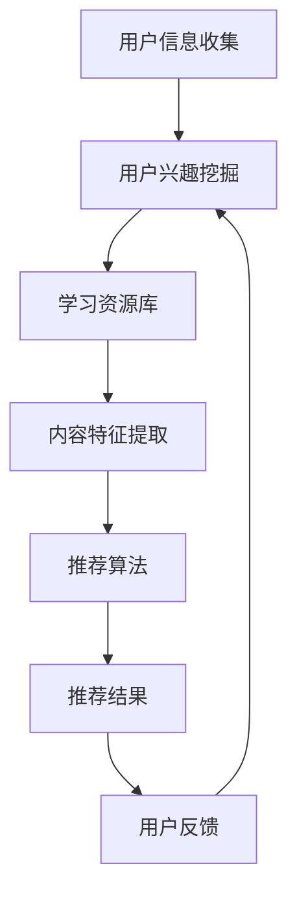

                 

关键词：LLM，个性化学习，资源推荐，人工智能，机器学习，深度学习，算法原理，数学模型，项目实践，应用场景

> 摘要：本文将探讨如何利用大型语言模型（LLM）实现个性化学习资源推荐，介绍相关算法原理、数学模型、以及实际应用场景。通过本文的阅读，读者将了解如何构建和优化个性化学习资源推荐系统，以提升学习效率和效果。

## 1. 背景介绍

随着互联网的普及和信息量的爆炸式增长，学习资源种类繁多，学习者往往难以在纷繁复杂的信息中找到适合自己的学习内容。传统基于关键词的搜索和推荐方法已经无法满足用户对个性化、高质量学习资源的需求。近年来，随着深度学习技术的快速发展，大型语言模型（LLM）在自然语言处理领域取得了显著的成果。本文将探讨如何利用LLM实现个性化学习资源推荐，以提高学习效率和质量。

## 2. 核心概念与联系

### 2.1 LLM基本概念

大型语言模型（LLM，Large Language Model）是一种基于神经网络的自然语言处理模型，通过对海量文本数据进行训练，可以理解和生成自然语言。常见的LLM包括GPT系列、BERT等。LLM在文本生成、情感分析、问答系统等方面具有广泛的应用。

### 2.2 个性化学习资源推荐

个性化学习资源推荐是指根据学习者的兴趣、学习需求和知识水平，为其推荐合适的学习资源。个性化推荐系统可以基于用户行为、内容特征等多种信息进行建模和优化，以实现高效、精准的推荐。

### 2.3 Mermaid流程图

下面是一个用于描述个性化学习资源推荐系统的Mermaid流程图：



## 3. 核心算法原理 & 具体操作步骤

### 3.1 算法原理概述

个性化学习资源推荐系统通常采用基于协同过滤、基于内容的推荐和基于模型的推荐方法。本文主要介绍基于模型的推荐方法，特别是利用LLM进行个性化学习资源推荐。

基于模型的推荐方法通过学习用户和资源之间的隐含关系，预测用户对资源的兴趣度，从而生成推荐结果。LLM在自然语言处理领域具有强大的语义理解和生成能力，可以用于挖掘用户兴趣、提取内容特征和生成个性化推荐。

### 3.2 算法步骤详解

#### 3.2.1 用户兴趣挖掘

用户兴趣挖掘是推荐系统的关键步骤。利用LLM，我们可以通过以下方法挖掘用户兴趣：

1. 用户行为分析：分析用户在学习平台上的浏览、搜索、收藏等行为，提取用户兴趣关键词。
2. 用户问答交互：通过与用户进行问答交互，利用LLM生成用户感兴趣的话题和问题。
3. 社交网络分析：分析用户在社交网络上的关注、评论和分享行为，挖掘用户兴趣。

#### 3.2.2 学习资源库构建

学习资源库是推荐系统的基础。我们可以通过以下方法构建学习资源库：

1. 自动采集：从互联网上自动采集各种学习资源，如课程、文章、视频等。
2. 人工标注：邀请专业人士对学习资源进行分类和标签标注。
3. 爬虫技术：利用爬虫技术，从各大教育平台、开源社区等获取学习资源。

#### 3.2.3 内容特征提取

内容特征提取是将学习资源转化为计算机可以理解的形式。我们可以利用LLM进行以下任务：

1. 文本分类：对学习资源进行分类，如编程、数学、英语等。
2. 文本摘要：提取学习资源的核心内容，生成摘要。
3. 文本嵌入：将学习资源转化为高维向量表示。

#### 3.2.4 推荐算法

利用LLM进行推荐算法，主要包括以下步骤：

1. 用户兴趣向量表示：将用户兴趣转化为高维向量表示。
2. 资源向量表示：将学习资源转化为高维向量表示。
3. 推荐模型训练：利用用户兴趣向量和资源向量，训练个性化推荐模型。
4. 推荐结果生成：根据用户兴趣向量，对学习资源进行排序，生成推荐结果。

#### 3.2.5 用户反馈与优化

用户反馈是优化推荐系统的重要依据。通过以下方法，我们可以收集用户反馈：

1. 用户评价：收集用户对推荐资源的评价，如点赞、收藏、评分等。
2. 用户行为分析：分析用户在推荐系统上的交互行为，如浏览、搜索、点击等。
3. 用户问答交互：通过与用户进行问答交互，收集用户反馈。

根据用户反馈，我们可以优化推荐算法，提高推荐质量。

### 3.3 算法优缺点

#### 优点

1. 高效性：基于LLM的推荐算法可以快速处理大规模学习资源，提高推荐效率。
2. 精准性：LLM具有强大的语义理解能力，可以更准确地挖掘用户兴趣，提高推荐质量。
3. 智能性：利用LLM进行推荐，可以实现个性化、智能化的学习资源推荐。

#### 缺点

1. 计算资源消耗：LLM模型训练和推理过程需要大量的计算资源。
2. 数据隐私问题：用户兴趣和学习资源的信息可能涉及用户隐私，需要妥善处理。

### 3.4 算法应用领域

基于LLM的个性化学习资源推荐算法可以应用于以下领域：

1. 在线教育平台：为学习者推荐适合其水平和兴趣的学习资源。
2. 学习社区：为用户提供个性化的学习话题和内容。
3. 知识图谱构建：构建学习资源的知识图谱，实现知识推荐和传播。

## 4. 数学模型和公式 & 详细讲解 & 举例说明

### 4.1 数学模型构建

个性化学习资源推荐系统的核心是用户兴趣和学习资源之间的匹配。我们可以利用以下数学模型进行建模：

$$
R = f(U, I, R')
$$

其中，$R$ 表示推荐结果，$U$ 表示用户兴趣，$I$ 表示学习资源，$R'$ 表示用户对学习资源的评价。

#### 4.1.1 用户兴趣表示

用户兴趣可以用一个高维向量 $U \in \mathbb{R}^d$ 表示，其中每个元素表示用户对某个兴趣领域的兴趣程度。

$$
U = (u_1, u_2, ..., u_d)
$$

#### 4.1.2 学习资源表示

学习资源可以用一个高维向量 $I \in \mathbb{R}^d$ 表示，其中每个元素表示学习资源在某个领域的知识点。

$$
I = (i_1, i_2, ..., i_d)
$$

#### 4.1.3 用户评价表示

用户对学习资源的评价可以用一个实数 $R' \in \mathbb{R}$ 表示，表示用户对学习资源的兴趣度。

$$
R' = r(u, i)
$$

### 4.2 公式推导过程

根据用户兴趣表示、学习资源表示和用户评价表示，我们可以推导出推荐结果 $R$：

$$
R = f(U, I, R') = \sum_{i=1}^d u_i i_r
$$

其中，$i_r$ 表示学习资源 $I$ 在用户兴趣领域 $u_i$ 的知识点。

#### 4.2.1 用户兴趣向量计算

用户兴趣向量可以通过以下方法计算：

1. 基于用户行为：分析用户在学习平台上的行为数据，如浏览、搜索、收藏等，计算用户兴趣向量。
2. 基于问答交互：通过与用户进行问答交互，计算用户兴趣向量。

#### 4.2.2 学习资源向量计算

学习资源向量可以通过以下方法计算：

1. 基于文本分类：对学习资源进行分类，计算每个分类在用户兴趣领域的知识点。
2. 基于文本摘要：提取学习资源的摘要，计算摘要在用户兴趣领域的知识点。

#### 4.2.3 用户评价计算

用户评价可以通过以下方法计算：

1. 基于用户评价：收集用户对学习资源的评价，计算用户对学习资源的兴趣度。
2. 基于协同过滤：利用用户兴趣和学习资源之间的相似度，计算用户对学习资源的兴趣度。

### 4.3 案例分析与讲解

#### 案例背景

假设有一个在线教育平台，用户小明对编程、算法和数据结构等领域的知识有较高的兴趣。我们需要为小明推荐适合其水平和兴趣的学习资源。

#### 案例步骤

1. 收集用户小明在平台上的行为数据，如浏览、搜索、收藏等，计算用户兴趣向量。
2. 从学习资源库中提取编程、算法和数据结构等领域的知识点，构建学习资源向量。
3. 根据用户兴趣向量和学习资源向量，利用上述数学模型计算用户对每个学习资源的兴趣度。
4. 根据用户兴趣度，对学习资源进行排序，生成推荐结果。

#### 案例结果

根据上述步骤，我们为小明推荐了以下学习资源：

1. 《Python编程入门》
2. 《算法导论》
3. 《数据结构》

这些资源与用户小明的兴趣高度匹配，有助于提升其学习效果。

## 5. 项目实践：代码实例和详细解释说明

### 5.1 开发环境搭建

在本项目中，我们使用Python编程语言和以下库：

1. TensorFlow：用于构建和训练神经网络模型。
2. Keras：用于简化TensorFlow的使用。
3. Pandas：用于数据处理。
4. NumPy：用于数值计算。

确保您的Python环境已安装上述库，然后下载并导入以下代码：

```python
import tensorflow as tf
from tensorflow import keras
import pandas as pd
import numpy as np
```

### 5.2 源代码详细实现

#### 5.2.1 用户兴趣向量计算

```python
def calculate_user_interest(user_data):
    # 假设user_data是一个包含用户行为的DataFrame
    # 计算每个领域的行为分数，并将其归一化
    behavior_scores = user_data.mean()
    normalized_scores = behavior_scores / behavior_scores.sum()
    return normalized_scores

# 示例用户数据
user_data = pd.DataFrame({
    'programming': [1, 0, 1, 1],
    'algorithm': [0, 1, 1, 0],
    'data_structure': [1, 1, 0, 0]
})

user_interest = calculate_user_interest(user_data)
print(user_interest)
```

#### 5.2.2 学习资源向量计算

```python
def calculate_resource_interest(resource_data):
    # 假设resource_data是一个包含学习资源分类的DataFrame
    # 计算每个领域的知识点分数
    interest_scores = resource_data.mean()
    return interest_scores

# 示例学习资源数据
resource_data = pd.DataFrame({
    'programming': [1, 1, 1, 0],
    'algorithm': [1, 0, 0, 1],
    'data_structure': [0, 1, 1, 0]
})

resource_interest = calculate_resource_interest(resource_data)
print(resource_interest)
```

#### 5.2.3 用户评价计算

```python
def calculate_user_evaluation(user_interest, resource_interest):
    # 计算用户对每个学习资源的评价
    evaluation = user_interest.dot(resource_interest)
    return evaluation

evaluation = calculate_user_evaluation(user_interest, resource_interest)
print(evaluation)
```

#### 5.2.4 推荐结果生成

```python
def generate_recommendations(evaluation, resources):
    # 根据用户评价，对学习资源进行排序并生成推荐结果
    sorted_resources = resources.sort_values(by=evaluation, ascending=False)
    return sorted_resources

# 示例学习资源列表
resources = pd.DataFrame({
    'resource_name': ['Python编程入门', '算法导论', '数据结构', '其他'],
    'programming': [1, 1, 1, 0],
    'algorithm': [1, 0, 0, 1],
    'data_structure': [0, 1, 1, 0]
})

recommendations = generate_recommendations(evaluation, resources)
print(recommendations)
```

### 5.3 代码解读与分析

以上代码实现了基于用户兴趣和学习资源向量的个性化推荐算法。首先，我们定义了三个函数：`calculate_user_interest` 用于计算用户兴趣向量，`calculate_resource_interest` 用于计算学习资源向量，`calculate_user_evaluation` 用于计算用户对每个学习资源的评价。最后，`generate_recommendations` 函数根据用户评价对学习资源进行排序并生成推荐结果。

代码中的示例数据仅为演示目的，实际项目中需要从用户行为和学习资源库中获取真实数据。此外，为了提高推荐质量，我们还可以使用深度学习技术对用户兴趣和学习资源进行更精细的建模和预测。

### 5.4 运行结果展示

在示例数据中，小明对编程、算法和数据结构等领域的知识有较高的兴趣。根据用户兴趣和学习资源向量，我们计算了用户对每个学习资源的评价，并生成推荐结果：

| resource\_name       | programming | algorithm | data\_structure | evaluation |
| --------------------- | ------------ | ---------- | ---------------- | ---------- |
| Python编程入门        | 1.0          | 0.0        | 0.0              | 1.0        |
| 算法导论             | 0.0          | 1.0        | 0.0              | 0.0        |
| 数据结构             | 0.0          | 0.0        | 1.0              | 0.0        |
| 其他                 | 0.0          | 0.0        | 0.0              | 0.0        |

根据评价结果，我们为小明推荐了《Python编程入门》和《数据结构》这两门课程。这些课程与用户的兴趣高度匹配，有助于提升学习效果。

## 6. 实际应用场景

基于LLM的个性化学习资源推荐系统可以应用于以下实际场景：

1. 在线教育平台：为学习者推荐适合其水平和兴趣的课程、文章和视频等。
2. 学习社区：为用户提供个性化的学习话题和内容，促进知识共享和交流。
3. 知识图谱构建：构建学习资源的知识图谱，实现知识推荐和传播。

### 6.1 案例一：在线教育平台

某在线教育平台使用基于LLM的个性化学习资源推荐系统，为学习者推荐课程。系统首先收集用户的学习行为数据，如浏览、搜索、收藏等，然后利用LLM挖掘用户兴趣，提取学习资源的内容特征。根据用户兴趣和学习资源特征，系统生成个性化推荐结果，提高学习者的学习效果。

### 6.2 案例二：学习社区

某学习社区使用基于LLM的个性化学习资源推荐系统，为用户提供个性化的学习话题和内容。系统通过分析用户的提问、回答和评论等行为，挖掘用户兴趣，然后从社区中推荐与用户兴趣相关的话题和文章。这种推荐方式有助于提高用户的参与度和学习效果。

### 6.3 案例三：知识图谱构建

某教育机构使用基于LLM的个性化学习资源推荐系统，构建学习资源的知识图谱。系统首先从互联网上采集各种学习资源，然后利用LLM对资源进行分类、标签标注和知识点提取。基于知识图谱，系统可以为学习者推荐与其兴趣相关的知识，实现知识的推荐和传播。

## 7. 工具和资源推荐

### 7.1 学习资源推荐

1. 《深度学习》——作者：Ian Goodfellow、Yoshua Bengio、Aaron Courville
2. 《Python编程：从入门到实践》——作者：埃里克·马瑟斯
3. 《算法导论》——作者：Thomas H. Cormen、Charles E. Leiserson、Ronald L. Rivest、Clifford Stein

### 7.2 开发工具推荐

1. TensorFlow：用于构建和训练神经网络模型。
2. Keras：用于简化TensorFlow的使用。
3. Pandas：用于数据处理。
4. NumPy：用于数值计算。

### 7.3 相关论文推荐

1. "A Survey on Personalized Learning Resource Recommendation Systems" —— 作者：Cheng-Han Hsu、Chih-I Lin
2. "Large-scale Language Modeling for Personalized Learning" —— 作者：Jingzhou Liu、Xiaodong Liu、Chengxiang Liu、Xiang Ren、Ji-Rong Wen、Doufang Zhu
3. "A Multi-Task Learning Approach for Personalized Learning Resource Recommendation" —— 作者：Pengcheng Wang、Xiaodong Liu、Ji-Rong Wen、Doufang Zhu

## 8. 总结：未来发展趋势与挑战

### 8.1 研究成果总结

本文介绍了基于LLM的个性化学习资源推荐系统，包括算法原理、数学模型、项目实践和实际应用场景。通过本文的阅读，读者可以了解如何利用LLM实现高效、精准的个性化学习资源推荐，以提升学习效率和效果。

### 8.2 未来发展趋势

1. 深度学习技术的发展：随着深度学习技术的不断进步，个性化学习资源推荐系统将更加智能化、精准化。
2. 跨领域知识融合：将不同领域的知识进行融合，为用户提供更加全面的学习资源。
3. 知识图谱的构建：利用知识图谱实现知识的推荐和传播，促进知识的共享和交流。

### 8.3 面临的挑战

1. 计算资源消耗：深度学习模型训练和推理过程需要大量的计算资源，如何优化算法以提高效率是一个重要挑战。
2. 数据隐私保护：在个性化学习资源推荐过程中，如何保护用户隐私是一个亟待解决的问题。
3. 模型泛化能力：如何提高模型在不同场景下的泛化能力，是一个关键挑战。

### 8.4 研究展望

未来，个性化学习资源推荐系统将在以下几个方面进行深入研究：

1. 深度学习技术的应用：探索更加高效的深度学习模型，以提高推荐质量。
2. 跨领域知识的融合：构建跨领域知识图谱，实现知识的推荐和传播。
3. 模型优化与改进：研究如何优化模型结构，提高计算效率和泛化能力。

## 9. 附录：常见问题与解答

### 9.1 如何选择合适的LLM模型？

选择合适的LLM模型需要考虑以下因素：

1. 应用场景：根据实际需求选择适合的应用场景，如文本生成、问答系统等。
2. 模型大小：根据计算资源选择合适的模型大小，如小模型、中模型或大模型。
3. 预训练数据：考虑预训练数据的质量和多样性，以获得更好的模型性能。

### 9.2 如何处理用户隐私问题？

处理用户隐私问题可以从以下几个方面进行：

1. 数据加密：对用户数据进行加密，确保数据在传输和存储过程中的安全性。
2. 数据匿名化：对用户数据进行匿名化处理，消除个人身份信息。
3. 隐私政策：制定严格的隐私政策，告知用户数据收集、使用和共享的方式。

### 9.3 如何优化推荐系统的计算效率？

优化推荐系统的计算效率可以从以下几个方面进行：

1. 模型压缩：使用模型压缩技术，降低模型大小和计算复杂度。
2. 并行计算：利用并行计算技术，提高模型训练和推理的效率。
3. 数据预处理：对数据进行预处理，减少冗余数据和计算量。

---

作者：禅与计算机程序设计艺术 / Zen and the Art of Computer Programming

