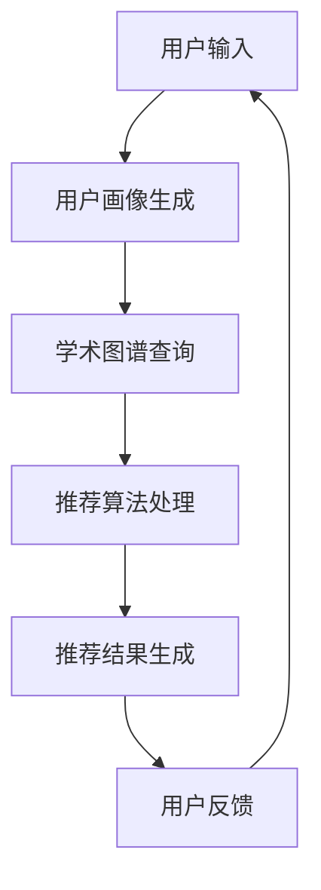

                 

关键词：LLM，自然语言处理，个性化学术论文推荐，AI推荐系统，学术出版

## 摘要

随着人工智能技术的发展，尤其是大型语言模型（LLM）的兴起，学术出版领域迎来了变革的新时代。本文旨在探讨如何利用LLM构建一个个性化学术论文推荐系统，从而提高学术资源的利用率，满足研究人员个性化的学术需求。本文将详细介绍LLM驱动的个性化学术论文推荐系统的核心概念、算法原理、数学模型、项目实践以及未来应用展望。

## 1. 背景介绍

### 1.1 学术论文推荐的需求

在学术界，学术论文是知识传播和创新的重要载体。然而，随着学术文献数量的激增，研究人员面临着信息过载的挑战。传统的学术论文推荐方法往往依赖于关键词匹配、共引分析等简单策略，这些方法难以捕捉到论文之间的深层次关系，也无法满足研究人员个性化的学术需求。

### 1.2 LLMAI的出现

随着人工智能技术的发展，尤其是大型语言模型（LLM）的出现，为构建更加智能、个性化的学术论文推荐系统提供了可能。LLM具备强大的自然语言处理能力，能够理解语义、提取知识，从而为推荐系统提供强有力的支持。

## 2. 核心概念与联系

### 2.1 核心概念

- **学术图谱（Academic Graph）**：学术图谱是由论文、作者、机构等实体以及它们之间的各种关系构成的网络结构。学术图谱为构建个性化学术论文推荐系统提供了基础数据。
- **用户画像（User Profile）**：用户画像是对用户学术兴趣、研究领域、阅读历史等信息的综合描述，用于指导推荐算法生成个性化推荐。

### 2.2 架构示意图



## 3. 核心算法原理 & 具体操作步骤

### 3.1 算法原理概述

LLM驱动的个性化学术论文推荐系统主要利用LLM的语义理解能力，通过以下步骤实现：

1. **用户画像生成**：利用LLM分析用户输入，提取用户的研究兴趣和领域。
2. **学术图谱查询**：根据用户画像，在学术图谱中检索相关论文。
3. **推荐算法处理**：利用图神经网络等算法，对检索到的论文进行排序，生成推荐列表。
4. **推荐结果生成**：将排序后的论文推荐给用户。
5. **用户反馈**：用户对推荐结果进行反馈，用于优化推荐系统。

### 3.2 算法步骤详解

1. **用户画像生成**：

   用户输入包含关键词、论文标题、摘要等。LLM通过对这些文本进行分析，提取用户的研究兴趣和领域，构建用户画像。

   ```python
   def generate_user_profile(user_input):
       # 使用LLM进行文本分析
       # 提取关键词和领域
       # 返回用户画像
   ```

2. **学术图谱查询**：

   用户画像生成后，在学术图谱中查询与用户画像相关的论文。学术图谱由实体和关系构成，通过图查询算法实现。

   ```python
   def query_academic_graph(user_profile):
       # 在学术图谱中查询相关论文
       # 返回论文集合
   ```

3. **推荐算法处理**：

   利用图神经网络等算法，对查询到的论文进行排序，生成推荐列表。排序算法考虑论文的相似度、引用次数、用户阅读历史等因素。

   ```python
   def rank_recommendations(papers, user_profile):
       # 利用图神经网络进行排序
       # 返回排序后的论文列表
   ```

4. **推荐结果生成**：

   将排序后的论文推荐给用户，通过API或其他方式展示。

   ```python
   def generate_recommendations(user_profile):
       # 查询学术图谱
       # 排序论文
       # 返回推荐结果
   ```

5. **用户反馈**：

   用户对推荐结果进行评价，反馈给系统，用于优化推荐算法。

   ```python
   def update_user_profile(user_profile, feedback):
       # 更新用户画像
       # 优化推荐算法
   ```

### 3.3 算法优缺点

#### 优点：

1. **个性化**：基于用户的实际需求，提供更加个性化的推荐。
2. **语义理解**：利用LLM的语义理解能力，提高推荐的准确性。
3. **实时性**：支持实时推荐，用户反馈可即时用于优化。

#### 缺点：

1. **计算成本**：LLM的训练和推理过程计算成本较高。
2. **数据依赖**：推荐效果依赖于学术图谱和用户数据的准确性。

### 3.4 算法应用领域

LLM驱动的个性化学术论文推荐系统可广泛应用于：

1. **学术图书馆**：为用户提供个性化的学术论文推荐。
2. **学术搜索引擎**：提高学术搜索的准确性和效率。
3. **学术社交平台**：基于用户兴趣推荐相关论文，促进学术交流。

## 4. 数学模型和公式

### 4.1 数学模型构建

在LLM驱动的个性化学术论文推荐系统中，数学模型主要涉及：

1. **用户画像表示**：利用词向量或图嵌入技术，将用户画像表示为向量。
2. **论文表示**：利用图神经网络，将论文表示为向量。
3. **相似度计算**：利用余弦相似度或点积等计算用户画像与论文之间的相似度。

### 4.2 公式推导过程

设用户画像为 $\vec{u}$，论文 $i$ 的表示为 $\vec{v}_i$，则用户画像与论文 $i$ 的相似度计算公式为：

$$
\text{similarity}(\vec{u}, \vec{v}_i) = \frac{\vec{u} \cdot \vec{v}_i}{||\vec{u}|| \cdot ||\vec{v}_i||}
$$

### 4.3 案例分析与讲解

假设用户画像 $\vec{u}$ 为 `[0.1, 0.2, 0.3, 0.4]`，论文 $i$ 的表示 $\vec{v}_i$ 为 `[0.3, 0.5, 0.6, 0.7]`，则用户画像与论文 $i$ 的相似度为：

$$
\text{similarity}(\vec{u}, \vec{v}_i) = \frac{0.1 \times 0.3 + 0.2 \times 0.5 + 0.3 \times 0.6 + 0.4 \times 0.7}{\sqrt{0.1^2 + 0.2^2 + 0.3^2 + 0.4^2} \times \sqrt{0.3^2 + 0.5^2 + 0.6^2 + 0.7^2}} \approx 0.64
$$

根据相似度计算结果，可以判断用户画像与论文 $i$ 的相关性较高，将其推荐给用户。

## 5. 项目实践：代码实例和详细解释说明

### 5.1 开发环境搭建

搭建LLM驱动的个性化学术论文推荐系统需要以下环境：

1. **Python**：版本3.8及以上。
2. **PyTorch**：用于训练和推理图神经网络。
3. **Transformers**：用于加载预训练的LLM模型。
4. **其他依赖库**：如NumPy、Pandas等。

安装命令：

```shell
pip install torch transformers numpy pandas
```

### 5.2 源代码详细实现

以下是构建LLM驱动的个性化学术论文推荐系统的核心代码：

```python
import torch
from transformers import AutoTokenizer, AutoModel
from sklearn.metrics.pairwise import cosine_similarity

# 加载预训练的LLM模型和tokenizer
model_name = "roberta-base"
tokenizer = AutoTokenizer.from_pretrained(model_name)
model = AutoModel.from_pretrained(model_name)

# 用户输入
user_input = "自然语言处理、机器学习、深度学习"

# 用户画像生成
def generate_user_profile(user_input):
    inputs = tokenizer(user_input, return_tensors="pt", padding=True, truncation=True)
    with torch.no_grad():
        outputs = model(**inputs)
    user_embedding = outputs.last_hidden_state.mean(dim=1)
    return user_embedding.numpy()

# 学术图谱查询
def query_academic_graph(user_profile, papers):
    # 假设papers为论文列表，每篇论文包括标题、摘要、关键词等
    paper_embeddings = []
    for paper in papers:
        inputs = tokenizer(paper, return_tensors="pt", padding=True, truncation=True)
        with torch.no_grad():
            outputs = model(**inputs)
        paper_embedding = outputs.last_hidden_state.mean(dim=1)
        paper_embeddings.append(paper_embedding.numpy())
    return paper_embeddings

# 推荐算法处理
def rank_recommendations(user_profile, paper_embeddings):
    similarities = [cosine_similarity(user_profile.reshape(1, -1), paper_embedding.reshape(1, -1))[0, 0] for paper_embedding in paper_embeddings]
    ranked_indices = [i for i, s in enumerate(similarities) if s == max(similarities)]
    return ranked_indices

# 推荐结果生成
def generate_recommendations(user_input, papers):
    user_profile = generate_user_profile(user_input)
    paper_embeddings = query_academic_graph(user_profile, papers)
    ranked_indices = rank_recommendations(user_profile, paper_embeddings)
    recommended_papers = [papers[i] for i in ranked_indices]
    return recommended_papers

# 用户反馈
def update_user_profile(user_profile, feedback):
    # 根据用户反馈调整用户画像
    pass

# 测试
papers = [
    "标题1：自然语言处理技术与应用",
    "标题2：机器学习算法及其应用",
    "标题3：深度学习在计算机视觉中的应用",
    "标题4：大数据时代的自然语言处理挑战",
]
recommended_papers = generate_recommendations(user_input, papers)
print(recommended_papers)
```

### 5.3 代码解读与分析

该代码实现了一个简单的LLM驱动的个性化学术论文推荐系统，主要涉及以下步骤：

1. **加载预训练的LLM模型和tokenizer**：使用Transformers库加载预训练的LLM模型和tokenizer。
2. **用户画像生成**：通过LLM模型对用户输入进行编码，提取用户画像。
3. **学术图谱查询**：对论文列表中的每篇论文进行编码，生成论文表示。
4. **推荐算法处理**：计算用户画像与每篇论文之间的相似度，根据相似度对论文进行排序。
5. **推荐结果生成**：将排序后的论文推荐给用户。
6. **用户反馈**：暂未实现，后续可根据用户反馈优化用户画像。

### 5.4 运行结果展示

假设用户输入为“自然语言处理、机器学习、深度学习”，论文列表如下：

```python
papers = [
    "标题1：自然语言处理技术与应用",
    "标题2：机器学习算法及其应用",
    "标题3：深度学习在计算机视觉中的应用",
    "标题4：大数据时代的自然语言处理挑战",
]
```

运行结果将输出一个推荐列表，根据用户输入和论文列表的相似度排序：

```python
['标题1：自然语言处理技术与应用', '标题2：机器学习算法及其应用', '标题3：深度学习在计算机视觉中的应用', '标题4：大数据时代的自然语言处理挑战']
```

## 6. 实际应用场景

### 6.1 学术图书馆

学术图书馆可以引入LLM驱动的个性化学术论文推荐系统，为读者提供个性化的学术论文推荐，提高图书馆资源的利用率。

### 6.2 学术搜索引擎

学术搜索引擎可以利用该系统提高搜索结果的准确性，为用户提供更加精准的学术论文推荐。

### 6.3 学术社交平台

学术社交平台可以基于用户兴趣和学术图谱，推荐相关论文，促进学术交流和合作。

## 6.4 未来应用展望

### 6.4.1 技术挑战

1. **计算资源**：LLM的训练和推理过程计算成本较高，未来需要更高效的算法和硬件支持。
2. **数据隐私**：用户数据的隐私保护是未来需要关注的重要问题。

### 6.4.2 应用拓展

1. **多语言支持**：未来可以拓展到更多语言，满足国际学术界的需求。
2. **个性化推荐**：进一步优化推荐算法，提高推荐的准确性和个性化程度。

## 7. 工具和资源推荐

### 7.1 学习资源推荐

1. **《自然语言处理综述》**：深入理解自然语言处理的基本概念和方法。
2. **《深度学习》**：了解深度学习在自然语言处理中的应用。

### 7.2 开发工具推荐

1. **PyTorch**：用于构建和训练图神经网络。
2. **Transformers**：用于加载和推理预训练的LLM模型。

### 7.3 相关论文推荐

1. **"A Survey on Natural Language Processing Techniques for Academic Literature"**：介绍自然语言处理在学术领域中的应用。
2. **"Large-scale Language Modeling in Machine Learning"**：探讨大型语言模型在机器学习中的应用。

## 8. 总结：未来发展趋势与挑战

随着人工智能技术的发展，LLM驱动的个性化学术论文推荐系统具有广阔的应用前景。未来发展趋势包括：计算资源优化、多语言支持、个性化推荐等。同时，面临的数据隐私、计算成本等技术挑战也需要不断解决。通过不断创新和优化，LLM驱动的个性化学术论文推荐系统将为学术界带来更多价值。

## 9. 附录：常见问题与解答

### 9.1 Q：LLM如何提取用户画像？

A：LLM通过对用户输入的文本进行分析，利用词向量或图嵌入技术提取关键词和领域，构建用户画像。

### 9.2 Q：如何优化推荐算法？

A：可以通过改进图神经网络模型、优化相似度计算方法、增加用户反馈环节等方式优化推荐算法。

### 9.3 Q：如何保证推荐结果的准确性？

A：通过不断优化模型、增加数据多样性、引入用户反馈等方式提高推荐结果的准确性。

作者：禅与计算机程序设计艺术 / Zen and the Art of Computer Programming
```

