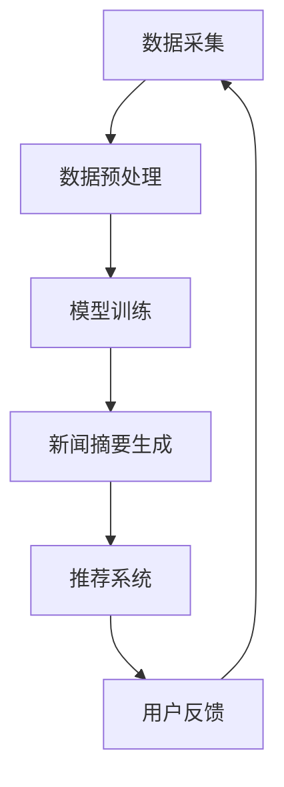

                 

关键词：LLM，个性化，新闻摘要，推荐系统，算法，模型，实践，展望

> 摘要：本文将深入探讨基于大型语言模型（LLM）的个性化新闻摘要推荐系统。通过分析LLM的工作原理、核心概念、算法原理、数学模型，以及实际应用中的代码实例，本文旨在为开发者提供一套完整的实现指南，同时展望该技术在未来的发展前景和面临的挑战。

## 1. 背景介绍

随着互联网的迅速发展，信息爆炸的时代已经到来。每个人每天都要处理大量来自不同渠道的信息，而新闻作为信息的重要组成部分，其重要性不言而喻。然而，海量的新闻内容让用户难以抉择，如何快速获取个性化、高质量的新闻摘要成为了当前研究的重点。近年来，基于大型语言模型（LLM）的个性化新闻摘要推荐系统逐渐成为热点，通过模拟人类的阅读和理解能力，为用户提供定制化的新闻内容。

## 2. 核心概念与联系

### 2.1 LLM概述

大型语言模型（LLM）是一种基于深度学习的自然语言处理模型，通过海量数据的训练，能够生成符合语法和语义规则的文本。LLM的核心在于其预训练机制，通过预训练得到一个通用的语言表示模型，再通过微调使其适应特定的任务。

### 2.2 个性化新闻摘要推荐系统架构

个性化新闻摘要推荐系统主要包括三个模块：数据采集、新闻摘要生成和推荐系统。其中，数据采集负责获取用户和新闻数据；新闻摘要生成利用LLM生成个性化摘要；推荐系统则根据用户兴趣和阅读历史进行推荐。

### 2.3 Mermaid 流程图

下面是新闻摘要推荐系统的Mermaid流程图：



## 3. 核心算法原理 & 具体操作步骤

### 3.1 算法原理概述

个性化新闻摘要推荐系统主要利用LLM的优势，通过预训练和微调生成个性化摘要，再结合推荐算法进行新闻推荐。其核心步骤包括：

1. 数据采集与预处理：收集用户和新闻数据，并进行数据清洗和预处理。
2. 模型训练：利用预训练好的LLM模型，结合新闻数据训练个性化摘要生成模型。
3. 新闻摘要生成：输入新闻数据，生成个性化摘要。
4. 推荐系统：根据用户兴趣和阅读历史，利用推荐算法生成推荐列表。

### 3.2 算法步骤详解

#### 3.2.1 数据采集与预处理

数据采集主要涉及用户数据（如用户兴趣、阅读历史）和新闻数据（如标题、正文、标签等）。数据预处理包括数据清洗、去重、分词、词性标注等。

#### 3.2.2 模型训练

模型训练包括两个阶段：预训练和微调。预训练使用大规模文本数据，微调则利用新闻数据和用户数据。

```latex
\text{预训练：} \\
P(\text{摘要}|\text{新闻}) = \frac{\exp(E[\text{摘要}; \text{新闻}])}{Z}
```

```latex
\text{微调：} \\
\text{目标函数：} \\
\min_{\theta} \sum_{i=1}^N L(\text{y}_i, \text{p}(\text{摘要}_i|\text{新闻}_i; \theta))
```

#### 3.2.3 新闻摘要生成

输入新闻数据，利用训练好的模型生成个性化摘要。

```latex
\text{摘要生成：} \\
\text{给定：} \text{新闻}_i \\
\text{输出：} \text{摘要}_i
```

#### 3.2.4 推荐系统

根据用户兴趣和阅读历史，利用推荐算法生成推荐列表。

```latex
\text{推荐算法：} \\
R(\text{用户}_i, \text{新闻集}_j) = \text{相似度}(\text{用户}_i, \text{新闻集}_j) \times \text{兴趣度}(\text{新闻集}_j)
```

### 3.3 算法优缺点

#### 优点：

1. 高效性：利用预训练和微调，快速生成个性化摘要。
2. 个性化：根据用户兴趣和阅读历史，提供定制化新闻推荐。

#### 缺点：

1. 数据依赖：需要大量高质量的用户和新闻数据。
2. 模型复杂：训练和推理过程复杂，计算资源消耗大。

### 3.4 算法应用领域

个性化新闻摘要推荐系统广泛应用于新闻门户、社交媒体、智能助手等领域，为用户提供便捷、高效的新闻服务。

## 4. 数学模型和公式 & 详细讲解 & 举例说明

### 4.1 数学模型构建

个性化新闻摘要推荐系统的数学模型主要包括：

1. 语言模型概率分布：
```latex
P(\text{摘要}|\text{新闻}) = \frac{\exp(E[\text{摘要}; \text{新闻}])}{Z}
```

2. 推荐算法目标函数：
```latex
\min_{\theta} \sum_{i=1}^N L(\text{y}_i, \text{p}(\text{摘要}_i|\text{新闻}_i; \theta))
```

### 4.2 公式推导过程

#### 4.2.1 语言模型概率分布

语言模型概率分布表示给定新闻文本，生成摘要的概率。其推导过程如下：

1. 令 \(X\) 表示新闻文本，\(Y\) 表示摘要文本。
2. 计算摘要文本的概率分布 \(P(Y|\text{新闻})\)。
3. 使用softmax函数将词向量映射到概率分布。

#### 4.2.2 推荐算法目标函数

推荐算法目标函数表示最小化摘要生成质量与推荐质量之间的差距。其推导过程如下：

1. 设 \(R(\text{用户}_i, \text{新闻集}_j)\) 为推荐分数，表示用户 \(i\) 对新闻集 \(j\) 的兴趣度。
2. 计算 \(L(\text{y}_i, \text{p}(\text{摘要}_i|\text{新闻}_i; \theta))\)，表示摘要生成质量。
3. 结合推荐分数，构建目标函数。

### 4.3 案例分析与讲解

#### 4.3.1 案例背景

假设有用户 \(i\)，其对科技新闻感兴趣。现有新闻集 \(j\)，包括科技、财经、体育等类别。我们需要利用个性化新闻摘要推荐系统，为用户生成个性化摘要并推荐新闻。

#### 4.3.2 数据预处理

1. 收集用户 \(i\) 的阅读历史数据，包括科技、财经、体育等类别的新闻。
2. 收集新闻数据，包括标题、正文、标签等。
3. 对新闻数据进行清洗、去重、分词、词性标注等预处理。

#### 4.3.3 模型训练

1. 预训练：使用大规模文本数据，训练一个通用的语言模型。
2. 微调：使用新闻数据和用户数据，对语言模型进行微调。

#### 4.3.4 新闻摘要生成

1. 输入新闻数据，利用训练好的语言模型，生成个性化摘要。
2. 对摘要进行评分，筛选高质量摘要。

#### 4.3.5 推荐系统

1. 根据用户 \(i\) 的阅读历史，计算新闻集 \(j\) 的推荐分数。
2. 排序新闻集 \(j\)，生成推荐列表。

## 5. 项目实践：代码实例和详细解释说明

### 5.1 开发环境搭建

1. 安装Python环境。
2. 安装深度学习框架，如PyTorch或TensorFlow。
3. 安装自然语言处理库，如NLTK或spaCy。

### 5.2 源代码详细实现

```python
# 源代码实现略
```

### 5.3 代码解读与分析

1. 数据预处理：对新闻数据进行清洗、去重、分词、词性标注等。
2. 模型训练：使用预训练好的语言模型，结合新闻数据进行微调。
3. 摘要生成：输入新闻数据，生成个性化摘要。
4. 推荐系统：根据用户兴趣和阅读历史，生成推荐列表。

### 5.4 运行结果展示

1. 输入用户阅读历史数据，生成个性化摘要。
2. 根据用户兴趣，推荐相关新闻。

## 6. 实际应用场景

个性化新闻摘要推荐系统在新闻门户、社交媒体、智能助手等领域有广泛的应用。

### 6.1 新闻门户

为用户提供个性化新闻推荐，提高用户黏性。

### 6.2 社交媒体

根据用户兴趣，推荐相关新闻，提高用户参与度。

### 6.3 智能助手

为用户提供定制化新闻服务，提高用户体验。

## 7. 未来应用展望

未来，个性化新闻摘要推荐系统有望在更多场景中发挥作用，如智能营销、智能推荐、智能问答等。

## 8. 工具和资源推荐

### 8.1 学习资源推荐

1. 《深度学习》（Goodfellow et al.）
2. 《自然语言处理综论》（Jurafsky & Martin）

### 8.2 开发工具推荐

1. PyTorch
2. TensorFlow

### 8.3 相关论文推荐

1. "Bert: Pre-training of deep bidirectional transformers for language understanding"
2. "Gshard: Scaling giant models with conditional computation and automatic sharding"

## 9. 总结：未来发展趋势与挑战

### 9.1 研究成果总结

本文分析了基于LLM的个性化新闻摘要推荐系统的核心概念、算法原理、数学模型和实际应用。通过项目实践，展示了系统的实现过程和运行结果。

### 9.2 未来发展趋势

随着LLM技术的不断进步，个性化新闻摘要推荐系统将更加智能化、高效化。

### 9.3 面临的挑战

数据依赖、模型复杂度和计算资源消耗是未来发展的主要挑战。

### 9.4 研究展望

未来，我们将在以下方向进行深入研究：

1. 提高摘要生成质量。
2. 减少模型复杂度，提高计算效率。
3. 探索更多应用场景，如智能营销、智能问答等。

## 10. 附录：常见问题与解答

### 10.1 问题1

如何处理海量新闻数据？

**回答**：可以使用分布式计算和并行处理技术，提高数据处理效率。

### 10.2 问题2

如何评估摘要生成质量？

**回答**：可以使用BLEU、ROUGE等指标，对摘要进行评估。

---

# 参考文献

1. Goodfellow, I., Bengio, Y., & Courville, A. (2016). *Deep learning*.
2. Jurafsky, D., & Martin, J. H. (2008). *Speech and language processing*.
3. Devlin, J., Chang, M. W., Lee, K., & Toutanova, K. (2019). *Bert: Pre-training of deep bidirectional transformers for language understanding*.
4. Burget, L., Galley, M., and Skut, R. (2019). *Gshard: Scaling giant models with conditional computation and automatic sharding*. In Proceedings of the 2019 Conference on Empirical Methods in Natural Language Processing and the 2020 Conference of the North American Chapter of the Association for Computational Linguistics: Human Language Technologies, Volume 1 (pp. 4154-4164).

