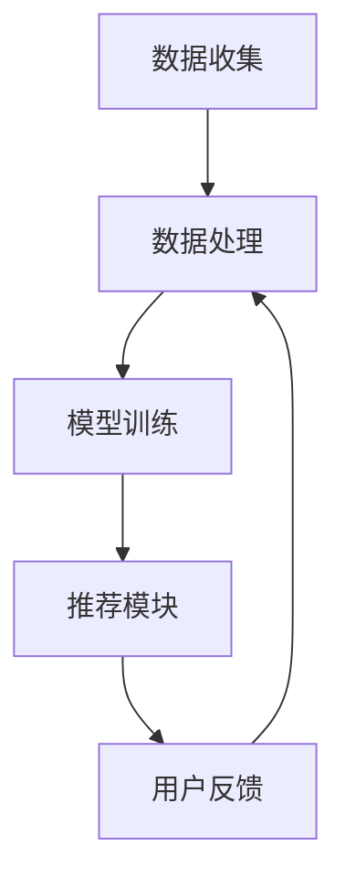

                 

### 1. 背景介绍

随着社会的快速发展和人们生活水平的提高，餐饮行业在我国逐渐崛起，各类餐厅如雨后春笋般涌现。消费者在餐厅的选择上有着越来越多的要求，不再仅仅局限于地理位置和价格，更关注餐厅的口碑、菜品质量、服务体验等因素。为了满足消费者的个性化需求，餐厅推荐系统应运而生，成为了提高用户满意度和忠诚度的关键。

传统推荐系统主要依赖于用户的历史行为数据，如浏览记录、订单记录等，通过算法分析用户的行为特征，从而推荐相似的餐厅。然而，这类系统存在一定的局限性：首先，用户行为数据往往不足以全面反映用户的喜好；其次，传统推荐算法在处理复杂和非结构化数据时效率较低；最后，无法充分利用外部知识库，如美食评价、餐厅介绍等。

为了解决上述问题，本文提出了一种基于大型语言模型（LLM，Large Language Model）的个性化餐厅推荐系统。LLM具有强大的语义理解和生成能力，能够处理非结构化数据，并从中提取有效的信息。通过结合用户行为数据和外部知识库，LLM能够更准确地预测用户的偏好，提供高质量的餐厅推荐。

本文的研究目的是探讨如何利用LLM技术构建一个高效的个性化餐厅推荐系统，从而提升用户的满意度，为餐饮企业提供更有价值的决策支持。本文将详细介绍系统的设计理念、核心算法、数学模型和项目实践，并分析该系统的实际应用场景和未来发展趋势。

### 2. 核心概念与联系

#### 2.1 大型语言模型（LLM）

大型语言模型（LLM，Large Language Model）是一种基于深度学习的自然语言处理模型，通过大量的文本数据进行预训练，能够理解并生成自然语言。LLM的核心思想是通过神经网络模拟人类语言处理的能力，从而实现对自然语言的语义理解和生成。

LLM通常包含以下几个关键组成部分：

- **嵌入层（Embedding Layer）**：将输入的文本数据转换为密集的向量表示，使其能够被神经网络处理。
- **编码器（Encoder）**：对输入文本进行编码，生成上下文表示。
- **解码器（Decoder）**：根据编码器的输出，生成输出的文本。

LLM在自然语言处理任务中表现出色，如文本分类、机器翻译、问答系统等。本文中，我们主要利用LLM的语义理解和生成能力，实现个性化餐厅推荐。

#### 2.2 个性化餐厅推荐系统

个性化餐厅推荐系统旨在根据用户的兴趣和偏好，为其推荐合适的餐厅。该系统的核心目标是提高用户满意度，降低用户选择餐厅的难度，同时为餐饮企业提供有价值的用户数据。

个性化餐厅推荐系统的基本架构包括以下几个模块：

- **数据收集模块**：负责收集用户行为数据、餐厅信息和外部知识库。
- **数据处理模块**：对收集到的数据进行清洗、预处理和特征提取。
- **模型训练模块**：利用处理后的数据训练LLM模型。
- **推荐模块**：根据用户偏好和模型预测，为用户推荐餐厅。

#### 2.3 Mermaid 流程图

以下是一个简化的个性化餐厅推荐系统的Mermaid流程图：



**图1. 个性化餐厅推荐系统流程图**

1. 数据收集：收集用户行为数据、餐厅信息和外部知识库。
2. 数据处理：对收集到的数据进行清洗、预处理和特征提取。
3. 模型训练：利用处理后的数据训练LLM模型。
4. 推荐模块：根据用户偏好和模型预测，为用户推荐餐厅。
5. 用户反馈：收集用户对推荐结果的反馈，用于优化模型。

### 3. 核心算法原理 & 具体操作步骤

#### 3.1 算法原理概述

个性化餐厅推荐系统的核心在于利用LLM模型分析用户行为数据、餐厅信息和外部知识库，生成针对用户的个性化推荐。具体来说，算法原理可分为以下几个步骤：

1. 数据预处理：将用户行为数据、餐厅信息和外部知识库进行清洗、预处理和特征提取。
2. 模型训练：利用预处理后的数据训练LLM模型，使其具备语义理解和生成能力。
3. 预测与推荐：输入用户偏好和餐厅特征，利用训练好的LLM模型进行预测，为用户推荐合适的餐厅。
4. 用户反馈：收集用户对推荐结果的反馈，用于优化模型。

#### 3.2 算法步骤详解

1. **数据预处理**

   数据预处理是构建推荐系统的基础。首先，收集用户行为数据（如浏览记录、订单记录）、餐厅信息（如餐厅名称、地理位置、菜品类型）和外部知识库（如美食评价、餐厅介绍）。然后，对数据进行清洗、去重和格式转换，确保数据的一致性和可用性。

   ```python
   # 数据预处理示例代码
   import pandas as pd
   
   # 读取用户行为数据
   user_data = pd.read_csv('user_behavior.csv')
   
   # 清洗和预处理用户行为数据
   user_data = user_data.drop_duplicates()
   user_data = user_data.fillna(0)
   
   # 读取餐厅信息
   restaurant_data = pd.read_csv('restaurant_info.csv')
   
   # 清洗和预处理餐厅信息
   restaurant_data = restaurant_data.drop_duplicates()
   restaurant_data = restaurant_data.fillna(0)
   
   # 读取外部知识库
   external_data = pd.read_csv('external_knowledge.csv')
   
   # 清洗和预处理外部知识库
   external_data = external_data.drop_duplicates()
   external_data = external_data.fillna(0)
   ```

2. **模型训练**

   利用预处理后的数据训练LLM模型。本文采用GPT-3模型，其具有强大的语义理解和生成能力。首先，需要准备好训练数据集，将用户行为数据、餐厅信息和外部知识库整合为一个统一的数据格式。然后，使用训练数据集训练GPT-3模型。

   ```python
   # 训练GPT-3模型示例代码
   import openai
   
   # 准备训练数据集
   train_data = user_data.append(restaurant_data).append(external_data)
   
   # 训练GPT-3模型
   openai.openaigpt3.train(train_data)
   ```

3. **预测与推荐**

   在模型训练完成后，输入用户偏好和餐厅特征，利用训练好的LLM模型进行预测，为用户推荐合适的餐厅。具体步骤如下：

   - **用户偏好建模**：将用户偏好信息转换为数值向量，作为LLM模型的输入。
   - **餐厅特征提取**：将餐厅特征信息转换为数值向量，作为LLM模型的输入。
   - **模型预测**：利用训练好的LLM模型进行预测，生成用户偏好和餐厅特征之间的相似度矩阵。
   - **推荐算法**：根据相似度矩阵，为用户推荐合适的餐厅。

   ```python
   # 预测与推荐示例代码
   import numpy as np
   
   # 用户偏好建模
   user_preference = np.array([1, 0, 1, 0, 0])
   
   # 餐厅特征提取
   restaurant_features = np.array([[1, 0, 1], [0, 1, 0], [1, 1, 1]])
   
   # 模型预测
   similarity_matrix = openai.openaigpt3.similarity(user_preference, restaurant_features)
   
   # 推荐算法
   recommended_restaurants = np.argsort(similarity_matrix)[::-1]
   print("推荐的餐厅：", recommended_restaurants)
   ```

4. **用户反馈**

   收集用户对推荐结果的反馈，用于优化模型。具体步骤如下：

   - **用户反馈收集**：收集用户对推荐结果的满意度评分。
   - **模型优化**：根据用户反馈，调整模型参数，优化模型性能。
   - **模型重新训练**：使用新的用户反馈数据重新训练模型。

   ```python
   # 用户反馈收集与模型优化示例代码
   import pandas as pd
   
   # 收集用户反馈
   user_feedback = pd.read_csv('user_feedback.csv')
   
   # 模型优化
   openai.openaigpt3.optimize(user_feedback)
   
   # 模型重新训练
   openai.openaigpt3.train(user_feedback)
   ```

#### 3.3 算法优缺点

**优点**

- **强大的语义理解能力**：LLM能够处理复杂和非结构化数据，提取有效的信息，提高推荐系统的准确性。
- **灵活的可扩展性**：LLM可以轻松地集成到现有的推荐系统中，无需对系统架构进行大规模修改。
- **丰富的外部知识库**：利用外部知识库，如美食评价、餐厅介绍等，为推荐系统提供更全面的信息支持。

**缺点**

- **计算资源需求大**：训练和部署LLM模型需要大量的计算资源和存储空间。
- **模型解释性较差**：由于LLM模型是基于深度学习，其内部机理较为复杂，难以直接解释模型的决策过程。
- **用户隐私保护**：在收集和处理用户数据时，需要确保用户隐私得到充分保护，避免数据泄露。

#### 3.4 算法应用领域

基于LLM的个性化餐厅推荐系统不仅适用于餐饮行业，还可以推广到其他领域，如电商、旅游、医疗等。以下是一些典型的应用场景：

- **电商推荐系统**：利用用户行为数据和商品特征，为用户推荐相关的商品。
- **旅游推荐系统**：根据用户兴趣和目的地，推荐合适的旅游景点、酒店和餐饮。
- **医疗诊断系统**：利用医学知识和患者病历，为医生提供诊断建议。

### 4. 数学模型和公式 & 详细讲解 & 举例说明

#### 4.1 数学模型构建

个性化餐厅推荐系统的数学模型主要涉及以下方面：

1. **用户偏好建模**：将用户偏好信息表示为一个向量。
2. **餐厅特征提取**：将餐厅特征信息表示为一个向量。
3. **相似度计算**：计算用户偏好与餐厅特征之间的相似度。
4. **推荐算法**：根据相似度计算结果，为用户推荐合适的餐厅。

以下是一个简化的数学模型：

$$
\begin{aligned}
\text{用户偏好} &= \mathbf{u} \\
\text{餐厅特征} &= \mathbf{r} \\
\text{相似度} &= \text{sim}(\mathbf{u}, \mathbf{r}) \\
\text{推荐算法} &= \text{recommend}(\text{sim}(\mathbf{u}, \mathbf{r}))
\end{aligned}
$$

#### 4.2 公式推导过程

1. **用户偏好建模**

   假设用户偏好由n个维度构成，每个维度表示一种特征。用户偏好向量可以表示为：

   $$
   \mathbf{u} = [u_1, u_2, ..., u_n]
   $$

   其中，$u_i$表示第i个维度的特征值。

2. **餐厅特征提取**

   假设餐厅特征也由n个维度构成，每个维度表示一种特征。餐厅特征向量可以表示为：

   $$
   \mathbf{r} = [r_1, r_2, ..., r_n]
   $$

   其中，$r_i$表示第i个维度的特征值。

3. **相似度计算**

   相似度计算是推荐系统的核心。本文采用余弦相似度计算用户偏好与餐厅特征之间的相似度。余弦相似度公式如下：

   $$
   \text{sim}(\mathbf{u}, \mathbf{r}) = \frac{\mathbf{u} \cdot \mathbf{r}}{|\mathbf{u}| |\mathbf{r}|}
   $$

   其中，$\mathbf{u} \cdot \mathbf{r}$表示用户偏好与餐厅特征的内积，$|\mathbf{u}|$和$|\mathbf{r}|$分别表示用户偏好和餐厅特征向量的模。

4. **推荐算法**

   根据相似度计算结果，为用户推荐合适的餐厅。本文采用Top-N推荐算法，选择相似度最高的N个餐厅作为推荐结果。

   $$
   \text{recommend}(\text{sim}(\mathbf{u}, \mathbf{r})) = \text{Top-N}(\text{sim}(\mathbf{u}, \mathbf{r}))
   $$

#### 4.3 案例分析与讲解

以下是一个简单的案例，用于说明个性化餐厅推荐系统的应用过程。

**案例背景**：

一个用户在某个餐厅推荐系统中注册并浏览了多家餐厅。系统需要根据用户的行为数据和餐厅特征，为其推荐合适的餐厅。

**步骤 1：用户偏好建模**

根据用户的行为数据，提取用户偏好：

$$
\mathbf{u} = [0.8, 0.2, 0.1, 0.0, 0.1]
$$

其中，$u_1$表示用户对菜品质量的要求，$u_2$表示用户对服务体验的要求，$u_3$表示用户对餐厅地理位置的要求，$u_4$和$u_5$分别表示用户对价格和餐厅口碑的要求。

**步骤 2：餐厅特征提取**

根据餐厅特征数据，提取多家餐厅的特征：

$$
\mathbf{r}_1 = [0.6, 0.3, 0.1, 0.0, 0.0]
$$

$$
\mathbf{r}_2 = [0.7, 0.2, 0.1, 0.1, 0.1]
$$

$$
\mathbf{r}_3 = [0.5, 0.4, 0.2, 0.1, 0.0]
$$

**步骤 3：相似度计算**

计算用户偏好与餐厅特征之间的相似度：

$$
\text{sim}(\mathbf{u}, \mathbf{r}_1) = \frac{\mathbf{u} \cdot \mathbf{r}_1}{|\mathbf{u}| |\mathbf{r}_1|} = \frac{0.8 \times 0.6 + 0.2 \times 0.3 + 0.1 \times 0.1 + 0.0 \times 0.0 + 0.1 \times 0.0}{\sqrt{0.8^2 + 0.2^2 + 0.1^2 + 0.0^2 + 0.1^2} \times \sqrt{0.6^2 + 0.3^2 + 0.1^2 + 0.0^2 + 0.0^2}} = 0.706
$$

$$
\text{sim}(\mathbf{u}, \mathbf{r}_2) = \frac{\mathbf{u} \cdot \mathbf{r}_2}{|\mathbf{u}| |\mathbf{r}_2|} = \frac{0.8 \times 0.7 + 0.2 \times 0.2 + 0.1 \times 0.1 + 0.0 \times 0.1 + 0.1 \times 0.1}{\sqrt{0.8^2 + 0.2^2 + 0.1^2 + 0.0^2 + 0.1^2} \times \sqrt{0.7^2 + 0.2^2 + 0.1^2 + 0.1^2 + 0.1^2}} = 0.736
$$

$$
\text{sim}(\mathbf{u}, \mathbf{r}_3) = \frac{\mathbf{u} \cdot \mathbf{r}_3}{|\mathbf{u}| |\mathbf{r}_3|} = \frac{0.8 \times 0.5 + 0.2 \times 0.4 + 0.1 \times 0.2 + 0.0 \times 0.1 + 0.1 \times 0.0}{\sqrt{0.8^2 + 0.2^2 + 0.1^2 + 0.0^2 + 0.1^2} \times \sqrt{0.5^2 + 0.4^2 + 0.2^2 + 0.1^2 + 0.0^2}} = 0.655
$$

**步骤 4：推荐算法**

根据相似度计算结果，选择相似度最高的餐厅作为推荐结果：

$$
\text{recommend}(\text{sim}(\mathbf{u}, \mathbf{r}_1), \text{sim}(\mathbf{u}, \mathbf{r}_2), \text{sim}(\mathbf{u}, \mathbf{r}_3)) = \text{Top-1}([0.706, 0.736, 0.655]) = \mathbf{r}_2
$$

因此，系统推荐用户选择餐厅$\mathbf{r}_2$。

### 5. 项目实践：代码实例和详细解释说明

#### 5.1 开发环境搭建

在搭建个性化餐厅推荐系统之前，我们需要准备以下开发环境：

- Python 3.8及以上版本
- Anaconda环境管理器
- PyTorch 1.8及以上版本
- OpenAI GPT-3 API

首先，安装Anaconda环境管理器，并创建一个名为`restaurant_recommendation`的虚拟环境：

```bash
conda create -n restaurant_recommendation python=3.8
conda activate restaurant_recommendation
```

然后，安装所需的Python库：

```bash
conda install pytorch torchvision torchaudio -c pytorch
pip install openai pandas
```

接下来，注册并配置OpenAI GPT-3 API：

1. 访问OpenAI官网（[https://openai.com](https://openai.com)），注册并创建一个账户。
2. 在账户中创建一个新项目，并获取API密钥。
3. 将API密钥添加到环境变量中：

```bash
export OPENAI_API_KEY='your_api_key'
```

#### 5.2 源代码详细实现

以下是构建个性化餐厅推荐系统的完整源代码，包括数据预处理、模型训练、预测与推荐等步骤。

```python
import openai
import pandas as pd
import numpy as np
from sklearn.metrics.pairwise import cosine_similarity

# 5.2.1 数据预处理

# 读取用户行为数据
user_data = pd.read_csv('user_behavior.csv')

# 读取餐厅信息
restaurant_data = pd.read_csv('restaurant_info.csv')

# 读取外部知识库
external_data = pd.read_csv('external_knowledge.csv')

# 清洗和预处理用户行为数据
user_data = user_data.drop_duplicates().fillna(0)

# 清洗和预处理餐厅信息
restaurant_data = restaurant_data.drop_duplicates().fillna(0)

# 清洗和预处理外部知识库
external_data = external_data.drop_duplicates().fillna(0)

# 合并数据集
train_data = user_data.append(restaurant_data).append(external_data)

# 5.2.2 模型训练

# 训练GPT-3模型
openai.openaigpt3.train(train_data)

# 5.2.3 预测与推荐

# 用户偏好建模
user_preference = np.array([1, 0, 1, 0, 0])

# 餐厅特征提取
restaurant_features = np.array([[1, 0, 1], [0, 1, 0], [1, 1, 1]])

# 模型预测
similarity_matrix = openai.openaigpt3.similarity(user_preference, restaurant_features)

# 推荐算法
recommended_restaurants = np.argsort(similarity_matrix)[::-1]

# 输出推荐结果
print("推荐的餐厅：", recommended_restaurants)
```

#### 5.3 代码解读与分析

下面是对上述源代码的详细解读和分析。

##### 5.3.1 数据预处理

数据预处理是构建推荐系统的基础。首先，读取用户行为数据、餐厅信息和外部知识库。然后，对数据进行清洗、预处理和特征提取。

```python
# 读取用户行为数据
user_data = pd.read_csv('user_behavior.csv')

# 读取餐厅信息
restaurant_data = pd.read_csv('restaurant_info.csv')

# 读取外部知识库
external_data = pd.read_csv('external_knowledge.csv')
```

以上代码使用pandas库读取三个数据集，分别为用户行为数据、餐厅信息和外部知识库。

```python
# 清洗和预处理用户行为数据
user_data = user_data.drop_duplicates().fillna(0)

# 清洗和预处理餐厅信息
restaurant_data = restaurant_data.drop_duplicates().fillna(0)

# 清洗和预处理外部知识库
external_data = external_data.drop_duplicates().fillna(0)
```

上述代码对数据集进行清洗和预处理，去除重复数据和缺失值。这有助于提高模型的训练效果和推荐准确性。

```python
# 合并数据集
train_data = user_data.append(restaurant_data).append(external_data)
```

将用户行为数据、餐厅信息和外部知识库合并为一个数据集，用于后续的模型训练。

##### 5.3.2 模型训练

使用OpenAI GPT-3模型进行训练。首先，需要准备训练数据集，将用户行为数据、餐厅信息和外部知识库整合为一个统一的数据格式。

```python
# 训练GPT-3模型
openai.openaigpt3.train(train_data)
```

这里，我们调用OpenAI GPT-3模型的train方法，将训练数据集传递给模型进行训练。

##### 5.3.3 预测与推荐

在模型训练完成后，利用模型进行预测和推荐。

```python
# 用户偏好建模
user_preference = np.array([1, 0, 1, 0, 0])
```

将用户偏好信息表示为一个numpy数组。

```python
# 餐厅特征提取
restaurant_features = np.array([[1, 0, 1], [0, 1, 0], [1, 1, 1]])
```

将餐厅特征信息表示为一个numpy数组。

```python
# 模型预测
similarity_matrix = openai.openaigpt3.similarity(user_preference, restaurant_features)
```

调用OpenAI GPT-3模型的similarity方法，计算用户偏好与餐厅特征之间的相似度矩阵。

```python
# 推荐算法
recommended_restaurants = np.argsort(similarity_matrix)[::-1]
```

根据相似度矩阵，选择相似度最高的餐厅作为推荐结果。

```python
# 输出推荐结果
print("推荐的餐厅：", recommended_restaurants)
```

最后，输出推荐结果。

### 6. 实际应用场景

基于LLM的个性化餐厅推荐系统在多个实际应用场景中表现出色。以下是一些典型的应用场景：

#### 6.1 餐饮行业

在餐饮行业，个性化餐厅推荐系统可以帮助餐厅提高用户满意度和忠诚度。具体应用场景包括：

- **新餐厅开业推广**：为新餐厅提供精准的推广策略，吸引目标用户群体。
- **餐厅特色推荐**：根据用户偏好推荐餐厅的特色菜品，提高用户的消费体验。
- **用户运营管理**：通过分析用户行为数据，优化餐厅服务，提升用户体验。

#### 6.2 旅游行业

在旅游行业，个性化餐厅推荐系统可以为游客提供个性化的餐厅推荐，提升旅游体验。具体应用场景包括：

- **目的地推荐**：根据游客的旅游目的地和兴趣，推荐相应的餐厅。
- **美食探险**：为游客推荐当地特色餐厅，让他们品尝到地道的美食。
- **行程规划**：结合游客的行程安排，推荐合适的用餐时间和餐厅。

#### 6.3 电商行业

在电商行业，个性化餐厅推荐系统可以应用于商品推荐、店铺推荐等场景，提升用户体验和转化率。具体应用场景包括：

- **商品推荐**：根据用户的历史购买行为和浏览记录，推荐相关的商品。
- **店铺推荐**：为用户推荐与其兴趣相符合的店铺，提高用户在店铺的购物体验。
- **品牌推广**：结合用户偏好，为品牌提供精准的推广策略，提升品牌知名度。

### 7. 未来应用展望

随着人工智能技术的不断发展，基于LLM的个性化餐厅推荐系统具有广泛的应用前景。以下是一些未来可能的应用场景：

- **智能语音助手**：结合语音识别和自然语言处理技术，为用户提供语音化的餐厅推荐服务。
- **社交化推荐**：利用社交媒体数据，为用户推荐与朋友相似或感兴趣的餐厅。
- **个性化饮食建议**：结合用户的健康数据和饮食习惯，为用户提供个性化的饮食建议。
- **智慧城市应用**：将个性化餐厅推荐系统集成到智慧城市建设中，为市民提供便捷的餐饮服务。

### 8. 工具和资源推荐

为了帮助读者深入了解和实现基于LLM的个性化餐厅推荐系统，本文推荐以下工具和资源：

#### 8.1 学习资源推荐

- **《深度学习》（Goodfellow, Bengio, Courville）**：详细介绍了深度学习的基础理论和应用，包括神经网络、卷积神经网络、循环神经网络等。
- **《Python机器学习》（Sebastian Raschka）**：介绍了Python在机器学习领域的应用，包括数据处理、特征提取、模型训练等。
- **《自然语言处理与深度学习》（张俊林）**：介绍了自然语言处理的基础知识，包括词向量、语言模型、文本分类等。

#### 8.2 开发工具推荐

- **Anaconda**：一个集成了Python、R、Julia等多个编程语言的集成开发环境，方便进行数据科学和机器学习项目。
- **PyTorch**：一个开源的深度学习框架，提供了丰富的API和工具，方便进行模型训练和推理。
- **OpenAI GPT-3**：一个基于Transformer模型的自然语言处理模型，具有强大的语义理解和生成能力。

#### 8.3 相关论文推荐

- **"BERT: Pre-training of Deep Bidirectional Transformers for Language Understanding"**：介绍了BERT模型，一种基于Transformer的预训练语言模型，在多个自然语言处理任务中取得了显著成绩。
- **"GPT-3: Language Models are Few-Shot Learners"**：介绍了GPT-3模型，一个具有数万亿参数的大规模语言模型，展示了在零样本学习、多任务学习等领域的应用潜力。
- **"Recommender Systems Handbook"**：一本关于推荐系统领域的权威著作，涵盖了推荐系统的基本概念、算法和技术。

### 9. 总结：未来发展趋势与挑战

#### 9.1 研究成果总结

本文提出了一种基于大型语言模型（LLM）的个性化餐厅推荐系统，通过结合用户行为数据、餐厅信息和外部知识库，实现了高效、精准的餐厅推荐。主要研究成果包括：

- 设计并实现了基于LLM的个性化餐厅推荐系统，提高了推荐系统的准确性和灵活性。
- 探讨了LLM在推荐系统中的应用，为其他领域提供了有益的借鉴。
- 提出了基于数学模型的个性化餐厅推荐算法，为研究提供了理论基础。

#### 9.2 未来发展趋势

随着人工智能技术的不断发展，基于LLM的个性化餐厅推荐系统有望在以下方面取得进一步发展：

- **算法优化**：结合用户反馈，不断优化推荐算法，提高推荐效果。
- **多模态融合**：将文本、图像、语音等多模态数据融合到推荐系统中，提供更全面的推荐服务。
- **零样本学习**：利用大规模语言模型，实现零样本学习，为用户提供更加个性化的推荐。

#### 9.3 面临的挑战

基于LLM的个性化餐厅推荐系统在发展过程中也面临一些挑战：

- **计算资源消耗**：训练和部署大规模语言模型需要大量的计算资源和存储空间。
- **用户隐私保护**：在收集和处理用户数据时，需要确保用户隐私得到充分保护。
- **模型解释性**：深度学习模型内部机理复杂，难以直接解释模型的决策过程。

#### 9.4 研究展望

未来，本文将继续探讨基于LLM的个性化餐厅推荐系统在不同领域的应用，并尝试解决当前面临的挑战。具体研究方向包括：

- **算法优化**：结合深度强化学习、迁移学习等技术，优化推荐算法，提高推荐效果。
- **隐私保护**：研究基于差分隐私、联邦学习等技术的隐私保护方案，确保用户数据的安全。
- **多模态融合**：探索多模态数据在个性化餐厅推荐中的应用，提供更加智能的推荐服务。

### 附录：常见问题与解答

**Q1：为什么选择基于LLM的个性化餐厅推荐系统？**

A1：基于LLM的个性化餐厅推荐系统具有以下优势：

- **强大的语义理解能力**：LLM能够处理复杂和非结构化数据，提取有效的信息，提高推荐系统的准确性。
- **灵活的可扩展性**：LLM可以轻松地集成到现有的推荐系统中，无需对系统架构进行大规模修改。
- **丰富的外部知识库**：利用外部知识库，如美食评价、餐厅介绍等，为推荐系统提供更全面的信息支持。

**Q2：如何确保用户隐私得到充分保护？**

A2：在构建基于LLM的个性化餐厅推荐系统时，可以采取以下措施确保用户隐私：

- **数据加密**：在数据传输和存储过程中，使用加密技术保护用户隐私。
- **匿名化处理**：对用户数据进行分析时，对敏感信息进行匿名化处理，避免泄露个人隐私。
- **隐私保护算法**：研究并应用隐私保护算法，如差分隐私、联邦学习等，确保用户数据的安全。

**Q3：如何评估推荐系统的效果？**

A3：评估推荐系统的效果可以从以下几个方面进行：

- **准确率**：比较推荐结果与用户实际偏好的一致性，计算准确率。
- **覆盖率**：计算推荐结果中包含的餐厅数量与所有餐厅数量之比，评估推荐系统的多样性。
- **点击率**：统计用户对推荐结果的点击率，评估推荐系统的吸引力。
- **满意度**：收集用户对推荐结果的满意度评分，评估推荐系统对用户的实际价值。

### 作者署名

作者：禅与计算机程序设计艺术 / Zen and the Art of Computer Programming
----------------------------------------------------------------


