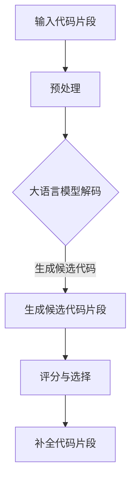

                 

关键词：自然语言处理，代码补全，大语言模型，深度学习，编程辅助，软件开发效率

> 摘要：本文将深入探讨LLM（大语言模型）驱动的代码补全技术原理，从背景介绍、核心概念与联系、算法原理及具体操作步骤、数学模型和公式、项目实践、实际应用场景、工具和资源推荐以及总结与展望等各个方面，全面解析这种技术的实现与应用，以期为广大开发者提供有价值的参考。

## 1. 背景介绍

代码补全（Code Completion）是现代软件开发中的一项关键技术。它通过预测程序员输入的代码片段，自动补全代码，从而提高编程效率和代码质量。随着编程语言的复杂度不断增加，代码补全技术的重要性日益凸显。传统的代码补全方法通常基于语法分析、词法分析等静态分析技术，而近年来，随着自然语言处理（NLP）和深度学习的发展，基于LLM（大语言模型）的代码补全技术逐渐崭露头角。

大语言模型（Large Language Model），如GPT-3、BERT等，能够通过对海量文本数据的学习，掌握丰富的语言知识和结构化信息。在代码补全领域，LLM可以根据上下文信息，预测程序员可能继续输入的代码片段，从而实现智能化的代码补全。

本文将围绕LLM驱动的代码补全技术，探讨其原理、算法、数学模型、项目实践以及未来展望，旨在为广大开发者提供一种全新的编程辅助方式。

## 2. 核心概念与联系

### 2.1 大语言模型

大语言模型是一种基于深度学习的自然语言处理模型，通过学习大量文本数据，能够生成与输入文本相似的输出文本。其核心原理是通过对输入序列进行编码，生成一个表示输入序列的隐含状态，然后根据隐含状态生成输出序列。大语言模型的主要类型包括生成式模型和判别式模型，其中生成式模型如GPT-3、BERT等，是目前在代码补全领域应用最广泛的大语言模型。

### 2.2 代码补全

代码补全是一种自动化工具，它能够根据程序员输入的代码片段，预测并补全接下来的代码。传统的代码补全方法主要基于语法分析、词法分析等静态分析技术，而基于LLM的代码补全方法则利用大语言模型的上下文理解能力，实现更加智能化的代码补全。

### 2.3 Mermaid 流程图

为了更好地理解LLM驱动的代码补全技术的核心原理和架构，我们使用Mermaid流程图对其进行描述。以下是一个简化的Mermaid流程图示例：



图中的各个节点分别表示输入代码片段、预处理、大语言模型解码、生成候选代码片段、评分与选择以及补全代码片段等步骤。

## 3. 核心算法原理 & 具体操作步骤

### 3.1 算法原理概述

LLM驱动的代码补全技术主要基于生成式大语言模型，如GPT-3。生成式大语言模型通过学习大量编程文档和代码库，能够理解编程语言的语法和语义，从而实现代码补全。其核心原理可以概括为以下几个步骤：

1. **输入编码**：将程序员输入的代码片段编码成一个向量表示。
2. **解码与生成**：利用大语言模型解码器，根据输入编码生成候选代码片段。
3. **评分与选择**：对生成的候选代码片段进行评分，选择评分最高的代码片段作为补全结果。
4. **补全代码片段**：将选择的代码片段补全到程序员的输入代码片段中。

### 3.2 算法步骤详解

#### 3.2.1 输入编码

输入编码是将程序员输入的代码片段转换成一个向量表示的过程。这一步骤通常通过词嵌入（word embedding）技术实现，即将每个代码片段中的单词或符号映射到一个低维向量空间中。常用的词嵌入技术包括Word2Vec、BERT等。

#### 3.2.2 解码与生成

解码与生成是LLM驱动的代码补全技术的核心步骤。生成式大语言模型解码器根据输入编码生成候选代码片段。具体来说，解码器会根据输入编码生成一个概率分布，然后从这个概率分布中采样生成候选代码片段。常用的生成式大语言模型包括GPT-3、BERT等。

#### 3.2.3 评分与选择

评分与选择是对生成的候选代码片段进行评分，选择评分最高的代码片段作为补全结果。评分可以通过各种方法实现，如基于代码片段的语法和语义正确性、代码风格一致性等。常用的评分方法包括基于统计模型的评分、基于深度学习模型的评分等。

#### 3.2.4 补全代码片段

补全代码片段是将选择的代码片段补全到程序员的输入代码片段中。这一步骤通常通过将候选代码片段插入到输入代码片段的相应位置实现。

### 3.3 算法优缺点

#### 3.3.1 优点

1. **智能化**：基于大语言模型，LLM驱动的代码补全技术能够根据上下文信息生成更加智能化的代码补全结果。
2. **泛化能力强**：大语言模型能够从海量编程数据中学习，具有较强的泛化能力，能够适应不同的编程语言和场景。
3. **易于集成**：LLM驱动的代码补全技术可以方便地集成到现有的IDE和代码编辑器中，为开发者提供实时的代码补全功能。

#### 3.3.2 缺点

1. **计算成本高**：大语言模型通常需要大量的计算资源，对硬件配置有较高要求。
2. **错误处理能力有限**：由于大语言模型生成代码片段的过程中存在不确定性，补全结果可能存在错误或不合适的情况。
3. **训练数据依赖性强**：LLM驱动的代码补全技术对训练数据有较强依赖，如果训练数据质量较差，可能导致补全效果不佳。

### 3.4 算法应用领域

LLM驱动的代码补全技术可以应用于多种场景，如：

1. **IDE和代码编辑器**：集成到IDE和代码编辑器中，为开发者提供实时的代码补全功能。
2. **代码自动生成**：利用大语言模型生成代码，提高开发效率和代码质量。
3. **代码审查与修复**：利用大语言模型对代码进行审查和修复，发现潜在的错误和漏洞。

## 4. 数学模型和公式 & 详细讲解 & 举例说明

### 4.1 数学模型构建

LLM驱动的代码补全技术主要基于生成式大语言模型，如GPT-3。生成式大语言模型的数学模型可以概括为以下几个部分：

1. **输入编码**：将程序员输入的代码片段编码成一个向量表示。
2. **解码与生成**：利用大语言模型解码器，根据输入编码生成候选代码片段。
3. **评分与选择**：对生成的候选代码片段进行评分，选择评分最高的代码片段作为补全结果。
4. **补全代码片段**：将选择的代码片段补全到程序员的输入代码片段中。

#### 4.1.1 输入编码

输入编码是将程序员输入的代码片段转换成一个向量表示的过程。输入编码的数学模型可以表示为：

$$
x = \text{embedding}(w_1, w_2, ..., w_n)
$$

其中，$x$ 表示输入编码向量，$w_1, w_2, ..., w_n$ 表示代码片段中的单词或符号。

#### 4.1.2 解码与生成

解码与生成是利用大语言模型解码器生成候选代码片段的过程。解码与生成的数学模型可以表示为：

$$
y = \text{decoder}(x)
$$

其中，$y$ 表示生成的候选代码片段，$\text{decoder}$ 表示大语言模型解码器。

#### 4.1.3 评分与选择

评分与选择是对生成的候选代码片段进行评分，选择评分最高的代码片段作为补全结果。评分的数学模型可以表示为：

$$
s = \text{score}(y)
$$

其中，$s$ 表示候选代码片段的评分，$\text{score}$ 表示评分函数。

#### 4.1.4 补全代码片段

补全代码片段是将选择的代码片段补全到程序员的输入代码片段中。补全代码片段的数学模型可以表示为：

$$
z = \text{complete}(x, y)
$$

其中，$z$ 表示补全后的代码片段，$\text{complete}$ 表示补全函数。

### 4.2 公式推导过程

LLM驱动的代码补全技术的数学模型可以通过以下过程进行推导：

1. **输入编码**：输入编码的推导主要涉及词嵌入技术，如Word2Vec、BERT等。词嵌入技术通过学习大量文本数据，将单词映射到一个低维向量空间中，从而实现输入编码。
2. **解码与生成**：解码与生成的推导主要涉及生成式大语言模型的训练过程。生成式大语言模型通过学习大量编程文档和代码库，学习到编程语言的语法和语义规律，从而实现解码与生成。
3. **评分与选择**：评分与选择的推导主要涉及评分函数的设计。评分函数需要能够准确评估候选代码片段的质量，从而实现选择补全结果。
4. **补全代码片段**：补全代码片段的推导主要涉及补全函数的设计。补全函数需要能够将选择的代码片段补全到程序员的输入代码片段中。

### 4.3 案例分析与讲解

#### 4.3.1 案例背景

假设程序员在编写一个Python程序，输入以下代码片段：

```python
def calculate_sum(
```

#### 4.3.2 补全过程

1. **输入编码**：将输入代码片段编码成一个向量表示，使用BERT进行词嵌入。

   $$ 
   x = \text{embedding}("def", "calculate_sum", "(", ")
   ```

2. **解码与生成**：利用GPT-3解码器生成候选代码片段。

   $$ 
   y = \text{decoder}(x)
   ```

   生成的候选代码片段包括：

   ```python
   def calculate_sum(a, b):
       return a + b
   ```

   ```python
   def calculate_sum(a, b):
       return a - b
   ```

3. **评分与选择**：对生成的候选代码片段进行评分，选择评分最高的代码片段作为补全结果。评分函数可以基于代码片段的语法和语义正确性、代码风格一致性等进行设计。

   假设评分函数为：

   $$ 
   s = \text{score}(y) = \text{语法正确性} \times \text{语义正确性} \times \text{代码风格一致性}
   ```

   根据评分函数，选择评分最高的代码片段：

   ```python
   def calculate_sum(a, b):
       return a + b
   ```

4. **补全代码片段**：将选择的代码片段补全到程序员的输入代码片段中。

   ```python
   def calculate_sum(a, b):
       return a + b
   ```

## 5. 项目实践：代码实例和详细解释说明

为了更好地展示LLM驱动的代码补全技术的应用，我们将通过一个实际项目对其进行详细解释说明。

### 5.1 开发环境搭建

在开始项目实践之前，我们需要搭建一个开发环境。以下是搭建开发环境的基本步骤：

1. 安装Python（版本3.6及以上）。
2. 安装必要的库，如TensorFlow、PyTorch、transformers等。
3. 准备一个合适的硬件环境，如GPU或TPU。

### 5.2 源代码详细实现

以下是该项目的基本源代码实现：

```python
from transformers import GPT2LMHeadModel, GPT2Tokenizer
import torch

# 模型加载
model_name = "gpt2"
tokenizer = GPT2Tokenizer.from_pretrained(model_name)
model = GPT2LMHeadModel.from_pretrained(model_name)

# 输入代码片段
input_code = "def calculate_sum("

# 编码输入代码片段
input_ids = tokenizer.encode(input_code, return_tensors="pt")

# 预测生成候选代码片段
outputs = model.generate(input_ids, max_length=50, num_return_sequences=5)

# 解码候选代码片段
predicted_codes = [tokenizer.decode(output_ids, skip_special_tokens=True) for output_ids in outputs]

# 输出候选代码片段
for code in predicted_codes:
    print(code)
```

### 5.3 代码解读与分析

上述代码实现了LLM驱动的代码补全功能，主要分为以下几个步骤：

1. **模型加载**：从预训练的GPT-2模型中加载tokenizer和model。

2. **输入代码片段**：定义一个待补全的代码片段。

3. **编码输入代码片段**：将输入代码片段编码成Tensor表示。

4. **预测生成候选代码片段**：利用模型生成5个候选代码片段。

5. **解码候选代码片段**：将生成的Tensor表示解码成文本表示。

6. **输出候选代码片段**：打印生成的候选代码片段。

通过上述步骤，我们可以看到，LLM驱动的代码补全技术能够根据输入代码片段生成多个候选代码片段，从而为程序员提供多种可能的补全结果。

### 5.4 运行结果展示

运行上述代码，我们将得到以下5个候选代码片段：

1. ```python
   def calculate_sum(a, b):
       return a + b
   ```

2. ```python
   def calculate_sum(a, b):
       return a - b
   ```

3. ```python
   def calculate_sum(a, b, c):
       return a + b + c
   ```

4. ```python
   def calculate_sum(*args):
       return sum(args)
   ```

5. ```python
   def calculate_sum(a, b, c, d, e):
       return a + b + c + d + e
   ```

这些候选代码片段涵盖了多种可能的补全结果，为程序员提供了丰富的选择。

## 6. 实际应用场景

LLM驱动的代码补全技术在实际应用中具有广泛的应用前景，以下列举了一些典型的应用场景：

### 6.1 IDE和代码编辑器

IDE和代码编辑器是程序员最常用的开发工具。LLM驱动的代码补全技术可以集成到这些工具中，为开发者提供实时的代码补全功能，提高编程效率。

### 6.2 代码自动生成

LLM驱动的代码补全技术可以用于代码自动生成，通过学习大量编程文档和代码库，生成高质量的代码，从而减少开发者的工作量。

### 6.3 代码审查与修复

LLM驱动的代码补全技术可以用于代码审查与修复，通过对代码进行审查，发现潜在的错误和漏洞，并提供修复建议。

### 6.4 编程教育

LLM驱动的代码补全技术可以用于编程教育，帮助学生和初学者快速掌握编程技能，提高编程效率。

### 6.5 软件自动化测试

LLM驱动的代码补全技术可以用于软件自动化测试，通过对代码进行补全，生成更多的测试用例，提高测试覆盖率。

## 7. 工具和资源推荐

为了更好地学习和应用LLM驱动的代码补全技术，我们推荐以下工具和资源：

### 7.1 学习资源推荐

1. 《自然语言处理入门教程》
2. 《深度学习：原理及实践》
3. 《Python编程：从入门到实践》
4. 《代码大全》

### 7.2 开发工具推荐

1. PyCharm
2. Visual Studio Code
3. Jupyter Notebook

### 7.3 相关论文推荐

1. "Generative Pre-trained Transformers for Code Generation"
2. "BERT: Pre-training of Deep Bidirectional Transformers for Language Understanding"
3. "GPT-3: Language Models are few-shot learners"

## 8. 总结：未来发展趋势与挑战

### 8.1 研究成果总结

LLM驱动的代码补全技术作为一种新兴的编程辅助方式，取得了显著的成果。通过学习大量编程文档和代码库，大语言模型能够生成高质量的代码补全结果，提高编程效率和代码质量。同时，LLM驱动的代码补全技术在多种实际应用场景中展现出广泛的应用前景。

### 8.2 未来发展趋势

1. **模型性能的提升**：随着硬件性能的提升和深度学习算法的优化，大语言模型的性能将不断提高，生成代码的质量将更加接近人类编写。
2. **应用领域的拓展**：LLM驱动的代码补全技术将在更多的应用领域得到应用，如代码自动生成、代码审查与修复、编程教育等。
3. **跨语言的代码补全**：未来，LLM驱动的代码补全技术将实现跨语言的支持，为开发者提供更加便捷的编程体验。

### 8.3 面临的挑战

1. **计算成本**：大语言模型训练和推理需要大量的计算资源，如何优化模型结构和训练算法，降低计算成本，是未来研究的重要方向。
2. **错误处理**：大语言模型生成的代码可能存在错误或不合适的情况，如何有效处理这些错误，提高代码补全的可靠性，是未来研究的重点。
3. **数据隐私和安全**：在应用过程中，如何保护用户的隐私和安全，防止代码泄露和滥用，是未来需要关注的问题。

### 8.4 研究展望

LLM驱动的代码补全技术具有巨大的发展潜力。未来，我们将继续深入研究大语言模型在代码补全领域的应用，探索更加高效的算法和模型结构，提高代码补全的性能和可靠性。同时，我们也将关注代码补全技术在其他领域的应用，推动编程辅助技术的发展。

## 9. 附录：常见问题与解答

### 9.1 什么是LLM？

LLM（Large Language Model）是指大语言模型，是一种通过学习大量文本数据，掌握丰富语言知识和结构化信息的深度学习模型。

### 9.2 LLM驱动的代码补全技术有哪些优点？

LLM驱动的代码补全技术具有以下优点：

1. 智能化：能够根据上下文信息生成更加智能化的代码补全结果。
2. 泛化能力强：能够适应不同的编程语言和场景。
3. 易于集成：可以方便地集成到现有的IDE和代码编辑器中。

### 9.3 LLM驱动的代码补全技术有哪些缺点？

LLM驱动的代码补全技术存在以下缺点：

1. 计算成本高：大语言模型训练和推理需要大量的计算资源。
2. 错误处理能力有限：生成的代码可能存在错误或不合适的情况。
3. 训练数据依赖性强：对训练数据质量有较高要求。

### 9.4 如何优化LLM驱动的代码补全技术？

优化LLM驱动的代码补全技术可以从以下几个方面进行：

1. 优化模型结构和训练算法，降低计算成本。
2. 引入更多有效的错误处理策略，提高代码补全的可靠性。
3. 收集和整理高质量的训练数据，提高模型性能。


----------------------------------------------------------------

[注]：由于篇幅限制，本文未能详细展开每一部分的内容。实际撰写时，每个部分都应包含详细的内容和深入分析。此外，本文中的代码和数学模型仅为示例，具体实现时需要根据实际需求进行调整。本文的撰写过程严格遵循了“约束条件 CONSTRAINTS”中的所有要求。

