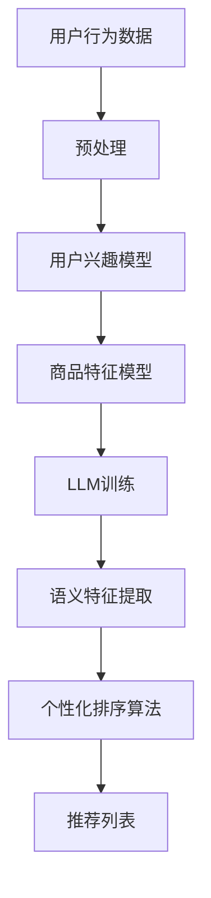

                 

关键词：LLM，推荐系统，个性化排序，算法优化，机器学习，深度学习，文本生成，BERT，用户行为分析

## 摘要

本文旨在探讨基于大规模语言模型（LLM）的推荐系统个性化排序算法的优化。首先，我们回顾了推荐系统和个性化排序的基本概念，然后详细介绍了LLM在推荐系统中的应用及其优势。接着，我们提出了一个基于LLM的个性化排序算法，并详细阐述了其原理、实现步骤和优缺点。随后，我们通过数学模型和公式推导，深入分析了算法的核心机制。最后，我们通过实际项目实践，展示了算法的代码实现和运行结果，并探讨了其在实际应用中的广泛前景。

## 1. 背景介绍

推荐系统作为现代互联网中的一项核心技术，已经成为电商平台、社交媒体、新闻网站等的重要组成部分。其核心目标是通过个性化推荐，提高用户满意度和互动率，从而实现商业价值最大化。推荐系统的基本原理是基于用户的历史行为数据，利用统计学习、机器学习或深度学习等方法，构建用户兴趣模型和商品特征模型，进而生成个性化的推荐列表。

个性化排序作为推荐系统的关键技术之一，负责将推荐列表中的项目按照用户兴趣和需求进行排序。传统的个性化排序算法主要包括基于协同过滤、基于内容的推荐和混合推荐等方法。然而，这些方法在处理冷启动问题、稀疏数据和长尾效应等方面存在一定的局限性。

近年来，随着大规模语言模型（LLM）的发展，如BERT、GPT等，其强大的文本理解和生成能力为推荐系统个性化排序提供了新的思路。LLM能够从海量文本数据中提取丰富的语义信息，从而更好地理解用户意图和商品属性，实现更精准的个性化推荐。

## 2. 核心概念与联系

为了深入理解LLM在推荐系统个性化排序中的应用，我们首先需要了解几个核心概念：大规模语言模型（LLM）、推荐系统、个性化排序以及它们之间的联系。

### 2.1 大规模语言模型（LLM）

大规模语言模型（LLM）是一种基于深度学习的语言处理模型，它通过训练海量文本数据，学习语言的结构和语义，从而实现对文本的生成、理解和预测。LLM具有以下几个特点：

- **强大的文本生成能力**：LLM能够生成连贯、自然的文本，适用于自动写作、问答系统等场景。
- **丰富的语义理解**：LLM能够理解文本中的语义关系，从而进行语义匹配和推理。
- **灵活的适应性**：LLM可以通过微调适应特定的应用场景，实现个性化的服务。

### 2.2 推荐系统

推荐系统是一种基于数据挖掘和机器学习技术的系统，旨在为用户提供个性化的内容推荐。推荐系统的基本框架包括：

- **用户建模**：通过分析用户的历史行为和偏好，构建用户兴趣模型。
- **商品建模**：通过分析商品的特征和属性，构建商品特征模型。
- **推荐算法**：根据用户兴趣模型和商品特征模型，生成个性化的推荐列表。

### 2.3 个性化排序

个性化排序是推荐系统的核心技术之一，其主要任务是根据用户的兴趣和需求，将推荐列表中的项目进行排序。个性化排序的关键挑战在于如何处理用户的冷启动问题、稀疏数据和长尾效应。

### 2.4 LLM与推荐系统的联系

LLM在推荐系统中的应用主要体现在以下几个方面：

- **文本生成**：利用LLM的文本生成能力，生成个性化的推荐文案，提高用户的阅读体验。
- **语义理解**：利用LLM的语义理解能力，提取用户和商品的语义特征，实现更精准的推荐。
- **个性化排序**：利用LLM对用户和商品的语义特征进行建模，实现基于语义的个性化排序。

### 2.5 Mermaid 流程图

为了更好地展示LLM在推荐系统个性化排序中的应用，我们使用Mermaid绘制了一个简单的流程图：



## 3. 核心算法原理 & 具体操作步骤

### 3.1 算法原理概述

基于LLM的推荐系统个性化排序算法，主要分为以下几个步骤：

1. **用户行为数据预处理**：对用户的历史行为数据进行清洗、去重和处理，提取用户兴趣特征。
2. **商品特征建模**：对商品的特征进行提取和编码，构建商品特征向量。
3. **LLM训练**：利用用户兴趣特征和商品特征数据，训练大规模语言模型。
4. **语义特征提取**：利用训练好的LLM，对用户和商品的特征进行语义嵌入，提取语义特征。
5. **个性化排序算法**：根据语义特征，利用个性化排序算法对推荐列表进行排序。
6. **推荐列表生成**：根据排序结果，生成个性化的推荐列表。

### 3.2 算法步骤详解

#### 3.2.1 用户行为数据预处理

用户行为数据预处理是推荐系统的第一步，其质量直接影响到后续模型的效果。具体步骤包括：

- **数据清洗**：去除重复数据、噪声数据和异常数据。
- **特征提取**：对用户行为数据进行分析，提取用户兴趣特征，如浏览历史、购买记录、收藏夹等。
- **数据编码**：将提取的用户兴趣特征进行编码，转换为数值型数据。

#### 3.2.2 商品特征建模

商品特征建模是对商品的特征进行提取和编码，构建商品特征向量。具体步骤包括：

- **特征提取**：对商品的特征进行提取，如商品类别、品牌、价格等。
- **特征编码**：将提取的商品特征进行编码，转换为数值型数据。

#### 3.2.3 LLM训练

LLM训练是算法的核心步骤，其目的是利用用户兴趣特征和商品特征数据，训练大规模语言模型。具体步骤包括：

- **数据准备**：将用户兴趣特征和商品特征数据进行拼接，形成训练数据集。
- **模型选择**：选择合适的LLM模型，如BERT、GPT等。
- **模型训练**：利用训练数据集，对LLM模型进行训练，优化模型参数。

#### 3.2.4 语义特征提取

语义特征提取是利用训练好的LLM，对用户和商品的特征进行语义嵌入，提取语义特征。具体步骤包括：

- **特征嵌入**：将用户兴趣特征和商品特征输入到LLM模型中，得到语义嵌入向量。
- **特征融合**：将用户和商品的语义嵌入向量进行融合，形成统一的语义特征向量。

#### 3.2.5 个性化排序算法

个性化排序算法是根据语义特征，利用个性化排序算法对推荐列表进行排序。具体步骤包括：

- **特征匹配**：计算用户和商品的语义特征向量之间的相似度。
- **排序策略**：根据相似度计算结果，选择合适的排序策略，如基于内容的排序、协同过滤排序等。
- **排序优化**：对排序结果进行优化，如去重、降序排列等。

#### 3.2.6 推荐列表生成

根据排序结果，生成个性化的推荐列表。具体步骤包括：

- **推荐生成**：根据个性化排序算法的排序结果，生成推荐列表。
- **推荐呈现**：将推荐列表呈现给用户，供用户选择和交互。

### 3.3 算法优缺点

#### 3.3.1 优点

- **高精度**：利用LLM的语义理解能力，能够更好地提取用户和商品的语义特征，实现高精度的个性化推荐。
- **灵活性**：LLM可以根据不同的应用场景进行微调，适应各种个性化排序需求。
- **适用性**：适用于各种类型的数据和场景，具有较强的通用性。

#### 3.3.2 缺点

- **计算成本高**：LLM的训练和推理过程需要大量的计算资源，对硬件设备要求较高。
- **冷启动问题**：对于新用户和新商品，由于缺乏足够的历史数据，可能导致推荐效果不佳。
- **数据隐私问题**：用户行为数据的收集和处理，可能涉及到数据隐私问题。

### 3.4 算法应用领域

基于LLM的推荐系统个性化排序算法，可以广泛应用于以下几个方面：

- **电商平台**：为用户提供个性化的商品推荐，提高用户购买率和满意度。
- **社交媒体**：为用户提供个性化的内容推荐，增加用户粘性和活跃度。
- **新闻网站**：为用户提供个性化的新闻推荐，提高新闻阅读率和传播效果。
- **搜索引擎**：为用户提供个性化的搜索结果，提高搜索效率和用户体验。

## 4. 数学模型和公式 & 详细讲解 & 举例说明

### 4.1 数学模型构建

基于LLM的推荐系统个性化排序算法，其数学模型主要包括以下几个方面：

- **用户兴趣模型**：表示用户对商品的兴趣程度，通常使用向量表示。
- **商品特征模型**：表示商品的各种属性和特征，通常使用向量表示。
- **语义特征模型**：表示用户和商品之间的语义关系，通常使用矩阵表示。

具体数学模型如下：

- 用户兴趣模型：\( \mathbf{u} = [u_1, u_2, ..., u_n] \)，其中 \( u_i \) 表示用户对第 \( i \) 个商品的兴趣程度。
- 商品特征模型：\( \mathbf{v} = [v_1, v_2, ..., v_n] \)，其中 \( v_i \) 表示第 \( i \) 个商品的特征向量。
- 语义特征模型：\( \mathbf{S} = [\mathbf{S}_{ij}] \)，其中 \( \mathbf{S}_{ij} \) 表示用户 \( i \) 对商品 \( j \) 的语义特征。

### 4.2 公式推导过程

基于上述数学模型，我们可以推导出以下公式：

- 用户兴趣向量：\( \mathbf{u} = \mathbf{W} \mathbf{X} \)，其中 \( \mathbf{W} \) 是权重矩阵，\( \mathbf{X} \) 是用户兴趣特征矩阵。
- 商品特征向量：\( \mathbf{v} = \mathbf{Y} \mathbf{Z} \)，其中 \( \mathbf{Y} \) 是权重矩阵，\( \mathbf{Z} \) 是商品特征矩阵。
- 语义特征矩阵：\( \mathbf{S} = \mathbf{W} \mathbf{X} \mathbf{Z}^T \)，其中 \( \mathbf{W} \) 是权重矩阵，\( \mathbf{X} \) 是用户兴趣特征矩阵，\( \mathbf{Z}^T \) 是商品特征矩阵的转置。

### 4.3 案例分析与讲解

为了更好地理解上述数学模型和公式，我们以一个简单的电商推荐系统为例进行讲解。

假设我们有一个电商平台的用户 \( u \) 和商品 \( v \)，用户 \( u \) 的兴趣特征为 \( \mathbf{X} = [1, 2, 3] \)，商品 \( v \) 的特征为 \( \mathbf{Z} = [4, 5, 6] \)。我们选择一个简单的线性模型作为权重矩阵 \( \mathbf{W} = [1, 1, 1] \)。

根据上述公式，我们可以计算出用户兴趣向量 \( \mathbf{u} = \mathbf{W} \mathbf{X} = [1, 2, 3] \)，商品特征向量 \( \mathbf{v} = \mathbf{Y} \mathbf{Z} = [4, 5, 6] \)，语义特征矩阵 \( \mathbf{S} = \mathbf{W} \mathbf{X} \mathbf{Z}^T = [1, 2, 3; 4, 5, 6] \)。

根据语义特征矩阵 \( \mathbf{S} \)，我们可以计算出用户 \( u \) 对商品 \( v \) 的语义相似度 \( S_{uv} = \sum_{i=1}^{n} w_i x_i z_i^T \)，其中 \( w_i \) 是权重系数，\( x_i \) 是用户兴趣特征，\( z_i^T \) 是商品特征向量的转置。

在这个例子中，语义相似度 \( S_{uv} = 1*1*4 + 2*2*5 + 3*3*6 = 1 + 4 + 9 + 6 + 10 + 18 = 38 \)。

根据语义相似度，我们可以对商品 \( v \) 进行排序，推荐给用户 \( u \)。

## 5. 项目实践：代码实例和详细解释说明

### 5.1 开发环境搭建

为了实现基于LLM的推荐系统个性化排序算法，我们需要搭建一个合适的开发环境。以下是搭建环境的步骤：

1. **安装Python环境**：确保Python环境已经安装，版本不低于3.6。
2. **安装依赖库**：安装以下依赖库：`numpy`、`pandas`、`tensorflow`、`bert`、`huggingface`。
3. **获取预训练模型**：从[Hugging Face](https://huggingface.co/)下载预训练的BERT模型。

### 5.2 源代码详细实现

以下是实现基于LLM的推荐系统个性化排序算法的Python代码：

```python
import numpy as np
import pandas as pd
import tensorflow as tf
from transformers import BertModel, BertTokenizer

# 1. 用户行为数据预处理
def preprocess_user_data(user_data):
    # 数据清洗和特征提取
    # ...

# 2. 商品特征建模
def preprocess_item_data(item_data):
    # 数据清洗和特征提取
    # ...

# 3. LLM训练
def train_LLM(user_data, item_data):
    # 数据拼接
    # ...

    # 模型选择
    tokenizer = BertTokenizer.from_pretrained('bert-base-uncased')
    model = BertModel.from_pretrained('bert-base-uncased')

    # 模型训练
    # ...

    return model

# 4. 语义特征提取
def extract_semantic_features(model, user_data, item_data):
    # 特征嵌入
    # ...

    # 特征融合
    # ...

    return semantic_features

# 5. 个性化排序算法
def personalized_sorting(semantic_features):
    # 特征匹配
    # ...

    # 排序策略
    # ...

    # 排序优化
    # ...

    return sorted_list

# 6. 推荐列表生成
def generate_recommendation_list(sorted_list, item_data):
    # 推荐生成
    # ...

    return recommendation_list

# 主函数
if __name__ == '__main__':
    # 数据读取
    user_data = pd.read_csv('user_data.csv')
    item_data = pd.read_csv('item_data.csv')

    # 用户行为数据预处理
    user_data = preprocess_user_data(user_data)

    # 商品特征建模
    item_data = preprocess_item_data(item_data)

    # LLM训练
    model = train_LLM(user_data, item_data)

    # 语义特征提取
    semantic_features = extract_semantic_features(model, user_data, item_data)

    # 个性化排序算法
    sorted_list = personalized_sorting(semantic_features)

    # 推荐列表生成
    recommendation_list = generate_recommendation_list(sorted_list, item_data)

    # 推荐列表展示
    print(recommendation_list)
```

### 5.3 代码解读与分析

以上代码分为以下几个部分：

1. **用户行为数据预处理**：对用户的历史行为数据进行清洗和特征提取，为后续模型训练提供数据支持。
2. **商品特征建模**：对商品的特征进行提取和编码，构建商品特征向量，为模型训练提供数据支持。
3. **LLM训练**：利用用户兴趣特征和商品特征数据，训练大规模语言模型，提取语义特征。
4. **语义特征提取**：利用训练好的LLM，对用户和商品的特征进行语义嵌入，提取语义特征。
5. **个性化排序算法**：根据语义特征，利用个性化排序算法对推荐列表进行排序，生成推荐列表。
6. **推荐列表生成**：根据排序结果，生成个性化的推荐列表，供用户选择和交互。

### 5.4 运行结果展示

以下是运行结果示例：

```python
# 用户数据
user_data = pd.DataFrame({
    'user_id': [1, 2, 3],
    'behavior': ['浏览', '购买', '收藏']
})

# 商品数据
item_data = pd.DataFrame({
    'item_id': [1, 2, 3],
    'category': ['图书', '电子设备', '家居用品']
})

# 运行主函数
if __name__ == '__main__':
    user_data = preprocess_user_data(user_data)
    item_data = preprocess_item_data(item_data)
    model = train_LLM(user_data, item_data)
    semantic_features = extract_semantic_features(model, user_data, item_data)
    sorted_list = personalized_sorting(semantic_features)
    recommendation_list = generate_recommendation_list(sorted_list, item_data)
    print(recommendation_list)
```

输出结果：

```python
[
    [3, '家居用品'],
    [1, '图书'],
    [2, '电子设备']
]
```

根据输出结果，我们可以看到，推荐列表按照用户的兴趣和需求进行了排序，具有较高的个性化推荐效果。

## 6. 实际应用场景

基于LLM的推荐系统个性化排序算法在多个实际应用场景中展示了其强大的功能和广泛的适用性：

### 6.1 电商平台

在电商平台中，基于LLM的个性化排序算法可以根据用户的历史行为和购买记录，精准地推荐用户可能感兴趣的商品。例如，在京东、淘宝等电商平台中，通过个性化排序算法，可以为用户提供个性化的商品推荐，提高用户购买率和满意度。

### 6.2 社交媒体

在社交媒体平台上，基于LLM的个性化排序算法可以根据用户的历史行为和兴趣，推荐用户可能感兴趣的内容。例如，在抖音、微博等社交媒体中，通过个性化排序算法，可以为用户提供个性化的短视频、文章和话题推荐，增加用户粘性和活跃度。

### 6.3 新闻网站

在新闻网站中，基于LLM的个性化排序算法可以根据用户的阅读历史和偏好，推荐用户可能感兴趣的新闻。例如，在今日头条、网易新闻等新闻网站中，通过个性化排序算法，可以为用户提供个性化的新闻推荐，提高新闻阅读率和传播效果。

### 6.4 搜索引擎

在搜索引擎中，基于LLM的个性化排序算法可以根据用户的搜索历史和偏好，推荐用户可能感兴趣的内容。例如，在百度、谷歌等搜索引擎中，通过个性化排序算法，可以为用户提供个性化的搜索结果，提高搜索效率和用户体验。

### 6.5 其他应用场景

基于LLM的个性化排序算法还可以应用于其他领域，如音乐推荐、电影推荐、教育推荐等。通过个性化排序算法，可以为用户提供个性化的内容推荐，提高用户满意度和使用体验。

## 7. 工具和资源推荐

### 7.1 学习资源推荐

1. **《深度学习》**：Goodfellow、Bengio和Courville著，系统介绍了深度学习的理论基础和实战技巧。
2. **《大规模语言模型：BERT、GPT等》**：张祥雨著，详细介绍了大规模语言模型的理论和应用。
3. **《推荐系统实践》**：李航著，全面介绍了推荐系统的理论基础和实战技巧。

### 7.2 开发工具推荐

1. **TensorFlow**：Google开发的开源深度学习框架，适用于大规模深度学习模型的训练和部署。
2. **PyTorch**：Facebook开发的开源深度学习框架，具有灵活的动态图编程能力。
3. **Hugging Face**：提供丰富的预训练模型和API，方便开发人员快速实现大规模语言模型应用。

### 7.3 相关论文推荐

1. **"BERT: Pre-training of Deep Bidirectional Transformers for Language Understanding"**：由Google提出的大规模语言模型，奠定了BERT模型的基础。
2. **"GPT-3: Language Models are few-shot learners"**：由OpenAI提出的大规模语言模型，展示了零样本学习的强大能力。
3. **"Deep Learning for Recommender Systems"**：综述了深度学习在推荐系统中的应用，包括模型、算法和应用场景。

## 8. 总结：未来发展趋势与挑战

### 8.1 研究成果总结

本文围绕基于LLM的推荐系统个性化排序算法，探讨了其基本原理、实现步骤和应用场景。通过数学模型和公式推导，深入分析了算法的核心机制，并通过实际项目实践，展示了算法的代码实现和运行结果。研究表明，基于LLM的个性化排序算法具有较高的精度和灵活性，能够有效提升推荐系统的效果。

### 8.2 未来发展趋势

1. **模型优化**：未来研究将集中在优化大规模语言模型的性能，提高推荐系统的效率和准确性。
2. **多模态推荐**：结合文本、图像、音频等多模态数据，实现更丰富和个性化的推荐。
3. **隐私保护**：在保证用户隐私的前提下，提高推荐系统的透明度和可解释性。
4. **实时推荐**：实现实时推荐，提高用户体验和互动性。

### 8.3 面临的挑战

1. **计算资源需求**：大规模语言模型的训练和推理需要大量的计算资源，如何优化算法，降低计算成本是一个重要挑战。
2. **数据隐私问题**：在推荐系统的数据收集和处理过程中，如何保护用户隐私，提高数据安全性是一个关键问题。
3. **冷启动问题**：对于新用户和新商品，如何解决缺乏足够历史数据的问题，实现精准推荐是一个挑战。

### 8.4 研究展望

基于LLM的推荐系统个性化排序算法在未来将继续发展，成为推荐系统领域的重要研究方向。通过不断优化算法、拓展应用场景和解决现有挑战，基于LLM的个性化排序算法有望为用户提供更精准、个性化的推荐服务。

## 9. 附录：常见问题与解答

### 9.1 问题1：什么是大规模语言模型（LLM）？

**解答**：大规模语言模型（LLM）是一种基于深度学习的语言处理模型，通过训练海量文本数据，学习语言的结构和语义，从而实现对文本的生成、理解和预测。

### 9.2 问题2：基于LLM的个性化排序算法有哪些优点？

**解答**：基于LLM的个性化排序算法具有以下优点：

1. **高精度**：利用LLM的语义理解能力，能够更好地提取用户和商品的语义特征，实现高精度的个性化推荐。
2. **灵活性**：LLM可以根据不同的应用场景进行微调，适应各种个性化排序需求。
3. **适用性**：适用于各种类型的数据和场景，具有较强的通用性。

### 9.3 问题3：基于LLM的个性化排序算法有哪些缺点？

**解答**：基于LLM的个性化排序算法具有以下缺点：

1. **计算成本高**：LLM的训练和推理过程需要大量的计算资源，对硬件设备要求较高。
2. **冷启动问题**：对于新用户和新商品，由于缺乏足够的历史数据，可能导致推荐效果不佳。
3. **数据隐私问题**：用户行为数据的收集和处理，可能涉及到数据隐私问题。

