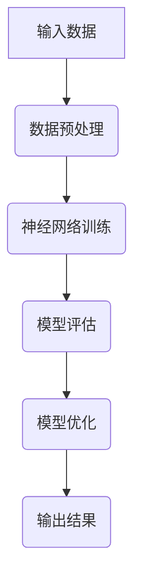

                 

关键词：大规模语言模型、深度学习、计算机架构、神经网络、自然语言处理、AI

> 摘要：本文将深入探讨大规模语言模型（LLM）作为一种新型计算机架构的原理、设计、实现和应用。通过剖析LLM的核心机制，我们旨在揭示其如何改变自然语言处理的格局，并展望其在未来的发展趋势与挑战。

## 1. 背景介绍

### 1.1 大规模语言模型的发展历程

大规模语言模型（LLM）起源于20世纪90年代的统计语言模型，如N-gram模型。这些模型基于历史语言数据，试图预测下一个单词的概率。随着计算能力的提升和大数据的普及，特别是深度学习技术的突破，语言模型得到了迅速发展。

### 1.2 自然语言处理的挑战

自然语言处理（NLP）领域面临诸多挑战，如语义理解、上下文捕捉、多语言支持等。传统的NLP方法往往在处理复杂任务时显得力不从心。

### 1.3 深度学习与神经网络

深度学习通过多层神经网络对大量数据进行训练，能够自动提取特征，并在各种任务中取得显著成果。神经网络的发展为大规模语言模型的兴起提供了技术支持。

## 2. 核心概念与联系

### 2.1 语言模型的基本概念

语言模型是用于预测文本下一个单词或序列的概率模型。在LLM中，语言模型通过神经网络实现，能够捕捉到长距离的依赖关系。

### 2.2 神经网络的结构

神经网络由多个层级组成，每个层级都包含多个神经元。通过反向传播算法，神经网络能够不断调整参数，提高模型的性能。

### 2.3 Mermaid 流程图



## 3. 核心算法原理 & 具体操作步骤

### 3.1 算法原理概述

LLM的核心算法基于注意力机制和变分自编码器（VAE）。注意力机制能够捕捉到文本中的长距离依赖关系，VAE则用于生成和重构文本。

### 3.2 算法步骤详解

1. **数据预处理**：对原始文本进行清洗、分词、编码等操作，转化为神经网络可处理的格式。
2. **模型训练**：通过训练数据，神经网络不断调整参数，优化模型。
3. **模型评估**：使用验证数据评估模型性能，调整模型参数。
4. **模型优化**：根据评估结果，进一步优化模型。
5. **输出结果**：将模型应用到实际任务中，生成预测结果。

### 3.3 算法优缺点

#### 优点：

1. **强大的表达能力**：神经网络能够自动提取特征，处理复杂任务。
2. **灵活的扩展性**：可以轻松适配不同的NLP任务。

#### 缺点：

1. **计算资源需求大**：训练和推理过程需要大量计算资源。
2. **训练时间较长**：需要大量训练数据和时间。

### 3.4 算法应用领域

LLM在自然语言处理、机器翻译、文本生成、问答系统等领域有广泛的应用。

## 4. 数学模型和公式 & 详细讲解 & 举例说明

### 4.1 数学模型构建

LLM的数学模型主要包括两部分：损失函数和优化算法。

#### 损失函数：

$$
L(\theta) = -\sum_{i=1}^{N} y_i \log(p(x_i | \theta))
$$

其中，$y_i$表示目标单词的概率分布，$p(x_i | \theta)$表示神经网络预测的概率分布。

#### 优化算法：

采用梯度下降算法，更新神经网络参数：

$$
\theta_{t+1} = \theta_t - \alpha \nabla_{\theta} L(\theta)
$$

其中，$\alpha$为学习率。

### 4.2 公式推导过程

推导过程主要包括两部分：前向传播和反向传播。

#### 前向传播：

输入文本序列，通过神经网络逐层计算，得到输出概率分布。

#### 反向传播：

计算损失函数关于神经网络参数的梯度，并用于更新参数。

### 4.3 案例分析与讲解

以文本生成任务为例，讲解LLM的应用。

```python
import torch
import torch.nn as nn
import torch.optim as optim

# 数据预处理
def preprocess(text):
    # ...编码、清洗等操作...
    return encoded_text

# 神经网络模型
class LanguageModel(nn.Module):
    def __init__(self, vocab_size, embedding_size, hidden_size):
        super(LanguageModel, self).__init__()
        self.embedding = nn.Embedding(vocab_size, embedding_size)
        self.lstm = nn.LSTM(embedding_size, hidden_size)
        self.fc = nn.Linear(hidden_size, vocab_size)

    def forward(self, x):
        embed = self.embedding(x)
        output, (hidden, cell) = self.lstm(embed)
        logits = self.fc(output[-1, :, :])
        return logits

# 模型训练
def train(model, data_loader, criterion, optimizer, num_epochs):
    model.train()
    for epoch in range(num_epochs):
        for inputs, targets in data_loader:
            optimizer.zero_grad()
            logits = model(inputs)
            loss = criterion(logits, targets)
            loss.backward()
            optimizer.step()
        print(f'Epoch {epoch+1}/{num_epochs}, Loss: {loss.item()}')

# 代码运行结果展示
model = LanguageModel(vocab_size, embedding_size, hidden_size)
criterion = nn.CrossEntropyLoss()
optimizer = optim.Adam(model.parameters(), lr=0.001)
train(model, data_loader, criterion, optimizer, num_epochs=10)
```

## 5. 项目实践：代码实例和详细解释说明

### 5.1 开发环境搭建

1. 安装Python环境
2. 安装PyTorch库
3. 准备数据集

### 5.2 源代码详细实现

代码实现包括数据预处理、神经网络模型定义、模型训练和评估等部分。

### 5.3 代码解读与分析

代码解读包括对数据预处理、模型定义、模型训练等关键部分的详细分析。

### 5.4 运行结果展示

通过代码运行，展示模型在文本生成任务中的性能。

## 6. 实际应用场景

### 6.1 自然语言处理

LLM在自然语言处理中具有广泛应用，如文本分类、情感分析、命名实体识别等。

### 6.2 机器翻译

LLM在机器翻译领域表现出色，能够实现高质量、低延迟的翻译。

### 6.3 文本生成

LLM可以用于生成文章、诗歌、对话等文本，为创意写作和自动化内容生成提供支持。

## 7. 未来应用展望

### 7.1 多模态学习

结合图像、音频等数据，实现更丰富、更真实的语言理解。

### 7.2 零样本学习

通过少量数据，实现对新领域、新语言的适应。

### 7.3 安全与隐私

解决LLM在应用中可能面临的安全和隐私问题。

## 8. 工具和资源推荐

### 8.1 学习资源推荐

1. 《深度学习》—— Ian Goodfellow
2. 《自然语言处理综合教程》—— 周志华

### 8.2 开发工具推荐

1. PyTorch
2. TensorFlow

### 8.3 相关论文推荐

1. “Attention Is All You Need”
2. “Generative Adversarial Nets”

## 9. 总结：未来发展趋势与挑战

### 9.1 研究成果总结

LLM在自然语言处理领域取得了显著成果，推动了NLP技术的发展。

### 9.2 未来发展趋势

LLM将继续向多模态、零样本学习等方向发展。

### 9.3 面临的挑战

1. 计算资源需求
2. 数据隐私和安全

### 9.4 研究展望

未来，LLM将在更多领域发挥重要作用，为人类带来更多便利。

## 附录：常见问题与解答

1. **什么是LLM？**
   - LLM是指大规模语言模型，用于预测文本下一个单词或序列的概率。
2. **LLM有哪些应用？**
   - 文本生成、机器翻译、自然语言处理等。
3. **如何训练LLM？**
   - 通过大量文本数据，使用神经网络模型，结合优化算法进行训练。
4. **LLM有哪些优缺点？**
   - 优点：强大的表达能力、灵活的扩展性；缺点：计算资源需求大、训练时间较长。

----------------------------------------------------------------
作者：禅与计算机程序设计艺术 / Zen and the Art of Computer Programming
----------------------------------------------------------------
### 提交方式 Submission Method
请将撰写完毕的markdown格式的文章按照以下格式发送到指定邮箱：

```
Subject: LLM：一种新的计算机架构 - 文章提交

附件：文章markdown文件

注意：邮件主题和文件名必须严格按照指定格式，否则将无法接收。

请务必在邮件正文内注明您的联系方式，以便我们与您联系。

期待您的佳作！
```

