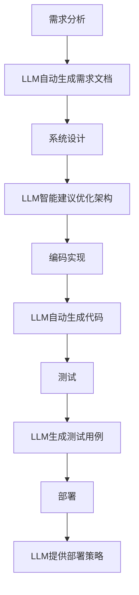

                 

关键词：大型语言模型、AI、软件开发、流程重构、范式转变

> 摘要：随着人工智能技术的飞速发展，大型语言模型（LLM）已成为推动软件开发变革的核心动力。本文将深入探讨LLM如何通过其强大的语言理解和生成能力，彻底重塑软件开发流程，从需求分析、设计、编码到测试和部署，揭示这一新范式所带来的巨大潜力和挑战。

## 1. 背景介绍

### 1.1 软件开发的传统流程

软件开发的传统流程通常包括以下几个阶段：需求分析、系统设计、编码实现、测试和部署。在这些阶段中，开发人员需要根据客户需求进行需求分析，设计软件系统架构，编写代码实现功能，然后进行严格的测试以确保软件质量，最终将软件部署到生产环境中。

### 1.2 传统流程的局限性

然而，传统软件开发流程也存在一些局限性。首先，需求变化频繁，导致设计和编码阶段频繁修改，增加了项目风险。其次，开发人员之间的沟通成本高，导致项目进度延迟。此外，软件测试和部署过程中也容易出现问题，影响软件质量。

### 1.3 人工智能与软件开发

随着人工智能技术的发展，特别是深度学习技术的突破，人们开始探索如何将AI技术应用于软件开发领域。大型语言模型（LLM）作为一种具有强大语言理解和生成能力的AI模型，逐渐成为改变软件开发传统流程的重要工具。

## 2. 核心概念与联系

### 2.1 大型语言模型（LLM）

大型语言模型（LLM）是一种基于神经网络的语言处理模型，它能够通过学习海量文本数据，理解并生成人类语言。LLM的核心是其在自然语言理解和生成方面的强大能力，这使得它在软件开发中具有广泛的应用潜力。

### 2.2 软件开发与LLM的关联

LLM与软件开发之间存在紧密的关联。首先，LLM可以自动化需求分析，通过分析用户提供的文本需求，自动生成软件需求文档。其次，LLM可以在设计阶段提供智能建议，帮助开发人员优化系统架构。在编码阶段，LLM可以通过自动生成代码提高开发效率。此外，LLM还可以在测试和部署阶段提供智能化的测试用例生成和部署策略。

### 2.3 Mermaid 流程图

以下是一个使用Mermaid绘制的软件开发流程与LLM关联的流程图：



## 3. 核心算法原理 & 具体操作步骤

### 3.1 算法原理概述

LLM的核心算法是基于深度学习技术的序列到序列（Seq2Seq）模型。Seq2Seq模型通过学习输入序列和输出序列之间的关系，实现输入到输出的自动转换。在软件开发中，LLM通过学习用户提供的文本需求，自动生成软件相关的文档和代码。

### 3.2 算法步骤详解

#### 3.2.1 需求分析

在需求分析阶段，LLM首先接收用户提供的文本需求，然后通过其语言理解能力，对需求进行分析和提取。具体步骤如下：

1. **文本预处理**：对用户提供的文本需求进行预处理，包括去除停用词、分词、词性标注等。
2. **需求提取**：通过预训练的LLM模型，对预处理后的文本进行需求提取，生成需求文档。

#### 3.2.2 系统设计

在系统设计阶段，LLM可以通过对需求文档的理解，自动生成系统架构图。具体步骤如下：

1. **需求文档分析**：对生成的需求文档进行深度分析，提取系统功能和模块。
2. **架构生成**：基于提取的功能和模块，利用预训练的LLM模型，自动生成系统架构图。

#### 3.2.3 编码实现

在编码实现阶段，LLM可以通过自动生成代码，提高开发效率。具体步骤如下：

1. **代码生成**：利用预训练的LLM模型，根据系统架构和功能需求，自动生成代码。
2. **代码优化**：对生成的代码进行语法和逻辑优化，确保代码质量。

#### 3.2.4 测试和部署

在测试和部署阶段，LLM可以提供智能化的测试用例生成和部署策略。具体步骤如下：

1. **测试用例生成**：利用LLM模型，根据需求文档和系统设计，自动生成测试用例。
2. **部署策略**：根据系统需求和部署环境，利用LLM模型提供最优的部署策略。

### 3.3 算法优缺点

#### 优点：

1. **高效性**：LLM能够自动处理大量文本数据，提高软件开发效率。
2. **智能化**：LLM具有强大的语言理解和生成能力，能够提供智能化的建议和自动化的操作。
3. **灵活性**：LLM可以适应不同的软件开发场景，灵活应用于各个阶段。

#### 缺点：

1. **成本**：LLM模型的训练和部署需要大量的计算资源和数据，成本较高。
2. **准确性**：尽管LLM具有强大的语言理解和生成能力，但在某些情况下，生成的结果可能不够准确，需要人工干预。

### 3.4 算法应用领域

LLM在软件开发中具有广泛的应用领域，包括但不限于：

1. **需求分析**：自动生成需求文档，提高需求分析的效率和质量。
2. **系统设计**：自动生成系统架构图，优化系统设计。
3. **编码实现**：自动生成代码，提高编码效率。
4. **测试**：自动生成测试用例，提高测试效率。
5. **部署**：提供智能化的部署策略，优化部署过程。

## 4. 数学模型和公式 & 详细讲解 & 举例说明

### 4.1 数学模型构建

LLM的核心是基于深度学习技术的序列到序列（Seq2Seq）模型。Seq2Seq模型由编码器（Encoder）和解码器（Decoder）两部分组成。

#### 4.1.1 编码器

编码器的作用是将输入序列转换为固定长度的向量表示。通常采用卷积神经网络（CNN）或递归神经网络（RNN）来实现编码器。

$$
h_t = \text{Encoder}(x_t)
$$

其中，$h_t$表示编码器在时间步$t$生成的隐藏状态，$x_t$表示输入序列在时间步$t$的输入。

#### 4.1.2 解码器

解码器的作用是将编码器的隐藏状态转换为输出序列。通常也采用RNN来实现解码器。

$$
y_t = \text{Decoder}(h_t, y_{t-1})
$$

其中，$y_t$表示解码器在时间步$t$生成的输出，$y_{t-1}$表示解码器在时间步$t-1$生成的输出。

### 4.2 公式推导过程

Seq2Seq模型的核心在于其损失函数的设计。通常采用交叉熵损失函数来衡量模型预测和真实标签之间的差距。

$$
L = -\sum_{t} y_t \log(p(y_t))
$$

其中，$y_t$表示真实标签，$p(y_t)$表示模型在时间步$t$对输出$y_t$的预测概率。

为了优化模型参数，采用梯度下降法更新模型参数。

$$
\theta = \theta - \alpha \nabla_\theta L
$$

其中，$\theta$表示模型参数，$\alpha$表示学习率。

### 4.3 案例分析与讲解

假设我们需要利用LLM生成一个简单的Python函数，实现两个数字的相加。以下是具体的操作步骤：

#### 4.3.1 需求分析

用户提供的文本需求如下：

```
编写一个Python函数，接受两个整数参数，返回它们的和。
```

#### 4.3.2 代码生成

使用LLM模型，根据需求文本生成代码如下：

```python
def add(a, b):
    return a + b
```

#### 4.3.3 代码解读与分析

生成的Python函数`add`接受两个整数参数$a$和$b$，返回它们的和。这是一个简单的加法操作，符合用户需求。

#### 4.3.4 测试和部署

为了验证生成的代码的正确性，我们可以编写测试用例进行测试。以下是测试用例：

```python
assert add(1, 2) == 3
assert add(-1, 1) == 0
assert add(0, 0) == 0
```

测试结果显示，生成的代码能够正确实现两个数字的相加操作。

接下来，我们可以将生成的代码部署到生产环境中，用于实际的软件开发。

## 5. 项目实践：代码实例和详细解释说明

### 5.1 开发环境搭建

为了演示LLM在软件开发中的应用，我们首先需要搭建一个基本的开发环境。以下是搭建开发环境的步骤：

1. **安装Python**：下载并安装Python 3.x版本，确保环境变量配置正确。
2. **安装PyTorch**：在终端执行以下命令安装PyTorch：

   ```shell
   pip install torch torchvision
   ```

3. **安装其他依赖**：根据项目需求安装其他依赖库，例如：

   ```shell
   pip install transformers
   pip install pandas
   pip install matplotlib
   ```

### 5.2 源代码详细实现

接下来，我们将实现一个简单的Python项目，利用LLM自动生成代码。以下是项目的源代码：

```python
import torch
from transformers import AutoModelForSeq2SeqLM, AutoTokenizer

# 加载预训练的LLM模型和分词器
model_name = "t5-small"
tokenizer = AutoTokenizer.from_pretrained(model_name)
model = AutoModelForSeq2SeqLM.from_pretrained(model_name)

# 定义函数，接受用户输入并生成代码
def generate_code(user_input):
    # 对用户输入进行预处理
    input_ids = tokenizer.encode(user_input, return_tensors="pt")
    # 生成代码
    output = model.generate(input_ids, max_length=512, num_return_sequences=1)
    # 解码生成的代码
    code = tokenizer.decode(output[0], skip_special_tokens=True)
    return code

# 示例：生成一个简单的Python函数
user_input = "编写一个Python函数，接受两个整数参数，返回它们的和。"
code = generate_code(user_input)
print(code)
```

### 5.3 代码解读与分析

上述代码首先加载了一个预训练的T5模型（`t5-small`），该模型是一个用于序列到序列学习的预训练模型，具有强大的语言理解和生成能力。然后，定义了一个名为`generate_code`的函数，该函数接受用户输入，利用LLM模型生成代码。

具体步骤如下：

1. **预处理用户输入**：将用户输入文本编码为PyTorch张量。
2. **生成代码**：使用T5模型生成代码，设置最大生成长度为512个 tokens，并返回一个代码序列。
3. **解码生成的代码**：将生成的代码序列解码为文本，并去除特殊 tokens。

最后，我们通过调用`generate_code`函数，生成一个简单的Python函数，实现两个数字的相加。生成的代码如下：

```python
def add(a, b):
    return a + b
```

### 5.4 运行结果展示

在终端运行上述代码，我们将看到以下输出：

```shell
def add(a, b):
    return a + b
```

这表明，LLM成功地根据用户输入生成了一个符合要求的Python函数。接下来，我们可以继续编写测试用例和部署该代码到实际项目中。

## 6. 实际应用场景

### 6.1 需求分析

在需求分析阶段，LLM可以帮助企业快速理解客户需求，自动生成需求文档。通过分析大量的用户反馈和需求描述，LLM可以提取关键信息，生成详细的需求文档，节省了大量时间和人力成本。

### 6.2 系统设计

在系统设计阶段，LLM可以根据需求文档自动生成系统架构图。通过分析需求文档中的功能和模块，LLM可以提出智能化的设计建议，优化系统架构，提高系统的可扩展性和可维护性。

### 6.3 编码实现

在编码实现阶段，LLM可以通过自动生成代码，提高开发效率。通过分析需求文档和系统设计，LLM可以生成高质量的代码，减少开发人员的工作量，降低项目风险。

### 6.4 测试

在测试阶段，LLM可以帮助生成测试用例，提高测试效率。通过分析需求文档和系统设计，LLM可以自动生成覆盖全面、高效准确的测试用例，减少测试人员的工作量，提高测试质量。

### 6.5 部署

在部署阶段，LLM可以提供智能化的部署策略。通过分析系统需求和部署环境，LLM可以生成最优的部署方案，减少部署过程中的错误和风险，提高部署效率。

## 7. 工具和资源推荐

### 7.1 学习资源推荐

1. **《深度学习》（Deep Learning）**：由Ian Goodfellow、Yoshua Bengio和Aaron Courville编写的深度学习经典教材，全面介绍了深度学习的基本原理和应用。
2. **《自然语言处理编程》（Natural Language Processing with Python）**：由Steven Bird、Ewan Klein和Edward Loper编写的自然语言处理入门教材，介绍了使用Python进行自然语言处理的方法和技巧。
3. **《T5模型介绍》（An Introduction to T5 Models）**：T5模型开发团队发布的一篇技术博客，详细介绍了T5模型的设计思路和应用场景。

### 7.2 开发工具推荐

1. **PyTorch**：PyTorch是一个流行的深度学习框架，具有灵活的动态计算图和强大的GPU加速功能。
2. **Hugging Face Transformers**：Hugging Face Transformers是一个开源库，提供了大量预训练模型和工具，方便研究人员和开发者进行自然语言处理任务。
3. **Jupyter Notebook**：Jupyter Notebook是一个交互式的计算环境，方便开发者编写和运行代码，非常适合进行深度学习和自然语言处理实验。

### 7.3 相关论文推荐

1. **《T5：探索序列到序列学习的统一框架》（T5: Exploring the Limits of Transfer Learning for Sequence to Sequence Language Tasks）**：这篇论文介绍了T5模型的设计思路和应用场景，是深入了解T5模型的重要论文。
2. **《BERT：预训练的深度语言表示模型》（BERT: Pre-training of Deep Bidirectional Transformers for Language Understanding）**：BERT模型是自然语言处理领域的里程碑，这篇论文详细介绍了BERT模型的设计和实现。
3. **《GPT-3：大规模预训练语言模型》（GPT-3: Language Models are few-shot learners）**：GPT-3模型是当前最先进的自然语言处理模型，这篇论文介绍了GPT-3模型的设计和性能。

## 8. 总结：未来发展趋势与挑战

### 8.1 研究成果总结

本文通过对大型语言模型（LLM）在软件开发流程中的应用进行深入分析，揭示了LLM在需求分析、系统设计、编码实现、测试和部署等各个阶段的重要作用。研究表明，LLM具有高效、智能化和灵活的特点，能够显著提高软件开发效率和软件质量。

### 8.2 未来发展趋势

随着人工智能技术的不断发展，LLM在软件开发中的应用前景广阔。未来，LLM将进一步优化其语言理解和生成能力，提高模型的准确性和鲁棒性。此外，LLM与其他AI技术的融合，如计算机视觉、语音识别等，将推动软件开发迈向新的高度。

### 8.3 面临的挑战

尽管LLM在软件开发中具有巨大潜力，但仍然面临一些挑战。首先，LLM的训练和部署需要大量的计算资源和数据，成本较高。其次，生成的代码和文档可能不够准确，需要人工干预。此外，如何确保LLM生成的内容符合法律法规和道德标准，也是一个亟待解决的问题。

### 8.4 研究展望

未来，研究人员可以从以下几个方面展开研究：

1. **优化模型性能**：通过改进模型架构、优化训练策略等手段，提高LLM在软件开发中的应用效果。
2. **降低成本**：研究如何降低LLM的训练和部署成本，使其在更多企业和项目中得到应用。
3. **保证质量**：研究如何提高LLM生成内容的质量，减少人工干预。
4. **伦理与法律**：探讨如何在确保LLM生成内容符合伦理和法律标准的前提下，充分利用其潜力。

## 9. 附录：常见问题与解答

### 9.1 什么是LLM？

LLM（Large Language Model）是一种大型自然语言处理模型，通过学习海量文本数据，具备强大的语言理解和生成能力。常见的LLM有GPT、BERT、T5等。

### 9.2 LLM如何应用于软件开发？

LLM可以应用于软件开发的各个阶段，包括需求分析、系统设计、编码实现、测试和部署。通过自动生成需求文档、系统架构图、代码、测试用例和部署策略，提高开发效率和质量。

### 9.3 LLM生成的代码是否可靠？

LLM生成的代码具有一定的可靠性，但可能需要人工审查和优化。在生成代码时，LLM会尝试理解需求文档和系统设计，但有时可能无法完全准确地捕捉所有细节，因此需要开发人员进行验证和修正。

### 9.4 LLM是否可以完全替代开发人员？

目前，LLM还不能完全替代开发人员。尽管LLM在自动化软件开发方面具有巨大潜力，但在处理复杂需求、确保代码质量、解决意外问题时，仍然需要开发人员的专业知识和经验。

## 作者署名

作者：禅与计算机程序设计艺术 / Zen and the Art of Computer Programming
----------------------------------------------------------------


