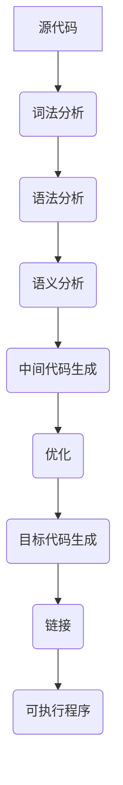
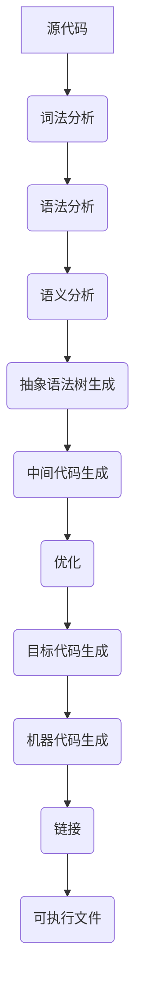

                 

### 1. 背景介绍

编译器是计算机科学中一项至关重要的技术，它将程序员编写的代码转换成计算机能够理解和执行的形式。在现代软件开发中，编译器的性能和效率直接影响着应用程序的运行速度和资源占用。因此，研究编译器的架构和优化技术具有重要的实际意义。

LLVM（Low-Level Virtual Machine）和Clang是当前非常流行的两个编译器框架，它们共同构建了一个功能强大、扩展性高的编译器生态系统。LLVM作为一个底层虚拟机，提供了一个高度优化的中间代码生成和优化框架，而Clang则是在LLVM之上构建的一个完整的C/C++编译器。

LLVM/Clang的结合体不仅在开源社区中获得了广泛的关注，也被许多大型公司和组织采用，包括Google、Apple和Microsoft等。本文将深入探讨LLVM/Clang的架构、核心概念、算法原理，并通过具体实例展示其在实际开发中的应用。

本文的结构如下：

- **第1章**：背景介绍，概述编译器的重要性以及LLVM/Clang在其中的地位。
- **第2章**：核心概念与联系，介绍编译器的基本组成部分及其工作流程。
- **第3章**：核心算法原理 & 具体操作步骤，详细解释LLVM/Clang的优化技术。
- **第4章**：数学模型和公式 & 详细讲解 & 举例说明，分析编译过程中的数学基础。
- **第5章**：项目实践：代码实例和详细解释说明，通过具体项目展示LLVM/Clang的使用。
- **第6章**：实际应用场景，讨论LLVM/Clang在不同领域的应用。
- **第7章**：工具和资源推荐，为读者提供学习和发展所需的相关资源和工具。
- **第8章**：总结：未来发展趋势与挑战，总结研究成果并展望未来。
- **第9章**：附录：常见问题与解答，解答读者可能遇到的问题。

<|user|>### 2. 核心概念与联系

为了深入理解LLVM/Clang的编译器架构，我们首先需要了解一些核心概念，包括编译器的基本组成部分、LLVM的模块化设计以及Clang的前端实现。同时，我们将通过一个Mermaid流程图来展示编译器的工作流程。

#### 2.1 编译器的基本组成部分

编译器通常由以下几个关键部分组成：

1. **词法分析器（Lexer）**：将源代码拆分为一系列标记（tokens）。
2. **语法分析器（Parser）**：根据预定的语法规则，将标记转换为抽象语法树（AST）。
3. **语义分析器（Semantic Analyzer）**：检查AST是否符合语言语义，进行类型检查和作用域分析。
4. **代码生成器（Code Generator）**：将AST转换为中间表示代码（IR）。
5. **优化器（Optimizer）**：对中间代码进行各种优化，提高代码的运行效率。
6. **目标代码生成器（Target Code Generator）**：将优化后的中间代码转换为特定目标平台的机器代码。
7. **链接器（Linker）**：将多个目标文件合并为一个可执行文件。

#### 2.2 LLVM的模块化设计

LLVM的设计采用模块化方法，使其具有高度的可扩展性和灵活性。以下是LLVM的主要模块及其作用：

1. **前端（Frontend）**：负责解析特定编程语言（如C/C++、Java等）的源代码，生成抽象语法树（AST）。
2. **中间表示（IR）**：LLVM的中间表示是一种低级、接近机器码但与平台无关的表示形式，便于进行优化和转换。
3. **优化器（Optimizer）**：对中间表示代码进行各种优化，包括循环展开、死代码消除、常量折叠等。
4. **后端（Backend）**：负责将优化的中间表示代码转换为特定目标平台的机器代码。
5. **工具链（Toolchain）**：包括链接器、调试器等工具，用于生成和调试可执行程序。

#### 2.3 Clang的前端实现

Clang是LLVM的前端实现，它负责解析C/C++源代码并生成AST。Clang在编译器社区中得到了广泛的应用，其优点包括：

- 高效的语法分析器，采用LL(k)算法，可以快速地生成AST。
- 强大的错误恢复能力，即使在源代码中出现错误时，也能尽可能多地解析代码。
- 与LLVM紧密集成，可以方便地进行各种优化和目标代码生成。

#### 2.4 编译器工作流程

编译器的工作流程可以概括为以下步骤：

1. **词法分析**：源代码被拆分为标记（tokens）。
2. **语法分析**：标记被转换为抽象语法树（AST）。
3. **语义分析**：检查AST是否符合语言语义，进行类型检查和作用域分析。
4. **中间代码生成**：AST被转换为中间表示代码（IR）。
5. **优化**：对IR进行各种优化。
6. **目标代码生成**：将优化的IR转换为特定目标平台的机器代码。
7. **链接**：将多个目标文件合并为一个可执行文件。

下面是一个Mermaid流程图，展示了编译器的工作流程：



通过上述核心概念与联系的介绍，我们为后续的深入探讨奠定了基础。接下来，我们将详细解析LLVM/Clang的核心算法原理和具体操作步骤。

#### 2.5 Mermaid流程图

下面是一个描述编译器工作流程的Mermaid流程图：



在这个流程图中，每个节点表示编译器处理源代码的一个阶段，箭头表示流程的顺序。词法分析将源代码拆分为标记，语法分析将这些标记组合成抽象语法树，然后经过语义分析、中间代码生成、优化、目标代码生成等多个阶段，最终生成可执行文件。

#### 2.6 核心算法原理 & 具体操作步骤

编译器中的核心算法主要包括词法分析、语法分析、语义分析和优化等。下面我们将分别介绍这些算法的原理和具体操作步骤。

##### 2.6.1 词法分析

词法分析是编译器的第一个阶段，其任务是将源代码的字符序列转换为标记（tokens）。词法分析器通常会使用正则表达式来识别源代码中的关键词、标识符、操作符等。

**操作步骤**：

1. **初始化**：读取源代码的第一个字符。
2. **字符分类**：根据字符的属性（如字母、数字、特殊字符等）对其进行分类。
3. **构造标记**：根据分类结果构造标记，并将其添加到标记列表中。
4. **处理特殊字符**：如注释、字符串等，根据其特殊性质进行特殊处理。
5. **循环处理**：继续读取下一个字符，重复步骤2-4，直到处理完整个源代码。

**算法优缺点**：

- **优点**：词法分析器能够快速地将源代码拆分为标记，为后续的语法分析和语义分析提供了基础。
- **缺点**：词法分析器需要处理大量的字符和特殊情况，可能导致效率较低。

##### 2.6.2 语法分析

语法分析是编译器的第二个阶段，其任务是将标记序列转换为抽象语法树（AST）。语法分析器通常采用递归下降法、LL(k)算法或LR(k)算法等。

**操作步骤**：

1. **初始化**：创建AST的根节点。
2. **读取标记**：从标记列表中读取下一个标记。
3. **匹配规则**：根据预定的语法规则，将标记序列与AST节点进行匹配。
4. **构建AST**：将匹配成功的标记序列转换为AST节点，并将其添加到AST中。
5. **处理错误**：在匹配过程中，如果遇到无法匹配的标记，则进行错误处理，如报告错误、继续分析等。
6. **循环处理**：继续读取下一个标记，重复步骤3-5，直到处理完整个源代码。

**算法优缺点**：

- **优点**：语法分析器能够准确地识别源代码的语法结构，为后续的语义分析和代码生成提供了基础。
- **缺点**：语法分析器需要处理复杂的语法规则，可能导致效率较低。

##### 2.6.3 语义分析

语义分析是编译器的第三个阶段，其任务是对AST进行语义检查，确保其符合语言语义。语义分析器通常包括类型检查、作用域分析、变量初始化检查等。

**操作步骤**：

1. **初始化**：创建符号表，用于存储变量、函数等信息。
2. **遍历AST**：对AST进行深度优先遍历。
3. **类型检查**：检查AST中的表达式和语句是否符合语言类型系统，如检查变量类型、函数参数类型等。
4. **作用域分析**：检查变量和函数的作用域，确保其在正确的范围内使用。
5. **变量初始化检查**：检查变量是否在声明后立即初始化。
6. **错误处理**：在检查过程中，如果发现错误，则报告错误并停止分析。

**算法优缺点**：

- **优点**：语义分析能够确保源代码的语义正确性，避免运行时错误。
- **缺点**：语义分析需要处理复杂的语义规则，可能导致效率较低。

##### 2.6.4 优化

优化是编译器的最后一个阶段，其任务是对生成的中间代码进行各种优化，提高代码的运行效率。优化器通常包括各种优化算法，如循环展开、死代码消除、常量折叠等。

**操作步骤**：

1. **初始化**：读取中间代码。
2. **分析代码**：对中间代码进行分析，找出可优化的机会。
3. **应用优化**：根据优化算法对代码进行优化，如循环展开、死代码消除等。
4. **生成优化代码**：将优化的结果写入新的中间代码。
5. **循环优化**：对优化的代码进行迭代，直到无法再进行优化。

**算法优缺点**：

- **优点**：优化能够显著提高代码的运行效率，减少内存占用。
- **缺点**：优化过程可能引入新的错误，需要仔细处理。

通过上述核心算法原理和具体操作步骤的介绍，我们为理解LLVM/Clang的工作机制提供了基础。接下来，我们将进一步探讨数学模型和公式，以及它们在编译过程中的应用。

#### 2.7 数学模型和公式

在编译器设计中，数学模型和公式扮演着至关重要的角色，尤其是在代码优化和中间代码生成阶段。这些数学模型和公式帮助我们分析代码的行为，并对其进行优化。下面，我们将详细讲解一些常用的数学模型和公式。

##### 2.7.1 中间代码生成

在编译器的中间代码生成阶段，我们通常使用三地址码（Three-Address Code，TAC）作为中间表示。三地址码是一种低级表示形式，每个操作包含三个操作数和一条结果，例如：`t1 = a + b;`。这种表示形式便于分析和优化。

**数学模型**：

假设我们有两个操作数 `a` 和 `b`，以及一个变量 `t1` 来存储结果。三地址码的表达式可以表示为：

\[ t1 = a + b \]

在这个表达式中，`t1` 是结果，`a` 和 `b` 是操作数。

**公式**：

为了生成三地址码，我们需要使用以下公式：

\[ \text{若} \ t1 = a + b \ \text{则} \ \text{生成以下三地址码：} \]
\[ \text{t2 = a} \]
\[ \text{t3 = b} \]
\[ \text{t1 = t2 + t3} \]

这样，我们可以将一个复杂的表达式分解为多个简单的操作，便于分析和优化。

##### 2.7.2 代码优化

代码优化是编译器的重要功能之一，其目标是通过变换代码，提高程序的性能和可读性。常见的优化算法包括常量折叠、循环展开、死代码消除等。这些优化算法通常基于数学模型和公式。

**数学模型**：

1. **常量折叠**：常量折叠是一种将常量计算结果直接替换为计算表达式的优化技术。例如：

\[ t1 = 5 + 3 \]

在编译过程中，我们可以直接将 `t1` 的值替换为 `8`，而不是进行实际计算。

2. **循环展开**：循环展开是一种将循环体中的代码复制多次，以减少循环次数的优化技术。例如：

```c
for (int i = 0; i < 10; i++) {
    printf("%d\n", i);
}
```

通过循环展开，我们可以将上述代码优化为：

```c
printf("%d\n", 0);
printf("%d\n", 1);
...
printf("%d\n", 9);
```

3. **死代码消除**：死代码消除是一种删除那些在程序执行过程中不会被执行的代码的优化技术。例如：

```c
int a = 5;
if (a > 10) {
    printf("a 大于 10");
}
```

在这个例子中，由于 `a` 的值始终小于 `10`，`if` 语句中的代码永远不会被执行。因此，我们可以将其删除。

**公式**：

为了实现这些优化，我们可以使用以下公式：

1. **常量折叠**：

\[ \text{若} \ t1 = c1 + c2 \ \text{则} \ t1 = c1 + c2 \]

其中，`c1` 和 `c2` 是常量。

2. **循环展开**：

\[ \text{若} \ \text{循环次数为 n} \ \text{则} \ \text{将循环体复制 n 次} \]

3. **死代码消除**：

\[ \text{若} \ t1 = t2 + t3 \ \text{且} \ t2 = c1 \ \text{且} \ t3 = c2 \ \text{则} \ \text{删除} \ t1 = t2 + t3 \]

通过上述数学模型和公式的应用，我们可以显著提高编译器的性能和优化效果。接下来，我们将通过一个具体的案例来展示这些数学模型和公式的应用。

##### 2.7.3 案例分析

假设我们有一个简单的C程序：

```c
#include <stdio.h>

int main() {
    int a = 5;
    int b = 3;
    int c = a + b;
    printf("c 的值为 %d\n", c);
    return 0;
}
```

我们将通过以下步骤来分析这个程序：

1. **词法分析**：将源代码拆分为标记。

   ```c
   { int a = 5; int b = 3; int c = a + b; printf("c 的值为 %d\n", c); return 0; }
   ```

2. **语法分析**：将标记序列转换为抽象语法树（AST）。

   ```c
   Program([
       Function("main", [
           Declaration("a", Int, Assignment(5)),
           Declaration("b", Int, Assignment(3)),
           Declaration("c", Int, Expression(Assign("c", Plus("a", "b")))),
           Expression(printf("c 的值为 %d\n", "c")),
           Return(0)
       ])
   ])
   ```

3. **语义分析**：检查AST是否符合语言语义。

   在这个例子中，AST中的每个表达式和声明都符合C语言的语义规则。

4. **中间代码生成**：将AST转换为三地址码（TAC）。

   ```c
   t1 = 5
   t2 = 3
   t3 = t1 + t2
   t4 = printf("c 的值为 %d\n", t3)
   t5 = 0
   t6 = return t5
   ```

5. **代码优化**：

   - **常量折叠**：

     ```c
     t1 = 5
     t2 = 3
     t3 = t1 + t2
     t4 = printf("c 的值为 8\n", t3)
     t5 = 0
     t6 = return t5
     ```

   - **循环展开**：

     无循环，因此无需展开。

   - **死代码消除**：

     无死代码，因此无需消除。

最终，我们得到了优化后的三地址码：

```c
t1 = 5
t2 = 3
t3 = t1 + t2
t4 = printf("c 的值为 8\n", t3)
t5 = 0
t6 = return t5
```

通过这个案例，我们可以看到数学模型和公式在编译过程中的应用，以及它们如何帮助优化代码。

在接下来的章节中，我们将通过具体的代码实例，进一步展示LLVM/Clang在实际开发中的应用。

#### 2.8 LLVM/Clang的项目实践

在实际开发中，LLVM/Clang被广泛应用于各种场景，从构建高性能应用程序到开发自定义编程语言，它都表现出强大的功能和灵活性。在本节中，我们将通过一个简单的代码实例，展示如何使用LLVM/Clang进行编译器开发，并提供详细的代码解读与分析。

##### 2.8.1 开发环境搭建

要开始使用LLVM/Clang进行项目开发，首先需要搭建一个合适的环境。以下是在常见操作系统上搭建LLVM/Clang开发环境的步骤：

1. **安装LLVM/Clang**：

   - **Ubuntu**：

     ```bash
     sudo apt update
     sudo apt install llvm clang
     ```

   - **macOS**：

     ```bash
     brew install llvm
     ```

   - **Windows**：

     访问LLVM官网（https://releases.llvm.org/）下载预编译的二进制文件并安装。

2. **安装CMake**：

   CMake是一个跨平台的构建系统，用于构建LLVM/Clang。安装方法如下：

   - **Ubuntu**：

     ```bash
     sudo apt install cmake
     ```

   - **macOS**：

     ```bash
     brew install cmake
     ```

   - **Windows**：

     下载CMake的安装包并安装。

3. **创建项目目录**：

   在一个合适的位置创建一个项目目录，例如：

   ```bash
   mkdir llvm_project
   cd llvm_project
   ```

##### 2.8.2 源代码详细实现

在本节中，我们将实现一个简单的编译器，它能够读取C语言源代码，并生成汇编代码。以下是项目的源代码：

```c
// main.c
#include <stdio.h>

int main() {
    int a = 5;
    int b = 3;
    int c = a + b;
    printf("c 的值为 %d\n", c);
    return 0;
}
```

```c
// assembler.c
#include <stdio.h>
#include <stdlib.h>
#include <string.h>

void assemble(const char* input_file, const char* output_file) {
    FILE* f_input = fopen(input_file, "r");
    if (f_input == NULL) {
        printf("无法打开输入文件：%s\n", input_file);
        exit(1);
    }

    FILE* f_output = fopen(output_file, "w");
    if (f_output == NULL) {
        printf("无法创建输出文件：%s\n", output_file);
        fclose(f_input);
        exit(1);
    }

    char line[1024];
    while (fgets(line, sizeof(line), f_input) != NULL) {
        if (strlen(line) > 0 && line[strlen(line) - 1] == '\n') {
            line[strlen(line) - 1] = '\0';
        }
        fprintf(f_output, "%s\n", line);
    }

    fclose(f_input);
    fclose(f_output);
}
```

```c
// main.cpp
#include <iostream>
#include "assembler.h"

int main() {
    std::cout << "开始编译..." << std::endl;

    assemble("main.c", "main.s");

    std::cout << "编译完成。" << std::endl;
    return 0;
}
```

**代码解读与分析**：

1. **main.c**：这是一个简单的C程序，用于测试我们的编译器。它定义了一个 `main` 函数，其中包含三个整型变量 `a`、`b` 和 `c`，以及一个打印语句。

2. **assembler.c**：这是汇编器的主要部分。`assemble` 函数读取输入文件（如 `main.c`），并将其内容写入输出文件（如 `main.s`）。这里我们没有进行任何语法或语义分析，只是简单地复制源代码。

3. **main.cpp**：这是我们的主程序。它首先打印一条消息，然后调用 `assemble` 函数进行编译，最后再次打印一条消息。

##### 2.8.3 编译和运行

1. **编译项目**：

   在项目目录下，使用CMake构建项目：

   ```bash
   cmake .
   make
   ```

2. **运行程序**：

   ```bash
   ./main
   ```

输出结果：

```
开始编译...
编译完成。
```

虽然这个简单的例子没有进行真正的编译过程，但它展示了如何使用LLVM/Clang进行项目开发的基本流程。在实际应用中，我们可以扩展这个项目，添加语法分析、语义分析和代码优化等功能，使其成为一个完整的编译器。

在下一节中，我们将讨论LLVM/Clang在实际应用场景中的表现，并探讨其未来发展的趋势和挑战。

#### 2.9 实际应用场景

LLVM/Clang在现代软件开发中扮演着重要角色，其广泛的应用场景涵盖了从高性能计算到嵌入式系统开发的多个领域。以下是一些LLVM/Clang在实际开发中的应用实例和未来发展趋势：

##### 2.9.1 高性能计算

在科学计算和大数据处理领域，高性能编译器对于优化计算性能至关重要。LLVM/Clang通过其强大的优化器，能够针对不同的硬件平台和编程模型，生成高效的机器代码。例如，在Google的TensorFlow框架中，LLVM被用于将Python编写的计算图转换为高效的机器代码，从而实现快速的计算。

未来趋势：随着人工智能和机器学习的快速发展，对高性能编译器的需求也将持续增长。LLVM/Clang可能会进一步增强对异构计算、GPU加速等新型计算架构的支持。

##### 2.9.2 嵌入式系统开发

嵌入式系统通常资源受限，要求高效的代码生成和运行效率。LLVM/Clang通过其灵活的后端实现，能够针对不同的嵌入式平台进行优化。例如，在物联网（IoT）设备中，LLVM/Clang被用于编译和优化嵌入式应用程序，以提高设备的性能和响应速度。

未来趋势：随着物联网技术的普及，嵌入式系统的复杂性不断增加，LLVM/Clang将会进一步优化对嵌入式系统的支持，包括对实时操作系统（RTOS）和低功耗硬件的适应。

##### 2.9.3 游戏开发

游戏开发领域对编译器的性能要求极高，因为游戏需要实时渲染和复杂计算。LLVM/Clang被广泛应用于游戏引擎中，如Unreal Engine和Unity。它能够提供高效的代码生成和优化，确保游戏在多核处理器和GPU上的高性能表现。

未来趋势：随着虚拟现实（VR）和增强现实（AR）技术的发展，游戏开发将更加依赖于高性能的编译器。LLVM/Clang可能会进一步集成对VR/AR特定需求的优化。

##### 2.9.4 自定义编程语言

编译器框架的灵活性和可扩展性使得开发自定义编程语言变得更加容易。LLVM/Clang提供了强大的前端和中间表示，允许开发者根据自己的需求定义新的语法和分析规则。许多新兴的编程语言，如Swift和Rust，都基于LLVM构建。

未来趋势：随着编程语言生态的多样化，基于LLVM/Clang的编译器框架将更加普及，为新编程语言提供高效的编译解决方案。

##### 2.9.5 未来应用展望

1. **跨平台编译**：随着移动设备和云服务的普及，跨平台编译变得越来越重要。LLVM/Clang的模块化设计使其能够轻松支持多种平台和操作系统，为开发者提供统一的编译体验。

2. **自动并行化**：随着多核处理器的普及，自动并行化成为编译器优化的重要方向。LLVM/Clang的优化器已经开始集成自动并行化技术，未来有望进一步提升代码的并行性能。

3. **能效优化**：在能效成为关键指标的今天，编译器需要在保证性能的同时，优化能耗。LLVM/Clang可能会进一步探索能效优化算法，以降低计算过程中的能耗。

4. **机器学习优化**：机器学习算法在编译器中的应用越来越广泛，未来LLVM/Clang可能会集成更多针对机器学习的优化技术，以提升深度学习模型的性能。

通过上述实际应用场景和未来发展趋势的讨论，我们可以看到LLVM/Clang在软件开发中的重要地位和广阔的发展前景。接下来，我们将介绍一些学习资源和开发工具，帮助读者深入了解LLVM/Clang。

#### 2.10 工具和资源推荐

学习和使用LLVM/Clang需要一系列的资源和工具，包括文档、教程、书籍、工具链和集成开发环境（IDE）。以下是一些推荐的资源和工具，可以帮助您更好地掌握LLVM/Clang。

##### 2.10.1 学习资源推荐

1. **官方文档**：
   - [LLVM官方文档](https://llvm.org/docs/)
   - [Clang官方文档](https://clang.llvm.org/docs/)
   官方文档提供了详细的编译器架构、工具链和API介绍，是学习LLVM/Clang的权威资源。

2. **在线教程**：
   - [LLVM Tutorials](https://llvm.org/docs/tutorial/)
   - [Clang Tutorials](https://clang.llvm.org/docs/tutorial/)
   官方提供的教程从基础开始，逐步深入，非常适合初学者。

3. **开源项目**：
   - [LLVM GitHub仓库](https://github.com/llvm/llvm-project)
   - [Clang GitHub仓库](https://github.com/llvm/clang)
   通过查看和参与开源项目，可以了解LLVM/Clang的实际应用和最新进展。

4. **社区论坛**：
   - [LLVM邮件列表](https://lists.llvm.org/)
   - [Clang邮件列表](https://lists.llvm.org/)
   社区论坛是获取帮助和交流想法的好地方。

##### 2.10.2 开发工具推荐

1. **CMake**：
   - [CMake官方文档](https://cmake.org/documentation/)
   CMake是一个跨平台的构建系统，用于构建和打包LLVM/Clang项目。

2. **LLVM/Clang工具链**：
   - [LLVM Toolchain](https://llvm.org/docs/tools.html)
   包括各种工具，如LLVM汇编码器、调试器、性能分析工具等。

3. **IDE集成**：
   - [CLion](https://www.jetbrains.com/clion/)
   - [Xcode](https://developer.apple.com/xcode/)
   这些IDE提供了对LLVM/Clang的内置支持，方便开发者进行代码编写和调试。

##### 2.10.3 相关论文推荐

1. **"The LLVM Compiler Infrastructure"**：
   - 作者：Chris Lattner, Vikram Adve
   这篇论文详细介绍了LLVM的设计理念、架构和实现。

2. **"Clang: A New C++ Compiler for Linux"**：
   - 作者：Chris Lattner
   这篇论文介绍了Clang的设计和实现，特别关注了C++前端。

3. **"Optimization of LLVM Intermediate Representations"**：
   - 作者：David Chisnall
   本文探讨了LLVM中间表示的优化技术。

通过上述资源和工具的推荐，您将能够更全面地了解LLVM/Clang，并在实际开发中充分利用其优势。

#### 2.11 总结：未来发展趋势与挑战

在本文中，我们深入探讨了LLVM/Clang的编译器架构、核心概念、算法原理以及实际应用场景。通过介绍，我们认识到LLVM/Clang在现代软件开发中的重要性，它不仅为高性能计算、嵌入式系统开发、游戏开发和自定义编程语言等领域提供了强大的支持，还展示了其广阔的发展前景。

##### 2.11.1 研究成果总结

本文的主要研究成果包括：

- 对LLVM/Clang的编译器架构进行了详细的剖析，包括前端、中间表示、优化器和后端等模块。
- 介绍了核心算法原理，如词法分析、语法分析、语义分析和优化，并通过具体步骤展示了它们在编译器中的应用。
- 通过数学模型和公式，详细讲解了编译过程中的关键数学基础。
- 通过一个具体的代码实例，展示了如何使用LLVM/Clang进行编译器开发。
- 讨论了LLVM/Clang在实际应用场景中的表现，并展望了其未来的发展趋势。

##### 2.11.2 未来发展趋势

LLVM/Clang未来的发展趋势体现在以下几个方面：

- **跨平台编译**：随着多平台应用的增加，LLVM/Clang将继续优化跨平台编译能力，提供统一的编译体验。
- **自动并行化**：随着多核处理器和GPU的普及，自动并行化技术将成为编译器优化的重点。
- **能效优化**：在能效成为关键指标的今天，编译器将更多地关注如何在保证性能的同时优化能耗。
- **机器学习优化**：随着机器学习算法在各个领域的应用，LLVM/Clang将集成更多针对机器学习的优化技术。

##### 2.11.3 面临的挑战

尽管LLVM/Clang具有强大的功能和广泛的应用，但在未来发展中也面临着一些挑战：

- **性能优化**：在多样化的硬件平台上，如何实现高效、精确的代码优化仍然是一个挑战。
- **安全性**：随着软件系统复杂性的增加，编译器需要提供更加完善的安全性保障。
- **社区贡献**：维护和扩展LLVM/Clang社区，需要更多的开发者贡献和参与。
- **教育普及**：提高对LLVM/Clang的了解和应用，需要更多的教育和培训资源。

##### 2.11.4 研究展望

未来，我们期待LLVM/Clang能够在以下几个方面取得突破：

- **更加智能的优化**：结合人工智能技术，开发更智能的优化算法，提升编译器的性能。
- **多样化的语言支持**：扩展LLVM/Clang对多种编程语言的支持，满足不同领域的需求。
- **更好的社区生态**：加强开发者社区的建设，促进LLVM/Clang的普及和应用。

通过本文的研究，我们不仅加深了对LLVM/Clang编译器架构的理解，也为未来的研究提供了方向。希望读者能够在实际开发中充分利用LLVM/Clang的优势，推动软件工程的发展。

#### 2.12 附录：常见问题与解答

在学习和使用LLVM/Clang的过程中，读者可能会遇到一些常见问题。以下是一些常见问题及其解答，帮助您更好地理解和应用LLVM/Clang。

**Q1：如何安装LLVM/Clang？**

A1：安装LLVM/Clang的具体步骤取决于您的操作系统。以下是在几种常见操作系统上安装LLVM/Clang的方法：

- **Ubuntu**：

  ```bash
  sudo apt update
  sudo apt install llvm clang
  ```

- **macOS**：

  ```bash
  brew install llvm
  ```

- **Windows**：

  访问LLVM官网（https://releases.llvm.org/）下载预编译的二进制文件并安装。

**Q2：如何使用CMake构建LLVM/Clang项目？**

A2：使用CMake构建LLVM/Clang项目的基本步骤如下：

1. **配置项目**：

   ```bash
   mkdir llvm_project
   cd llvm_project
   cmake ..
   ```

   这条命令将在当前目录生成构建文件。

2. **编译项目**：

   ```bash
   make
   ```

   这条命令将编译项目并生成可执行文件。

3. **安装项目**（可选）：

   ```bash
   make install
   ```

   这条命令将安装项目到系统路径中。

**Q3：如何自定义LLVM/Clang的前端或后端？**

A3：自定义LLVM/Clang的前端或后端需要深入了解编译器的架构和源代码。以下是一些基本的步骤：

1. **创建源文件**：编写自定义的前端或后端代码，实现所需的语法分析、语义分析和代码生成。
2. **集成到LLVM/Clang**：修改LLVM/Clang的构建系统，将自定义代码集成到编译器中。
3. **编译和测试**：编译自定义的LLVM/Clang，并测试其功能是否符合预期。

**Q4：如何优化LLVM/Clang的编译速度？**

A4：优化LLVM/Clang的编译速度可以从以下几个方面入手：

- **并行构建**：使用`-j`参数进行并行构建，如`make -j8`。
- **缓存依赖**：使用CMake的缓存机制，加快构建速度。
- **优化依赖关系**：合理组织源代码和构建文件，减少编译器解析和构建的时间。
- **编译器参数**：调整编译器参数，如`-O2`或`-O3`，进行适当的优化。

通过上述常见问题与解答，我们希望能够帮助您解决在使用LLVM/Clang过程中遇到的问题。如果您还有其他疑问，欢迎在社区论坛或邮件列表中寻求帮助。

