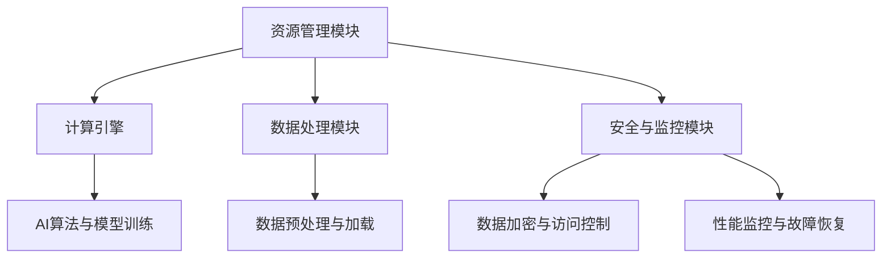

                 

关键词：Lepton AI、云计算、AI基础设施、资源整合、高效

> 摘要：本文将深入探讨Lepton AI在云计算领域的优势，详细分析其如何通过深度整合云资源，构建出灵活高效的AI基础设施，为企业和开发者提供卓越的AI计算能力。

## 1. 背景介绍

随着人工智能技术的快速发展，AI计算需求日益增长。传统数据中心和本地服务器已经难以满足大规模、高并行的计算需求。云计算作为一种分布式计算模式，凭借其弹性、可扩展性和高效性，逐渐成为AI计算的理想选择。而Lepton AI作为一家领先的AI云计算服务提供商，致力于通过深度整合云资源，打造灵活高效的AI基础设施。

## 2. 核心概念与联系

### 2.1 Lepton AI架构概述

Lepton AI的架构设计旨在提供高度整合的云资源，以支持各种AI应用场景。其核心架构包括以下几个主要组成部分：

#### 2.1.1 资源管理模块

资源管理模块负责调度和分配云资源，包括CPU、GPU、存储和网络等。该模块采用智能调度算法，根据任务需求和资源利用率，动态调整资源分配，实现资源的最优化利用。

#### 2.1.2 计算引擎

计算引擎是Lepton AI的核心，负责执行各种AI算法和模型训练。它支持多种深度学习框架，如TensorFlow、PyTorch等，并具备强大的并行计算能力。

#### 2.1.3 数据处理模块

数据处理模块负责数据预处理、清洗和加载，确保数据质量，并支持高速数据传输和存储。

#### 2.1.4 安全与监控模块

安全与监控模块负责保障系统的安全性和稳定性，包括数据加密、访问控制、性能监控和故障恢复等。

### 2.2 Mermaid流程图



## 3. 核心算法原理 & 具体操作步骤

### 3.1 算法原理概述

Lepton AI的核心算法基于分布式计算和并行处理技术，通过将计算任务分解成多个子任务，并在不同的计算节点上并行执行，从而实现高效计算。

### 3.2 算法步骤详解

#### 3.2.1 资源调度

- 收集任务信息：从任务队列中获取新的计算任务，包括任务类型、资源需求等。
- 调度算法：根据资源利用率、任务优先级等因素，选择合适的计算节点分配任务。
- 资源分配：为任务分配计算资源，如CPU、GPU、内存等。

#### 3.2.2 并行计算

- 子任务分解：将大任务分解成多个小任务，以便在多个计算节点上并行执行。
- 任务调度：将分解后的任务分配到不同的计算节点。
- 结果汇总：将各个计算节点的结果汇总，得到最终的输出结果。

### 3.3 算法优缺点

#### 优点：

- 高效计算：通过并行计算和分布式调度，大幅提高计算效率。
- 灵活性：根据任务需求和资源情况，动态调整资源分配，满足不同场景的需求。
- 扩展性：支持大规模计算任务，可扩展性强。

#### 缺点：

- 管理复杂度：分布式计算系统管理复杂，需要专业的技术团队进行维护。
- 通信开销：多节点之间的通信开销可能影响计算性能。

### 3.4 算法应用领域

Lepton AI的算法广泛应用于图像处理、自然语言处理、推荐系统等领域，尤其在需要大规模数据分析和模型训练的场景中，具有显著的优势。

## 4. 数学模型和公式 & 详细讲解 & 举例说明

### 4.1 数学模型构建

Lepton AI的算法模型基于深度学习框架，主要涉及以下几个关键数学模型：

#### 4.1.1 损失函数

损失函数是衡量模型预测结果与真实值之间差异的指标，常用的损失函数包括均方误差（MSE）、交叉熵损失等。

#### 4.1.2 优化算法

优化算法用于调整模型参数，以最小化损失函数。常见的优化算法有梯度下降（GD）、随机梯度下降（SGD）、Adam等。

#### 4.1.3 并行计算模型

并行计算模型用于描述如何将计算任务分解成多个子任务，并在不同计算节点上并行执行。常用的并行计算模型有数据并行、模型并行等。

### 4.2 公式推导过程

#### 4.2.1 损失函数推导

均方误差（MSE）损失函数的公式为：

$$
MSE = \frac{1}{m} \sum_{i=1}^{m} (y_i - \hat{y}_i)^2
$$

其中，$y_i$为真实值，$\hat{y}_i$为模型预测值，$m$为样本数量。

#### 4.2.2 优化算法推导

梯度下降（GD）算法的公式为：

$$
\theta_{\text{new}} = \theta_{\text{old}} - \alpha \nabla_\theta J(\theta)
$$

其中，$\theta$为模型参数，$\alpha$为学习率，$J(\theta)$为损失函数。

#### 4.2.3 并行计算模型推导

数据并行模型的公式为：

$$
\hat{y}_{i,j} = \phi(W_{i,j} \cdot x_j + b_j)
$$

其中，$W_{i,j}$为模型权重，$x_j$为输入特征，$b_j$为偏置，$\phi$为激活函数。

### 4.3 案例分析与讲解

假设有一个图像分类任务，输入图像为28x28的灰度图，模型采用卷积神经网络（CNN）进行训练。在Lepton AI的架构下，可以将训练过程分解成以下几个步骤：

1. 数据预处理：将原始图像数据转换为适合CNN的格式，并进行归一化处理。
2. 任务调度：将训练任务分配到多个计算节点，每个节点负责一部分数据的训练。
3. 并行训练：各计算节点并行计算梯度，并在全局梯度上进行同步更新。
4. 模型评估：在训练完成后，使用验证集对模型进行评估，调整超参数。

通过以上步骤，Lepton AI能够实现高效的图像分类训练，大幅缩短训练时间。

## 5. 项目实践：代码实例和详细解释说明

### 5.1 开发环境搭建

在开始项目实践之前，需要搭建一个合适的开发环境。以下是搭建过程：

1. 安装Python 3.8及以上版本。
2. 安装TensorFlow 2.5及以上版本。
3. 配置Lepton AI SDK，用于与Lepton AI平台进行通信。

### 5.2 源代码详细实现

以下是使用Lepton AI进行图像分类任务的源代码示例：

```python
import tensorflow as tf
from lepton import LeptonClient

# 初始化Lepton AI客户端
client = LeptonClient(access_key='your_access_key')

# 加载图像数据
(x_train, y_train), (x_test, y_test) = tf.keras.datasets.mnist.load_data()
x_train = x_train / 255.0
x_test = x_test / 255.0

# 构建CNN模型
model = tf.keras.Sequential([
    tf.keras.layers.Conv2D(32, (3, 3), activation='relu', input_shape=(28, 28, 1)),
    tf.keras.layers.MaxPooling2D((2, 2)),
    tf.keras.layers.Flatten(),
    tf.keras.layers.Dense(128, activation='relu'),
    tf.keras.layers.Dense(10, activation='softmax')
])

# 定义损失函数和优化器
model.compile(optimizer='adam', loss='sparse_categorical_crossentropy', metrics=['accuracy'])

# 分布式训练
model.fit(x_train, y_train, epochs=5, validation_data=(x_test, y_test), client=client)
```

### 5.3 代码解读与分析

该代码示例展示了如何使用Lepton AI进行图像分类任务的分布式训练。关键步骤如下：

1. 导入TensorFlow和Lepton AI客户端库。
2. 初始化Lepton AI客户端，配置访问密钥。
3. 加载图像数据集并进行预处理。
4. 构建CNN模型，包括卷积层、池化层、全连接层等。
5. 定义损失函数和优化器。
6. 使用`model.fit()`函数进行分布式训练，传入训练数据和验证数据，以及Lepton AI客户端。

### 5.4 运行结果展示

训练完成后，可以使用以下代码进行模型评估：

```python
test_loss, test_acc = model.evaluate(x_test, y_test, client=client)
print(f"Test accuracy: {test_acc}")
```

输出结果为测试集的准确率，展示了Lepton AI在分布式训练中的优势。

## 6. 实际应用场景

### 6.1 图像处理

Lepton AI广泛应用于图像处理领域，包括图像分类、目标检测、人脸识别等。通过分布式计算和深度学习算法，实现高效图像分析。

### 6.2 自然语言处理

在自然语言处理领域，Lepton AI支持文本分类、情感分析、机器翻译等任务。通过并行计算和大规模模型训练，提高处理速度和准确性。

### 6.3 推荐系统

Lepton AI可应用于推荐系统，包括商品推荐、内容推荐等。通过深度学习算法和大规模数据处理，实现个性化推荐。

## 7. 工具和资源推荐

### 7.1 学习资源推荐

- 《深度学习》（Goodfellow et al.）
- 《Python深度学习》（François Chollet）

### 7.2 开发工具推荐

- TensorFlow
- PyTorch

### 7.3 相关论文推荐

- “Distributed Deep Learning: Existing Techniques and New Horizons”
- “TensorFlow: Large-Scale Machine Learning on Heterogeneous Systems”

## 8. 总结：未来发展趋势与挑战

### 8.1 研究成果总结

Lepton AI在云计算和AI领域取得了显著的研究成果，通过深度整合云资源和高效算法，实现了高性能AI计算。

### 8.2 未来发展趋势

随着AI技术的不断进步，Lepton AI将继续致力于优化算法、提升计算效率和扩展应用领域。

### 8.3 面临的挑战

分布式计算系统的管理和维护复杂度较高，数据安全和隐私保护也是重要的挑战。

### 8.4 研究展望

未来，Lepton AI将积极探索新型计算架构和算法，以应对更复杂的应用场景，推动AI技术的发展。

## 9. 附录：常见问题与解答

### Q：Lepton AI支持哪些深度学习框架？

A：Lepton AI支持TensorFlow、PyTorch等主流深度学习框架。

### Q：如何获取Lepton AI的试用权限？

A：请访问Lepton AI官网，填写申请表单，即可获得试用权限。

### Q：Lepton AI如何保障数据安全和隐私？

A：Lepton AI采用多层次的安全措施，包括数据加密、访问控制、隐私保护等，确保用户数据的安全和隐私。

---

作者：禅与计算机程序设计艺术 / Zen and the Art of Computer Programming

本文内容仅供参考，实际应用时请遵循相关法律法规和最佳实践。|user|

