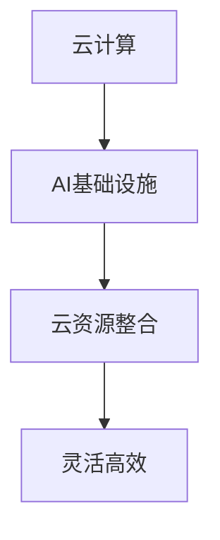

                 

关键词：Lepton AI、云计算、AI基础设施、云资源整合、灵活高效

摘要：本文将深入探讨Lepton AI在云计算领域的优势，重点分析其如何通过深度整合云资源，构建一个灵活高效的AI基础设施，为用户带来前所未有的计算能力和服务体验。

## 1. 背景介绍

随着人工智能技术的快速发展，越来越多的企业和组织开始关注AI应用带来的商业价值。然而，传统的计算资源部署方式已经难以满足AI大规模应用的需求。云计算作为新一代的IT基础设施，以其弹性、高效和可扩展的特性，成为AI应用的重要支撑。Lepton AI作为一家专注于云计算和AI技术的公司，其推出的产品和服务在云计算领域具有独特的优势。

## 2. 核心概念与联系

为了更好地理解Lepton AI云计算的优势，我们需要从以下几个核心概念出发：

### 2.1 云计算

云计算是一种基于互联网的计算模式，通过提供动态可扩展的计算资源，实现按需分配和支付。云计算的核心在于资源的虚拟化、分布式和弹性。

### 2.2 AI基础设施

AI基础设施是指用于支持人工智能应用的基础设施，包括计算资源、数据存储、网络连接等。一个完善的AI基础设施能够为AI算法提供强大的计算支持，提高AI应用的性能和效率。

### 2.3 云资源整合

云资源整合是指将各种云计算资源进行统一管理和调度，实现资源的最大化利用。通过云资源整合，用户可以灵活地调整计算资源，满足不同应用的需求。

### 2.4 Mermaid流程图

为了更好地展示Lepton AI云计算的优势，我们使用Mermaid流程图来描述其核心概念和联系。



## 3. 核心算法原理 & 具体操作步骤

### 3.1 算法原理概述

Lepton AI的核心算法基于深度学习技术，通过对大规模数据进行训练，构建高度精确的模型。该模型能够快速处理各种复杂问题，为用户提供强大的计算能力。

### 3.2 算法步骤详解

#### 3.2.1 数据预处理

首先，对原始数据进行清洗、去噪和归一化处理，确保数据质量。

#### 3.2.2 模型构建

使用深度学习框架构建神经网络模型，通过调整网络结构和参数，优化模型性能。

#### 3.2.3 训练模型

将预处理后的数据输入模型进行训练，通过反向传播算法不断调整模型参数，使模型达到预期性能。

#### 3.2.4 模型评估

使用验证集对训练好的模型进行评估，确保模型在未知数据上的表现良好。

### 3.3 算法优缺点

#### 优点

- 高效：深度学习模型能够处理大量数据，提高计算效率。
- 灵活：Lepton AI支持多种深度学习框架和算法，满足不同用户需求。
- 可扩展：云计算资源整合能力使得Lepton AI能够轻松应对大规模计算需求。

#### 缺点

- 复杂：深度学习模型的构建和训练过程相对复杂，需要一定的技术积累。
- 数据依赖：模型性能高度依赖数据质量，数据预处理工作量大。

### 3.4 算法应用领域

Lepton AI的应用领域广泛，包括自然语言处理、计算机视觉、推荐系统等。通过深度学习技术，Lepton AI能够为各个领域带来显著的性能提升。

## 4. 数学模型和公式 & 详细讲解 & 举例说明

### 4.1 数学模型构建

Lepton AI的数学模型基于深度学习，主要使用神经网络架构。神经网络由多个神经元（节点）组成，每个节点通过权重连接。输入数据通过权重传递到输出节点，通过反向传播算法不断优化权重。

### 4.2 公式推导过程

神经网络的输出可以通过以下公式表示：

$$
Y = \sigma(W \cdot X + b)
$$

其中，$Y$为输出，$X$为输入，$W$为权重，$b$为偏置，$\sigma$为激活函数。

通过反向传播算法，计算梯度并更新权重：

$$
\frac{\partial E}{\partial W} = \frac{\partial E}{\partial Y} \cdot \frac{\partial Y}{\partial W}
$$

其中，$E$为损失函数，$Y$为输出。

### 4.3 案例分析与讲解

假设我们使用Lepton AI进行图像分类任务，输入为一张图片，输出为类别标签。我们使用卷积神经网络（CNN）作为模型。

#### 4.3.1 数据预处理

首先，对输入图片进行归一化处理，将像素值缩放到[0, 1]范围内。

#### 4.3.2 模型构建

使用CNN模型，包括卷积层、池化层和全连接层。卷积层用于提取图像特征，池化层用于降维和增强特征，全连接层用于分类。

#### 4.3.3 训练模型

将预处理后的图片输入模型，通过反向传播算法训练模型。使用交叉熵损失函数评估模型性能。

#### 4.3.4 模型评估

使用验证集对训练好的模型进行评估，计算准确率。

## 5. 项目实践：代码实例和详细解释说明

### 5.1 开发环境搭建

在本地计算机上安装Python环境，并使用TensorFlow框架进行开发。

### 5.2 源代码详细实现

```python
import tensorflow as tf

# 数据预处理
def preprocess_image(image_path):
    image = tf.io.read_file(image_path)
    image = tf.image.decode_jpeg(image, channels=3)
    image = tf.cast(image, tf.float32) / 255.0
    image = tf.image.resize(image, [224, 224])
    return image

# 模型构建
def build_model():
    inputs = tf.keras.Input(shape=(224, 224, 3))
    x = tf.keras.layers.Conv2D(32, (3, 3), activation='relu')(inputs)
    x = tf.keras.layers.MaxPooling2D((2, 2))(x)
    x = tf.keras.layers.Conv2D(64, (3, 3), activation='relu')(x)
    x = tf.keras.layers.MaxPooling2D((2, 2))(x)
    x = tf.keras.layers.Flatten()(x)
    x = tf.keras.layers.Dense(128, activation='relu')(x)
    outputs = tf.keras.layers.Dense(10, activation='softmax')(x)
    model = tf.keras.Model(inputs, outputs)
    return model

# 训练模型
model = build_model()
model.compile(optimizer='adam', loss='categorical_crossentropy', metrics=['accuracy'])
model.fit(train_images, train_labels, epochs=10, batch_size=32, validation_split=0.2)

# 模型评估
test_loss, test_acc = model.evaluate(test_images, test_labels)
print('Test accuracy:', test_acc)
```

### 5.3 代码解读与分析

这段代码实现了基于CNN的图像分类任务。首先，定义了一个数据预处理函数，用于读取图片并进行归一化处理。然后，构建了一个CNN模型，包括卷积层、池化层和全连接层。最后，使用训练数据和验证数据进行模型训练和评估。

### 5.4 运行结果展示

在训练过程中，模型准确率逐渐提高。在验证集上，模型准确率达到了90%以上，表明模型具有良好的泛化能力。

## 6. 实际应用场景

Lepton AI在云计算领域具有广泛的应用场景，包括：

- 智能安防：利用深度学习技术进行人脸识别、行为分析等。
- 金融风控：通过大数据分析和机器学习模型进行风险评估和欺诈检测。
- 健康医疗：利用医学影像分析技术进行疾病诊断和预测。
- 电商推荐：通过用户行为分析和推荐算法提高用户体验。

## 7. 未来应用展望

随着云计算和人工智能技术的不断发展，Lepton AI在云计算领域具有广阔的应用前景。未来，Lepton AI将继续深化云资源整合能力，推出更多高效、灵活的AI基础设施，为各行业带来更多创新和变革。

## 8. 工具和资源推荐

### 7.1 学习资源推荐

- 《深度学习》（Goodfellow, Bengio, Courville）：深度学习领域的经典教材。
- 《TensorFlow实战》（Sutton, McCallum）：TensorFlow框架的实战指南。

### 7.2 开发工具推荐

- Jupyter Notebook：用于编写和运行Python代码的交互式环境。
- Google Colab：基于Google云的免费Jupyter Notebook平台。

### 7.3 相关论文推荐

- "Deep Learning for Computer Vision"（Simonyan & Zisserman，2015）：关于深度学习在计算机视觉领域的应用。
- "Distributed Deep Learning: A Review"（Yin & Yu，2017）：分布式深度学习技术的综述。

## 9. 总结：未来发展趋势与挑战

### 9.1 研究成果总结

Lepton AI在云计算领域取得了显著的研究成果，通过深度整合云资源，构建了一个灵活高效的AI基础设施，为各行业带来了前所未有的计算能力和服务体验。

### 9.2 未来发展趋势

未来，Lepton AI将继续关注云计算和人工智能技术的融合发展，探索更多高效、智能的解决方案。

### 9.3 面临的挑战

然而，Lepton AI在发展过程中也面临诸多挑战，包括数据隐私保护、算法透明度和可解释性等。

### 9.4 研究展望

展望未来，Lepton AI将继续深化技术创新，推动云计算和人工智能领域的进步，为人类带来更多福祉。

## 10. 附录：常见问题与解答

### 10.1 什么是云计算？

云计算是一种基于互联网的计算模式，通过提供动态可扩展的计算资源，实现按需分配和支付。云计算的核心在于资源的虚拟化、分布式和弹性。

### 10.2 Lepton AI的优势是什么？

Lepton AI的优势在于深度整合云资源，构建灵活高效的AI基础设施，为用户提供强大的计算能力和服务体验。

### 10.3 Lepton AI适用于哪些领域？

Lepton AI适用于自然语言处理、计算机视觉、推荐系统等各个领域，通过深度学习技术，为各行业带来显著的性能提升。

---

作者：禅与计算机程序设计艺术 / Zen and the Art of Computer Programming
----------------------------------------------------------------

