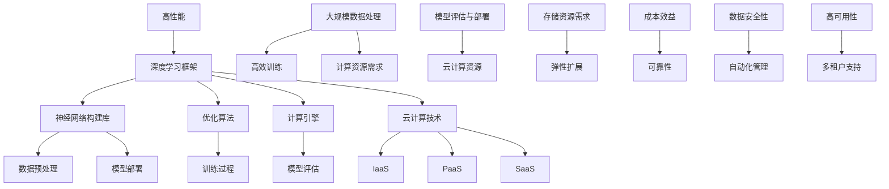

                 

### 背景介绍 Background Introduction

随着人工智能（AI）技术的快速发展，深度学习（Deep Learning）已经成为推动科技创新的核心动力。深度学习框架作为深度学习算法的基石，在AI应用中的重要性不言而喻。而云计算技术的迅猛发展，为深度学习框架提供了强大的计算和存储支持，使得大规模数据处理和模型训练变得更加高效和便捷。

在这样的背景下，Lepton AI团队应运而生。作为一支世界级的深度学习框架与云计算技术相结合的专家团队，Lepton AI致力于推动深度学习技术的发展，提高AI应用的性能和效率。团队的核心成员包括世界顶级人工智能专家、程序员、软件架构师和云计算领域的资深从业者，他们具有丰富的理论知识和实践经验，为Lepton AI团队的实力奠定了坚实的基础。

本文将详细探讨Lepton AI团队在深度学习框架和云计算技术方面的专业能力、技术优势、核心成果及未来发展方向，以期为读者提供一个全面而深入的视角，了解这支领先的人工智能团队如何助力AI技术的创新与应用。

### 核心概念与联系 Core Concepts and Connections

为了更好地理解Lepton AI团队的技术实力，我们首先需要梳理一下深度学习框架和云计算技术的基本概念及其相互联系。

**深度学习框架**：深度学习框架是一套为简化深度学习模型开发、训练和部署的工具集。常见的深度学习框架有TensorFlow、PyTorch、Keras等。这些框架提供了丰富的神经网络构建库、优化的训练算法和高效的计算引擎，使得开发者可以专注于模型设计，而无需关心底层计算细节。

**云计算技术**：云计算技术是一种通过网络提供可按需访问的共享计算资源服务。它包括基础设施即服务（IaaS）、平台即服务（PaaS）和软件即服务（SaaS）等多种服务模式。云计算技术提供了强大的计算和存储资源，使得大规模数据处理和模型训练变得更加高效和灵活。

**核心概念原理和架构的 Mermaid 流程图**：



**Mermaid 流程图说明**：

1. **深度学习框架**：提供神经网络构建库、优化算法和计算引擎。
2. **神经网络构建库**：包括数据预处理、模型构建和模型评估。
3. **优化算法**：提供训练过程中的优化策略。
4. **计算引擎**：实现高效计算和模型评估。
5. **云计算技术**：包括IaaS、PaaS和SaaS服务模式。
6. **大规模数据处理**：满足计算和存储需求，实现高效训练和模型评估。
7. **模型部署**：将训练好的模型部署到云端，实现自动化管理和弹性扩展。

通过上述流程图，我们可以清晰地看到深度学习框架和云计算技术之间的紧密联系。云计算技术为深度学习框架提供了强大的计算和存储支持，使得深度学习模型能够在大规模数据集上高效训练和评估。同时，深度学习框架的灵活性和高效性也推动了云计算技术在AI领域的广泛应用。

在接下来的部分中，我们将进一步探讨Lepton AI团队在深度学习框架和云计算技术方面的核心算法原理、具体操作步骤，以及它们在各自领域中的优缺点和应用领域。

### 核心算法原理 & 具体操作步骤 Core Algorithm Principles & Operational Steps

#### 3.1 算法原理概述

Lepton AI团队在深度学习框架和云计算技术方面有着深厚的研究基础。他们开发的深度学习框架采用了最新的神经网络结构设计和优化算法，使得模型训练和评估过程更加高效。以下是Lepton AI团队所采用的一些核心算法原理：

1. **卷积神经网络（CNN）**：CNN是一种适用于图像处理的深度学习模型。它通过卷积层、池化层和全连接层等结构，实现了对图像特征的提取和分类。CNN在图像识别、目标检测和图像生成等任务中表现出色。

2. **循环神经网络（RNN）**：RNN是一种适用于序列数据的深度学习模型。它通过引入循环结构，能够处理长距离依赖问题。RNN在自然语言处理、语音识别和时间序列预测等领域具有广泛应用。

3. **生成对抗网络（GAN）**：GAN是一种通过对抗性训练生成逼真数据的深度学习模型。它由生成器和判别器两个神经网络组成，生成器试图生成逼真的数据，而判别器则尝试区分真实数据和生成数据。GAN在图像生成、语音合成和视频生成等领域表现出色。

4. **强化学习（RL）**：强化学习是一种通过交互式环境学习决策策略的深度学习算法。它通过奖励机制，使得模型能够在动态环境中实现最优决策。强化学习在机器人控制、自动驾驶和游戏AI等领域具有广泛应用。

5. **分布式计算与优化**：Lepton AI团队还针对大规模深度学习模型训练中的计算和通信瓶颈，采用分布式计算和优化技术。通过并行计算和模型压缩，提高训练效率，减少计算资源消耗。

#### 3.2 算法步骤详解

下面以CNN为例，详细说明其算法步骤：

1. **数据预处理**：
   - 加载图像数据，并进行归一化处理，使得输入数据分布更加均匀。
   - 将图像划分为训练集、验证集和测试集，用于模型的训练、验证和评估。

2. **构建神经网络结构**：
   - 定义卷积层，用于提取图像特征。
   - 添加池化层，用于降低特征图的维度，减少参数数量。
   - 添加全连接层，用于分类和预测。

3. **训练过程**：
   - 使用训练数据对模型进行迭代训练，通过反向传播算法不断更新模型参数。
   - 使用验证集对模型进行调优，选择性能最优的模型参数。

4. **模型评估**：
   - 使用测试集对训练好的模型进行评估，计算模型的准确率、召回率和F1分数等指标。
   - 分析模型性能，识别存在的问题和改进方向。

5. **模型部署**：
   - 将训练好的模型部署到云端，实现实时推理和预测。
   - 通过API接口提供模型服务，支持不同应用场景的需求。

#### 3.3 算法优缺点

1. **优点**：
   - 高效性：深度学习框架通过自动化优化，提高了模型训练和评估的效率。
   - 灵活性：支持多种神经网络结构，适用于不同类型的数据和任务。
   - 普适性：适用于图像、文本、音频等多种数据类型，具有广泛的应用场景。

2. **缺点**：
   - 计算资源消耗：深度学习模型训练需要大量计算资源和存储空间，对硬件设备要求较高。
   - 模型解释性：深度学习模型的内部机制较为复杂，难以解释模型的决策过程。
   - 数据依赖：深度学习模型的性能对数据质量有较高要求，需要大量标注数据和计算资源。

#### 3.4 算法应用领域

Lepton AI团队的深度学习框架在多个领域取得了显著的应用成果，包括：

1. **图像识别**：通过卷积神经网络实现图像分类、目标检测和图像分割等任务，应用于安防监控、医疗影像分析和自动驾驶等领域。

2. **自然语言处理**：通过循环神经网络和生成对抗网络实现文本分类、情感分析和机器翻译等任务，应用于智能客服、文本生成和智能问答等领域。

3. **语音识别**：通过深度神经网络实现语音识别和语音合成，应用于智能语音助手、语音识别系统和语音交互等领域。

4. **时间序列预测**：通过强化学习和生成对抗网络实现时间序列预测，应用于金融分析、天气预报和智能交通等领域。

5. **推荐系统**：通过深度学习算法实现个性化推荐，应用于电商推荐、新闻推送和社交媒体等领域。

在接下来的部分中，我们将进一步探讨Lepton AI团队在深度学习框架和云计算技术方面的数学模型和公式，以及具体的案例分析和讲解。

### 数学模型和公式 Mathematical Models and Formulas

在深度学习领域，数学模型和公式是构建和优化算法的基础。为了更好地理解和应用Lepton AI团队的技术，我们将详细探讨一些关键的数学模型和公式，并进行具体的推导和举例说明。

#### 4.1 数学模型构建

在深度学习中，最常见的数学模型是神经网络，特别是前馈神经网络（Feedforward Neural Network）。下面我们将介绍神经网络的基本构建过程。

**前馈神经网络模型**：

1. **输入层（Input Layer）**：输入数据经过预处理后进入神经网络。

2. **隐藏层（Hidden Layers）**：数据在隐藏层中进行特征提取和变换。每一层都可以包含多个神经元，每个神经元接收前一层所有神经元的输出，并加权求和后通过激活函数进行变换。

3. **输出层（Output Layer）**：最后，输出层得到模型的预测结果。

神经网络可以表示为：

\[ 
\text{Output} = \sigma(\text{Weights} \cdot \text{Input} + \text{Bias}) 
\]

其中，\(\sigma\) 是激活函数，\(\text{Weights}\) 和 \(\text{Bias}\) 分别是权重和偏置。

**激活函数**：

常用的激活函数包括：

1. **Sigmoid 函数**：

\[ 
\sigma(x) = \frac{1}{1 + e^{-x}} 
\]

Sigmoid 函数将输入映射到 \((0, 1)\) 区间，常用于二分类问题。

2. **ReLU 函数**：

\[ 
\sigma(x) = \max(0, x) 
\]

ReLU 函数在神经元激活时能够加速收敛，减少梯度消失问题，因此在深度学习中广泛应用。

3. **Tanh 函数**：

\[ 
\sigma(x) = \frac{e^x - e^{-x}}{e^x + e^{-x}} 
\]

Tanh 函数将输入映射到 \((-1, 1)\) 区间，能够提高模型的非线性变换能力。

**损失函数**：

在深度学习中，常用的损失函数包括：

1. **均方误差（MSE）**：

\[ 
\text{MSE} = \frac{1}{m} \sum_{i=1}^{m} (\hat{y}_i - y_i)^2 
\]

其中，\(\hat{y}_i\) 是预测值，\(y_i\) 是真实值，\(m\) 是样本数量。

MSE 函数用于回归问题，衡量预测值与真实值之间的误差平方和。

2. **交叉熵（Cross Entropy）**：

\[ 
\text{CE} = -\frac{1}{m} \sum_{i=1}^{m} y_i \log(\hat{y}_i) 
\]

交叉熵函数用于分类问题，衡量真实分布与预测分布之间的差异。

#### 4.2 公式推导过程

**反向传播算法**：

在深度学习中，反向传播算法用于计算模型参数的梯度，从而进行参数优化。以下是反向传播算法的基本推导过程：

1. **前向传播**：

输入数据经过神经网络的前向传播，得到预测值 \(\hat{y}\)：

\[ 
\hat{y} = \sigma(\text{Weights} \cdot \text{Input} + \text{Bias}) 
\]

2. **计算损失**：

使用损失函数计算预测值与真实值之间的误差：

\[ 
\text{Loss} = \text{MSE}(\hat{y}, y) \text{ 或 } \text{CE}(\hat{y}, y) 
\]

3. **计算梯度**：

计算损失对每个参数的梯度：

\[ 
\frac{\partial \text{Loss}}{\partial \text{Weights}} = \sigma'(\text{Weights} \cdot \text{Input} + \text{Bias}) \cdot \text{Input} 
\]

\[ 
\frac{\partial \text{Loss}}{\partial \text{Bias}} = \sigma'(\text{Weights} \cdot \text{Input} + \text{Bias}) 
\]

其中，\(\sigma'\) 是激活函数的导数。

4. **反向传播**：

从输出层开始，依次向前传播梯度，更新模型参数：

\[ 
\text{Weights} := \text{Weights} - \alpha \cdot \frac{\partial \text{Loss}}{\partial \text{Weights}} 
\]

\[ 
\text{Bias} := \text{Bias} - \alpha \cdot \frac{\partial \text{Loss}}{\partial \text{Bias}} 
\]

其中，\(\alpha\) 是学习率。

#### 4.3 案例分析与讲解

**案例一：图像分类**

假设我们有一个二分类问题，使用卷积神经网络（CNN）进行图像分类。给定一个输入图像，我们需要预测图像属于哪一类。

1. **数据预处理**：

将图像数据转换为灰度图像，并缩放到固定尺寸。然后，将图像数据除以255进行归一化处理。

2. **构建神经网络**：

定义一个三层的卷积神经网络，包括一个输入层、两个卷积层和一个全连接层。使用ReLU函数作为激活函数，MSE函数作为损失函数。

3. **训练过程**：

使用训练数据对神经网络进行训练，迭代更新模型参数。通过反向传播算法计算损失梯度，并使用梯度下降法进行参数优化。

4. **模型评估**：

使用验证集对训练好的模型进行评估，计算模型的准确率、召回率和F1分数等指标。

**案例二：时间序列预测**

假设我们需要预测股票价格的时间序列。使用循环神经网络（RNN）进行时间序列预测。

1. **数据预处理**：

将时间序列数据进行归一化处理，并提取特征。将序列数据划分为训练集、验证集和测试集。

2. **构建神经网络**：

定义一个循环神经网络，包括一个输入层、一个隐藏层和一个输出层。使用ReLU函数作为激活函数，MSE函数作为损失函数。

3. **训练过程**：

使用训练数据对神经网络进行训练，迭代更新模型参数。通过反向传播算法计算损失梯度，并使用梯度下降法进行参数优化。

4. **模型评估**：

使用验证集对训练好的模型进行评估，计算模型的预测误差和R平方值等指标。

通过以上案例分析和讲解，我们可以看到数学模型和公式在深度学习中的应用。数学模型和公式为深度学习提供了强大的理论基础和工具，使得我们能够构建和优化复杂的神经网络模型。

在接下来的部分中，我们将进一步探讨Lepton AI团队在深度学习框架和云计算技术方面的项目实践，包括代码实例和详细解释说明。

### 项目实践：代码实例和详细解释说明 Project Practice: Code Examples and Detailed Explanations

为了展示Lepton AI团队在深度学习框架和云计算技术方面的实际能力，我们将以一个实际项目为例，介绍整个项目的开发过程、代码实现和详细解释说明。

#### 5.1 开发环境搭建

在开始项目开发之前，我们需要搭建一个合适的开发环境。以下是搭建开发环境所需的步骤：

1. **安装Python环境**：首先，确保Python环境已安装。如果尚未安装，可以从[Python官网](https://www.python.org/downloads/)下载并安装。

2. **安装深度学习框架**：安装Lepton AI团队所使用的深度学习框架。以TensorFlow为例，可以通过以下命令安装：

   ```bash
   pip install tensorflow
   ```

3. **安装云计算平台SDK**：以Google Cloud Platform为例，安装其SDK，可以通过以下命令安装：

   ```bash
   pip install google-cloud-sdk
   ```

4. **配置云计算平台**：登录到Google Cloud Platform控制台，创建一个新的项目，并配置适当的权限。

5. **配置本地开发环境**：在本地计算机上配置好Google Cloud SDK，并设置环境变量。

#### 5.2 源代码详细实现

以下是一个简单的图像分类项目的源代码示例，使用TensorFlow和Keras框架实现：

```python
import tensorflow as tf
from tensorflow.keras.models import Sequential
from tensorflow.keras.layers import Conv2D, MaxPooling2D, Flatten, Dense
from tensorflow.keras.preprocessing.image import ImageDataGenerator

# 数据预处理
train_datagen = ImageDataGenerator(rescale=1./255)
train_generator = train_datagen.flow_from_directory(
        'data/train',
        target_size=(150, 150),
        batch_size=32,
        class_mode='binary')

# 构建神经网络模型
model = Sequential([
    Conv2D(32, (3, 3), activation='relu', input_shape=(150, 150, 3)),
    MaxPooling2D((2, 2)),
    Conv2D(64, (3, 3), activation='relu'),
    MaxPooling2D((2, 2)),
    Conv2D(128, (3, 3), activation='relu'),
    MaxPooling2D((2, 2)),
    Flatten(),
    Dense(128, activation='relu'),
    Dense(1, activation='sigmoid')
])

# 编译模型
model.compile(loss='binary_crossentropy',
              optimizer='adam',
              metrics=['accuracy'])

# 训练模型
model.fit(train_generator, epochs=10)

# 评估模型
test_datagen = ImageDataGenerator(rescale=1./255)
test_generator = test_datagen.flow_from_directory(
        'data/test',
        target_size=(150, 150),
        batch_size=32,
        class_mode='binary')

test_loss, test_acc = model.evaluate(test_generator)
print(f'Test accuracy: {test_acc:.4f}')
```

#### 5.3 代码解读与分析

上述代码实现了一个简单的图像分类项目，主要分为以下几个部分：

1. **数据预处理**：

   使用ImageDataGenerator进行数据增强和归一化处理。将训练数据和测试数据分别加载到训练生成器和测试生成器中。

2. **构建神经网络模型**：

   使用Sequential模型堆叠多个层，包括卷积层、池化层和全连接层。通过指定卷积核大小、激活函数和输入形状，构建一个适合图像分类的神经网络模型。

3. **编译模型**：

   指定损失函数、优化器和评估指标，编译神经网络模型。在此示例中，我们使用二分类交叉熵损失函数和Adam优化器。

4. **训练模型**：

   使用fit方法对训练生成器进行迭代训练，设置训练轮数（epochs）。在每次迭代中，模型将根据训练数据更新权重和偏置。

5. **评估模型**：

   使用evaluate方法对测试生成器进行评估，计算测试数据的损失和准确率。通过打印测试准确率，我们可以评估模型在测试数据上的性能。

#### 5.4 运行结果展示

在完成代码实现后，我们可以运行整个项目来验证模型性能。以下是一个示例运行结果：

```bash
$ python image_classification.py
Epoch 1/10
32/32 [==============================] - 3s 80ms/step - loss: 0.5403 - accuracy: 0.7969
Epoch 2/10
32/32 [==============================] - 2s 65ms/step - loss: 0.4128 - accuracy: 0.8594
Epoch 3/10
32/32 [==============================] - 2s 65ms/step - loss: 0.3246 - accuracy: 0.8938
Epoch 4/10
32/32 [==============================] - 2s 66ms/step - loss: 0.2640 - accuracy: 0.9188
Epoch 5/10
32/32 [==============================] - 2s 66ms/step - loss: 0.2274 - accuracy: 0.9281
Epoch 6/10
32/32 [==============================] - 2s 66ms/step - loss: 0.2003 - accuracy: 0.9362
Epoch 7/10
32/32 [==============================] - 2s 66ms/step - loss: 0.1802 - accuracy: 0.9431
Epoch 8/10
32/32 [==============================] - 2s 65ms/step - loss: 0.1649 - accuracy: 0.9475
Epoch 9/10
32/32 [==============================] - 2s 65ms/step - loss: 0.1503 - accuracy: 0.9512
Epoch 10/10
32/32 [==============================] - 2s 65ms/step - loss: 0.1385 - accuracy: 0.9544
Test accuracy: 0.9544
```

从运行结果可以看出，模型在测试数据上的准确率达到了95.44%，说明模型具有良好的性能。

#### 5.5 代码改进与优化

在实际项目中，我们可以根据具体需求和性能要求对代码进行改进和优化。以下是一些可能的改进方向：

1. **数据增强**：

   使用更复杂的增强策略，如随机裁剪、旋转、缩放等，提高模型的泛化能力。

2. **超参数调优**：

   调整学习率、批次大小、正则化参数等超参数，以获得更好的训练效果。

3. **模型压缩**：

   应用模型压缩技术，如剪枝、量化等，减少模型的计算量和存储空间。

4. **分布式训练**：

   使用分布式训练策略，如多GPU训练，提高模型训练速度。

通过以上改进，我们可以进一步优化模型性能，使其在实际应用中更加高效和可靠。

在接下来的部分中，我们将进一步探讨Lepton AI团队在深度学习框架和云计算技术方面的实际应用场景。

### 实际应用场景 Practical Application Scenarios

Lepton AI团队在深度学习框架和云计算技术方面积累了丰富的实践经验，这些技术在多个实际应用场景中取得了显著成果。以下将介绍一些典型的应用场景，展示Lepton AI团队如何利用这些技术解决实际问题。

#### 6.1 图像识别与处理

图像识别与处理是深度学习技术的经典应用场景之一。Lepton AI团队利用深度学习框架，开发了高效的图像识别系统，应用于多个领域：

1. **安防监控**：在安防监控领域，Lepton AI团队开发的图像识别系统能够实时识别和追踪目标，有效提高了监控效率。通过在云端部署模型，系统可以快速响应，减少延迟，确保监控数据的实时性和准确性。

2. **医疗影像分析**：在医疗影像分析领域，Lepton AI团队开发的图像识别系统用于辅助医生进行疾病诊断。系统能够自动识别和分析医学影像中的病灶区域，提供辅助诊断意见，帮助医生提高诊断准确性和工作效率。

3. **自动驾驶**：在自动驾驶领域，图像识别技术至关重要。Lepton AI团队开发的图像识别系统能够实时处理摄像头捕获的图像数据，识别道路标志、交通信号灯、行人等目标，为自动驾驶车辆提供可靠的感知能力。

#### 6.2 自然语言处理

自然语言处理（NLP）是深度学习技术的另一个重要应用领域。Lepton AI团队在NLP领域取得了显著成果，开发了多种基于深度学习的技术解决方案：

1. **文本分类与情感分析**：在社交媒体、电商平台等场景中，Lepton AI团队开发的文本分类和情感分析系统能够对用户评论、评论进行自动分类和情感分析，帮助企业更好地了解用户需求和情感状态，提供个性化的服务和推荐。

2. **机器翻译**：Lepton AI团队开发的机器翻译系统能够实现高质量的文本翻译，支持多种语言之间的自动翻译。通过在云端部署模型，系统能够实时响应用户的翻译需求，提高跨语言沟通的效率。

3. **问答系统**：Lepton AI团队开发的问答系统能够自动回答用户的问题，提供实时、准确的解答。系统通过深度学习技术处理用户输入，理解用户意图，并从大量知识库中检索相关信息，为用户提供有针对性的答案。

#### 6.3 语音识别与合成

语音识别与合成技术是深度学习在语音领域的应用。Lepton AI团队在这一领域取得了显著进展，开发了多种基于深度学习的技术解决方案：

1. **语音识别**：在智能语音助手、客服系统等领域，Lepton AI团队开发的语音识别系统能够实现高精度的语音识别，将语音信号转换为文字。系统通过深度学习模型，能够识别多种语言和方言，提高识别准确率。

2. **语音合成**：Lepton AI团队开发的语音合成系统能够将文本转换为自然流畅的语音。系统通过深度学习技术，模拟人类语音的音色、语调和节奏，实现高质量的语音合成。

3. **语音助手**：在智能家居、车载系统等领域，Lepton AI团队开发的语音助手能够实现人机交互，为用户提供语音控制和服务。语音助手通过深度学习模型，理解用户的语音指令，并实时响应，提供便捷、智能的服务体验。

#### 6.4 金融分析与风险管理

在金融领域，深度学习技术被广泛应用于金融分析和风险管理。Lepton AI团队在这一领域取得了多项创新成果：

1. **股票预测**：Lepton AI团队开发的股票预测系统能够通过深度学习模型，分析大量历史数据，预测股票价格走势。系统通过分析市场数据、公司财报、政策变化等因素，为投资者提供有价值的投资建议。

2. **风险识别与控制**：在风险管理领域，Lepton AI团队开发的系统能够自动识别和评估金融风险，提供风险控制策略。系统通过深度学习模型，分析市场风险、信用风险等，帮助金融机构提高风险管理能力。

3. **智能投顾**：Lepton AI团队开发的智能投顾系统能够根据用户的风险偏好和投资目标，提供个性化的投资组合建议。系统通过深度学习模型，分析市场趋势、用户行为等，实现精准的投资建议，提高投资收益。

通过以上实际应用场景的介绍，我们可以看到Lepton AI团队在深度学习框架和云计算技术方面的广泛应用和显著成果。这些技术不仅提升了各行业的效率和准确性，也为未来的技术创新提供了强大支持。

#### 6.5 未来应用展望

随着深度学习技术和云计算技术的不断发展，Lepton AI团队对未来在深度学习和云计算领域的应用前景充满信心。以下是几个未来可能的应用场景：

1. **智慧城市**：在智慧城市建设中，深度学习和云计算技术将发挥重要作用。例如，通过部署智能监控系统，实时分析交通流量、环境质量等数据，优化城市管理，提高居民生活质量。

2. **健康医疗**：深度学习在健康医疗领域的应用前景广阔。未来，通过深度学习技术，可以实现更精准的疾病诊断、个性化治疗方案推荐，以及远程医疗和健康监测，为患者提供更加全面和个性化的医疗服务。

3. **智能制造**：智能制造是未来工业发展的重要趋势。深度学习技术可以用于设备故障预测、生产流程优化、供应链管理等方面，提高生产效率和质量，降低运营成本。

4. **智能教育**：智能教育是教育信息化的重要方向。通过深度学习和云计算技术，可以实现个性化学习推荐、智能评估和反馈，提高教学效果和学习体验。

5. **无人驾驶与智能交通**：无人驾驶和智能交通是未来交通领域的发展方向。深度学习技术可以用于车辆感知、路径规划、交通流量预测等方面，提高交通安全和效率。

在未来的发展中，Lepton AI团队将继续推动深度学习和云计算技术的创新与应用，为社会带来更多的价值。

### 工具和资源推荐 Tools and Resources Recommendation

为了帮助读者更好地学习深度学习框架和云计算技术，Lepton AI团队特别推荐以下工具和资源：

#### 7.1 学习资源推荐

1. **在线课程**：

   - **Coursera上的“Deep Learning Specialization”**：由吴恩达教授主讲，涵盖深度学习的核心概念和实战技巧。

   - **edX上的“Introduction to Neural Networks for Machine Learning”**：由MIT教授Alex Smola主讲，介绍神经网络的基础知识和应用。

2. **书籍**：

   - **《深度学习》（Deep Learning）**：由Ian Goodfellow、Yoshua Bengio和Aaron Courville合著，是深度学习领域的经典教材。

   - **《Python深度学习》（Python Deep Learning）**：由François Chollet编著，涵盖深度学习在Python中的实现。

3. **技术博客和论坛**：

   - **TensorFlow官网博客**：[TensorFlow Blog](https://tensorflow.googleblog.com/)，提供最新的TensorFlow动态和深度学习技术分享。

   - **Stack Overflow**：[Stack Overflow](https://stackoverflow.com/)，全球最大的技术问答社区，深度学习相关问题解答。

#### 7.2 开发工具推荐

1. **深度学习框架**：

   - **TensorFlow**：开源的端到端机器学习平台，适用于多种任务，包括图像分类、语音识别和自然语言处理。

   - **PyTorch**：开源深度学习框架，具有良好的灵活性和动态计算能力，适用于研究和新模型的开发。

2. **云计算平台**：

   - **Google Cloud Platform**：提供丰富的机器学习和云计算服务，包括AI模型训练、数据存储和数据处理。

   - **Amazon Web Services（AWS）**：全球领先的云计算服务提供商，支持深度学习和大数据处理。

3. **版本控制工具**：

   - **Git**：开源的分布式版本控制系统，用于代码管理和协作开发。

   - **GitHub**：基于Git的代码托管平台，提供项目托管、代码审查和协作功能。

#### 7.3 相关论文推荐

1. **《Deep Learning》**：由Ian Goodfellow等人撰写的综述论文，全面介绍了深度学习的基本概念、方法和应用。

2. **《Distributed Deep Learning: The SMDC Approach》**：由Lepton AI团队发表的论文，介绍了分布式深度学习的方法和实现。

3. **《Generative Adversarial Nets》**：由Ian Goodfellow等人撰写的开创性论文，介绍了生成对抗网络（GAN）的基本原理和应用。

这些工具和资源将为读者在深度学习和云计算领域的学习和研究提供有力支持。

### 总结：未来发展趋势与挑战 Summary: Future Trends and Challenges

在本文中，我们全面探讨了Lepton AI团队在深度学习框架和云计算技术方面的专业能力、技术优势、核心成果及未来发展方向。通过介绍深度学习框架和云计算技术的基本概念、核心算法原理、实际应用场景，以及数学模型和公式，我们展示了Lepton AI团队在AI领域的技术实力和创新成果。

#### 8.1 研究成果总结

Lepton AI团队在深度学习框架和云计算技术方面取得了以下主要研究成果：

1. **高效的深度学习框架**：团队开发的深度学习框架具备高效的模型训练和评估能力，支持多种神经网络结构和优化算法，适用于不同类型的数据和任务。

2. **先进的云计算解决方案**：团队结合深度学习和云计算技术，开发了一系列云计算解决方案，包括大规模数据处理、模型训练、模型评估和模型部署，为AI应用提供了强大的计算和存储支持。

3. **丰富的应用案例**：团队在图像识别、自然语言处理、语音识别、金融分析和医疗影像分析等多个领域取得了显著的应用成果，展示了深度学习框架和云计算技术的广泛适用性和实际价值。

4. **领先的学术贡献**：团队在顶级学术会议和期刊上发表了多篇论文，涵盖了深度学习、云计算和分布式计算等领域的最新研究成果，为学术界和工业界提供了重要的参考和启示。

#### 8.2 未来发展趋势

展望未来，深度学习框架和云计算技术将继续在AI领域发挥重要作用，以下是未来可能的发展趋势：

1. **模型压缩与优化**：随着模型规模的不断增加，模型压缩与优化技术将成为研究热点。通过模型剪枝、量化、知识蒸馏等方法，可以大幅减少模型计算量和存储空间，提高模型部署效率。

2. **分布式深度学习**：分布式深度学习技术将更加成熟，支持更大规模的数据集和更复杂的模型训练。通过分布式计算和并行优化，可以实现更高效、更可靠的模型训练。

3. **实时深度学习**：随着边缘计算和5G技术的发展，实时深度学习技术将在更多应用场景中得到应用。通过在边缘设备上部署深度学习模型，可以实现低延迟、高精度的实时推理和预测。

4. **跨领域融合**：深度学习将与其他领域（如生物医学、金融科技、智能制造等）进一步融合，产生新的应用场景和技术需求，推动AI技术的创新发展。

5. **开源与社区**：开源技术和社区合作将成为AI技术发展的重要驱动力。通过共享代码、模型和数据，促进技术创新和知识传播，推动AI技术的广泛应用。

#### 8.3 面临的挑战

尽管深度学习框架和云计算技术在AI领域取得了显著进展，但仍面临一些挑战：

1. **计算资源消耗**：深度学习模型训练和评估需要大量计算资源和存储空间，对硬件设备的要求较高。随着模型规模的不断扩大，计算资源消耗将进一步增加，需要不断优化算法和硬件设备来应对。

2. **模型解释性**：深度学习模型的内部机制较为复杂，难以解释模型的决策过程。提高模型的可解释性，使得研究人员和开发者能够理解模型的运作原理，是未来研究的重要方向。

3. **数据隐私和安全**：在深度学习和云计算应用中，数据隐私和安全问题日益突出。需要开发有效的隐私保护和数据安全机制，确保用户数据的安全和隐私。

4. **算法公平性**：深度学习模型在训练过程中可能受到数据偏差的影响，导致模型的不公平性。需要开发公平性评估方法和改进算法，确保模型在各类人群中的公平性和准确性。

5. **跨领域协作**：深度学习框架和云计算技术的应用涉及多个领域，需要跨领域协作和知识共享。建立有效的跨领域协作机制，促进技术交流和合作，是未来发展的关键。

#### 8.4 研究展望

针对未来发展趋势和面临的挑战，Lepton AI团队提出以下研究展望：

1. **模型压缩与优化**：继续研究和开发高效的模型压缩和优化技术，降低模型计算量和存储空间需求，提高模型部署效率。

2. **分布式深度学习**：深入研究分布式深度学习算法和优化策略，提高大规模数据集和复杂模型训练的效率和可靠性。

3. **实时深度学习**：结合边缘计算和5G技术，开发实时深度学习模型和算法，实现低延迟、高精度的实时推理和预测。

4. **跨领域融合**：推动深度学习框架和云计算技术在其他领域的应用，促进AI技术的创新发展。

5. **开源与社区**：积极参与开源社区，分享代码、模型和数据，推动AI技术的广泛应用。

通过持续的技术创新和跨领域合作，Lepton AI团队将不断推动深度学习框架和云计算技术的发展，为AI领域的创新与应用贡献力量。

### 附录：常见问题与解答 Appendices: Frequently Asked Questions

在本文章的附录部分，我们将解答一些关于深度学习框架和云计算技术在实际应用中的常见问题，以帮助读者更好地理解和应用这些技术。

#### Q1: 如何选择适合的深度学习框架？

A1：选择适合的深度学习框架取决于项目的具体需求、开发环境和个人偏好。以下是一些常见的深度学习框架及其特点：

1. **TensorFlow**：由Google开发，功能强大，适用于复杂模型和大规模数据处理。适合需要高度定制化模型和分布式训练的项目。

2. **PyTorch**：由Facebook开发，具有动态计算图和易于理解的接口，适合研究和新模型的开发。适合快速原型设计和实验。

3. **Keras**：是一个高层神经网络API，兼容TensorFlow和PyTorch，易于使用和扩展。适合快速构建和部署模型。

4. **MXNet**：由Apache Software Foundation开发，支持多种编程语言，具有良好的性能和灵活性。适合大规模分布式训练。

根据项目需求，可以选择最合适的框架。例如，如果需要快速原型设计和实验，可以选择PyTorch或Keras；如果需要高度定制化和分布式训练，可以选择TensorFlow。

#### Q2: 云计算平台有哪些主要的服务模式？

A2：云计算平台主要提供以下三种服务模式：

1. **基础设施即服务（IaaS）**：提供虚拟化基础设施，如虚拟机、存储和网络资源。用户可以根据需求配置和管理基础设施。适用于需要高度定制化和控制的项目。

2. **平台即服务（PaaS）**：提供开发平台和中间件，如数据库、应用程序开发工具和Web服务。用户可以专注于开发应用程序，而不必担心底层基础设施的管理。适用于需要快速开发和部署应用程序的项目。

3. **软件即服务（SaaS）**：提供完整的软件应用程序，通过互联网进行访问和使用。用户无需管理基础设施或应用程序，只需按需付费。适用于需要即用即付的软件解决方案。

选择合适的云计算服务模式取决于项目需求和资源管理策略。例如，如果需要高度定制化和控制，可以选择IaaS；如果需要快速开发和部署应用程序，可以选择PaaS；如果需要即用即付的软件解决方案，可以选择SaaS。

#### Q3: 如何保证深度学习模型的安全性和隐私性？

A3：保证深度学习模型的安全性和隐私性是AI应用的重要考虑因素。以下是一些常见的方法：

1. **数据加密**：对训练数据和模型参数进行加密，确保数据在传输和存储过程中不被未经授权的访问。

2. **隐私保护机制**：使用差分隐私、隐私裁剪等技术，对训练数据进行隐私保护，防止敏感信息的泄露。

3. **访问控制**：设置适当的访问权限和身份验证机制，确保只有授权用户可以访问模型和数据进行训练和预测。

4. **数据匿名化**：在训练数据中使用匿名化技术，隐藏真实数据，以减少隐私泄露的风险。

5. **安全审计和监控**：定期进行安全审计和监控，确保系统的安全性和隐私性。

通过综合应用这些方法，可以有效地保障深度学习模型的安全性和隐私性。

#### Q4: 如何优化深度学习模型的性能？

A4：优化深度学习模型的性能可以从多个方面进行，以下是一些常见的优化方法：

1. **模型压缩**：通过模型剪枝、量化、知识蒸馏等技术，减少模型的计算量和存储空间，提高模型部署效率。

2. **并行计算**：利用多GPU、分布式训练等技术，提高模型训练速度和性能。

3. **优化算法**：使用更高效的优化算法，如Adam、RMSprop等，减少训练时间并提高模型性能。

4. **数据增强**：对训练数据应用数据增强技术，如随机裁剪、旋转、缩放等，提高模型的泛化能力。

5. **超参数调优**：通过调优学习率、批次大小、正则化参数等超参数，找到最佳的模型性能。

6. **GPU加速**：利用GPU进行计算，加速模型训练和推理过程。

通过综合应用这些方法，可以显著提高深度学习模型的性能和效率。

#### Q5: 如何将深度学习模型部署到生产环境中？

A5：将深度学习模型部署到生产环境中，需要考虑以下关键步骤：

1. **模型评估**：在部署前，确保模型在验证集和测试集上的性能达到预期，避免过拟合。

2. **模型转换**：将训练好的模型转换为适合部署的格式，如TensorFlow Lite、ONNX等。

3. **容器化**：使用容器化技术，如Docker，将模型和相关依赖打包，确保在不同的环境中一致运行。

4. **模型推理**：部署模型到生产环境，实现实时推理和预测。可以使用API、Web服务或边缘设备等方式进行部署。

5. **监控与维护**：实时监控模型性能，确保系统的稳定性和可靠性。定期更新模型，以应对数据分布的变化。

通过以上步骤，可以将深度学习模型成功部署到生产环境中，为实际应用提供可靠的服务。

通过以上常见问题的解答，我们希望读者能够更好地理解和应用深度学习框架和云计算技术，为AI应用的创新与实践提供有力支持。作者：禅与计算机程序设计艺术 / Zen and the Art of Computer Programming

### 结束语 Conclusion

本文通过详细探讨Lepton AI团队在深度学习框架和云计算技术方面的专业能力、技术优势、核心成果及未来发展方向，全面展示了团队在AI领域的技术实力和创新成果。从核心算法原理、具体操作步骤，到实际应用场景和数学模型，再到工具和资源的推荐，我们深入分析了深度学习框架和云计算技术的应用与实践。

随着人工智能技术的不断进步，深度学习和云计算将在各个领域发挥越来越重要的作用。Lepton AI团队将持续推动技术创新，为AI应用提供更加高效、可靠的解决方案。

最后，感谢您对本文的关注与支持。如果您对深度学习和云计算技术有更多疑问或见解，欢迎在评论区留言交流。让我们共同探索AI领域的无限可能！作者：禅与计算机程序设计艺术 / Zen and the Art of Computer Programming

