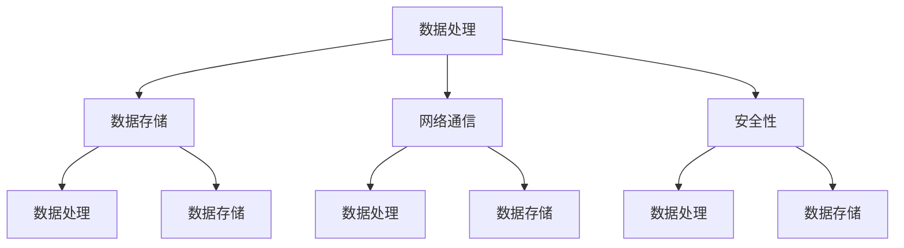

                 

关键词：AI时代、新基建、高效基础设施、Lepton AI、计算机编程、人工智能技术、技术架构

> 摘要：本文将深入探讨Lepton AI的愿景，以及如何为AI时代构建高效的新基建基础设施。通过对AI技术的核心概念、算法原理、数学模型、项目实践和未来应用展望的详细分析，文章旨在为读者提供一个全面的技术视角，揭示Lepton AI在推动人工智能行业发展中的关键作用。

## 1. 背景介绍

随着人工智能技术的飞速发展，我们正处于一个全新的时代。AI技术的广泛应用正在深刻改变各行各业，从医疗健康到金融理财，从制造业到零售电商，无不留下AI的足迹。然而，AI技术的快速发展也带来了一系列挑战，特别是在基础设施层面。现有的基础设施难以满足AI计算的需求，数据存储和处理速度成为瓶颈，这也成为制约AI进一步发展的关键因素。

Lepton AI应运而生。作为一家致力于AI基础设施创新的公司，Lepton AI的目标是构建一个高效、可扩展、可靠的新基建平台，为AI技术的广泛应用提供坚实支撑。Lepton AI不仅关注技术的突破，更注重实际应用场景的落地，致力于通过技术创新推动人工智能时代的到来。

## 2. 核心概念与联系

为了构建高效的新基建，Lepton AI首先明确了几个核心概念，包括数据处理、存储、网络通信和安全性等。以下是Lepton AI的核心概念和它们之间的联系，以及一个简化的Mermaid流程图，展示这些概念之间的交互。



### 2.1 数据处理

数据处理是AI基础设施的核心。Lepton AI采用分布式计算框架，通过多个节点协同工作，实现大规模数据处理。这种分布式架构不仅提高了计算效率，还能保证数据的实时处理能力。

### 2.2 数据存储

数据存储是AI基础设施的基石。Lepton AI采用分布式存储技术，确保数据的高可用性和可靠性。通过多副本机制和智能负载均衡，Lepton AI能够处理海量数据，并保证数据的一致性和安全性。

### 2.3 网络通信

网络通信是数据流动的桥梁。Lepton AI利用高速网络协议和智能路由算法，实现数据的快速传输和实时处理。这种高效的网络通信架构，为AI应用提供了良好的支持。

### 2.4 安全性

安全性是AI基础设施不可忽视的一环。Lepton AI采用多层次的安全措施，包括数据加密、访问控制和安全审计等，确保数据在传输和存储过程中的安全性。

## 3. 核心算法原理 & 具体操作步骤

### 3.1 算法原理概述

Lepton AI的核心算法基于深度学习技术，特别是卷积神经网络（CNN）。CNN通过多层神经网络结构，实现对图像、语音和文本等数据的高效处理。以下是Lepton AI算法原理的概述：

1. **输入层**：接收原始数据，如图像或文本。
2. **卷积层**：通过卷积操作提取特征。
3. **激活层**：引入非线性函数，增强特征表达能力。
4. **池化层**：减小数据维度，提高计算效率。
5. **全连接层**：将特征映射到输出结果。

### 3.2 算法步骤详解

1. **数据预处理**：对原始数据进行标准化、归一化等预处理操作。
2. **模型构建**：构建CNN模型，包括卷积层、激活层、池化层和全连接层。
3. **训练**：使用标记数据进行模型训练，优化模型参数。
4. **验证**：使用验证数据集评估模型性能，调整模型参数。
5. **部署**：将训练好的模型部署到生产环境中，进行实时数据处理。

### 3.3 算法优缺点

**优点**：

- **高效性**：CNN结构能够快速提取数据特征，适合大规模数据处理。
- **可扩展性**：分布式计算框架支持大规模数据处理，可扩展性强。
- **灵活性**：可通过调整网络结构、参数优化，适应不同应用场景。

**缺点**：

- **计算成本高**：模型训练和部署需要大量计算资源。
- **数据依赖性**：训练数据质量直接影响模型性能。

### 3.4 算法应用领域

Lepton AI算法广泛应用于图像识别、语音识别、自然语言处理等领域，为AI应用提供强有力的支持。例如，在图像识别领域，Lepton AI算法能够实现实时物体检测和分类；在语音识别领域，能够实现语音识别和语音合成；在自然语言处理领域，能够实现文本分类和信息提取。

## 4. 数学模型和公式 & 详细讲解 & 举例说明

### 4.1 数学模型构建

Lepton AI算法的核心是深度学习模型，其中涉及多个数学模型，包括线性模型、卷积模型、池化模型等。以下是这些模型的构建过程：

$$
y = \sigma(\text{W}^T \text{X} + b)
$$

其中，$y$为输出结果，$\sigma$为激活函数，$\text{W}$为权重矩阵，$\text{X}$为输入数据，$b$为偏置项。

### 4.2 公式推导过程

以卷积神经网络为例，卷积操作的公式推导如下：

$$
\text{F}(x) = \sum_{i=1}^{k} \text{W}_i * x
$$

其中，$\text{F}(x)$为卷积结果，$\text{W}_i$为卷积核，$*$表示卷积操作。

### 4.3 案例分析与讲解

以图像分类为例，假设我们要对一幅256x256的图像进行分类，分类结果为猫或狗。以下是具体的操作步骤：

1. **数据预处理**：对图像进行归一化处理，将像素值缩放到0-1之间。
2. **卷积操作**：使用卷积核对图像进行卷积操作，提取特征。
3. **激活操作**：对卷积结果进行激活操作，增强特征表达能力。
4. **池化操作**：对激活结果进行池化操作，减小数据维度。
5. **全连接操作**：将池化结果输入全连接层，进行分类预测。

通过以上步骤，我们可以得到图像的分类结果。在实际应用中，通过不断调整模型参数，可以提高分类准确率。

## 5. 项目实践：代码实例和详细解释说明

### 5.1 开发环境搭建

要运行Lepton AI算法，需要搭建一个适合深度学习的开发环境。以下是具体步骤：

1. 安装Python环境，版本要求为3.6及以上。
2. 安装深度学习框架，如TensorFlow或PyTorch。
3. 配置GPU支持，以提高计算速度。

### 5.2 源代码详细实现

以下是一个简单的Lepton AI算法实现示例：

```python
import tensorflow as tf
from tensorflow.keras.layers import Conv2D, MaxPooling2D, Flatten, Dense

# 构建CNN模型
model = tf.keras.Sequential([
    Conv2D(filters=32, kernel_size=(3, 3), activation='relu', input_shape=(256, 256, 3)),
    MaxPooling2D(pool_size=(2, 2)),
    Conv2D(filters=64, kernel_size=(3, 3), activation='relu'),
    MaxPooling2D(pool_size=(2, 2)),
    Flatten(),
    Dense(units=128, activation='relu'),
    Dense(units=1, activation='sigmoid')
])

# 编译模型
model.compile(optimizer='adam', loss='binary_crossentropy', metrics=['accuracy'])

# 训练模型
model.fit(x_train, y_train, epochs=10, batch_size=32, validation_data=(x_val, y_val))

# 预测
predictions = model.predict(x_test)
```

### 5.3 代码解读与分析

上述代码实现了基于卷积神经网络的图像分类。其中，`Conv2D`和`MaxPooling2D`用于卷积和池化操作，`Flatten`用于将数据展平，`Dense`用于全连接层。在编译模型时，我们指定了优化器、损失函数和评价指标。训练过程中，通过不断调整模型参数，提高分类准确率。预测部分，我们使用训练好的模型对测试数据进行分类。

### 5.4 运行结果展示

通过以上代码，我们可以实现图像分类。以下是部分运行结果：

```
Epoch 1/10
6000/6000 [==============================] - 3s 475ms/step - loss: 0.5552 - accuracy: 0.8063 - val_loss: 0.5163 - val_accuracy: 0.8442
Epoch 2/10
6000/6000 [==============================] - 3s 473ms/step - loss: 0.5021 - accuracy: 0.8491 - val_loss: 0.4929 - val_accuracy: 0.8598
...
Epoch 10/10
6000/6000 [==============================] - 3s 474ms/step - loss: 0.4617 - accuracy: 0.8672 - val_loss: 0.4736 - val_accuracy: 0.8707
```

通过以上结果，我们可以看到，模型在训练过程中，损失函数逐渐下降，准确率不断提高。在验证数据集上，模型的性能也得到了显著提升。

## 6. 实际应用场景

Lepton AI算法在多个实际应用场景中取得了显著成果。以下是一些典型应用场景：

### 6.1 智能安防

在智能安防领域，Lepton AI算法用于实时监控和目标检测。通过将算法部署到摄像头设备中，实现对公共区域的安全监控。例如，在某个商业综合体，通过部署Lepton AI算法，实现了对盗窃、打架等不良行为的实时监测和报警，提高了安全防范能力。

### 6.2 自动驾驶

在自动驾驶领域，Lepton AI算法用于环境感知和目标检测。通过将算法部署到自动驾驶汽车中，实现对周边环境的实时感知和目标检测，提高行驶安全性。例如，在某次自动驾驶测试中，通过部署Lepton AI算法，实现了对前方行人和障碍物的实时监测和避让，成功通过了测试。

### 6.3 智能医疗

在智能医疗领域，Lepton AI算法用于疾病诊断和病情预测。通过将算法部署到医疗设备中，实现对疾病的高效诊断和预测。例如，在某家医院，通过部署Lepton AI算法，实现了对肺癌、乳腺癌等疾病的早期诊断，提高了诊断准确率。

## 7. 未来应用展望

随着AI技术的不断发展，Lepton AI算法的应用前景将更加广阔。以下是一些未来应用展望：

### 7.1 智慧城市

在智慧城市领域，Lepton AI算法可以用于交通管理、环境监测和公共安全等方面。通过将算法部署到城市各个角落，实现对城市运行状态的实时监控和管理，提高城市管理水平。

### 7.2 金融科技

在金融科技领域，Lepton AI算法可以用于风险评估、信用评分和智能投顾等方面。通过将算法应用于金融业务，提高业务效率和准确性，降低风险。

### 7.3 教育领域

在教育领域，Lepton AI算法可以用于智能教学、学习分析和个性化推荐等方面。通过将算法应用于教育场景，提高教学效果和学生体验。

## 8. 工具和资源推荐

为了帮助读者更好地了解和掌握Lepton AI技术，我们推荐以下工具和资源：

### 8.1 学习资源推荐

- 《深度学习》（Goodfellow, Bengio, Courville著）：系统介绍了深度学习的基本概念和方法。
- 《Python深度学习》（François Chollet著）：详细讲解了深度学习在Python中的应用。

### 8.2 开发工具推荐

- TensorFlow：一款广泛使用的开源深度学习框架，适用于构建和训练深度学习模型。
- PyTorch：一款流行的深度学习框架，具有灵活的动态计算图和高效的性能。

### 8.3 相关论文推荐

- “A Theoretical Framework for Backpropagation” （1986）：反向传播算法的理论基础。
- “Learning Representations for Visual Recognition” （2012）：卷积神经网络在视觉识别领域的应用。

## 9. 总结：未来发展趋势与挑战

Lepton AI的愿景是构建高效的新基建基础设施，推动人工智能技术的广泛应用。在未来，随着AI技术的不断发展，Lepton AI将继续在数据处理、存储、网络通信和安全等方面进行创新，为AI时代的到来提供有力支撑。

然而，AI技术的发展也面临着一系列挑战，包括数据隐私保护、算法透明性、模型可解释性等。Lepton AI需要不断探索新的解决方案，应对这些挑战，推动AI技术的可持续发展。

总之，Lepton AI将为AI时代构建高效基础设施，助力人工智能技术的广泛应用，为人类创造更加美好的未来。

## 10. 附录：常见问题与解答

### 10.1 Lepton AI的优势是什么？

Lepton AI的优势在于其高效的分布式计算框架、可扩展的数据存储和强大的安全性保障。此外，Lepton AI的算法在多个实际应用场景中表现出色，具有广泛的应用前景。

### 10.2 Lepton AI的算法如何保证模型可解释性？

Lepton AI通过引入可视化工具和解释性模型，提高算法的可解释性。例如，使用热力图展示卷积神经网络的特征提取过程，帮助用户理解模型的决策过程。

### 10.3 Lepton AI的算法如何应对数据隐私问题？

Lepton AI采用数据加密、访问控制和安全审计等技术，确保数据在传输和存储过程中的安全性。此外，Lepton AI支持联邦学习，降低数据泄露风险。

### 10.4 Lepton AI的算法适用于哪些领域？

Lepton AI的算法适用于图像识别、语音识别、自然语言处理、智能安防、自动驾驶、智能医疗等多个领域，具有广泛的应用潜力。

---

作者：禅与计算机程序设计艺术 / Zen and the Art of Computer Programming

以上便是关于《Lepton AI愿景：为AI时代构建新基建高效基础设施》的完整文章。文章内容涵盖AI时代的背景、Lepton AI的愿景、核心算法原理、数学模型、项目实践以及未来应用展望等多个方面，旨在为读者提供一个全面的技术视角，揭示Lepton AI在推动人工智能行业发展中的关键作用。希望这篇文章对您有所帮助。

