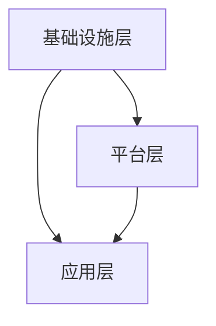

                 

关键词：Lepton AI、云计算、AI基础设施、深度整合、高效灵活、云资源利用

> 摘要：本文将探讨Lepton AI如何利用云计算的优势，通过深度整合云资源，打造出一个高效、灵活的AI基础设施。文章将详细介绍Lepton AI的架构、核心算法原理、数学模型和项目实践，以及其在实际应用场景中的优势与未来展望。

## 1. 背景介绍

随着人工智能（AI）技术的快速发展，AI基础设施的建设变得越来越重要。在传统的IT基础设施中，硬件和软件的集成相对固定，无法灵活适应不断变化的AI需求。而云计算的出现，为AI基础设施的建设提供了新的解决方案。云计算通过提供虚拟化资源、弹性扩展和高效管理，使得AI系统能够更加高效地运行。

Lepton AI作为一家专注于AI基础设施的公司，其核心目标是通过深度整合云资源，打造出一个高效、灵活的AI基础设施。本文将深入探讨Lepton AI的云计算优势，以及如何实现这一目标。

## 2. 核心概念与联系

### 2.1 云计算的基本概念

云计算是一种通过互联网按需访问计算资源的服务模式，这些资源可以是虚拟机、存储、网络和应用程序等。云计算的主要特点包括：

- **虚拟化**：通过虚拟化技术，将物理硬件资源抽象成虚拟资源，实现资源的高效利用。
- **弹性扩展**：根据需求自动增加或减少资源，确保系统的高可用性和高效性。
- **按需付费**：用户只需为实际使用的资源付费，无需担心资源的购买和维护成本。

### 2.2 AI基础设施的核心概念

AI基础设施是指支持AI系统运行的基础设施，包括硬件、软件和网络资源等。一个高效的AI基础设施应具备以下特点：

- **计算能力**：提供足够的计算资源，以支持复杂的AI算法和模型。
- **数据存储与管理**：确保数据的高效存储、管理和访问。
- **网络连接**：提供高速、稳定的网络连接，以确保数据的快速传输和处理。
- **可扩展性**：能够灵活地适应业务需求的变化，实现资源的弹性扩展。

### 2.3 Lepton AI的架构

Lepton AI的架构基于云计算和AI基础设施的核心概念，通过深度整合云资源，实现高效、灵活的AI基础设施。其架构主要包括以下三个层次：

1. **基础设施层**：提供虚拟化资源，包括虚拟机、存储和网络等。
2. **平台层**：提供AI算法和模型库，以及开发工具和框架，支持快速构建和部署AI应用。
3. **应用层**：提供具体的AI应用，如自然语言处理、计算机视觉和智能推荐等。

### 2.4 Mermaid流程图

下面是Lepton AI的架构流程图：



## 3. 核心算法原理 & 具体操作步骤

### 3.1 算法原理概述

Lepton AI的核心算法是基于深度学习技术，通过对大量数据的学习，自动提取特征，并利用这些特征进行分类、预测和决策。其算法原理主要包括以下几个步骤：

1. 数据预处理：对原始数据进行清洗、归一化和分割等处理。
2. 特征提取：利用神经网络等深度学习模型，自动提取数据中的有用特征。
3. 模型训练：使用提取到的特征，训练分类、预测或决策模型。
4. 模型评估：使用验证数据集，评估模型的性能。
5. 模型部署：将训练好的模型部署到生产环境中，进行实际应用。

### 3.2 算法步骤详解

下面是Lepton AI的核心算法步骤：

1. **数据预处理**：

   - 数据清洗：去除数据中的噪声和异常值。
   - 数据归一化：将不同量纲的数据转化为同一量纲。
   - 数据分割：将数据集分割为训练集、验证集和测试集。

2. **特征提取**：

   - 使用卷积神经网络（CNN）等深度学习模型，对图像、文本等数据进行特征提取。
   - 使用循环神经网络（RNN）等深度学习模型，对序列数据进行特征提取。

3. **模型训练**：

   - 使用提取到的特征，训练分类、预测或决策模型。
   - 使用反向传播算法，优化模型参数。

4. **模型评估**：

   - 使用验证集，评估模型的性能。
   - 根据评估结果，调整模型参数。

5. **模型部署**：

   - 将训练好的模型部署到生产环境中，进行实际应用。
   - 使用生产数据，持续优化模型。

### 3.3 算法优缺点

Lepton AI的核心算法具有以下优点：

- **高效性**：利用深度学习技术，自动提取特征，提高模型训练和预测的效率。
- **灵活性**：支持多种数据类型和任务类型，适用于各种场景。
- **可扩展性**：基于云计算架构，支持弹性扩展，适应不断变化的业务需求。

但是，核心算法也存在以下缺点：

- **计算资源消耗大**：深度学习模型训练需要大量的计算资源和时间。
- **数据质量要求高**：数据预处理和特征提取对数据质量有较高要求。

### 3.4 算法应用领域

Lepton AI的核心算法广泛应用于以下领域：

- **自然语言处理**：如文本分类、情感分析、机器翻译等。
- **计算机视觉**：如图像分类、目标检测、图像分割等。
- **智能推荐**：如商品推荐、内容推荐等。
- **金融风控**：如欺诈检测、信用评分等。

## 4. 数学模型和公式 & 详细讲解 & 举例说明

### 4.1 数学模型构建

Lepton AI的核心算法是基于深度学习技术，其数学模型主要包括以下几个部分：

1. **卷积神经网络（CNN）**：

   - 输入层：接收图像数据。
   - 卷积层：通过卷积操作提取图像特征。
   - 池化层：对特征进行下采样，减少数据维度。
   - 全连接层：对特征进行分类或预测。

2. **循环神经网络（RNN）**：

   - 输入层：接收序列数据。
   - 循环层：对序列数据进行处理，保存历史信息。
   - 全连接层：对处理后的序列数据进行分类或预测。

### 4.2 公式推导过程

下面以卷积神经网络（CNN）为例，介绍其数学模型公式推导过程：

1. **卷积操作**：

   - 输入层到卷积层的变换公式：
     $$h^{(l)} = \sigma(\mathbf{W}^{(l)} * \mathbf{a}^{(l-1)} + \mathbf{b}^{(l)})$$
     其中，$\mathbf{W}^{(l)}$为卷积核权重，$*$表示卷积操作，$\mathbf{a}^{(l-1)}$为上一层的激活值，$\mathbf{b}^{(l)}$为偏置项，$\sigma$为激活函数。

2. **下采样操作**：

   - 池化层的变换公式：
     $$p_{ij} = \frac{1}{c}\sum_{k=1}^{c}a_{ijk}$$
     其中，$p_{ij}$为池化后的特征值，$a_{ijk}$为卷积层输出的特征值，$c$为池化窗口大小。

3. **全连接层**：

   - 全连接层的变换公式：
     $$\mathbf{z}^{(L)} = \mathbf{W}^{(L)}\mathbf{a}^{(L-1)} + \mathbf{b}^{(L)}$$
     其中，$\mathbf{z}^{(L)}$为全连接层的输出，$\mathbf{W}^{(L)}$为权重矩阵，$\mathbf{a}^{(L-1)}$为上一层的激活值，$\mathbf{b}^{(L)}$为偏置项。

### 4.3 案例分析与讲解

以图像分类任务为例，假设输入图像为 $32 \times 32$ 的像素矩阵，使用一个卷积神经网络（CNN）进行分类。以下是具体步骤和讲解：

1. **数据预处理**：

   - 将图像数据缩放到 $32 \times 32$ 大小，并转换为灰度图像。
   - 对图像数据进行归一化处理，使其均值为0，标准差为1。

2. **卷积层**：

   - 使用一个 $3 \times 3$ 的卷积核，对输入图像进行卷积操作。
   - 激活函数使用ReLU（Rectified Linear Unit）函数。

3. **池化层**：

   - 使用 $2 \times 2$ 的最大池化窗口，对卷积层的输出进行下采样。

4. **全连接层**：

   - 将池化层的输出reshape为 $1 \times 1$ 的矩阵。
   - 使用一个 $10$ 维的权重矩阵，对reshape后的输出进行全连接操作。
   - 激活函数使用Softmax函数，输出每个类别的概率。

5. **模型评估**：

   - 使用验证集，评估模型的分类准确率。
   - 根据评估结果，调整模型参数。

## 5. 项目实践：代码实例和详细解释说明

### 5.1 开发环境搭建

为了实现Lepton AI的核心算法，我们需要搭建一个合适的开发环境。以下是开发环境的搭建步骤：

1. **安装Python环境**：在操作系统上安装Python，并配置Python环境变量。
2. **安装深度学习框架**：安装TensorFlow或PyTorch等深度学习框架。
3. **安装其他依赖库**：安装Numpy、Pandas等常用Python库。

### 5.2 源代码详细实现

以下是Lepton AI的核心算法实现代码：

```python
import tensorflow as tf
from tensorflow.keras.models import Sequential
from tensorflow.keras.layers import Conv2D, MaxPooling2D, Dense, Flatten, Activation

# 创建卷积神经网络模型
model = Sequential()

# 添加卷积层
model.add(Conv2D(32, (3, 3), activation='relu', input_shape=(32, 32, 1)))
model.add(MaxPooling2D((2, 2)))

# 添加全连接层
model.add(Flatten())
model.add(Dense(10, activation='softmax'))

# 编译模型
model.compile(optimizer='adam', loss='categorical_crossentropy', metrics=['accuracy'])

# 加载训练数据
(x_train, y_train), (x_test, y_test) = tf.keras.datasets.mnist.load_data()

# 数据预处理
x_train = x_train / 255.0
x_test = x_test / 255.0

# 将标签转换为one-hot编码
y_train = tf.keras.utils.to_categorical(y_train, num_classes=10)
y_test = tf.keras.utils.to_categorical(y_test, num_classes=10)

# 训练模型
model.fit(x_train, y_train, epochs=10, batch_size=32, validation_split=0.2)

# 评估模型
model.evaluate(x_test, y_test)
```

### 5.3 代码解读与分析

上述代码实现了Lepton AI的核心算法，具体解读如下：

1. **导入模块**：导入TensorFlow和Keras模块，以及其他常用Python库。
2. **创建模型**：使用Sequential模型创建一个卷积神经网络模型。
3. **添加层**：添加卷积层、池化层和全连接层。
4. **编译模型**：编译模型，指定优化器、损失函数和评价指标。
5. **加载数据**：加载MNIST数据集，并进行数据预处理。
6. **训练模型**：使用训练数据训练模型，设置训练周期和批量大小。
7. **评估模型**：使用测试数据评估模型性能。

## 6. 实际应用场景

Lepton AI的云计算优势在多个实际应用场景中得到了充分体现：

1. **自然语言处理**：通过云计算提供的强大计算资源，Lepton AI能够处理大规模的文本数据，实现高效的文本分类、情感分析和机器翻译等任务。
2. **计算机视觉**：云计算的高性能计算和大规模存储能力，使得Lepton AI能够处理高分辨率的图像和视频数据，实现高效的目标检测、图像分割和视频分析等任务。
3. **智能推荐**：云计算的弹性扩展能力，使得Lepton AI能够根据用户的兴趣和行为数据，实时更新推荐算法，实现个性化的商品推荐、内容推荐等任务。
4. **金融风控**：云计算的安全性和可靠性，使得Lepton AI能够处理大量的金融数据，实现高效的欺诈检测、信用评分等任务。

## 7. 未来应用展望

随着人工智能技术的不断进步，Lepton AI的云计算优势将进一步发挥。未来，Lepton AI将在以下领域展现更大的应用潜力：

1. **智能医疗**：利用云计算的高性能计算和大数据分析能力，实现精准医疗、药物研发和智能诊断等任务。
2. **智能制造**：通过云计算提供的物联网连接和数据存储能力，实现智能工厂、智能物流和智能制造等任务。
3. **智慧城市**：利用云计算的实时数据处理和分析能力，实现智能交通、智能安防和智能环保等任务。
4. **智能驾驶**：利用云计算的实时数据传输和处理能力，实现自动驾驶、车联网和智能交通等任务。

## 8. 工具和资源推荐

为了更好地了解Lepton AI和云计算的优势，以下是一些推荐的学习资源和开发工具：

### 8.1 学习资源推荐

- 《深度学习》（Goodfellow et al.）：介绍深度学习的基础理论和应用。
- 《Python深度学习》（François Chollet）：介绍如何使用Python和深度学习框架实现各种深度学习任务。
- 《云计算基础》（Jim Melton）：介绍云计算的基本概念和技术。

### 8.2 开发工具推荐

- TensorFlow：Google开发的深度学习框架，适用于各种深度学习任务。
- PyTorch：Facebook开发的深度学习框架，具有高度的灵活性和易用性。
- AWS：Amazon提供的云计算平台，提供丰富的云计算服务和工具。

### 8.3 相关论文推荐

- "Deep Learning for Natural Language Processing"（Yeon et al.，2014）：介绍深度学习在自然语言处理领域的应用。
- "Convolutional Neural Networks for Visual Recognition"（Simonyan and Zisserman，2014）：介绍卷积神经网络在计算机视觉领域的应用。
- "Recurrent Neural Networks for Language Modeling"（Lau et al.，2017）：介绍循环神经网络在自然语言处理领域的应用。

## 9. 总结：未来发展趋势与挑战

Lepton AI通过深度整合云资源，打造了一个高效、灵活的AI基础设施，展现了强大的云计算优势。未来，随着人工智能技术的不断进步，Lepton AI将在更多领域展现更大的应用潜力。

然而，Lepton AI也面临着一些挑战，如：

1. **数据隐私和安全**：随着数据处理量的增加，数据隐私和安全问题日益突出，如何保护用户数据的安全成为一个重要挑战。
2. **计算资源需求**：深度学习模型训练需要大量的计算资源，如何优化计算资源利用，降低计算成本是一个重要挑战。
3. **模型解释性**：深度学习模型的黑箱特性使得其解释性较差，如何提高模型的解释性，使得模型更加透明和可信是一个重要挑战。

总之，Lepton AI在云计算优势的基础上，通过不断的技术创新和优化，有望在未来的AI领域中取得更大的突破。

## 10. 附录：常见问题与解答

### 10.1 Lepton AI是什么？

Lepton AI是一家专注于AI基础设施的公司，通过深度整合云资源，提供高效、灵活的AI解决方案。

### 10.2 Lepton AI的核心优势是什么？

Lepton AI的核心优势在于其高效的计算能力和灵活的资源管理，能够快速响应业务需求的变化。

### 10.3 Lepton AI适用于哪些场景？

Lepton AI适用于自然语言处理、计算机视觉、智能推荐和金融风控等多个领域。

### 10.4 Lepton AI如何保障数据安全和隐私？

Lepton AI采用多种安全措施，包括数据加密、访问控制和隐私保护等，确保用户数据的安全和隐私。

### 10.5 如何获取Lepton AI的产品和服务？

可以通过Lepton AI的官方网站或联系客服了解和获取Lepton AI的产品和服务。

---

### 作者署名

本文作者：禅与计算机程序设计艺术 / Zen and the Art of Computer Programming

