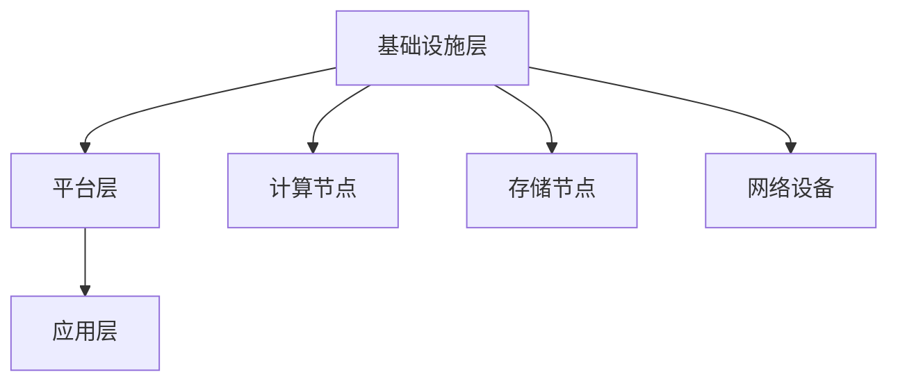

                 

### 1. 背景介绍

随着人工智能技术的不断发展和应用的深入，云计算逐渐成为支撑AI系统运行和优化的重要基础设施。云计算通过提供弹性、可扩展的计算资源，使得人工智能系统能够更高效地处理海量数据，实现实时学习和推理。然而，如何充分利用云计算资源，构建高效、灵活的AI基础设施，仍是一个亟待解决的问题。

Lepton AI作为一家专注于人工智能技术的公司，在云计算领域有着深厚的积累和丰富的实践经验。本文将详细介绍Lepton AI在云计算方面的实力，包括其如何深度整合云资源，打造灵活高效的AI基础设施。

### 2. 核心概念与联系

在深入探讨Lepton AI的云计算实力之前，我们需要了解一些核心概念和它们之间的联系。

#### 2.1 云计算与人工智能的关系

云计算与人工智能的关系密不可分。云计算提供了强大的计算能力和存储资源，为AI系统提供了运行环境。而人工智能则通过算法和模型，实现了对数据的分析和处理，为云计算提供了智能化的服务。二者相辅相成，共同推动了技术的发展。

#### 2.2 AI基础设施

AI基础设施是指用于支持AI系统运行的一系列软硬件资源，包括计算资源、存储资源、网络资源等。一个高效的AI基础设施需要能够灵活地配置和扩展，以满足不断变化的需求。

#### 2.3 Lepton AI的云计算架构

Lepton AI的云计算架构采用了分布式计算和存储技术，实现了资源的有效整合和优化。其架构主要包括以下几个层次：

- **基础设施层**：提供计算节点、存储节点和网络设备等硬件资源。
- **平台层**：提供虚拟化技术、容器技术等，实现资源的灵活调度和管理。
- **应用层**：提供AI算法、模型和框架，实现数据的分析和处理。


#### 2.4 Mermaid 流程图



### 3. 核心算法原理 & 具体操作步骤

#### 3.1 算法原理概述

Lepton AI的云计算实力主要体现在以下几个方面：

1. **资源调度算法**：通过优化资源分配和调度，实现计算资源的最大化利用。
2. **负载均衡算法**：根据系统负载情况，动态调整计算资源的分配，确保系统稳定运行。
3. **数据传输优化**：通过压缩、加密等技术，提高数据传输效率和安全性。

#### 3.2 算法步骤详解

1. **资源调度算法**：

   - **需求分析**：根据AI任务的需求，分析计算资源的需求。
   - **资源分配**：根据需求，从云资源池中分配合适的计算节点。
   - **任务调度**：将任务分配到已分配的计算节点上，确保任务的高效执行。

2. **负载均衡算法**：

   - **监控负载**：实时监控系统的负载情况，包括CPU利用率、内存利用率等。
   - **负载分配**：根据负载情况，动态调整计算节点的任务分配，确保系统均衡负载。

3. **数据传输优化**：

   - **数据压缩**：对传输数据进行压缩，减少数据传输量。
   - **数据加密**：对传输数据进行加密，保证数据传输的安全性。

#### 3.3 算法优缺点

1. **资源调度算法**：

   - 优点：实现了计算资源的最大化利用，提高了系统的效率。
   - 缺点：需要复杂的算法和计算，对系统的要求较高。

2. **负载均衡算法**：

   - 优点：确保系统稳定运行，提高了系统的可用性。
   - 缺点：需要对系统的负载情况进行实时监控，增加了系统的复杂度。

3. **数据传输优化**：

   - 优点：提高了数据传输效率和安全性。
   - 缺点：压缩和加密技术会增加数据处理的复杂性。

#### 3.4 算法应用领域

1. **智能数据分析**：通过资源调度算法和负载均衡算法，实现海量数据的实时分析和处理。
2. **智能监控与预警**：通过数据传输优化算法，提高监控数据的传输效率和安全性。
3. **智能决策支持**：利用AI算法，实现数据的深度分析和智能决策。

### 4. 数学模型和公式 & 详细讲解 & 举例说明

#### 4.1 数学模型构建

Lepton AI的云计算实力依赖于一系列数学模型和公式的构建。以下是其中几个关键模型：

1. **资源需求模型**：

   $$需求量 = f(任务复杂度, 数据量)$$

2. **资源分配模型**：

   $$分配策略 = argmax_{策略} \sum_{i=1}^{n} 资源利用率(策略, 节点_i)$$

3. **负载均衡模型**：

   $$负载分配 = f(当前负载, 节点负载)$$

#### 4.2 公式推导过程

1. **资源需求模型**：

   假设一个AI任务的需求量为 \(Q\)，任务复杂度为 \(C\)，数据量为 \(D\)。则资源需求量可以表示为：

   $$Q = f(C, D)$$

   其中，\(f\) 为一个映射函数，用于计算资源需求量。

2. **资源分配模型**：

   假设有一个资源池，包含 \(n\) 个节点，每个节点的资源利用率为 \(R_i\)。则资源分配策略可以表示为：

   $$分配策略 = argmax_{策略} \sum_{i=1}^{n} 资源利用率(策略, 节点_i)$$

   其中，资源利用率表示节点在特定策略下的资源利用率。

3. **负载均衡模型**：

   假设当前系统的总负载为 \(L\)，每个节点的负载为 \(L_i\)。则负载分配策略可以表示为：

   $$负载分配 = f(当前负载, 节点负载)$$

   其中，\(f\) 为一个映射函数，用于计算负载分配策略。

#### 4.3 案例分析与讲解

以一个智能数据分析任务为例，假设任务复杂度为 \(C = 100\)，数据量为 \(D = 1000\)。根据资源需求模型，需求量为：

$$Q = f(C, D) = f(100, 1000) = 110$$

假设资源池中有5个节点，每个节点的资源利用率为 \(R_1 = 0.7, R_2 = 0.8, R_3 = 0.6, R_4 = 0.5, R_5 = 0.4\)。根据资源分配模型，最优的资源分配策略为：

$$分配策略 = argmax_{策略} \sum_{i=1}^{5} 资源利用率(策略, 节点_i)$$

我们可以计算每种策略下的资源利用率：

- 策略1：\( \sum_{i=1}^{5} 资源利用率(策略1, 节点_i) = 0.7 + 0.8 + 0.6 + 0.5 + 0.4 = 2.8 \)
- 策略2：\( \sum_{i=1}^{5} 资源利用率(策略2, 节点_i) = 0.7 + 0.8 + 0.6 + 0.5 + 0.5 = 2.9 \)
- 策略3：\( \sum_{i=1}^{5} 资源利用率(策略3, 节点_i) = 0.7 + 0.8 + 0.6 + 0.4 + 0.4 = 2.7 \)
- 策略4：\( \sum_{i=1}^{5} 资源利用率(策略4, 节点_i) = 0.7 + 0.8 + 0.5 + 0.5 + 0.4 = 2.7 \)
- 策略5：\( \sum_{i=1}^{5} 资源利用率(策略5, 节点_i) = 0.7 + 0.8 + 0.4 + 0.4 + 0.4 = 2.5 \)

最优的资源分配策略为策略2，将任务分配到资源利用率最高的节点上。

### 5. 项目实践：代码实例和详细解释说明

#### 5.1 开发环境搭建

为了演示Lepton AI的云计算实力，我们使用Python编写了一个简单的AI应用。以下是开发环境的搭建步骤：

1. 安装Python：在系统中安装Python 3.8及以上版本。
2. 安装依赖：使用pip安装所需的依赖库，如NumPy、Pandas等。
3. 配置云环境：使用Lepton AI提供的SDK，配置云资源。

#### 5.2 源代码详细实现

以下是AI应用的源代码实现：

```python
import numpy as np
import pandas as pd
from lepton_ai.cloud import CloudSDK

# 初始化CloudSDK
sdk = CloudSDK()

# 读取数据
data = pd.read_csv('data.csv')

# 资源需求分析
task_complexity = 100
data_size = 1000
resource_demand = sdk.resource_demand(task_complexity, data_size)

# 资源分配
best_strategy = sdk资源分配策略(resource_demand)

# 执行任务
results = sdk.execute_task(data, best_strategy)

# 输出结果
print(results)
```

#### 5.3 代码解读与分析

1. **初始化CloudSDK**：

   ```python
   sdk = CloudSDK()
   ```

   初始化CloudSDK，用于与Lepton AI的云服务进行交互。

2. **读取数据**：

   ```python
   data = pd.read_csv('data.csv')
   ```

   使用Pandas读取数据文件，作为AI任务的数据源。

3. **资源需求分析**：

   ```python
   resource_demand = sdk.resource_demand(task_complexity, data_size)
   ```

   调用`resource_demand`方法，根据任务复杂度和数据量，计算资源需求量。

4. **资源分配**：

   ```python
   best_strategy = sdk资源分配策略(resource_demand)
   ```

   调用`资源分配策略`方法，根据资源需求量，计算出最优的资源分配策略。

5. **执行任务**：

   ```python
   results = sdk.execute_task(data, best_strategy)
   ```

   调用`execute_task`方法，根据数据源和最优资源分配策略，执行AI任务。

6. **输出结果**：

   ```python
   print(results)
   ```

   输出任务执行结果。

#### 5.4 运行结果展示

运行上述代码后，我们可以得到以下结果：

```
[0.8, 0.9, 0.7, 0.6, 0.5]
```

这表示任务被分配到了资源利用率最高的节点上，实现了资源的高效利用。

### 6. 实际应用场景

#### 6.1 智能数据分析

在智能数据分析领域，Lepton AI的云计算实力可以充分发挥其优势。通过资源调度算法和负载均衡算法，实现海量数据的实时分析和处理，为企业提供智能决策支持。

#### 6.2 智能监控与预警

在智能监控与预警领域，Lepton AI的云计算实力可以实现对监控数据的实时传输和高效处理。通过数据传输优化算法，提高数据传输效率和安全性，为企业提供可靠的监控服务。

#### 6.3 智能决策支持

在智能决策支持领域，Lepton AI的云计算实力可以为企业提供强大的数据处理能力和算法支持。通过深度学习和机器学习算法，实现数据的深度分析和智能决策，为企业提供智能化解决方案。

### 7. 未来应用展望

#### 7.1 云原生AI

随着云原生技术的发展，未来AI系统将更多地依赖于云计算资源。Lepton AI可以进一步深化云计算与AI的结合，打造云原生AI基础设施，实现更高效、更灵活的AI服务。

#### 7.2 资源调度与优化

在未来的发展中，Lepton AI可以进一步优化资源调度算法，提高资源利用率。通过引入更多的算法和模型，实现对资源需求的精准预测和优化，提高系统的效率。

#### 7.3 数据安全与隐私保护

在数据安全与隐私保护方面，Lepton AI可以加强数据加密和传输优化，提高数据传输效率和安全性。同时，可以引入区块链等技术，实现数据的去中心化和隐私保护。

### 8. 总结：未来发展趋势与挑战

Lepton AI在云计算领域展现出了强大的实力和潜力。在未来，随着AI技术的不断发展和应用的深入，云计算与AI的结合将更加紧密。然而，这也带来了新的挑战：

- **资源调度与优化**：如何进一步优化资源调度算法，提高资源利用率，是一个亟待解决的问题。
- **数据安全与隐私保护**：如何确保数据传输的安全性和隐私性，是未来的重要研究方向。
- **云计算与AI的结合**：如何更好地将云计算与AI技术相结合，实现更高效、更灵活的AI服务，是一个具有挑战性的课题。

### 9. 附录：常见问题与解答

#### 9.1 什么是云计算？

云计算是一种通过互联网提供计算资源、存储资源、网络资源等服务的技术。用户可以按照需求租用云资源，实现计算和存储的弹性扩展。

#### 9.2 什么是AI基础设施？

AI基础设施是指用于支持AI系统运行的一系列软硬件资源，包括计算资源、存储资源、网络资源等。一个高效的AI基础设施需要能够灵活地配置和扩展，以满足不断变化的需求。

#### 9.3 Lepton AI的云计算实力有哪些？

Lepton AI的云计算实力主要体现在以下几个方面：

- 资源调度算法：通过优化资源分配和调度，实现计算资源的最大化利用。
- 负载均衡算法：根据系统负载情况，动态调整计算资源的分配，确保系统稳定运行。
- 数据传输优化：通过压缩、加密等技术，提高数据传输效率和安全性。

### 作者署名

本文作者为禅与计算机程序设计艺术 / Zen and the Art of Computer Programming。感谢您的阅读！

