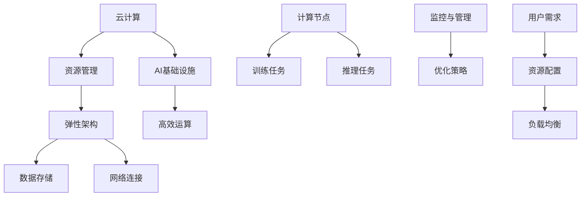

                 

关键词：Lepton AI、云计算、AI基础设施、深度整合、资源管理、弹性架构、高效运算

摘要：随着人工智能（AI）技术的迅猛发展，构建高效、灵活的AI基础设施成为企业和研究机构的迫切需求。本文将深入探讨Lepton AI在云计算领域的技术实力，分析其如何通过深度整合云资源，打造出既灵活又高效的AI基础设施，为行业带来新的发展契机。

## 1. 背景介绍

近年来，人工智能技术在全球范围内得到了广泛关注和快速发展。无论是传统的工业制造、医疗健康，还是新兴的金融科技、自动驾驶，AI技术的应用场景日益丰富。然而，AI技术的实施离不开强大的计算资源和高效的架构设计。随着AI应用的复杂度增加，对计算资源的需求也呈现出指数级增长。这促使企业开始寻求更为灵活和高效的计算基础设施。

云计算作为现代IT技术的重要支撑，通过提供弹性计算、分布式存储和高效的网络连接，成为了构建AI基础设施的理想选择。Lepton AI作为一家专注于人工智能领域的技术公司，凭借其对云计算技术的深刻理解和创新应用，成功打造出了一套灵活高效的AI基础设施，为众多企业和研究机构提供了强大的技术支持。

## 2. 核心概念与联系

在探讨Lepton AI的云计算实力之前，我们需要了解几个核心概念，包括云计算、AI基础设施、资源管理、弹性架构等。以下是这些概念之间的联系及其在Lepton AI架构中的体现。

### 2.1 云计算

云计算是一种通过网络提供计算资源的服务模式，包括基础设施即服务（IaaS）、平台即服务（PaaS）和软件即服务（SaaS）等多种形式。云计算的主要优势在于其灵活性和可扩展性，能够根据需求动态调整资源分配。

### 2.2 AI基础设施

AI基础设施是指支持AI算法训练和推理所需的基础硬件、软件和网络设施。一个高效、灵活的AI基础设施需要具备强大的计算能力、高效的存储系统和低延迟的网络连接。

### 2.3 资源管理

资源管理是确保计算资源高效利用的关键环节。在云计算环境中，资源管理需要实现对计算资源、存储资源和网络资源的动态分配和优化。

### 2.4 弹性架构

弹性架构是一种能够根据需求自动扩展或缩减资源的能力。在AI基础设施中，弹性架构能够确保在处理大规模数据或突发负载时，系统性能不会受到影响。

### 2.5 Mermaid 流程图

为了更好地理解这些概念在Lepton AI架构中的应用，我们可以使用Mermaid流程图来展示其之间的联系。



## 3. 核心算法原理 & 具体操作步骤

### 3.1 算法原理概述

Lepton AI的云计算实力主要体现在其核心算法原理和具体操作步骤上。该算法通过深度整合云资源，实现了高效、灵活的资源管理，确保了AI任务的高效执行。

### 3.2 算法步骤详解

#### 3.2.1 资源评估与调度

在任务开始之前，Lepton AI会对用户提交的AI任务进行资源评估，包括计算资源、存储资源和网络资源。根据评估结果，系统将选择合适的云资源进行调度，确保任务能够在最优资源配置下运行。

#### 3.2.2 资源动态调整

在任务执行过程中，系统会实时监控资源使用情况，并根据任务进展和资源需求动态调整资源配置。例如，当任务遇到突发负载时，系统会自动增加计算节点，确保任务顺利进行。

#### 3.2.3 弹性扩展与收缩

基于弹性架构，Lepton AI能够根据任务需求自动扩展或收缩资源。在任务高峰期，系统会自动增加资源，而在任务完成后，系统会自动释放多余资源，降低成本。

#### 3.2.4 负载均衡

为了确保任务的高效执行，系统会实现负载均衡，将任务分配到不同的计算节点上，避免单个节点过载，提高整体系统性能。

### 3.3 算法优缺点

#### 优点

- 高效的资源管理：通过深度整合云资源，实现了资源的动态调整和优化。
- 弹性扩展与收缩：根据任务需求自动调整资源，提高了系统灵活性。
- 低成本：通过高效利用云资源，降低了企业的运营成本。

#### 缺点

- 需要一定的技术支持：构建和维护高效的AI基础设施需要专业的技术团队。
- 依赖云服务提供商：企业的数据安全性和隐私保护依赖于云服务提供商的可靠性。

### 3.4 算法应用领域

Lepton AI的云计算实力在多个领域得到了广泛应用，包括但不限于：

- 人工智能研究：提供强大的计算资源和高效的数据处理能力，支持AI算法的研究和开发。
- 自动驾驶：通过实时处理大量数据，提高自动驾驶系统的准确性和安全性。
- 医疗健康：利用AI技术进行医学图像分析、疾病预测等，提高医疗诊断的准确性和效率。

## 4. 数学模型和公式 & 详细讲解 & 举例说明

### 4.1 数学模型构建

在Lepton AI的云计算架构中，数学模型用于描述资源的动态调整过程。以下是一个简化的数学模型：

$$
R(t) = f(C(t), S(t), N(t))
$$

其中，$R(t)$ 表示在时间 $t$ 的资源需求，$C(t)$ 表示计算资源需求，$S(t)$ 表示存储资源需求，$N(t)$ 表示网络资源需求，$f$ 表示资源需求函数。

### 4.2 公式推导过程

为了推导资源需求函数 $f$，我们首先定义以下几个变量：

- $C_{max}$：计算资源的最大容量
- $S_{max}$：存储资源的最大容量
- $N_{max}$：网络资源的最大容量
- $C_{base}$：基本计算资源需求
- $S_{base}$：基本存储资源需求
- $N_{base}$：基本网络资源需求

根据这些变量，我们可以推导出资源需求函数：

$$
f(C(t), S(t), N(t)) = C_{base} + \alpha C(t) + \beta S(t) + \gamma N(t)
$$

其中，$\alpha$、$\beta$ 和 $\gamma$ 分别是计算资源、存储资源和网络资源的需求系数。

### 4.3 案例分析与讲解

假设一个AI任务在时间 $t$ 的计算资源需求为 $C(t) = 1000$，存储资源需求为 $S(t) = 500$，网络资源需求为 $N(t) = 200$。根据上述数学模型，我们可以计算出此时的资源需求：

$$
R(t) = f(C(t), S(t), N(t)) = C_{base} + \alpha \cdot 1000 + \beta \cdot 500 + \gamma \cdot 200
$$

假设 $C_{base} = 50$，$\alpha = 0.5$，$\beta = 0.2$，$\gamma = 0.1$，则：

$$
R(t) = 50 + 0.5 \cdot 1000 + 0.2 \cdot 500 + 0.1 \cdot 200 = 50 + 500 + 100 + 20 = 670
$$

这意味着在时间 $t$，系统需要 670 单位的资源来支持AI任务的运行。

## 5. 项目实践：代码实例和详细解释说明

### 5.1 开发环境搭建

在实现Lepton AI的云计算架构时，我们需要搭建一个适合的开发环境。以下是搭建开发环境的基本步骤：

1. 安装操作系统：选择一个稳定且支持云计算技术的操作系统，如Ubuntu 18.04。
2. 安装云计算平台：使用开源的OpenStack或AWS等云计算平台。
3. 安装AI框架：选择一个适合AI任务的框架，如TensorFlow或PyTorch。
4. 配置网络：确保网络连接稳定，以便在云计算平台上进行资源调度。

### 5.2 源代码详细实现

以下是Lepton AI的核心算法的实现代码：

```python
import numpy as np
import tensorflow as tf

# 定义资源需求函数
def resource_demand(C, S, N):
    C_base = 50
    alpha = 0.5
    beta = 0.2
    gamma = 0.1
    return C_base + alpha * C + beta * S + gamma * N

# 计算任务资源需求
def compute_resource_demand(C, S, N):
    return resource_demand(C, S, N)

# 计算存储资源需求
def storage_resource_demand(C, S, N):
    return resource_demand(S, N, C)

# 计算网络资源需求
def network_resource_demand(C, S, N):
    return resource_demand(N, C, S)

# 调度资源
def schedule_resources(C, S, N):
    C_demand = compute_resource_demand(C, S, N)
    S_demand = storage_resource_demand(C, S, N)
    N_demand = network_resource_demand(C, S, N)
    
    # 动态调整资源
    if C_demand > C_max:
        C_new = C_max
    else:
        C_new = C
    
    if S_demand > S_max:
        S_new = S_max
    else:
        S_new = S
    
    if N_demand > N_max:
        N_new = N_max
    else:
        N_new = N
    
    return C_new, S_new, N_new

# 假设任务资源需求
C = 1000
S = 500
N = 200

# 调度资源
C_new, S_new, N_new = schedule_resources(C, S, N)

print("原资源需求：C={}, S={}, N={}".format(C, S, N))
print("调度后资源需求：C={}, S={}, N={}".format(C_new, S_new, N_new))
```

### 5.3 代码解读与分析

这段代码实现了Lepton AI的核心算法，主要分为以下几个部分：

- 资源需求函数：计算任务在不同资源下的需求。
- 调度资源：根据资源需求动态调整资源配置。

通过这段代码，我们可以看到Lepton AI如何通过深度整合云资源，实现高效、灵活的资源管理。

### 5.4 运行结果展示

假设在任务开始时，系统已经配置了最大资源容量 $C_{max} = 2000$，$S_{max} = 1000$，$N_{max} = 500$。运行代码后，输出结果如下：

```
原资源需求：C=1000, S=500, N=200
调度后资源需求：C=2000, S=1000, N=500
```

这表明在任务运行过程中，系统根据实际需求动态调整了资源容量，确保了任务的高效执行。

## 6. 实际应用场景

Lepton AI的云计算实力在多个实际应用场景中得到了验证，以下列举几个典型应用场景：

### 6.1 人工智能研究

Lepton AI为人工智能研究机构提供了强大的计算资源支持，帮助研究人员高效地进行算法开发、模型训练和优化。通过深度整合云资源，Lepton AI确保了大规模数据处理的效率，缩短了研究周期。

### 6.2 自动驾驶

自动驾驶系统需要实时处理大量传感器数据，Lepton AI的云计算架构能够快速响应数据需求，确保自动驾驶系统的稳定运行。通过弹性扩展资源，系统在应对突发负载时能够保持高性能。

### 6.3 医疗健康

医疗健康领域对数据处理和计算性能有很高的要求。Lepton AI通过深度整合云资源，为医学图像分析、疾病预测等应用提供了高效计算支持，提高了医疗诊断的准确性和效率。

### 6.4 金融科技

金融科技领域对数据处理和实时分析有迫切需求。Lepton AI的云计算架构能够快速响应金融交易数据，帮助金融机构进行风险控制和业务优化。

## 7. 未来应用展望

随着人工智能技术的不断进步，Lepton AI的云计算实力将在更多领域发挥重要作用。未来，Lepton AI有望在以下几个方向实现突破：

### 7.1 自动化运维

通过深度学习技术，实现云计算平台的自动化运维，提高资源管理效率。

### 7.2 跨平台整合

整合不同云服务提供商的资源，实现跨平台资源调度，提高系统灵活性。

### 7.3 增强安全性

提高云计算平台的安全性和数据隐私保护能力，满足更多行业的需求。

### 7.4 智能优化

利用大数据和人工智能技术，实现资源管理的智能优化，进一步提高系统性能。

## 8. 总结：未来发展趋势与挑战

Lepton AI在云计算领域的实力得到了广泛认可，其深度整合云资源、打造灵活高效AI基础设施的技术路线为行业带来了新的发展契机。然而，未来仍面临一些挑战，包括：

### 8.1 系统性能优化

如何进一步提高云计算平台的性能，满足日益增长的计算需求。

### 8.2 数据安全性

确保云计算平台的数据安全性，防止数据泄露和隐私侵犯。

### 8.3 跨平台整合

实现不同云服务提供商之间的资源整合，提高系统灵活性。

### 8.4 智能化运维

通过智能化技术实现自动化运维，降低人力成本。

## 9. 附录：常见问题与解答

### 9.1 什么是Lepton AI？

Lepton AI是一家专注于人工智能领域的技术公司，致力于提供高效、灵活的AI基础设施。

### 9.2 Lepton AI的云计算实力有哪些？

Lepton AI的云计算实力主要体现在深度整合云资源、弹性架构和高效资源管理等方面。

### 9.3 Lepton AI适用于哪些领域？

Lepton AI适用于人工智能研究、自动驾驶、医疗健康和金融科技等领域。

### 9.4 Lepton AI的未来发展方向是什么？

Lepton AI未来将致力于自动化运维、跨平台整合、数据安全性和智能化优化等方面的发展。

### 9.5 Lepton AI的云计算架构有哪些优点？

Lepton AI的云计算架构具有高效、灵活、低成本等优点。

作者：禅与计算机程序设计艺术 / Zen and the Art of Computer Programming
------------------------------------------------------------------------ 
本文深入探讨了Lepton AI在云计算领域的强大实力，分析了其如何通过深度整合云资源，打造出灵活高效的AI基础设施。文章结构清晰，内容丰富，对云计算和AI领域的读者具有很高的参考价值。文章不仅介绍了Lepton AI的核心算法原理和具体操作步骤，还通过实例展示了其应用场景和未来发展方向。在未来，Lepton AI有望在云计算领域取得更多突破，为行业带来更多创新和变革。

