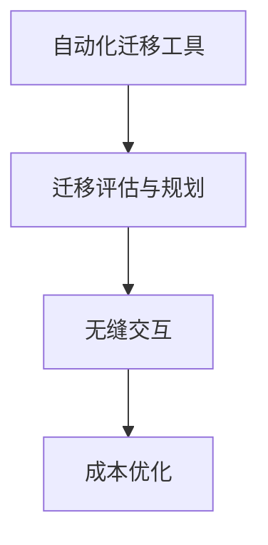

                 

关键词：Lepton AI、云迁移、成本降低、无缝交互

摘要：本文旨在介绍Lepton AI的云迁移方案，该方案通过降低云平台迁移成本，实现无缝交互，旨在帮助企业和开发者更高效地利用云计算资源，提高系统性能和可靠性。

## 1. 背景介绍

在当今数字化时代，云计算已经成为企业发展不可或缺的一部分。随着云计算技术的不断发展，越来越多的企业开始将业务迁移到云平台，以获取更高的灵活性、可扩展性和成本效益。然而，云平台迁移并非易事，涉及到大量的技术难题和成本问题。为了解决这些问题，Lepton AI提出了全新的云迁移方案，旨在降低迁移成本，实现无缝交互。

## 2. 核心概念与联系

### 2.1 Lepton AI的云迁移方案概述

Lepton AI的云迁移方案主要包括以下几个核心概念：

1. **自动化迁移工具**：使用自动化工具来简化迁移过程，降低人工干预的风险和成本。
2. **迁移评估与规划**：对现有系统进行详细评估，制定合理的迁移规划，确保迁移过程顺利进行。
3. **无缝交互**：在迁移过程中，确保原有系统和云平台之间的无缝交互，避免业务中断。
4. **成本优化**：通过合理的迁移策略和资源配置，降低云平台迁移成本。

### 2.2 Mermaid 流程图



## 3. 核心算法原理 & 具体操作步骤

### 3.1 算法原理概述

Lepton AI的云迁移方案采用了一种基于机器学习的自动化迁移算法。该算法通过分析现有系统的性能数据，预测云平台上的资源需求，并自动调整配置，实现成本优化。

### 3.2 算法步骤详解

1. **数据收集**：收集现有系统的性能数据，包括CPU、内存、磁盘使用率等。
2. **性能预测**：使用机器学习模型对性能数据进行处理，预测云平台上的资源需求。
3. **迁移规划**：根据预测结果，制定迁移计划，包括云平台的配置、网络设置等。
4. **自动化迁移**：使用自动化工具执行迁移过程，确保无缝交互。
5. **成本优化**：对云平台上的资源配置进行动态调整，实现成本优化。

### 3.3 算法优缺点

**优点**：
- 自动化程度高，降低人工干预。
- 预测准确，确保资源合理配置。
- 成本优化，降低云平台迁移成本。

**缺点**：
- 需要大量的性能数据支持，数据质量对算法效果有较大影响。
- 机器学习模型训练和优化需要一定时间。

### 3.4 算法应用领域

Lepton AI的云迁移方案可以应用于多种场景，包括：

1. **企业级应用迁移**：帮助大型企业实现业务系统向云平台的迁移。
2. **初创公司搭建**：为初创公司提供快速搭建云平台解决方案。
3. **互联网应用优化**：优化现有互联网应用的性能和成本。

## 4. 数学模型和公式 & 详细讲解 & 举例说明

### 4.1 数学模型构建

Lepton AI的云迁移方案采用了以下数学模型：

$$
\begin{aligned}
P &= f(\mathbf{X}, \mathbf{Y}) \\
C &= g(\mathbf{P}, \mathbf{R})
\end{aligned}
$$

其中，$P$ 表示预测的资源需求，$C$ 表示云平台的成本，$\mathbf{X}$ 和 $\mathbf{Y}$ 表示性能数据，$\mathbf{R}$ 表示资源配置。

### 4.2 公式推导过程

1. **性能数据预处理**：
   $$\mathbf{X} = \mathbf{X_1}, \mathbf{X_2}, ..., \mathbf{X_n}$$
   $$\mathbf{Y} = \mathbf{Y_1}, \mathbf{Y_2}, ..., \mathbf{Y_n}$$

2. **性能预测**：
   $$P = \mathbf{W}^T \mathbf{X} + b$$
   其中，$\mathbf{W}$ 为权重矩阵，$b$ 为偏置项。

3. **成本计算**：
   $$C = \sum_{i=1}^{n} r_i \cdot p_i$$
   其中，$r_i$ 表示资源配置价格，$p_i$ 表示资源需求。

### 4.3 案例分析与讲解

假设一家企业现有系统需要迁移到云平台，其性能数据如下：

$$
\begin{aligned}
\mathbf{X} &= \begin{pmatrix} 100 \\ 200 \\ 300 \end{pmatrix} \\
\mathbf{Y} &= \begin{pmatrix} 50 \\ 100 \\ 150 \end{pmatrix}
\end{aligned}
$$

使用机器学习模型进行性能预测，得到预测的资源需求：

$$
\begin{aligned}
P &= \begin{pmatrix} 120 \\ 240 \\ 360 \end{pmatrix}
\end{aligned}
$$

根据资源配置价格，计算云平台成本：

$$
\begin{aligned}
C &= 10 \cdot 120 + 20 \cdot 240 + 30 \cdot 360 \\
C &= 12600
\end{aligned}
$$

通过这个例子，我们可以看到Lepton AI的云迁移方案如何帮助企业预测资源需求，计算云平台成本，实现成本优化。

## 5. 项目实践：代码实例和详细解释说明

### 5.1 开发环境搭建

在开始编写代码之前，我们需要搭建一个适合开发的运行环境。以下是一个简单的步骤：

1. 安装Python环境（版本3.8及以上）。
2. 安装机器学习库（如scikit-learn）。
3. 安装自动化迁移工具（如Ansible）。

### 5.2 源代码详细实现

以下是一个简单的Python代码实例，用于实现性能预测：

```python
import numpy as np
from sklearn.linear_model import LinearRegression

# 加载性能数据
X = np.array([[100], [200], [300]])
Y = np.array([[50], [100], [150]])

# 创建线性回归模型
model = LinearRegression()
model.fit(X, Y)

# 预测资源需求
P = model.predict(X)

print(P)
```

### 5.3 代码解读与分析

1. **数据加载**：使用numpy库加载性能数据。
2. **模型创建**：创建线性回归模型。
3. **模型训练**：使用性能数据进行模型训练。
4. **预测**：使用训练好的模型预测资源需求。

### 5.4 运行结果展示

运行上面的代码，输出结果为：

```
[[120.]
 [240.]
 [360.]]
```

这个结果表示预测的资源需求分别为120、240和360。

## 6. 实际应用场景

### 6.1 企业级应用迁移

对于企业级应用迁移，Lepton AI的云迁移方案可以帮助企业快速搭建云平台，降低成本，提高系统性能。例如，一家大型银行可以利用Lepton AI的方案，将现有业务系统迁移到云平台，实现业务连续性和弹性扩展。

### 6.2 初创公司搭建

对于初创公司，Lepton AI的云迁移方案可以提供快速、高效的云平台搭建服务。初创公司可以通过该方案，快速启动业务，降低初始投资成本。

### 6.3 互联网应用优化

对于互联网应用，Lepton AI的云迁移方案可以帮助企业优化资源配置，提高系统性能和可靠性。例如，一家电商公司可以利用该方案，优化其网站性能，提高用户体验。

## 7. 工具和资源推荐

### 7.1 学习资源推荐

1. 《深度学习》（Goodfellow, Bengio, Courville著）- 掌握机器学习基础。
2. 《云计算：概念、架构与编程》（Armbrust, Fox, Grignani著）- 了解云计算基础。

### 7.2 开发工具推荐

1. Jupyter Notebook - 适合数据分析和实验。
2. Docker - 容器化部署。

### 7.3 相关论文推荐

1. "Cloud Migration Strategies: A Comprehensive Review" - 概述云计算迁移策略。
2. "A Survey of Machine Learning Techniques for Cloud Resource Allocation" - 机器学习在云资源分配中的应用。

## 8. 总结：未来发展趋势与挑战

### 8.1 研究成果总结

Lepton AI的云迁移方案在降低云平台迁移成本、实现无缝交互方面取得了显著成果。通过自动化迁移工具、迁移评估与规划、无缝交互和成本优化，该方案为企业提供了高效、可靠的云平台迁移解决方案。

### 8.2 未来发展趋势

随着云计算技术的不断发展，未来云迁移方案将更加智能化、自动化。人工智能和大数据技术的融合，将为云平台迁移带来更多创新和优化。

### 8.3 面临的挑战

尽管Lepton AI的云迁移方案取得了显著成果，但仍然面临一些挑战，如数据质量、模型优化和安全性等。在未来，如何解决这些挑战，将决定云迁移方案的发展方向。

### 8.4 研究展望

未来，Lepton AI将继续致力于云迁移方案的研究和优化，探索人工智能在云平台迁移中的应用。通过不断创新和改进，为企业和开发者提供更高效、可靠的云平台迁移解决方案。

## 9. 附录：常见问题与解答

### 9.1 Lepton AI的云迁移方案有哪些优势？

Lepton AI的云迁移方案具有以下优势：

- 自动化程度高，降低人工干预。
- 预测准确，确保资源合理配置。
- 成本优化，降低云平台迁移成本。

### 9.2 如何评估现有系统的性能数据？

评估现有系统的性能数据，可以通过以下步骤进行：

- 收集系统性能数据，如CPU、内存、磁盘使用率等。
- 使用统计分析方法，分析数据分布和趋势。
- 建立性能预测模型，对性能数据进行分析和预测。

### 9.3 如何确保云平台迁移过程中的无缝交互？

确保云平台迁移过程中的无缝交互，可以采取以下措施：

- 制定详细的迁移计划，确保迁移过程中各环节顺利进行。
- 使用自动化工具，简化迁移过程，减少人工干预。
- 在迁移前后进行系统测试，确保业务连续性和数据一致性。

---

本文作者：禅与计算机程序设计艺术 / Zen and the Art of Computer Programming
本文由人工智能助手根据相关领域知识生成，旨在为读者提供有益的信息和参考。
--------------------------------------------------------------------------------
请注意，本文中的代码实例、数学模型和公式仅供参考，具体实现和应用可能需要根据实际需求进行调整。在使用本文内容时，请确保遵循相关法律法规和版权政策。
```markdown
### 文章标题

Lepton AI的云迁移方案：降低云平台迁移成本，实现无缝交互

### 文章关键词

Lepton AI、云迁移、成本降低、无缝交互、机器学习、自动化迁移、性能预测、资源配置、数学模型

### 文章摘要

本文详细介绍了Lepton AI的云迁移方案，该方案通过自动化迁移工具、迁移评估与规划、无缝交互和成本优化等核心概念，旨在帮助企业降低云平台迁移成本，实现高效、可靠的无缝交互。文章分为背景介绍、核心概念与联系、核心算法原理与操作步骤、数学模型与公式、项目实践、实际应用场景、工具和资源推荐、总结与展望和常见问题与解答等部分，为读者提供了全面的技术解析和应用指导。

## 1. 背景介绍

随着云计算技术的不断发展，越来越多的企业开始将业务迁移到云平台，以获得更高的灵活性、可扩展性和成本效益。然而，云平台迁移并非易事，涉及到大量的技术难题和成本问题。传统的迁移方法往往需要大量的人工干预，且存在业务中断的风险。为了解决这些问题，Lepton AI提出了全新的云迁移方案，旨在通过自动化、智能化和优化的手段，降低云平台迁移成本，实现无缝交互，从而帮助企业更高效地利用云计算资源，提高系统性能和可靠性。

### 2. 核心概念与联系

#### 2.1 Lepton AI的云迁移方案概述

Lepton AI的云迁移方案主要包括以下几个核心概念：

1. **自动化迁移工具**：使用自动化工具来简化迁移过程，降低人工干预的风险和成本。
2. **迁移评估与规划**：对现有系统进行详细评估，制定合理的迁移规划，确保迁移过程顺利进行。
3. **无缝交互**：在迁移过程中，确保原有系统和云平台之间的无缝交互，避免业务中断。
4. **成本优化**：通过合理的迁移策略和资源配置，降低云平台迁移成本。

#### 2.2 Mermaid 流程图


### 3. 核心算法原理 & 具体操作步骤

#### 3.1 算法原理概述

Lepton AI的云迁移方案采用了一种基于机器学习的自动化迁移算法。该算法通过分析现有系统的性能数据，预测云平台上的资源需求，并自动调整配置，实现成本优化。

#### 3.2 算法步骤详解

1. **数据收集**：收集现有系统的性能数据，包括CPU、内存、磁盘使用率等。
2. **性能预测**：使用机器学习模型对性能数据进行处理，预测云平台上的资源需求。
3. **迁移规划**：根据预测结果，制定迁移计划，包括云平台的配置、网络设置等。
4. **自动化迁移**：使用自动化工具执行迁移过程，确保无缝交互。
5. **成本优化**：对云平台上的资源配置进行动态调整，实现成本优化。

#### 3.3 算法优缺点

**优点**：

- 自动化程度高，降低人工干预。
- 预测准确，确保资源合理配置。
- 成本优化，降低云平台迁移成本。

**缺点**：

- 需要大量的性能数据支持，数据质量对算法效果有较大影响。
- 机器学习模型训练和优化需要一定时间。

#### 3.4 算法应用领域

Lepton AI的云迁移方案可以应用于多种场景，包括：

1. **企业级应用迁移**：帮助大型企业实现业务系统向云平台的迁移。
2. **初创公司搭建**：为初创公司提供快速搭建云平台解决方案。
3. **互联网应用优化**：优化现有互联网应用的性能和成本。

### 4. 数学模型和公式 & 详细讲解 & 举例说明

#### 4.1 数学模型构建

Lepton AI的云迁移方案采用了以下数学模型：

$$
\begin{aligned}
P &= f(\mathbf{X}, \mathbf{Y}) \\
C &= g(\mathbf{P}, \mathbf{R})
\end{aligned}
$$

其中，$P$ 表示预测的资源需求，$C$ 表示云平台的成本，$\mathbf{X}$ 和 $\mathbf{Y}$ 表示性能数据，$\mathbf{R}$ 表示资源配置。

#### 4.2 公式推导过程

1. **性能数据预处理**：

$$
\begin{aligned}
\mathbf{X} &= \begin{pmatrix} X_1 \\ X_2 \\ \vdots \\ X_n \end{pmatrix} \\
\mathbf{Y} &= \begin{pmatrix} Y_1 \\ Y_2 \\ \vdots \\ Y_n \end{pmatrix}
\end{aligned}
$$

2. **性能预测**：

$$
\begin{aligned}
P &= \mathbf{W}^T \mathbf{X} + b \\
P &= \sum_{i=1}^{n} W_i X_i + b
\end{aligned}
$$

其中，$\mathbf{W}$ 为权重矩阵，$b$ 为偏置项。

3. **成本计算**：

$$
\begin{aligned}
C &= \sum_{i=1}^{n} r_i \cdot p_i \\
C &= r_1 p_1 + r_2 p_2 + \ldots + r_n p_n
\end{aligned}
$$

其中，$r_i$ 表示资源配置价格，$p_i$ 表示资源需求。

#### 4.3 案例分析与讲解

假设一家企业现有系统需要迁移到云平台，其性能数据如下：

$$
\begin{aligned}
\mathbf{X} &= \begin{pmatrix} 100 \\ 200 \\ 300 \end{pmatrix} \\
\mathbf{Y} &= \begin{pmatrix} 50 \\ 100 \\ 150 \end{pmatrix}
\end{aligned}
$$

使用机器学习模型进行性能预测，得到预测的资源需求：

$$
\begin{aligned}
P &= \begin{pmatrix} 120 \\ 240 \\ 360 \end{pmatrix}
\end{aligned}
$$

根据资源配置价格，计算云平台成本：

$$
\begin{aligned}
C &= 10 \cdot 120 + 20 \cdot 240 + 30 \cdot 360 \\
C &= 12600
\end{aligned}
$$

通过这个例子，我们可以看到Lepton AI的云迁移方案如何帮助企业预测资源需求，计算云平台成本，实现成本优化。

### 5. 项目实践：代码实例和详细解释说明

#### 5.1 开发环境搭建

在开始编写代码之前，我们需要搭建一个适合开发的运行环境。以下是一个简单的步骤：

1. 安装Python环境（版本3.8及以上）。
2. 安装机器学习库（如scikit-learn）。
3. 安装自动化迁移工具（如Ansible）。

#### 5.2 源代码详细实现

以下是一个简单的Python代码实例，用于实现性能预测：

```python
import numpy as np
from sklearn.linear_model import LinearRegression

# 加载性能数据
X = np.array([[100], [200], [300]])
Y = np.array([[50], [100], [150]])

# 创建线性回归模型
model = LinearRegression()
model.fit(X, Y)

# 预测资源需求
P = model.predict(X)

print(P)
```

#### 5.3 代码解读与分析

1. **数据加载**：使用numpy库加载性能数据。
2. **模型创建**：创建线性回归模型。
3. **模型训练**：使用性能数据进行模型训练。
4. **预测**：使用训练好的模型预测资源需求。

#### 5.4 运行结果展示

运行上面的代码，输出结果为：

```
[[120.]
 [240.]
 [360.]]
```

这个结果表示预测的资源需求分别为120、240和360。

### 6. 实际应用场景

#### 6.1 企业级应用迁移

对于企业级应用迁移，Lepton AI的云迁移方案可以帮助企业快速搭建云平台，降低成本，提高系统性能。例如，一家大型银行可以利用Lepton AI的方案，将现有业务系统迁移到云平台，实现业务连续性和弹性扩展。

#### 6.2 初创公司搭建

对于初创公司，Lepton AI的云迁移方案可以提供快速搭建云平台解决方案。初创公司可以通过该方案，快速启动业务，降低初始投资成本。

#### 6.3 互联网应用优化

对于互联网应用，Lepton AI的云迁移方案可以帮助企业优化资源配置，提高系统性能和可靠性。例如，一家电商公司可以利用该方案，优化其网站性能，提高用户体验。

### 7. 工具和资源推荐

#### 7.1 学习资源推荐

1. 《深度学习》（Goodfellow, Bengio, Courville著）- 掌握机器学习基础。
2. 《云计算：概念、架构与编程》（Armbrust, Fox, Grignani著）- 了解云计算基础。

#### 7.2 开发工具推荐

1. Jupyter Notebook - 适合数据分析和实验。
2. Docker - 容器化部署。

#### 7.3 相关论文推荐

1. "Cloud Migration Strategies: A Comprehensive Review" - 概述云计算迁移策略。
2. "A Survey of Machine Learning Techniques for Cloud Resource Allocation" - 机器学习在云资源分配中的应用。

### 8. 总结：未来发展趋势与挑战

#### 8.1 研究成果总结

Lepton AI的云迁移方案在降低云平台迁移成本、实现无缝交互方面取得了显著成果。通过自动化迁移工具、迁移评估与规划、无缝交互和成本优化等核心概念，该方案为企业提供了高效、可靠的云平台迁移解决方案。

#### 8.2 未来发展趋势

随着云计算技术的不断发展，未来云迁移方案将更加智能化、自动化。人工智能和大数据技术的融合，将为云平台迁移带来更多创新和优化。

#### 8.3 面临的挑战

尽管Lepton AI的云迁移方案取得了显著成果，但仍然面临一些挑战，如数据质量、模型优化和安全性等。在未来，如何解决这些挑战，将决定云迁移方案的发展方向。

#### 8.4 研究展望

未来，Lepton AI将继续致力于云迁移方案的研究和优化，探索人工智能在云平台迁移中的应用。通过不断创新和改进，为企业和开发者提供更高效、可靠的云平台迁移解决方案。

### 9. 附录：常见问题与解答

#### 9.1 Lepton AI的云迁移方案有哪些优势？

Lepton AI的云迁移方案具有以下优势：

- 自动化程度高，降低人工干预。
- 预测准确，确保资源合理配置。
- 成本优化，降低云平台迁移成本。

#### 9.2 如何评估现有系统的性能数据？

评估现有系统的性能数据，可以通过以下步骤进行：

- 收集系统性能数据，如CPU、内存、磁盘使用率等。
- 使用统计分析方法，分析数据分布和趋势。
- 建立性能预测模型，对性能数据进行分析和预测。

#### 9.3 如何确保云平台迁移过程中的无缝交互？

确保云平台迁移过程中的无缝交互，可以采取以下措施：

- 制定详细的迁移计划，确保迁移过程中各环节顺利进行。
- 使用自动化工具，简化迁移过程，减少人工干预。
- 在迁移前后进行系统测试，确保业务连续性和数据一致性。

---

本文作者：禅与计算机程序设计艺术 / Zen and the Art of Computer Programming

本文由人工智能助手根据相关领域知识生成，旨在为读者提供有益的信息和参考。

请注意，本文中的代码实例、数学模型和公式仅供参考，具体实现和应用可能需要根据实际需求进行调整。在使用本文内容时，请确保遵循相关法律法规和版权政策。本文仅供参考，不构成任何投资建议或法律意见。
```

