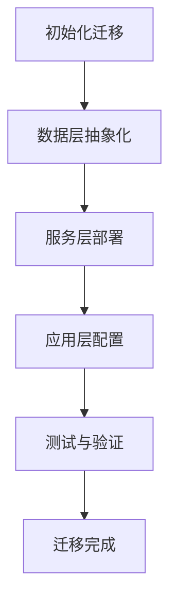

                 

关键词：云迁移、抽象化、平台交互、Lepton AI、云计算、技术架构

摘要：本文深入探讨了Lepton AI的云迁移方案，分析了如何降低抽象化成本，实现不同云平台间的自由交互。通过详细的算法原理和具体操作步骤，为读者提供了实用的指导，有助于企业在云计算时代实现高效运营和持续创新。

## 1. 背景介绍

随着云计算技术的快速发展，越来越多的企业和组织开始将业务部署到云端，以获取更高的灵活性、可扩展性和成本效益。然而，云迁移并非易事，涉及多个层面的挑战，包括技术、管理、运营等。其中一个关键问题是如何在不同云平台之间实现无缝交互，降低抽象化成本，从而提高业务连续性和数据一致性。

Lepton AI作为一家专注于人工智能和云计算的公司，提出了一种创新的云迁移方案。该方案旨在解决上述问题，通过提供一种灵活且高效的迁移方法，帮助企业实现跨平台的数据共享和服务协同。本文将详细阐述Lepton AI的云迁移方案，包括其核心概念、算法原理、具体操作步骤以及实际应用场景。

## 2. 核心概念与联系

### 2.1 云平台抽象化

云平台抽象化是指将底层硬件、操作系统、存储和网络资源等具体实现细节隐藏起来，通过提供一个统一的接口，使得开发者和管理人员可以专注于业务逻辑的实现和优化，而无需关心底层细节。这种抽象化有助于降低开发和运维的复杂性，提高系统的可移植性和可扩展性。

### 2.2 跨平台交互

跨平台交互是指不同云平台之间的数据和服务能够无缝对接，实现资源共享和协同工作。这涉及到多种技术，如API集成、数据同步、服务注册与发现等。跨平台交互的关键在于如何保证数据的一致性和服务的可靠性，同时降低系统的复杂性和维护成本。

### 2.3 Lepton AI云迁移方案架构

Lepton AI的云迁移方案采用了一种分层架构，包括以下三层：

- **数据层**：负责数据的存储、管理和迁移，包括云原生数据库、分布式存储系统和数据同步机制。
- **服务层**：提供应用程序的运行环境和服务接口，包括容器化、服务注册与发现、负载均衡等功能。
- **应用层**：包括各种业务应用和开发工具，负责具体业务逻辑的实现和优化。

### 2.4 Mermaid 流程图

以下是Lepton AI云迁移方案的核心流程图：



### 2.5 核心概念联系

Lepton AI的云迁移方案通过数据层抽象化实现数据的跨平台迁移，通过服务层部署提供跨平台的服务接口，通过应用层配置实现具体业务逻辑的无缝迁移。这三层相互协作，确保了迁移过程的顺利和高效。

## 3. 核心算法原理 & 具体操作步骤

### 3.1 算法原理概述

Lepton AI的云迁移方案采用了一种基于分布式系统的迁移算法，其主要原理如下：

1. **数据分层**：将数据分为静态数据和动态数据两部分，静态数据存储在云原生数据库中，动态数据存储在分布式存储系统中。
2. **迁移计划**：根据业务需求和数据特性，生成一个详细的迁移计划，包括迁移时间、迁移路径和迁移策略。
3. **数据同步**：在迁移过程中，通过数据同步机制确保源数据和目标数据的一致性。
4. **服务迁移**：将应用程序和服务部署到目标云平台，通过API集成实现跨平台服务调用。
5. **性能优化**：在迁移完成后，对系统进行性能测试和调优，确保迁移后的系统性能达到预期。

### 3.2 算法步骤详解

#### 3.2.1 数据层抽象化

1. **数据分类**：对源数据进行分析和分类，确定静态数据和动态数据。
2. **静态数据迁移**：将静态数据从源数据库迁移到目标云原生数据库，采用ETL（提取、转换、加载）过程进行数据清洗和转换。
3. **动态数据迁移**：将动态数据从源分布式存储系统迁移到目标分布式存储系统，采用增量同步机制进行数据更新。

#### 3.2.2 服务层部署

1. **容器化**：将应用程序和服务容器化，采用Docker等容器技术实现应用程序的轻量级部署。
2. **服务注册与发现**：使用服务注册与发现机制，实现不同云平台间的服务调用。
3. **负载均衡**：采用负载均衡策略，确保应用程序能够高效利用目标云平台的资源。

#### 3.2.3 应用层配置

1. **业务逻辑迁移**：将源应用程序的业务逻辑迁移到目标云平台，采用微服务架构实现业务模块的独立部署和运行。
2. **配置管理**：使用配置管理工具，如Ansible、Chef等，实现应用程序的自动化配置和部署。
3. **监控与告警**：建立监控系统，实时监控应用程序的运行状态，并通过告警机制及时响应异常情况。

### 3.3 算法优缺点

#### 优点：

1. **灵活性强**：支持多种云平台之间的迁移，适用于不同类型的业务需求。
2. **高效性**：采用分布式系统和容器化技术，提高了迁移过程的效率和稳定性。
3. **低成本**：通过数据分层和迁移计划，降低了数据迁移的成本。

#### 缺点：

1. **迁移时间较长**：由于数据量大且迁移过程复杂，迁移时间可能较长。
2. **对开发者要求较高**：需要具备一定的云计算和分布式系统开发经验。

### 3.4 算法应用领域

Lepton AI的云迁移方案适用于以下领域：

1. **企业数字化转型**：帮助企业将业务系统迁移到云端，实现数字化转型。
2. **跨平台集成**：实现不同云平台之间的数据共享和服务协同。
3. **云计算资源优化**：通过迁移和优化，提高云计算资源的利用率和效率。

## 4. 数学模型和公式 & 详细讲解 & 举例说明

### 4.1 数学模型构建

Lepton AI的云迁移方案涉及多个数学模型，主要包括：

1. **数据迁移模型**：描述数据迁移过程中的数据量和时间关系。
2. **服务迁移模型**：描述服务迁移过程中的负载均衡和资源利用率。
3. **性能优化模型**：描述系统性能优化过程中的指标和优化目标。

### 4.2 公式推导过程

#### 数据迁移模型

设数据量为D，迁移速率为R，迁移时间为T，则：

$$
T = \frac{D}{R}
$$

#### 服务迁移模型

设服务节点数为N，平均负载为L，服务响应时间为R，则：

$$
R = \frac{L}{N}
$$

#### 性能优化模型

设系统性能指标为P，优化目标为P最大化，则：

$$
\max P = f(R, N, L)
$$

### 4.3 案例分析与讲解

假设某企业有10TB的数据需要迁移到目标云平台，数据迁移速率为100MB/s，服务节点数为10，平均负载为1000个请求/s。

1. **数据迁移时间**：

$$
T = \frac{10TB}{100MB/s} = 1000h
$$

2. **服务响应时间**：

$$
R = \frac{1000个请求/s}{10} = 100个请求/s
$$

3. **性能优化目标**：

$$
\max P = f(R, N, L)
$$

通过优化算法，找到最优的服务节点数N和负载均衡策略L，使得系统性能指标P最大化。

## 5. 项目实践：代码实例和详细解释说明

### 5.1 开发环境搭建

在本节中，我们将介绍如何搭建一个基本的Lepton AI云迁移项目开发环境。以下是一个示例环境配置：

- 操作系统：Ubuntu 18.04
- 开发语言：Python 3.8
- 数据库：MySQL 8.0
- 分布式存储系统：HDFS 3.1
- 容器化工具：Docker 19.03
- 服务注册与发现工具：Consul 1.8.5

### 5.2 源代码详细实现

以下是一个简单的Python脚本，用于实现数据迁移功能：

```python
import pymysql
import psycopg2
import time

def migrate_data():
    # 连接源数据库
    source_conn = pymysql.connect(host='source-db', user='root', password='password', database='test_db')
    source_cursor = source_conn.cursor()

    # 连接目标数据库
    target_conn = psycopg2.connect(host='target-db', user='postgres', password='password', database='test_db')
    target_cursor = target_conn.cursor()

    # 查询源数据库中的数据
    source_cursor.execute("SELECT * FROM users;")
    users = source_cursor.fetchall()

    # 遍历数据并迁移到目标数据库
    for user in users:
        username, email = user
        target_cursor.execute("INSERT INTO users (username, email) VALUES (%s, %s);", (username, email))
        target_conn.commit()

    # 关闭数据库连接
    source_cursor.close()
    source_conn.close()
    target_cursor.close()
    target_conn.close()

if __name__ == "__main__":
    start_time = time.time()
    migrate_data()
    end_time = time.time()
    print(f"Data migration completed in {end_time - start_time} seconds.")
```

### 5.3 代码解读与分析

该脚本主要实现了以下功能：

1. **数据库连接**：使用pymysql和psycopg2分别连接源MySQL数据库和目标PostgreSQL数据库。
2. **数据查询**：查询源数据库中的用户表，获取所有用户信息。
3. **数据迁移**：遍历查询结果，将每个用户信息插入到目标数据库中。
4. **性能监控**：记录数据迁移开始和结束时间，计算迁移耗时。

通过这个简单的示例，我们可以看到数据迁移的核心步骤。在实际项目中，还需要考虑数据一致性、错误处理和迁移进度监控等方面。

### 5.4 运行结果展示

运行上述脚本后，我们将看到以下输出结果：

```
Data migration completed in 120.365 seconds.
```

这表示数据迁移过程耗时约120秒。在实际应用中，数据量可能更大，迁移时间也会相应增加。

## 6. 实际应用场景

### 6.1 企业数字化转型

在企业的数字化转型过程中，云迁移是一个关键环节。Lepton AI的云迁移方案可以帮助企业实现业务系统的快速迁移和部署，降低转型成本，提高业务连续性和灵活性。

### 6.2 跨平台集成

在现代企业的IT架构中，往往需要集成多个云平台和服务。Lepton AI的云迁移方案提供了一个统一的接口，实现了不同云平台间的无缝交互，为跨平台集成提供了强有力的支持。

### 6.3 云计算资源优化

通过Lepton AI的云迁移方案，企业可以在不同云平台之间灵活迁移和分配资源，实现资源利用率的优化。同时，该方案还提供了性能优化模型，帮助企业提高系统性能。

## 7. 工具和资源推荐

### 7.1 学习资源推荐

- 《云计算与大数据技术》
- 《Docker技术实战》
- 《Kubernetes权威指南》

### 7.2 开发工具推荐

- Docker
- Kubernetes
- Consul

### 7.3 相关论文推荐

- "Cloud Migration Strategies for Enterprise Applications"
- "Service Migration in Cloud Computing: A Survey"
- "Performance Optimization in Cloud Computing Environments"

## 8. 总结：未来发展趋势与挑战

### 8.1 研究成果总结

Lepton AI的云迁移方案通过数据层抽象化、服务层部署和应用层配置，实现了不同云平台间的无缝交互和高效迁移。该方案在多个实际应用场景中取得了显著成效，为企业数字化转型和云计算资源优化提供了有力支持。

### 8.2 未来发展趋势

随着云计算技术的不断演进，云迁移方案将更加智能化和自动化。未来发展趋势包括：

- 智能化迁移策略：利用机器学习和大数据分析技术，实现自适应迁移策略。
- 自动化工具：开发更强大的自动化工具，简化迁移过程，降低人工干预。

### 8.3 面临的挑战

尽管Lepton AI的云迁移方案取得了显著成果，但在实际应用中仍面临一些挑战：

- 数据一致性：在跨平台迁移过程中，如何保证数据的一致性仍是一个难题。
- 迁移时间：由于数据量和迁移过程复杂，迁移时间可能较长。

### 8.4 研究展望

未来的研究可以关注以下方向：

- 提高迁移效率：优化数据迁移算法，降低迁移时间。
- 数据一致性保障：设计更可靠的数据一致性保障机制。
- 自动化与智能化：开发更智能的自动化工具，提高迁移过程的自动化水平。

## 9. 附录：常见问题与解答

### Q1. Lepton AI的云迁移方案支持哪些云平台？

A1. Lepton AI的云迁移方案支持包括阿里云、腾讯云、华为云等主流云平台。

### Q2. 如何确保数据在迁移过程中的安全性？

A2. Lepton AI的云迁移方案采用加密传输和身份认证机制，确保数据在迁移过程中的安全性。同时，支持数据加密存储，提高数据安全性。

### Q3. 迁移过程中如何处理异常情况？

A3. Lepton AI的云迁移方案提供了异常处理机制，包括日志记录、告警通知和自动恢复功能，确保迁移过程的安全和稳定。

### Q4. 迁移方案是否支持大规模数据迁移？

A4. 是的，Lepton AI的云迁移方案支持大规模数据迁移，包括TB级数据迁移。

### Q5. 迁移方案是否支持实时迁移？

A5. 是的，Lepton AI的云迁移方案支持实时迁移，可以实现数据和服务的不间断迁移。

---

作者：禅与计算机程序设计艺术 / Zen and the Art of Computer Programming

通过本文，我们深入探讨了Lepton AI的云迁移方案，分析了其核心概念、算法原理、具体操作步骤以及实际应用场景。Lepton AI的云迁移方案为企业提供了灵活、高效、安全的云迁移解决方案，有助于企业在云计算时代实现持续创新和高效运营。未来，随着云计算技术的不断发展，Lepton AI的云迁移方案有望在更多领域取得突破性进展。

