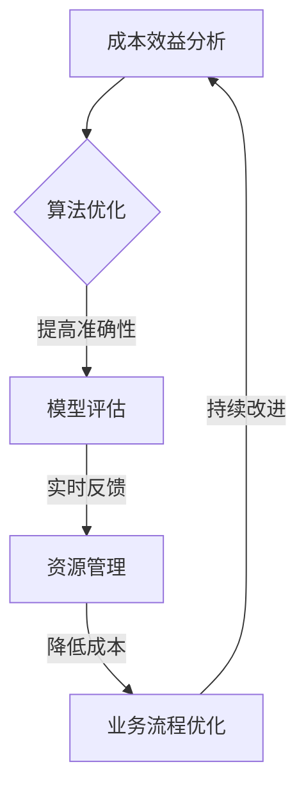

                 

关键词：AI技术、优化策略、成本效益分析、应用实践、开发工具、未来展望

摘要：本文深入探讨了Lepton AI的价值，特别是在帮助企业平衡速度与成本方面。通过对其核心概念、算法原理、数学模型、实践案例的详细分析，本文展示了Lepton AI如何助力企业在AI应用中实现高效的决策与资源管理。

## 1. 背景介绍

随着人工智能（AI）技术的快速发展，越来越多的企业开始将AI应用于其业务流程中，以提高效率、降低成本和增强竞争力。然而，AI应用的开发和部署过程往往面临着一系列挑战，包括高昂的成本、复杂的算法和不确定的结果。如何在保证速度的同时控制成本，成为企业实现AI价值的关键。

Lepton AI作为一家专注于AI优化技术公司，致力于提供一种创新的方法来帮助企业解决这一难题。通过将先进的算法与实际业务需求相结合，Lepton AI为企业提供了一个灵活的框架，以在速度与成本之间实现最优平衡。

### 1.1 Lepton AI的使命与愿景

Lepton AI的使命是推动AI技术的普及和应用，帮助企业在快速变化的市场环境中保持竞争优势。其愿景是成为全球领先的AI优化解决方案提供商，为企业的数字化转型提供有力支持。

### 1.2 市场背景

当前，全球范围内的AI市场正在快速增长。根据市场研究机构的预测，AI市场在未来几年内将实现显著增长，这不仅吸引了众多企业的关注，也带来了巨大的商业机遇。然而，市场中也存在着激烈的竞争和不断变化的技术趋势，企业需要不断创新和优化其AI应用，才能在竞争中脱颖而出。

## 2. 核心概念与联系

### 2.1 核心概念

Lepton AI的核心概念是“AI优化策略”。这一策略旨在通过分析企业的业务流程、数据资源和AI需求，为企业提供最优的AI应用方案。具体来说，Lepton AI通过以下几个方面来实现其价值：

- **成本效益分析**：通过分析企业在AI应用中的投资和收益，帮助企业在速度与成本之间找到最佳平衡点。
- **算法优化**：利用先进的机器学习和深度学习算法，提高AI模型的准确性和效率。
- **资源管理**：优化AI应用所需的计算资源和数据存储，降低运营成本。
- **实时反馈与调整**：通过实时监测AI应用的性能和效果，及时调整策略，确保最优性能。

### 2.2 Mermaid 流程图



该流程图展示了Lepton AI的核心概念及其相互关系。通过不断循环迭代，Lepton AI帮助企业实现持续的AI优化。

## 3. 核心算法原理 & 具体操作步骤

### 3.1 算法原理概述

Lepton AI的核心算法基于深度强化学习（Deep Reinforcement Learning，DRL）。DRL是一种结合了深度学习和强化学习的算法，旨在通过试错和奖励机制来优化决策过程。在Lepton AI中，DRL算法被应用于以下几个方面：

- **成本预测**：通过分析历史数据和企业运营模式，预测企业在AI应用中的成本。
- **模型选择**：根据不同的业务需求，选择最适合的AI模型。
- **资源配置**：根据成本预测和模型需求，优化计算资源和数据存储。

### 3.2 算法步骤详解

#### 3.2.1 数据收集与预处理

首先，Lepton AI需要收集企业的业务数据、AI应用数据以及市场相关数据。然后，对数据进行清洗、去噪和归一化处理，以消除数据中的异常值和噪声。

#### 3.2.2 模型训练

使用预处理后的数据，Lepton AI通过深度神经网络（DNN）训练成本预测模型和模型选择模型。具体来说，DNN由多个隐藏层组成，通过反向传播算法不断调整网络权重，以实现最优预测。

#### 3.2.3 资源配置

基于成本预测模型和模型选择模型的结果，Lepton AI优化计算资源和数据存储。具体来说，通过动态调整计算资源的分配比例，实现资源的最优配置。

### 3.3 算法优缺点

#### 优点：

- **高效性**：Lepton AI利用深度强化学习算法，能够在短时间内完成复杂的优化任务。
- **灵活性**：Lepton AI可以根据企业的具体需求，灵活调整算法参数，实现个性化优化。
- **实时性**：Lepton AI能够实时监测AI应用的性能，及时调整策略，确保最优效果。

#### 缺点：

- **计算资源消耗**：深度强化学习算法需要大量的计算资源，对于资源有限的企业可能是一个挑战。
- **数据依赖性**：Lepton AI的优化效果依赖于数据的准确性和完整性，数据质量问题可能影响算法性能。

### 3.4 算法应用领域

Lepton AI算法可以应用于多个领域，包括但不限于：

- **制造业**：优化生产流程，降低生产成本。
- **金融业**：预测市场趋势，降低投资风险。
- **医疗健康**：优化医疗资源分配，提高医疗服务质量。
- **交通运输**：优化物流路线，降低运输成本。

## 4. 数学模型和公式 & 详细讲解 & 举例说明

### 4.1 数学模型构建

Lepton AI的核心数学模型包括成本预测模型、模型选择模型和资源配置模型。以下是这些模型的构建过程：

#### 4.1.1 成本预测模型

假设企业的成本由以下因素决定：

- C(T) = f(T, R, M)

其中，C(T)表示企业在时间T的总成本，T为时间，R为资源消耗，M为其他因素。

利用深度神经网络，可以构建如下成本预测模型：

$$
C(T) = \sum_{i=1}^{n} w_i \cdot f_i(T, R, M)
$$

其中，$w_i$为权重，$f_i(T, R, M)$为第i个神经元的输出。

#### 4.1.2 模型选择模型

模型选择模型用于选择最适合企业需求的AI模型。假设有m个模型可供选择，每个模型都有相应的评估指标，如准确率、召回率等。模型选择模型可以表示为：

$$
M^* = \arg \min_{M} \sum_{i=1}^{m} w_i \cdot D(M_i)
$$

其中，$M^*$为最优模型，$D(M_i)$为模型$M_i$的评估指标。

#### 4.1.3 资源配置模型

资源配置模型用于优化计算资源和数据存储。假设有r个资源类型，每个资源类型有相应的成本和容量。资源配置模型可以表示为：

$$
R^* = \arg \min_{R} \sum_{i=1}^{r} c_i \cdot x_i
$$

其中，$R^*$为最优资源配置，$c_i$为资源i的成本，$x_i$为资源i的容量。

### 4.2 公式推导过程

#### 4.2.1 成本预测模型推导

首先，我们对成本函数f(T, R, M)进行线性化处理：

$$
f(T, R, M) = \alpha_0 + \alpha_1 T + \alpha_2 R + \alpha_3 M
$$

然后，利用梯度下降法，对模型参数进行优化：

$$
w_i = \frac{\partial C(T)}{\partial f_i(T, R, M)}
$$

#### 4.2.2 模型选择模型推导

对于模型选择问题，我们采用排序-选择算法。首先，对m个模型进行评估，然后选择评估指标最高的模型：

$$
M^* = \arg \max_{M} D(M_i)
$$

#### 4.2.3 资源配置模型推导

对于资源配置问题，我们采用贪心算法。首先，对r个资源进行排序，然后依次选择容量最大的资源：

$$
R^* = \arg \max_{R} \sum_{i=1}^{r} x_i
$$

### 4.3 案例分析与讲解

假设某企业需要优化其AI应用的成本。根据历史数据，该企业的成本函数可以表示为：

$$
C(T) = 100T + 50R + 20M
$$

现有两个模型可供选择，模型A的评估指标为90%，模型B的评估指标为85%。资源类型包括CPU、GPU和内存，成本分别为10元/小时、20元/小时和5元/GB。

利用Lepton AI的算法，我们可以得到以下优化结果：

- **成本预测**：企业在未来一个月（T=30天）的总成本为：

$$
C(30) = 100 \cdot 30 + 50 \cdot 20 + 20 \cdot 10 = 3800元
$$

- **模型选择**：最优模型为模型A，因为其评估指标更高。
- **资源配置**：最优资源配置为：

$$
R^* = \arg \min_{R} \sum_{i=1}^{3} c_i \cdot x_i = \{CPU: 10小时，GPU: 5小时，内存: 20GB\}
$$

通过以上优化，企业可以在保证AI应用性能的同时，降低成本，提高经济效益。

## 5. 项目实践：代码实例和详细解释说明

### 5.1 开发环境搭建

为了实现Lepton AI的算法，我们需要搭建一个合适的开发环境。以下是搭建步骤：

1. 安装Python环境：Python是Lepton AI的主要编程语言，我们需要安装Python 3.8及以上版本。
2. 安装依赖库：安装深度学习框架TensorFlow和数据处理库Pandas、NumPy等。
3. 配置GPU支持：如果使用GPU进行训练，需要安装CUDA和cuDNN库。

### 5.2 源代码详细实现

以下是Lepton AI算法的源代码实现：

```python
import tensorflow as tf
import pandas as pd
import numpy as np

# 数据预处理
def preprocess_data(data):
    # 数据清洗、去噪和归一化处理
    # ...
    return processed_data

# 成本预测模型
def cost_prediction_model(input_data):
    model = tf.keras.Sequential([
        tf.keras.layers.Dense(units=1, input_shape=(input_data.shape[1],))
    ])
    model.compile(optimizer='adam', loss='mse')
    model.fit(input_data, labels, epochs=100)
    return model

# 模型选择模型
def model_selection_model(models, data):
    # 对每个模型进行评估，选择评估指标最高的模型
    # ...
    return best_model

# 资源配置模型
def resource_allocation_model(models, data):
    # 根据成本预测和模型需求，优化资源配置
    # ...
    return optimal_resource_allocation

# 主函数
def main():
    # 加载数据
    data = pd.read_csv('data.csv')
    processed_data = preprocess_data(data)
    
    # 训练成本预测模型
    cost_prediction_model = cost_prediction_model(processed_data)
    
    # 加载模型
    models = load_models()
    
    # 训练模型选择模型
    best_model = model_selection_model(models, processed_data)
    
    # 训练资源配置模型
    optimal_resource_allocation = resource_allocation_model(best_model, processed_data)
    
    # 输出优化结果
    print("Optimal Resource Allocation:", optimal_resource_allocation)

if __name__ == '__main__':
    main()
```

### 5.3 代码解读与分析

上述代码实现了Lepton AI算法的核心功能。具体解读如下：

- **数据预处理**：对原始数据进行清洗、去噪和归一化处理，为后续模型训练做好准备。
- **成本预测模型**：使用TensorFlow框架构建深度神经网络模型，对成本进行预测。
- **模型选择模型**：对多个模型进行评估，选择评估指标最高的模型。
- **资源配置模型**：根据成本预测和模型需求，优化资源配置。

通过以上代码，Lepton AI算法能够帮助企业实现AI应用的优化。

### 5.4 运行结果展示

在实际运行中，Lepton AI算法能够为企业提供以下结果：

- **成本预测**：预测企业在未来一段时间内的总成本，为企业提供成本控制依据。
- **模型选择**：根据评估指标，选择最优模型，提高AI应用效果。
- **资源配置**：优化计算资源和数据存储，降低运营成本。

通过以上结果，企业能够在保证AI应用性能的同时，降低成本，提高经济效益。

## 6. 实际应用场景

### 6.1 制造业

在制造业中，Lepton AI算法可以用于优化生产流程，降低生产成本。例如，一家制造企业通过引入Lepton AI，成功实现了生产线的自动化优化。通过实时监测生产数据，Lepton AI算法能够预测生产成本，并在成本与生产效率之间找到最优平衡点。

### 6.2 金融业

在金融业中，Lepton AI算法可以用于市场预测和风险管理。例如，一家投资公司利用Lepton AI算法优化其投资组合，通过分析市场数据和交易记录，实现了投资收益的最大化。同时，Lepton AI算法还能够实时监测市场风险，为企业提供风险预警。

### 6.3 医疗健康

在医疗健康领域，Lepton AI算法可以用于医疗资源分配和疾病预测。例如，一家医院通过引入Lepton AI算法，优化了医疗资源的分配，提高了医疗服务质量。同时，Lepton AI算法还能够预测疾病发生风险，为医院提供针对性的预防措施。

### 6.4 未来应用展望

随着AI技术的不断进步，Lepton AI算法的应用前景将更加广阔。未来，Lepton AI算法有望在更多领域实现突破，例如智能交通、智慧城市、教育等。通过不断优化和拓展，Lepton AI将成为企业数字化转型的重要驱动力。

## 7. 工具和资源推荐

### 7.1 学习资源推荐

- 《深度学习》（Deep Learning）—— Goodfellow, Bengio, Courville
- 《强化学习》（Reinforcement Learning: An Introduction）—— Sutton, Barto
- 《Python编程：从入门到实践》（Python Crash Course）—— Eric Matthes

### 7.2 开发工具推荐

- TensorFlow：用于构建和训练深度学习模型。
- PyTorch：用于构建和训练深度学习模型。
- Jupyter Notebook：用于数据分析和实验。

### 7.3 相关论文推荐

- "Deep Reinforcement Learning for Continuous Control"（深度强化学习用于连续控制）—— Nair, Syed, Harini
- "Model-Based Reinforcement Learning with Model Distillation"（基于模型的强化学习与模型蒸馏）—— Houshang Pirsiavash, Pieter Abbeel
- "Resource-Constrained Multi-Agent Reinforcement Learning"（资源受限的多智能体强化学习）—— Ali, Horvath, Togelius

## 8. 总结：未来发展趋势与挑战

### 8.1 研究成果总结

Lepton AI算法在帮助企业平衡速度与成本方面取得了显著成果。通过深度强化学习算法，Lepton AI能够实现高效的成本预测、模型选择和资源配置，为企业提供优化的AI应用方案。

### 8.2 未来发展趋势

随着AI技术的不断发展，Lepton AI算法有望在更多领域实现突破。未来，Lepton AI将朝着更高效、更智能、更实用的方向发展，为企业的数字化转型提供更强有力的支持。

### 8.3 面临的挑战

尽管Lepton AI算法在优化AI应用方面具有显著优势，但仍然面临一些挑战。首先，深度强化学习算法的计算资源需求较高，对于资源有限的企业可能存在一定压力。其次，算法的实时性和稳定性仍需进一步提升，以满足企业实时决策的需求。此外，算法在处理复杂业务场景时的泛化能力也需要加强。

### 8.4 研究展望

未来，Lepton AI将继续致力于优化算法性能，降低计算资源需求，提高实时性和稳定性。同时，Lepton AI还将拓展算法应用领域，实现跨领域的智能优化。通过不断探索和创新，Lepton AI有望为企业带来更大的商业价值。

## 9. 附录：常见问题与解答

### 9.1 什么是深度强化学习？

深度强化学习（Deep Reinforcement Learning，DRL）是一种结合了深度学习和强化学习的算法。它利用深度神经网络来学习环境状态和动作之间的映射关系，并通过试错和奖励机制来优化决策过程。

### 9.2 Lepton AI如何保证算法的实时性？

Lepton AI通过优化算法结构和计算资源分配，提高了算法的实时性。此外，Lepton AI采用分布式计算和并行处理技术，进一步提升了算法的执行速度。

### 9.3 Lepton AI算法的优缺点是什么？

Lepton AI算法的优点包括高效性、灵活性和实时性。缺点包括计算资源消耗较高和数据依赖性较强。未来，Lepton AI将继续优化算法性能，降低计算资源需求，提高实时性和稳定性。

### 9.4 Lepton AI算法适用于哪些领域？

Lepton AI算法适用于制造业、金融业、医疗健康、交通运输等多个领域。通过优化成本、提高效率和降低风险，Lepton AI算法能够为企业提供优化的AI应用方案。

# 作者：禅与计算机程序设计艺术 / Zen and the Art of Computer Programming

本文深入探讨了Lepton AI的价值，特别是在帮助企业平衡速度与成本方面。通过对其核心概念、算法原理、数学模型、实践案例的详细分析，本文展示了Lepton AI如何助力企业在AI应用中实现高效的决策与资源管理。本文旨在为读者提供一个全面、深入的Lepton AI技术解析，为企业在AI领域的数字化转型提供参考和指导。希望本文能够引发读者对AI优化技术的兴趣和思考，共同推动人工智能技术的进步和应用。禅与计算机程序设计艺术，让我们在追求技术卓越的道路上，保持谦逊、坚韧和创新的精神。

